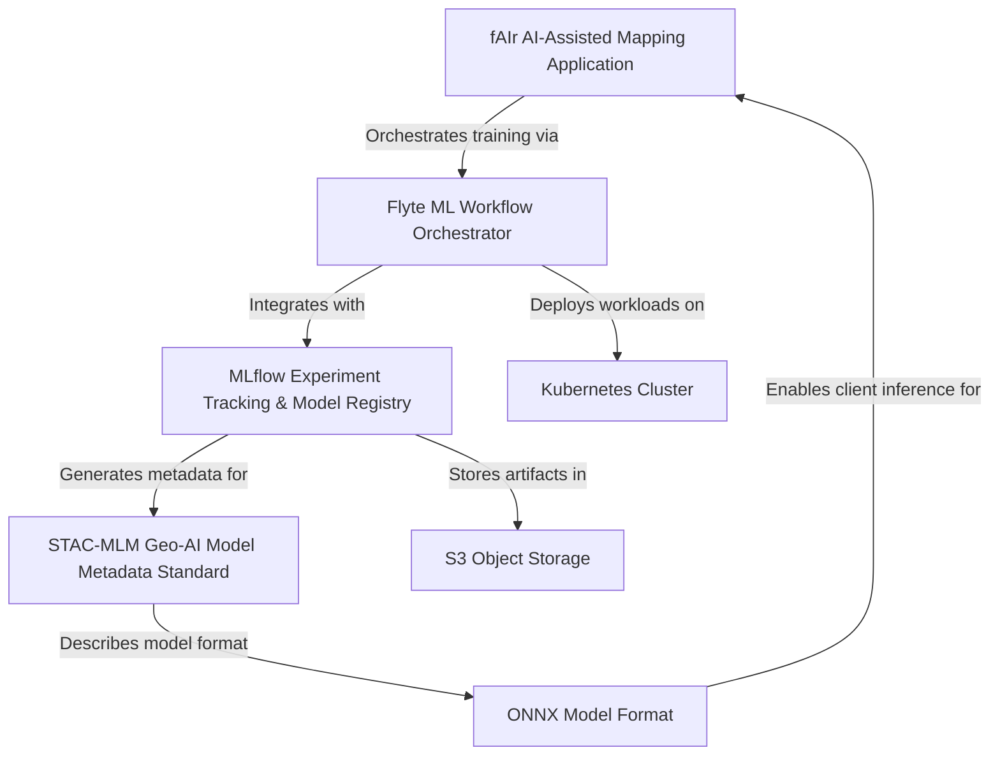
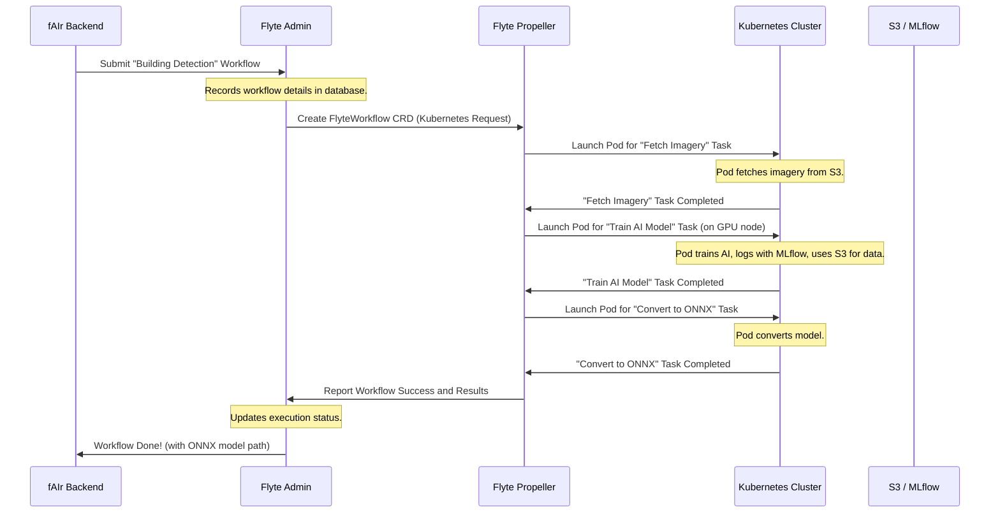

# fAIr 3.0 Planning

- fAIr is currently tied to AWS and uses a Celery job queue.
- A new version will be migrated to Kubernetes inside AWS,
  with the workflow orchestration handled by a MLOps tool
  such as Flyte.
- Versioning of workflows will be possible, with ML lineage
  tracking, easily accessible models, and consistent metadata
  exposed by a STAC extension.
- In the end, fAIr 3.0 will empower end users to generate
  and iterate on models, creating a marketplace for open
  and fair geo-AI model creation.

See [current architecture](./deepwiki_scrape/hotosm/fAIr/1_Overview.md).
See [planned architecture](./planned_architecture.md).

## Overall Architecture Diagram

## Flyte Integration Diagram

