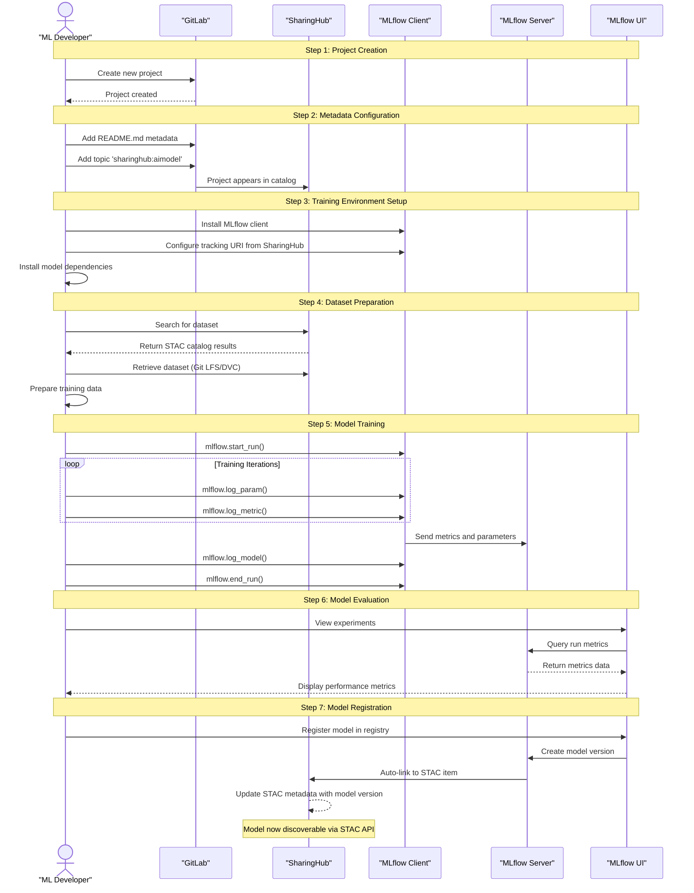
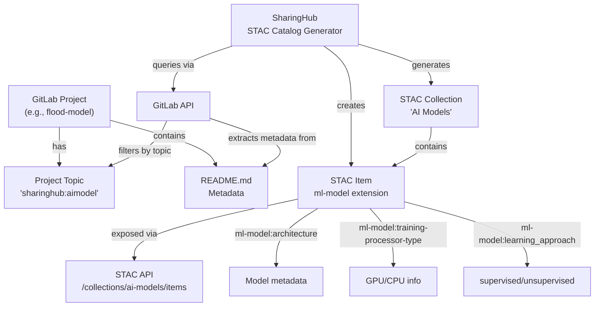
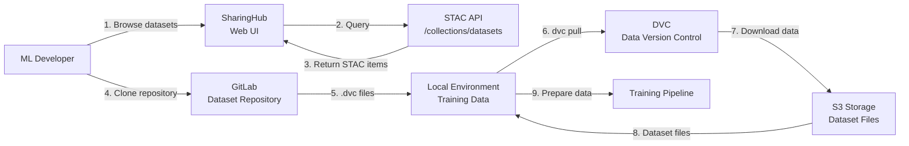
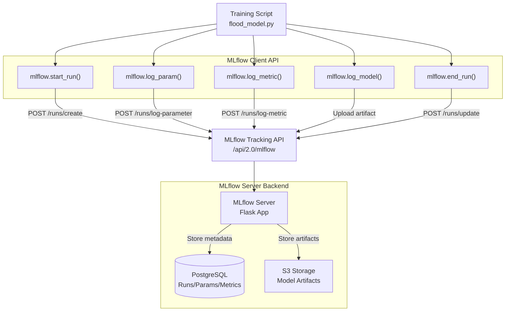
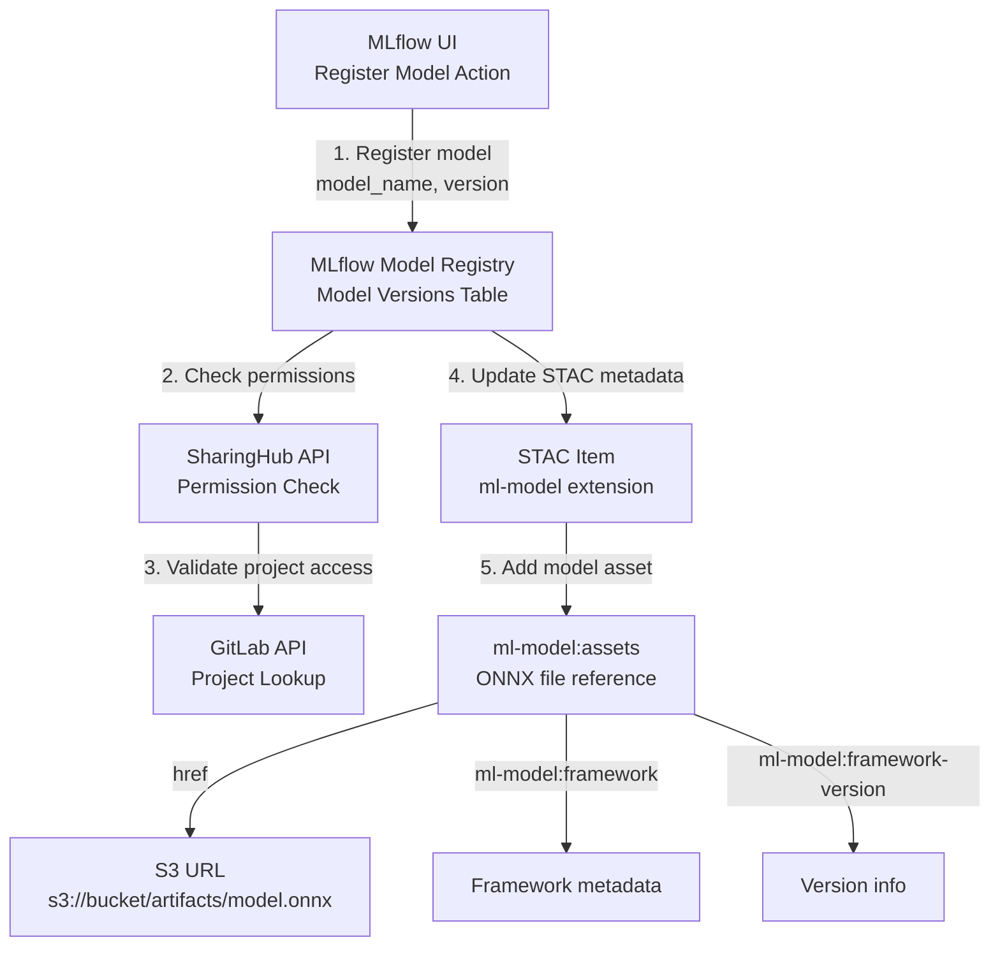

# Model Training Workflow

<details>
<summary>Relevant source files</summary>

The following files were used as context for generating this wiki page:

- [docs/design/diagrams/use-cases.drawio.png](docs/design/diagrams/use-cases.drawio.png)
- [docs/design/scenarios/flood-example.md](docs/design/scenarios/flood-example.md)
- [docs/design/scenarios/model-training.md](docs/design/scenarios/model-training.md)
- [docs/design/use-cases.md](docs/design/use-cases.md)
- [mkdocs.yml](mkdocs.yml)

</details>


## Purpose and Scope

This page provides a step-by-step guide through the complete model training lifecycle using the EOEPCA MLOps Building Block. It covers the process from initial project creation in GitLab through experiment tracking with MLflow to final model registration and publication in SharingHub's STAC catalog.

For detailed component architecture, see [Architecture](#2). For a practical worked example using a flood detection model, see [Flood Detection Example](#4.3). For dataset management workflows, see [Dataset Management](#4.2).

Sources: [docs/design/scenarios/model-training.md:1-53]()

## Overview

The model training workflow involves three core components working together:

| Component | Role in Training Workflow |
|-----------|---------------------------|
| **GitLab** | Project repository, version control, collaboration |
| **MLflow SharingHub** | Experiment tracking, metrics logging, model registry |
| **SharingHub** | Dataset discovery, model publication, STAC metadata |

The workflow is designed for ML Developers who need to train, evaluate, and share AI models within a collaborative environment. The platform supports popular ML frameworks and uses ONNX as the standard model representation format.

Sources: [docs/design/scenarios/model-training.md:1-53](), [docs/design/use-cases.md:17-69]()

## Complete Workflow Diagram



Sources: [docs/design/scenarios/model-training.md:1-53]()

## Prerequisites

Before starting the model training workflow, ensure the following are available:

| Prerequisite | Description | Reference |
|--------------|-------------|-----------|
| GitLab Account | User account with project creation permissions | [GitLab Deployment](#5.2) |
| MLflow Access | Access to MLflow SharingHub tracking server | [MLflow SharingHub Deployment](#5.4) |
| SharingHub Access | Access to SharingHub for dataset discovery | [SharingHub Deployment](#5.3) |
| Local Environment | Python environment with MLflow client installed | - |
| Training Data | Dataset available via SharingHub or external source | [Dataset Management](#4.2) |

Sources: [docs/design/scenarios/model-training.md:23-33]()

## Step 1: Project Creation in GitLab

The workflow begins with creating a new project in GitLab, which serves as the version control repository for model code, training scripts, and configuration files.

### Actions

1. **Login to GitLab**: Authenticate using OIDC credentials via Keycloak
2. **Create New Project**: Navigate to "New project" in GitLab UI
3. **Configure Repository**: Set project name, visibility, and initialization options
4. **Clone Repository**: Clone the project to local development environment

### Key Components

- **GitLab OAuth Client**: Handles authentication flow with Keycloak
- **GitLab API**: Provides programmatic access for project operations
- **Git Repository**: Stores model source code and training artifacts

Sources: [docs/design/scenarios/model-training.md:13-15]()

## Step 2: Project Metadata and SharingHub Integration

After project creation, metadata must be added to enable discovery and categorization in SharingHub's STAC catalog.

### Metadata Configuration

The following metadata should be added to make the project discoverable:

| Metadata Location | Purpose | Required Fields |
|-------------------|---------|-----------------|
| `README.md` | Human-readable description | Model description, usage instructions, license |
| Project Topics | SharingHub categorization | `sharinghub:aimodel` |
| Project Tags | Filtering and search | Domain-specific tags (e.g., "flood-detection", "segmentation") |

### Adding the AI Model Topic

In GitLab project settings:

1. Navigate to "Settings" → "General"
2. Add topic: `sharinghub:aimodel`
3. Add relevant tags for model categorization

This topic triggers SharingHub to:
- Create a STAC Item for the project
- Add it to the "AI Model" collection
- Enable discovery via STAC API

### SharingHub Integration Flow



Sources: [docs/design/scenarios/model-training.md:17-21](), [mkdocs.yml:15]()

## Step 3: Setting Up Training Environment

The training environment must be configured with the MLflow client and necessary dependencies.

### Environment Setup Steps

1. **Install MLflow Client**:
   ```bash
   pip install mlflow
   ```

2. **Configure MLflow Tracking URI**: Obtain from SharingHub deployment
   ```bash
   export MLFLOW_TRACKING_URI=https://sharinghub.domain/mlflow
   ```

3. **Set Authentication**: Configure MLflow credentials if authentication is enabled
   ```bash
   export MLFLOW_TRACKING_TOKEN=<token>
   ```

4. **Install Model Dependencies**: Install framework-specific libraries (PyTorch, TensorFlow, scikit-learn, etc.)

### Environment Configuration Table

| Configuration | Environment Variable | Source | Example |
|---------------|---------------------|---------|---------|
| Tracking URI | `MLFLOW_TRACKING_URI` | SharingHub MLflow endpoint | `https://sharinghub.develop.eoepca.org/mlflow` |
| Authentication Token | `MLFLOW_TRACKING_TOKEN` | User credentials or service account | `<oauth-token>` |
| Experiment Name | `MLFLOW_EXPERIMENT_NAME` | User-defined | `flood-detection-v1` |

### Computing Platform Options

The training environment can be:
- **Local Machine**: For development and small-scale training
- **Remote Computing Platform**: For production training with GPU/TPU resources
- **Kubernetes Job**: For scalable distributed training

Sources: [docs/design/scenarios/model-training.md:23-27](), [docs/design/scenarios/flood-example.md:29-33]()

## Step 4: Dataset Preparation

Before training, the appropriate dataset must be located and prepared.

### Dataset Discovery via SharingHub

1. **Browse Datasets**: Navigate to SharingHub web UI
2. **Filter by Category**: Select "Datasets" collection
3. **Search and Filter**: Use tags and text search to find relevant datasets
4. **Access STAC Metadata**: Review dataset metadata, format, and access methods

### Dataset Retrieval Methods

| Method | Use Case | Tools |
|--------|----------|-------|
| Git LFS | Small-to-medium datasets (<2GB) | `git lfs pull` |
| DVC | Large datasets, versioned data | `dvc pull` |
| Direct Download | One-time downloads | `wget`, `curl`, STAC API |
| S3 Access | Streaming access to cloud storage | `boto3`, `s3fs` |

### Dataset Preparation Workflow



Sources: [docs/design/scenarios/model-training.md:29-33](), [docs/design/scenarios/flood-example.md:34-40]()

## Step 5: Model Training and Experiment Tracking

During training, MLflow tracks experiments, parameters, metrics, and artifacts.

### MLflow Client Integration

The training script integrates with MLflow using the Python client API:

**Key MLflow Operations**:

| Operation | Method | Purpose |
|-----------|--------|---------|
| Start experiment | `mlflow.start_run()` | Begin tracking run |
| Log parameters | `mlflow.log_param(key, value)` | Record hyperparameters |
| Log metrics | `mlflow.log_metric(key, value, step)` | Record performance metrics |
| Log model | `mlflow.log_model(model, artifact_path)` | Save model artifact |
| Log artifacts | `mlflow.log_artifact(path)` | Save files (plots, configs) |
| End run | `mlflow.end_run()` | Complete tracking |

### Example Training Script Integration

While we don't output new code, a typical integration pattern would:
1. Import `mlflow` and model framework (e.g., `pytorch`, `sklearn`)
2. Call `mlflow.start_run()` at training start
3. Log hyperparameters with `mlflow.log_param()`
4. Log metrics in training loop with `mlflow.log_metric()`
5. Save final model with `mlflow.log_model()` or framework-specific flavor (e.g., `mlflow.pytorch.log_model()`)
6. Call `mlflow.end_run()` at completion

### Experiment Tracking Architecture



### Logged Information

During training, the following information is typically logged:

**Parameters (Hyperparameters)**:
- Learning rate
- Batch size
- Number of epochs
- Model architecture details
- Optimizer configuration

**Metrics**:
- Training loss (per epoch/step)
- Validation loss
- Accuracy metrics (precision, recall, F1)
- Custom evaluation metrics

**Artifacts**:
- Trained model file (`.pth`, `.h5`, `.pkl`, `.onnx`)
- Training plots and visualizations
- Configuration files
- Dataset metadata

Sources: [docs/design/scenarios/model-training.md:35-39](), [docs/design/use-cases.md:37-40]()

## Step 6: Model Evaluation

After training completes, the ML Developer evaluates model performance using the MLflow UI.

### Accessing MLflow UI

The MLflow UI is accessed via the SharingHub domain:
```
https://sharinghub.domain/mlflow
```

### Evaluation Workflow

1. **Navigate to Experiments**: View list of experiments in MLflow UI
2. **Select Run**: Click on specific training run to view details
3. **Review Metrics**: Examine logged metrics across training steps/epochs
4. **Compare Runs**: Use comparison view to evaluate multiple training runs
5. **Visualize Results**: View metric plots and artifacts
6. **Download Artifacts**: Download trained models or other artifacts

### MLflow UI Components

| UI Section | Purpose | Key Information |
|------------|---------|-----------------|
| Experiments List | Browse all experiments | Experiment names, number of runs |
| Runs Table | View runs within experiment | Run ID, metrics, parameters, start time |
| Run Detail | Detailed run information | All parameters, metrics over time, artifacts |
| Comparison View | Compare multiple runs | Side-by-side parameter and metric comparison |
| Model Registry | Manage registered models | Model versions, stages, metadata |

### Metrics Visualization

The MLflow UI provides:
- **Line Charts**: Metric trends over epochs/steps
- **Scatter Plots**: Parameter vs. metric correlations
- **Parallel Coordinates**: Multi-dimensional parameter exploration
- **Metric Tables**: Tabular view of final metric values

Sources: [docs/design/scenarios/model-training.md:41-45](), [docs/design/use-cases.md:42-50]()

## Step 7: Model Registration and Publication

Once a satisfactory model is trained, it is registered in the MLflow Model Registry and automatically linked to SharingHub's STAC catalog.

### Model Registration Process

1. **Select Best Run**: Identify the run with best performance in MLflow UI
2. **Register Model**: Click "Register Model" in the run's artifacts section
3. **Provide Model Name**: Enter a descriptive model name (e.g., `flood-detection-model`)
4. **Create Version**: MLflow creates a new model version (e.g., `1.0.0`)
5. **Auto-Linking**: MLflow SharingHub automatically links the model version to the project's STAC item

### Auto-Linking to STAC Metadata

When a model is registered, MLflow SharingHub performs the following:



### STAC ML-Model Extension

The registered model is exposed in the STAC item with the `ml-model` extension:

**Key Properties**:
- `ml-model:architecture`: Model architecture (e.g., "U-Net", "ResNet-50")
- `ml-model:framework`: Training framework (e.g., "pytorch", "tensorflow")
- `ml-model:framework-version`: Framework version
- `ml-model:learning_approach`: Learning type ("supervised", "unsupervised", "reinforcement")
- `ml-model:prediction_type`: Task type ("classification", "regression", "segmentation")
- `ml-model:training-processor-type`: Hardware used ("cpu", "gpu", "tpu")

**Assets**:
The STAC item includes an asset with the ONNX model file:
- `href`: S3 URL to the model file
- `type`: `application/x-onnx` or `application/octet-stream`
- `roles`: `["ml-model"]`

### Model Discovery

After registration, the model becomes discoverable through multiple channels:

| Discovery Method | Access Point | Audience |
|------------------|--------------|----------|
| SharingHub Web UI | Browse AI Models collection | Interactive users |
| STAC API | `/collections/ai-models/items/{model-id}` | Programmatic access |
| MLflow UI | Model Registry section | ML developers |
| GitLab Project | Project page with STAC metadata link | Collaborators |

Sources: [docs/design/scenarios/model-training.md:47-53](), [docs/design/use-cases.md:60-69]()

## Workflow Summary

The complete model training workflow integrates GitLab, MLflow SharingHub, and SharingHub to provide:

**For ML Developers**:
- Version-controlled project repositories
- Automated experiment tracking
- Visual performance evaluation
- Centralized model registry
- Automatic STAC publication

**For Model Consumers**:
- Standardized model discovery via STAC API
- ONNX model format for interoperability
- Rich metadata for model selection
- Access control through GitLab permissions

**Integration Points**:
- GitLab topics trigger SharingHub catalog generation
- MLflow client sends tracking data to MLflow server
- MLflow registry updates trigger STAC metadata updates
- SharingHub validates permissions against GitLab projects

The workflow ensures that models are properly tracked, evaluated, and shared within a collaborative MLOps environment while maintaining standardization through STAC and ONNX formats.

Sources: [docs/design/scenarios/model-training.md:1-53](), [docs/design/use-cases.md:1-96](), [mkdocs.yml:14-16]()