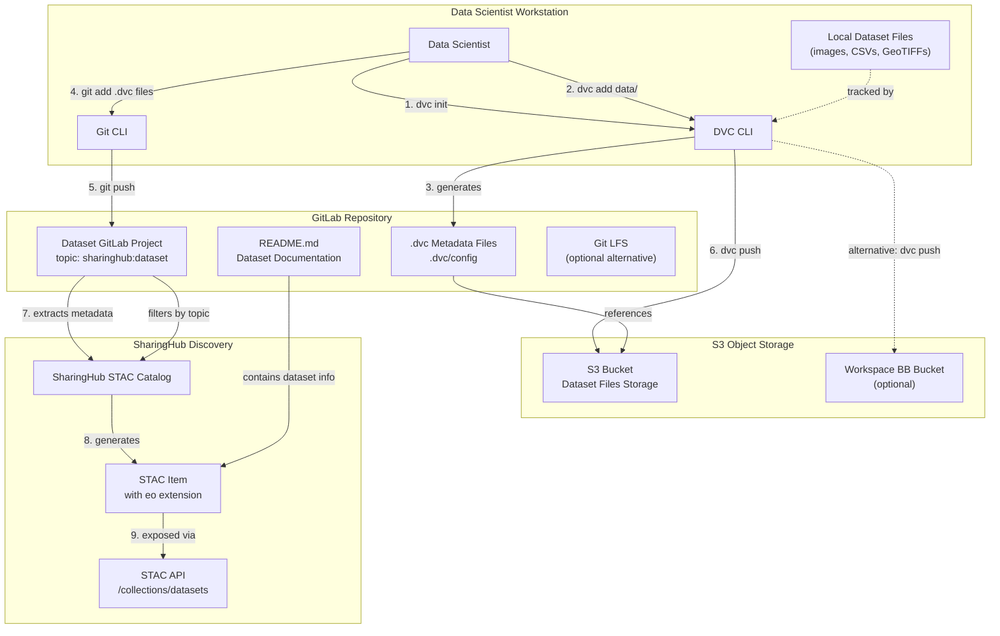
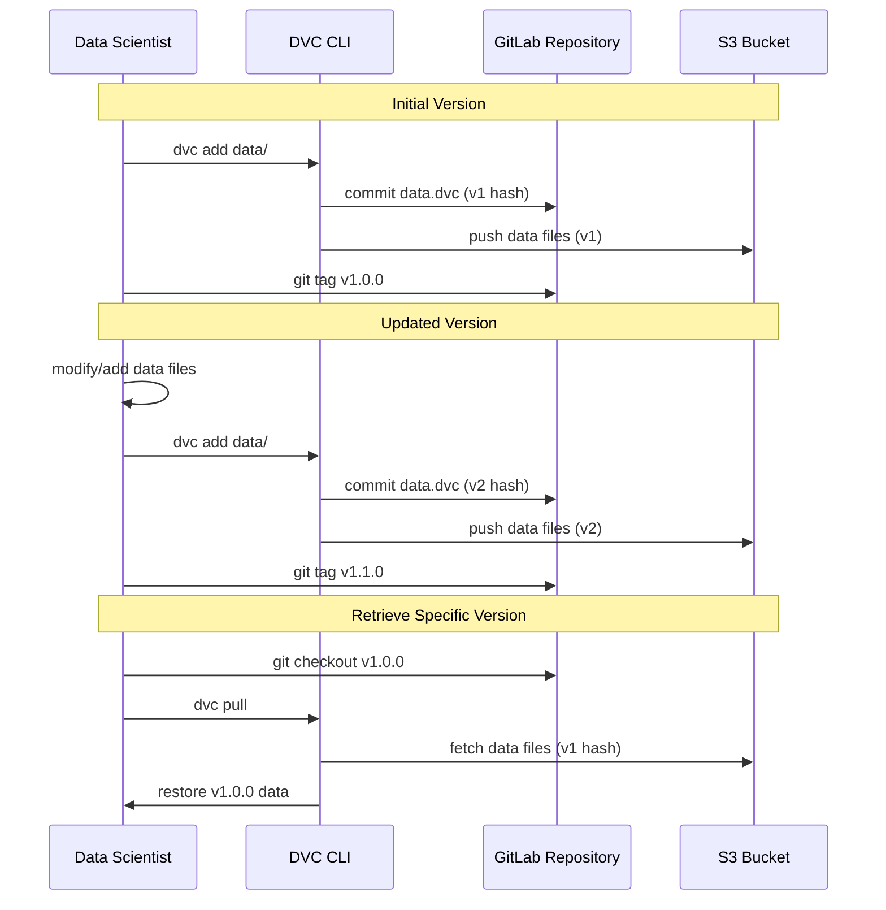
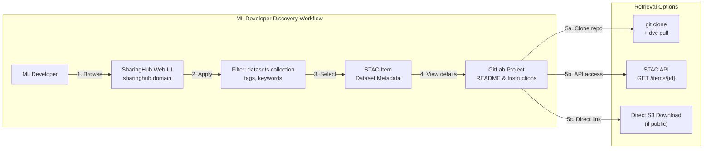
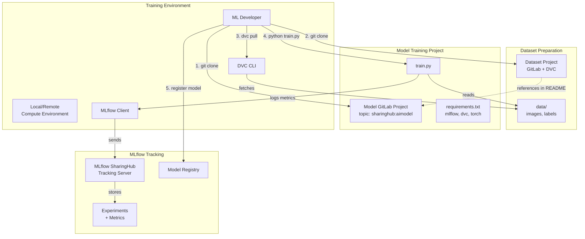

# Dataset Management

<details>
<summary>Relevant source files</summary>

The following files were used as context for generating this wiki page:

- [docs/design/diagrams/use-cases.drawio.png](docs/design/diagrams/use-cases.drawio.png)
- [docs/design/scenarios/flood-example.md](docs/design/scenarios/flood-example.md)
- [docs/design/scenarios/model-training.md](docs/design/scenarios/model-training.md)
- [docs/design/use-cases.md](docs/design/use-cases.md)
- [docs/usage/howto/dataset_with_workspace.md](docs/usage/howto/dataset_with_workspace.md)
- [mkdocs.yml](mkdocs.yml)

</details>


## Purpose and Scope

This document describes how to manage, version, and share datasets within the EOEPCA MLOps Building Block. Dataset management is primarily handled through **DVC (Data Version Control)** integrated with **GitLab** for metadata versioning and **S3 object storage** for actual data files. Datasets are automatically discoverable through **SharingHub** when properly configured.

For model training workflows that consume these datasets, see [Model Training Workflow](#4.1). For a practical example demonstrating dataset usage, see [Flood Detection Example](#4.3).

**Sources**: [docs/design/use-cases.md:70-96](), [docs/design/scenarios/model-training.md:29-34]()

---

## Components and Architecture

The dataset management system integrates multiple components from the MLOps Building Block:

| Component | Role in Dataset Management |
|-----------|---------------------------|
| **DVC** | Version control for large data files, tracks changes, enables data pipelines |
| **GitLab** | Hosts DVC metadata (`.dvc` files), project README, and dataset documentation |
| **S3 Object Storage** | Remote storage backend for actual dataset files (images, videos, text, etc.) |
| **SharingHub** | Automatic discovery and STAC catalog generation for datasets with `sharinghub:dataset` topic |
| **Workspace BB** | Optional: Provides user-specific S3 buckets for dataset storage |

**Sources**: [docs/design/use-cases.md:71-88](), [docs/usage/howto/dataset_with_workspace.md:1-21]()

---

## Dataset Management Architecture



**Diagram**: Dataset Management Architecture showing DVC workflow integration with GitLab and SharingHub

This diagram illustrates the complete dataset lifecycle from creation to discovery. DVC handles the version control of large files by storing metadata in GitLab while the actual data resides in S3. SharingHub automatically indexes datasets from GitLab projects tagged with the `sharinghub:dataset` topic.

**Sources**: [docs/design/use-cases.md:74-88](), [docs/usage/howto/dataset_with_workspace.md:8-20]()

---

## Dataset Publishing Workflow

### Step 1: Create Dataset Project in GitLab

Create a new GitLab project to host your dataset:

1. Log in to GitLab
2. Create new project (e.g., `sen1floods11-dataset`)
3. Clone the repository locally

### Step 2: Initialize DVC

Initialize DVC in your dataset repository:

```bash
cd sen1floods11-dataset
dvc init
git add .dvc .dvcignore
git commit -m "Initialize DVC"
```

### Step 3: Configure S3 Remote

Configure DVC to use an S3 bucket as the remote storage backend:

```bash
# Add S3 remote
dvc remote add --default myremote s3://my-datasets-bucket/sen1floods11

# Configure endpoint (if using custom S3 provider)
dvc remote modify myremote endpointurl https://s3.example.com

# Configure credentials (stored locally, not committed)
dvc remote modify --local myremote access_key_id <access-key>
dvc remote modify --local myremote secret_access_key <secret-key>
```

**Workspace BB Integration**: To use the Workspace BB for dataset storage, configure the remote with your workspace bucket as shown in [docs/usage/howto/dataset_with_workspace.md:10-20]():

```bash
dvc remote add --default workspace s3://ws-username/my-dataset
dvc remote modify workspace endpointurl https://minio.develop.eoepca.org
```

### Step 4: Add Dataset Files

Track your dataset files with DVC:

```bash
# Add entire data directory
dvc add data/

# Or add specific files
dvc add data/images/
dvc add data/labels.csv

# Commit the .dvc metadata files
git add data.dvc .gitignore
git commit -m "Add dataset files"
```

DVC generates `.dvc` files that contain MD5 hashes and references to the actual data in S3.

### Step 5: Push Data to S3

Upload the actual dataset files to S3:

```bash
dvc push
```

This command transfers the data files to the configured S3 remote while keeping only metadata in GitLab.

### Step 6: Configure for SharingHub Discovery

Add the `sharinghub:dataset` topic to make the dataset discoverable:

1. Navigate to your GitLab project settings
2. Add topic: `sharinghub:dataset`
3. Add descriptive tags (e.g., `flood-detection`, `sentinel-1`, `segmentation`)
4. Update `README.md` with dataset description, format, and usage instructions

The project will automatically appear in the SharingHub catalog under the "Datasets" collection.

**Sources**: [docs/design/use-cases.md:74-88](), [docs/design/scenarios/flood-example.md:34-39](), [docs/usage/howto/dataset_with_workspace.md:8-20]()

---

## Dataset Versioning and Iteration



**Diagram**: Dataset Versioning Workflow with DVC and GitLab Tags

### Version Control Best Practices

| Practice | Implementation | Benefit |
|----------|---------------|---------|
| **Git Tags** | Use semantic versioning (v1.0.0, v1.1.0) | Clear version identification |
| **Commit Messages** | Describe dataset changes in detail | Audit trail of modifications |
| **Branching** | Experiment with dataset variations in branches | Safe iteration without affecting main |
| **DVC Pipelines** | Define preprocessing pipelines in `dvc.yaml` | Reproducible data transformations |

### Iterating on Datasets

To create a new version of a dataset:

```bash
# Make changes to dataset files
# (e.g., add more samples, fix labels, augment data)

# Track the changes
dvc add data/

# Push updated data to S3
dvc push

# Commit metadata changes
git add data.dvc
git commit -m "v1.1.0: Added 500 new labeled samples"
git tag v1.1.0
git push origin v1.1.0
```

To retrieve a specific version:

```bash
git checkout v1.0.0
dvc pull
```

**Sources**: [docs/design/use-cases.md:79-83](), [docs/design/scenarios/flood-example.md:37-39]()

---

## Dataset Discovery and Retrieval

### Discovering Datasets via SharingHub



**Diagram**: Dataset Discovery and Retrieval Workflow

### Using SharingHub Web UI

1. Navigate to SharingHub (e.g., `https://sharinghub.develop.eoepca.org`)
2. Select "Datasets" category
3. Apply filters by tags (e.g., `flood-detection`, `sentinel-1`)
4. Click on a dataset to view STAC metadata
5. Click "Open in GitLab" to access the repository

### Using STAC API for Programmatic Access

Retrieve dataset metadata using the STAC API:

```python
import pystac_client

# Connect to STAC API
catalog = pystac_client.Client.open("https://sharinghub.domain/api/catalog")

# Search for datasets
search = catalog.search(
    collections=["datasets"],
    query={"tags": {"contains": "flood-detection"}}
)

# Iterate through results
for item in search.items():
    print(f"Dataset: {item.id}")
    print(f"Description: {item.properties.get('description')}")
    print(f"GitLab URL: {item.properties.get('gitlab_web_url')}")
```

For detailed STAC API usage, see [STAC API Specification](#7.1) and [Using the STAC API](#7.2).

### Retrieving Dataset Files

After finding a dataset, retrieve it using DVC:

```bash
# Clone the GitLab repository
git clone https://gitlab.domain/group/dataset-name.git
cd dataset-name

# Configure DVC credentials (if private)
dvc remote modify --local myremote access_key_id <key>
dvc remote modify --local myremote secret_access_key <secret>

# Pull dataset files from S3
dvc pull
```

The dataset files will be downloaded from S3 to the `data/` directory (or as specified in `.dvc` files).

**Sources**: [docs/design/use-cases.md:89-96](), [docs/design/scenarios/model-training.md:29-34](), [docs/design/scenarios/flood-example.md:34-39]()

---

## Dataset Formats and Types

The Training Data Manager supports various dataset formats commonly used in ML:

| Format Type | File Extensions | Use Cases | Example Projects |
|-------------|----------------|-----------|------------------|
| **Images** | `.png`, `.jpg`, `.tif`, `.tiff` | Computer vision, segmentation | Sentinel-2 imagery, flood masks |
| **Geospatial** | `.geotiff`, `.tif` | Earth observation, remote sensing | SAR images, elevation data |
| **Tabular** | `.csv`, `.parquet`, `.tsv` | Classification, regression | Wine quality, sensor data |
| **Text** | `.txt`, `.json`, `.xml` | NLP, text classification | Annotations, metadata |
| **Video** | `.mp4`, `.avi` | Action recognition, tracking | Satellite video streams |
| **Audio** | `.wav`, `.mp3` | Sound classification | Environmental audio |

### Storage Considerations

- **Large Files**: DVC is optimized for files >10MB; Git LFS is an alternative for smaller binary files
- **Dataset Structure**: Organize files in logical directories (e.g., `data/train/`, `data/test/`, `data/labels/`)
- **Compression**: Consider compressing datasets before versioning to reduce storage costs
- **Incremental Updates**: DVC only uploads changed files, not entire datasets

**Sources**: [docs/design/use-cases.md:77-78]()

---

## Integration with Model Training



**Diagram**: Dataset Integration with Model Training Workflow

### Referencing Datasets in Model Projects

Model projects should reference their training datasets in the README:

```markdown
## Dataset

This model is trained on the [Sen1Floods11 Dataset](https://gitlab.domain/group/sen1floods11-dataset).

### Setup

1. Clone the dataset repository:
   ```bash
   git clone https://gitlab.domain/group/sen1floods11-dataset.git
   cd sen1floods11-dataset
   ```

2. Configure DVC credentials and pull data:
   ```bash
   dvc remote modify --local myremote access_key_id <key>
   dvc remote modify --local myremote secret_access_key <secret>
   dvc pull
   ```

3. Update the dataset path in your training configuration.
```

This creates a clear link between models and their training datasets, enabling reproducibility.

**Sources**: [docs/design/scenarios/model-training.md:29-34](), [docs/design/scenarios/flood-example.md:34-40]()

---

## Dataset Metadata and STAC Extensions

Datasets published through SharingHub are exposed as STAC items with appropriate extensions:

### STAC Item Structure for Datasets

```json
{
  "type": "Feature",
  "stac_version": "1.0.0",
  "id": "sen1floods11-dataset",
  "properties": {
    "description": "Sentinel-1 SAR flood detection dataset",
    "tags": ["flood-detection", "sentinel-1", "segmentation"],
    "gitlab_web_url": "https://gitlab.domain/group/sen1floods11-dataset"
  },
  "stac_extensions": [
    "https://stac-extensions.github.io/eo/v1.1.0/schema.json"
  ],
  "assets": {
    "repository": {
      "href": "https://gitlab.domain/group/sen1floods11-dataset.git",
      "type": "application/x-git",
      "title": "Git Repository"
    },
    "data": {
      "href": "s3://datasets-bucket/sen1floods11/",
      "type": "application/x-directory",
      "title": "Dataset Files (via DVC)"
    }
  }
}
```

### Common STAC Extensions for Datasets

| Extension | Purpose | Applicable Dataset Types |
|-----------|---------|-------------------------|
| **eo** | Earth Observation metadata (bands, resolution) | Satellite imagery, aerial photos |
| **datacube** | Multi-dimensional array structure | Time-series, hyperspectral data |
| **scientific** | Citations, DOIs, publications | Research datasets |
| **file** | File format and size details | All dataset types |

**Sources**: [docs/design/use-cases.md:70-88]()

---

## Workspace BB Integration

The Workspace Building Block provides personal S3-compatible storage for users. Datasets can be stored in user workspace buckets, enabling private dataset management.

### Configuration Example

Configure DVC to use a Workspace BB bucket as shown in [docs/usage/howto/dataset_with_workspace.md:10-20]():

```bash
# Configure workspace bucket as DVC remote
dvc remote add --default workspace s3://ws-bob/my-dataset
dvc remote modify workspace endpointurl https://minio.develop.eoepca.org

# Set credentials locally
dvc remote modify --local workspace access_key_id <workspace-access-key>
dvc remote modify --local workspace secret_access_key <workspace-secret-key>
```

### Benefits of Workspace Integration

- **Per-User Storage**: Each user has isolated storage space
- **Access Control**: Workspace BB handles authentication and authorization
- **Quota Management**: Storage limits enforced at the workspace level
- **Lifecycle Management**: Datasets tied to user workspace lifecycle

**Sources**: [docs/usage/howto/dataset_with_workspace.md:1-21]()

---

## Best Practices

### Dataset Organization

```
dataset-project/
├── data/
│   ├── train/
│   │   ├── images/
│   │   └── labels/
│   ├── val/
│   │   ├── images/
│   │   └── labels/
│   └── test/
│       ├── images/
│       └── labels/
├── .dvc/
│   └── config
├── data.dvc
├── .dvcignore
├── README.md
└── LICENSE
```

### Documentation Requirements

A well-documented dataset project should include:

| File | Required Content |
|------|-----------------|
| `README.md` | Dataset description, structure, format, license, usage examples |
| `LICENSE` | Clear licensing terms (e.g., CC-BY-4.0, MIT) |
| `CHANGELOG.md` | Version history with changes per version |
| `data/README.md` | Detailed schema, field descriptions, data format specifications |

### Access Control Strategies

| Strategy | Implementation | Use Case |
|----------|---------------|----------|
| **Public Datasets** | Public GitLab project + public S3 bucket | Open data for community use |
| **Organization Datasets** | Internal GitLab project + private S3 bucket | Shared within organization |
| **Private Datasets** | Private GitLab project + Workspace bucket | Personal research datasets |

### Performance Optimization

- **Chunking Large Files**: Split very large files into smaller chunks for better version control
- **DVC Cache**: Enable local DVC cache to avoid repeated downloads
- **S3 Transfer Acceleration**: Enable for faster uploads/downloads across regions
- **Parallel Transfers**: Configure DVC to use multiple threads for transfers

**Sources**: [docs/design/use-cases.md:74-88](), [docs/design/scenarios/flood-example.md:34-39]()

---

## Summary

Dataset management in the EOEPCA MLOps Building Block provides:

1. **Version Control**: DVC tracks dataset versions alongside code in GitLab
2. **Scalable Storage**: S3 object storage handles large datasets (GB to TB scale)
3. **Automatic Discovery**: Datasets appear in SharingHub STAC catalog with `sharinghub:dataset` topic
4. **Flexible Integration**: Works with Workspace BB, custom S3 providers, or cloud storage
5. **Reproducibility**: Links between models and dataset versions enable reproducible training

For hands-on examples, see the [Flood Detection Example](#4.3) which demonstrates complete dataset usage with the Sen1Floods11 dataset. For deployment details, see [SharingHub Deployment](#5.3).

**Sources**: [docs/design/use-cases.md:70-96](), [docs/usage/howto/dataset_with_workspace.md:1-21]()