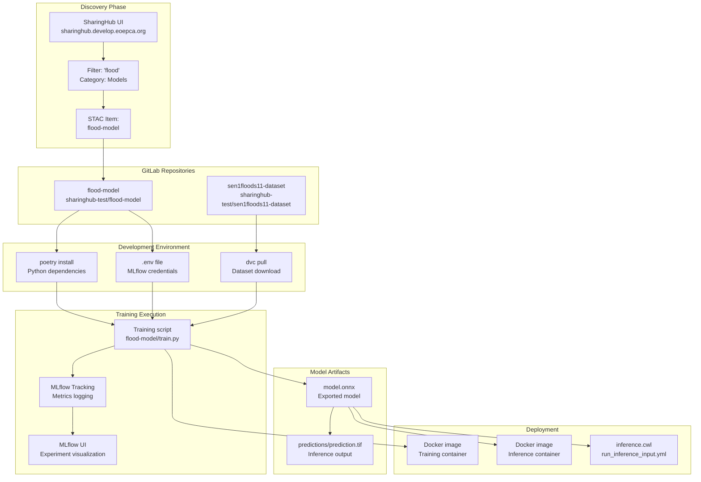
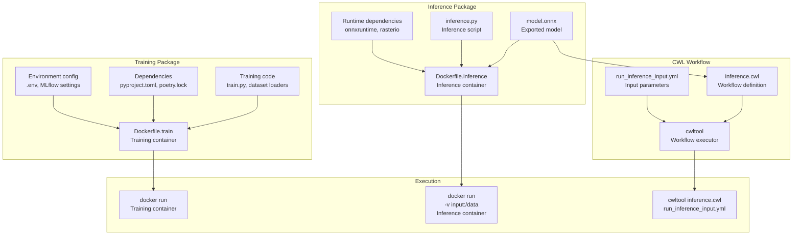
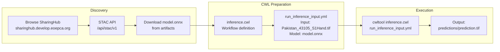
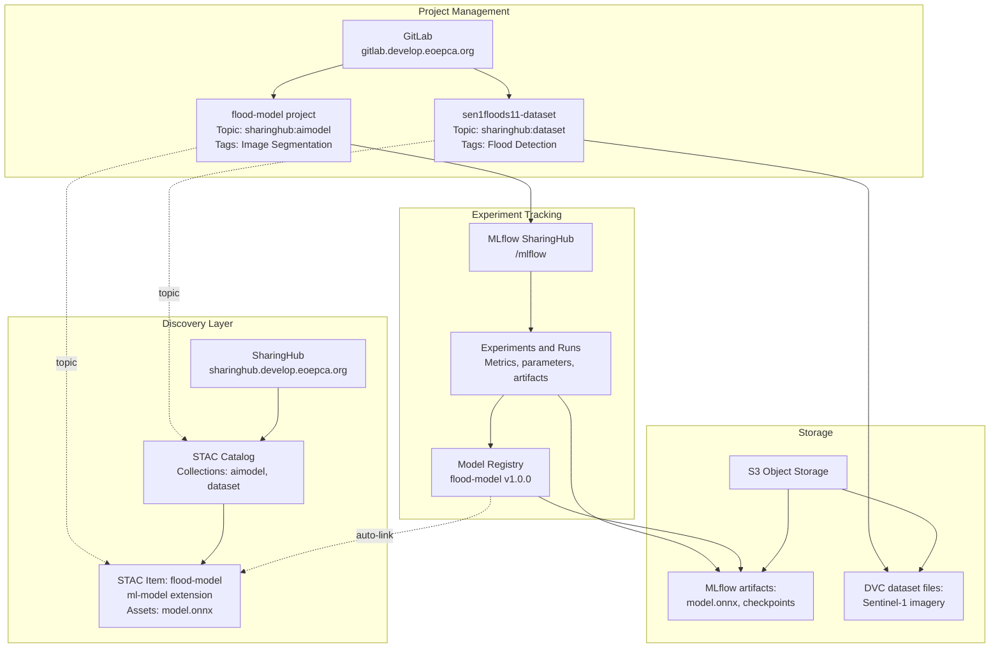

# Flood Detection Example

<details>
<summary>Relevant source files</summary>

The following files were used as context for generating this wiki page:

- [docs/design/scenarios/flood-example.md](docs/design/scenarios/flood-example.md)
- [docs/design/scenarios/model-training.md](docs/design/scenarios/model-training.md)
- [mkdocs.yml](mkdocs.yml)

</details>


## Purpose and Scope

This page provides a complete, practical walkthrough of training and deploying a flood detection model using the EOEPCA MLOps Building Block. The example demonstrates how ML Developers and ML Users interact with the platform to train, register, and consume AI models for Earth Observation applications.

For general information about the model training workflow, see [Model Training Workflow](#4.1). For dataset management concepts, see [Dataset Management](#4.2).

## Overview

The flood detection example showcases an end-to-end machine learning workflow using the following components:

| Component | Repository | Purpose |
|-----------|-----------|---------|
| Flood Model | [sharinghub-test/flood-model](https://gitlab.develop.eoepca.org/sharinghub-test/flood-model) | Image segmentation model for flood detection |
| Sen1Floods11 Dataset | [sharinghub-test/sen1floods11-dataset](https://gitlab.develop.eoepca.org/sharinghub-test/sen1floods11-dataset) | Training dataset with Sentinel-1 SAR imagery |

Both repositories are hosted on the develop cluster at `https://gitlab.develop.eoepca.org/` and are mirrored to:
- GitHub: `https://github.com/EOEPCA/flood-model`
- GitHub: `https://github.com/EOEPCA/Sen1Floods11-Dataset`

**Sources:** [docs/design/scenarios/flood-example.md:1-13]()

## Workflow Architecture



**Workflow Architecture Diagram**: This diagram shows the complete flood detection workflow from discovery through deployment, mapping natural language concepts to specific code entities and files.

**Sources:** [docs/design/scenarios/flood-example.md:1-72](), [docs/design/scenarios/model-training.md:1-53]()

## ML Developer Workflow

### Step 1: Browsing SharingHub for the Model

The ML Developer begins by discovering the flood detection model through the SharingHub web interface:

1. Navigate to `https://sharinghub.develop.eoepca.org`
2. Click on the **"Models"** category
3. Apply filter: `"flood"`
4. Select the flood-model STAC item
5. Click **"Open in GitLab"** to access the project repository

This workflow leverages SharingHub's STAC catalog, which dynamically generates catalog entries from GitLab projects tagged with the `sharinghub:aimodel` topic. The flood-model project appears in the catalog because it has this topic configured in its GitLab project settings.

**Sources:** [docs/design/scenarios/flood-example.md:17-24]()

### Step 2: Cloning the Model Repository

Clone the flood model repository from GitLab:

```bash
git clone https://gitlab.develop.eoepca.org/sharinghub-test/flood-model.git
cd flood-model
```

The repository contains:
- Training scripts for model development
- Model architecture definitions
- Configuration files for MLflow integration
- Inference scripts for model deployment
- Docker configurations for containerization

**Sources:** [docs/design/scenarios/flood-example.md:25-27]()

### Step 3: Model Setup

Configure the development environment using Poetry for dependency management:

```bash
poetry install
```

Create a `.env` file in the project root with MLflow credentials for experiment tracking:

```
MLFLOW_TRACKING_URI=https://sharinghub.develop.eoepca.org/mlflow
MLFLOW_TRACKING_USERNAME=<username>
MLFLOW_TRACKING_PASSWORD=<password>
```

The `.env` file enables the MLflow client to authenticate with the MLflow SharingHub instance, which delegates permission checks to SharingHub. This ensures that only authorized users can log experiments to the flood-model project.

**Sources:** [docs/design/scenarios/flood-example.md:29-32]()

### Step 4: Dataset Setup

The flood model requires the Sen1Floods11 dataset, which is managed using DVC (Data Version Control):

```bash
# Clone the dataset repository
git clone https://gitlab.develop.eoepca.org/sharinghub-test/sen1floods11-dataset.git
cd sen1floods11-dataset

# Configure DVC credentials for S3 backend
dvc remote modify myremote access_key_id <aws_access_key_id>
dvc remote modify myremote secret_access_key <aws_secret_access_key>

# Pull dataset files from S3
dvc pull
```

The `dvc pull` command downloads the actual dataset files (Sentinel-1 SAR imagery and flood labels) from S3 object storage. DVC stores only metadata in Git, keeping the repository lightweight while providing full dataset versioning.

**Sources:** [docs/design/scenarios/flood-example.md:34-39]()

### Step 5: Training the Model

Execute the training session:

```bash
poetry run python train.py
```

During training, the script:
- Logs hyperparameters, metrics, and artifacts to MLflow using the tracking URI configured in `.env`
- Supports streaming mode for large datasets that don't fit in memory
- Provides no-cache options for processing fresh data

Monitor training progress by accessing the MLflow UI at `https://sharinghub.develop.eoepca.org/mlflow`:
- Navigate to **Experiments → Runs**
- View real-time metrics (loss, accuracy, IoU)
- Compare runs with different hyperparameters
- Inspect logged artifacts (model checkpoints, plots)

**Sources:** [docs/design/scenarios/flood-example.md:41-45]()

### Step 6: Running Inference

After training, test the model with a sample image:

```bash
poetry run python inference.py --input Pakistan_43105_S1Hand.tif --model model.onnx
```

The inference script:
- Loads the exported ONNX model (`model.onnx`)
- Processes the input GeoTIFF file (`Pakistan_43105_S1Hand.tif`, 512×512 pixels)
- Generates a prediction mask showing flood extent
- Saves the result to `predictions/prediction.tif`

The output file `predictions/prediction.tif` is a GeoTIFF with the same spatial dimensions as the input, where pixel values indicate flood probability or binary classification (flooded/not flooded).

**Sources:** [docs/design/scenarios/flood-example.md:47-50]()

## Packaging and Deployment



**Packaging and Deployment Architecture**: This diagram shows three deployment strategies for the flood detection model: Docker containers for training, Docker containers for inference, and CWL workflows for standardized execution.

**Sources:** [docs/design/scenarios/flood-example.md:53-63]()

### Docker Container for Training

Build and run the training container:

```bash
# Build training image
docker build -f Dockerfile.train -t flood-model-train:latest .

# Run training container
docker run --rm \
  -v $(pwd)/data:/app/data \
  -v $(pwd)/models:/app/models \
  --env-file .env \
  flood-model-train:latest
```

The training Docker image encapsulates:
- Python environment with Poetry dependencies
- Training scripts and model architecture
- MLflow client configuration
- Data loading and preprocessing pipelines

This containerization enables reproducible training across different environments and facilitates deployment on cloud platforms or HPC clusters.

**Sources:** [docs/design/scenarios/flood-example.md:54-57]()

### Docker Container for Inference

Build and run the inference container:

```bash
# Build inference image with embedded ONNX model
docker build -f Dockerfile.inference \
  --build-arg MODEL_PATH=model.onnx \
  -t flood-model-inference:latest .

# Run inference on sample data
docker run --rm \
  -v $(pwd)/input:/input \
  -v $(pwd)/output:/output \
  flood-model-inference:latest \
  /input/Pakistan_43105_S1Hand.tif
```

The inference Docker image:
- Embeds the ONNX model specified at build time
- Includes minimal runtime dependencies (onnxruntime, rasterio)
- Accepts input GeoTIFF files via volume mounts
- Outputs prediction masks to the mounted output directory

**Sources:** [docs/design/scenarios/flood-example.md:59-62]()

## ML User Workflow



**ML User Workflow Diagram**: This diagram shows how ML Users consume the trained flood detection model via the STAC API and execute inference using CWL workflows.

**Sources:** [docs/design/scenarios/flood-example.md:66-71]()

### Downloading the Model via STAC API

ML Users can programmatically download the trained model:

```python
from pystac_client import Client

# Connect to SharingHub STAC API
client = Client.open("https://sharinghub.develop.eoepca.org/api/stac/v1")

# Search for flood model
search = client.search(
    collections=["aimodel"],
    query={"name": {"eq": "flood-model"}}
)

# Get model item
item = next(search.get_items())

# Download ONNX model asset
onnx_asset = item.assets["model"]
onnx_url = onnx_asset.href
# Download from onnx_url to local file
```

The STAC API provides standardized access to model artifacts stored in MLflow's S3 backend. The model's STAC metadata is automatically linked when the ML Developer registers the model in the MLflow registry.

**Sources:** [docs/design/scenarios/flood-example.md:68-70]()

### Running CWL Workflow

Execute the inference workflow using CWL:

```bash
cwltool inference.cwl run_inference_input.yml
```

The `run_inference_input.yml` file contains:

```yaml
input_image:
  class: File
  path: Pakistan_43105_S1Hand.tif
model_file:
  class: File
  path: model.onnx
output_dir: predictions/
```

The CWL workflow (`inference.cwl`):
- Defines inputs (GeoTIFF image, ONNX model)
- Specifies runtime requirements (Docker container, memory, CPU)
- Executes the inference script
- Collects outputs (prediction GeoTIFF)

This approach provides a standardized, portable way to execute the flood detection model across different execution environments (local workstations, cloud platforms, HPC clusters).

**Sources:** [docs/design/scenarios/flood-example.md:68-71]()

## Component Integration



**Component Integration Diagram**: This diagram shows how GitLab, SharingHub, MLflow SharingHub, and S3 storage interact to support the flood detection workflow, from project management through model discovery and deployment.

**Sources:** [docs/design/scenarios/flood-example.md:1-72](), [docs/design/scenarios/model-training.md:1-53]()

## Key Technical Details

### Model Metadata

The flood-model project in GitLab contains metadata that appears in the STAC catalog:

| Metadata Field | Value | Source |
|----------------|-------|--------|
| Topic | `sharinghub:aimodel` | GitLab project settings |
| Tags | `Image Segmentation`, `Flood Detection` | GitLab project tags |
| README content | Model description, usage instructions | `README.md` file |
| STAC extensions | `ml-model` | Inferred from project topic |
| Assets | `model.onnx`, training logs | MLflow artifacts |

**Sources:** [docs/design/scenarios/flood-example.md:1-13]()

### Dataset Versioning

The Sen1Floods11 dataset uses DVC for version control:

- **Git metadata**: `.dvc` files tracking data versions
- **S3 storage**: Actual imagery files (GeoTIFFs)
- **DVC remote**: S3 bucket configured as remote storage
- **Version control**: Dataset changes tracked via Git commits

The separation of metadata (Git) and data (S3) enables:
- Lightweight Git repositories
- Full dataset versioning
- Efficient storage and bandwidth usage
- Reproducible dataset snapshots

**Sources:** [docs/design/scenarios/flood-example.md:34-39]()

### MLflow Integration

The flood model training script integrates with MLflow:

```python
import mlflow

# Tracking URI from .env file
mlflow.set_tracking_uri(os.getenv("MLFLOW_TRACKING_URI"))

# Create or use existing experiment
mlflow.set_experiment("flood-model")

# Log training run
with mlflow.start_run():
    # Log parameters
    mlflow.log_param("learning_rate", 0.001)
    mlflow.log_param("batch_size", 32)
    
    # Training loop with metric logging
    for epoch in range(epochs):
        loss = train_epoch()
        mlflow.log_metric("loss", loss, step=epoch)
    
    # Log model artifact
    mlflow.onnx.log_model(onnx_model, "model")
```

MLflow SharingHub validates that the user has write access to the flood-model project in GitLab before accepting logged metrics and artifacts. This permission check ensures that only authorized ML Developers can modify experiment data.

**Sources:** [docs/design/scenarios/model-training.md:35-45]()

## Summary

The flood detection example demonstrates the complete MLOps workflow:

1. **Discovery**: ML Developers find models and datasets via SharingHub's STAC catalog
2. **Setup**: Clone repositories, configure environments, download datasets with DVC
3. **Training**: Execute training scripts with MLflow tracking integration
4. **Packaging**: Containerize models for reproducible deployment
5. **Consumption**: ML Users download models via STAC API and execute with CWL workflows

This end-to-end workflow showcases how GitLab, SharingHub, and MLflow SharingHub work together to provide a comprehensive MLOps platform for Earth Observation applications.

**Sources:** [docs/design/scenarios/flood-example.md:1-72](), [docs/design/scenarios/model-training.md:1-53]()