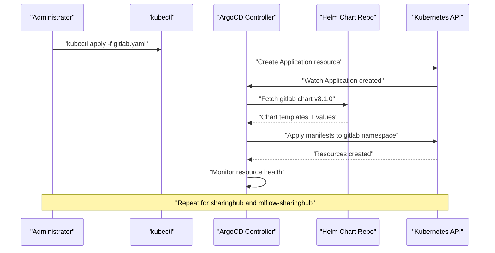
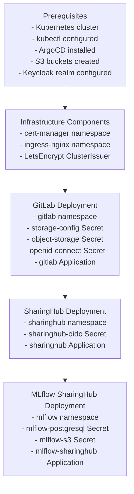
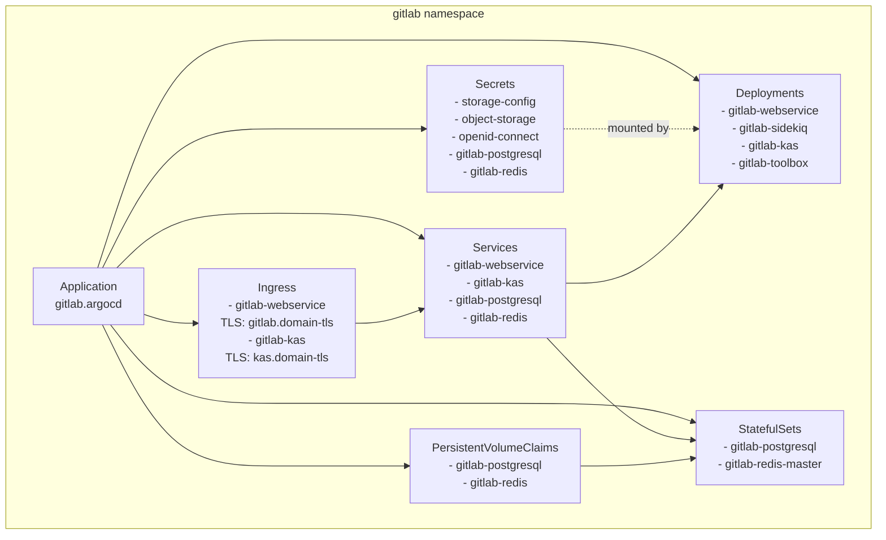
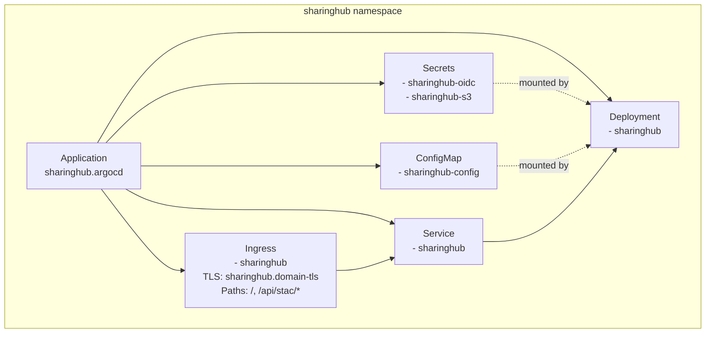
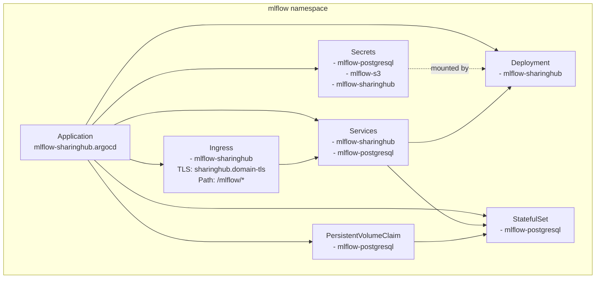
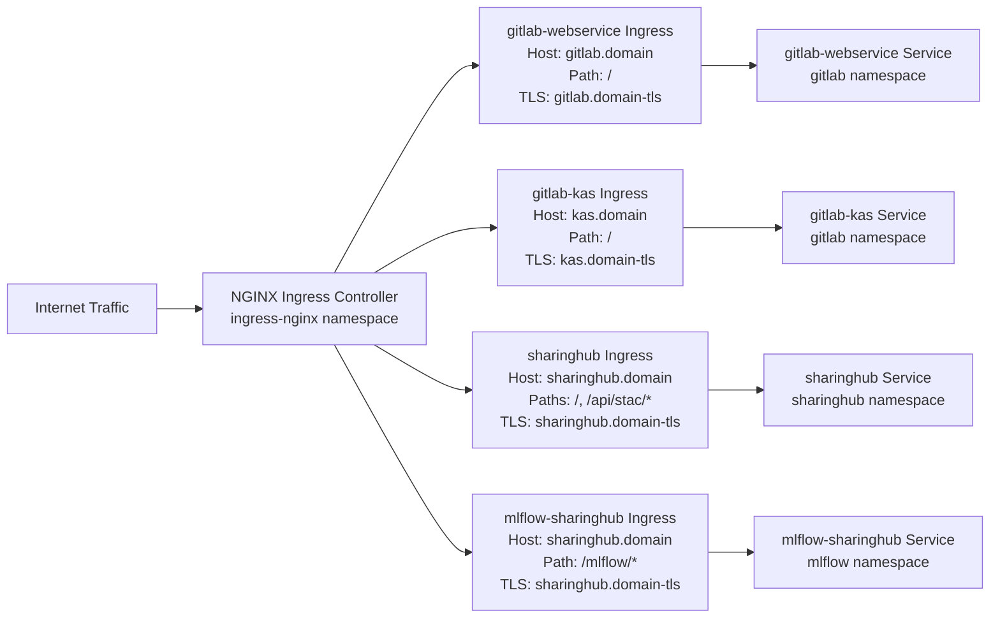
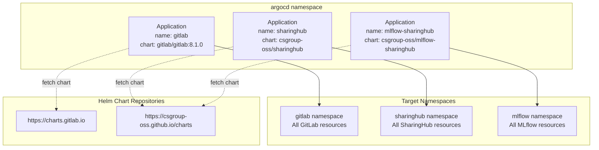

# Deployment Guide

<details>
<summary>Relevant source files</summary>

The following files were used as context for generating this wiki page:

- [docs/admin/deployment-guide/components/gitlab.md](docs/admin/deployment-guide/components/gitlab.md)
- [docs/admin/deployment-guide/intro.md](docs/admin/deployment-guide/intro.md)

</details>


This document provides a comprehensive guide for deploying the EOEPCA MLOps Building Block on a Kubernetes cluster. The deployment uses ArgoCD for GitOps-based continuous deployment and Helm charts for component packaging.

The MLOps Building Block consists of three core components that must be deployed in sequence: GitLab (for code and project management), SharingHub (for discovery and collaboration), and MLflow SharingHub (for experiment tracking and model registry). Each component is deployed in its own Kubernetes namespace with dedicated resources.

For detailed component-specific deployment instructions, see:
- GitLab deployment: [GitLab Deployment](#5.2)
- SharingHub deployment: [SharingHub Deployment](#5.3)
- MLflow SharingHub deployment: [MLflow SharingHub Deployment](#5.4)

For prerequisites and deployment architecture details, see [Prerequisites and Architecture](#5.1).

## Deployment Overview

The MLOps Building Block deployment follows a GitOps approach using ArgoCD to manage the lifecycle of all components. Each component is defined as an ArgoCD `Application` resource that references a Helm chart from either the official GitLab chart repository (`https://charts.gitlab.io`) or the CS Group OSS Helm repository (`https://csgroup-oss.github.io/charts`).

The deployment architecture consists of:

| Component | Namespace | Chart Source | Version |
|-----------|-----------|--------------|---------|
| ArgoCD | `argocd` | ArgoCD Operator or Helm | Latest stable |
| GitLab | `gitlab` | `gitlab/gitlab` | 8.1.0+ |
| SharingHub | `sharinghub` | `csgroup-oss/sharinghub` | Latest |
| MLflow SharingHub | `mlflow` | `csgroup-oss/mlflow-sharinghub` | Latest |
| cert-manager | `cert-manager` | `jetstack/cert-manager` | v1.x |
| NGINX Ingress | `ingress-nginx` | `ingress-nginx/ingress-nginx` | Latest |

**Sources:** [docs/admin/deployment-guide/intro.md:1-15](), [docs/admin/deployment-guide/components/gitlab.md:120-125]()

## Deployment Strategy

### ArgoCD-Based GitOps

The deployment uses ArgoCD `Application` resources to declaratively manage component deployments. Each `Application` manifest defines:

- `spec.destination.namespace`: Target Kubernetes namespace
- `spec.destination.server`: Target cluster (typically `https://kubernetes.default.svc`)
- `spec.source.repoURL`: Helm chart repository URL
- `spec.source.chart`: Chart name
- `spec.source.targetRevision`: Chart version
- `spec.source.helm.valuesObject`: Helm values configuration
- `spec.syncPolicy`: Automatic or manual sync policies

**Deployment Flow**



**Sources:** [docs/admin/deployment-guide/components/gitlab.md:105-240]()

### Helm Charts and Values

Each component uses Helm charts with custom `valuesObject` configurations embedded in the ArgoCD `Application` manifest. Key configuration areas include:

**GitLab Helm Values** (`gitlab/gitlab` chart):
- `global.hosts.domain`: Base domain for GitLab services
- `global.ingress`: TLS and ingress controller settings
- `global.minio.enabled: false`: Disable built-in MinIO, use external S3
- `global.appConfig.omniauth`: OIDC authentication configuration
- `global.appConfig.lfs`: Git LFS object storage configuration
- `global.appConfig.backups`: S3 backup configuration

**SharingHub Helm Values** (`csgroup-oss/sharinghub` chart):
- `ingress.hosts[0].host`: SharingHub domain
- `sharinghub.gitlabUrl`: GitLab instance URL
- `sharinghub.stacApi.enabled: true`: Enable STAC API
- `sharinghub.categories`: AI model, dataset, and processor collections
- `sharinghub.s3Store`: S3 configuration for STAC assets

**MLflow SharingHub Helm Values** (`csgroup-oss/mlflow-sharinghub` chart):
- `mlflow.backendStoreUri`: PostgreSQL connection string
- `mlflow.defaultArtifactRoot`: S3 artifact storage path
- `mlflow.sharinghubUrl`: SharingHub instance URL

**Sources:** [docs/admin/deployment-guide/components/gitlab.md:125-225]()

## Component Dependencies

The components must be deployed in a specific order due to dependencies:



**Dependency Rationale:**

1. **Infrastructure First**: cert-manager must be deployed before any component to provision TLS certificates. NGINX Ingress must exist to route traffic.

2. **GitLab First**: SharingHub requires a GitLab instance to extract project metadata and authenticate users via OAuth.

3. **SharingHub Before MLflow**: MLflow SharingHub delegates permission checks to SharingHub, requiring SharingHub to be operational first.

**Sources:** [docs/admin/deployment-guide/intro.md:1-15]()

## Kubernetes Resources Created

Each component deployment creates a set of Kubernetes resources across namespaces:

### GitLab Namespace Resources



**Sources:** [docs/admin/deployment-guide/components/gitlab.md:169-199]()

### SharingHub Namespace Resources



### MLflow Namespace Resources



**Sources:** Based on standard Kubernetes patterns for Helm deployments and ArgoCD structure.

## External Dependencies

All components require access to external services that must be provisioned before deployment:

### S3 Object Storage

Each component requires dedicated S3 buckets:

| Component | Bucket Purpose | Bucket Name Example | Required |
|-----------|----------------|---------------------|----------|
| GitLab | Backup storage | `gitlab-backup-storage` | Yes |
| GitLab | Temporary storage | `gitlab-tmp-storage` | Yes |
| GitLab | Git LFS objects | `gitlab-lfs-storage` | Optional |
| SharingHub | STAC assets | `sharinghub-assets` | Yes |
| MLflow | Model artifacts | `mlflow-artifacts` | Yes |

S3 credentials are stored in Kubernetes `Secret` resources:
- `storage-config` in `gitlab` namespace: S3cmd format configuration
- `object-storage` in `gitlab` namespace: YAML format for LFS
- `sharinghub-s3` in `sharinghub` namespace: S3 endpoint and credentials
- `mlflow-s3` in `mlflow` namespace: AWS-style credentials

**Sources:** [docs/admin/deployment-guide/components/gitlab.md:16-66]()

### Keycloak OIDC Provider

Components authenticate users through Keycloak OIDC:

| Component | Client ID | Redirect URI | Secret Name |
|-----------|-----------|--------------|-------------|
| GitLab | `gitlab` | `https://gitlab.domain/users/auth/openid_connect/callback` | `openid-connect` |
| SharingHub | `sharinghub` | `https://sharinghub.domain/oauth/callback` | `sharinghub-oidc` |

The OIDC configuration includes:
- `issuer`: Keycloak realm URL (`https://keycloak.domain/realms/eoepca`)
- `scope`: `["openid", "profile", "email"]`
- `response_type`: `"code"`
- `pkce`: `true` (for enhanced security)

**Sources:** [docs/admin/deployment-guide/components/gitlab.md:68-103]()

### TLS Certificate Management

All Ingress resources use cert-manager to automatically provision Let's Encrypt certificates:

```yaml
ingress:
  annotations:
    cert-manager.io/cluster-issuer: letsencrypt-prod
  tls:
    - secretName: gitlab.domain-tls
      hosts:
        - gitlab.domain
```

The `cert-manager.io/cluster-issuer` annotation references a `ClusterIssuer` resource that must exist before deployment. The certificate is stored in a Kubernetes `Secret` with name pattern `<hostname>-tls`.

**Sources:** [docs/admin/deployment-guide/components/gitlab.md:132-178]()

## Deployment Process Overview

The complete deployment process follows these steps:

**1. Prepare Prerequisites**
- Provision Kubernetes cluster
- Install ArgoCD
- Install cert-manager and create `ClusterIssuer`
- Install NGINX Ingress Controller
- Create S3 buckets
- Configure Keycloak realm and clients

See [Prerequisites and Architecture](#5.1) for details.

**2. Deploy GitLab**
- Create `gitlab` namespace
- Create S3 configuration `Secret` resources (`storage-config`, `object-storage`)
- Create OIDC provider `Secret` resource (`openid-connect`)
- Apply GitLab ArgoCD `Application` manifest
- Wait for GitLab to become healthy
- Configure GitLab root user and create OAuth applications

See [GitLab Deployment](#5.2) for step-by-step instructions.

**3. Deploy SharingHub**
- Create `sharinghub` namespace
- Create OIDC client `Secret` resource (`sharinghub-oidc`)
- Create S3 configuration `Secret` resource (if using S3 store)
- Apply SharingHub ArgoCD `Application` manifest
- Configure STAC categories and tags
- Verify STAC API accessibility

See [SharingHub Deployment](#5.3) for detailed configuration.

**4. Deploy MLflow SharingHub**
- Create `mlflow` namespace
- Create PostgreSQL `Secret` resource
- Create S3 configuration `Secret` resource
- Create SharingHub integration `Secret` resource
- Apply MLflow SharingHub ArgoCD `Application` manifest
- Verify MLflow UI accessibility and experiment tracking

See [MLflow SharingHub Deployment](#5.4) for configuration details.

**Sources:** [docs/admin/deployment-guide/intro.md:1-15](), [docs/admin/deployment-guide/components/gitlab.md:6-11]()

## Ingress and URL Structure

All components are exposed through NGINX Ingress with the following URL structure:



**URL Endpoints:**

| Service | URL | Purpose |
|---------|-----|---------|
| GitLab Web UI | `https://gitlab.domain/` | GitLab web interface, project management |
| GitLab KAS | `wss://kas.domain/` | GitLab Agent Server for Kubernetes integration |
| SharingHub Web UI | `https://sharinghub.domain/` | Discovery and collaboration interface |
| SharingHub STAC API | `https://sharinghub.domain/api/stac/` | STAC catalog API endpoints |
| MLflow UI | `https://sharinghub.domain/mlflow/` | Experiment tracking and model registry UI |
| MLflow Tracking API | `https://sharinghub.domain/mlflow/` | MLflow client tracking API |

Note that both SharingHub and MLflow SharingHub share the same domain (`sharinghub.domain`) but use different paths. This allows unified access under a single domain with shared TLS certificate.

**Sources:** [docs/admin/deployment-guide/components/gitlab.md:169-193]()

## ArgoCD Application Structure

Each component is managed by an ArgoCD `Application` resource in the `argocd` namespace:



The `spec.syncPolicy` in each `Application` defines synchronization behavior:

```yaml
syncPolicy:
  syncOptions:
    - FailOnSharedResource=true  # Prevent resource conflicts
    - CreateNamespace=true       # Auto-create target namespace
```

**Sources:** [docs/admin/deployment-guide/components/gitlab.md:109-230]()

## Verification and Health Checks

After deploying each component, verify health using ArgoCD and kubectl:

**ArgoCD Health Status:**
```bash
kubectl get applications -n argocd
```

Expected output:
```
NAME                 SYNC STATUS   HEALTH STATUS
gitlab               Synced        Healthy
sharinghub           Synced        Healthy
mlflow-sharinghub    Synced        Healthy
```

**Pod Status by Namespace:**
```bash
kubectl get pods -n gitlab
kubectl get pods -n sharinghub
kubectl get pods -n mlflow
```

All pods should show `Running` status with `READY` count matching container count.

**Ingress Verification:**
```bash
kubectl get ingress -A
```

All Ingress resources should show hostnames and addresses assigned.

**TLS Certificate Status:**
```bash
kubectl get certificates -A
```

All `Certificate` resources should show `READY: True`.

**Sources:** Standard Kubernetes and ArgoCD verification procedures.

## Next Steps

Proceed to the detailed deployment instructions for each component:

1. **[Prerequisites and Architecture](#5.1)**: Review Kubernetes requirements, ArgoCD setup, and deployment architecture details.

2. **[GitLab Deployment](#5.2)**: Deploy GitLab with S3 object storage, Git LFS support, and Keycloak OIDC integration.

3. **[SharingHub Deployment](#5.3)**: Deploy SharingHub with STAC catalog, GitLab OAuth integration, and category/tag configuration.

4. **[MLflow SharingHub Deployment](#5.4)**: Deploy MLflow with PostgreSQL backend, S3 artifacts storage, and SharingHub permission integration.

For configuration details, see [Configuration Reference](#6). For operational maintenance, see [Operations and Maintenance](#8).

**Sources:** [docs/admin/deployment-guide/intro.md:1-15]()