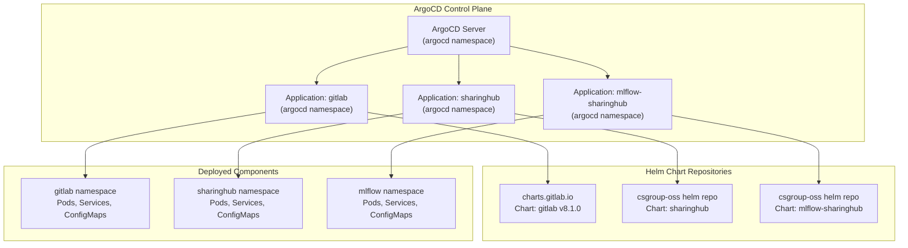
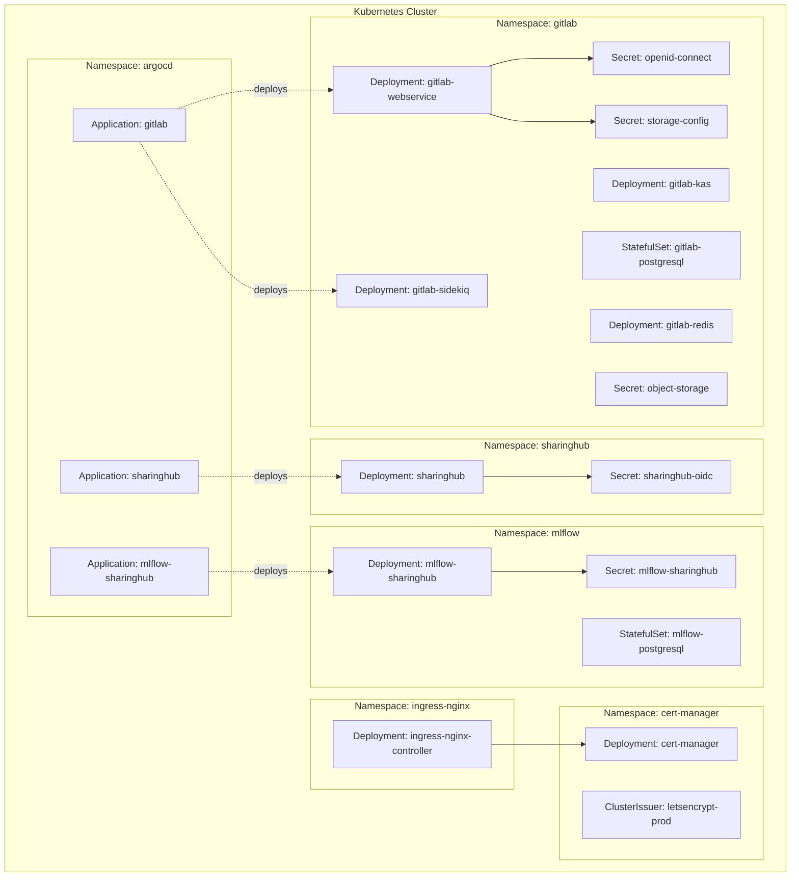
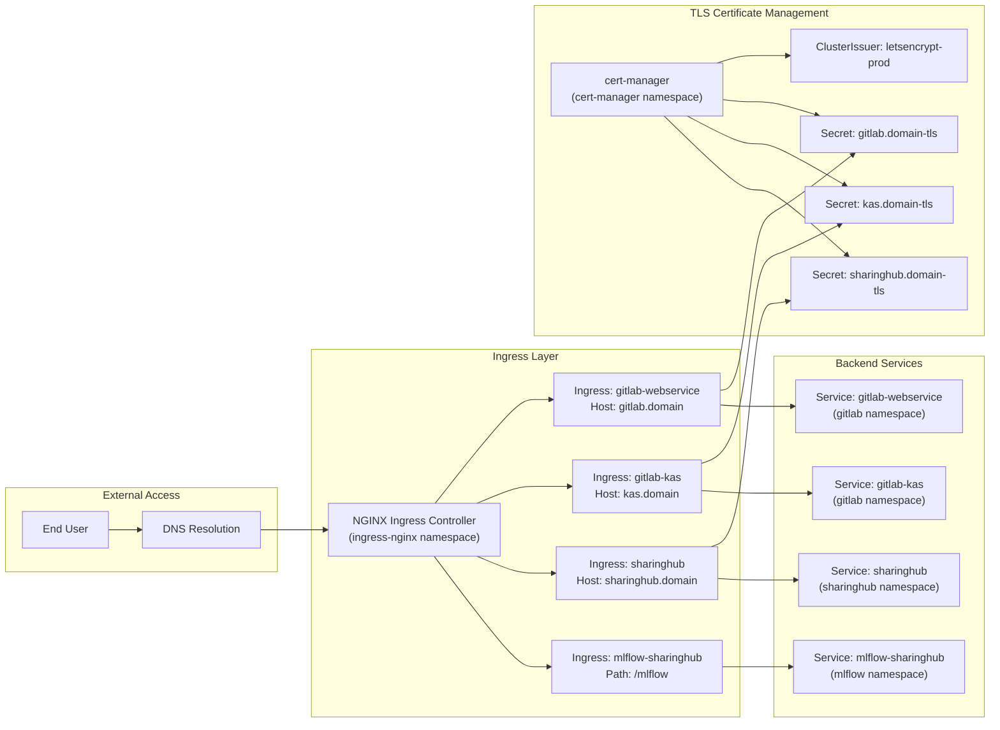
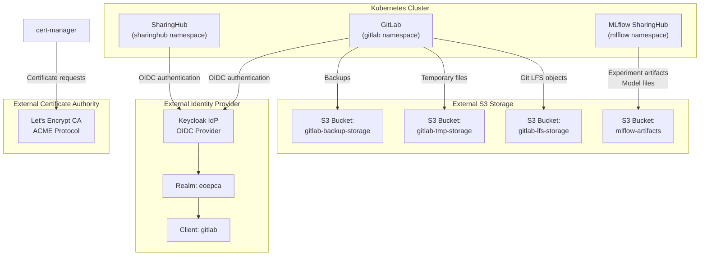
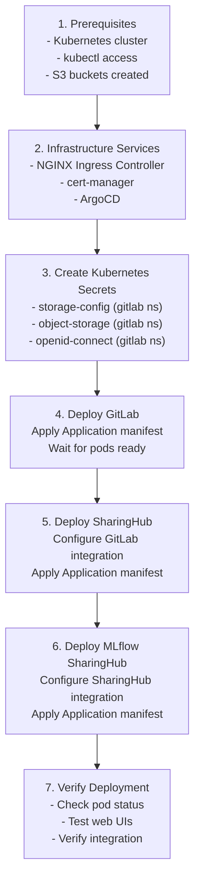
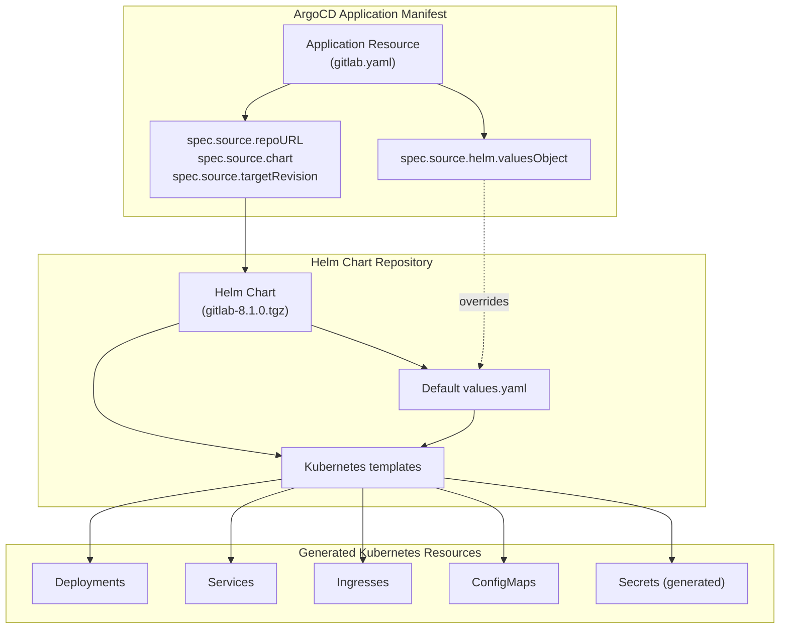
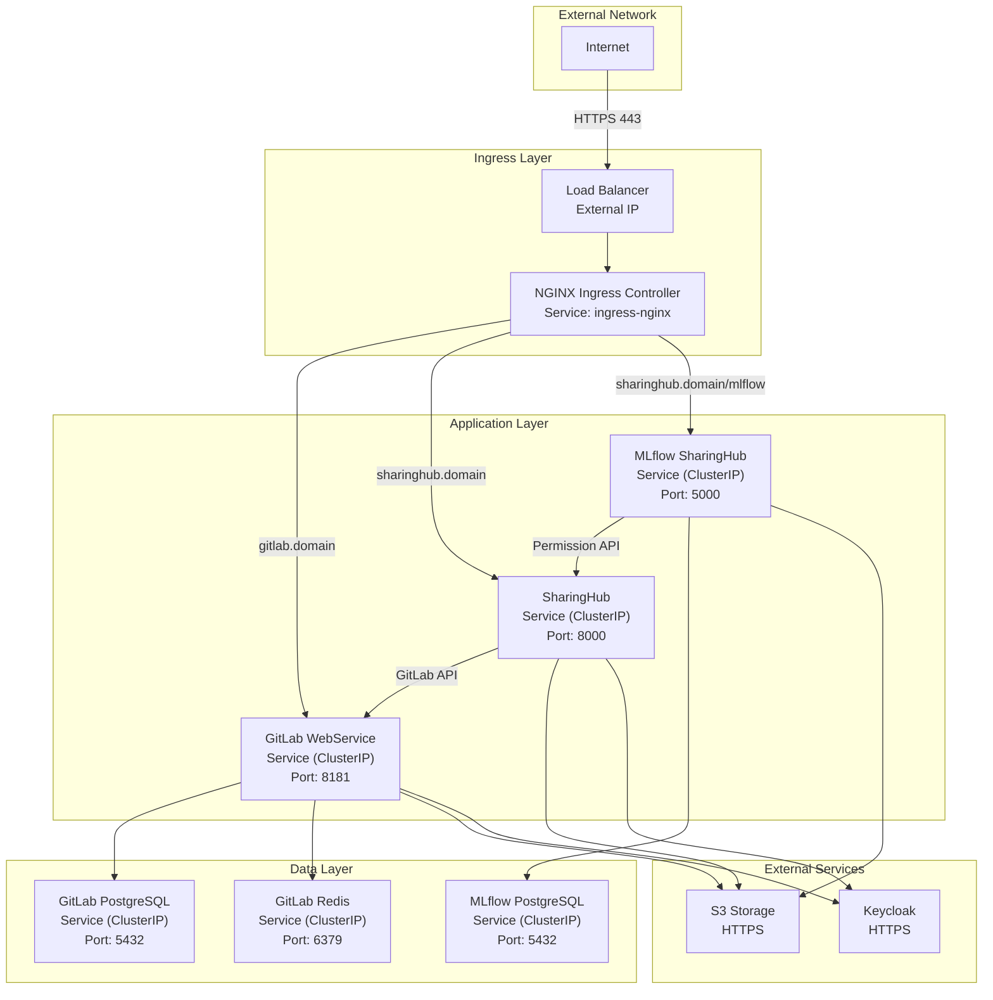

# Prerequisites and Architecture

<details>
<summary>Relevant source files</summary>

The following files were used as context for generating this wiki page:

- [docs/admin/deployment-guide/components/gitlab.md](docs/admin/deployment-guide/components/gitlab.md)
- [docs/admin/deployment-guide/intro.md](docs/admin/deployment-guide/intro.md)

</details>


## Purpose and Scope

This page describes the prerequisites and deployment architecture for the EOEPCA MLOps Building Block. It covers the Kubernetes infrastructure requirements, external service dependencies, and the ArgoCD-based GitOps deployment model used to install GitLab, SharingHub, and MLflow SharingHub components.

For step-by-step deployment instructions for each component, see [GitLab Deployment](#5.2), [SharingHub Deployment](#5.3), and [MLflow SharingHub Deployment](#5.4). For configuration details, see the [Configuration Reference](#6).

Sources: [docs/admin/deployment-guide/intro.md](), [docs/admin/deployment-guide/components/gitlab.md:1-15]()

---

## Prerequisites

### Kubernetes Cluster

A functional Kubernetes cluster is required with the following characteristics:

| Requirement | Description |
|-------------|-------------|
| **Kubernetes Version** | 1.23+ recommended |
| **Cluster Access** | `kubectl` access with cluster-admin privileges |
| **Namespace Creation** | Ability to create namespaces for component isolation |
| **Resource Capacity** | Sufficient CPU, memory, and storage for GitLab, SharingHub, and MLflow workloads |
| **Persistent Volumes** | Dynamic volume provisioning for PostgreSQL databases |

### Required Tools

The following command-line tools must be installed on the deployment machine:

- **kubectl** - Kubernetes command-line tool for cluster management
- **helm** (optional) - Package manager for Kubernetes, useful for testing configurations
- **argocd CLI** (optional) - ArgoCD command-line interface for application management

### External Services

#### S3-Compatible Object Storage

S3-compatible storage is required for GitLab backups, temporary storage, and optionally for Git LFS. The following buckets must be created before deployment:

| Bucket Name | Purpose | Required For |
|-------------|---------|--------------|
| `gitlab-backup-storage` | GitLab backup storage | GitLab |
| `gitlab-tmp-storage` | GitLab temporary files | GitLab |
| `gitlab-lfs-storage` | Git Large File Storage | GitLab (optional) |
| `mlflow-artifacts` | MLflow experiment artifacts and models | MLflow SharingHub |
| `sharinghub-assets` | SharingHub cached assets | SharingHub (optional) |

Access credentials (access key, secret key, endpoint URL) for the S3 provider must be available during deployment.

Sources: [docs/admin/deployment-guide/components/gitlab.md:16-20](), [docs/admin/deployment-guide/components/gitlab.md:42-43]()

#### Keycloak Identity Provider (Optional)

If Single Sign-On (SSO) authentication is desired, a Keycloak instance with the following configuration is required:

- A configured realm (e.g., `eoepca`)
- OIDC client created for GitLab with client ID `gitlab`
- Callback URL configured: `https://gitlab.<domain>/users/auth/openid_connect/callback`

Sources: [docs/admin/deployment-guide/components/gitlab.md:68-92]()

### Infrastructure Services

The following services must be deployed in the Kubernetes cluster before deploying the MLOps components:

#### NGINX Ingress Controller

An NGINX Ingress Controller must be installed to handle external HTTP/HTTPS traffic routing to the MLOps components.

#### cert-manager

The `cert-manager` controller must be deployed to automate TLS certificate provisioning and renewal. A ClusterIssuer named `letsencrypt-prod` should be configured to issue certificates from Let's Encrypt.

Sources: [docs/admin/deployment-guide/components/gitlab.md:131-135]()

---

## Deployment Architecture

### GitOps with ArgoCD

The MLOps Building Block uses a **GitOps deployment model** managed by ArgoCD. Each component (GitLab, SharingHub, MLflow SharingHub) is deployed as an ArgoCD `Application` resource that continuously reconciles the desired state from Helm charts.



**ArgoCD-Based Deployment Flow**

Each component is deployed by:
1. Creating an ArgoCD `Application` manifest in the `argocd` namespace
2. Specifying the Helm chart repository and version
3. Providing Helm values configuration in `spec.source.helm.valuesObject`
4. ArgoCD automatically syncs the desired state to the cluster

Sources: [docs/admin/deployment-guide/components/gitlab.md:107-230]()

---

### Namespace Architecture

The deployment follows a **multi-namespace architecture** for component isolation:

| Namespace | Components | Purpose |
|-----------|------------|---------|
| `argocd` | ArgoCD Application resources | GitOps control plane |
| `gitlab` | GitLab pods, PostgreSQL, Redis, secrets | Code repository and CI/CD platform |
| `sharinghub` | SharingHub pod, secrets | Discovery and collaboration platform |
| `mlflow` | MLflow pod, PostgreSQL, secrets | Experiment tracking and model registry |
| `cert-manager` | cert-manager controller | TLS certificate automation |
| `ingress-nginx` | NGINX Ingress Controller | HTTP/HTTPS traffic routing |



**Namespace Isolation Benefits:**
- **Security**: Secrets and resources are isolated per namespace
- **Resource Management**: Resource quotas and limits can be applied per namespace
- **Access Control**: RBAC policies can be scoped to specific namespaces
- **Organization**: Clear separation of component responsibilities

Sources: [docs/admin/deployment-guide/components/gitlab.md:35-36]()

---

### Kubernetes Secret Management

Sensitive configuration data is stored in Kubernetes `Secret` resources created before deploying the ArgoCD Applications:

#### GitLab Namespace Secrets

| Secret Name | Keys | Purpose |
|-------------|------|---------|
| `storage-config` | `config` | S3 credentials for GitLab backups (s3cmd format) |
| `object-storage` | `connection` | S3 credentials for Git LFS (YAML format) |
| `openid-connect` | `provider` | Keycloak OIDC configuration |

Creation example for `storage-config`:

```bash
kubectl create ns gitlab
kubectl create secret generic storage-config \
  --from-file=config=storage.config -n gitlab
```

Sources: [docs/admin/deployment-guide/components/gitlab.md:21-37](), [docs/admin/deployment-guide/components/gitlab.md:60-64](), [docs/admin/deployment-guide/components/gitlab.md:94-98]()

#### SharingHub Namespace Secrets

Secrets for SharingHub OIDC authentication and optional default access tokens are created in the `sharinghub` namespace (documented in [SharingHub Deployment](#5.3)).

#### MLflow Namespace Secrets

Secrets for MLflow SharingHub integration and database credentials are created in the `mlflow` namespace (documented in [MLflow SharingHub Deployment](#5.4)).

---

### Ingress and TLS Architecture

All external traffic is routed through the NGINX Ingress Controller with automated TLS certificate management:



**TLS Certificate Automation:**
1. Each `Ingress` resource includes `cert-manager.io/cluster-issuer: letsencrypt-prod` annotation
2. cert-manager detects the annotation and requests a certificate from Let's Encrypt
3. Certificate is stored in a Kubernetes `Secret` (e.g., `gitlab.domain-tls`)
4. NGINX Ingress Controller uses the secret for TLS termination
5. cert-manager automatically renews certificates before expiration

Sources: [docs/admin/deployment-guide/components/gitlab.md:131-135](), [docs/admin/deployment-guide/components/gitlab.md:170-198]()

---

### External Dependencies

The deployed components interact with external services outside the Kubernetes cluster:



**External Service Requirements:**

| Service | Protocol | Purpose | Configuration |
|---------|----------|---------|---------------|
| S3 Storage | HTTPS | Persistent storage for artifacts, backups, and LFS | Access key, secret key, endpoint URL, bucket names |
| Keycloak | HTTPS | OIDC-based authentication (optional) | Issuer URL, client ID, client secret |
| Let's Encrypt | ACME | TLS certificate issuance | Email address for certificate notifications |
| Helm Repositories | HTTPS | Helm chart retrieval | `charts.gitlab.io`, csgroup-oss repository |

Sources: [docs/admin/deployment-guide/components/gitlab.md:16-39](), [docs/admin/deployment-guide/components/gitlab.md:68-92]()

---

## Component Deployment Order

Components should be deployed in the following order to satisfy dependencies:



**Rationale for Deployment Order:**

1. **Infrastructure First**: NGINX and cert-manager must exist before deploying components that create Ingress resources
2. **GitLab Foundation**: GitLab must be deployed before SharingHub since SharingHub integrates with GitLab for project discovery
3. **SharingHub Before MLflow**: MLflow SharingHub delegates permission checks to SharingHub, requiring SharingHub to be operational first

Sources: [docs/admin/deployment-guide/intro.md:14]()

---

## Storage Architecture

Each component has specific storage requirements:

| Component | Storage Type | Purpose | Implementation |
|-----------|--------------|---------|----------------|
| **GitLab PostgreSQL** | PersistentVolume | Metadata, users, projects | `StatefulSet: gitlab-postgresql` with PVC |
| **GitLab Redis** | In-memory / PV | Cache, job queues | `Deployment: gitlab-redis` |
| **GitLab Backups** | S3 Object Storage | Scheduled backups | `gitlab-backup-storage` bucket |
| **GitLab LFS** | S3 Object Storage | Large file storage (optional) | `gitlab-lfs-storage` bucket |
| **MLflow PostgreSQL** | PersistentVolume | Experiment metadata, model registry | `StatefulSet: mlflow-postgresql` with PVC |
| **MLflow Artifacts** | S3 Object Storage | Model files, artifacts | `mlflow-artifacts` bucket |
| **SharingHub** | None (stateless) | Queries GitLab API dynamically | No persistent storage required |

**Backup Strategy:**
- GitLab: Automated backups to S3 configured via `global.appConfig.backups` in Helm values
- MLflow PostgreSQL: Database backups should be configured using standard PostgreSQL backup tools
- S3 buckets: Configure bucket versioning and lifecycle policies at the S3 provider level

Sources: [docs/admin/deployment-guide/components/gitlab.md:162-164](), [docs/admin/deployment-guide/components/gitlab.md:179-184]()

---

## Helm Chart Configuration Model

Each ArgoCD Application references a Helm chart with configuration provided via `spec.source.helm.valuesObject`:



**Configuration Hierarchy:**

1. **Default Values**: Defined in the Helm chart's `values.yaml`
2. **Override Values**: Specified in `spec.source.helm.valuesObject` in the ArgoCD Application manifest
3. **Template Rendering**: Helm merges defaults with overrides and renders Kubernetes resource templates
4. **ArgoCD Sync**: ArgoCD applies rendered resources to the cluster

**Example from GitLab Application:**

The `valuesObject` section in [docs/admin/deployment-guide/components/gitlab.md:125-225]() demonstrates configuration for:
- Domain name: `global.hosts.domain`
- Ingress class and TLS: `global.ingress.class`, `global.ingress.annotations`
- Component enablement: `global.registry.enabled`, `global.minio.enabled`
- OIDC integration: `global.appConfig.omniauth.enabled`, `global.appConfig.omniauth.providers`
- S3 bucket configuration: `global.appConfig.backups.bucket`, `global.appConfig.lfs.bucket`

Sources: [docs/admin/deployment-guide/components/gitlab.md:107-230]()

---

## Network Architecture

The network architecture shows how components communicate within the Kubernetes cluster:



**Network Security:**
- **External Access**: Only HTTPS (port 443) exposed via Load Balancer
- **Internal Communication**: All services use `ClusterIP` type, accessible only within cluster
- **Service Mesh**: No service mesh required; standard Kubernetes Service discovery used
- **Network Policies**: Can be optionally configured for additional isolation (not included in base deployment)

Sources: [docs/admin/deployment-guide/components/gitlab.md:131-135](), [docs/admin/deployment-guide/components/gitlab.md:170-178]()

---

## Resource Requirements

Recommended resource allocations for each component:

| Component | CPU Request | Memory Request | CPU Limit | Memory Limit | Storage |
|-----------|-------------|----------------|-----------|--------------|---------|
| GitLab webservice | 1-2 cores | 2-4 GB | 4 cores | 8 GB | N/A |
| GitLab sidekiq | 0.5-1 core | 1-2 GB | 2 cores | 4 GB | N/A |
| GitLab PostgreSQL | 0.5-1 core | 1-2 GB | 2 cores | 4 GB | 20-100 GB PV |
| GitLab Redis | 0.2 cores | 256 MB | 1 core | 1 GB | 5-10 GB PV |
| SharingHub | 0.5 cores | 512 MB | 2 cores | 2 GB | N/A |
| MLflow SharingHub | 0.5 cores | 512 MB | 2 cores | 2 GB | N/A |
| MLflow PostgreSQL | 0.5 cores | 512 MB | 1 core | 2 GB | 10-50 GB PV |

**Sizing Considerations:**
- GitLab resource requirements scale with number of users and repositories
- MLflow PostgreSQL size depends on experiment tracking volume
- S3 storage is effectively unlimited and usage-based

**Production Recommendations:**
- Enable pod autoscaling for GitLab webservice based on CPU/memory utilization
- Configure resource limits to prevent resource exhaustion
- Monitor actual usage and adjust requests/limits accordingly

---

## High Availability Considerations

The default deployment configuration is **single-instance** for simplicity. For production high availability:

| Component | HA Strategy | Implementation |
|-----------|-------------|----------------|
| GitLab webservice | Horizontal scaling | Increase `replicaCount` in Helm values |
| GitLab PostgreSQL | Primary-replica replication | Use external managed PostgreSQL service |
| GitLab Redis | Sentinel/Cluster mode | Enable GitLab Redis HA in Helm chart |
| SharingHub | Horizontal scaling | Deploy multiple replicas (stateless) |
| MLflow SharingHub | Horizontal scaling | Deploy multiple replicas with shared PostgreSQL |
| MLflow PostgreSQL | Primary-replica replication | Use external managed PostgreSQL service |
| S3 Storage | Provider-managed | S3 providers handle replication |
| NGINX Ingress | Multiple replicas | Default configuration typically includes HA |

For production deployments, consider:
- Using managed database services (e.g., Amazon RDS, Google Cloud SQL) instead of in-cluster PostgreSQL
- Configuring multiple replicas for all stateless components
- Implementing pod anti-affinity rules to distribute replicas across nodes
- Setting up monitoring and alerting for component health

---

## Summary

The MLOps Building Block deployment architecture is characterized by:

1. **GitOps Management**: ArgoCD continuously reconciles desired state from Helm charts
2. **Namespace Isolation**: Each component deployed in dedicated namespace with isolated secrets
3. **External Dependencies**: Relies on S3 storage, optional Keycloak, and Let's Encrypt for TLS
4. **Automated TLS**: cert-manager handles certificate lifecycle without manual intervention
5. **Modular Design**: Components can be deployed independently with clear dependency order

Proceed to component-specific deployment guides:
- [GitLab Deployment](#5.2) for deploying the GitLab instance
- [SharingHub Deployment](#5.3) for deploying the discovery platform
- [MLflow SharingHub Deployment](#5.4) for deploying the experiment tracking platform

Sources: [docs/admin/deployment-guide/intro.md](), [docs/admin/deployment-guide/components/gitlab.md]()