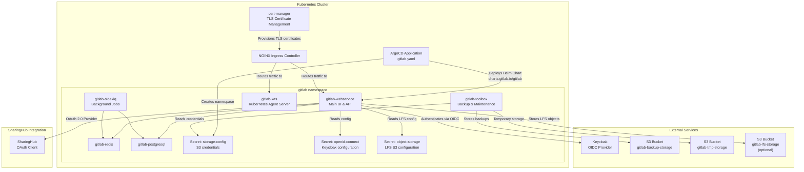
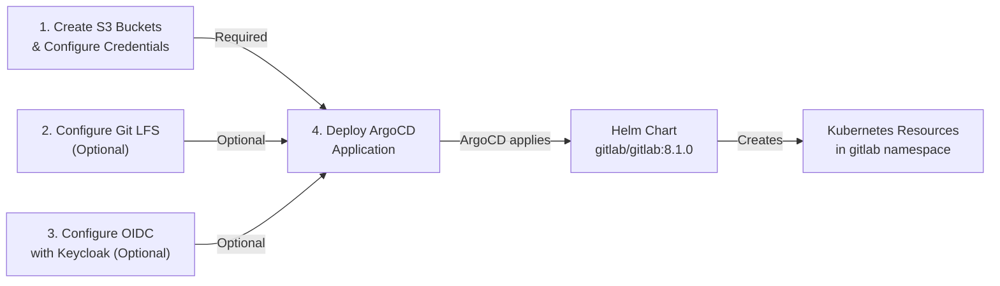
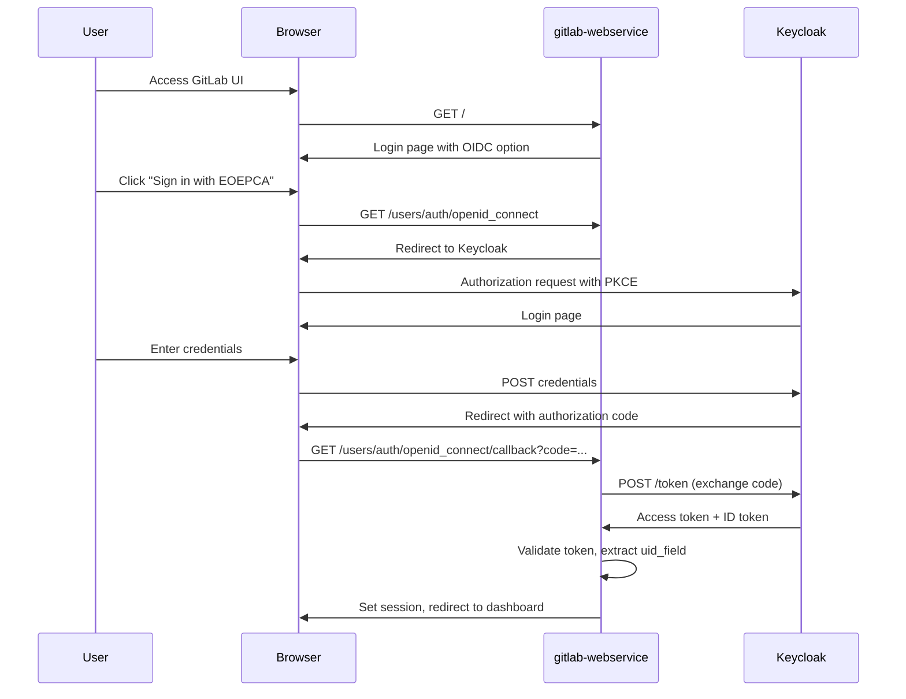
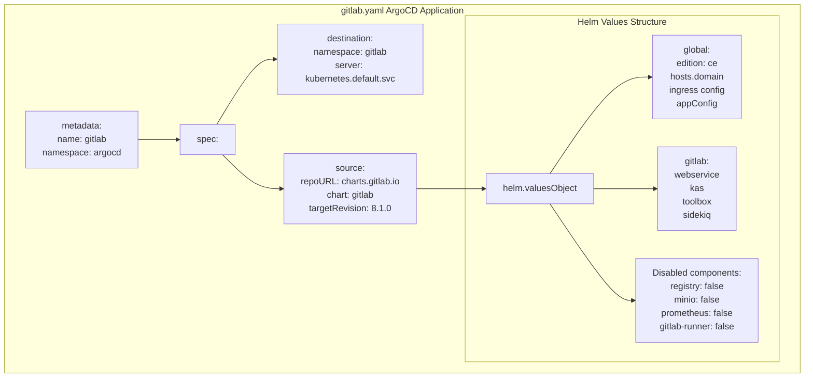

# GitLab Deployment

<details>
<summary>Relevant source files</summary>

The following files were used as context for generating this wiki page:

- [docs/admin/deployment-guide/components/gitlab.md](docs/admin/deployment-guide/components/gitlab.md)

</details>


## Purpose and Scope

This page provides detailed instructions for deploying GitLab to a Kubernetes cluster using ArgoCD and Helm. GitLab serves as the foundation of the MLOps Building Block, providing version control, project management, CI/CD capabilities, and serving as the source of truth for the SharingHub STAC catalog.

This deployment guide covers GitLab in minimal mode with optional Keycloak OIDC integration. For overall deployment architecture and prerequisites, see [Prerequisites and Architecture](#5.1). For deploying the other components, see [SharingHub Deployment](#5.3) and [MLflow SharingHub Deployment](#5.4).

**Note**: This deployment is optional. If you already have a GitLab instance that meets the platform requirements, you may skip this section and configure SharingHub to use your existing instance.

## GitLab Role in the MLOps Platform

GitLab functions as the central repository and project management system within the EOEPCA MLOps platform. It provides:

- **Version Control**: Git repository hosting for model code, training scripts, and configuration files
- **Project Organization**: Project-based structure with topics that map to SharingHub categories
- **Authentication**: OAuth provider for SharingHub and identity integration with Keycloak via OIDC
- **Metadata Source**: Project metadata (topics, tags, descriptions) extracted by SharingHub for STAC catalog generation
- **Artifact Storage**: Integration with S3 for backups and optional Git LFS for large file storage

### GitLab Integration Points



**Diagram: GitLab Deployment Architecture and Dependencies**

Sources: [docs/admin/deployment-guide/components/gitlab.md:1-243]()

## Deployment Workflow

The GitLab deployment follows a four-step process:



**Diagram: GitLab Deployment Workflow**

Sources: [docs/admin/deployment-guide/components/gitlab.md:6-11]()

## Prerequisites

Before deploying GitLab, ensure the following prerequisites are met:

| Requirement | Description | Reference |
|------------|-------------|-----------|
| Kubernetes Cluster | Running cluster with sufficient resources | See [Prerequisites and Architecture](#5.1) |
| ArgoCD | Installed and configured | See [Prerequisites and Architecture](#5.1) |
| cert-manager | Installed for TLS certificate management | See [Prerequisites and Architecture](#5.1) |
| NGINX Ingress Controller | Installed for ingress routing | See [Prerequisites and Architecture](#5.1) |
| S3 Provider | Compatible S3 service for object storage | Required |
| Keycloak | OIDC provider (optional) | For OIDC authentication |
| Domain Name | DNS records configured | Required for ingress |

Sources: [docs/admin/deployment-guide/components/gitlab.md:1-14]()

## S3 Storage Configuration

GitLab requires S3-compatible object storage for backups and temporary storage. Git LFS requires an additional bucket if enabled.

### Required S3 Buckets

Create the following S3 buckets in your S3 provider:

| Bucket Name | Purpose | Required |
|------------|---------|----------|
| `gitlab-backup-storage` | GitLab backups | Yes |
| `gitlab-tmp-storage` | Temporary storage | Yes |
| `gitlab-lfs-storage` | Git LFS objects | Only if LFS enabled |

Sources: [docs/admin/deployment-guide/components/gitlab.md:16-19]()

### S3 Configuration File

Create a configuration file `storage.config` with S3 credentials and endpoint information:

```conf
[default]
access_key = <access_key>
bucket_location = <bucket_region>
host_base = <s3_endpoint>
secret_key = <secret_key>
use_https = True
```

This configuration format follows the s3cmd configuration specification used by GitLab's toolbox component for backup operations.

Sources: [docs/admin/deployment-guide/components/gitlab.md:21-30]()

### Create Storage Config Secret

Create the `gitlab` namespace and the `storage-config` secret:

```bash
kubectl create ns gitlab
kubectl create secret generic storage-config --from-file=config=storage.config -n gitlab
```

The secret key `config` maps to the file content and is referenced in the GitLab Helm values at [docs/admin/deployment-guide/components/gitlab.md:182-184]().

Sources: [docs/admin/deployment-guide/components/gitlab.md:32-37]()

## Git LFS Configuration (Optional)

Git Large File Storage (LFS) enables efficient handling of large binary files in Git repositories. This is particularly useful for ML datasets and model artifacts.

### LFS S3 Configuration File

Create a configuration file `lfs-s3.yaml`:

```yaml
provider: AWS
region: eu
aws_access_key_id: <access_key>
aws_secret_access_key: <secret_key>
aws_signature_version: 4
host: <s3_endpoint>
endpoint: "https://<s3_endpoint>"
path_style: true
```

Key parameters:
- `provider`: Set to `AWS` for S3-compatible services
- `region`: S3 bucket region
- `aws_signature_version`: Use version 4 for compatibility
- `path_style`: Use path-style URLs for S3-compatible services

Sources: [docs/admin/deployment-guide/components/gitlab.md:44-58]()

### Create LFS Secret

Create the `object-storage` secret in the `gitlab` namespace:

```bash
kubectl create secret generic object-storage --from-file=connection=lfs-s3.yaml -n gitlab
```

This secret is referenced in the Helm values at [docs/admin/deployment-guide/components/gitlab.md:153-155]() under `global.appConfig.lfs.connection`.

Sources: [docs/admin/deployment-guide/components/gitlab.md:60-64]()

## OIDC Configuration (Optional)

Integrating GitLab with Keycloak enables Single Sign-On (SSO) authentication across the MLOps platform.

### Keycloak Client Setup

1. Access your Keycloak admin console
2. Navigate to your realm (e.g., `eoepca`)
3. Create a new client with ID `gitlab`
4. Configure the client:
   - **Client Protocol**: openid-connect
   - **Access Type**: confidential
   - **Valid Redirect URIs**: `https://gitlab.<domain_name>/users/auth/openid_connect/callback`

### OIDC Provider Configuration File

Create a configuration file `provider.yaml`:

```yaml
name: openid_connect
label: EOEPCA
icon: "https://eoepca.readthedocs.io/img/favicon.ico"
args:
  name: openid_connect
  scope: ["openid", "profile", "email"]
  response_type: "code"
  issuer: "https://<keycloak_domain>/realms/<your_realm>"
  client_auth_method: "query"
  discovery: true
  uid_field: "preferred_username"
  pkce: true
  client_options:
    identifier: "gitlab"
    secret: <client_secret>
    redirect_uri: "https://gitlab.<domain_name>/users/auth/openid_connect/callback"
```

Configuration parameters:
- `name`: OmniAuth strategy name (`openid_connect`)
- `label`: Display name shown on login page
- `issuer`: Keycloak realm issuer URL
- `discovery`: Enable automatic endpoint discovery
- `pkce`: Enable Proof Key for Code Exchange for enhanced security
- `uid_field`: OIDC claim used as GitLab username

Sources: [docs/admin/deployment-guide/components/gitlab.md:70-92]()

### Create OIDC Secret

Create the `openid-connect` secret:

```bash
kubectl create secret generic -n gitlab openid-connect --from-file=provider=provider.yaml
```

This secret is referenced in the Helm values at [docs/admin/deployment-guide/components/gitlab.md:147-148]() under `global.appConfig.omniauth.providers`.

Sources: [docs/admin/deployment-guide/components/gitlab.md:94-98]()

### OIDC Authentication Flow



**Diagram: OIDC Authentication Flow**

Sources: [docs/admin/deployment-guide/components/gitlab.md:68-103]()

## ArgoCD Application Deployment

The GitLab deployment is managed through an ArgoCD Application manifest that references the official GitLab Helm chart.

### Application Manifest Structure



**Diagram: ArgoCD Application Manifest Structure**

Sources: [docs/admin/deployment-guide/components/gitlab.md:107-230]()

### Create Application Manifest

Create a file `gitlab.yaml` with the ArgoCD Application definition. The manifest structure is as follows:

| Section | Purpose | Configuration |
|---------|---------|---------------|
| `metadata` | Application identity | Name: `gitlab`, Namespace: `argocd` |
| `spec.destination` | Target cluster and namespace | Namespace: `gitlab`, Server: local cluster |
| `spec.source` | Helm chart source | Chart: `gitlab` from `charts.gitlab.io`, Version: `8.1.0` |
| `spec.source.helm.valuesObject` | Helm values override | GitLab configuration values |
| `spec.syncPolicy` | Synchronization behavior | Create namespace, fail on shared resources |

Sources: [docs/admin/deployment-guide/components/gitlab.md:107-230]()

### Helm Values Configuration

The Helm values in the ArgoCD Application configure GitLab's deployment. Key sections:

#### Global Configuration

[docs/admin/deployment-guide/components/gitlab.md:126-164]()

```yaml
global:
  edition: ce
  hosts:
    domain: <domain_name>
  
  ingress:
    configureCertmanager: false
    class: nginx
    annotations:
      cert-manager.io/cluster-issuer: letsencrypt-prod
  
  registry:
    enabled: false
  
  minio:
    enabled: false
```

Parameters:
- `edition: ce` - GitLab Community Edition
- `hosts.domain` - Base domain for all GitLab services
- `ingress.configureCertmanager: false` - Use existing cert-manager installation
- `ingress.class: nginx` - Use NGINX ingress controller
- `registry.enabled: false` - Disable built-in container registry (minimal mode)
- `minio.enabled: false` - Use external S3 instead of embedded MinIO

#### Application Configuration

[docs/admin/deployment-guide/components/gitlab.md:143-164]()

```yaml
global:
  appConfig:
    omniauth:
      enabled: false  # Set to true for OIDC
      # allowSingleSignOn: ["saml", "openid_connect"]
      # providers:
      #   - secret: openid-connect
    
    lfs:
      enabled: false  # Set to true for Git LFS
      bucket: gitlab-lfs-storage
      connection:
        secret: object-storage
        key: connection
    
    artifacts:
      enabled: false
    uploads:
      enabled: false
    packages:
      enabled: false
    backups:
      bucket: gitlab-backup-storage
      tmpBucket: gitlab-tmp-storage
```

Configuration options:
- `omniauth.enabled` - Enable/disable OIDC authentication
- `omniauth.providers[].secret` - References the `openid-connect` Kubernetes secret
- `lfs.enabled` - Enable/disable Git LFS
- `lfs.connection.secret` - References the `object-storage` Kubernetes secret
- `backups.bucket` - S3 bucket for GitLab backups (uses `storage-config` secret)

#### Component Configuration

[docs/admin/deployment-guide/components/gitlab.md:169-187]()

```yaml
gitlab:
  webservice:
    ingress:
      tls:
        secretName: gitlab.<domain_name>-tls
  
  kas:
    ingress:
      tls:
        secretName: kas.<domain_name>-tls
  
  toolbox:
    backups:
      objectStorage:
        config:
          secret: storage-config
          key: config
  
  sidekiq:
    enabled: true
```

Components:
- `webservice` - Main GitLab web UI and API server
- `kas` - Kubernetes Agent Server for GitLab Agent integration
- `toolbox` - Maintenance tasks including backups (references `storage-config` secret)
- `sidekiq` - Background job processor

#### Disabled Components

[docs/admin/deployment-guide/components/gitlab.md:189-224]()

In minimal mode, the following components are disabled:

| Component | Purpose | Status |
|-----------|---------|--------|
| `registry` | Container image registry | Disabled |
| `certmanager` | Certificate management | Disabled (use existing) |
| `nginx-ingress` | Ingress controller | Disabled (use existing) |
| `nginx-ingress-geo` | Geo replication ingress | Disabled |
| `prometheus` | Metrics collection | Disabled |
| `gitlab-runner` | CI/CD runner | Disabled |

### Deploy the Application

1. **Update placeholders** in `gitlab.yaml`:
   - Replace `<domain_name>` with your actual domain (e.g., `example.com`)
   - Update `certmanager-issuer.email` with your email address

2. **Apply the manifest**:

```bash
kubectl apply -f gitlab.yaml
```

3. **Monitor deployment**:

```bash
# Watch ArgoCD Application status
kubectl get application gitlab -n argocd -w

# Check pod status in gitlab namespace
kubectl get pods -n gitlab

# View GitLab logs
kubectl logs -n gitlab -l app=webservice
```

The deployment typically takes 5-10 minutes as ArgoCD synchronizes the application and Kubernetes creates all resources.

Sources: [docs/admin/deployment-guide/components/gitlab.md:232-242]()

## Post-Deployment Verification

After successful deployment, verify the GitLab installation:

1. **Access GitLab UI**:
   - Navigate to `https://gitlab.<domain_name>`
   - The TLS certificate should be automatically provisioned by cert-manager

2. **Retrieve initial root password**:
   ```bash
   kubectl get secret gitlab-gitlab-initial-root-password -n gitlab -o jsonpath='{.data.password}' | base64 --decode
   ```

3. **Login as root user**:
   - Username: `root`
   - Password: Retrieved from secret above

4. **Verify OIDC integration** (if enabled):
   - Check for "Sign in with EOEPCA" button on login page
   - Test authentication flow with Keycloak

5. **Verify S3 backup configuration**:
   - Check GitLab admin area → Settings → Backups
   - Confirm connection to S3 buckets

6. **Create test project**:
   - Create a new project to verify basic functionality
   - If LFS enabled, test large file push

## Configuration Reference

For detailed GitLab configuration options beyond this deployment guide:

- [GitLab Helm Chart Documentation](https://docs.gitlab.com/charts/)
- [External Object Storage Configuration](https://docs.gitlab.com/charts/advanced/external-object-storage/)
- [GitLab OIDC Configuration](https://docs.gitlab.com/ee/administration/auth/oidc.html)
- [OmniAuth Configuration](https://docs.gitlab.com/charts/charts/globals.html#omniauth)

For SharingHub integration with this GitLab instance, see [SharingHub Deployment](#5.3).

Sources: [docs/admin/deployment-guide/components/gitlab.md:14-242]()