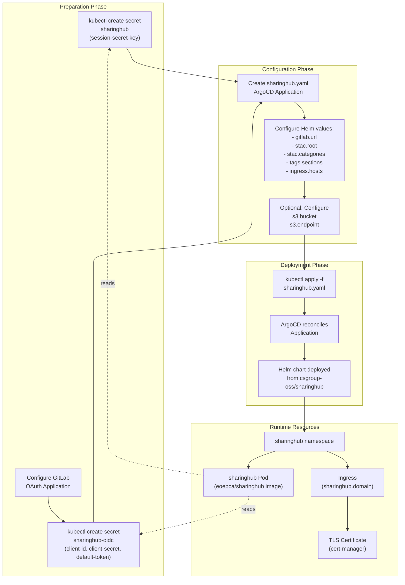
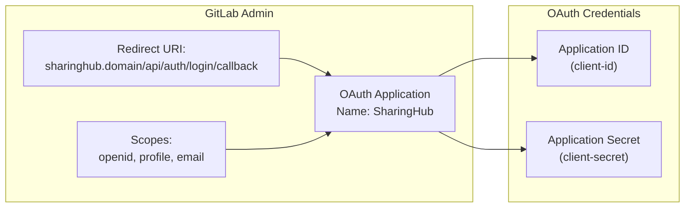
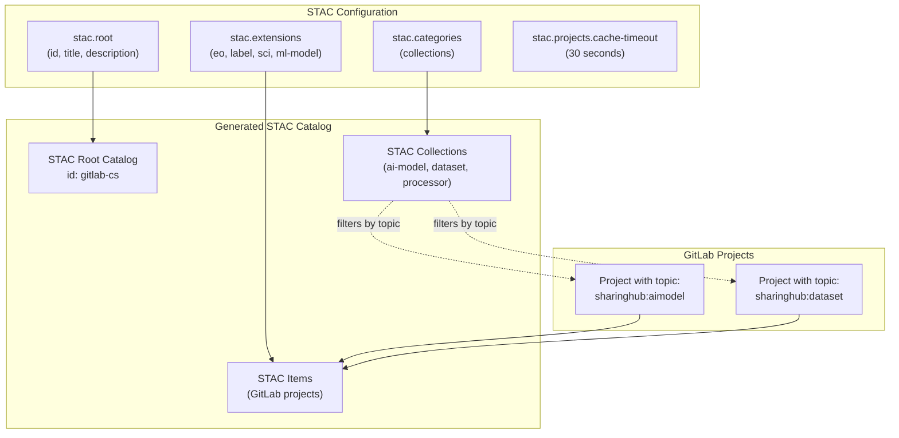
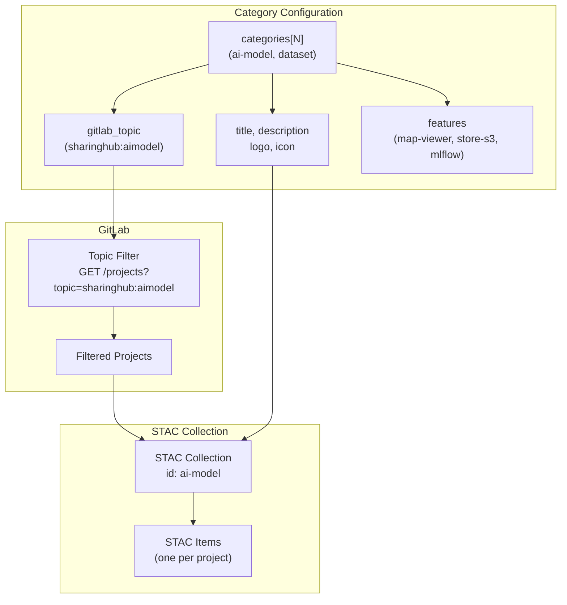
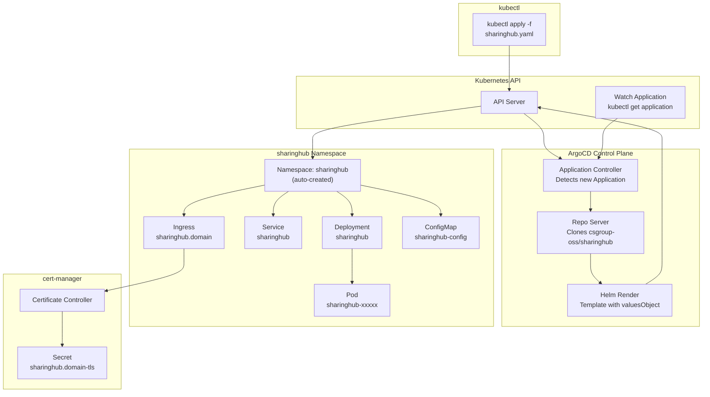

# SharingHub Deployment

<details>
<summary>Relevant source files</summary>

The following files were used as context for generating this wiki page:

- [docs/admin/deployment-guide/components/sharinghub.md](docs/admin/deployment-guide/components/sharinghub.md)

</details>


This document provides step-by-step instructions for deploying SharingHub on a Kubernetes cluster using ArgoCD and Helm charts. SharingHub serves as the discovery and collaboration platform within the MLOps Building Block, exposing GitLab projects as a STAC-compliant catalog.

For general deployment prerequisites and architecture, see [Prerequisites and Architecture](#5.1). For deploying the required GitLab instance, see [GitLab Deployment](#5.2). For deploying MLflow SharingHub that integrates with this deployment, see [MLflow SharingHub Deployment](#5.4).

## Deployment Overview

SharingHub deployment involves three main phases: preparation of Kubernetes secrets, configuration of the ArgoCD Application manifest with Helm values, and application of the manifest to trigger deployment. The deployment process uses GitOps principles with ArgoCD managing the Helm chart from the upstream SharingHub repository.



**Deployment workflow from preparation to runtime resources**

Sources: [docs/admin/deployment-guide/components/sharinghub.md:1-215]()

## Prerequisites

Before deploying SharingHub, ensure the following prerequisites are met:

| Requirement | Description | Reference |
|------------|-------------|-----------|
| Kubernetes Cluster | Running cluster with kubectl access | [Prerequisites and Architecture](#5.1) |
| ArgoCD | Installed and configured in `argocd` namespace | [Prerequisites and Architecture](#5.1) |
| GitLab Instance | Deployed and accessible | [GitLab Deployment](#5.2) |
| cert-manager | Installed for TLS certificate management | [Prerequisites and Architecture](#5.1) |
| NGINX Ingress | Ingress controller configured | [Prerequisites and Architecture](#5.1) |
| Domain Name | DNS configured for `sharinghub.<domain>` | [Prerequisites and Architecture](#5.1) |

Sources: [docs/admin/deployment-guide/components/sharinghub.md:6-46]()

## Preparation Steps

### Create Session Secret

SharingHub requires a secret key for session management and security purposes. Create the `sharinghub` secret in the `sharinghub` namespace:

```bash
kubectl create secret generic sharinghub \
  --from-literal session-secret-key="<uuid>" \
  --namespace sharinghub
```

The `session-secret-key` should be a randomly generated UUID or similar cryptographically secure value. This secret is mounted by the SharingHub Pod at runtime.

Sources: [docs/admin/deployment-guide/components/sharinghub.md:8-14]()

### Configure GitLab OAuth Application

SharingHub uses OpenID Connect (OIDC) for authentication via GitLab. Configure an OAuth application in your GitLab instance:

1. Navigate to GitLab Admin Area → Applications → New Application
2. Configure the application with the following settings:
   - **Name**: SharingHub
   - **Redirect URI / Callback URL**:
     ```
     https://sharinghub.<domain-name>/api/auth/login/callback
     ```
   - **Scopes**: Select `openid`, `profile`, `email`
   - **Confidential**: Yes

3. After creation, GitLab provides an **Application ID** and **Application Secret**. Save these values for the next step.



**GitLab OAuth application configuration flow**

Sources: [docs/admin/deployment-guide/components/sharinghub.md:16-37]()

### Create OIDC Secret

Create the `sharinghub-oidc` secret with the OAuth credentials obtained from GitLab:

```bash
kubectl create secret generic sharinghub-oidc \
  --from-literal client-id="<application-id>" \
  --from-literal client-secret="<application-secret>" \
  --namespace sharinghub
```

#### Optional: Default Token for Public Access

To allow unauthenticated users to access public projects, configure a `default-token`. This can be either a GitLab Personal Access Token (PAT) or a Group Access Token:

**For Group Access Token:**
- Role: `Reporter` (minimum)
- Scopes: `read_api`, `read_repository`

**For Personal Access Token:**
- Scopes: `api`

Add the `default-token` to the secret:

```bash
kubectl create secret generic sharinghub-oidc \
  --from-literal default-token="<default-token>" \
  --from-literal client-id="<application-id>" \
  --from-literal client-secret="<application-secret>" \
  --namespace sharinghub
```

Without a default token, users must authenticate to view any projects, including public ones.

Sources: [docs/admin/deployment-guide/components/sharinghub.md:39-45]()

## ArgoCD Application Configuration

### Application Manifest Structure

Create a file named `sharinghub.yaml` with the ArgoCD Application manifest. The manifest references the upstream Helm chart from the SharingHub repository and configures all necessary values:

```yaml
apiVersion: argoproj.io/v1alpha1
kind: Application
metadata:
  name: sharinghub
  namespace: argocd
spec:
  destination:
    namespace: sharinghub
    server: https://kubernetes.default.svc
  project: default
  source:
    repoURL: https://github.com/csgroup-oss/sharinghub.git
    path: deploy/helm/sharinghub
    targetRevision: "0.4.0"
    helm:
      valuesObject:
        # Configuration detailed in following sections
  syncPolicy:
    syncOptions:
      - FailOnSharedResource=true
      - CreateNamespace=true
    automated:
      selfHeal: true
```

Key manifest fields:

| Field | Value | Purpose |
|-------|-------|---------|
| `metadata.name` | `sharinghub` | Application identifier in ArgoCD |
| `metadata.namespace` | `argocd` | ArgoCD control plane namespace |
| `spec.destination.namespace` | `sharinghub` | Target Kubernetes namespace |
| `spec.source.repoURL` | `https://github.com/csgroup-oss/sharinghub.git` | Upstream Helm chart repository |
| `spec.source.path` | `deploy/helm/sharinghub` | Path to Helm chart in repository |
| `spec.source.targetRevision` | `"0.4.0"` | SharingHub version tag |
| `syncPolicy.automated.selfHeal` | `true` | Auto-remediate configuration drift |

Sources: [docs/admin/deployment-guide/components/sharinghub.md:49-191]()

### Helm Values Configuration

The `spec.source.helm.valuesObject` section contains the SharingHub server configuration. Below are the essential configuration blocks.

#### GitLab Integration

Configure the GitLab instance URL:

```yaml
config: |-
  gitlab:
    url: https://gitlab.<domain_name>
```

SharingHub connects to this URL to:
- Authenticate users via OIDC
- Fetch project metadata
- Validate project permissions
- Extract topics and tags from projects

Sources: [docs/admin/deployment-guide/components/sharinghub.md:68-71]()

#### Documentation URL

Configure the documentation URL (typically co-located with SharingHub):

```yaml
config: |-
  docs:
    url: https://sharinghub.<domain_name>/docs
```

Sources: [docs/admin/deployment-guide/components/sharinghub.md:73-74]()

### STAC Catalog Configuration

SharingHub dynamically generates a STAC-compliant catalog from GitLab projects. The STAC configuration defines the catalog structure, extensions, and root metadata.



**STAC catalog generation from configuration to GitLab projects**

#### Root Catalog

Define the root STAC catalog metadata:

```yaml
stac:
  projects:
    cache-timeout: 30
  extensions:
    eo: https://stac-extensions.github.io/eo/v1.1.0/schema.json
    label: https://stac-extensions.github.io/label/v1.0.1/schema.json
    sci: https://stac-extensions.github.io/scientific/v1.0.0/schema.json
    ml-model: https://stac-extensions.github.io/ml-model/v1.0.0/schema.json
  root:
    id: gitlab-cs
    title: SharingHub brings your data and models closer.
    description: Your platform for collaborating on ML and NLP projects store in [GitLab](https://gitlab.com) instance STAC catalog.
```

Configuration keys:

| Key | Description |
|-----|-------------|
| `stac.projects.cache-timeout` | Cache duration (seconds) for project metadata |
| `stac.extensions` | STAC extensions enabled for items |
| `stac.root.id` | Unique identifier for root catalog |
| `stac.root.title` | Human-readable catalog title |
| `stac.root.description` | Markdown-formatted catalog description |

Sources: [docs/admin/deployment-guide/components/sharinghub.md:76-91]()

#### Localization Support

The STAC root catalog supports multiple locales:

```yaml
stac:
  root:
    locales:
      fr:
        title: SharingHub rapproche vos données et vos modèles.
        description: Votre plateforme de collaboration sur les projets ML et NLP stockés dans le catalogue STAC de l'instance [GitLab](https://gitlab.com).
```

Sources: [docs/admin/deployment-guide/components/sharinghub.md:88-91]()

### Categories and GitLab Topics

Categories in SharingHub map to STAC collections and are filtered by GitLab topics. Each category configuration includes metadata, features, and GitLab topic mapping.



**Category-to-collection mapping with GitLab topic filtering**

#### AI Model Category Example

```yaml
stac:
  categories:
    - ai-model:
        title: "AI Models"
        description: "AI models are the core of our platform, go and browse them to discover our models."
        gitlab_topic: sharinghub:aimodel
        logo: https://data.web.<domain_name>/sharinghub/ai-model.jpg
        icon: https://img.icons8.com/material/24/artificial-intelligence.png
        locales:
          fr:
            title: "Modèles IA"
            description: "Les modèles d'IA sont au cœur de notre plateforme, allez les parcourir pour découvrir nos modèles."
        features:
          map-viewer: enable
          store-s3: enable
          mlflow: enable
```

Category configuration fields:

| Field | Description | Example Value |
|-------|-------------|---------------|
| `ai-model` | Category identifier (becomes STAC collection ID) | `ai-model` |
| `title` | Display name | `"AI Models"` |
| `description` | Category description | Markdown text |
| `gitlab_topic` | GitLab topic for filtering projects | `sharinghub:aimodel` |
| `logo` | Banner image URL | `https://...` |
| `icon` | Small icon URL | `https://...` |
| `features.map-viewer` | Enable geospatial map viewer | `enable` / `disable` |
| `features.store-s3` | Enable S3 asset storage | `enable` / `disable` |
| `features.mlflow` | Enable MLflow integration | `enable` / `disable` |

Sources: [docs/admin/deployment-guide/components/sharinghub.md:92-120]()

#### Dataset Category Example

```yaml
    - dataset:
        title: "Datasets"
        description: "Datasets are very important in the process of training an AI, discover those that we put at your disposal."
        gitlab_topic: sharinghub:dataset
        logo: https://data.web.<domain_name>/sharinghub/datasets.jpg
        icon: https://img.icons8.com/ios/50/data-backup.png
        features:
          map-viewer: enable
          store-s3: enable
          mlflow: disable
```

Note that the `dataset` category has `mlflow: disable` since datasets are not tracked in MLflow, only AI models.

Sources: [docs/admin/deployment-guide/components/sharinghub.md:107-120]()

### Tags Configuration

Tags provide additional organization within categories. Projects are tagged using GitLab project tags, and SharingHub organizes them into sections.

```yaml
tags:
  gitlab:
    minimum_count: 1
  sections:
    - name: "Computer Vision"
      enabled_for:
        - ai-model
        - dataset
      keywords:
        - "Image qualification"
        - "Object detection"
        - "Image segmentation"
        - "Mask generation"
    - name: "Multimodal"
      keywords:
        - "Feature Extraction"
        - "Text-to-Image"
        - "Image-to-3D"
        - "Text-to-3D"
      enabled_for:
        - ai-model
        - dataset
    - name: "Tabular"
      keywords:
        - "Tabular Classification"
        - "Tabular Regression"
      enabled_for:
        - ai-model
        - dataset
```

Tags configuration structure:

| Field | Description |
|-------|-------------|
| `tags.gitlab.minimum_count` | Minimum occurrences for a tag to appear in UI |
| `tags.sections[].name` | Tag section display name |
| `tags.sections[].enabled_for` | Categories where this section applies |
| `tags.sections[].keywords` | List of recognized tag keywords |

Tags from GitLab projects that match the keywords appear organized under their respective sections in the SharingHub UI.

Sources: [docs/admin/deployment-guide/components/sharinghub.md:122-150]()

### Alert Configuration

Configure optional informational alerts displayed in the web UI:

```yaml
alerts:
  timeout: 3
  type: info
  title: "Welcome to SharingHub"
  message: "To see all projects and unlock all features, please login..."
  locales:
    fr:
      title: "Bienvenue sur le SharingHub"
      message: "Pour voir tous les projets et débloquer toutes les fonctionnalités, veuillez vous connecter..."
```

| Field | Description |
|-------|-------------|
| `alerts.timeout` | Display duration in seconds (0 = persistent) |
| `alerts.type` | Alert type: `info`, `warning`, `error` |
| `alerts.title` | Alert title |
| `alerts.message` | Alert message text |

Sources: [docs/admin/deployment-guide/components/sharinghub.md:152-160]()

### Container Image Configuration

Configure the SharingHub container image:

```yaml
image:
  repository: eoepca/sharinghub
  pullPolicy: IfNotPresent
  tag: "latest"
```

The `eoepca/sharinghub` image is built from the SharingHub repository and published to Docker Hub. For production, pin to a specific version tag instead of `latest`.

Sources: [docs/admin/deployment-guide/components/sharinghub.md:162-166]()

### Ingress Configuration

Configure the Ingress resource for external access:

```yaml
ingress:
  enabled: true
  className: "nginx"
  annotations:
    cert-manager.io/cluster-issuer: letsencrypt-prod
    nginx.ingress.kubernetes.io/ssl-redirect: "true"
    nginx.ingress.kubernetes.io/proxy-body-size: 10g
  hosts:
    - host: sharinghub.<domain_name>
      paths:
        - path: /
          pathType: ImplementationSpecific
  tls:
    - secretName: sharinghub.<domain_name>-tls
      hosts:
        - sharinghub.<domain_name>
```

Ingress configuration fields:

| Field | Value | Purpose |
|-------|-------|---------|
| `ingress.className` | `nginx` | Uses NGINX Ingress Controller |
| `annotations.cert-manager.io/cluster-issuer` | `letsencrypt-prod` | Automated TLS certificate provisioning |
| `annotations.nginx.ingress.kubernetes.io/ssl-redirect` | `"true"` | Force HTTPS |
| `annotations.nginx.ingress.kubernetes.io/proxy-body-size` | `10g` | Allow large file uploads |
| `tls[].secretName` | `sharinghub.<domain_name>-tls` | Kubernetes secret for TLS certificate |

Replace `<domain_name>` with your actual domain (e.g., `example.com` → `sharinghub.example.com`).

Sources: [docs/admin/deployment-guide/components/sharinghub.md:168-183]()

### S3 Integration (Optional)

If using S3 for storing model artifacts and assets, add S3 configuration:

```yaml
config: |-
  s3:
    enable: true
    bucket: <s3-bucket>
    region: <s3-region>
    endpoint: https://<s3-endpoint>
```

S3 configuration fields:

| Field | Description | Example |
|-------|-------------|---------|
| `s3.enable` | Enable S3 integration | `true` / `false` |
| `s3.bucket` | S3 bucket name | `mlops-artifacts` |
| `s3.region` | AWS region | `eu-west-1` |
| `s3.endpoint` | S3-compatible endpoint URL | `https://s3.amazonaws.com` |

When enabled, SharingHub can:
- Upload model artifacts to S3 from the web UI
- Generate STAC assets pointing to S3 URLs
- Provide presigned URLs for artifact downloads

This feature is particularly useful when categories have `features.store-s3: enable`.

Sources: [docs/admin/deployment-guide/components/sharinghub.md:199-206]()

## Complete Configuration Example

Below is the complete ArgoCD Application manifest with all sections integrated:

```yaml
apiVersion: argoproj.io/v1alpha1
kind: Application
metadata:
  name: sharinghub
  namespace: argocd
spec:
  destination:
    namespace: sharinghub
    server: https://kubernetes.default.svc
  project: default
  source:
    repoURL: https://github.com/csgroup-oss/sharinghub.git
    path: deploy/helm/sharinghub
    targetRevision: "0.4.0"
    helm:
      valuesObject:
        config: |-
          gitlab:
            url: https://gitlab.<domain_name>
          docs:
            url: https://sharinghub.<domain_name>/docs
          stac:
            projects:
              cache-timeout: 30
            extensions:
              eo: https://stac-extensions.github.io/eo/v1.1.0/schema.json
              label: https://stac-extensions.github.io/label/v1.0.1/schema.json
              sci: https://stac-extensions.github.io/scientific/v1.0.0/schema.json
              ml-model: https://stac-extensions.github.io/ml-model/v1.0.0/schema.json
            root:
              id: gitlab-cs
              title: SharingHub brings your data and models closer.
              description: Your platform for collaborating on ML and NLP projects store in [GitLab](https://gitlab.com) instance STAC catalog.
            categories:
              - ai-model:
                  title: "AI Models"
                  description: "AI models are the core of our platform, go and browse them to discover our models."
                  gitlab_topic: sharinghub:aimodel
                  features:
                    map-viewer: enable
                    store-s3: enable
                    mlflow: enable
              - dataset:
                  title: "Datasets"
                  description: "Datasets are very important in the process of training an AI, discover those that we put at your disposal."
                  gitlab_topic: sharinghub:dataset
                  features:
                    map-viewer: enable
                    store-s3: enable
                    mlflow: disable
          tags:
            gitlab:
              minimum_count: 1
            sections:
              - name: "Computer Vision"
                enabled_for:
                  - ai-model
                  - dataset
                keywords:
                  - "Image qualification"
                  - "Object detection"
                  - "Image segmentation"
              - name: "Tabular"
                keywords:
                  - "Tabular Classification"
                  - "Tabular Regression"
                enabled_for:
                  - ai-model
                  - dataset
          # Optional S3 configuration
          s3:
            enable: true
            bucket: <s3-bucket>
            region: <s3-region>
            endpoint: https://<s3-endpoint>
        image:
          repository: eoepca/sharinghub
          pullPolicy: IfNotPresent
          tag: "latest"
        ingress:
          enabled: true
          className: "nginx"
          annotations:
            cert-manager.io/cluster-issuer: letsencrypt-prod
            nginx.ingress.kubernetes.io/ssl-redirect: "true"
            nginx.ingress.kubernetes.io/proxy-body-size: 10g
          hosts:
            - host: sharinghub.<domain_name>
              paths:
                - path: /
                  pathType: ImplementationSpecific
          tls:
            - secretName: sharinghub.<domain_name>-tls
              hosts:
                - sharinghub.<domain_name>
  syncPolicy:
    syncOptions:
      - FailOnSharedResource=true
      - CreateNamespace=true
    automated:
      selfHeal: true
```

Replace the following placeholders:
- `<domain_name>`: Your domain name (e.g., `example.com`)
- `<s3-bucket>`: S3 bucket name (if using S3)
- `<s3-region>`: AWS region (if using S3)
- `<s3-endpoint>`: S3 endpoint URL (if using S3)

Sources: [docs/admin/deployment-guide/components/sharinghub.md:49-191]()

## Deployment Process

After configuring the `sharinghub.yaml` manifest, deploy SharingHub:

```bash
kubectl apply -f sharinghub.yaml
```

ArgoCD will:
1. Detect the new Application resource
2. Clone the Helm chart from `https://github.com/csgroup-oss/sharinghub.git`
3. Render the chart with provided values
4. Create the `sharinghub` namespace (if it doesn't exist)
5. Deploy Kubernetes resources:
   - `Deployment` with `eoepca/sharinghub` container
   - `Service` for internal cluster communication
   - `Ingress` with TLS certificate request
   - `ConfigMap` for server configuration

Monitor deployment progress:

```bash
# Watch ArgoCD Application status
kubectl get application sharinghub -n argocd -w

# Watch Pod creation
kubectl get pods -n sharinghub -w

# Check deployment logs
kubectl logs -n sharinghub -l app.kubernetes.io/name=sharinghub -f
```



**ArgoCD deployment reconciliation flow**

Sources: [docs/admin/deployment-guide/components/sharinghub.md:210-214]()

## Verification

Verify the deployment is successful:

### Check Pod Status

```bash
kubectl get pods -n sharinghub
```

Expected output:
```
NAME                          READY   STATUS    RESTARTS   AGE
sharinghub-xxxxxxxxxx-xxxxx   1/1     Running   0          2m
```

### Check Ingress and Certificate

```bash
kubectl get ingress -n sharinghub
kubectl get certificate -n sharinghub
```

Verify the Ingress has an ADDRESS and the certificate is READY.

### Access SharingHub Web UI

Navigate to `https://sharinghub.<domain_name>` in a web browser. You should see:
- The SharingHub landing page
- Categories configured in `stac.categories` (e.g., "AI Models", "Datasets")
- Login option (redirects to GitLab OAuth)

### Test STAC API

Test the STAC API root endpoint:

```bash
curl https://sharinghub.<domain_name>/api/stac/
```

Expected response:
```json
{
  "id": "gitlab-cs",
  "type": "Catalog",
  "stac_version": "1.0.0",
  "title": "SharingHub brings your data and models closer.",
  "description": "Your platform for collaborating on ML and NLP projects...",
  "links": [...]
}
```

### Test Authentication Flow

1. Click "Login" in the SharingHub UI
2. Redirect to GitLab OAuth consent screen
3. Approve access
4. Redirect back to SharingHub with authenticated session

If authentication fails, verify:
- GitLab OAuth application callback URL matches SharingHub Ingress host
- `sharinghub-oidc` secret contains correct `client-id` and `client-secret`
- GitLab is accessible from the SharingHub Pod

### View Logs

If issues occur, check SharingHub logs:

```bash
kubectl logs -n sharinghub -l app.kubernetes.io/name=sharinghub --tail=100
```

Common log indicators:
- `Connected to GitLab: <gitlab-url>` - Successful GitLab connection
- `STAC catalog initialized` - STAC catalog generation successful
- `OAuth authentication successful` - User login successful

Sources: [docs/admin/deployment-guide/components/sharinghub.md:1-215]()

## Configuration Reference

For detailed configuration options beyond this deployment guide, refer to:
- [SharingHub Configuration](#6.1) - Complete configuration reference
- [SharingHub README](https://github.com/csgroup-oss/sharinghub/blob/main/README.md) - Upstream documentation
- [CONFIGURATION.md](https://github.com/csgroup-oss/sharinghub-server/blob/main/CONFIGURATION.md) - Server configuration details

Sources: [docs/admin/deployment-guide/components/sharinghub.md:208]()

## Next Steps

After deploying SharingHub:
1. Deploy MLflow SharingHub for experiment tracking - see [MLflow SharingHub Deployment](#5.4)
2. Create GitLab projects with appropriate topics (e.g., `sharinghub:aimodel`)
3. Configure project metadata for STAC item generation
4. Test model registration and STAC catalog population

Sources: [docs/admin/deployment-guide/components/sharinghub.md:1-215]()