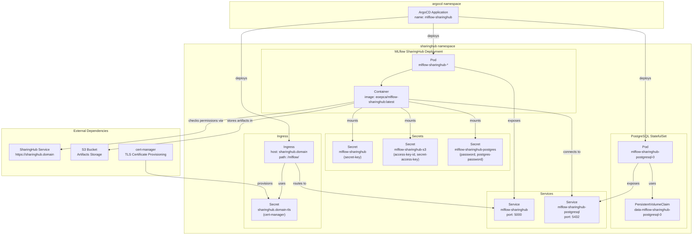
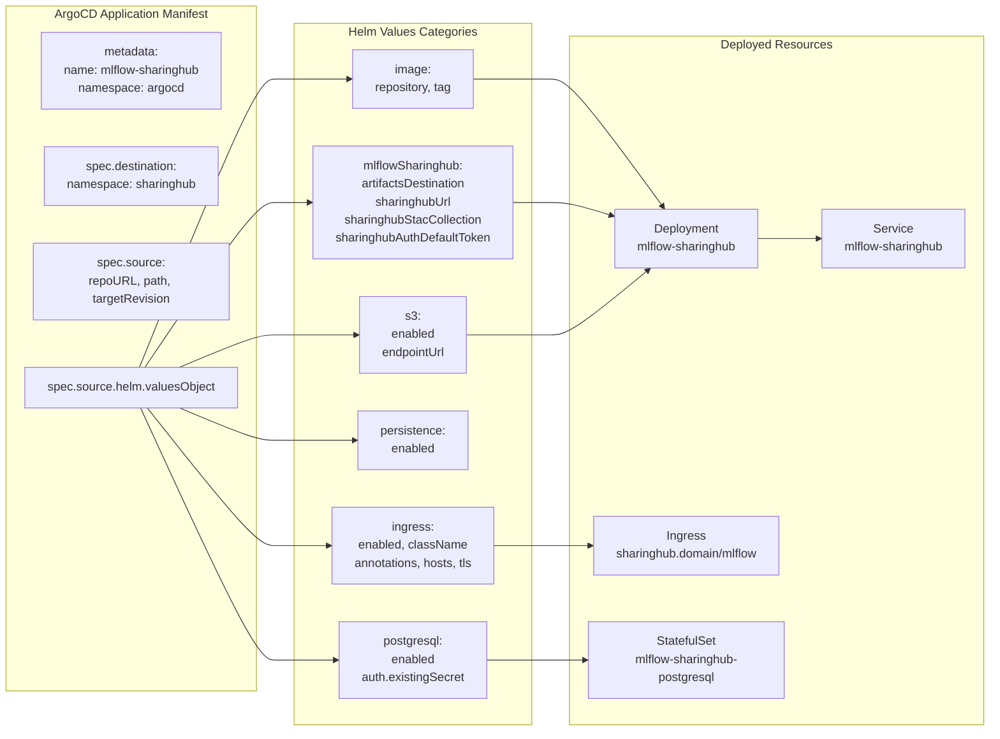
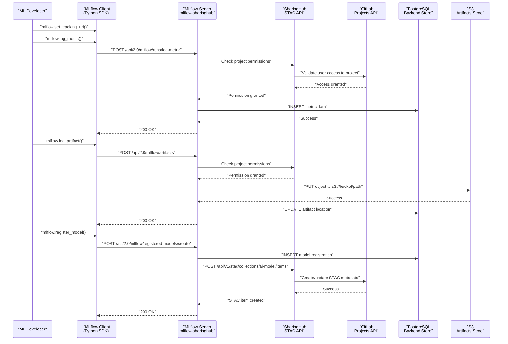

# MLflow SharingHub Deployment

<details>
<summary>Relevant source files</summary>

The following files were used as context for generating this wiki page:

- [docs/admin/deployment-guide/components/mlflow-sharinghub.md](docs/admin/deployment-guide/components/mlflow-sharinghub.md)

</details>


This document provides step-by-step instructions for deploying MLflow SharingHub on a Kubernetes cluster using ArgoCD and Helm. MLflow SharingHub extends MLflow with SharingHub integration for permission management and automatic model publication to the STAC catalog.

**Scope**: This page covers the deployment process for MLflow SharingHub, including preparation steps, secret creation, ArgoCD Application manifest configuration, and verification. For detailed configuration options, see [MLflow SharingHub Configuration](#6.2). For prerequisites and overall deployment architecture, see [Prerequisites and Architecture](#5.1). This deployment assumes that GitLab ([GitLab Deployment](#5.2)) and SharingHub ([SharingHub Deployment](#5.3)) are already deployed and operational.

## Overview

MLflow SharingHub is a custom MLflow deployment that integrates with SharingHub for:

- **Permission Management**: Delegates project access control to SharingHub/GitLab
- **Automatic Model Publication**: Registered models are automatically published as STAC items
- **Experiment Tracking**: Provides the MLflow Tracking API for logging metrics, parameters, and artifacts
- **Model Registry**: Manages model versions and lifecycle stages

The deployment uses the Helm chart from the [csgroup-oss/mlflow-sharinghub](https://github.com/csgroup-oss/mlflow-sharinghub) repository and is managed via ArgoCD for GitOps-style deployment.

**Sources**: [docs/admin/deployment-guide/components/mlflow-sharinghub.md:1-8]()

## Deployment Architecture

The following diagram shows the Kubernetes resources created during MLflow SharingHub deployment and their relationships:



**Sources**: [docs/admin/deployment-guide/components/mlflow-sharinghub.md:29-96]()

## Prerequisites

Before deploying MLflow SharingHub, ensure the following are in place:

| Prerequisite | Description | Reference |
|-------------|-------------|-----------|
| Kubernetes Cluster | Running cluster with ArgoCD installed | [Prerequisites and Architecture](#5.1) |
| SharingHub | Deployed and accessible | [SharingHub Deployment](#5.3) |
| GitLab | Deployed and accessible | [GitLab Deployment](#5.2) |
| S3 Storage | S3 bucket for artifacts storage | [Prerequisites and Architecture](#5.1) |
| kubectl | Command-line access to cluster | [Prerequisites and Architecture](#5.1) |
| cert-manager | For TLS certificate automation | [Prerequisites and Architecture](#5.1) |

**Sources**: [docs/admin/deployment-guide/components/mlflow-sharinghub.md:3-4]()

## Preparation Steps

### Create Secret Key

MLflow SharingHub requires a secret key for Flask session security. Generate and create the secret:

```bash
kubectl create secret generic mlflow-sharinghub \
  --from-literal secret-key="<random-secret-key>" \
  --namespace sharinghub
```

**Secret Structure**: The `mlflow-sharinghub` secret must contain:
- `secret-key`: A randomly generated string (recommended: 32+ characters)

This secret is mounted by the MLflow SharingHub pod and used for cryptographic operations.

**Sources**: [docs/admin/deployment-guide/components/mlflow-sharinghub.md:11-17]()

### Create S3 Secrets

MLflow stores model artifacts in S3 object storage. Create the S3 credentials secret:

```bash
kubectl create secret generic mlflow-sharinghub-s3 \
  --from-literal access-key-id="<access-key>" \
  --from-literal secret-access-key="<secret-key>" \
  --namespace sharinghub
```

**Secret Structure**: The `mlflow-sharinghub-s3` secret must contain:
- `access-key-id`: S3 access key
- `secret-access-key`: S3 secret access key

These credentials must have read/write permissions to the S3 bucket specified in the configuration.

**Sources**: [docs/admin/deployment-guide/components/mlflow-sharinghub.md:19-25]()

### PostgreSQL Secret (Optional)

The Helm chart automatically creates a PostgreSQL secret (`mlflow-sharinghub-postgres`) for the database password. If you need to use a pre-existing PostgreSQL instance or want to specify the password manually, create the secret before deployment:

```bash
kubectl create secret generic mlflow-sharinghub-postgres \
  --from-literal password="<postgres-password>" \
  --from-literal postgres-password="<postgres-password>" \
  --namespace sharinghub
```

**Sources**: [docs/admin/deployment-guide/components/mlflow-sharinghub.md:87-90]()

## Configuration Structure

The following diagram maps the ArgoCD Application manifest structure to the actual Helm chart values:



**Sources**: [docs/admin/deployment-guide/components/mlflow-sharinghub.md:46-90]()

## ArgoCD Application Manifest

Create the ArgoCD Application manifest file `mlflow-sharinghub.yaml`:

```yaml
apiVersion: argoproj.io/v1alpha1
kind: Application
metadata:
  name: mlflow-sharinghub
  namespace: argocd
spec:
  destination:
    namespace: sharinghub
    server: https://kubernetes.default.svc
  project: default
  source:
    repoURL: https://github.com/csgroup-oss/mlflow-sharinghub.git
    path: deploy/helm/mlflow-sharinghub
    targetRevision: "0.2.0"
    helm:
      valuesObject:
        image:
          repository: eoepca/mlflow-sharinghub
          tag: latest

        mlflowSharinghub:
          artifactsDestination: s3://<bucket>
          sharinghubUrl: https://sharinghub.<domain_name>
          sharinghubStacCollection: ai-model
          sharinghubAuthDefaultToken: false

        s3:
          enabled: true
          endpointUrl: https://<s3_endpoint>

        persistence:
          enabled: false

        podSecurityContext:
          fsGroup: 999

        ingress:
          enabled: true
          className: nginx
          annotations:
            cert-manager.io/cluster-issuer: letsencrypt-prod
            nginx.ingress.kubernetes.io/ssl-redirect: "true"
            nginx.ingress.kubernetes.io/proxy-body-size: 10g
            nginx.ingress.kubernetes.io/configuration-snippet: |
              proxy_set_header X-Script-Name /mlflow;
              rewrite ^/mlflow/(.*)$ /$1 break;
          hosts:
            - host: sharinghub.<domain_name>
              paths:
                - path: /mlflow/
                  pathType: ImplementationSpecific
          tls:
            - secretName: sharinghub.<domain_name>-tls
              hosts:
                - sharinghub.<domain_name>
        postgresql:
          enabled: true
          auth:
            existingSecret: mlflow-sharinghub-postgres

  syncPolicy:
    syncOptions:
      - FailOnSharedResource=true
      - CreateNamespace=true
```

### Configuration Parameters

Replace the following placeholders in the manifest:

| Parameter | Description | Example |
|-----------|-------------|---------|
| `<domain_name>` | Your platform's domain name | `example.com` |
| `<bucket>` | S3 bucket name for artifacts | `mlflow-artifacts` |
| `<s3_endpoint>` | S3 provider endpoint URL | `https://s3.amazonaws.com` |

**Sources**: [docs/admin/deployment-guide/components/mlflow-sharinghub.md:29-103]()

## Key Configuration Sections

### Image Configuration

```yaml
image:
  repository: eoepca/mlflow-sharinghub
  tag: latest
```

Specifies the Docker image for MLflow SharingHub. The `eoepca/mlflow-sharinghub` image extends the official MLflow image with SharingHub integration.

### MLflow SharingHub Settings

```yaml
mlflowSharinghub:
  artifactsDestination: s3://<bucket>
  sharinghubUrl: https://sharinghub.<domain_name>
  sharinghubStacCollection: ai-model
  sharinghubAuthDefaultToken: false
```

| Parameter | Description |
|-----------|-------------|
| `artifactsDestination` | S3 bucket URI where model artifacts are stored |
| `sharinghubUrl` | URL of the SharingHub instance for permission checks |
| `sharinghubStacCollection` | STAC collection where models are published (typically `ai-model`) |
| `sharinghubAuthDefaultToken` | Whether to allow unauthenticated access with a default token (set to `false` for production) |

### S3 Configuration

```yaml
s3:
  enabled: true
  endpointUrl: https://<s3_endpoint>
```

Enables S3 artifacts storage. The `mlflow-sharinghub-s3` secret provides the credentials. Set `endpointUrl` to your S3 provider's endpoint (AWS, MinIO, etc.).

### Ingress Configuration

```yaml
ingress:
  enabled: true
  className: nginx
  annotations:
    cert-manager.io/cluster-issuer: letsencrypt-prod
    nginx.ingress.kubernetes.io/ssl-redirect: "true"
    nginx.ingress.kubernetes.io/proxy-body-size: 10g
    nginx.ingress.kubernetes.io/configuration-snippet: |
      proxy_set_header X-Script-Name /mlflow;
      rewrite ^/mlflow/(.*)$ /$1 break;
  hosts:
    - host: sharinghub.<domain_name>
      paths:
        - path: /mlflow/
          pathType: ImplementationSpecific
  tls:
    - secretName: sharinghub.<domain_name>-tls
      hosts:
        - sharinghub.<domain_name>
```

**Key Annotations**:
- `cert-manager.io/cluster-issuer`: Automatic TLS certificate provisioning via cert-manager
- `nginx.ingress.kubernetes.io/proxy-body-size: 10g`: Allows large artifact uploads (adjust as needed)
- `configuration-snippet`: Configures MLflow to run under the `/mlflow/` path by setting `X-Script-Name` and rewriting URLs

**Path Configuration**: MLflow is exposed at `https://sharinghub.<domain_name>/mlflow/`, sharing the same domain as SharingHub but under a different path.

### PostgreSQL Configuration

```yaml
postgresql:
  enabled: true
  auth:
    existingSecret: mlflow-sharinghub-postgres
```

Deploys a PostgreSQL StatefulSet for MLflow's backend store (experiments, runs, metrics). The `mlflow-sharinghub-postgres` secret provides the database password.

**Sources**: [docs/admin/deployment-guide/components/mlflow-sharinghub.md:46-90]()

## Deployment Execution

Apply the ArgoCD Application manifest to deploy MLflow SharingHub:

```bash
kubectl apply -f mlflow-sharinghub.yaml
```

ArgoCD will:
1. Clone the Helm chart from `https://github.com/csgroup-oss/mlflow-sharinghub.git`
2. Render the chart using the provided `valuesObject`
3. Create the `sharinghub` namespace if it doesn't exist
4. Deploy the MLflow SharingHub Deployment, Service, and Ingress
5. Deploy the PostgreSQL StatefulSet and Service
6. Configure cert-manager to provision the TLS certificate

**Sources**: [docs/admin/deployment-guide/components/mlflow-sharinghub.md:106-110]()

## Integration Flow

The following diagram shows how MLflow SharingHub integrates with SharingHub and other components during typical operations:



**Key Integration Points**:

1. **Permission Check**: Every MLflow API request triggers a permission check with SharingHub, which validates against GitLab project access
2. **Metadata Storage**: MLflow metadata (experiments, runs, metrics, parameters) is stored in PostgreSQL
3. **Artifact Storage**: Model artifacts, plots, and files are stored in S3
4. **Model Publication**: When a model is registered, MLflow automatically creates/updates a STAC item in SharingHub's catalog

**Sources**: [docs/admin/deployment-guide/components/mlflow-sharinghub.md:52-56]()

## Verification

After deployment, verify that MLflow SharingHub is running correctly:

### Check Pod Status

```bash
kubectl get pods -n sharinghub -l app.kubernetes.io/name=mlflow-sharinghub
```

Expected output:
```
NAME                                  READY   STATUS    RESTARTS   AGE
mlflow-sharinghub-xxxxxxxxxx-xxxxx    1/1     Running   0          5m
```

### Check Service

```bash
kubectl get svc -n sharinghub mlflow-sharinghub
```

Expected output:
```
NAME                TYPE        CLUSTER-IP      EXTERNAL-IP   PORT(S)    AGE
mlflow-sharinghub   ClusterIP   10.x.x.x        <none>        5000/TCP   5m
```

### Check Ingress

```bash
kubectl get ingress -n sharinghub -l app.kubernetes.io/name=mlflow-sharinghub
```

Verify that the ingress has been assigned an address and the TLS secret is present.

### Access the UI

Navigate to `https://sharinghub.<domain_name>/mlflow/` in your browser. You should see the MLflow UI.

### Check PostgreSQL

```bash
kubectl get pods -n sharinghub -l app.kubernetes.io/name=postgresql
```

Expected output:
```
NAME                                    READY   STATUS    RESTARTS   AGE
mlflow-sharinghub-postgresql-0          1/1     Running   0          5m
```

### Check Logs

View the MLflow SharingHub logs:

```bash
kubectl logs -n sharinghub -l app.kubernetes.io/name=mlflow-sharinghub -f
```

Look for successful startup messages and no error messages related to SharingHub connectivity, PostgreSQL, or S3.

**Sources**: [docs/admin/deployment-guide/components/mlflow-sharinghub.md:29-110]()

## Secret Management Summary

The following table summarizes all secrets used by MLflow SharingHub:

| Secret Name | Namespace | Keys | Purpose | Created By |
|-------------|-----------|------|---------|------------|
| `mlflow-sharinghub` | `sharinghub` | `secret-key` | Flask session security | Manual (kubectl) |
| `mlflow-sharinghub-s3` | `sharinghub` | `access-key-id`, `secret-access-key` | S3 artifacts access | Manual (kubectl) |
| `mlflow-sharinghub-postgres` | `sharinghub` | `password`, `postgres-password` | PostgreSQL database access | Helm chart (automatic) or Manual |
| `sharinghub.<domain>-tls` | `sharinghub` | `tls.crt`, `tls.key` | HTTPS/TLS certificate | cert-manager (automatic) |

**Sources**: [docs/admin/deployment-guide/components/mlflow-sharinghub.md:11-25](), [docs/admin/deployment-guide/components/mlflow-sharinghub.md:87-90]()

## Resource Requirements

The MLflow SharingHub deployment creates the following Kubernetes resources:

| Resource Type | Name | Purpose |
|---------------|------|---------|
| Deployment | `mlflow-sharinghub` | Runs the MLflow server application |
| Service | `mlflow-sharinghub` | Exposes MLflow server on port 5000 |
| StatefulSet | `mlflow-sharinghub-postgresql` | Runs PostgreSQL database |
| Service | `mlflow-sharinghub-postgresql` | Exposes PostgreSQL on port 5432 |
| PersistentVolumeClaim | `data-mlflow-sharinghub-postgresql-0` | PostgreSQL data storage |
| Ingress | `mlflow-sharinghub` | Routes external traffic to MLflow server |
| Secret | `mlflow-sharinghub-postgres` | PostgreSQL credentials (if not pre-created) |

**Sources**: [docs/admin/deployment-guide/components/mlflow-sharinghub.md:87-90]()

## Next Steps

After successfully deploying MLflow SharingHub:

1. **Configure MLflow Clients**: Set the tracking URI in your ML development environment:
   ```python
   import mlflow
   mlflow.set_tracking_uri("https://sharinghub.<domain_name>/mlflow")
   ```

2. **Create Experiments**: Create experiments in the MLflow UI or via the API

3. **Link to GitLab Projects**: Ensure your MLflow experiments are associated with GitLab projects for proper permission management

4. **Test Model Registration**: Register a test model and verify it appears in the SharingHub STAC catalog

5. **Review Configuration**: For detailed configuration options and tuning, see [MLflow SharingHub Configuration](#6.2)

6. **Review Workflows**: For practical examples of using MLflow SharingHub in model training workflows, see [Model Training Workflow](#4.1) and [Flood Detection Example](#4.3)

**Sources**: [docs/admin/deployment-guide/components/mlflow-sharinghub.md:104]()

## Troubleshooting

Common issues and solutions:

| Issue | Possible Cause | Solution |
|-------|---------------|----------|
| Pod fails to start | Missing secrets | Verify `mlflow-sharinghub` and `mlflow-sharinghub-s3` secrets exist |
| Cannot connect to SharingHub | Wrong `sharinghubUrl` | Check that SharingHub is deployed and URL is correct |
| Artifact upload fails | S3 credentials invalid | Verify `mlflow-sharinghub-s3` secret has correct credentials |
| Database connection error | PostgreSQL not ready | Check PostgreSQL pod status and logs |
| TLS certificate not provisioned | cert-manager issue | Check cert-manager logs and ingress annotations |
| Permission denied errors | SharingHub integration issue | Verify SharingHub can communicate with GitLab |

For more troubleshooting guidance, see [Operations and Maintenance](#8).

**Sources**: [docs/admin/deployment-guide/components/mlflow-sharinghub.md:1-110]()