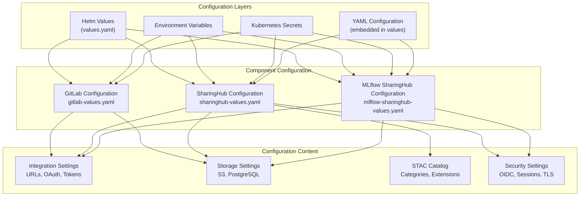
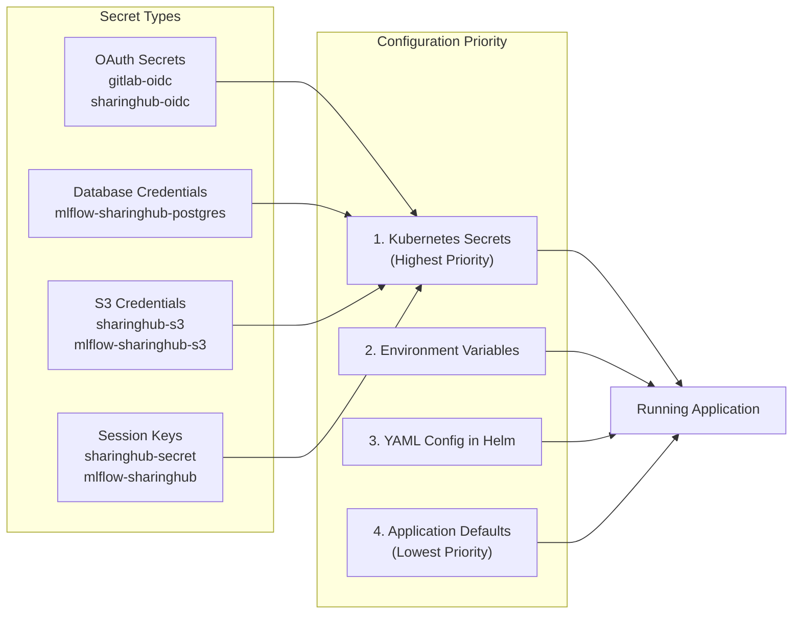
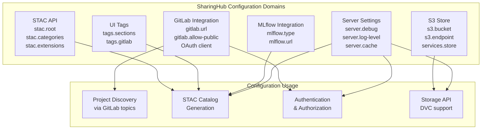
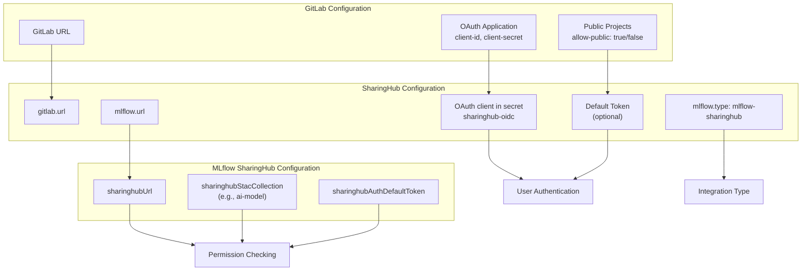
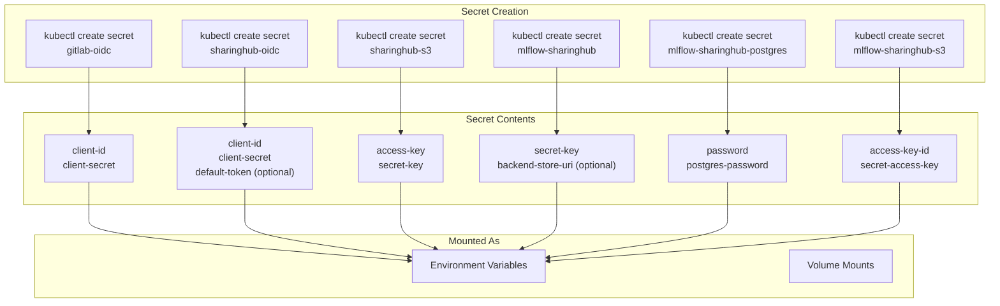
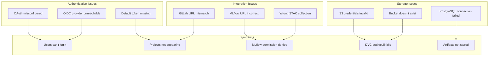

# Configuration Reference

<details>
<summary>Relevant source files</summary>

The following files were used as context for generating this wiki page:

- [docs/admin/configuration.md](docs/admin/configuration.md)

</details>


This page provides a comprehensive overview of configuration for the EOEPCA MLOps Building Block components. It explains the configuration architecture, sources, and integration points between GitLab, SharingHub, and MLflow SharingHub.

For detailed configuration options for specific components, see:
- [SharingHub Configuration](#6.1) - Complete reference for SharingHub server settings, STAC API, categories, and integrations
- [MLflow SharingHub Configuration](#6.2) - Configuration options for experiment tracking and model registry

For deployment procedures that use these configurations, see [Deployment Guide](#5).

## Configuration Architecture

The MLOps Building Block uses a multi-layered configuration approach where each component has distinct configuration concerns, but they must be properly integrated to work together as a unified system.



**Configuration Hierarchy and Sources**

Sources: [docs/admin/configuration.md:1-281]()

### Configuration Sources

The MLOps Building Block uses three primary configuration sources, each serving different purposes:

| Source | Purpose | Usage | Security Level |
|--------|---------|-------|----------------|
| **Helm Values** | Deployment-time configuration | Define component behavior, resource limits, ingress rules | Public |
| **YAML Config** | Application-level settings | Embedded in Helm values under `config` field | Public/Semi-sensitive |
| **Environment Variables** | Runtime overrides | Override specific settings like `DEBUG`, `LOG_LEVEL` | Public |
| **Kubernetes Secrets** | Sensitive credentials | OAuth secrets, database passwords, API tokens | Sensitive |



**Configuration Source Priority and Secret Management**

Sources: [docs/admin/configuration.md:52-232]()

## Component Configuration Overview

Each component in the MLOps Building Block has distinct configuration requirements:

| Component | Configuration Scope | Key Areas | Primary Method |
|-----------|-------------------|-----------|----------------|
| **GitLab** | Comprehensive | S3 storage, OIDC, LFS, backups, ingress | Helm values |
| **SharingHub** | Extensive | Server settings, GitLab integration, STAC catalog, categories, tags, S3 store | YAML config in Helm values |
| **MLflow SharingHub** | Lightweight | SharingHub URL, backend store, artifacts store | Helm values + secrets |

### SharingHub as Central Configuration Hub

SharingHub is the most heavily configured component because it acts as the integration layer between GitLab and MLflow SharingHub:



**SharingHub Configuration Domains and Usage**

Sources: [docs/admin/configuration.md:7-280]()

### Configuration File Structure

The SharingHub configuration is embedded in the Helm values as a YAML string under the `config` field:

```yaml
# In sharinghub-values.yaml
config: |
  server:
    debug: false
    log-level: INFO
  gitlab:
    url: https://gitlab.example.com
    allow-public: true
  stac:
    root:
      id: gitlab-cs
      title: SharingHub STAC Catalog
    categories:
      - ai-model:
          gitlab_topic: sharinghub:aimodel
```

This structure allows the entire application configuration to be version-controlled and deployed atomically.

Sources: [docs/admin/configuration.md:9-15]()

## Integration Configuration

The key to a functioning MLOps Building Block is proper configuration of integration points between components:



**Integration Configuration Dependencies**

Sources: [docs/admin/configuration.md:88-117](), [docs/admin/configuration.md:283-298]()

### Critical Integration Points

| Integration | Configuration Location | Purpose | Required Settings |
|-------------|----------------------|---------|-------------------|
| **GitLab → SharingHub** | SharingHub `gitlab` section | Project discovery, authentication | `gitlab.url`, OAuth client secret |
| **SharingHub → MLflow** | SharingHub `mlflow` section | Model tracking integration | `mlflow.type`, `mlflow.url` |
| **MLflow → SharingHub** | MLflow `sharinghubUrl` | Permission validation | `sharinghubUrl`, `sharinghubStacCollection` |
| **User → GitLab** | GitLab OIDC provider | OIDC authentication | Keycloak client credentials |

## Security and Secrets Management

Sensitive configuration values must be stored in Kubernetes secrets and mounted into the application containers:



**Secret Management Flow**

Sources: [docs/admin/configuration.md:109-117](), [docs/admin/configuration.md:229-232](), [docs/admin/configuration.md:310-347]()

### Secret Types and Usage

| Secret Name | Namespace | Contents | Used By | Purpose |
|-------------|-----------|----------|---------|---------|
| `gitlab-oidc` | `gitlab` | `client-id`, `client-secret` | GitLab | OIDC authentication with Keycloak |
| `sharinghub-oidc` | `sharinghub` | `client-id`, `client-secret`, `default-token` | SharingHub | OAuth authentication with GitLab |
| `sharinghub-secret` | `sharinghub` | `secret-key` | SharingHub | Session cookie signing |
| `sharinghub-s3` | `sharinghub` | `access-key`, `secret-key` | SharingHub | S3 store API (DVC) |
| `mlflow-sharinghub` | `sharinghub` | `secret-key`, `backend-store-uri` | MLflow SharingHub | Flask secret, database URI |
| `mlflow-sharinghub-postgres` | `sharinghub` | `password`, `postgres-password` | PostgreSQL, MLflow | Database authentication |
| `mlflow-sharinghub-s3` | `sharinghub` | `access-key-id`, `secret-access-key` | MLflow SharingHub | Artifact storage |

## Configuration Validation and Troubleshooting

### Common Configuration Issues



**Common Configuration Issues and Symptoms**

Sources: [docs/admin/configuration.md:88-232]()

### Configuration Verification Checklist

| Check | Component | Verification Method | Expected Result |
|-------|-----------|---------------------|-----------------|
| **GitLab OAuth** | SharingHub | Access `/auth/gitlab` | Redirects to GitLab login |
| **Default Token** | SharingHub | Access `/api/stac` unauthenticated | Returns public projects |
| **STAC Catalog** | SharingHub | GET `/api/stac` | Returns root catalog with collections |
| **MLflow Permission** | MLflow SharingHub | Create experiment in project | Success if user has access |
| **S3 Store** | SharingHub | DVC push to project | Uploads to S3 bucket |
| **PostgreSQL** | MLflow SharingHub | Check pod logs | No connection errors |

## Configuration Updates and Changes

When updating configuration, different methods require different procedures:

| Configuration Type | Update Method | Restart Required | Downtime |
|-------------------|---------------|------------------|----------|
| **Helm Values** | Update ArgoCD Application | Yes | Brief |
| **YAML Config** | Update ArgoCD Application | Yes | Brief |
| **Secrets** | Update secret, restart pods | Yes | Brief |
| **Environment Variables** | Update deployment, restart | Yes | Brief |
| **Dynamic Settings** | API calls (if supported) | No | None |

The SharingHub server includes a caching system that improves performance but may delay configuration changes. Cache timeouts are configurable:

- `checker.cache-timeout`: Cache for API checks (default: 30.0 seconds)
- `s3.check-access.cache-timeout`: Cache for S3 permission checks (default: 30.0 seconds)
- `stac.projects.cache-timeout`: Cache for STAC item generation (default: 30.0 seconds)

For immediate effect after configuration changes, either wait for cache expiration or restart the affected pods.

Sources: [docs/admin/configuration.md:64-86]()

## Next Steps

For detailed configuration options and examples:

- **[SharingHub Configuration](#6.1)** - Complete reference including server settings, GitLab integration, STAC catalog structure, categories, tags, S3 store, and alert messages
- **[MLflow SharingHub Configuration](#6.2)** - Backend store options (SQLite, PostgreSQL), artifacts storage (local, S3), and SharingHub integration settings

For applying these configurations during deployment, see:

- **[Deployment Guide](#5)** - Complete deployment procedures
- **[SharingHub Deployment](#5.3)** - Specific deployment steps for SharingHub
- **[MLflow SharingHub Deployment](#5.4)** - Specific deployment steps for MLflow SharingHub

Sources: [docs/admin/configuration.md:1-359]()