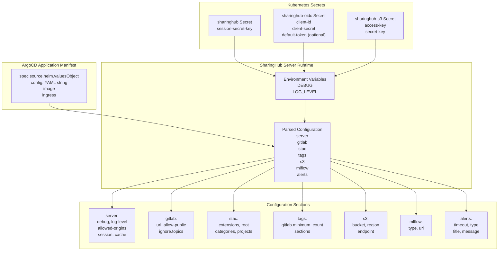
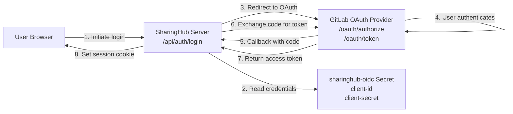
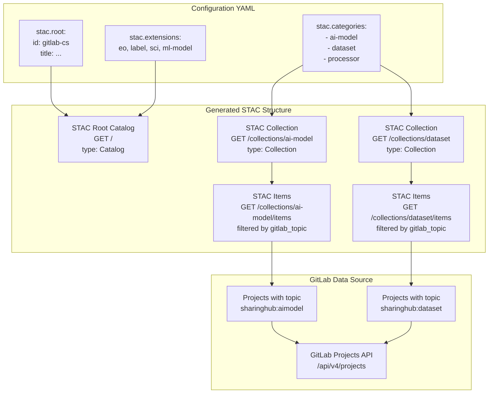
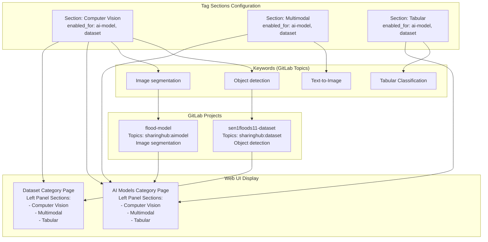

# SharingHub Configuration

<details>
<summary>Relevant source files</summary>

The following files were used as context for generating this wiki page:

- [docs/admin/configuration.md](docs/admin/configuration.md)
- [docs/admin/deployment-guide/components/sharinghub.md](docs/admin/deployment-guide/components/sharinghub.md)

</details>


This page provides a comprehensive reference for configuring SharingHub, the discovery and collaboration platform that serves as the central hub of the MLOps Building Block. Configuration covers server settings, GitLab integration, STAC API structure, category definitions, tags, and optional services like S3 storage.

For deployment instructions including how to apply these configurations, see [SharingHub Deployment](#5.3). For MLflow SharingHub configuration, see [MLflow SharingHub Configuration](#6.2).

## Configuration Overview

SharingHub is configured through a combination of Kubernetes secrets and YAML configuration embedded in Helm chart values. The configuration is structured into logical sections that control different aspects of the system.

### Configuration Sources and Flow



**Sources:** [docs/admin/deployment-guide/components/sharinghub.md:51-214](), [docs/admin/configuration.md:1-279]()

### Configuration Structure

The primary configuration is defined as a YAML string in the Helm chart's `config` field. This YAML structure contains all server settings, GitLab integration, STAC catalog definition, and optional service configurations.

| Configuration Method | Purpose | Example |
|---------------------|---------|---------|
| Kubernetes Secrets | Sensitive data (keys, tokens, passwords) | `sharinghub`, `sharinghub-oidc`, `sharinghub-s3` |
| Environment Variables | Runtime behavior flags | `DEBUG`, `LOG_LEVEL` |
| Helm Values `config` | Main YAML configuration | Server, GitLab, STAC, tags settings |
| Helm Values (direct) | Kubernetes resource configuration | `image`, `ingress`, `resources` |

**Sources:** [docs/admin/configuration.md:8-14](), [docs/admin/deployment-guide/components/sharinghub.md:68-207]()

## Server Global Settings

### Debug and Log Level

Control server verbosity and logging behavior through the `server.debug` and `server.log-level` configuration keys, or via environment variables.

```yaml
server:
  debug: true
  log-level: DEBUG
```

**Configuration Options:**
- `server.debug`: Boolean, enables debug mode (default: `false`)
- `server.log-level`: String, one of `CRITICAL`, `WARNING`, `INFO`, `DEBUG`
- Environment variable `DEBUG`: Overrides `server.debug`
- Environment variable `LOG_LEVEL`: Overrides `server.log-level`

When `debug` is `true`, log level defaults to `DEBUG`, otherwise `INFO`.

**Sources:** [docs/admin/configuration.md:20-37]()

### Security and CORS

Configure Cross-Origin Resource Sharing (CORS) to allow requests from external origins.

```yaml
server:
  allowed-origins:
    - https://eoepca.readthedocs.io
```

**Configuration Options:**
- `server.allowed-origins`: List of URLs allowed to make cross-origin requests

**Sources:** [docs/admin/configuration.md:39-47]()

### Session Management

Session configuration controls user authentication session behavior through cookies.

```yaml
server:
  session:
    cookie: sharinghub-session
    domain: develop.eoepca.org
    max-age: 14400.0
```

**Configuration Options:**
- `server.session.cookie`: Session cookie name (default: `sharinghub-session`)
- `server.session.domain`: Cookie domain scope
- `server.session.max-age`: Session duration in seconds (default: `14400.0` = 4 hours)

**Required Secret:**
A session secret key must be created before deployment:
```bash
kubectl create secret generic sharinghub \
  --from-literal session-secret-key="<uuid>" \
  --namespace sharinghub
```

**Sources:** [docs/admin/configuration.md:49-61](), [docs/admin/deployment-guide/components/sharinghub.md:8-14]()

### Cache System

The cache system improves performance by storing frequently accessed data temporarily.

```yaml
server:
  cache: true

checker:
  cache-timeout: 30.0

s3:
  check-access:
    cache-timeout: 30.0

stac:
  projects:
    cache-timeout: 30.0
```

**Configuration Options:**
- `server.cache`: Boolean, enables/disables caching globally (default: `true`)
- `checker.cache-timeout`: Cache duration for Check API responses (seconds)
- `s3.check-access.cache-timeout`: Cache duration for S3 permission checks (seconds)
- `stac.projects.cache-timeout`: Cache duration for STAC item generation from projects (seconds)

It is recommended to keep caching enabled (`true`) for production deployments. Disable only for debugging purposes.

**Sources:** [docs/admin/configuration.md:63-85]()

## GitLab Integration

GitLab is the foundation of SharingHub, providing project management, authentication, and data source for the STAC catalog.

### Basic GitLab Configuration

```yaml
gitlab:
  url: https://gitlab.example.com
  allow-public: true
  ignore:
    topics:
      - "gitlab-ci"
```

**Configuration Options:**
- `gitlab.url`: Base URL of the GitLab instance
- `gitlab.allow-public`: Boolean, whether GitLab allows public project visibility (default: `true`)
- `gitlab.ignore.topics`: List of GitLab topics to exclude from tag listings

**Sources:** [docs/admin/configuration.md:87-105]()

### OAuth Client Configuration

SharingHub authenticates users via GitLab's OAuth2/OpenID Connect. A GitLab application must be configured first.



**GitLab Application Setup:**

1. Navigate to your GitLab instance and create an application with these callback URLs:
   - `https://sharinghub.<domain-name>/api/auth/login/callback`
   - `http://localhost:8000/api/auth/login/callback` (development only)

2. Note the Application ID and Secret provided by GitLab.

3. Create the Kubernetes secret:
```bash
kubectl create secret generic sharinghub-oidc \
  --from-literal client-id="<application-id>" \
  --from-literal client-secret="<application-secret>" \
  --namespace sharinghub
```

**Sources:** [docs/admin/deployment-guide/components/sharinghub.md:16-37](), [docs/admin/configuration.md:107-109]()

### Default Token

The default token mechanism enables unauthenticated users to browse public projects. When configured, the server uses this token for requests from non-authenticated users.

**Token Types:**
- **Personal Access Token**: Requires `api` scope
- **Group Access Token**: Requires `Reporter` role minimum, with `read_api` and `read_repository` scopes

```bash
kubectl create secret generic sharinghub-oidc \
  --from-literal default-token="<default-token>" \
  --from-literal client-id="<client-id>" \
  --from-literal client-secret="<client-secret>" \
  --namespace sharinghub
```

**Sources:** [docs/admin/deployment-guide/components/sharinghub.md:39-45](), [docs/admin/configuration.md:111-116]()

## STAC API Configuration

The STAC API is the primary interface for discovering models and datasets. It is dynamically generated from GitLab projects based on configuration.

### STAC Catalog Structure from Configuration



**Sources:** [docs/admin/configuration.md:118-178]()

### Extensions Configuration

STAC extensions declare additional metadata schemas available in the catalog.

```yaml
stac:
  extensions:
    eo: https://stac-extensions.github.io/eo/v1.1.0/schema.json
    label: https://stac-extensions.github.io/label/v1.0.1/schema.json
    sci: https://stac-extensions.github.io/scientific/v1.0.0/schema.json
    ml-model: https://stac-extensions.github.io/ml-model/v1.0.0/schema.json
```

**Configuration Options:**
- `stac.extensions`: Dictionary mapping extension names to their JSON schema URLs

These extensions are included in the root catalog's `stac_extensions` array, allowing clients to discover and use them.

**Sources:** [docs/admin/deployment-guide/components/sharinghub.md:79-83](), [docs/admin/configuration.md:129-133]()

### Root Catalog Configuration

The root catalog defines top-level metadata for the entire STAC catalog.

```yaml
stac:
  root:
    id: gitlab-cs
    title: SharingHub brings your data and models closer.
    description: Your platform for collaborating on ML and NLP projects store in [GitLab](https://gitlab.com) instance STAC catalog.
    locales:
      fr:
        title: SharingHub rapproche vos données et vos modèles.
        description: Votre plateforme de collaboration sur les projets ML et NLP stockés dans le catalogue STAC de l'instance [GitLab](https://gitlab.com).
```

**Configuration Options:**
- `stac.root.id`: Unique identifier for the root catalog
- `stac.root.title`: Human-readable title
- `stac.root.description`: Markdown-formatted description
- `stac.root.locales`: Dictionary of locale codes to translated title/description

**Sources:** [docs/admin/deployment-guide/components/sharinghub.md:84-91](), [docs/admin/configuration.md:134-141]()

### Categories Configuration

Categories map to STAC collections and define how GitLab projects are organized and discovered.

```yaml
stac:
  categories:
    - ai-model:
        title: "AI Models"
        description: "AI models are the core of our platform, go and browse them to discover our models."
        gitlab_topic: sharinghub:aimodel
        logo: https://data.web.<domain_name>/sharinghub/ai-model.jpg
        icon: https://img.icons8.com/material/24/artificial-intelligence.png
        locales:
          fr:
            title: "Modèles IA"
            description: "Les modèles d'IA sont au cœur de notre plateforme, allez les parcourir pour découvrir nos modèles."
        features:
          map-viewer: enable
          store-s3: enable
          mlflow: enable
    - dataset:
        title: "Datasets"
        description: "Datasets are very important in the process of training an AI, discover those that we put at your disposal."
        gitlab_topic: sharinghub:dataset
        logo: https://data.web.<domain_name>/sharinghub/datasets.jpg
        icon: https://img.icons8.com/ios/50/data-backup.png
        locales:
          fr:
            title: "Jeux de données"
            description: "Les jeux de données sont très importants dans le processus de formation d'une IA, découvrez ceux que nous mettons à votre disposition."
        features:
          map-viewer: enable
          store-s3: enable
          mlflow: disable
```

**Category Structure:**
Each category is defined as a dictionary entry with the category ID as the key.

| Field | Type | Purpose |
|-------|------|---------|
| `title` | String | Display name for the category |
| `description` | String | Human-readable description (Markdown supported) |
| `gitlab_topic` | String | GitLab topic used to filter projects for this category |
| `logo` | URL | Image URL for category logo |
| `icon` | URL | Image URL for category icon |
| `locales` | Dictionary | Translations for `title` and `description` |
| `features` | Dictionary | Feature toggles for this category |

**Features Configuration:**

| Feature | Values | Purpose |
|---------|--------|---------|
| `map-viewer` | `enable`, `disable` | Display geographic map for assets |
| `store-s3` | `enable`, `disable` | Enable S3 store API for DVC support |
| `mlflow` | `enable`, `disable` | Enable MLflow SharingHub integration |

**Sources:** [docs/admin/deployment-guide/components/sharinghub.md:92-170](), [docs/admin/configuration.md:142-184]()

### Project Cache Timeout

Control how long STAC items generated from GitLab projects are cached.

```yaml
stac:
  projects:
    cache-timeout: 30
```

**Configuration Options:**
- `stac.projects.cache-timeout`: Duration in seconds to cache STAC items (default: `30`)

**Sources:** [docs/admin/deployment-guide/components/sharinghub.md:77-78]()

## Tags Configuration

Tags organize projects in the web UI's left-side panel, grouping related keywords into sections.

```yaml
tags:
  gitlab:
    minimum_count: 1
  sections:
    - name: "Computer Vision"
      enabled_for:
        - ai-model
        - dataset
      keywords:
        - "Image qualification"
        - "Object detection"
        - "Image segmentation"
        - "Mask generation"
    - name: "Multimodal"
      keywords:
        - "Feature Extraction"
        - "Text-to-Image"
        - "Image-to-3D"
        - "Text-to-3D"
      enabled_for:
        - ai-model
        - dataset
    - name: "Tabular"
      keywords:
        - "Tabular Classification"
        - "Tabular Regression"
      enabled_for:
        - ai-model
        - dataset
```

### Tags to Categories Mapping



**Configuration Options:**
- `tags.gitlab.minimum_count`: Minimum number of projects required for a GitLab topic to be listed (default: `1`)
- `tags.sections`: List of tag section definitions
  - `name`: Display name for the section
  - `enabled_for`: List of category IDs where this section appears
  - `keywords`: List of GitLab topics (tags) grouped under this section

Tags not listed in any section appear in an "Other" tab. Keywords correspond to GitLab topics assigned to projects.

**Sources:** [docs/admin/deployment-guide/components/sharinghub.md:122-150](), [docs/admin/configuration.md:234-263]()

## MLflow Integration

Configure how SharingHub integrates with MLflow for experiment tracking and model registry.

```yaml
mlflow:
  type: mlflow-sharinghub
  url: https://sharinghub.example.com/mlflow
```

**Configuration Options:**

| Type | Description | Recommendation |
|------|-------------|----------------|
| `mlflow-sharinghub` | Custom MLflow with SharingHub integration, per-project tracking URIs, permission checking | **Strongly Recommended** |
| `mlflow` | Classic MLflow instance, no per-project features, no authentication | Not recommended |
| `gitlab` | GitLab's ML tracking feature, MLflow-compatible | Experimental |

The `mlflow.url` field specifies the MLflow server endpoint. For `mlflow-sharinghub`, this is typically hosted under the SharingHub domain at the `/mlflow` path.

**Sources:** [docs/admin/configuration.md:186-206]()

## S3 Store Configuration

The S3 store is an optional API that enables DVC (Data Version Control) support for managing datasets.

```yaml
services:
  store:
    url: https://sharinghub.example.com/api/store
    mode: http

s3:
  enable: true
  bucket: <bucket>
  region: <bucket-region>
  endpoint: https://<s3-endpoint>
```

**Configuration Options:**
- `services.store.url`: Public URL for the store API
- `services.store.mode`: Protocol mode (typically `http`)
- `s3.enable`: Boolean, enables S3 store functionality
- `s3.bucket`: S3 bucket name
- `s3.region`: S3 bucket region
- `s3.endpoint`: S3 service endpoint URL

**Required Secret:**
S3 credentials must be stored in a Kubernetes secret:
```bash
kubectl create secret generic sharinghub-s3 \
  --from-literal access-key="<access-key>" \
  --from-literal secret-key="<secret-key>" \
  --namespace sharinghub
```

**Cache Configuration:**
```yaml
s3:
  check-access:
    cache-timeout: 30.0
```
- `s3.check-access.cache-timeout`: Cache duration for S3 permission checks in seconds

The S3 store must be explicitly enabled per-category via the `store-s3` feature flag.

**Sources:** [docs/admin/deployment-guide/components/sharinghub.md:197-206](), [docs/admin/configuration.md:208-232]()

## Alert Messages

Configure welcome messages or announcements displayed to users.

```yaml
alerts:
  timeout: 3
  type: info
  title: "Welcome to SharingHub"
  message: "To see all projects and unlock all features, please login..."
  locales:
    fr:
      title: "Bienvenue sur le SharingHub"
      message: "Pour voir tous les projets et débloquer toutes les fonctionnalités, veuillez vous connecter..."
```

**Configuration Options:**
- `alerts.timeout`: Number of days before alert reappears (cookie-based detection)
- `alerts.type`: Alert style, one of `info`, `danger`, `success`, `warning`, `primary`, `dark`, `secondary`
- `alerts.title`: Alert heading text
- `alerts.message`: Alert body text (HTML primitives like `<a>` tags are supported)
- `alerts.locales`: Dictionary of locale codes to translated title/message

**Sources:** [docs/admin/deployment-guide/components/sharinghub.md:152-160](), [docs/admin/configuration.md:265-279]()

## Complete Configuration Example

Below is a complete configuration reference showing all major sections integrated together:

```yaml
# Server Settings
server:
  debug: false
  log-level: INFO
  cache: true
  allowed-origins:
    - https://eoepca.readthedocs.io
  session:
    cookie: sharinghub-session
    domain: example.com
    max-age: 14400.0

# GitLab Integration
gitlab:
  url: https://gitlab.example.com
  allow-public: true
  ignore:
    topics:
      - "gitlab-ci"

# Documentation Link
docs:
  url: https://sharinghub.example.com/docs

# STAC API Configuration
stac:
  projects:
    cache-timeout: 30
  extensions:
    eo: https://stac-extensions.github.io/eo/v1.1.0/schema.json
    label: https://stac-extensions.github.io/label/v1.0.1/schema.json
    sci: https://stac-extensions.github.io/scientific/v1.0.0/schema.json
    ml-model: https://stac-extensions.github.io/ml-model/v1.0.0/schema.json
  root:
    id: gitlab-cs
    title: SharingHub brings your data and models closer.
    description: Your platform for collaborating on ML and NLP projects stored in GitLab instance STAC catalog.
    locales:
      fr:
        title: SharingHub rapproche vos données et vos modèles.
        description: Votre plateforme de collaboration sur les projets ML et NLP stockés dans le catalogue STAC.
  categories:
    - ai-model:
        title: "AI Models"
        description: "AI models are the core of our platform."
        gitlab_topic: sharinghub:aimodel
        logo: https://example.com/images/ai-model.jpg
        icon: https://img.icons8.com/material/24/artificial-intelligence.png
        features:
          map-viewer: enable
          store-s3: enable
          mlflow: enable
    - dataset:
        title: "Datasets"
        description: "Training datasets for AI development."
        gitlab_topic: sharinghub:dataset
        logo: https://example.com/images/datasets.jpg
        icon: https://img.icons8.com/ios/50/data-backup.png
        features:
          map-viewer: enable
          store-s3: enable
          mlflow: disable

# Tags Configuration
tags:
  gitlab:
    minimum_count: 1
  sections:
    - name: "Computer Vision"
      enabled_for:
        - ai-model
        - dataset
      keywords:
        - "Image qualification"
        - "Object detection"
        - "Image segmentation"
    - name: "Tabular"
      keywords:
        - "Tabular Classification"
        - "Tabular Regression"
      enabled_for:
        - ai-model
        - dataset

# MLflow Integration
mlflow:
  type: mlflow-sharinghub
  url: https://sharinghub.example.com/mlflow

# S3 Store (Optional)
services:
  store:
    url: https://sharinghub.example.com/api/store
    mode: http

s3:
  enable: true
  bucket: my-bucket
  region: us-east-1
  endpoint: https://s3.amazonaws.com
  check-access:
    cache-timeout: 30.0

# Alert Messages
alerts:
  timeout: 3
  type: info
  title: "Welcome to SharingHub"
  message: "To see all projects and unlock all features, please login..."
  locales:
    fr:
      title: "Bienvenue sur le SharingHub"
      message: "Pour voir tous les projets, veuillez vous connecter..."

# Cache Settings
checker:
  cache-timeout: 30.0
```

This configuration is embedded in the ArgoCD Application manifest at [docs/admin/deployment-guide/components/sharinghub.md:68-69]() as a YAML string in the `spec.source.helm.valuesObject.config` field.

**Sources:** [docs/admin/deployment-guide/components/sharinghub.md:51-214](), [docs/admin/configuration.md:1-279]()

## Configuration Validation

The complete and up-to-date configuration reference, including all available options and their default values, is maintained in the SharingHub server repository at `CONFIGURATION.md`. Always refer to this authoritative source when configuring advanced options or troubleshooting configuration issues.

**Sources:** [docs/admin/configuration.md:13-14]()