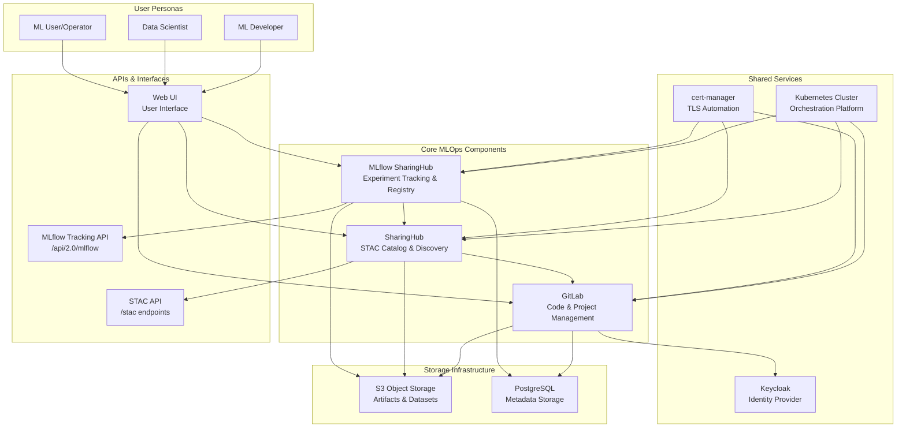
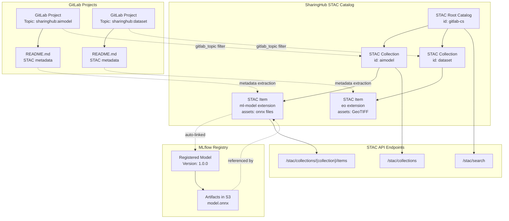
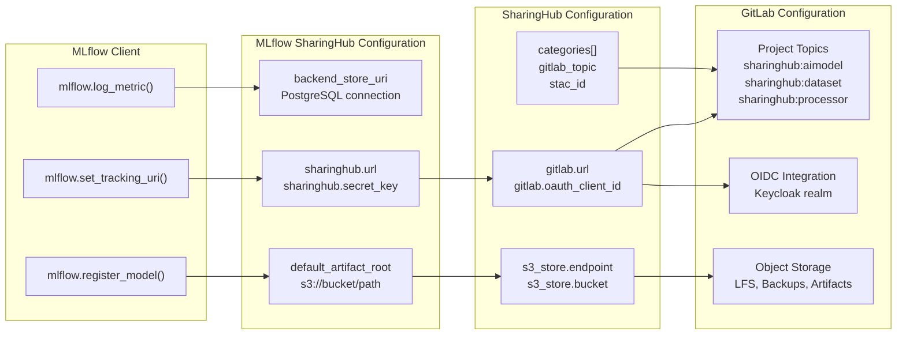

# Overview

Relevant source files

The following files were used as context for generating this wiki page:

- [LICENSE](LICENSE)
- [README.md](README.md)
- [docs/design/scenarios/flood-example.md](docs/design/scenarios/flood-example.md)
- [docs/design/scenarios/model-training.md](docs/design/scenarios/model-training.md)
- [docs/index.md](docs/index.md)
- [mkdocs.yml](mkdocs.yml)

## Purpose and Scope

This document provides an overview of the EOEPCA MLOps Building Block, introducing its purpose, core components, and high-level capabilities. It is intended for technical audiences seeking to understand the system's architecture and functionality before diving into specific implementation details.

For detailed architectural design and component relationships, see [Architecture](#2). For deployment instructions, see [Deployment Guide](#5). For practical usage workflows, see [Workflows and Scenarios](#4).

**Sources:** [mkdocs.yml:1-125](), [docs/index.md:1-45]()

---

## What is the EOEPCA MLOps Building Block

The EOEPCA MLOps Building Block is a cloud-based platform for managing the complete lifecycle of machine learning models and training datasets within the Earth Observation Processing and Analysis (EOEPCA) ecosystem. The system provides experiment tracking, model registry, and standardized discovery through STAC (SpatioTemporal Asset Catalog) APIs, integrating with existing EOEPCA Building Blocks such as Processing, Workspace, and Resource Discovery.

The platform is designed around three core integrated components that work together to support ML developers, data scientists, and ML users/operators in their respective workflows.

**Sources:** [docs/index.md:16-29]()

---

## Core Components

The MLOps Building Block consists of three primary components, each serving a distinct role in the ML lifecycle:

| Component | Purpose | Key Functionality |
|-----------|---------|-------------------|
| **GitLab** | Foundation for code and project management | Version control, CI/CD pipelines, project organization, Git LFS support, topic-based categorization |
| **SharingHub** | Discovery and collaboration platform | STAC catalog generation from GitLab projects, STAC API endpoints, metadata extraction, OAuth authentication integration |
| **MLflow SharingHub** | Experiment tracking and model registry | MLflow Tracking API, experiment logging, model versioning, artifact storage, permission delegation to SharingHub |

These components are deployed as separate services on Kubernetes but share infrastructure services including S3 object storage, PostgreSQL databases, cert-manager for TLS certificates, and Keycloak for identity management.

For detailed information about each component, see [Core Components](#3).

**Sources:** [docs/index.md:22-28](), [mkdocs.yml:20-23]()

---

## Key Capabilities

The MLOps Building Block provides the following capabilities:

### Model Training and Experiment Tracking
- Remote experiment tracking via MLflow Tracking API
- Metric logging and visualization
- Hyperparameter recording
- Artifact versioning and storage in S3

### Model Registry and Versioning
- Centralized model registry with versioning
- ONNX format support for interoperability
- Automatic linking between MLflow registry and STAC metadata
- Model release management

### Dataset Management
- DVC (Data Version Control) integration for large datasets
- Git LFS support for medium-sized files
- Metadata management in GitLab projects
- Dataset versioning and tracking

### Standardized Discovery
- STAC API compliance for catalog access
- STAC ML-Model extension support
- Dynamic catalog generation based on GitLab topics (e.g., `sharinghub:aimodel`, `sharinghub:dataset`, `sharinghub:processor`)
- Permission-aware access control

### Integration and Interoperability
- CWL (Common Workflow Language) support for inference workflows
- S3-compatible object storage for artifacts
- OAuth/OIDC authentication
- RESTful APIs for programmatic access

**Sources:** [docs/index.md:32-37](), [docs/design/scenarios/model-training.md:1-53]()

---

## System Architecture Overview

The following diagram illustrates the high-level architecture showing the three core components, shared infrastructure services, and external integrations:

**System Architecture Overview**

This diagram shows how the three core components interact with shared infrastructure and expose standardized APIs. GitLab serves as the foundation, SharingHub provides discovery through STAC APIs, and MLflow SharingHub handles experiment tracking. All components are deployed on Kubernetes with shared S3 storage, PostgreSQL databases, and centralized authentication via Keycloak.

**Sources:** [docs/index.md:22-29](), [mkdocs.yml:20-23]()

---

## Component Integration and STAC Catalog Structure

The following diagram shows how SharingHub generates its STAC catalog from GitLab projects and integrates with MLflow for model registry:

**STAC Catalog Structure and GitLab Integration**

This diagram illustrates how SharingHub dynamically generates STAC collections from GitLab projects based on topics (e.g., `sharinghub:aimodel`, `sharinghub:dataset`). Each GitLab project becomes a STAC item with metadata extracted from its `README.md` file. MLflow-registered models are automatically linked to their corresponding STAC items, creating bidirectional traceability between the experiment tracking system and the discovery catalog.

**Sources:** [docs/index.md:22-28](), [docs/design/scenarios/model-training.md:17-52]()

---

## Deployment Architecture on Kubernetes

The MLOps Building Block is deployed on Kubernetes using a namespaced architecture managed by ArgoCD:

| Namespace | Components | Purpose |
|-----------|-----------|---------|
| `argocd` | ArgoCD Applications | GitOps control plane for declarative deployment |
| `gitlab` | GitLab pods (webservice, sidekiq, kas), PostgreSQL, Redis | Code management and project hosting |
| `sharinghub` | SharingHub pod | STAC catalog generation and API serving |
| `mlflow` | MLflow SharingHub pod, PostgreSQL | Experiment tracking and model registry |
| `cert-manager` | cert-manager controller | Automated TLS certificate management |

All components share:
- **NGINX Ingress Controller**: Routes external traffic to services
- **S3 Object Storage**: Stores artifacts, datasets, and backups
- **Keycloak Identity Provider**: Provides OIDC authentication for GitLab

For detailed deployment instructions, see [Deployment Guide](#5).

**Sources:** [mkdocs.yml:18-23]()

---

## Data Flow and Integration Points

The following diagram shows the key integration points and data flows between components, with specific configuration references:

**Configuration and Integration Flow**

This diagram shows the specific configuration keys and integration points that connect the three components. SharingHub reads GitLab project topics via `categories[].gitlab_topic` to generate STAC collections. MLflow SharingHub delegates permission checks to SharingHub via `sharinghub.url` and stores artifacts in S3 via `default_artifact_root`. All components share S3 storage configured through their respective S3 configuration sections.

**Sources:** [docs/index.md:22-28](), [mkdocs.yml:24-25]()

---

## User Personas and Workflows

The MLOps Building Block supports three primary user personas:

### ML Developer
- **Primary Activities**: Model development, training, experiment tracking, model registration
- **Key Interactions**: GitLab (code), MLflow UI (metrics), SharingHub (dataset discovery)
- **Workflow**: Browse datasets → Clone project → Configure MLflow client → Train model → Log experiments → Register model → Auto-publish to STAC catalog

### Data Scientist
- **Primary Activities**: Dataset creation, data versioning, metadata management
- **Key Interactions**: GitLab (projects), DVC (data versioning), SharingHub (publication)
- **Workflow**: Create project → Add `sharinghub:dataset` topic → Version data with DVC → Store in S3 → Commit metadata → Appears in catalog

### ML User/Operator
- **Primary Activities**: Model discovery, model download, inference execution
- **Key Interactions**: SharingHub (browse), STAC API (download), CWL (inference)
- **Workflow**: Browse models → Filter by tags → View details → Download via STAC API → Get ONNX model → Run inference

For detailed workflows, see [Model Training Workflow](#4.1) and [Flood Detection Example](#4.3).

**Sources:** [docs/design/scenarios/model-training.md:1-53](), [docs/design/scenarios/flood-example.md:1-72]()

---

## Standards and Technologies

The MLOps Building Block is built on industry-standard technologies and protocols:

| Standard/Technology | Purpose | Implementation |
|---------------------|---------|----------------|
| **STAC** | Geospatial asset catalog standard | Root catalog, collections, items with ml-model extension |
| **MLflow** | ML lifecycle management | Tracking server, model registry, artifact storage |
| **DVC** | Data version control | Git-based data versioning with S3 remote storage |
| **ONNX** | Interoperable model format | Model export and inference standardization |
| **CWL** | Workflow description | Inference workflow automation |
| **OAuth/OIDC** | Authentication | Keycloak integration for GitLab and SharingHub |
| **S3 API** | Object storage | Artifact and dataset storage |
| **Kubernetes** | Container orchestration | Deployment platform with Helm charts |
| **ArgoCD** | GitOps | Declarative deployment management |

**Sources:** [docs/index.md:22-29](), [mkdocs.yml:1-125]()

---

## Project Templates and Examples

The platform provides ready-to-use templates and demonstration projects:

- **MLOps Templates Repository**: [`EOEPCA/mlops-templates`](https://github.com/EOEPCA/mlops-templates/) - Project templates for ML models and datasets
- **Flood Model**: [`EOEPCA/flood-model`](https://github.com/EOEPCA/flood-model) - Demonstration image segmentation model for flood detection
- **Sen1Floods11 Dataset**: [`EOEPCA/Sen1Floods11-Dataset`](https://github.com/EOEPCA/Sen1Floods11-Dataset/) - Demonstration dataset for flood detection

These resources provide starting points for creating new ML projects compatible with the platform's workflows and conventions.

**Sources:** [docs/index.md:39-44](), [docs/design/scenarios/flood-example.md:9-13]()

---

## Documentation Structure

This documentation is organized into the following sections:

1. **Overview** (current page) - System introduction and capabilities
2. **[Architecture](#2)** - Design principles, requirements, and use cases
3. **[Core Components](#3)** - Detailed documentation of GitLab, SharingHub, and MLflow SharingHub
4. **[Workflows and Scenarios](#4)** - Practical guides for model training, dataset management, and examples
5. **[Deployment Guide](#5)** - Kubernetes deployment with prerequisites, component deployment steps
6. **[Configuration Reference](#6)** - Comprehensive configuration documentation
7. **[API Reference](#7)** - STAC API specification and usage examples
8. **[Operations and Maintenance](#8)** - Maintenance guidelines and best practices

**Sources:** [mkdocs.yml:6-33](), [docs/index.md:1-15]()

---

## Next Steps

To get started with the EOEPCA MLOps Building Block:

1. **Understand the Architecture**: Read [Architecture](#2) to understand system design and component relationships
2. **Deploy the Platform**: Follow [Deployment Guide](#5) for Kubernetes installation
3. **Explore Workflows**: Review [Model Training Workflow](#4.1) to understand the end-to-end process
4. **Try an Example**: Work through the [Flood Detection Example](#4.3) for hands-on experience
5. **Configure Your Deployment**: Consult [Configuration Reference](#6) for customization options
6. **Use the API**: Learn to interact programmatically via [API Reference](#7)

**Sources:** [docs/index.md:1-15](), [mkdocs.yml:6-33]()