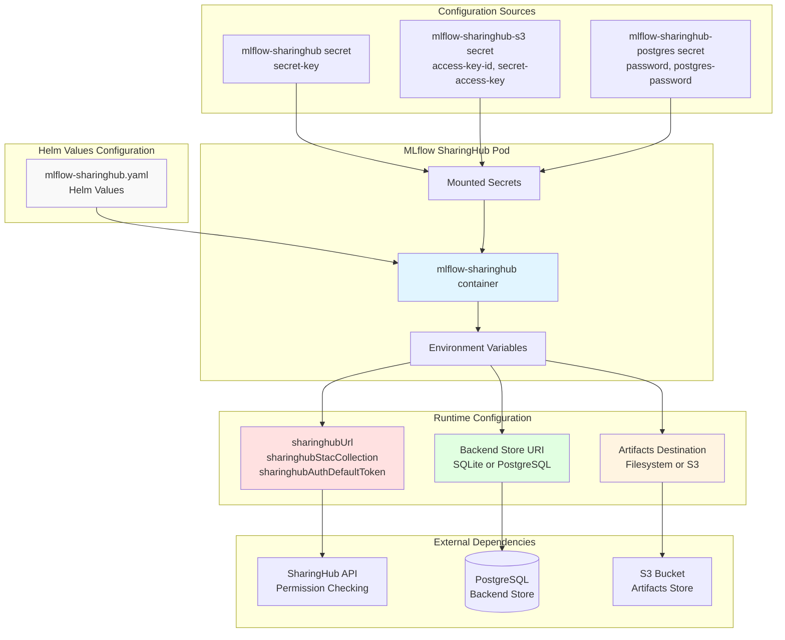
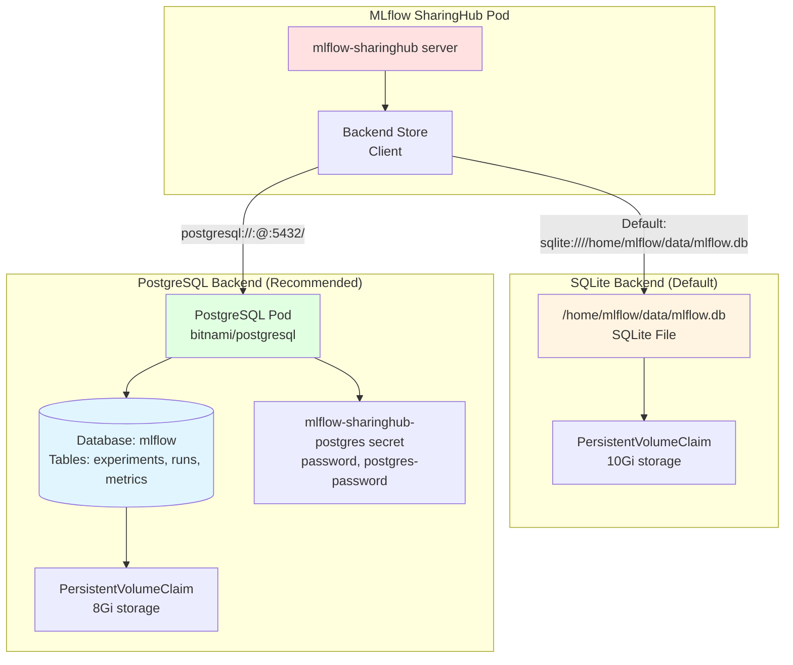
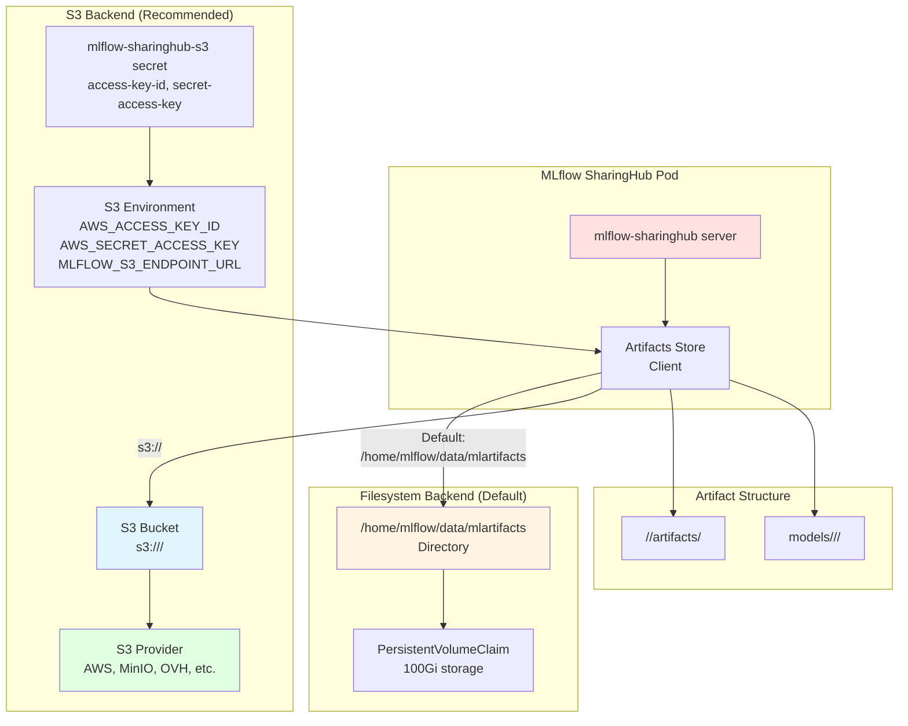
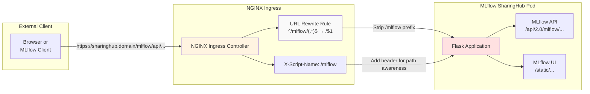

# MLflow SharingHub Configuration

<details>
<summary>Relevant source files</summary>

The following files were used as context for generating this wiki page:

- [docs/admin/configuration.md](docs/admin/configuration.md)
- [docs/admin/deployment-guide/components/mlflow-sharinghub.md](docs/admin/deployment-guide/components/mlflow-sharinghub.md)

</details>


This document provides a comprehensive reference for configuring MLflow SharingHub, the experiment tracking and model registry component of the EOEPCA MLOps Building Block. MLflow SharingHub extends standard MLflow with SharingHub integration for permission management and STAC catalog synchronization.

For deployment instructions, see [MLflow SharingHub Deployment](#5.4). For SharingHub configuration options, see [SharingHub Configuration](#6.1).

## Configuration Overview

MLflow SharingHub configuration is divided into several key areas:

| Configuration Area | Purpose | Required |
|-------------------|---------|----------|
| SharingHub Integration | Permission checking and STAC collection mapping | Yes |
| Backend Store | Metadata storage (experiments, runs, models) | Yes |
| Artifacts Store | Storage for model artifacts and files | Yes |
| Security | Secret key for server security | Yes |
| Ingress | External access and URL routing | Yes |
| Pod Security | Filesystem permissions and security context | No |

**Configuration Architecture**



Sources: [docs/admin/deployment-guide/components/mlflow-sharinghub.md:31-96](), [docs/admin/configuration.md:281-359]()

## SharingHub Integration

MLflow SharingHub integrates with SharingHub for permission checking and project-based experiment tracking. This integration enables per-project MLflow tracking URIs that are automatically validated against GitLab project permissions.

### Core Integration Settings

The integration is configured through the `mlflowSharinghub` section:

| Setting | Type | Description | Required | Default |
|---------|------|-------------|----------|---------|
| `sharinghubUrl` | string | URL of the SharingHub instance | Yes | - |
| `sharinghubStacCollection` | string | STAC collection ID for AI models | Yes | - |
| `sharinghubAuthDefaultToken` | boolean | Enable unauthenticated access via default token | No | `false` |

**Configuration Example:**

```yaml
mlflowSharinghub:
  sharinghubUrl: https://sharinghub.example.com
  sharinghubStacCollection: ai-model
  sharinghubAuthDefaultToken: false
```

Sources: [docs/admin/configuration.md:283-297](), [docs/admin/deployment-guide/components/mlflow-sharinghub.md:52-56]()

### Permission Check Flow

```mermaid
graph LR
    subgraph "MLflow Client"
        Client["MLflow Client<br/>mlflow.log_metric"]
    end
    
    subgraph "MLflow SharingHub Server"
        API["MLflow Tracking API<br/>/api/2.0/mlflow/runs"]
        PermCheck["Permission Checker<br/>validates project access"]
        TrackingURI["Project URI Parser<br/>extracts project_id"]
    end
    
    subgraph "SharingHub API"
        CheckAPI["Check API<br/>/api/check/<project_id>"]
        GitLabValidator["GitLab Permission<br/>Validator"]
    end
    
    subgraph "GitLab"
        Project["GitLab Project<br/>project_id"]
        ProjectTopic["Project Topic<br/>sharinghub:aimodel"]
    end
    
    Client -->|"POST experiment_name=projects/123"| API
    API --> TrackingURI
    TrackingURI --> PermCheck
    PermCheck -->|"GET /api/check/123"| CheckAPI
    CheckAPI --> GitLabValidator
    GitLabValidator --> Project
    GitLabValidator --> ProjectTopic
    
    ProjectTopic -.validates against.-> SHCollection["sharinghubStacCollection<br/>ai-model"]
    
    CheckAPI -->|"200 OK or 403 Forbidden"| PermCheck
    PermCheck -->|"Allow or Deny"| API
    API -->|"Response"| Client
    
    style API fill:#ffe1e1
    style PermCheck fill:#f9f9f9
    style CheckAPI fill:#e1f5ff
    style Project fill:#e1ffe1
```



Sources: [docs/admin/configuration.md:295-297]()

### STAC Collection Restriction

The `sharinghubStacCollection` setting restricts MLflow usage to projects registered in a specific STAC collection. This prevents MLflow from being used on unrelated projects:

- **Value**: Must match a collection ID defined in SharingHub (e.g., `ai-model`)
- **Purpose**: Only projects with the corresponding GitLab topic (e.g., `sharinghub:aimodel`) can use MLflow
- **Validation**: Checked during every experiment creation and run logging operation

Sources: [docs/admin/configuration.md:296]()

### Default Token Authentication

When `sharinghubAuthDefaultToken` is enabled, MLflow SharingHub allows unauthenticated read-only access to projects visible through SharingHub's default token:

```yaml
mlflowSharinghub:
  sharinghubAuthDefaultToken: false  # Set to true if SharingHub has default token
```

**Behavior:**

| Setting | Unauthenticated Access | Authenticated Access |
|---------|----------------------|----------------------|
| `false` | Denied | Per-project permissions |
| `true` | Read-only (default token projects) | Per-project permissions |

Sources: [docs/admin/configuration.md:297](), [docs/admin/deployment-guide/components/mlflow-sharinghub.md:56]()

## Backend Store Configuration

The backend store holds MLflow metadata including experiments, runs, parameters, and metrics. Two storage backends are supported: SQLite (default) and PostgreSQL (recommended).

### Backend Store Architecture



Sources: [docs/admin/configuration.md:299-334]()

### SQLite Backend (Default)

The default configuration uses SQLite with a persistent volume:

```yaml
mlflowSharinghub:
  # No backendStoreUri specified = use default SQLite

persistence:
  enabled: true
  size: 10Gi
  storageClass: ""  # Use default storage class
```

**SQLite File Location:** `/home/mlflow/data/mlflow.db`

**Advantages:**
- Simple setup, no additional components
- Suitable for development and testing

**Limitations:**
- Single-threaded access
- Not suitable for production with multiple concurrent users
- No native backup capabilities

Sources: [docs/admin/configuration.md:301]()

### PostgreSQL Backend (Recommended)

PostgreSQL is recommended for production deployments. Two configuration methods are available:

#### Method 1: Chart Dependency (Recommended)

Deploy PostgreSQL as a chart dependency:

**Step 1:** Create the PostgreSQL secret:

```bash
kubectl create secret generic mlflow-sharinghub-postgres \
  --from-literal password="<mlflow-user-password>" \
  --from-literal postgres-password="<root-user-password>" \
  --namespace sharinghub
```

**Step 2:** Configure Helm values:

```yaml
postgresql:
  enabled: true
  auth:
    username: mlflow
    database: mlflow
    existingSecret: mlflow-sharinghub-postgres
  primary:
    persistence:
      enabled: true
      size: 8Gi
```

**Connection String Generated:** `postgresql://mlflow:<password>@mlflow-sharinghub-postgresql:5432/mlflow`

Sources: [docs/admin/configuration.md:307-322](), [docs/admin/deployment-guide/components/mlflow-sharinghub.md:87-90]()

#### Method 2: Existing PostgreSQL Instance

Connect to an existing PostgreSQL instance:

**Step 1:** Add `backend-store-uri` to the secret:

```bash
# Edit existing secret to add backend-store-uri key
kubectl create secret generic mlflow-sharinghub \
  --from-literal secret-key="<random-secret-key>" \
  --from-literal backend-store-uri="postgresql://<user>:<password>@<host>:5432/<database>" \
  --namespace sharinghub \
  --dry-run=client -o yaml | kubectl apply -f -
```

**Step 2:** Configure Helm values:

```yaml
mlflowSharinghub:
  backendStoreUriSecret: true

postgresql:
  enabled: false
```

Sources: [docs/admin/configuration.md:325-333]()

### Backend Store Comparison

| Feature | SQLite | PostgreSQL (Dependency) | PostgreSQL (Existing) |
|---------|--------|------------------------|-----------------------|
| Setup Complexity | Low | Medium | Low |
| Concurrent Access | Limited | High | High |
| Production Ready | No | Yes | Yes |
| Backup Support | Manual file backup | PostgreSQL tools | PostgreSQL tools |
| Resource Requirements | Minimal | +512Mi memory | None (external) |
| Configuration | Default | `postgresql.enabled: true` | `backendStoreUriSecret: true` |

## Artifacts Store Configuration

The artifacts store holds model files, training data, and other large objects logged during experiments. Two storage backends are supported: local filesystem (default) and S3 (recommended).

### Artifacts Store Architecture



Sources: [docs/admin/configuration.md:336-358]()

### Filesystem Backend (Default)

The default configuration uses a persistent volume for artifacts:

```yaml
mlflowSharinghub:
  # No artifactsDestination specified = use default filesystem

persistence:
  enabled: true
  size: 100Gi  # Large volume for artifacts
  storageClass: ""
```

**Artifacts Directory:** `/home/mlflow/data/mlartifacts`

**Advantages:**
- Simple setup, no external dependencies
- Direct filesystem access

**Limitations:**
- Limited scalability for large deployments
- No built-in replication or backup
- Requires large persistent volumes

Sources: [docs/admin/configuration.md:338]()

### S3 Backend (Recommended)

S3 storage is recommended for production deployments:

**Step 1:** Create S3 bucket in your provider (AWS, MinIO, OVH, etc.)

**Step 2:** Create the S3 credentials secret:

```bash
kubectl create secret generic mlflow-sharinghub-s3 \
  --from-literal access-key-id="<access-key>" \
  --from-literal secret-access-key="<secret-key>" \
  --namespace sharinghub
```

**Step 3:** Configure Helm values:

```yaml
mlflowSharinghub:
  artifactsDestination: s3://<bucket-name>

s3:
  enabled: true
  endpointUrl: https://<s3-endpoint>  # e.g., s3.amazonaws.com, s3.eu-west-3.amazonaws.com
```

**Environment Variables Set:**
- `AWS_ACCESS_KEY_ID`: From `mlflow-sharinghub-s3` secret
- `AWS_SECRET_ACCESS_KEY`: From `mlflow-sharinghub-s3` secret
- `MLFLOW_S3_ENDPOINT_URL`: From `s3.endpointUrl` configuration

Sources: [docs/admin/configuration.md:340-358](), [docs/admin/deployment-guide/components/mlflow-sharinghub.md:19-25](), [docs/admin/deployment-guide/components/mlflow-sharinghub.md:53](), [docs/admin/deployment-guide/components/mlflow-sharinghub.md:58-60]()

### S3 Configuration Examples

**AWS S3:**
```yaml
s3:
  enabled: true
  endpointUrl: https://s3.amazonaws.com  # or regional endpoint
```

**MinIO:**
```yaml
s3:
  enabled: true
  endpointUrl: https://minio.example.com
```

**OVH Object Storage:**
```yaml
s3:
  enabled: true
  endpointUrl: https://s3.gra.io.cloud.ovh.net
```

### Artifacts Store Comparison

| Feature | Filesystem | S3 |
|---------|-----------|-----|
| Setup Complexity | Low | Medium |
| Scalability | Limited by volume size | Unlimited |
| Backup/Replication | Manual | Provider-managed |
| Cost | Volume storage cost | Object storage cost |
| Production Ready | No | Yes |
| Multi-region | No | Yes (provider-dependent) |
| Configuration | Default | `artifactsDestination: s3://<bucket>` |

## Security Configuration

MLflow SharingHub requires a secret key for session management and security features.

### Secret Key

The secret key is used for:
- Flask session security
- Internal authentication tokens
- CSRF protection

**Create the secret:**

```bash
# Generate a random secret key (recommended: 64 characters)
SECRET_KEY=$(openssl rand -hex 32)

kubectl create secret generic mlflow-sharinghub \
  --from-literal secret-key="${SECRET_KEY}" \
  --namespace sharinghub
```

The secret is automatically mounted and used by the server. No additional configuration is needed in Helm values.

Sources: [docs/admin/deployment-guide/components/mlflow-sharinghub.md:11-17]()

### Pod Security Context

Configure filesystem permissions for the MLflow pod:

```yaml
podSecurityContext:
  fsGroup: 999  # mlflow user group ID
```

This ensures the pod can write to persistent volumes. The default user inside the container is `mlflow` (UID 999, GID 999).

Sources: [docs/admin/deployment-guide/components/mlflow-sharinghub.md:65-66]()

## Ingress and Networking

MLflow SharingHub is typically deployed under a subpath of the SharingHub domain to simplify TLS certificate management.

### Ingress Configuration

```yaml
ingress:
  enabled: true
  className: nginx
  annotations:
    cert-manager.io/cluster-issuer: letsencrypt-prod
    nginx.ingress.kubernetes.io/ssl-redirect: "true"
    nginx.ingress.kubernetes.io/proxy-body-size: 10g
    nginx.ingress.kubernetes.io/configuration-snippet: |
      proxy_set_header X-Script-Name /mlflow;
      rewrite ^/mlflow/(.*)$ /$1 break;
  hosts:
    - host: sharinghub.<domain_name>
      paths:
        - path: /mlflow/
          pathType: ImplementationSpecific
  tls:
    - secretName: sharinghub.<domain_name>-tls
      hosts:
        - sharinghub.<domain_name>
```

Sources: [docs/admin/deployment-guide/components/mlflow-sharinghub.md:68-86]()

### URL Routing Details

**Ingress Path Rewriting:**



Sources: [docs/admin/deployment-guide/components/mlflow-sharinghub.md:75-77]()

### Key Ingress Settings

| Annotation | Value | Purpose |
|-----------|-------|---------|
| `cert-manager.io/cluster-issuer` | `letsencrypt-prod` | Automatic TLS certificate provisioning |
| `nginx.ingress.kubernetes.io/ssl-redirect` | `"true"` | Force HTTPS |
| `nginx.ingress.kubernetes.io/proxy-body-size` | `10g` | Allow large model uploads |
| `proxy_set_header X-Script-Name` | `/mlflow` | Inform Flask of subpath mounting |
| `rewrite` | `^/mlflow/(.*)$ /$1 break` | Strip `/mlflow` prefix before forwarding |

**URL Examples:**

| External URL | Internal URL | Purpose |
|-------------|-------------|---------|
| `https://sharinghub.domain/mlflow/` | `/` | MLflow UI home |
| `https://sharinghub.domain/mlflow/api/2.0/mlflow/experiments/list` | `/api/2.0/mlflow/experiments/list` | API endpoint |
| `https://sharinghub.domain/mlflow/static/css/app.css` | `/static/css/app.css` | Static assets |

Sources: [docs/admin/deployment-guide/components/mlflow-sharinghub.md:68-86]()

## Complete Configuration Example

Here is a complete production-ready configuration combining all settings:

```yaml
apiVersion: argoproj.io/v1alpha1
kind: Application
metadata:
  name: mlflow-sharinghub
  namespace: argocd
spec:
  destination:
    namespace: sharinghub
    server: https://kubernetes.default.svc
  project: default
  source:
    repoURL: https://github.com/csgroup-oss/mlflow-sharinghub.git
    path: deploy/helm/mlflow-sharinghub
    targetRevision: "0.2.0"
    helm:
      valuesObject:
        # Container image
        image:
          repository: eoepca/mlflow-sharinghub
          tag: latest
          pullPolicy: IfNotPresent

        # SharingHub integration
        mlflowSharinghub:
          sharinghubUrl: https://sharinghub.example.com
          sharinghubStacCollection: ai-model
          sharinghubAuthDefaultToken: false
          artifactsDestination: s3://mlflow-artifacts

        # S3 artifacts store
        s3:
          enabled: true
          endpointUrl: https://s3.eu-west-3.amazonaws.com

        # PostgreSQL backend store
        postgresql:
          enabled: true
          auth:
            username: mlflow
            database: mlflow
            existingSecret: mlflow-sharinghub-postgres
          primary:
            persistence:
              enabled: true
              size: 8Gi

        # Disable filesystem persistence (using S3 + PostgreSQL)
        persistence:
          enabled: false

        # Pod security
        podSecurityContext:
          fsGroup: 999

        # Resource limits
        resources:
          requests:
            memory: "512Mi"
            cpu: "250m"
          limits:
            memory: "2Gi"
            cpu: "1000m"

        # Ingress configuration
        ingress:
          enabled: true
          className: nginx
          annotations:
            cert-manager.io/cluster-issuer: letsencrypt-prod
            nginx.ingress.kubernetes.io/ssl-redirect: "true"
            nginx.ingress.kubernetes.io/proxy-body-size: 10g
            nginx.ingress.kubernetes.io/configuration-snippet: |
              proxy_set_header X-Script-Name /mlflow;
              rewrite ^/mlflow/(.*)$ /$1 break;
          hosts:
            - host: sharinghub.example.com
              paths:
                - path: /mlflow/
                  pathType: ImplementationSpecific
          tls:
            - secretName: sharinghub.example.com-tls
              hosts:
                - sharinghub.example.com

  syncPolicy:
    syncOptions:
      - FailOnSharedResource=true
      - CreateNamespace=true
```

**Required Secrets:**

```bash
# Secret key for security
kubectl create secret generic mlflow-sharinghub \
  --from-literal secret-key="<64-char-random-string>" \
  --namespace sharinghub

# PostgreSQL credentials
kubectl create secret generic mlflow-sharinghub-postgres \
  --from-literal password="<mlflow-user-password>" \
  --from-literal postgres-password="<root-password>" \
  --namespace sharinghub

# S3 credentials
kubectl create secret generic mlflow-sharinghub-s3 \
  --from-literal access-key-id="<access-key>" \
  --from-literal secret-access-key="<secret-key>" \
  --namespace sharinghub
```

Sources: [docs/admin/deployment-guide/components/mlflow-sharinghub.md:29-110](), [docs/admin/configuration.md:281-359]()

## Configuration Validation

After applying the configuration, verify the deployment:

**Check pod status:**
```bash
kubectl get pods -n sharinghub -l app.kubernetes.io/name=mlflow-sharinghub
```

**Check logs:**
```bash
kubectl logs -n sharinghub deployment/mlflow-sharinghub
```

**Expected log output:**
- `INFO:werkzeug: * Running on http://0.0.0.0:5000/`
- `INFO:mlflow_sharinghub.app:SharingHub integration enabled`
- `INFO:mlflow_sharinghub.app:Backend store: postgresql://...`
- `INFO:mlflow_sharinghub.app:Artifacts destination: s3://...`

**Test access:**
```bash
curl -k https://sharinghub.example.com/mlflow/health
```

Expected response: `{"status": "healthy"}`

Sources: [docs/admin/deployment-guide/components/mlflow-sharinghub.md:106-110]()