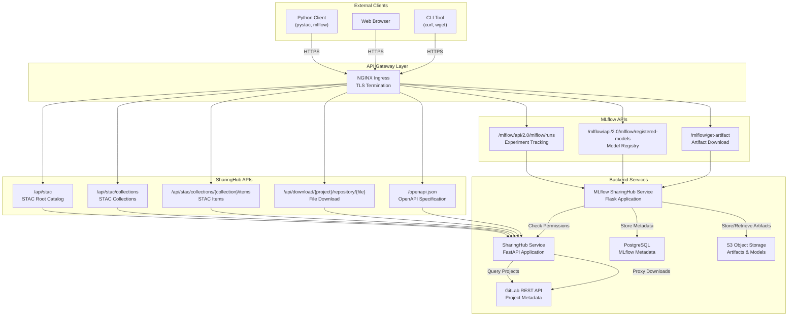
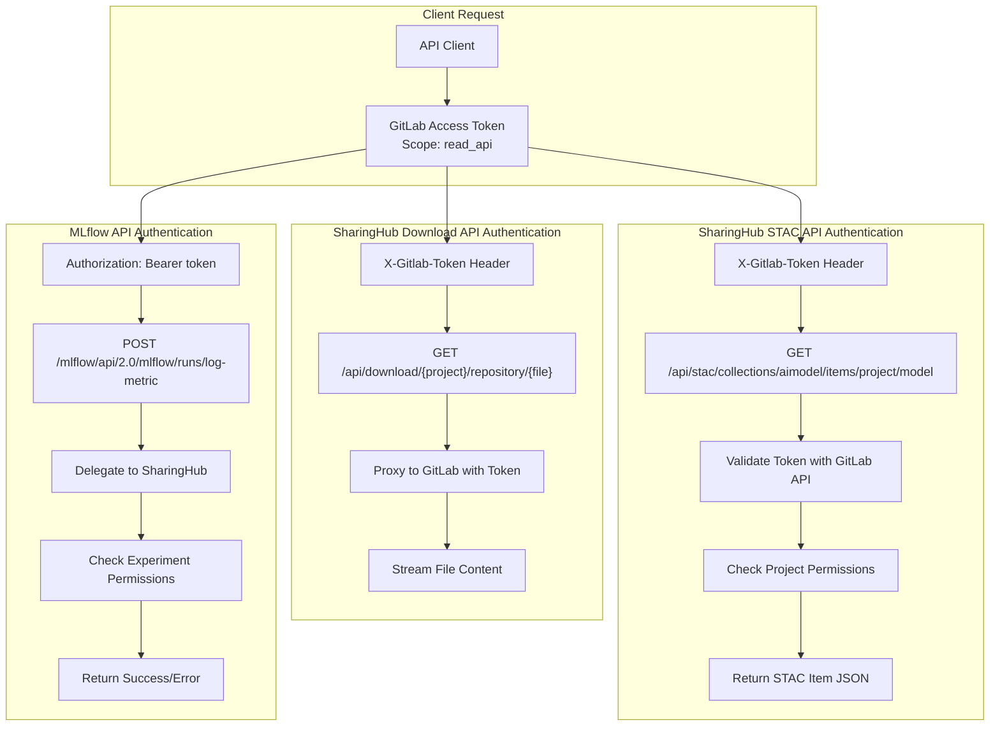
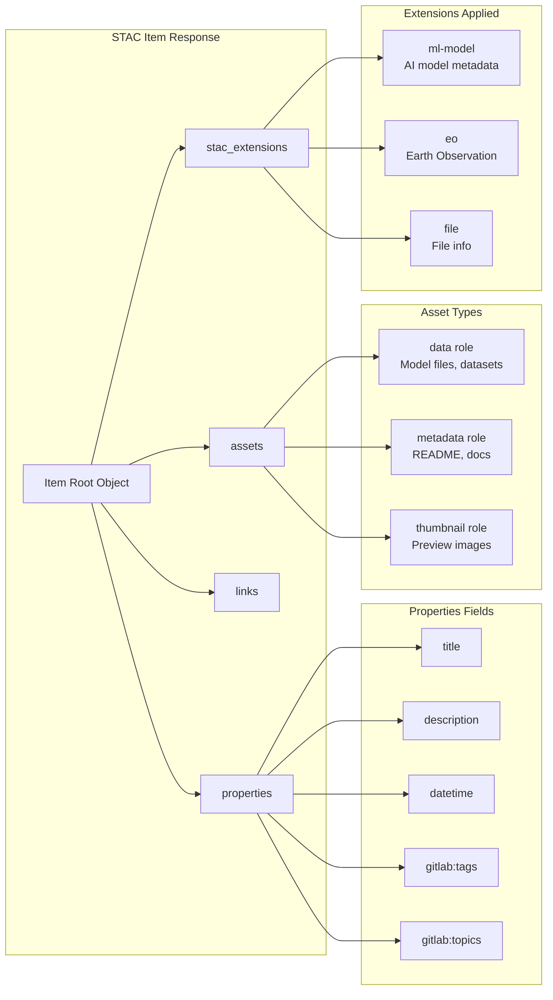
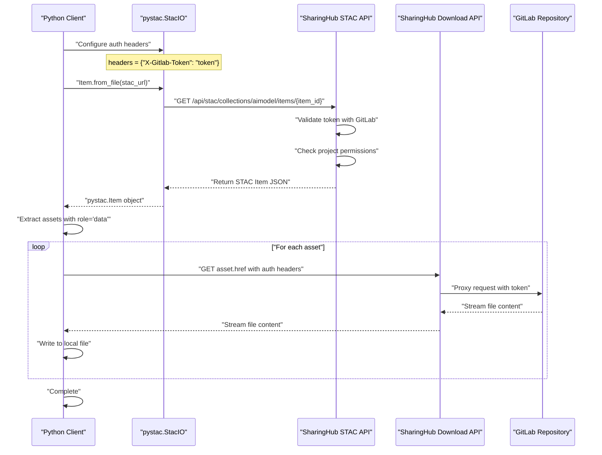

# API Reference

<details>
<summary>Relevant source files</summary>

The following files were used as context for generating this wiki page:

- [docs/api/endpoint-specification.md](docs/api/endpoint-specification.md)
- [docs/api/usage.md](docs/api/usage.md)

</details>


## Purpose and Scope

This section documents the programmatic APIs exposed by the EOEPCA MLOps Building Block for discovering, accessing, and tracking machine learning models and datasets. The platform exposes two primary APIs:

1. **SharingHub STAC API** - A standards-compliant SpatioTemporal Asset Catalog (STAC) API for discovering and downloading AI models and datasets
2. **MLflow Tracking API** - A REST API for logging experiments, parameters, metrics, and registering models

This page provides an overview of both APIs, their authentication mechanisms, and the relationships between API endpoints and backend components. For detailed STAC API specifications and usage examples, see [STAC API Specification](#7.1) and [Using the STAC API](#7.2).

For information about configuring these APIs during deployment, see [SharingHub Configuration](#6.1) and [MLflow SharingHub Configuration](#6.2).

## API Overview

The MLOps Building Block exposes APIs through two main services, each serving distinct purposes in the ML lifecycle:

| API | Base Path | Purpose | Standard Compliance |
|-----|-----------|---------|---------------------|
| SharingHub STAC API | `/api/stac` | Catalog discovery and asset download | STAC 1.0.0 |
| SharingHub Download API | `/api/download` | Direct file download from GitLab projects | Custom |
| MLflow Tracking API | `/mlflow/api` | Experiment tracking and model registration | MLflow REST API |
| MLflow Model Registry API | `/mlflow/api/2.0/mlflow` | Model lifecycle management | MLflow REST API |

Sources: [docs/api/usage.md:1-76](), [docs/api/endpoint-specification.md:1-9]()

## API Architecture

The following diagram shows how the APIs map to backend services and their responsibilities:



Sources: [docs/api/usage.md:31](), [docs/api/endpoint-specification.md:1-9]()

## Authentication and Authorization

All APIs use token-based authentication with GitLab access tokens. The authentication flow differs slightly between SharingHub and MLflow APIs:



Sources: [docs/api/usage.md:27-30](), [docs/api/usage.md:59]()

### Authentication Methods

| API | Header Name | Header Format | Token Scope |
|-----|-------------|---------------|-------------|
| STAC API | `X-Gitlab-Token` | `<access_token>` | `read_api` |
| Download API | `X-Gitlab-Token` | `<access_token>` | `read_api` |
| MLflow Tracking API | `Authorization` | `Bearer <access_token>` | `api` or `read_api` |

**Obtaining Access Tokens:**

1. **Personal Access Token**: Generate from GitLab user settings (Settings → Access Tokens)
2. **Project Access Token**: Generate from GitLab project settings (Settings → Access Tokens)
3. **OAuth Token**: Obtain through OIDC flow if using SharingHub Web UI

Sources: [docs/api/usage.md:27](), [docs/api/usage.md:59]()

## STAC API Endpoints

The SharingHub STAC API follows the STAC specification and provides hierarchical catalog access:

### Core STAC Endpoints

| Endpoint | Method | Description | Returns |
|----------|--------|-------------|---------|
| `/api/stac` | GET | Root catalog | STAC Catalog JSON |
| `/api/stac/collections` | GET | List all collections | STAC Collection list |
| `/api/stac/collections/{collection_id}` | GET | Get specific collection | STAC Collection JSON |
| `/api/stac/collections/{collection_id}/items` | GET | List items in collection | STAC Item list |
| `/api/stac/collections/{collection_id}/items/{item_id}` | GET | Get specific item | STAC Item JSON |

**Collection IDs** correspond to SharingHub categories:
- `aimodel` - AI model projects with topic `sharinghub:aimodel`
- `dataset` - Dataset projects with topic `sharinghub:dataset`
- `processor` - Processor projects with topic `sharinghub:processor`

**Item IDs** follow the pattern: `{gitlab_namespace}/{project_name}`

Sources: [docs/api/usage.md:31](), [docs/api/endpoint-specification.md:5-9]()

### Download Endpoints

| Endpoint | Method | Description |
|----------|--------|-------------|
| `/api/download/{namespace}/{project}/repository/{file}?ref={branch}` | GET | Download file from GitLab project repository |
| `/mlflow/get-artifact?path={artifact_path}&run_uuid={run_id}` | GET | Download MLflow artifact from S3 |

Sources: [docs/api/usage.md:72]()

## MLflow API Endpoints

The MLflow SharingHub exposes the standard MLflow REST API for experiment tracking and model registry operations:

### Experiment Tracking Endpoints

| Endpoint | Method | Description |
|----------|--------|-------------|
| `/mlflow/api/2.0/mlflow/runs/create` | POST | Create a new run |
| `/mlflow/api/2.0/mlflow/runs/log-metric` | POST | Log metric for a run |
| `/mlflow/api/2.0/mlflow/runs/log-parameter` | POST | Log parameter for a run |
| `/mlflow/api/2.0/mlflow/runs/log-batch` | POST | Log metrics, params, and tags in batch |
| `/mlflow/api/2.0/mlflow/runs/get` | GET | Get run details |

### Model Registry Endpoints

| Endpoint | Method | Description |
|----------|--------|-------------|
| `/mlflow/api/2.0/mlflow/registered-models/create` | POST | Register a new model |
| `/mlflow/api/2.0/mlflow/model-versions/create` | POST | Create a new model version |
| `/mlflow/api/2.0/mlflow/model-versions/get` | GET | Get model version details |
| `/mlflow/api/2.0/mlflow/registered-models/search` | GET | Search registered models |

For complete MLflow API documentation, refer to the official MLflow REST API documentation at https://mlflow.org/docs/latest/rest-api.html.

Sources: [docs/api/endpoint-specification.md:1-9]()

## API Response Formats

### STAC Item Structure

When requesting a STAC item, the response follows the STAC specification with MLOps-specific extensions:



**Key Fields:**

- `id`: GitLab project full path (e.g., `namespace/project-name`)
- `type`: Always `"Feature"` for STAC items
- `geometry`: null (not geospatial by default)
- `bbox`: null (not geospatial by default)
- `assets`: Dictionary of downloadable files with metadata
- `links`: Relationships to parent collection, project URL, etc.

Sources: [docs/api/usage.md:35-38]()

## OpenAPI Specification

The complete SharingHub API specification is available in OpenAPI 3.0 format:

**Specification URL:** `https://{sharinghub-domain}/openapi.json`

The OpenAPI specification includes:
- All endpoint paths and methods
- Request/response schemas
- Authentication requirements
- Example requests and responses
- Error codes and messages

An interactive Swagger UI is also available at the same domain for exploring the API interactively.

Sources: [docs/api/endpoint-specification.md:5-9]()

## API Integration Example

The following diagram shows a typical API integration workflow for downloading a model:



Sources: [docs/api/usage.md:20-76]()

## Error Handling

Both APIs return standard HTTP status codes with JSON error responses:

| Status Code | Meaning | Common Causes |
|-------------|---------|---------------|
| 200 | Success | Request completed successfully |
| 401 | Unauthorized | Invalid or missing authentication token |
| 403 | Forbidden | Token valid but insufficient permissions |
| 404 | Not Found | Collection, item, or resource does not exist |
| 500 | Internal Server Error | Backend service failure |

**Example Error Response:**
```json
{
  "detail": "Project not found or access denied",
  "status_code": 404
}
```

## Next Steps

For detailed information about using these APIs:

- See [STAC API Specification](#7.1) for complete endpoint documentation and schemas
- See [Using the STAC API](#7.2) for practical examples and client library usage
- See [SharingHub Configuration](#6.1) for API configuration options
- See [Model Training Workflow](#4.1) for how APIs integrate into the ML lifecycle

Sources: [docs/api/usage.md:1-76](), [docs/api/endpoint-specification.md:1-9]()