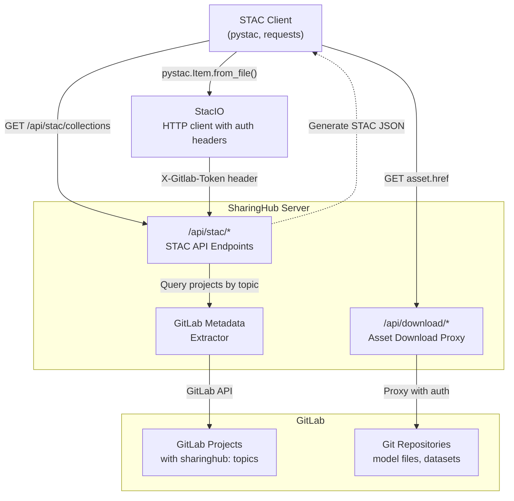
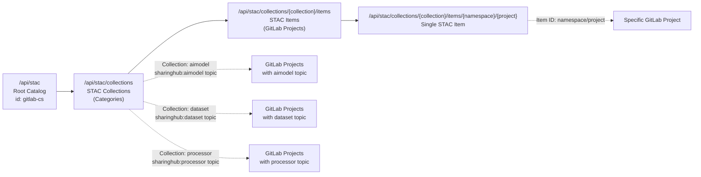
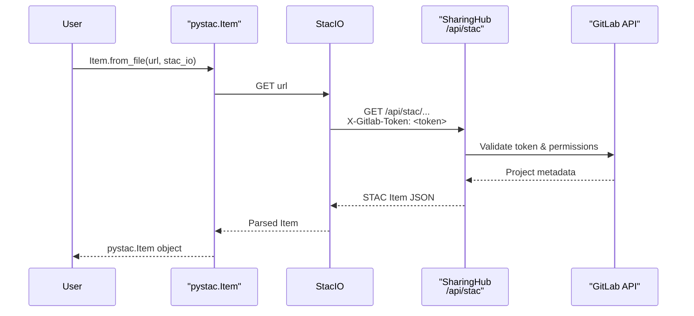
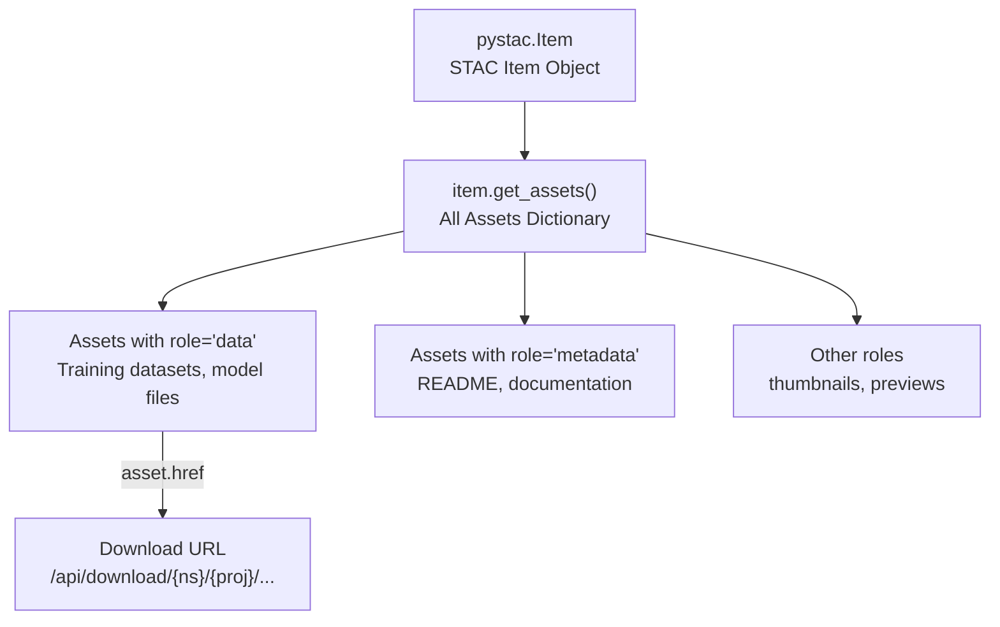
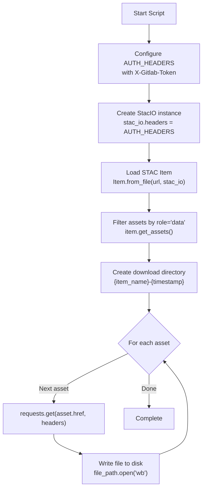

# Using the STAC API

<details>
<summary>Relevant source files</summary>

The following files were used as context for generating this wiki page:

- [docs/api/usage.md](docs/api/usage.md)

</details>


## Purpose and Scope

This document provides a practical guide for programmatically accessing models and datasets through the SharingHub STAC API. It covers authentication methods, catalog navigation, item retrieval, and asset downloading using standard STAC clients.

For the formal API specification and endpoint definitions, see [STAC API Specification](#7.1). For information about configuring the STAC catalog and collections on the server side, see [SharingHub Configuration](#6.1).

**Sources:** [docs/api/usage.md:1-76]()

---

## Overview

The STAC API is the primary programmatic interface for discovering and retrieving AI models and datasets from SharingHub. It implements the SpatioTemporal Asset Catalog (STAC) specification, providing a standardized way to query and access geospatial and ML assets stored in GitLab projects.

### STAC API Architecture



**Diagram: STAC API request flow from client to GitLab backend**

The STAC API acts as a dynamic catalog generator that queries GitLab projects and transforms them into STAC-compliant JSON responses. All authentication is handled via GitLab access tokens passed in request headers.

**Sources:** [docs/api/usage.md:1-10]()

---

## Prerequisites and Setup

### Required Dependencies

To use the STAC API from Python, install the following packages:

```bash
pip install requests pystac
```

- **`pystac`**: Python library for working with STAC catalogs, collections, and items
- **`requests`**: HTTP library for downloading assets

### Authentication Requirements

All STAC API requests require authentication using a GitLab access token with `read_api` scope. The token must be passed in the `X-Gitlab-Token` HTTP header.

| Authentication Method | Header Name | Value Format | Scope Required |
|----------------------|-------------|--------------|----------------|
| Personal Access Token | `X-Gitlab-Token` | `<your_personal_access_token>` | `read_api` |
| Project Access Token | `X-Gitlab-Token` | `<project_access_token>` | `read_api` |
| CI/CD Job Token | `X-Gitlab-Token` | `$CI_JOB_TOKEN` | `read_api` (automatic) |

**Sources:** [docs/api/usage.md:12-16](), [docs/api/usage.md:27](), [docs/api/usage.md:59]()

---

## STAC Catalog Structure

### URL Pattern Mapping

The SharingHub STAC API follows a hierarchical structure that maps to GitLab concepts:



**Diagram: STAC API URL hierarchy and GitLab topic mapping**

| STAC Concept | URL Path | GitLab Mapping |
|--------------|----------|----------------|
| Root Catalog | `/api/stac` | All SharingHub categories |
| Collection | `/api/stac/collections/{collection}` | Projects with `sharinghub:{collection}` topic |
| Items List | `/api/stac/collections/{collection}/items` | All projects in collection |
| Single Item | `/api/stac/collections/{collection}/items/{namespace}/{project}` | Specific GitLab project |

**Sources:** [docs/api/usage.md:31]()

---

## Configuring the STAC Client

### Basic pystac Setup

The `pystac` library uses a `StacIO` object to handle HTTP requests. Configure it with authentication headers before making requests:

```python
from pystac import Item, StacIO

# Configure authentication headers
AUTH_HEADERS = {"X-Gitlab-Token": "<your_access_token>"}

# Create StacIO instance with auth
stac_io = StacIO.default()
stac_io.headers = AUTH_HEADERS
```

The `StacIO.default()` method returns the default HTTP client implementation. Setting the `headers` attribute ensures all subsequent requests include the authentication token.

**Sources:** [docs/api/usage.md:27-30]()

### Authentication Flow



**Diagram: Authentication and request flow using pystac client**

**Sources:** [docs/api/usage.md:29-30](), [docs/api/usage.md:35]()

---

## Retrieving STAC Items

### Loading a Single Item

To retrieve a specific AI model or dataset, use the `Item.from_file()` method with the full STAC item URL:

```python
from pystac import Item, StacIO

# Configure authentication
AUTH_HEADERS = {"X-Gitlab-Token": "<your_access_token>"}
stac_io = StacIO.default()
stac_io.headers = AUTH_HEADERS

# Construct STAC item URL
STAC_API_URL = "https://sharinghub.develop.eoepca.org/api/stac/collections/dataset/items/sharinghub-test/wine-dataset"

# Load the STAC item
item = Item.from_file(STAC_API_URL, stac_io=stac_io)
```

### STAC Item Properties

A retrieved `pystac.Item` contains:

| Property | Description | Access Method |
|----------|-------------|---------------|
| `id` | Unique identifier (namespace/project) | `item.id` |
| `properties` | Metadata dictionary | `item.properties` |
| `assets` | Dictionary of downloadable assets | `item.get_assets()` |
| `links` | Related resources | `item.links` |
| `geometry` | Spatial extent (if applicable) | `item.geometry` |
| `bbox` | Bounding box | `item.bbox` |

**Sources:** [docs/api/usage.md:31](), [docs/api/usage.md:35-38]()

---

## Downloading Assets

### Understanding Asset Roles

STAC items contain multiple assets, each with a specific role. Filter assets by their role to download only the files you need:



**Diagram: STAC asset structure and filtering by role**

### Asset Download Pattern

The recommended pattern for downloading assets:

```python
# Get only data assets (exclude metadata, thumbnails, etc.)
item_assets = [
    (name, asset) for name, asset in item.get_assets().items() 
    if asset.has_role("data")
]

# Download each asset
for name, asset in item_assets:
    print(f"Downloading: {asset.href}")
    response = requests.get(asset.href, headers=AUTH_HEADERS)
    response.raise_for_status()
    
    with open(name, "wb") as f:
        f.write(response.content)
```

### Asset URL Structure

Asset URLs follow this pattern:

```
https://{sharinghub-domain}/api/download/{namespace}/{project}/repository/{file_path}?ref={branch}
```

| Component | Description | Example |
|-----------|-------------|---------|
| `{namespace}` | GitLab group/user | `sharinghub-test` |
| `{project}` | GitLab project name | `wine-dataset` |
| `{file_path}` | Path to file in repository | `wine-quality.csv` |
| `{branch}` | Git branch name | `main` |

**Sources:** [docs/api/usage.md:36-38](), [docs/api/usage.md:44-54](), [docs/api/usage.md:72]()

---

## Complete Download Example

### Full Script

The following complete example demonstrates downloading a dataset from SharingHub:

[docs/api/usage.md:20-57]()

### Script Workflow



**Diagram: Download script execution flow**

### Key Implementation Details

1. **Authentication Configuration** ([docs/api/usage.md:27]()): Set `X-Gitlab-Token` header with a token having `read_api` scope
2. **StacIO Setup** ([docs/api/usage.md:29-30]()): Configure the StacIO client to include auth headers in all requests
3. **Item Loading** ([docs/api/usage.md:35]()): Use `Item.from_file()` to parse the STAC JSON response
4. **Asset Filtering** ([docs/api/usage.md:36-38]()): Extract only assets with `role="data"` to avoid downloading metadata files
5. **Directory Creation** ([docs/api/usage.md:40-42]()): Create timestamped directory based on item ID
6. **Asset Download** ([docs/api/usage.md:44-54]()): Download each asset using `requests.get()` with authentication headers

### Expected Output

When executed successfully, the script produces output similar to:

[docs/api/usage.md:67-75]()

**Sources:** [docs/api/usage.md:20-75]()

---

## Common Use Cases

### Use Case 1: Downloading AI Models

To download a trained AI model in ONNX format from the `aimodel` collection:

```python
from pystac import Item, StacIO
import requests

AUTH_HEADERS = {"X-Gitlab-Token": "<token>"}
stac_io = StacIO.default()
stac_io.headers = AUTH_HEADERS

# AI model STAC item URL
model_url = "https://sharinghub.domain/api/stac/collections/aimodel/items/{namespace}/{model-project}"

# Load model item
model_item = Item.from_file(model_url, stac_io=stac_io)

# Download ONNX model files
for name, asset in model_item.get_assets().items():
    if asset.has_role("data") and name.endswith(".onnx"):
        response = requests.get(asset.href, headers=AUTH_HEADERS)
        with open(name, "wb") as f:
            f.write(response.content)
```

### Use Case 2: Batch Dataset Discovery

To list all available datasets in a collection:

```python
from pystac import Catalog, StacIO

AUTH_HEADERS = {"X-Gitlab-Token": "<token>"}
stac_io = StacIO.default()
stac_io.headers = AUTH_HEADERS

# Load dataset collection
collection_url = "https://sharinghub.domain/api/stac/collections/dataset"
catalog = Catalog.from_file(collection_url, stac_io=stac_io)

# List all items (datasets)
for item in catalog.get_items():
    print(f"Dataset: {item.id}")
    print(f"  Description: {item.properties.get('description', 'N/A')}")
    print(f"  Assets: {list(item.get_assets().keys())}")
```

### Use Case 3: CI/CD Integration

When running in a GitLab CI/CD pipeline, use the automatic job token:

```python
import os
from pystac import Item, StacIO

# Use CI job token for authentication
AUTH_HEADERS = {"X-Gitlab-Token": os.environ["CI_JOB_TOKEN"]}
stac_io = StacIO.default()
stac_io.headers = AUTH_HEADERS

# Access STAC API
item_url = "https://sharinghub.domain/api/stac/collections/aimodel/items/project/model"
item = Item.from_file(item_url, stac_io=stac_io)
```

This approach eliminates the need to manage separate access tokens in CI/CD environments.

**Sources:** [docs/api/usage.md:27](), [docs/api/usage.md:59]()

---

## Error Handling

### Common Error Scenarios

| Error Type | HTTP Status | Cause | Solution |
|------------|-------------|-------|----------|
| Authentication Failed | 401 | Invalid or missing token | Verify `X-Gitlab-Token` header and token scope |
| Forbidden | 403 | No access to project | Ensure token owner has project access |
| Not Found | 404 | Invalid URL or project doesn't exist | Check project namespace and name |
| Rate Limit | 429 | Too many requests | Implement exponential backoff |

### Example Error Handling

```python
import requests
from pystac import Item, StacIO

AUTH_HEADERS = {"X-Gitlab-Token": "<token>"}
stac_io = StacIO.default()
stac_io.headers = AUTH_HEADERS

try:
    item = Item.from_file(STAC_API_URL, stac_io=stac_io)
except requests.HTTPError as e:
    if e.response.status_code == 401:
        print("Authentication failed. Check your access token.")
    elif e.response.status_code == 403:
        print("Access denied. Verify project permissions.")
    elif e.response.status_code == 404:
        print("Item not found. Check the URL and project path.")
    else:
        print(f"HTTP error: {e}")
except Exception as e:
    print(f"Unexpected error: {e}")
```

**Sources:** [docs/api/usage.md:50]()

---

## Best Practices

### Performance Optimization

1. **Reuse StacIO instances**: Create a single `StacIO` object and reuse it for multiple requests to avoid repeated configuration
2. **Filter assets before downloading**: Use `asset.has_role("data")` to avoid downloading unnecessary metadata files
3. **Implement retry logic**: Add exponential backoff for transient network errors
4. **Stream large files**: For large assets, use `requests.get(..., stream=True)` and write in chunks

### Security Considerations

1. **Never commit tokens**: Store access tokens in environment variables or secret management systems
2. **Use minimal scope**: Request only `read_api` scope for read-only operations
3. **Rotate tokens regularly**: Periodically regenerate access tokens
4. **Use HTTPS**: Always connect to SharingHub over HTTPS to protect tokens in transit

### Code Organization

```python
from pathlib import Path
from typing import List, Tuple
from pystac import Item, Asset, StacIO
import requests

class STACDownloader:
    """Helper class for downloading STAC assets."""
    
    def __init__(self, auth_token: str, base_url: str):
        self.auth_headers = {"X-Gitlab-Token": auth_token}
        self.stac_io = StacIO.default()
        self.stac_io.headers = self.auth_headers
        self.base_url = base_url
    
    def load_item(self, collection: str, namespace: str, project: str) -> Item:
        """Load a STAC item from the API."""
        url = f"{self.base_url}/api/stac/collections/{collection}/items/{namespace}/{project}"
        return Item.from_file(url, stac_io=self.stac_io)
    
    def download_assets(self, item: Item, output_dir: Path, roles: List[str] = ["data"]) -> None:
        """Download item assets with specified roles."""
        output_dir.mkdir(parents=True, exist_ok=True)
        
        for name, asset in item.get_assets().items():
            if any(asset.has_role(role) for role in roles):
                file_path = output_dir / name
                response = requests.get(asset.href, headers=self.auth_headers)
                response.raise_for_status()
                
                with file_path.open("wb") as f:
                    f.write(response.content)
```

**Sources:** [docs/api/usage.md:20-57]()

---

## Summary

The SharingHub STAC API provides standardized programmatic access to AI models and datasets stored in GitLab. Key points:

- **Authentication**: All requests require a GitLab access token with `read_api` scope passed via `X-Gitlab-Token` header
- **Client Library**: Use `pystac` for parsing STAC responses and `requests` for downloading assets
- **URL Structure**: Follow the pattern `/api/stac/collections/{collection}/items/{namespace}/{project}`
- **Asset Filtering**: Filter by `role="data"` to download only relevant files
- **Error Handling**: Implement proper exception handling for authentication, permission, and network errors

For server-side STAC configuration, see [SharingHub Configuration](#6.1). For API endpoint specifications, see [STAC API Specification](#7.1).

**Sources:** [docs/api/usage.md:1-76]()