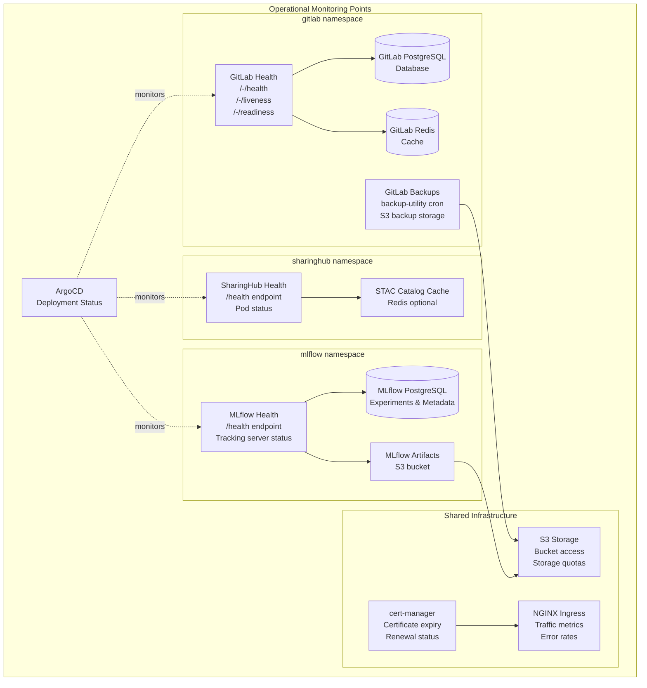
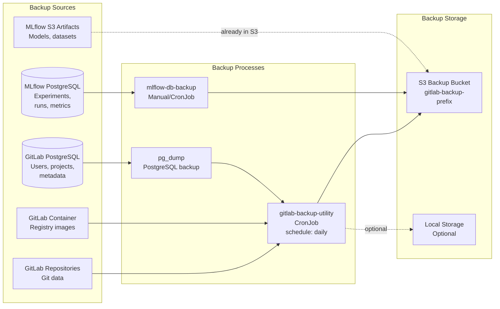
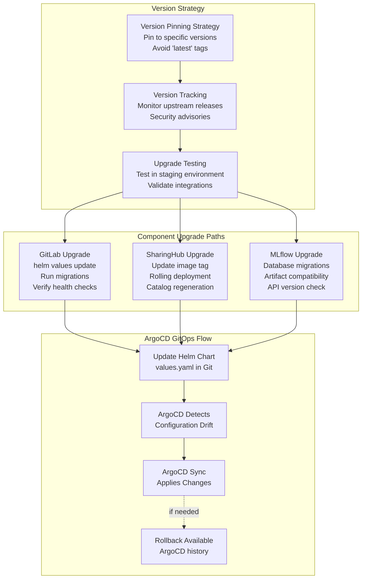
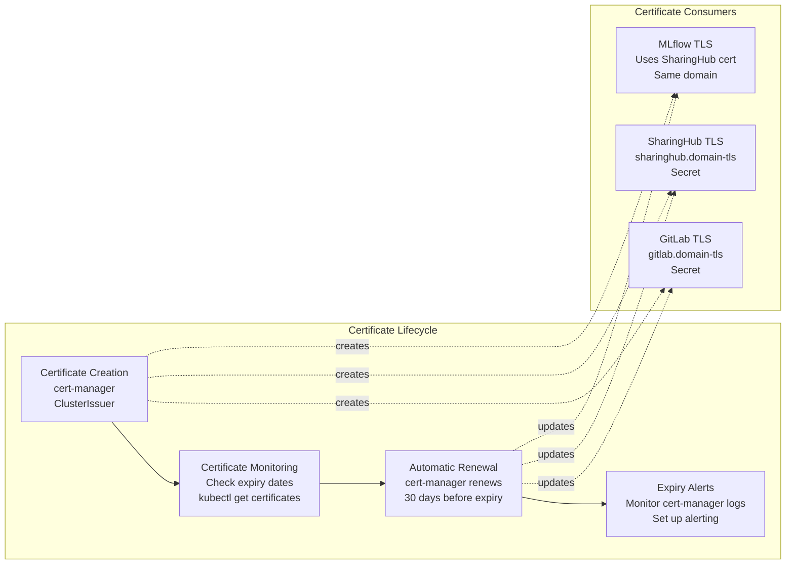
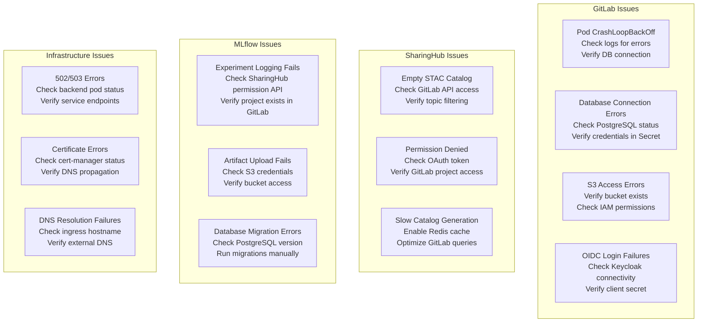

# Operations and Maintenance

<details>
<summary>Relevant source files</summary>

The following files were used as context for generating this wiki page:

- [docs/admin/maintenance.md](docs/admin/maintenance.md)

</details>


This document provides operational guidelines for managing, monitoring, and maintaining a production deployment of the EOEPCA MLOps Building Block. It covers routine operational tasks, system health monitoring, backup and recovery procedures, and troubleshooting guidance for the three core components (GitLab, SharingHub, MLflow SharingHub) and their supporting infrastructure.

For detailed maintenance guidelines including version pinning and component upgrade procedures, see [Maintenance Guidelines](#8.1). For initial deployment instructions, see [Deployment Guide](#5).

## Operational Architecture

The MLOps Building Block consists of multiple interconnected services deployed on Kubernetes, each requiring specific operational considerations.



**Monitoring and Health Check Architecture**: This diagram shows the key operational monitoring points across the platform. Each component exposes health endpoints for liveness and readiness checks. ArgoCD provides deployment-level monitoring, while individual components require service-specific health checks.

Sources: High-level architecture diagrams

## Component Health Monitoring

### GitLab Health Checks

GitLab provides multiple health check endpoints for operational monitoring:

| Endpoint | Purpose | Expected Response |
|----------|---------|-------------------|
| `/-/health` | Basic health check | HTTP 200 OK |
| `/-/liveness` | Kubernetes liveness probe | HTTP 200 if application is alive |
| `/-/readiness` | Kubernetes readiness probe | HTTP 200 if ready to serve traffic |
| `/-/metrics` | Prometheus metrics | Detailed metrics in Prometheus format |

Monitor GitLab pod status:
```bash
kubectl -n gitlab get pods
kubectl -n gitlab describe pod <pod-name>
kubectl -n gitlab logs <pod-name> -c <container-name>
```

Key containers to monitor:
- `webservice`: Main GitLab Rails application
- `sidekiq`: Background job processor
- `gitlab-shell`: Git SSH operations
- `kas`: Kubernetes Agent Server

### SharingHub Health Checks

SharingHub exposes health endpoints for operational monitoring. Monitor the application status:

```bash
kubectl -n sharinghub get pods
kubectl -n sharinghub logs <sharinghub-pod>
```

Key operational metrics:
- STAC catalog generation time from GitLab projects
- API response times for catalog queries
- GitLab API rate limiting status
- OAuth token refresh status

### MLflow SharingHub Health Checks

MLflow SharingHub provides health endpoints for tracking server status:

```bash
kubectl -n mlflow get pods
kubectl -n mlflow logs <mlflow-sharinghub-pod>
```

Monitor:
- Database connection pool status
- S3 artifact store connectivity
- SharingHub permission check latency
- Experiment logging throughput

Sources: High-level architecture diagrams, deployment architecture

## Backup and Disaster Recovery



**Backup and Recovery Architecture**: GitLab uses a scheduled backup utility that stores backups in S3. MLflow's PostgreSQL database requires separate backup procedures. Artifacts stored in S3 can be replicated using S3 bucket replication policies.

### GitLab Backup Configuration

GitLab backups are managed through the `backup-utility` component deployed as a CronJob:

```bash
# Check backup CronJob status
kubectl -n gitlab get cronjob backup-utility

# View recent backup jobs
kubectl -n gitlab get jobs --selector=app=backup-utility

# Manual backup trigger
kubectl -n gitlab create job --from=cronjob/backup-utility backup-manual-$(date +%Y%m%d-%H%M%S)
```

GitLab backups include:
- Database (PostgreSQL)
- Git repositories
- Wiki data
- CI/CD artifacts (if not using object storage)
- LFS objects (if not using object storage)
- Container Registry images (if not using object storage)

**Backup restoration** requires GitLab pods to be stopped and the backup file restored using the `gitlab-backup` utility.

### MLflow Database Backup

MLflow experiment metadata is stored in PostgreSQL and should be backed up regularly:

```bash
# Create MLflow database backup
kubectl -n mlflow exec -it <postgresql-pod> -- \
  pg_dump -U mlflow -d mlflow > mlflow-backup-$(date +%Y%m%d).sql

# Restore MLflow database
kubectl -n mlflow exec -i <postgresql-pod> -- \
  psql -U mlflow -d mlflow < mlflow-backup-20240101.sql
```

MLflow artifacts stored in S3 can be protected using:
- S3 versioning enabled on the artifacts bucket
- S3 cross-region replication for disaster recovery
- S3 lifecycle policies for long-term archival

### SharingHub State Management

SharingHub is stateless and does not require backups. Its STAC catalog is dynamically generated from GitLab projects. However, configuration should be preserved:

```bash
# Export SharingHub ConfigMap
kubectl -n sharinghub get configmap sharinghub-config -o yaml > sharinghub-config-backup.yaml

# Export SharingHub Secrets (encrypted)
kubectl -n sharinghub get secret sharinghub-oidc -o yaml > sharinghub-oidc-backup.yaml
```

Sources: High-level architecture diagrams, [docs/admin/maintenance.md:1-12]()

## Version Management and Upgrades



**Upgrade Workflow**: Version upgrades follow a GitOps pattern managed by ArgoCD. Configuration changes are committed to Git, detected by ArgoCD, and applied to the cluster. Rollbacks are available through ArgoCD's version history.

### Version Pinning Best Practices

The platform uses Helm charts with image tags that should be pinned to specific versions:

```yaml
# Example: GitLab version pinning
gitlab:
  image:
    tag: "16.10.0-ce.0"  # Specific version, not "latest"

# Example: SharingHub version pinning
sharinghub:
  image:
    repository: eoepca/sharinghub
    tag: "1.2.0"  # Specific version

# Example: MLflow version pinning
mlflow:
  image:
    repository: eoepca/mlflow-sharinghub
    tag: "2.10.0"  # Specific version
```

**Rationale**: Pinning versions provides:
- Predictable deployments
- Controlled upgrade timing
- Easier rollback procedures
- Reduced risk of breaking changes

However, stale versions create security vulnerabilities. Regular upgrade planning is essential.

### Component-Specific Upgrade Considerations

**GitLab Upgrades**:
- Follow GitLab's upgrade path (cannot skip major versions)
- Database migrations run automatically during upgrade
- Check for breaking changes in release notes
- Backup before upgrading
- Monitor for [deprecated features](https://docs.gitlab.com/ee/update/deprecations.html)

**SharingHub Upgrades**:
- Stateless application, upgrades are typically safe
- Verify STAC API compatibility if clients depend on specific versions
- Test GitLab API integration after upgrade
- Catalog regeneration may be needed after schema changes

**MLflow Upgrades**:
- Database schema migrations may be required
- Check MLflow client compatibility
- Verify artifact storage format compatibility
- Test model registry API if external systems integrate with it

Sources: [docs/admin/maintenance.md:1-12]()

## Certificate Management



**Certificate Management Lifecycle**: cert-manager automates TLS certificate provisioning and renewal using Let's Encrypt. Certificates are stored as Kubernetes Secrets and automatically renewed 30 days before expiration.

### Certificate Operations

**Check certificate status**:
```bash
# List all certificates
kubectl get certificates --all-namespaces

# Check specific certificate details
kubectl -n gitlab describe certificate gitlab-tls

# View certificate expiry
kubectl -n gitlab get secret gitlab-tls -o jsonpath='{.data.tls\.crt}' | \
  base64 -d | openssl x509 -noout -enddate
```

**Manual certificate renewal** (if automatic renewal fails):
```bash
# Delete certificate to trigger recreation
kubectl -n gitlab delete certificate gitlab-tls

# cert-manager will automatically recreate it
kubectl -n gitlab get certificate gitlab-tls -w
```

**Troubleshoot certificate issues**:
```bash
# Check cert-manager logs
kubectl -n cert-manager logs -l app=cert-manager

# Check certificate request status
kubectl -n gitlab get certificaterequest

# Check ACME challenge status
kubectl -n gitlab get challenge
```

Sources: High-level architecture diagrams, security and authentication architecture

## Troubleshooting Guide

### Common Issues and Resolutions



**Common Troubleshooting Scenarios**: This diagram categorizes typical issues by component and suggests diagnostic steps for resolution.

### GitLab Troubleshooting

**Pod restart loops**:
```bash
# Check pod status and events
kubectl -n gitlab get pods
kubectl -n gitlab describe pod gitlab-webservice-xxx

# View recent logs
kubectl -n gitlab logs gitlab-webservice-xxx --tail=100

# Common causes:
# - Database migration failures
# - Secret misconfiguration
# - Resource constraints (OOM)
# - Health check failures
```

**Database connection issues**:
```bash
# Verify PostgreSQL is running
kubectl -n gitlab get pods -l app=postgresql

# Test database connection
kubectl -n gitlab exec -it gitlab-webservice-xxx -- \
  gitlab-rake gitlab:db:configure:connection

# Check database credentials
kubectl -n gitlab get secret gitlab-postgresql-secret -o yaml
```

**S3 backup failures**:
```bash
# Check backup job logs
kubectl -n gitlab logs job/backup-utility-xxx

# Verify S3 configuration
kubectl -n gitlab get configmap gitlab-backup-config -o yaml

# Test S3 connectivity
kubectl -n gitlab exec -it gitlab-webservice-xxx -- \
  aws s3 ls s3://your-backup-bucket/ --region us-east-1
```

### SharingHub Troubleshooting

**STAC catalog not updating**:
```bash
# Check SharingHub logs for GitLab API errors
kubectl -n sharinghub logs -l app=sharinghub

# Verify GitLab API connectivity
kubectl -n sharinghub exec -it sharinghub-xxx -- \
  curl -H "Authorization: Bearer $TOKEN" https://gitlab.domain/api/v4/projects

# Check if projects have required topics
# SharingHub filters projects by topics like "sharinghub:aimodel"
```

**Performance issues with large catalogs**:
- Enable Redis caching for STAC catalog responses
- Implement pagination in STAC API queries
- Optimize GitLab API query filters
- Consider catalog pre-generation with scheduled jobs

### MLflow SharingHub Troubleshooting

**Permission check failures**:
```bash
# Check MLflow logs for SharingHub API errors
kubectl -n mlflow logs -l app=mlflow-sharinghub

# Verify SharingHub connectivity
kubectl -n mlflow exec -it mlflow-xxx -- \
  curl http://sharinghub.sharinghub:5000/health

# Check SharingHub configuration in MLflow
kubectl -n mlflow get configmap mlflow-config -o yaml
```

**Artifact storage failures**:
```bash
# Check S3 artifact store configuration
kubectl -n mlflow logs -l app=mlflow-sharinghub | grep -i s3

# Verify S3 credentials
kubectl -n mlflow get secret mlflow-s3-secret -o yaml

# Test S3 connectivity from MLflow pod
kubectl -n mlflow exec -it mlflow-xxx -- \
  aws s3 ls s3://mlflow-artifacts/ --region us-east-1
```

**Database migration issues**:
```bash
# Check current database schema version
kubectl -n mlflow exec -it mlflow-postgresql-xxx -- \
  psql -U mlflow -d mlflow -c "SELECT * FROM alembic_version;"

# Run migrations manually if needed
kubectl -n mlflow exec -it mlflow-xxx -- \
  mlflow db upgrade <database-uri>
```

Sources: High-level architecture diagrams, deployment architecture

## Resource Management

### Resource Limits and Requests

Each component should have appropriate resource limits configured to prevent resource exhaustion:

| Component | Typical CPU Request | Typical Memory Request | Typical CPU Limit | Typical Memory Limit |
|-----------|---------------------|------------------------|-------------------|----------------------|
| GitLab webservice | 200m | 2Gi | 1000m | 4Gi |
| GitLab sidekiq | 100m | 1Gi | 500m | 2Gi |
| GitLab PostgreSQL | 200m | 512Mi | 1000m | 2Gi |
| SharingHub | 100m | 256Mi | 500m | 1Gi |
| MLflow SharingHub | 100m | 512Mi | 500m | 2Gi |
| MLflow PostgreSQL | 100m | 256Mi | 500m | 1Gi |

**Monitoring resource usage**:
```bash
# Check pod resource usage
kubectl top pods -n gitlab
kubectl top pods -n sharinghub
kubectl top pods -n mlflow

# View resource requests/limits
kubectl -n gitlab describe pod gitlab-webservice-xxx | grep -A 10 "Limits:"

# Check node resource allocation
kubectl top nodes
```

### Storage Management

**GitLab storage monitoring**:
```bash
# Check PVC usage
kubectl -n gitlab get pvc

# View detailed storage usage
kubectl -n gitlab exec -it gitlab-webservice-xxx -- df -h

# GitLab repositories disk usage
kubectl -n gitlab exec -it gitlab-webservice-xxx -- \
  du -sh /var/opt/gitlab/git-data/repositories
```

**S3 storage monitoring**:
- Monitor bucket sizes through cloud provider console
- Set up billing alerts for storage costs
- Implement lifecycle policies for artifact retention
- Archive or delete old experiment artifacts

**Database storage growth**:
```bash
# Check PostgreSQL database sizes
kubectl -n gitlab exec -it gitlab-postgresql-xxx -- \
  psql -U postgres -c "SELECT pg_database.datname, pg_size_pretty(pg_database_size(pg_database.datname)) FROM pg_database;"

# Check table sizes in MLflow database
kubectl -n mlflow exec -it mlflow-postgresql-xxx -- \
  psql -U mlflow -d mlflow -c "SELECT schemaname, tablename, pg_size_pretty(pg_total_relation_size(schemaname||'.'||tablename)) FROM pg_tables ORDER BY pg_total_relation_size(schemaname||'.'||tablename) DESC LIMIT 10;"
```

Sources: Deployment architecture, high-level architecture diagrams

## Log Management

### Centralized Logging

**Access component logs**:
```bash
# GitLab logs
kubectl -n gitlab logs -l app=webservice --tail=100
kubectl -n gitlab logs -l app=sidekiq --tail=100

# SharingHub logs
kubectl -n sharinghub logs -l app=sharinghub --tail=100

# MLflow logs
kubectl -n mlflow logs -l app=mlflow-sharinghub --tail=100

# Stream logs in real-time
kubectl -n gitlab logs -f gitlab-webservice-xxx
```

**Log aggregation recommendations**:
- Deploy Elasticsearch, Fluentd, Kibana (EFK) stack for centralized logging
- Use Loki with Grafana for lightweight log aggregation
- Configure log retention policies to manage storage
- Set up log-based alerts for critical errors

### Important Log Patterns to Monitor

**GitLab critical errors**:
- Database connection failures: `PG::ConnectionBad`
- Redis connection issues: `Redis::CannotConnectError`
- OIDC authentication failures: `OAuth::Unauthorized`
- Backup failures in backup-utility logs

**SharingHub critical errors**:
- GitLab API authentication failures: `401 Unauthorized`
- STAC catalog generation errors
- OAuth token expiration warnings

**MLflow critical errors**:
- SharingHub permission check failures
- S3 artifact upload failures: `botocore.exceptions`
- Database connection issues: `sqlalchemy.exc.OperationalError`
- Experiment logging failures

Sources: High-level architecture diagrams, component integration and data flow

## Security Operations

### Secret Rotation

Kubernetes Secrets should be rotated periodically for security:

```bash
# List all secrets by namespace
kubectl -n gitlab get secrets
kubectl -n sharinghub get secrets
kubectl -n mlflow get secrets

# Rotate OIDC client secrets (requires Keycloak admin access)
# 1. Generate new client secret in Keycloak
# 2. Update Kubernetes Secret
kubectl -n gitlab edit secret gitlab-oidc

# 3. Restart affected pods
kubectl -n gitlab rollout restart deployment gitlab-webservice
```

**Critical secrets to manage**:
- `gitlab-oidc`: GitLab OIDC client credentials
- `sharinghub-oidc`: SharingHub OAuth credentials
- `mlflow-sharinghub`: MLflow secret key
- Database passwords (PostgreSQL secrets)
- S3 access credentials

### Security Scanning

**Container image vulnerability scanning**:
- Scan images before deployment using tools like Trivy or Clair
- Monitor for CVEs in base images
- Subscribe to security advisories for GitLab, MLflow, and other components

**Network policy enforcement**:
```bash
# View existing network policies
kubectl -n gitlab get networkpolicies
kubectl -n sharinghub get networkpolicies
kubectl -n mlflow get networkpolicies

# Verify pod-to-pod communication rules
# Ensure only necessary services can communicate
```

### Access Control Auditing

**GitLab audit events**:
- Monitor admin access through GitLab UI: Admin Area > Monitoring > Audit Events
- Review user login patterns
- Check for unauthorized project access attempts

**Kubernetes RBAC auditing**:
```bash
# Review service account permissions
kubectl -n gitlab get serviceaccounts
kubectl -n gitlab describe serviceaccount gitlab-webservice

# Check role bindings
kubectl -n gitlab get rolebindings
kubectl get clusterrolebindings | grep gitlab
```

Sources: Security and authentication architecture, [docs/admin/maintenance.md:1-12]()

## Disaster Recovery Procedures

### Recovery Time Objectives (RTO) and Recovery Point Objectives (RPO)

| Component | Typical RPO | Typical RTO | Recovery Complexity |
|-----------|-------------|-------------|---------------------|
| GitLab | Last backup (daily) | 2-4 hours | High (requires backup restore) |
| GitLab PostgreSQL | Last backup (daily) | 1-2 hours | Medium |
| SharingHub | N/A (stateless) | 15 minutes | Low (redeploy pod) |
| MLflow PostgreSQL | Last backup (daily) | 1 hour | Medium |
| MLflow S3 Artifacts | Continuous (S3 versioning) | Immediate | Low (S3 native recovery) |

### GitLab Disaster Recovery

**Full GitLab restoration from backup**:
```bash
# 1. Stop GitLab pods
kubectl -n gitlab scale deployment gitlab-webservice --replicas=0
kubectl -n gitlab scale deployment gitlab-sidekiq --replicas=0

# 2. Download backup from S3
aws s3 cp s3://gitlab-backup-bucket/gitlab-backup-20240101.tar.gz .

# 3. Copy backup to GitLab pod volume
kubectl -n gitlab cp gitlab-backup-20240101.tar.gz gitlab-toolbox-pod:/var/opt/gitlab/backups/

# 4. Run restore command
kubectl -n gitlab exec -it gitlab-toolbox-pod -- \
  gitlab-backup restore BACKUP=20240101 force=yes

# 5. Reconfigure and restart
kubectl -n gitlab exec -it gitlab-toolbox-pod -- gitlab-ctl reconfigure
kubectl -n gitlab scale deployment gitlab-webservice --replicas=2
kubectl -n gitlab scale deployment gitlab-sidekiq --replicas=1

# 6. Verify restoration
kubectl -n gitlab exec -it gitlab-webservice-xxx -- \
  gitlab-rake gitlab:check
```

### Database Point-in-Time Recovery

**PostgreSQL PITR** (if continuous archiving is enabled):
```bash
# 1. Stop affected service
kubectl -n mlflow scale deployment mlflow-sharinghub --replicas=0

# 2. Restore PostgreSQL from backup with PITR
kubectl -n mlflow exec -it mlflow-postgresql-xxx -- \
  pg_restore --recovery-target-time="2024-01-01 12:00:00" ...

# 3. Restart service
kubectl -n mlflow scale deployment mlflow-sharinghub --replicas=1
```

### S3 Artifact Recovery

If S3 versioning is enabled:
```bash
# List object versions
aws s3api list-object-versions --bucket mlflow-artifacts --prefix <model-path>

# Restore previous version
aws s3api get-object \
  --bucket mlflow-artifacts \
  --key <model-path>/model.onnx \
  --version-id <version-id> \
  model.onnx.restored
```

Sources: Backup and disaster recovery considerations from deployment architecture, [docs/admin/maintenance.md:1-12]()

## Maintenance Windows and Downtime Management

### Planned Maintenance Procedures

For maintenance operations requiring downtime:

1. **Schedule maintenance window**: Communicate with users in advance
2. **Enable maintenance mode** (if supported):
   ```bash
   # GitLab maintenance mode
   kubectl -n gitlab exec -it gitlab-webservice-xxx -- \
     gitlab-ctl deploy-page up
   ```
3. **Create pre-maintenance backup**
4. **Perform maintenance operations**
5. **Verify system health** after maintenance
6. **Disable maintenance mode**:
   ```bash
   kubectl -n gitlab exec -it gitlab-webservice-xxx -- \
     gitlab-ctl deploy-page down
   ```

### Zero-Downtime Updates

For updates not requiring downtime:

**Rolling updates** (default Kubernetes behavior):
```bash
# Update image tag in ArgoCD Git repository
# ArgoCD will perform rolling update automatically

# Monitor rollout progress
kubectl -n sharinghub rollout status deployment sharinghub

# Verify no disruption
kubectl -n sharinghub get pods -w
```

**Blue-green deployments** (for critical updates):
- Deploy new version alongside existing version
- Validate new version functionality
- Switch traffic using service selector
- Monitor for issues before removing old version

Sources: [docs/admin/maintenance.md:1-12](), deployment architecture

## Performance Tuning

### GitLab Performance Optimization

**Database query optimization**:
- Monitor slow queries in PostgreSQL logs
- Enable PostgreSQL query statistics
- Consider read replicas for heavy read workloads

**Sidekiq job processing**:
```bash
# View Sidekiq queue status
kubectl -n gitlab exec -it gitlab-webservice-xxx -- \
  gitlab-rake gitlab:sidekiq:all_queues_size

# Check for stuck jobs
kubectl -n gitlab exec -it gitlab-webservice-xxx -- \
  gitlab-rake gitlab:sidekiq:stuck_jobs
```

**Redis optimization**:
- Monitor Redis memory usage
- Enable Redis persistence for job queue reliability
- Consider Redis Cluster for horizontal scaling

### SharingHub Performance Optimization

**STAC catalog caching**:
- Enable Redis cache for catalog responses
- Configure appropriate cache TTL based on project update frequency
- Implement cache invalidation on GitLab webhook events

**GitLab API rate limiting**:
- Monitor GitLab API rate limit headers in SharingHub logs
- Implement request batching for multiple project queries
- Use GraphQL API instead of REST where possible for efficiency

### MLflow Performance Optimization

**Database connection pooling**:
- Configure appropriate connection pool size based on concurrent tracking clients
- Monitor connection pool utilization
- Adjust pool timeout settings for long-running operations

**S3 artifact upload optimization**:
- Enable multipart uploads for large artifacts
- Configure appropriate part size for network conditions
- Use S3 Transfer Acceleration for geographically distributed users

Sources: Component integration and data flow, high-level architecture diagrams

## Compliance and Auditing

### Audit Logging

**Enable comprehensive audit logging**:

GitLab audit events track:
- User authentication and authorization events
- Project access changes
- Repository operations (push, merge)
- Admin configuration changes

SharingHub audit considerations:
- Log STAC API access patterns
- Track model and dataset download events
- Monitor OAuth token usage

MLflow audit logging:
- Experiment creation and modification events
- Model registration and stage transitions
- Artifact access patterns

### Data Retention Policies

**Configure retention policies** for:

- **GitLab logs**: Rotate logs older than 30 days
- **MLflow experiments**: Archive inactive experiments older than 90 days
- **S3 artifacts**: Apply lifecycle policies to transition old artifacts to glacier storage
- **Database backups**: Retain daily backups for 30 days, weekly backups for 90 days
- **Audit logs**: Retain audit logs for compliance period (often 1-7 years depending on requirements)

### Compliance Reporting

Generate compliance reports:
```bash
# GitLab user activity report
kubectl -n gitlab exec -it gitlab-webservice-xxx -- \
  gitlab-rake gitlab:audit:list_users

# Export audit events for compliance review
# Use GitLab API to fetch audit events programmatically
```

Sources: Security and authentication architecture, user interaction patterns

## Related Documentation

For additional operational information:

- **Initial deployment**: See [Deployment Guide](#5) for setting up the platform
- **Detailed maintenance procedures**: See [Maintenance Guidelines](#8.1) for version pinning and upgrade procedures
- **Configuration changes**: See [Configuration Reference](#6) for detailed configuration options
- **API operations**: See [API Reference](#7) for programmatic access and automation

---

**Summary**: This Operations and Maintenance guide covers routine operational tasks, monitoring, backup and recovery, troubleshooting, and security operations for the EOEPCA MLOps Building Block. Regular maintenance, proactive monitoring, and adherence to best practices ensure a stable, secure, and performant platform for ML model development and deployment.

Sources: [docs/admin/maintenance.md:1-12](), high-level architecture diagrams, deployment architecture, security and authentication architecture