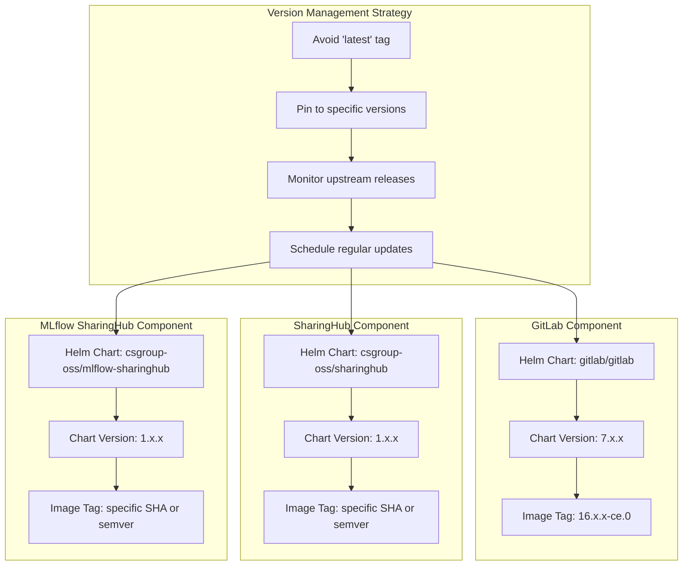
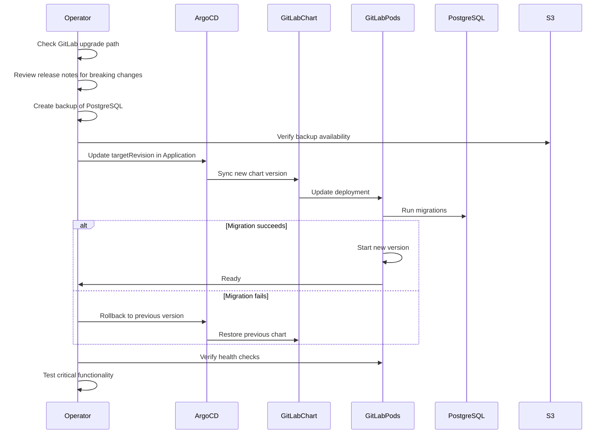
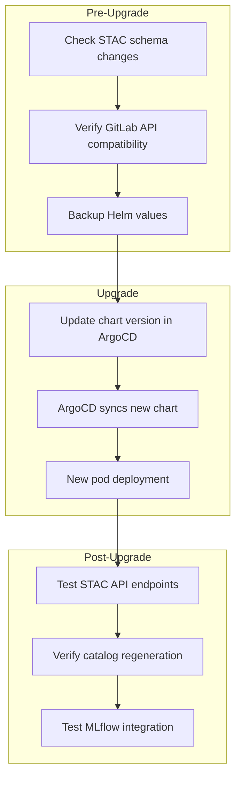
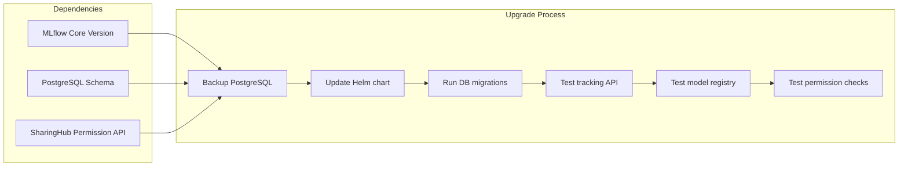
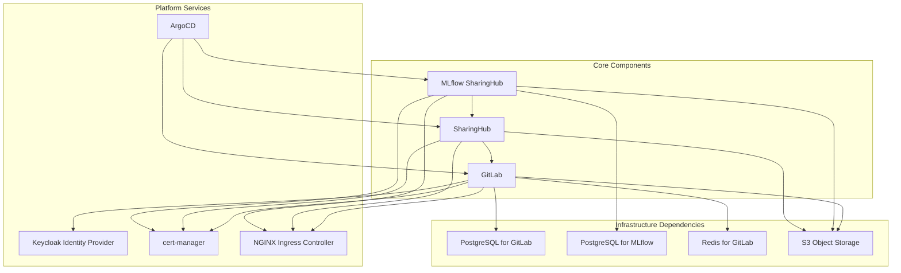
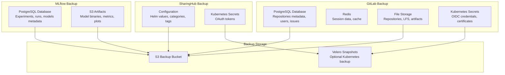
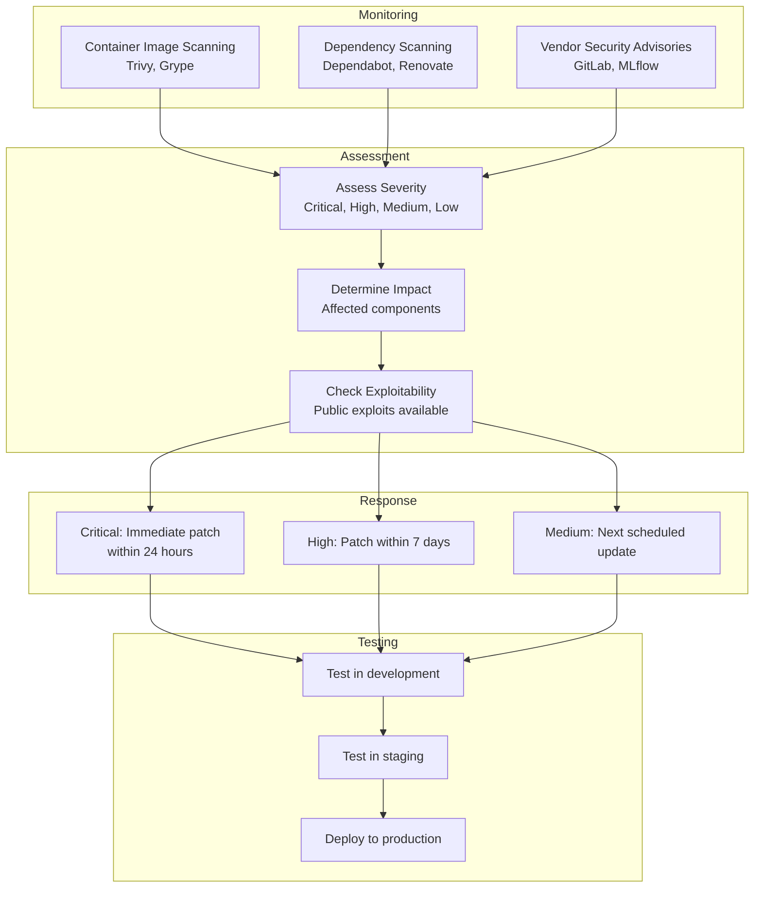
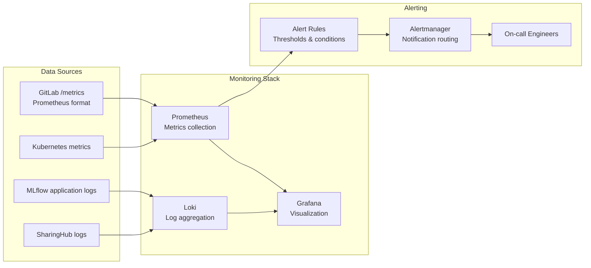
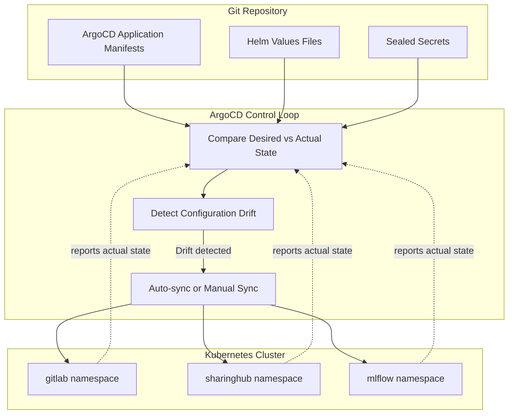
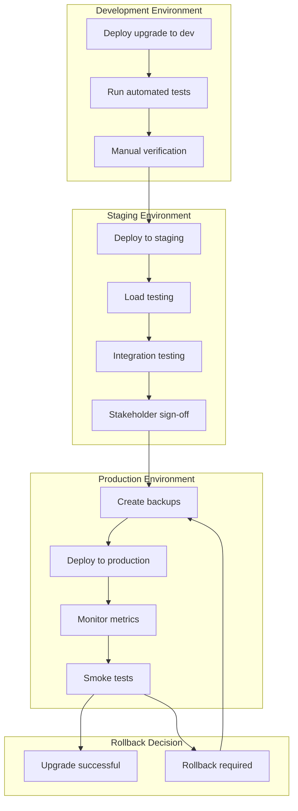

# Maintenance Guidelines

<details>
<summary>Relevant source files</summary>

The following files were used as context for generating this wiki page:

- [docs/admin/maintenance.md](docs/admin/maintenance.md)

</details>


## Purpose and Scope

This document provides best practices and procedures for maintaining the MLOps Building Block in production environments. It covers version management strategies, component upgrade procedures, dependency management, backup strategies, and security patching workflows to ensure system stability and security.

For deployment instructions, see [Deployment Guide](#5). For troubleshooting procedures, consult the Operations and Maintenance section [#8](#8). For configuration options during upgrades, see [Configuration Reference](#6).

**Sources:** [docs/admin/maintenance.md:1-12]()

---

## Version Management Strategy

### Version Pinning Philosophy

The MLOps Building Block consists of three main components that evolve independently: GitLab, SharingHub, and MLflow SharingHub. Each component should have its version explicitly pinned to ensure predictable behavior and controlled upgrades.



**Version Pinning Best Practices:**

| Practice | Rationale | Implementation |
|----------|-----------|----------------|
| **Avoid `latest` tags** | Unpredictable behavior, unreproducible deployments | Specify exact chart versions and image tags in ArgoCD Applications |
| **Pin Helm chart versions** | Control when breaking changes are introduced | Use `targetRevision: x.y.z` in ArgoCD Application specs |
| **Pin container image tags** | Ensure consistent image behavior across pods | Use `image.tag: x.y.z` in Helm values files |
| **Document version matrix** | Track compatible versions across components | Maintain a compatibility matrix in deployment documentation |
| **Regular updates (not stale)** | Security patches, dependency freshness | Schedule quarterly upgrade reviews |

**Sources:** [docs/admin/maintenance.md:3-11]()

---

## Component Upgrade Procedures

### GitLab Upgrades

GitLab follows a strict upgrade path and may require sequential upgrades rather than skipping versions. Always consult the official GitLab upgrade path documentation before upgrading.



**GitLab Upgrade Checklist:**

1. **Pre-upgrade:**
   - Review GitLab upgrade path: https://docs.gitlab.com/ee/update/index.html
   - Check for required intermediate versions
   - Review breaking changes in release notes
   - Backup PostgreSQL database (gitlab namespace)
   - Verify S3 backup retention policy
   - Document current versions of all sub-components

2. **Upgrade execution:**
   - Update `targetRevision` in ArgoCD Application for gitlab namespace
   - Monitor ArgoCD sync status
   - Watch pod rollout: `kubectl get pods -n gitlab -w`
   - Check migration logs: `kubectl logs -n gitlab -l app=migrations`

3. **Post-upgrade:**
   - Verify GitLab web UI accessibility
   - Test OAuth/OIDC authentication flow with Keycloak
   - Verify GitLab Runner functionality if configured
   - Test Git operations (clone, push, pull)
   - Confirm webhook delivery to SharingHub
   - Check sidekiq job processing: `kubectl logs -n gitlab -l app=sidekiq`

**Sources:** [docs/admin/maintenance.md:3-11]()

---

### SharingHub Upgrades

SharingHub upgrades are generally straightforward but require attention to STAC catalog schema changes and GitLab API compatibility.



**SharingHub Upgrade Checklist:**

1. **Pre-upgrade:**
   - Review SharingHub release notes for API changes
   - Check STAC extensions compatibility (ml-model, eo)
   - Backup current Helm values: `helm get values -n sharinghub sharinghub > sharinghub-values-backup.yaml`
   - Verify GitLab webhook configuration remains compatible

2. **Upgrade execution:**
   - Update chart version in ArgoCD Application for sharinghub namespace
   - Monitor pod startup: `kubectl logs -n sharinghub -l app=sharinghub -f`
   - Wait for catalog regeneration to complete

3. **Post-upgrade:**
   - Test STAC API root: `curl https://sharinghub.domain/api/catalog/`
   - Verify collections are populated: `curl https://sharinghub.domain/api/catalog/collections`
   - Test item retrieval for each category (aimodel, dataset, processor)
   - Verify OAuth flow with GitLab
   - Confirm S3 asset links are accessible
   - Test MLflow permission check integration

**Sources:** [docs/admin/maintenance.md:3-11]()

---

### MLflow SharingHub Upgrades

MLflow SharingHub upgrades require coordination between MLflow core version, PostgreSQL schema, and SharingHub API integration.



**MLflow SharingHub Upgrade Checklist:**

1. **Pre-upgrade:**
   - Check MLflow core version compatibility with MLflow SharingHub fork
   - Backup PostgreSQL database (mlflow namespace)
   - Review MLflow database migration scripts
   - Test SharingHub permission API availability
   - Document registered models for post-upgrade verification

2. **Upgrade execution:**
   - Update chart version in ArgoCD Application for mlflow namespace
   - Monitor database migration: `kubectl logs -n mlflow -l app=mlflow-sharinghub`
   - Wait for pod to reach Ready state
   - Verify artifacts storage connectivity to S3

3. **Post-upgrade:**
   - Test MLflow Tracking API: `mlflow runs list --experiment-id 0`
   - Verify model registry access: `mlflow models list`
   - Test experiment logging with client
   - Confirm permission check integration with SharingHub
   - Verify STAC auto-linking for newly registered models
   - Test artifact download from S3 backend

**Sources:** [docs/admin/maintenance.md:3-11]()

---

## Dependency Management

### External Service Dependencies

The MLOps Building Block relies on several external services that must be maintained independently:



**Dependency Update Strategy:**

| Dependency | Update Frequency | Update Strategy | Compatibility Check |
|------------|-----------------|-----------------|---------------------|
| **PostgreSQL** | Quarterly | In-place upgrade with backup | Test with representative data |
| **Redis** | Semi-annually | Rolling update | Monitor GitLab sidekiq jobs |
| **S3 Provider** | As needed | Provider-managed | Verify API compatibility |
| **Keycloak** | Quarterly | Following EOEPCA guidelines | Test OIDC flows |
| **cert-manager** | Monthly | Helm upgrade | Verify certificate renewal |
| **NGINX Ingress** | Quarterly | Helm upgrade | Test routing rules |
| **ArgoCD** | Quarterly | Helm upgrade | Verify GitOps sync |

**Sources:** [docs/admin/maintenance.md:3-11]()

---

## Backup and Recovery

### Backup Strategy

A comprehensive backup strategy ensures data resilience across all components:



**Backup Procedures by Component:**

### GitLab Backup

GitLab requires comprehensive backup of multiple data stores:

| Data Store | Backup Method | Frequency | Retention |
|------------|---------------|-----------|-----------|
| PostgreSQL | `pg_dump` or GitLab backup utility | Daily | 30 days |
| Git repositories | Included in GitLab backup task | Daily | 30 days |
| LFS objects | S3 native backup or GitLab task | Daily | 30 days |
| Container registry | Registry storage backup | Weekly | 14 days |
| CI/CD artifacts | S3 native backup | Weekly | 14 days |
| Secrets | Sealed Secrets or Velero | Before upgrades | Indefinite |

**GitLab Backup Command:**
```bash
# Trigger GitLab backup task
kubectl exec -n gitlab deployment/gitlab-toolbox -- backup-utility --skip registry

# Verify backup in S3
aws s3 ls s3://gitlab-backups-bucket/
```

### MLflow PostgreSQL Backup

```bash
# Create PostgreSQL backup
kubectl exec -n mlflow postgresql-0 -- pg_dump -U mlflow mlflow > mlflow-backup-$(date +%Y%m%d).sql

# Upload to S3
aws s3 cp mlflow-backup-$(date +%Y%m%d).sql s3://mlflow-backups-bucket/
```

### Configuration Backup

```bash
# Export Helm values for all components
helm get values -n gitlab gitlab > gitlab-values-backup.yaml
helm get values -n sharinghub sharinghub > sharinghub-values-backup.yaml
helm get values -n mlflow mlflow-sharinghub > mlflow-values-backup.yaml

# Backup Kubernetes secrets
kubectl get secret -n gitlab gitlab-oidc -o yaml > gitlab-oidc-secret-backup.yaml
kubectl get secret -n sharinghub sharinghub-oidc -o yaml > sharinghub-oidc-secret-backup.yaml
```

**Sources:** [docs/admin/maintenance.md:3-11]()

---

## Security Patching

### CVE Monitoring and Response

Security vulnerabilities must be addressed promptly to maintain system integrity:



**Security Update Response Times:**

| Severity | Response Time | Update Strategy | Testing Required |
|----------|---------------|-----------------|------------------|
| **Critical** | 24 hours | Emergency patch, may skip staging | Minimal smoke tests |
| **High** | 7 days | Scheduled patch with full testing | Full regression suite |
| **Medium** | 30 days | Include in next planned update | Standard testing |
| **Low** | 90 days | Include in quarterly maintenance | Standard testing |

**Security Patching Workflow:**

1. **Identify vulnerabilities:**
   - Scan container images: `trivy image <image-name>:<tag>`
   - Review vendor security advisories
   - Monitor GitLab security releases: https://about.gitlab.com/releases/categories/releases/
   - Check MLflow security announcements

2. **Assess and prioritize:**
   - Determine if vulnerability affects running components
   - Check if exploit code is publicly available
   - Evaluate potential business impact
   - Assign severity level

3. **Apply patches:**
   - For container images: Update to patched version
   - For dependencies: Update Helm chart versions
   - For GitLab: Follow emergency update procedure if critical
   - For SharingHub/MLflow: Coordinate with upstream maintainers

4. **Verify patches:**
   - Re-scan images after update
   - Verify vulnerability no longer present
   - Test affected functionality
   - Document remediation

**Sources:** [docs/admin/maintenance.md:8-11]()

---

## Health Monitoring

### Component Health Checks

Implement continuous health monitoring to detect issues early:

| Component | Health Check | Endpoint/Command | Expected Result |
|-----------|--------------|------------------|-----------------|
| **GitLab** | HTTP readiness probe | `GET https://gitlab.domain/-/health` | 200 OK |
| **GitLab** | PostgreSQL connectivity | `kubectl exec -n gitlab gitlab-postgresql-0 -- pg_isready` | accepting connections |
| **SharingHub** | STAC API availability | `GET https://sharinghub.domain/api/catalog/` | Valid STAC catalog JSON |
| **MLflow** | Tracking API | `GET https://sharinghub.domain/mlflow/api/2.0/mlflow/experiments/list` | Valid experiments list |
| **MLflow** | PostgreSQL connectivity | `kubectl exec -n mlflow postgresql-0 -- pg_isready` | accepting connections |
| **cert-manager** | Certificate status | `kubectl get certificates -A` | Ready=True |
| **Ingress** | Ingress controller | `kubectl get pods -n ingress-nginx` | Running |

**Monitoring Stack Integration:**



**Key Metrics to Monitor:**

- **GitLab:**
  - Request rate and latency
  - Git operation duration
  - Sidekiq queue depth
  - PostgreSQL connection pool utilization
  - Redis memory usage

- **SharingHub:**
  - STAC API request rate
  - Catalog regeneration time
  - GitLab API call rate and errors
  - OAuth token refresh success rate

- **MLflow SharingHub:**
  - Experiment logging rate
  - Model registry operations
  - Artifact upload/download throughput
  - PostgreSQL query performance
  - S3 API latency

**Sources:** [docs/admin/maintenance.md:3-11]()

---

## Configuration Management

### GitOps with ArgoCD

ArgoCD maintains desired state and prevents configuration drift:



**Configuration Drift Prevention:**

1. **Enable ArgoCD auto-sync:**
   - Configure Applications with `syncPolicy.automated.prune: true`
   - Set `syncPolicy.automated.selfHeal: true` for automatic drift correction
   - Use `syncPolicy.retry` for transient failures

2. **Restrict manual changes:**
   - Enforce that all changes go through Git
   - Monitor for out-of-band kubectl modifications
   - Alert on manual changes to managed resources

3. **Secret rotation:**
   - Use Sealed Secrets or External Secrets Operator
   - Rotate OAuth client secrets quarterly
   - Update database passwords annually
   - Refresh TLS certificates automatically via cert-manager

4. **Version control:**
   - Tag releases in Git repository
   - Maintain separate branches for environments (dev, staging, prod)
   - Require pull request reviews for production changes

**ArgoCD Application Structure:**

```
argocd-apps/
├── gitlab-application.yaml          # ArgoCD Application for GitLab
├── sharinghub-application.yaml      # ArgoCD Application for SharingHub
├── mlflow-application.yaml          # ArgoCD Application for MLflow
└── values/
    ├── gitlab-values.yaml           # GitLab Helm values
    ├── sharinghub-values.yaml       # SharingHub Helm values
    └── mlflow-values.yaml           # MLflow Helm values
```

**Example ArgoCD Application with version pinning:**

```yaml
apiVersion: argoproj.io/v1alpha1
kind: Application
metadata:
  name: sharinghub
  namespace: argocd
spec:
  project: mlops
  source:
    repoURL: https://csgroup-oss.github.io/helm-charts
    chart: sharinghub
    targetRevision: 1.2.3  # Pinned version
    helm:
      valueFiles:
        - values/sharinghub-values.yaml
  destination:
    server: https://kubernetes.default.svc
    namespace: sharinghub
  syncPolicy:
    automated:
      prune: true
      selfHeal: true
    syncOptions:
      - CreateNamespace=true
```

**Sources:** [docs/admin/maintenance.md:3-11]()

---

## Upgrade Testing Procedure

Before applying upgrades to production, follow this comprehensive testing workflow:



**Testing Checklist:**

### Development Environment Tests

- [ ] GitLab web UI accessible
- [ ] User authentication via Keycloak OIDC
- [ ] Git operations (clone, push, pull)
- [ ] Project creation and topic management
- [ ] SharingHub STAC catalog generation
- [ ] MLflow experiment tracking
- [ ] Model registration and STAC linking
- [ ] S3 artifact storage and retrieval

### Staging Environment Tests

- [ ] Load testing with realistic data volumes
- [ ] Concurrent user simulation
- [ ] End-to-end workflow testing (project → train → register → discover)
- [ ] API performance benchmarks
- [ ] Database migration validation
- [ ] Backup and restore procedure
- [ ] Security scan (vulnerability assessment)

### Production Deployment

- [ ] Maintenance window scheduled and communicated
- [ ] All backups completed and verified
- [ ] Rollback procedure documented and ready
- [ ] Monitoring dashboards prepared
- [ ] On-call engineers available
- [ ] Execute deployment during off-peak hours

### Post-Deployment Verification

- [ ] All pods running and ready
- [ ] Health check endpoints responding
- [ ] Critical user journeys functional
- [ ] No increase in error rates
- [ ] Response times within acceptable range
- [ ] No alerts triggered

**Sources:** [docs/admin/maintenance.md:3-11]()

---

## Summary

Maintaining the MLOps Building Block requires a disciplined approach to version management, regular upgrades, comprehensive backups, and security vigilance. Key takeaways:

1. **Always pin versions** - Avoid `latest` tags but keep components reasonably up-to-date
2. **Plan upgrades carefully** - Test in non-production environments first
3. **Maintain comprehensive backups** - Especially PostgreSQL databases and configuration
4. **Prioritize security patches** - Respond to critical vulnerabilities within 24 hours
5. **Monitor continuously** - Use health checks and metrics to detect issues early
6. **Use GitOps** - Let ArgoCD prevent configuration drift and maintain desired state

Regular maintenance ensures the MLOps platform remains secure, stable, and capable of supporting your organization's machine learning workflows.

**Sources:** [docs/admin/maintenance.md:1-12]()