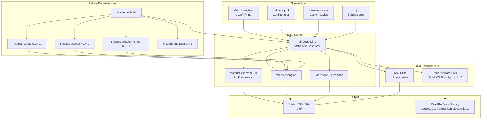
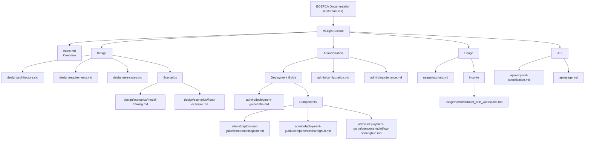
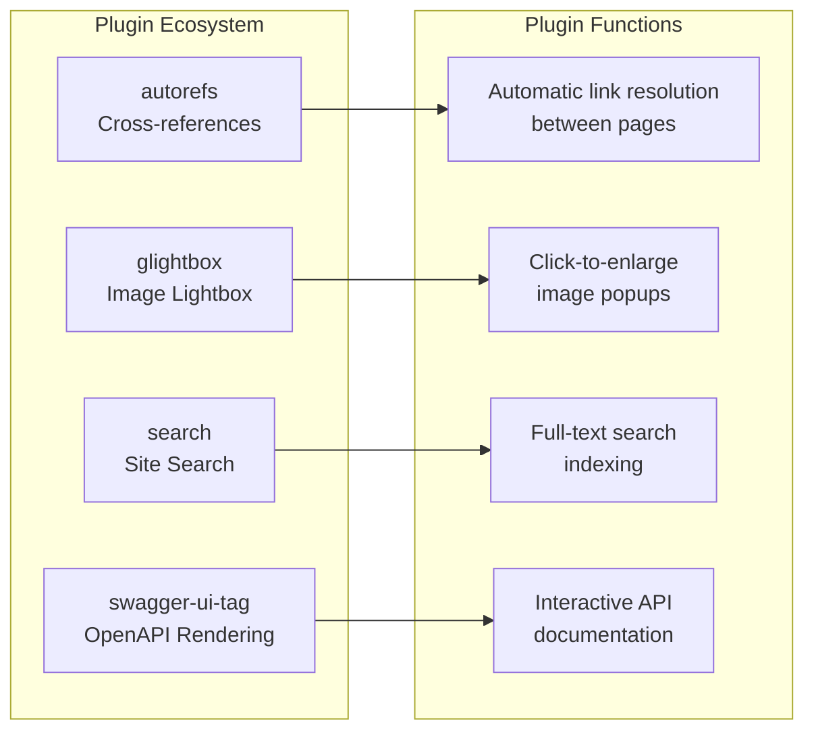
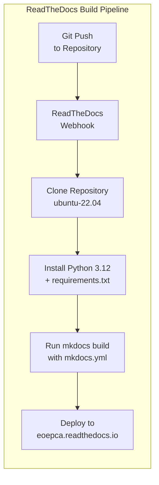

# Documentation System

<details>
<summary>Relevant source files</summary>

The following files were used as context for generating this wiki page:

- [.gitignore](.gitignore)
- [.readthedocs.yaml](.readthedocs.yaml)
- [docs/design/scenarios/flood-example.md](docs/design/scenarios/flood-example.md)
- [docs/design/scenarios/model-training.md](docs/design/scenarios/model-training.md)
- [mkdocs.yml](mkdocs.yml)
- [requirements.txt](requirements.txt)

</details>


## Purpose and Scope

This page describes the documentation build system used for the EOEPCA MLOps Building Block. It covers the MkDocs-based documentation infrastructure, configuration, theme customization, plugin ecosystem, and deployment to ReadTheDocs. 

For information about the actual MLOps platform architecture and components, see [Architecture](#2). For deployment procedures, see [Deployment Guide](#5).

---

## Documentation Build Architecture

The documentation system uses **MkDocs** with the **Material for MkDocs** theme to generate static HTML documentation from Markdown source files. The documentation is hosted on **ReadTheDocs** and automatically built on each commit to the repository.



**Diagram: Documentation Build Pipeline**

The build process transforms Markdown source files into a fully-featured static website with navigation, search, syntax highlighting, and API documentation rendering.

**Sources:** [mkdocs.yml:1-125](), [requirements.txt:1-7](), [.readthedocs.yaml:1-20]()

---

## MkDocs Configuration

The documentation system is configured through the `mkdocs.yml` file, which defines site metadata, navigation structure, theme settings, plugins, and Markdown extensions.

### Site Metadata

The site metadata defines the documentation identity and repository links:

| Configuration Key | Value | Purpose |
|------------------|-------|---------|
| `site_name` | EOEPCA MLOps Building Block | Documentation site title |
| `site_url` | https://eoepca.readthedocs.io/projects/mlops/en/latest/ | Canonical URL |
| `repo_url` | https://github.com/EOEPCA/document-mlops/ | Source repository link |
| `edit_uri` | edit/main/docs/ | Path for "Edit this page" links |

**Sources:** [mkdocs.yml:1-4]()

### Navigation Structure

The navigation hierarchy is defined in the `nav` section, organizing content into logical sections:



**Diagram: Documentation Navigation Hierarchy**

The navigation structure defines four main sections: **Design** (architecture and use cases), **Administration** (deployment and configuration), **Usage** (tutorials and how-to guides), and **API** (reference documentation).

**Sources:** [mkdocs.yml:6-32]()

---

## Material Theme Configuration

The documentation uses the **Material for MkDocs** theme with extensive feature customization.

### Theme Settings

```yaml
theme:
  name: material
  logo: img/favicon.ico
  favicon: img/favicon.ico
  navigation_depth: 4
```

**Sources:** [mkdocs.yml:41-45]()

### Enabled Features

The Material theme features are organized into three categories:

| Feature Category | Enabled Features | Purpose |
|-----------------|------------------|---------|
| **Navigation** | `navigation.footer`, `navigation.instant`, `navigation.tracking`, `navigation.tabs`, `navigation.tabs.sticky`, `navigation.sections`, `navigation.top` | Enhanced navigation with sticky tabs, instant loading, URL tracking, and back-to-top button |
| **Content** | `content.code.copy`, `content.action.edit` | Copy buttons for code blocks and edit page links |
| **Search** | `search.highlight`, `search.share`, `search.suggest` | Enhanced search with highlighting, sharing, and suggestions |

**Sources:** [mkdocs.yml:50-67]()

### Color Scheme

The theme supports three color schemes with automatic detection:

```yaml
palette:
  - media: "(prefers-color-scheme)"
    toggle:
      icon: material/brightness-auto
      name: Switch to light mode
  - media: "(prefers-color-scheme: light)"
    scheme: default
  - media: "(prefers-color-scheme: dark)"
    scheme: slate
```

Users can toggle between light mode (`default`), dark mode (`slate`), and automatic system preference detection.

**Sources:** [mkdocs.yml:68-82]()

### Custom Styling

Custom CSS is loaded via `extra_css` to apply EOEPCA-specific branding:

```yaml
extra_css:
  - css/eoepca.css
```

**Sources:** [mkdocs.yml:84-85]()

---

## Plugins and Extensions

The documentation system uses several MkDocs plugins to extend functionality.

### MkDocs Plugins



**Diagram: Plugin Functions**

| Plugin | Version | Purpose |
|--------|---------|---------|
| `autorefs` | 1.4.1 | Automatic cross-reference resolution between documentation pages |
| `glightbox` | 0.4.0 | Image lightbox for viewing images in popups |
| `search` | Built-in | Full-text search functionality |
| `swagger-ui-tag` | 0.6.11 | Renders OpenAPI specifications as interactive Swagger UI |

**Sources:** [mkdocs.yml:87-100](), [requirements.txt:3-6]()

### Markdown Extensions

The documentation supports extensive Markdown extensions for enhanced content authoring:

#### Document Structure Extensions

```yaml
markdown_extensions:
  - tables              # Markdown tables
  - toc:                # Table of contents
      permalink: ⚓︎
      toc_depth: 4
  - smarty              # Smart quotes and dashes
  - sane_lists          # Better list handling
```

**Sources:** [mkdocs.yml:101-107]()

#### Content Enhancement Extensions

```yaml
markdown_extensions:
  - admonition          # Callout blocks
  - pymdownx.details    # Collapsible sections
  - pymdownx.superfences # Nested code blocks and diagrams
  - abbr                # Abbreviation definitions
  - attr_list           # HTML attributes in Markdown
  - md_in_html          # Markdown inside HTML blocks
```

**Sources:** [mkdocs.yml:108-118]()

#### Code Highlighting

The `pymdownx.highlight` extension provides syntax highlighting with additional features:

```yaml
pymdownx.highlight:
  anchor_linenums: true       # Linkable line numbers
  line_spans: __span          # Line-level styling support
  pygments_lang_class: true   # Language-specific CSS classes
```

**Sources:** [mkdocs.yml:111-114]()

#### Emoji Support

```yaml
pymdownx.emoji:
  emoji_index: !!python/name:material.extensions.emoji.twemoji
  emoji_generator: !!python/name:material.extensions.emoji.to_svg
```

Emoji are rendered using Twemoji icons as inline SVG for consistent cross-platform appearance.

**Sources:** [mkdocs.yml:119-121]()

#### Snippets and Abbreviations

```yaml
pymdownx.snippets:
  auto_append:
    - includes/abbreviations.md
```

The snippets extension automatically appends `includes/abbreviations.md` to every page, providing consistent abbreviation definitions across the documentation.

**Sources:** [mkdocs.yml:122-124]()

---

## Python Dependencies

The documentation build requires specific Python packages defined in `requirements.txt`:

| Package | Version | Purpose |
|---------|---------|---------|
| `mkdocs` | 1.6.1 | Core static site generator |
| `mkdocs-material` | 9.6.8 | Material Design theme |
| `mkdocs-autorefs` | 1.4.1 | Automatic reference linking |
| `mkdocs-publisher` | 1.4.6 | Publishing utilities |
| `mkdocs-glightbox` | 0.4.0 | Image lightbox functionality |
| `mkdocs-swagger-ui-tag` | 0.6.11 | OpenAPI/Swagger UI integration |

**Sources:** [requirements.txt:1-7]()

---

## ReadTheDocs Integration

The documentation is hosted on ReadTheDocs and automatically built using the configuration in `.readthedocs.yaml`.

### Build Configuration

```yaml
version: 2

build:
  os: ubuntu-22.04
  tools:
    python: "3.12"

mkdocs:
  configuration: mkdocs.yml

python:
  install:
  - requirements: requirements.txt
```

**Sources:** [.readthedocs.yaml:1-20]()

### Build Process



**Diagram: ReadTheDocs Build Pipeline**

The build environment uses:
- **OS**: Ubuntu 22.04
- **Python**: 3.12
- **Configuration**: `mkdocs.yml`
- **Dependencies**: Installed from `requirements.txt`

**Sources:** [.readthedocs.yaml:8-19]()

---

## Local Development

### Building Locally

To build and serve the documentation locally:

```bash
# Install dependencies
pip install -r requirements.txt

# Serve with live reload
mkdocs serve

# Build static site
mkdocs build
```

The `mkdocs serve` command starts a development server at `http://127.0.0.1:8000` with automatic reloading when source files change.

### File Organization

```
document-mlops/
├── mkdocs.yml              # Main configuration
├── requirements.txt        # Python dependencies
├── .readthedocs.yaml      # ReadTheDocs config
├── docs/                  # Documentation source
│   ├── index.md
│   ├── design/
│   ├── admin/
│   ├── usage/
│   ├── api/
│   ├── css/
│   │   └── eoepca.css     # Custom styles
│   └── img/
│       └── favicon.ico
└── site/                  # Generated output (gitignored)
```

The `site/` directory is excluded from version control via `.gitignore`.

**Sources:** [.gitignore:1-3]()

---

## Footer and Social Links

The documentation includes footer links to the EOEPCA GitHub organization:

```yaml
extra:
  social:
    - icon: fontawesome/brands/github
      link: "https://github.com/EOEPCA"
      name: EOEPCA
```

**Sources:** [mkdocs.yml:34-39]()

---

## Summary

The EOEPCA MLOps documentation system is built on MkDocs 1.6.1 with the Material theme 9.6.8, providing a modern, feature-rich documentation experience. The system supports:

- **Automatic builds** via ReadTheDocs on every commit
- **Interactive API documentation** with Swagger UI integration
- **Enhanced navigation** with tabs, search, and cross-references
- **Code syntax highlighting** with copy buttons
- **Light/dark theme** with automatic system preference detection
- **Mermaid diagrams** via pymdownx.superfences
- **Responsive design** optimized for mobile and desktop

All configuration is centralized in `mkdocs.yml`, dependencies are pinned in `requirements.txt`, and ReadTheDocs build settings are defined in `.readthedocs.yaml`.