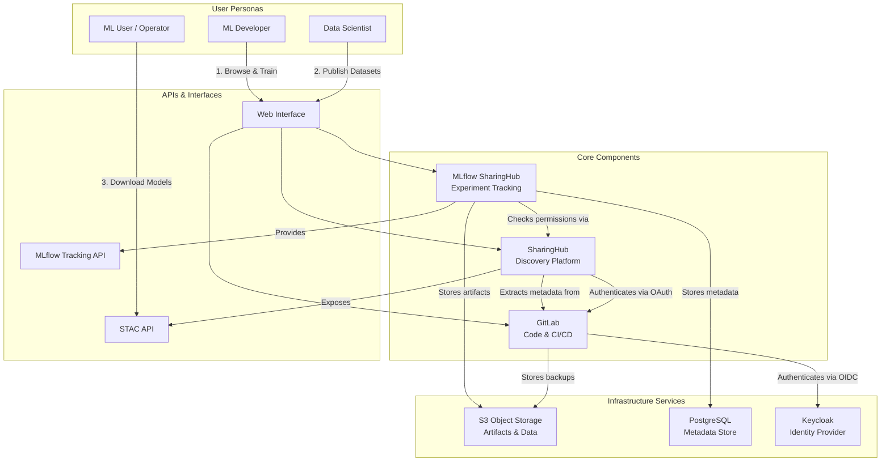
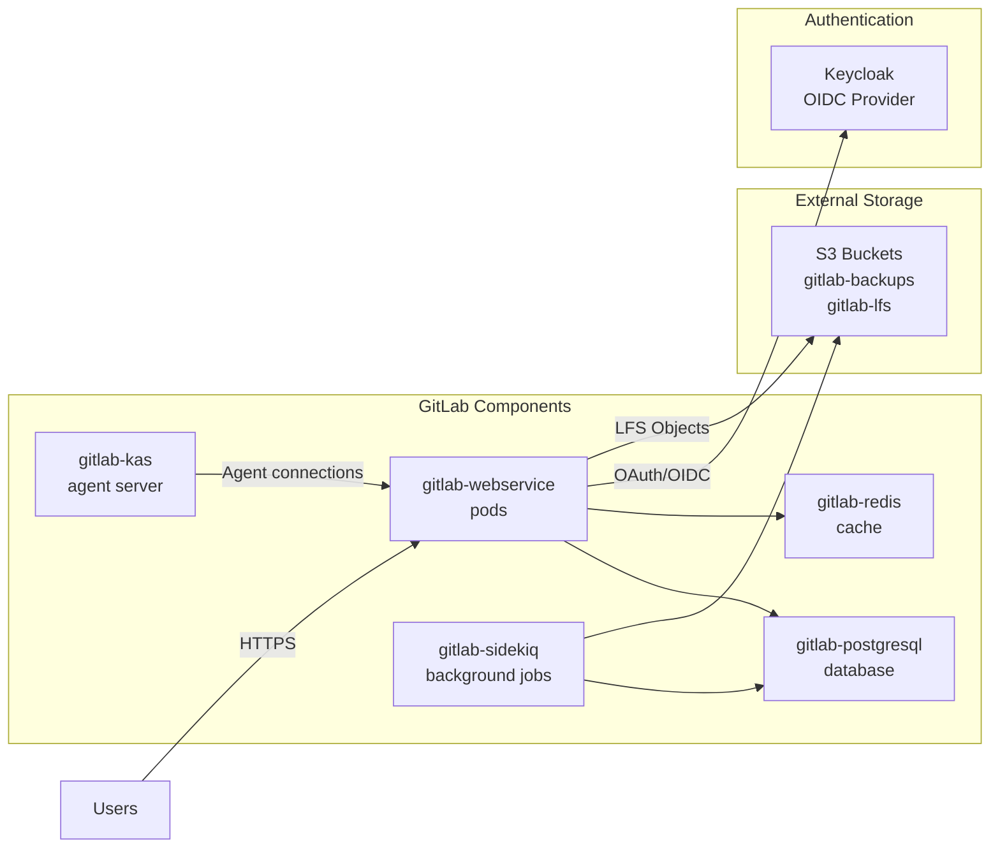
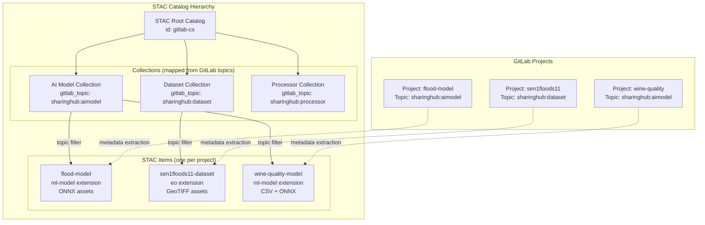
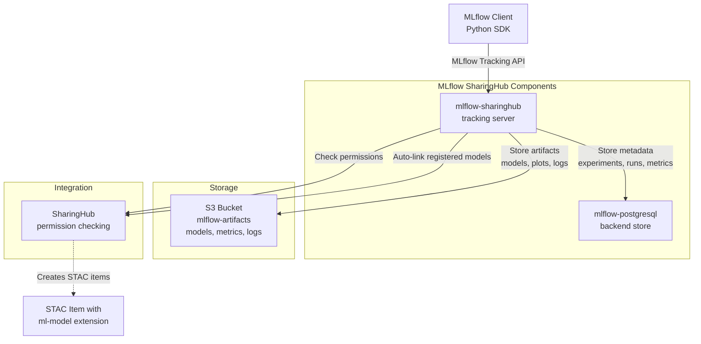
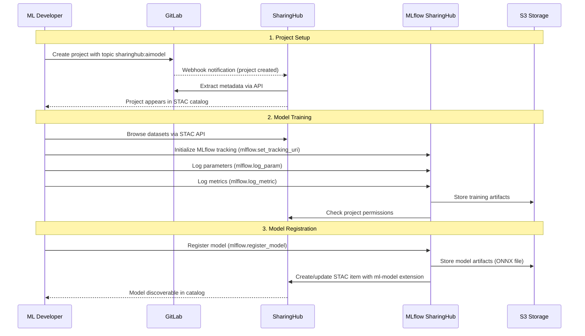
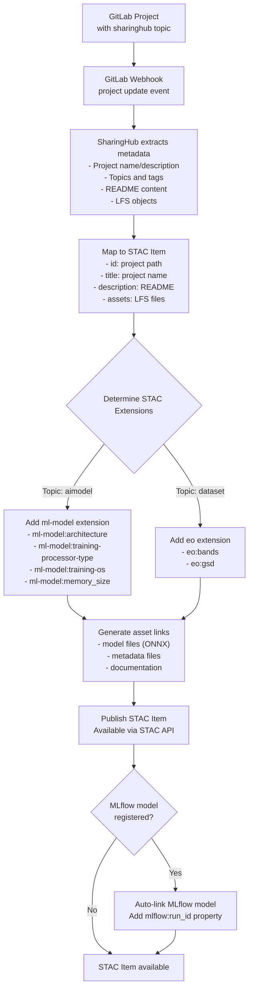
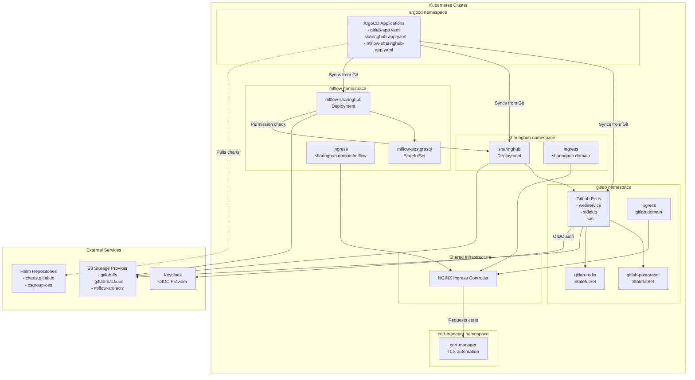
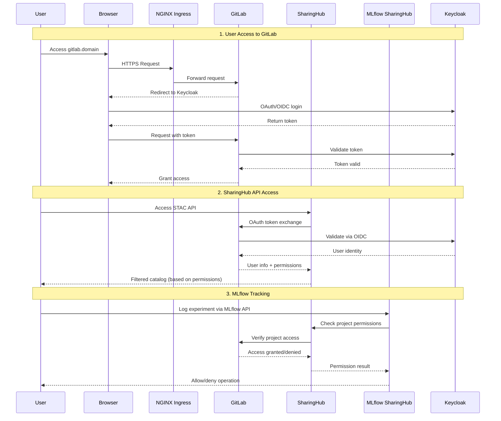
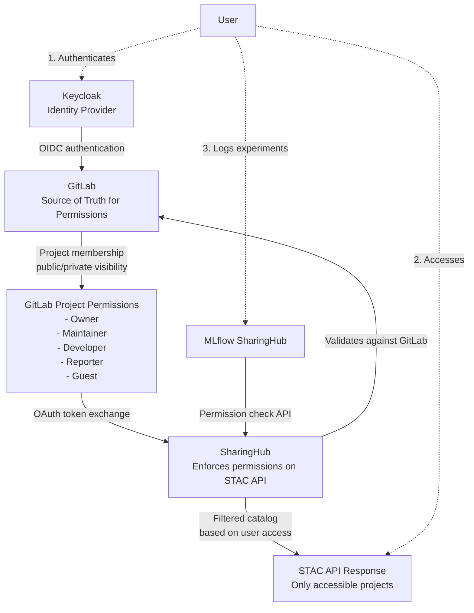

# Architecture

Relevant source files

The following files were used as context for generating this wiki page:

- [docs/design/architecture.md](docs/design/architecture.md)
- [docs/design/diagrams/mlops-archi.drawio.png](docs/design/diagrams/mlops-archi.drawio.png)
- [docs/design/diagrams/mlops-overview.drawio.png](docs/design/diagrams/mlops-overview.drawio.png)
- [docs/index.md](docs/index.md)

## Purpose and Scope

This document describes the overall system architecture of the EOEPCA MLOps Building Block, including its core components, their relationships, and deployment patterns. It covers the high-level design principles, component integration patterns, data flow, and security architecture.

For specific deployment instructions, see [Deployment Guide](#5). For detailed configuration options, see [Configuration Reference](#6). For API usage details, see [API Reference](#7).

Sources: [docs/design/architecture.md:1-76](), [docs/index.md:1-45]()

## System Overview

The MLOps Building Block provides a complete platform for training, managing, and discovering machine learning models within the EOEPCA ecosystem. The architecture is built on three core components that work together to provide an integrated MLOps solution:

1. **GitLab** - Provides version control, project management, and CI/CD capabilities
2. **SharingHub** - Enables discovery and collaboration through a STAC API catalog
3. **MLflow SharingHub** - Manages experiment tracking and model registry

These components are deployed on Kubernetes and share common infrastructure services including S3 object storage, PostgreSQL databases, and centralized authentication through Keycloak.

**Diagram: High-Level System Architecture**

Sources: [docs/design/architecture.md:6-29](), [docs/index.md:16-38]()

## Core Components

### GitLab

GitLab serves as the foundation of the MLOps platform, providing version control, project organization, and CI/CD capabilities. Projects in GitLab are tagged with specific topics (e.g., `sharinghub:aimodel`, `sharinghub:dataset`) to categorize them for discovery through SharingHub.

**Key Responsibilities:**
- Source code version control using Git
- Project metadata storage (topics, tags, descriptions)
- CI/CD pipeline execution
- Large File Storage (LFS) for model artifacts
- Authentication gateway via OIDC integration with Keycloak

**Integration Points:**
- SharingHub extracts project metadata via GitLab API
- MLflow can be integrated directly into GitLab projects
- Backup storage in S3
- User authentication delegated to Keycloak

**Diagram: GitLab Component Architecture**

Sources: [docs/design/architecture.md:52-76]()

### SharingHub

SharingHub is a lightweight discovery and collaboration platform deployed on top of GitLab. It dynamically extracts metadata from GitLab projects and exposes them through a standardized STAC API, making AI models and datasets discoverable.

**Key Responsibilities:**
- Dynamic STAC catalog generation from GitLab projects
- STAC API implementation for standardized discovery
- OAuth-based authentication against GitLab
- Permission checking for private resources
- Metadata extraction and STAC item creation
- Integration with S3 for asset storage

**STAC Catalog Structure:**

The SharingHub generates a STAC catalog with the following structure:
- **Root Catalog**: Single root with ID `gitlab-cs`
- **Collections**: Mapped from GitLab topics (e.g., `sharinghub:aimodel` → AI Model Collection)
- **Items**: One STAC item per GitLab project, with appropriate STAC extensions

**Diagram: STAC Catalog Structure and GitLab Mapping**

Sources: [docs/design/architecture.md:52-76](), [docs/index.md:22-28]()

### MLflow SharingHub

MLflow SharingHub is a customized MLflow deployment that integrates with SharingHub for permission management and with S3 for artifact storage. It provides experiment tracking and a model registry.

**Key Responsibilities:**
- Experiment tracking API for logging metrics, parameters, and artifacts
- Model registry for versioning and staging models
- Permission checking delegated to SharingHub
- PostgreSQL backend for metadata storage
- S3 artifact store for model files and training artifacts
- Integration with SharingHub for automatic STAC item creation

**Architecture:**

**Diagram: MLflow SharingHub Integration**

Sources: [docs/design/architecture.md:52-76]()

## Data Flow and Integration Patterns

### End-to-End Model Training Workflow

The following diagram illustrates the complete lifecycle of training and publishing a machine learning model:

**Diagram: Model Training and Registration Flow**

Sources: [docs/design/architecture.md:10-28]()

### STAC Item Creation and Metadata Extraction

SharingHub dynamically generates STAC items from GitLab projects using the following process:

**Diagram: STAC Item Creation Process**

Sources: [docs/design/architecture.md:52-76]()

## Deployment Architecture

The MLOps Building Block is deployed on Kubernetes using ArgoCD for GitOps-style continuous deployment. All components are namespaced for isolation and share common infrastructure services.

### Kubernetes Architecture

**Diagram: Kubernetes Deployment Architecture**

Sources: [docs/design/architecture.md:52-76]()

### Namespace and Resource Organization

Each component is deployed in its own Kubernetes namespace to provide isolation:

| Namespace | Components | Purpose |
|-----------|-----------|---------|
| `argocd` | ArgoCD Applications | GitOps deployment management |
| `gitlab` | GitLab webservice, sidekiq, kas, postgresql, redis | Version control and CI/CD |
| `sharinghub` | SharingHub application | Discovery and STAC API |
| `mlflow` | MLflow server, postgresql | Experiment tracking |
| `cert-manager` | cert-manager controllers | TLS certificate automation |
| Shared | NGINX Ingress Controller | Traffic routing |

**Persistent Storage:**
- PostgreSQL databases use persistent volumes for data durability
- GitLab and MLflow artifacts stored in external S3 buckets
- Configuration managed via Kubernetes Secrets and ConfigMaps

Sources: [docs/design/architecture.md:52-76]()

## Security and Authentication Architecture

The security architecture is built on centralized authentication through Keycloak with OAuth/OIDC flows, and permission delegation between components.

### Authentication Flow

**Diagram: Authentication and Authorization Flow**

### Secrets Management

All sensitive credentials are stored in Kubernetes Secrets:

| Secret Name | Namespace | Purpose |
|-------------|-----------|---------|
| `gitlab-oidc` | `gitlab` | Keycloak client credentials for GitLab |
| `sharinghub-oidc` | `sharinghub` | OAuth credentials for SharingHub |
| `sharinghub-oidc-default-token` | `sharinghub` | Optional token for public read access |
| `mlflow-sharinghub` | `mlflow` | Secret key for MLflow server |
| `*-tls` | Various | TLS certificates from cert-manager |

**TLS Security:**
- All external traffic encrypted via HTTPS
- Certificates automatically provisioned by cert-manager
- Let's Encrypt used as Certificate Authority
- Certificates stored as Kubernetes TLS Secrets

Sources: [docs/design/architecture.md:52-76]()

### Permission Model

The permission model is hierarchical and delegated:

**Diagram: Permission Delegation Model**

**Permission Rules:**
- GitLab project permissions define who can access models and datasets
- SharingHub filters STAC catalog based on user's GitLab project access
- MLflow delegates all permission checks to SharingHub
- Public projects visible to anonymous users (if `sharinghub-oidc-default-token` configured)
- Private projects only visible to authenticated users with access

Sources: [docs/design/architecture.md:52-76]()

## Design Principles

The MLOps Building Block architecture follows these key design principles:

1. **Separation of Concerns**: Each component has a well-defined responsibility
   - GitLab: Version control and project management
   - SharingHub: Discovery and metadata management
   - MLflow: Experiment tracking and model registry

2. **Standards-Based Integration**: Uses established standards for interoperability
   - STAC for spatial data discovery
   - ONNX for framework-agnostic model representation
   - OAuth/OIDC for authentication

3. **GitOps Deployment**: Infrastructure as code with ArgoCD
   - Declarative configuration in Git repositories
   - Automated synchronization and drift detection
   - Version-controlled deployment history

4. **Cloud-Native Architecture**: Designed for Kubernetes environments
   - Containerized components
   - Horizontal scalability
   - Health checks and self-healing

5. **Security by Default**: Centralized authentication and fine-grained permissions
   - OIDC integration with Keycloak
   - Project-level access control via GitLab
   - TLS encryption for all external traffic

Sources: [docs/design/architecture.md:1-76](), [docs/index.md:16-45]()