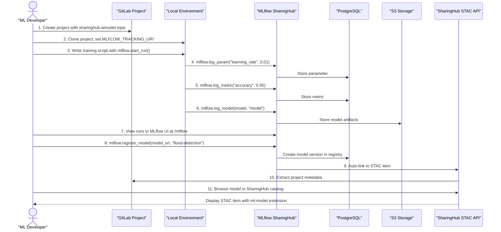
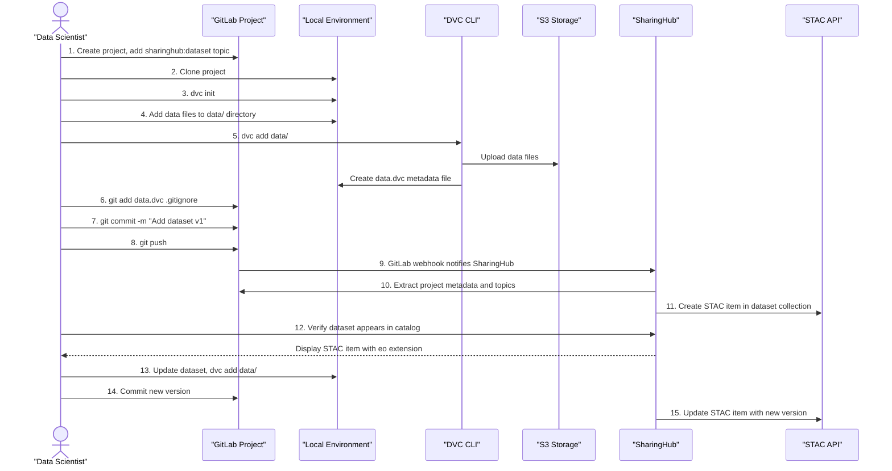
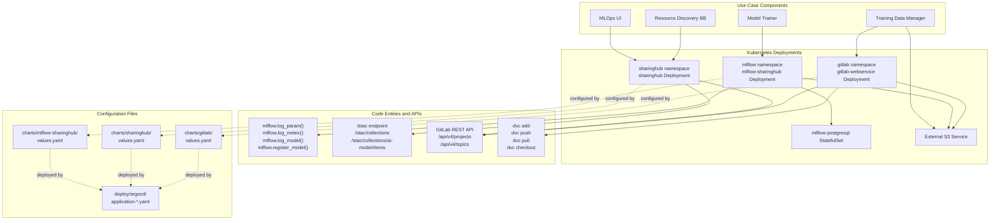

# Use Cases

Relevant source files

The following files were used as context for generating this wiki page:

- [docs/design/diagrams/use-cases.drawio.png](docs/design/diagrams/use-cases.drawio.png)
- [docs/design/use-cases.md](docs/design/use-cases.md)

## Purpose and Scope

This document describes the user stories and use cases supported by the EOEPCA MLOps Building Block. It presents the functional capabilities from the perspective of different user personas, detailing how they interact with the system to train models, manage datasets, track experiments, and share resources.

The use cases are organized into two primary categories: **AI Model Evaluation and Release Management** and **Dataset Management**. These use cases inform the functional requirements documented in [Requirements](#2.1) and are implemented through the workflows described in [Workflows and Scenarios](#4).

**Sources:** [docs/design/use-cases.md:1-96]()

## User Personas and System Components

The MLOps Building Block supports multiple user personas, each interacting with specific system components. The following table maps user roles to their primary activities and the components they interact with:

| Persona | Primary Activities | Components Used |
|---------|-------------------|-----------------|
| **ML Developer** | Train models, log experiments, register models, view metrics, share models | MLflow SharingHub, SharingHub, GitLab |
| **Data Scientist** | Create datasets, version data, publish datasets, share datasets | GitLab, DVC, S3 Storage, SharingHub |
| **ML User** | Browse models, download models, browse datasets, run inference | SharingHub, STAC API, MLflow Registry |

The system components referenced in the use cases map to the following concrete implementations:

| Component Name (Use Cases) | Actual Implementation | Description |
|---------------------------|----------------------|-------------|
| **Model Trainer** | MLflow SharingHub | Experiment tracking server for logging runs and registering models |
| **MLOps UI** | SharingHub Web UI | Discovery platform with STAC catalog for browsing models and datasets |
| **Training Data Manager** | GitLab + DVC + S3 | Version control system combined with data versioning for managing datasets |
| **Resource Discovery BB** | SharingHub STAC API | Standardized catalog API for discovering and accessing resources |

**Sources:** [docs/design/use-cases.md:15-96]()

## Use Case Overview

The following diagram illustrates all use cases supported by the MLOps Building Block and the actors involved in each:

```mermaid
graph TB
    subgraph "Actors"
        MLDev["ML Developer"]
        DataSci["Data Scientist"]
        MLUser["ML User"]
    end
    
    subgraph "AI Model Evaluation and Release Management"
        UC1["Create model"]
        UC2["Use popular ML frameworks"]
        UC3["Use ONNX format"]
        UC4["Evaluate AI model training"]
        UC5["Display runs metrics"]
        UC6["View Model training history"]
        UC7["Share Model"]
        UC8["Model Release"]
        UC9["Register Models"]
    end
    
    subgraph "Dataset Management"
        UC10["Publish Assets"]
        UC11["Dataset iteration"]
        UC12["Share Dataset"]
        UC13["Browse Dataset"]
    end
    
    subgraph "System Components"
        MLflow["MLflow SharingHub<br/>Model Trainer"]
        SH["SharingHub<br/>MLOps UI"]
        GL["GitLab + DVC<br/>Training Data Manager"]
    end
    
    MLDev --> UC1
    MLDev --> UC2
    MLDev --> UC3
    MLDev --> UC4
    MLDev --> UC5
    MLDev --> UC6
    MLDev --> UC7
    MLDev --> UC8
    MLDev --> UC9
    
    DataSci --> UC10
    DataSci --> UC11
    DataSci --> UC12
    DataSci --> UC13
    
    MLUser --> UC13
    MLUser --> UC8
    
    UC1 --> GL
    UC2 --> MLflow
    UC3 --> MLflow
    UC4 --> MLflow
    UC5 --> SH
    UC6 --> SH
    UC7 --> SH
    UC8 --> MLflow
    UC9 --> SH
    
    UC10 --> GL
    UC11 --> GL
    UC12 --> SH
    UC13 --> SH
```

**Sources:** [docs/design/use-cases.md:8-13]()

## AI Model Evaluation and Release Management

This use case category covers the complete lifecycle of training, evaluating, versioning, and releasing AI models. It enables ML developers to work with popular frameworks, track experiments, compare model performance, and publish models for discovery and reuse.

### Create Model

- **Actors:** ML Developer
- **Components:** GitLab (`gitlab` namespace pods)
- **Description:** Create a new GitLab project to organize model training code, scripts, and configuration files. The project serves as the foundation for all model development activities.
- **Preconditions:** User has access to GitLab instance
- **Postconditions:** GitLab project created with appropriate topic tags for SharingHub discovery

**Sources:** [docs/design/use-cases.md:21-24]()

### Use Popular ML Frameworks

- **Actors:** ML Developer
- **Components:** MLflow SharingHub (`mlflow` namespace, `MLflow` class in tracking server)
- **Description:** Train models using popular frameworks (TensorFlow, PyTorch, scikit-learn, etc.) while logging experiments to MLflow. The `mlflow.log_param()`, `mlflow.log_metric()`, and `mlflow.log_model()` APIs provide framework-agnostic tracking.
- **Preconditions:** MLflow tracking server accessible, project configured with `MLFLOW_TRACKING_URI`
- **Postconditions:** Training runs logged with framework-specific metadata

**Sources:** [docs/design/use-cases.md:26-29]()

### Use ONNX Model Representation Format

- **Actors:** ML Developer
- **Components:** MLflow SharingHub (model registry), S3 artifact storage
- **Description:** Export trained models to ONNX format for interoperability and deployment. MLflow stores ONNX models as artifacts in S3, making them accessible via the STAC API.
- **Preconditions:** Model trained in supported framework
- **Postconditions:** ONNX model stored in S3 with path `s3://<bucket>/mlflow/<experiment_id>/<run_id>/artifacts/model/model.onnx`

**Sources:** [docs/design/use-cases.md:31-34]()

### Evaluate AI Model Training

- **Actors:** ML Developer
- **Components:** MLflow SharingHub (`mlflow.log_metric()` API, PostgreSQL backend for metrics storage)
- **Description:** Log accuracy metrics, loss values, and performance indicators during training. Metrics are stored in the MLflow PostgreSQL database (`mlflow` namespace, `mlflow-postgresql` StatefulSet) and associated with specific runs.
- **Preconditions:** Active MLflow run context
- **Postconditions:** Metrics stored in PostgreSQL, queryable via MLflow API

**Sources:** [docs/design/use-cases.md:36-39]()

### Display Runs Metrics

- **Actors:** ML Developer
- **Components:** SharingHub Web UI, MLflow UI (accessible at `/mlflow` path)
- **Description:** View performance metrics collected during experiments in the MLflow UI. The interface displays metric plots, parameter comparisons, and run metadata.
- **Preconditions:** Runs exist in MLflow tracking server
- **Postconditions:** User can compare runs and identify best-performing models

**Sources:** [docs/design/use-cases.md:41-44]()

### View Model Training History

- **Actors:** ML Developer
- **Components:** SharingHub (`SharingHubClient` class), MLflow (`get_run()`, `search_runs()` APIs)
- **Description:** Access historical training metrics and dataset versions used for model training. The SharingHub UI integrates with MLflow to display training history and links to the GitLab project containing training code.
- **Preconditions:** User has permissions to view project in GitLab
- **Postconditions:** Historical metrics and dataset versions displayed with temporal trends

**Sources:** [docs/design/use-cases.md:47-58]()

### Share Model

- **Actors:** ML Developer
- **Components:** SharingHub (GitLab project with `sharinghub:aimodel` topic), GitLab OAuth for access control
- **Description:** Share model with collaborators by adding them to the GitLab project. Access control is inherited from GitLab's permission system. Models appear in the SharingHub catalog based on project visibility.
- **Preconditions:** Model registered in MLflow, GitLab project configured
- **Postconditions:** Authorized users can discover and access model through SharingHub

**Sources:** [docs/design/use-cases.md:52-58]()

### Model Release

- **Actors:** ML Developer, ML User
- **Components:** MLflow Model Registry (`mlflow.register_model()` API), S3 artifact storage
- **Description:** Download ONNX models from the MLflow registry via STAC API. Registered models are automatically linked to STAC items in SharingHub, enabling standardized access.
- **Preconditions:** Model registered with `mlflow.register_model(model_uri, name)`
- **Postconditions:** ONNX model downloadable via STAC API asset links

**Sources:** [docs/design/use-cases.md:60-63]()

### Register Models in Resource Discovery

- **Actors:** ML Developer
- **Components:** MLflow SharingHub (`register_model()` API), SharingHub STAC catalog (`/stac` API endpoints)
- **Description:** Register models with MLflow to make them discoverable through the SharingHub STAC catalog. The registration process creates a STAC item with the `ml-model` extension in the `ai-model` collection.
- **Preconditions:** Model artifacts available in S3, GitLab project has `sharinghub:aimodel` topic
- **Postconditions:** Model appears in STAC catalog with download links, metadata, and ML model properties

**Sources:** [docs/design/use-cases.md:65-68]()

### Model Training Workflow Diagram

The following diagram shows the complete workflow from model creation to registration:

**Sources:** [docs/design/use-cases.md:17-68]()

## Dataset Management

This use case category focuses on storing, versioning, and sharing datasets used for model training. It enables data scientists to manage large volumes of data in various formats while maintaining version control and enabling collaboration.

### Publish Assets

- **Actors:** Data Scientist
- **Components:** GitLab (repository storage), S3 (object storage for large files), DVC (data version control)
- **Description:** Store large datasets (multiple GB) in various formats (images, sounds, text, videos) for model training. DVC tracks data files in GitLab while storing actual data in S3.
- **Preconditions:** GitLab project created, S3 bucket configured, DVC initialized with `dvc init`
- **Postconditions:** Data stored in S3 at `s3://<bucket>/<project>/<dataset>/`, metadata files committed to GitLab

**Sources:** [docs/design/use-cases.md:74-77]()

### Dataset Iteration

- **Actors:** Data Scientist
- **Components:** GitLab (version control for `.dvc` files), DVC (data versioning commands)
- **Description:** Maintain multiple versions of datasets to support iterative improvements. Each dataset version is tracked via `.dvc` files in GitLab, which reference specific data versions in S3.
- **Preconditions:** Dataset published with `dvc add data/`
- **Postconditions:** Multiple dataset versions accessible via `dvc checkout <version>`, each version has unique Git commit

**Sources:** [docs/design/use-cases.md:79-82]()

### Share Dataset

- **Actors:** Data Scientist
- **Components:** SharingHub STAC catalog, GitLab (project with `sharinghub:dataset` topic)
- **Description:** Share datasets with collaborators by adding the `sharinghub:dataset` topic to the GitLab project. The dataset appears in the SharingHub catalog as a STAC item with the `eo` or `datacube` extension.
- **Preconditions:** GitLab project contains dataset with `.dvc` files
- **Postconditions:** Dataset discoverable in SharingHub `/stac` API, accessible to authorized users

**Sources:** [docs/design/use-cases.md:84-87]()

### Browse Dataset

- **Actors:** Data Scientist, ML Developer, ML User
- **Components:** SharingHub Web UI, STAC API (`/stac/collections/dataset`, `/stac/collections/dataset/items`)
- **Description:** Browse available datasets through the SharingHub Web UI or STAC API. Users can filter datasets by tags, view metadata, and access datasets they have permissions for.
- **Preconditions:** User authenticated via GitLab OAuth or using default token
- **Postconditions:** User can view dataset details, download links, and associated GitLab project

**Sources:** [docs/design/use-cases.md:89-95]()

### Dataset Management Workflow Diagram

The following diagram shows the complete workflow for dataset management:

**Sources:** [docs/design/use-cases.md:70-95]()

## Component and Code Entity Mapping

The following diagram maps use case components to actual code entities in the system:

This mapping shows how abstract use case components correspond to concrete Kubernetes deployments, code APIs, and configuration files in the repository.

**Sources:** [docs/design/use-cases.md:1-96]()

## Use Case to Implementation Traceability

The following table provides traceability from use cases to their implementation components:

| Use Case | MLflow SharingHub | SharingHub | GitLab | Key APIs/Commands |
|----------|------------------|------------|---------|-------------------|
| Create model | - | - | ✓ | GitLab project creation, topic: `sharinghub:aimodel` |
| Use ML frameworks | ✓ | - | - | `mlflow.log_param()`, `mlflow.log_metric()` |
| Use ONNX format | ✓ | - | - | `mlflow.log_model()`, ONNX artifact storage in S3 |
| Evaluate training | ✓ | - | - | `mlflow.log_metric()`, PostgreSQL metrics storage |
| Display runs metrics | ✓ | ✓ | - | MLflow UI at `/mlflow`, SharingHub integration |
| View training history | ✓ | ✓ | - | `mlflow.search_runs()`, SharingHub project view |
| Share model | - | ✓ | ✓ | GitLab permissions, OAuth integration |
| Model release | ✓ | ✓ | - | `mlflow.register_model()`, STAC API download |
| Register models | ✓ | ✓ | - | MLflow registry, `/stac/collections/ai-model/items` |
| Publish assets | - | - | ✓ | `dvc add`, `dvc push`, S3 storage |
| Dataset iteration | - | - | ✓ | `dvc checkout`, Git commits for `.dvc` files |
| Share dataset | - | ✓ | ✓ | GitLab topic: `sharinghub:dataset`, STAC catalog |
| Browse dataset | - | ✓ | - | `/stac/collections/dataset/items`, Web UI |

**Sources:** [docs/design/use-cases.md:1-96]()

## Related Documentation

For detailed information on related topics:

- **Functional requirements** that inform these use cases: See [Requirements](#2.1)
- **Step-by-step implementation** of these use cases: See [Model Training Workflow](#4.1) and [Dataset Management](#4.2)
- **API specifications** for programmatic access: See [API Reference](#7)
- **Deployment instructions** for setting up components: See [Deployment Guide](#5)