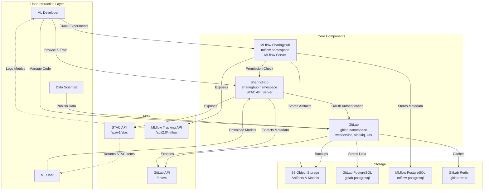
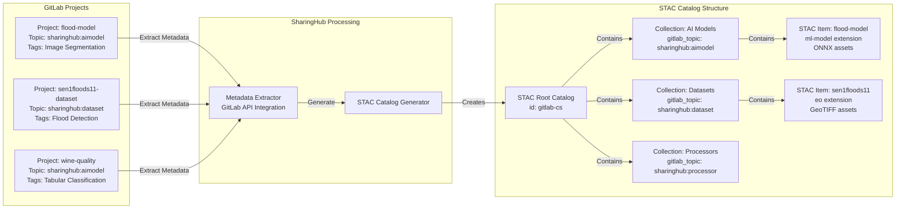
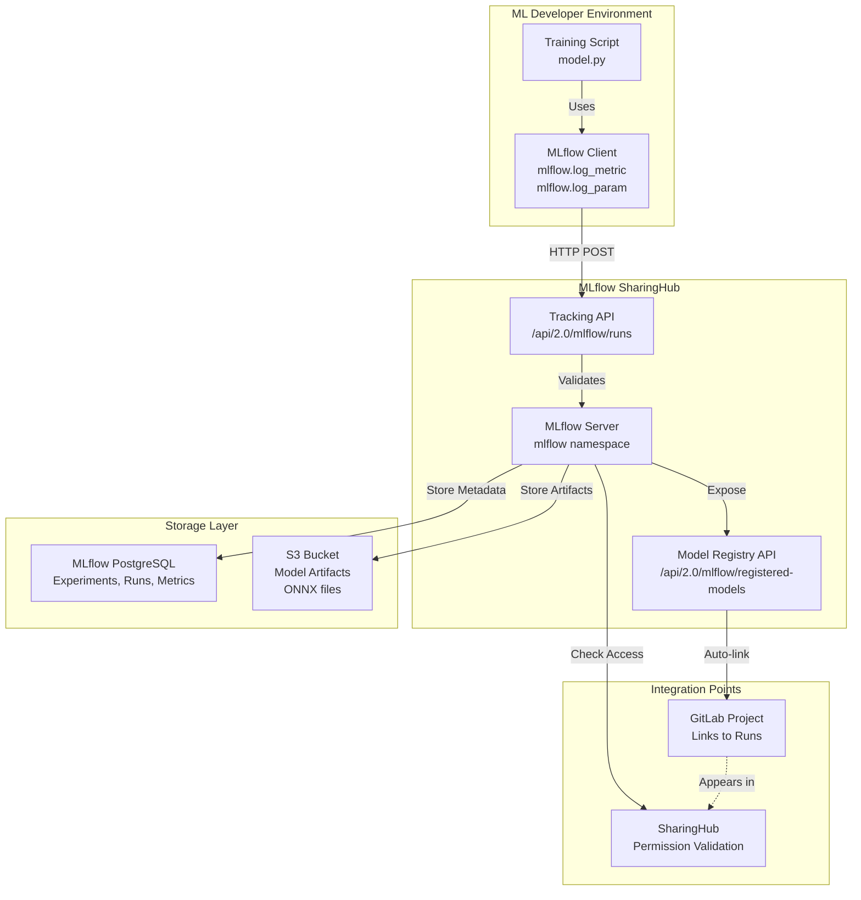
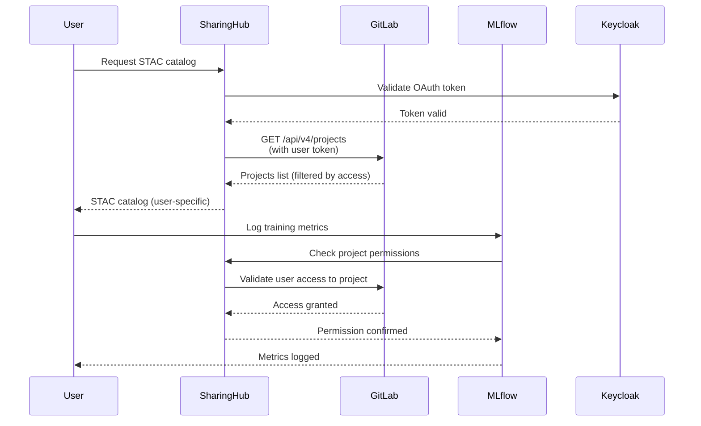
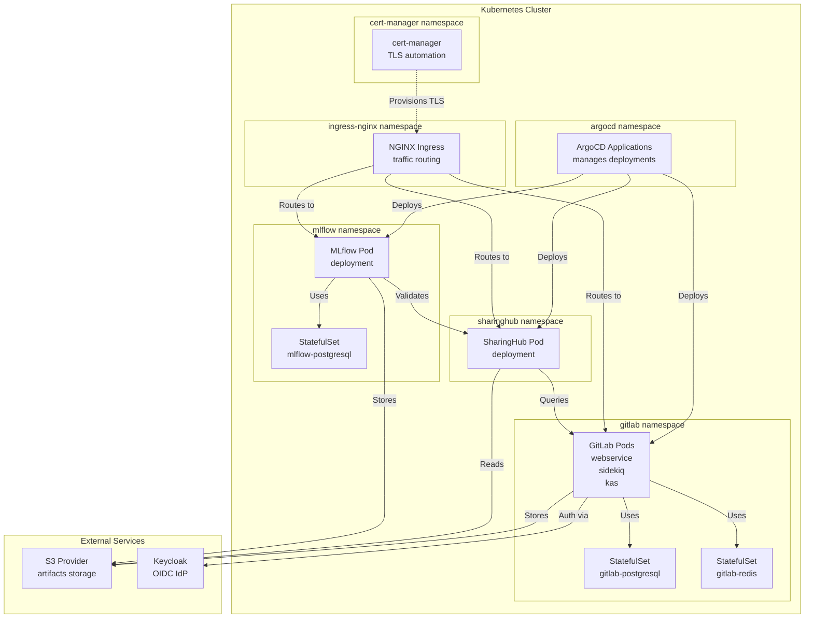
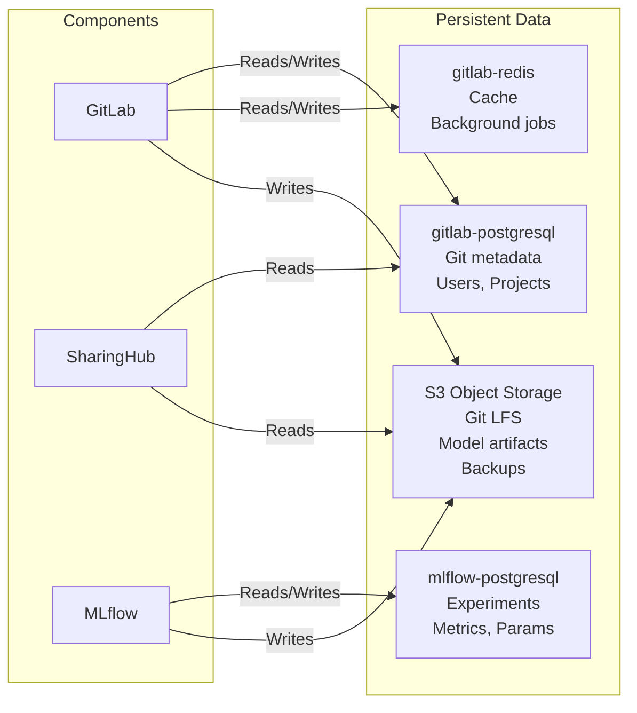
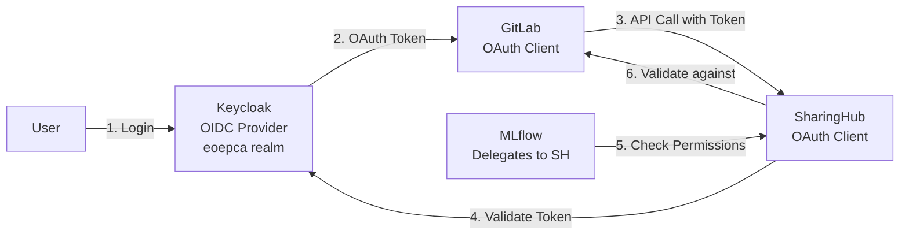

# Core Components

Relevant source files

The following files were used as context for generating this wiki page:

- [docs/design/architecture.md](docs/design/architecture.md)
- [docs/design/diagrams/mlops-archi.drawio.png](docs/design/diagrams/mlops-archi.drawio.png)
- [docs/design/diagrams/mlops-overview.drawio.png](docs/design/diagrams/mlops-overview.drawio.png)
- [docs/index.md](docs/index.md)

This page provides an overview of the three main components that comprise the EOEPCA MLOps Building Block and how they work together to deliver a complete machine learning operations platform. For detailed configuration and deployment of each component, see [GitLab](#3.1), [SharingHub](#3.2), and [MLflow SharingHub](#3.3).

The MLOps Building Block is implemented through the integration of three core components:

1. **GitLab** - Provides version control, project management, and serves as the source of truth for code and metadata
2. **SharingHub** - Discovery and collaboration platform that dynamically generates STAC catalogs from GitLab projects
3. **MLflow SharingHub** - Experiment tracking and model registry for managing ML training runs and model artifacts

## Component Overview

The architecture follows a layered approach where GitLab forms the foundation, SharingHub provides discovery and access control, and MLflow SharingHub handles ML-specific lifecycle management.

**Component Interaction Architecture**

Sources: [docs/design/architecture.md:52-76](), [docs/index.md:16-29]()

## GitLab: Foundation Layer

GitLab serves as the foundational component, providing:

- **Version Control**: Git repositories for code, models, and documentation
- **Project Management**: Issues, merge requests, CI/CD pipelines
- **Topic-Based Organization**: Projects are tagged with topics like `sharinghub:aimodel`, `sharinghub:dataset`, `sharinghub:processor` to enable automatic discovery
- **User Authentication**: OIDC integration with Keycloak for centralized identity management
- **Object Storage**: Integration with S3 for Git LFS and backup storage

GitLab runs in the `gitlab` namespace with multiple pod types including `webservice`, `sidekiq` (background jobs), and `kas` (Kubernetes agent server). It maintains its own PostgreSQL database and Redis cache.

For detailed GitLab deployment and configuration, see [GitLab](#3.1).

Sources: [docs/design/architecture.md:30-51](), [docs/index.md:16-29]()

## SharingHub: Discovery Layer

SharingHub is deployed on top of GitLab and dynamically extracts metadata from GitLab projects to provide discovery services.

**SharingHub STAC Catalog Generation**

**Key Features:**

- **Dynamic Catalog**: STAC catalog is generated on-the-fly based on GitLab project metadata and user permissions
- **STAC API**: Implements STAC API specification at `/api/v1/stac` endpoint for standardized access
- **Topic Filtering**: Collections are automatically created based on GitLab topics (`sharinghub:aimodel`, `sharinghub:dataset`, `sharinghub:processor`)
- **Permission Integration**: User access is validated against GitLab project permissions via OAuth
- **STAC Extensions**: Supports `ml-model` extension for AI models and `eo` extension for Earth Observation datasets

SharingHub runs in the `sharinghub` namespace as a single pod deployment.

For detailed SharingHub configuration including categories, tags, and STAC settings, see [SharingHub](#3.2).

Sources: [docs/design/architecture.md:52-76](), [docs/index.md:22-28]()

## MLflow SharingHub: ML Lifecycle Layer

MLflow SharingHub manages the complete machine learning lifecycle including experiment tracking, model training, and model registry.

**MLflow Integration Architecture**

**Key Features:**

- **Experiment Tracking**: Logs parameters, metrics, and artifacts for each training run using MLflow Tracking API
- **Model Registry**: Maintains versioned models with lifecycle stages (staging, production, archived)
- **Artifact Storage**: Model files (including ONNX format) stored in S3 object storage
- **Metadata Storage**: Training run metadata stored in dedicated PostgreSQL database (`mlflow-postgresql`)
- **Permission Delegation**: Validates user access by checking permissions through SharingHub, which in turn validates against GitLab
- **Auto-linking**: Registered models automatically linked to STAC items in SharingHub catalog

MLflow SharingHub runs in the `mlflow` namespace as a single pod deployment with environment variables configured for backend store and artifact store.

For detailed MLflow SharingHub configuration including backend store, artifact store, and SharingHub integration, see [MLflow SharingHub](#3.3).

Sources: [docs/design/architecture.md:52-76](), [docs/index.md:22-28]()

## Component Interaction Patterns

The three components interact through well-defined interfaces to provide a cohesive MLOps experience.

**Authentication and Permission Flow**

**Data and Metadata Flow**

| Component | Data Type | Storage Location | Access Method |
|-----------|-----------|------------------|---------------|
| GitLab | Git repositories, CI/CD data | `gitlab-postgresql`, `gitlab-redis` | GitLab API `/api/v4` |
| GitLab | LFS objects, backups | S3 object storage | S3 API |
| SharingHub | STAC catalog (dynamic) | None (generated on-the-fly) | STAC API `/api/v1/stac` |
| MLflow | Experiment metadata, metrics | `mlflow-postgresql` | MLflow Tracking API |
| MLflow | Model artifacts, ONNX files | S3 object storage | S3 API, MLflow Artifacts API |

**Topic-Based Discovery**

GitLab projects use topics to indicate their type, which SharingHub uses to automatically generate STAC collections:

- `sharinghub:aimodel` → AI Models collection
- `sharinghub:dataset` → Datasets collection  
- `sharinghub:processor` → Processors collection

Additional tags on GitLab projects (e.g., "Image Segmentation", "Flood Detection") become searchable metadata in the STAC catalog.

Sources: [docs/design/architecture.md:52-76](), [docs/index.md:16-29]()

## Deployment Architecture

All three components are deployed on Kubernetes using ArgoCD for GitOps-style deployment management.

**Kubernetes Namespace Layout**

**Component Dependencies:**

- **GitLab**: Requires PostgreSQL, Redis, S3, and Keycloak for OIDC
- **SharingHub**: Requires GitLab to be running and accessible
- **MLflow SharingHub**: Requires PostgreSQL, S3, and SharingHub for permission checks

For complete deployment instructions including prerequisites and step-by-step guides, see [Deployment Guide](#5).

Sources: [docs/design/architecture.md:52-76]()

## Storage and Persistence

The components use different storage backends for different data types:

**Storage Backend Summary**

**PostgreSQL Databases:**

- `gitlab-postgresql`: Stores GitLab's core data (users, projects, merge requests, CI/CD pipelines)
- `mlflow-postgresql`: Stores MLflow's tracking data (experiments, runs, metrics, parameters, model registry)

**Redis:**

- `gitlab-redis`: Caching layer and message queue for GitLab background jobs (Sidekiq)

**S3 Object Storage:**

- Git LFS objects
- GitLab backup archives
- MLflow model artifacts (ONNX files, training data)
- General file attachments

Sources: [docs/design/architecture.md:52-76]()

## Authentication and Security

The components share a common authentication architecture based on OAuth 2.0 and OIDC.

**Authentication Chain**

**Kubernetes Secrets:**

- `gitlab-oidc`: Contains `client-id` and `client-secret` for GitLab's OIDC integration with Keycloak
- `sharinghub-oidc`: Contains `client-id` and `client-secret` for SharingHub's OAuth with GitLab
- `sharinghub-oidc` (optional): Contains `default-token` for public unauthenticated read access
- `mlflow-sharinghub`: Contains `secret-key` for MLflow's integration with SharingHub
- TLS secrets: `gitlab.domain-tls`, `sharinghub.domain-tls` provisioned by cert-manager

**Permission Model:**

1. User authenticates with Keycloak
2. GitLab validates OIDC token and establishes session
3. SharingHub uses GitLab OAuth to validate user identity
4. SharingHub queries GitLab API to determine which projects user can access
5. MLflow delegates all permission checks to SharingHub
6. STAC catalog and MLflow responses are filtered based on user permissions

For detailed security configuration including TLS and secret management, see [Deployment Guide](#5).

Sources: [docs/design/architecture.md:52-76]()

## Summary

The MLOps Building Block achieves its functionality through tight integration of three components:

- **GitLab** provides the foundational layer for version control and project management
- **SharingHub** builds on GitLab to provide standardized discovery through dynamic STAC catalog generation  
- **MLflow SharingHub** adds ML-specific capabilities while leveraging SharingHub for access control

This modular architecture enables:

- Standard-compliant APIs (STAC API, MLflow API, GitLab API)
- Unified authentication and authorization
- Flexible deployment on Kubernetes
- Integration with external services (S3, Keycloak)

For implementation details of each component, see their respective pages: [GitLab](#3.1), [SharingHub](#3.2), and [MLflow SharingHub](#3.3). For operational workflows using these components, see [Workflows and Scenarios](#4).

Sources: [docs/design/architecture.md:1-76](), [docs/index.md:1-45]()