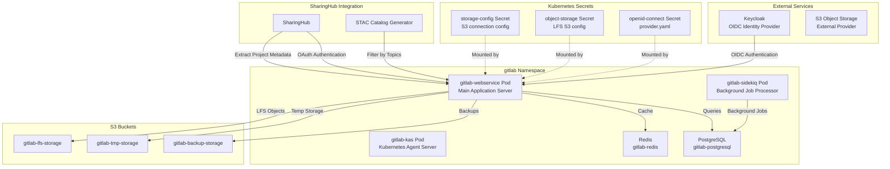
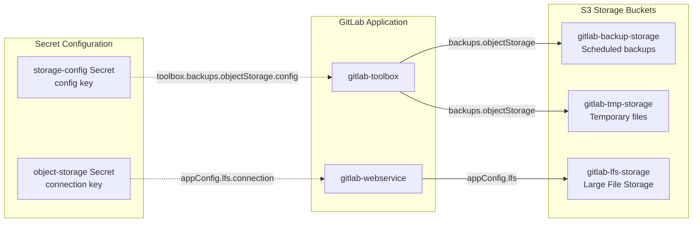
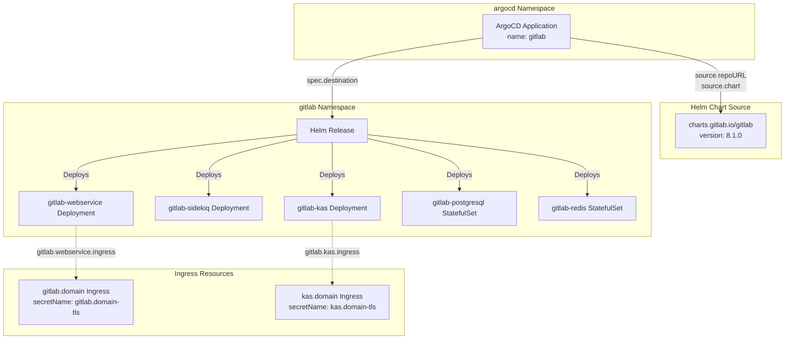
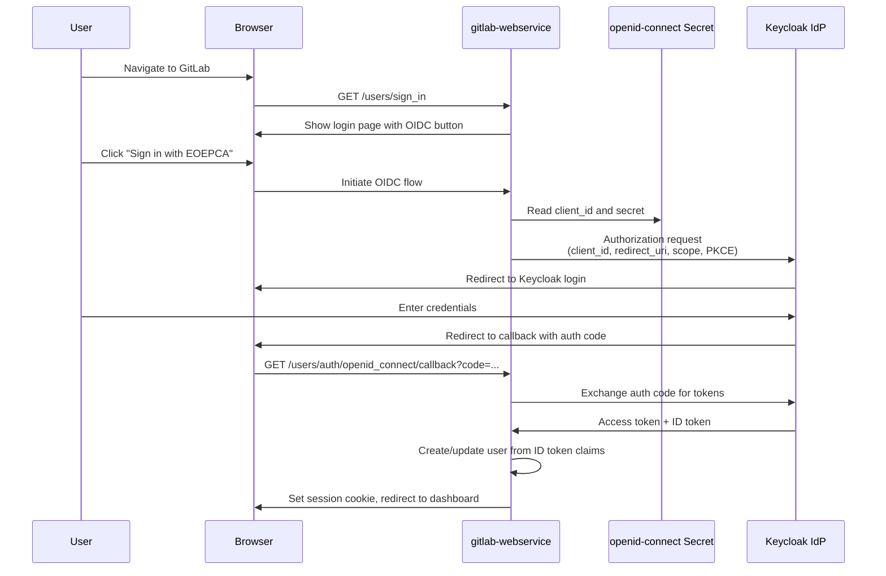
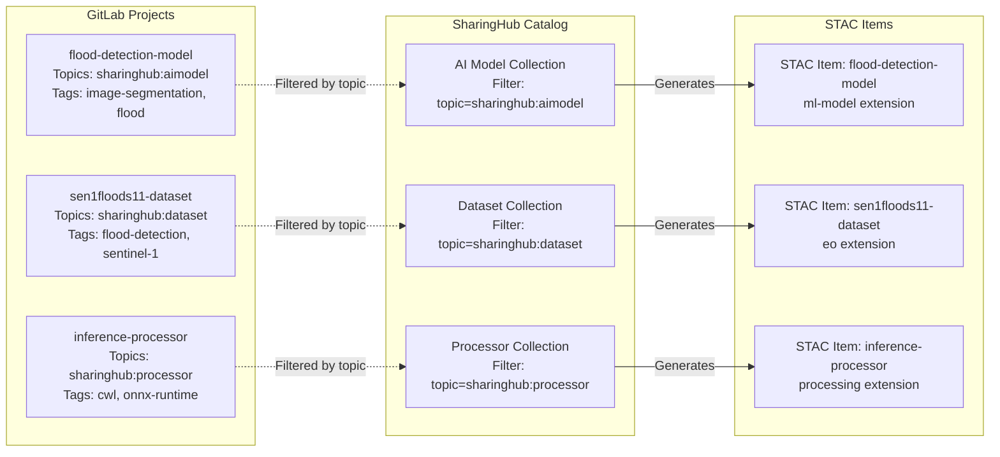
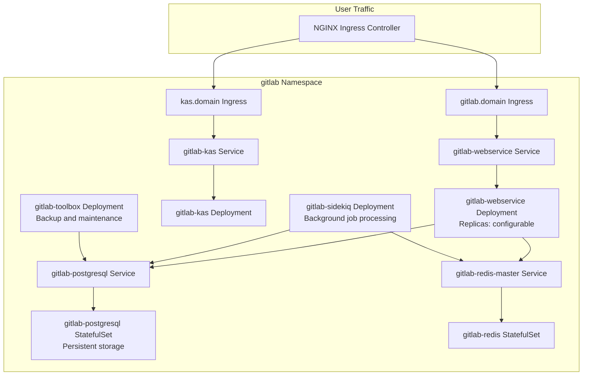

# GitLab

<details>
<summary>Relevant source files</summary>

The following files were used as context for generating this wiki page:

- [docs/admin/deployment-guide/components/gitlab.md](docs/admin/deployment-guide/components/gitlab.md)
- [docs/admin/deployment-guide/intro.md](docs/admin/deployment-guide/intro.md)

</details>


## Purpose and Scope

This document describes GitLab's role as the foundational code management and version control system within the EOEPCA MLOps Building Block. GitLab serves as the primary repository for all projects, including AI models, datasets, and processors, and provides the organizational structure through topics that drives automatic discovery in SharingHub.

For deployment instructions, see [GitLab Deployment](#5.2). For information about how SharingHub extracts metadata from GitLab projects, see [SharingHub](#3.2).

**Sources:** [docs/admin/deployment-guide/intro.md:10-11]()

---

## Role in the MLOps Building Block

GitLab functions as the central repository and project management platform for the entire MLOps ecosystem. Its primary responsibilities include:

- **Version Control**: Hosts all code repositories for AI models, training scripts, datasets, and processors
- **Project Organization**: Uses GitLab topics (e.g., `sharinghub:aimodel`, `sharinghub:dataset`) to categorize projects for automatic discovery
- **CI/CD Pipeline**: Provides continuous integration and deployment capabilities for model training and deployment workflows
- **Metadata Source**: Serves as the authoritative source of project metadata that SharingHub extracts to generate STAC catalog items
- **Authentication Provider**: Acts as an OAuth provider for SharingHub, enabling unified access control across components
- **Integration Point**: Provides API endpoints for DVC (Data Version Control) and other tools to interact with the platform

**Sources:** [docs/admin/deployment-guide/intro.md:10-11]()

---

## Architecture and Component Integration

### GitLab in the MLOps Ecosystem



GitLab is deployed in the `gitlab` namespace and consists of multiple interconnected pods. The `gitlab-webservice` pod handles user requests and API calls, `gitlab-sidekiq` processes background jobs (such as repository maintenance and CI/CD pipeline execution), and `gitlab-kas` provides the Kubernetes Agent Server for GitOps workflows. PostgreSQL stores all GitLab data including repositories, issues, and user information, while Redis provides caching and job queue management.

**Sources:** [docs/admin/deployment-guide/components/gitlab.md:1-14](), [docs/admin/deployment-guide/components/gitlab.md:169-188]()

---

### Storage Architecture



GitLab requires three S3 buckets for external object storage:
- `gitlab-backup-storage`: Stores automated GitLab backups created by the `gitlab-toolbox` pod
- `gitlab-tmp-storage`: Holds temporary files during backup operations
- `gitlab-lfs-storage`: Stores Git Large File Storage (LFS) objects for repositories containing large files such as datasets and model weights

The `storage-config` secret contains S3 credentials in s3cmd configuration format, while the `object-storage` secret provides LFS-specific connection parameters including endpoint, region, and AWS signature version.

**Sources:** [docs/admin/deployment-guide/components/gitlab.md:16-66](), [docs/admin/deployment-guide/components/gitlab.md:162-184]()

---

## Deployment Configuration

### ArgoCD Application Structure

The GitLab deployment is managed through an ArgoCD Application manifest that references the official GitLab Helm chart. The deployment structure follows this pattern:



The ArgoCD Application manifest defines the deployment source (`repoURL: https://charts.gitlab.io`), chart version (`targetRevision: 8.1.0`), and destination namespace (`gitlab`). The `helm.valuesObject` section contains all GitLab configuration parameters.

**Sources:** [docs/admin/deployment-guide/components/gitlab.md:107-230]()

---

### Key Configuration Parameters

The GitLab Helm chart configuration is structured hierarchically under the `global` and component-specific sections:

| Configuration Path | Purpose | Example Value |
|-------------------|---------|---------------|
| `global.hosts.domain` | Base domain for all GitLab services | `example.com` |
| `global.ingress.class` | Ingress controller class | `nginx` |
| `global.ingress.annotations` | Ingress annotations for cert-manager | `cert-manager.io/cluster-issuer: letsencrypt-prod` |
| `global.edition` | GitLab edition (ce/ee) | `ce` |
| `global.appConfig.omniauth.enabled` | Enable OIDC authentication | `true` |
| `global.appConfig.lfs.enabled` | Enable Git LFS | `true` |
| `global.appConfig.lfs.bucket` | S3 bucket for LFS objects | `gitlab-lfs-storage` |
| `global.appConfig.backups.bucket` | S3 bucket for backups | `gitlab-backup-storage` |
| `gitlab.webservice.ingress.tls.secretName` | TLS certificate secret | `gitlab.example.com-tls` |
| `gitlab.toolbox.backups.objectStorage.config.secret` | S3 credentials secret | `storage-config` |

**Sources:** [docs/admin/deployment-guide/components/gitlab.md:125-184]()

---

### Minimal Deployment Mode

The provided GitLab deployment configuration disables several optional components to reduce resource consumption and complexity:

```yaml
# Disabled Components
global.registry.enabled: false           # Container registry
global.minio.enabled: false              # Internal object storage
upgradeCheck.enabled: false              # Version upgrade checker
certmanager.install: false               # Use external cert-manager
nginx-ingress.enabled: false             # Use external NGINX
prometheus.install: false                # Monitoring stack
gitlab-runner.install: false             # CI/CD runners
```

This minimal configuration assumes external infrastructure components (cert-manager, NGINX Ingress Controller, S3 storage) are already available in the cluster.

**Sources:** [docs/admin/deployment-guide/components/gitlab.md:13-14](), [docs/admin/deployment-guide/components/gitlab.md:137-216]()

---

## Authentication and Authorization

### OIDC Integration with Keycloak

GitLab integrates with Keycloak as an OpenID Connect (OIDC) provider to enable single sign-on (SSO) authentication. The integration flow is as follows:



The OIDC configuration is stored in the `openid-connect` secret with the following structure in `provider.yaml`:

```yaml
name: openid_connect
label: EOEPCA                                    # Button label on login page
args:
  scope: ["openid", "profile", "email"]
  response_type: "code"                          # Authorization code flow
  issuer: "https://keycloak.domain/realms/realm" # OIDC issuer URL
  discovery: true                                 # Auto-discover endpoints
  uid_field: "preferred_username"                 # Map username from token
  pkce: true                                      # Enable PKCE for security
  client_options:
    identifier: "gitlab"                          # Client ID in Keycloak
    redirect_uri: "https://gitlab.domain/users/auth/openid_connect/callback"
```

**Sources:** [docs/admin/deployment-guide/components/gitlab.md:68-103](), [docs/admin/deployment-guide/components/gitlab.md:143-148]()

---

### OAuth Provider for SharingHub

GitLab also functions as an OAuth 2.0 provider for SharingHub. When SharingHub needs to access GitLab projects on behalf of a user, it initiates an OAuth flow where GitLab authenticates the user and issues an access token. SharingHub uses this token to query the GitLab API for project metadata, repository contents, and topic information.

The OAuth application must be configured in GitLab with the SharingHub callback URL (typically `https://sharinghub.domain/oauth/callback`). The application ID and secret are then stored in Kubernetes secrets for SharingHub to use.

**Sources:** [docs/admin/deployment-guide/intro.md:5-6]()

---

## Project Organization and Topics

### GitLab Topics for Categorization

GitLab topics serve as the primary mechanism for categorizing projects and enabling automatic discovery in SharingHub. Projects are tagged with specific topics that correspond to STAC collection types:

| GitLab Topic | STAC Collection | Purpose |
|-------------|-----------------|---------|
| `sharinghub:aimodel` | AI Model Collection | Machine learning models (trained weights, ONNX files) |
| `sharinghub:dataset` | Dataset Collection | Training and evaluation datasets |
| `sharinghub:processor` | Processor Collection | Data processing and inference workflows |



SharingHub periodically queries the GitLab API to discover projects with these topics and generates corresponding STAC catalog entries. Additional GitLab tags provide finer-grained classification within each collection.

**Sources:** Based on high-level architecture diagrams

---

## S3 Storage Configuration

### Storage Configuration Secret

The `storage-config` secret contains s3cmd-compatible configuration for GitLab's backup functionality. This configuration is mounted by the `gitlab-toolbox` pod and referenced via the `gitlab.toolbox.backups.objectStorage.config` Helm values:

```conf
[default]
access_key = <access_key>
bucket_location = <bucket_region>
host_base = <s3_endpoint>
secret_key = <secret_key>
use_https = True
```

The secret is created with:
```bash
kubectl create secret generic storage-config --from-file=config=storage.config -n gitlab
```

And referenced in the Helm values at [docs/admin/deployment-guide/components/gitlab.md:179-184]():
```yaml
gitlab.toolbox.backups.objectStorage.config.secret: storage-config
gitlab.toolbox.backups.objectStorage.config.key: config
```

**Sources:** [docs/admin/deployment-guide/components/gitlab.md:16-39](), [docs/admin/deployment-guide/components/gitlab.md:179-184]()

---

### LFS Object Storage Secret

The `object-storage` secret contains AWS SDK-compatible configuration for Git LFS. This configuration is mounted by the `gitlab-webservice` pod and referenced via the `global.appConfig.lfs.connection` Helm values:

```yaml
provider: AWS
region: eu
aws_access_key_id: <access_key>
aws_secret_access_key: <secret_key>
aws_signature_version: 4                    # Required for non-AWS S3
host: <s3_endpoint>
endpoint: "https://<s3_endpoint>"
path_style: true                             # Use path-style URLs
```

The secret is created with:
```bash
kubectl create secret generic object-storage --from-file=connection=lfs-s3.yaml -n gitlab
```

And referenced in the Helm values at [docs/admin/deployment-guide/components/gitlab.md:150-155]():
```yaml
global.appConfig.lfs.enabled: true
global.appConfig.lfs.bucket: gitlab-lfs-storage
global.appConfig.lfs.connection.secret: object-storage
global.appConfig.lfs.connection.key: connection
```

**Sources:** [docs/admin/deployment-guide/components/gitlab.md:41-66](), [docs/admin/deployment-guide/components/gitlab.md:150-155]()

---

## Integration with MLOps Components

### SharingHub Metadata Extraction

SharingHub connects to GitLab via its API to extract project metadata for STAC catalog generation. The integration involves:

1. **Authentication**: SharingHub uses OAuth 2.0 to authenticate users and obtain access tokens
2. **Project Discovery**: Queries GitLab API for projects with specific topics (e.g., `/api/v4/projects?topic=sharinghub:aimodel`)
3. **Metadata Extraction**: Retrieves project details including name, description, repository URL, tags, and file listings
4. **STAC Generation**: Transforms GitLab project metadata into STAC items with appropriate extensions

The SharingHub configuration includes GitLab connection parameters:
```yaml
server:
  gitlab_url: "https://gitlab.example.com"
  gitlab_oauth_client_id: "<oauth_app_id>"
  gitlab_oauth_client_secret: "<oauth_app_secret>"
```

**Sources:** [docs/admin/deployment-guide/intro.md:5-7]()

---

### DVC Integration

Data Version Control (DVC) uses GitLab repositories to track dataset versions while storing actual data in S3. The workflow is:

1. Data scientist creates a GitLab project with the `sharinghub:dataset` topic
2. DVC is initialized in the local repository (`dvc init`)
3. Large dataset files are tracked with DVC (`dvc add data/`)
4. DVC generates `.dvc` metadata files committed to GitLab
5. Actual data is pushed to S3 (`dvc push`)
6. Other users clone the GitLab repository and fetch data from S3 (`dvc pull`)

This separation allows GitLab to remain performant while supporting large-scale datasets. The DVC-tracked project automatically appears in the SharingHub catalog as a dataset entry.

**Sources:** Based on high-level architecture diagrams

---

## GitLab Components and Services

### Core Pods and Services

The GitLab deployment creates several interconnected Kubernetes resources:



**Component Descriptions:**

- **gitlab-webservice**: Handles HTTP requests, serves the web UI, and provides the REST API. This is the primary entry point for users and integrations.
- **gitlab-sidekiq**: Processes asynchronous jobs including repository operations, CI/CD pipelines, and email notifications.
- **gitlab-kas**: Provides the Kubernetes Agent Server for GitOps-based deployments to Kubernetes clusters.
- **gitlab-toolbox**: Executes maintenance tasks including database backups to S3 and repository housekeeping.
- **gitlab-postgresql**: Stores all GitLab data including repositories, issues, merge requests, and user accounts.
- **gitlab-redis**: Provides caching and job queue management for Sidekiq.

**Sources:** [docs/admin/deployment-guide/components/gitlab.md:169-188]()

---

## Minimal Configuration Rationale

The GitLab deployment is configured in "minimal mode" with several components disabled to reduce resource usage and deployment complexity:

| Disabled Component | Rationale |
|-------------------|-----------|
| `global.registry.enabled: false` | Container images are stored in external registries; GitLab's built-in registry is unnecessary |
| `global.minio.enabled: false` | External S3-compatible storage is used instead of bundled MinIO |
| `certmanager.install: false` | Cluster-wide cert-manager installation is already present |
| `nginx-ingress.enabled: false` | Cluster-wide NGINX Ingress Controller is already deployed |
| `prometheus.install: false` | Monitoring is handled by external Prometheus instance or not required |
| `gitlab-runner.install: false` | CI/CD runners can be registered separately if needed |

This configuration is suitable for environments where GitLab primarily serves as a code repository and OAuth provider, with MLflow handling experiment tracking and SharingHub providing model discovery. CI/CD capabilities can be enabled by setting `gitlab-runner.install: true` and configuring runners.

**Sources:** [docs/admin/deployment-guide/components/gitlab.md:13-14](), [docs/admin/deployment-guide/components/gitlab.md:137-216]()

---

## TLS Certificate Management

GitLab ingress resources request TLS certificates from cert-manager using annotations:

```yaml
global.ingress.annotations:
  cert-manager.io/cluster-issuer: letsencrypt-prod
```

Individual services specify their certificate secret names:

| Service | Ingress Host | TLS Secret Name |
|---------|--------------|-----------------|
| GitLab Web UI | `gitlab.<domain>` | `gitlab.<domain>-tls` |
| Kubernetes Agent Server | `kas.<domain>` | `kas.<domain>-tls` |

The cert-manager `ClusterIssuer` named `letsencrypt-prod` automatically provisions certificates from Let's Encrypt using the ACME protocol with HTTP-01 or DNS-01 challenges. Certificates are automatically renewed before expiration.

**Sources:** [docs/admin/deployment-guide/components/gitlab.md:131-135](), [docs/admin/deployment-guide/components/gitlab.md:171-178]()

---

## Summary

GitLab serves as the foundational component of the EOEPCA MLOps Building Block, providing:

- **Version Control**: Git repository management for code, models, and datasets
- **Project Organization**: Topic-based categorization that enables automatic discovery in SharingHub
- **Authentication**: OIDC integration with Keycloak for user authentication and OAuth provider for SharingHub
- **Storage Integration**: S3-backed LFS and backup storage for scalability
- **API Access**: REST API for metadata extraction and programmatic access by other components

The deployment follows a minimal configuration approach, leveraging external infrastructure components (cert-manager, NGINX, S3) and disabling unused features to optimize resource usage. The Kubernetes-native deployment via ArgoCD and Helm enables declarative infrastructure management and easy upgrades.

**Sources:** [docs/admin/deployment-guide/intro.md:10-14](), [docs/admin/deployment-guide/components/gitlab.md:1-243]()