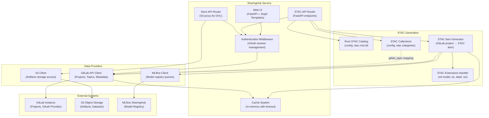
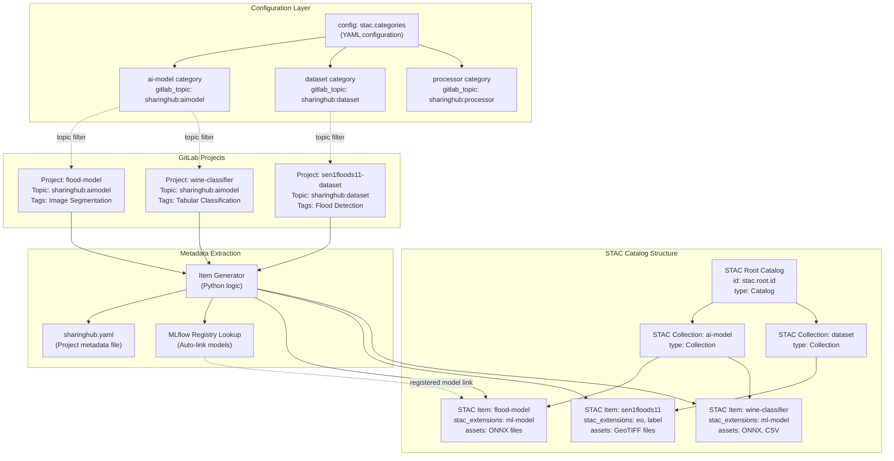
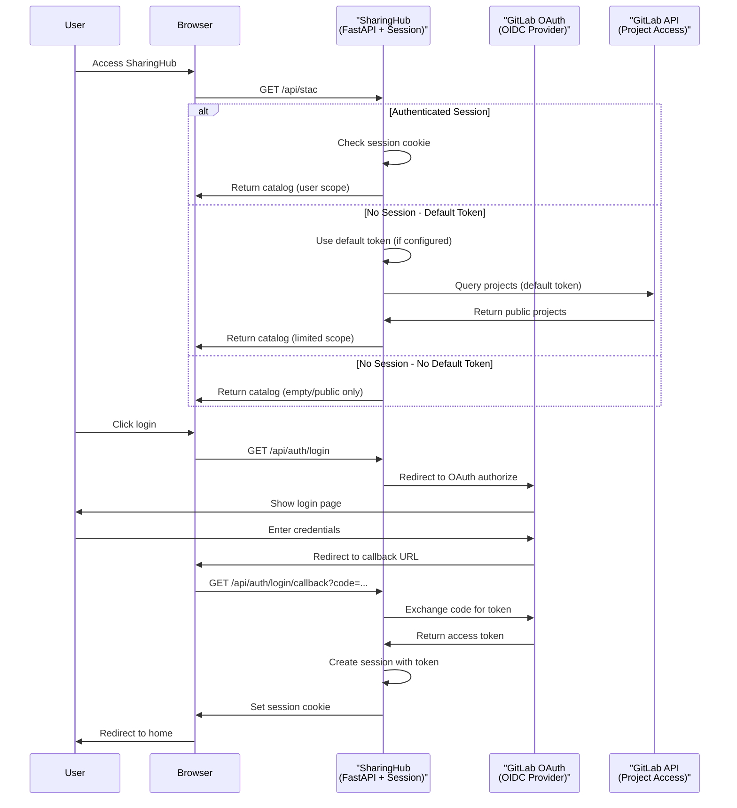
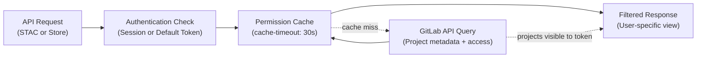
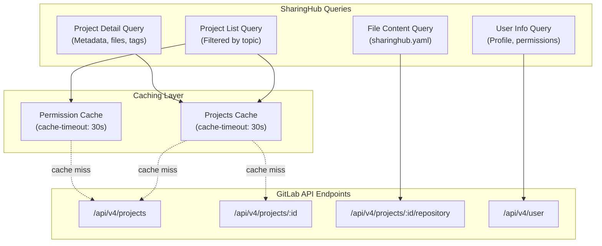
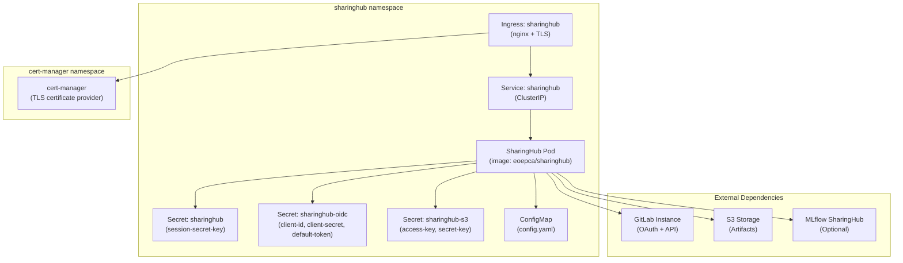

# SharingHub

<details>
<summary>Relevant source files</summary>

The following files were used as context for generating this wiki page:

- [docs/admin/configuration.md](docs/admin/configuration.md)
- [docs/admin/deployment-guide/components/sharinghub.md](docs/admin/deployment-guide/components/sharinghub.md)
- [docs/index.md](docs/index.md)

</details>


## Purpose and Scope

SharingHub is the central discovery and collaboration platform within the EOEPCA MLOps Building Block. It dynamically generates a STAC (SpatioTemporal Asset Catalog) API from GitLab projects, enabling users to discover, browse, and access AI models, datasets, and processing workflows through a standardized interface. SharingHub acts as the bridge between GitLab's project management capabilities and standardized catalog discovery protocols.

For information about deploying SharingHub, see [SharingHub Deployment](#5.3). For detailed configuration options, see [SharingHub Configuration](#6.1). For using the STAC API programmatically, see [STAC API Specification](#7.1).

**Sources:** [docs/index.md:16-29](), [docs/admin/deployment-guide/components/sharinghub.md:1-4]()

## Architecture Overview

SharingHub is a Python-based web service that integrates with GitLab to provide dynamic catalog generation. The service extracts metadata from GitLab projects and exposes them as STAC items through a standards-compliant API.

### Core Components



**Diagram: SharingHub Internal Architecture**

The service is deployed as a single Kubernetes pod running a FastAPI application. It maintains in-memory caches with configurable timeouts to optimize performance when querying GitLab and S3 resources.

**Sources:** [docs/admin/deployment-guide/components/sharinghub.md:49-215](), [docs/admin/configuration.md:8-280]()

## STAC Catalog Structure

SharingHub generates a hierarchical STAC catalog structure that maps GitLab organizational concepts to STAC entities. The catalog is dynamically created based on configuration and current GitLab project state.

### GitLab to STAC Mapping



**Diagram: STAC Catalog Generation from GitLab Projects**

The mapping process works as follows:

1. **Root Catalog**: Defined in configuration at `stac.root.id`, this is the entry point of the STAC catalog
2. **Collections (Categories)**: Each entry in `stac.categories` becomes a STAC Collection, mapped to a specific `gitlab_topic`
3. **Items**: GitLab projects with matching topics are converted to STAC Items with appropriate extensions
4. **Metadata**: Projects can include a `sharinghub.yaml` file for additional STAC metadata
5. **Auto-linking**: Registered MLflow models are automatically linked to their corresponding STAC items

**Sources:** [docs/admin/configuration.md:119-179](), [docs/admin/deployment-guide/components/sharinghub.md:68-120]()

### Category Configuration Structure

Categories are defined in the configuration file with the following structure:

| Configuration Field | Purpose | Example Value |
|-------------------|---------|---------------|
| `title` | Display name for the category | `"AI Models"` |
| `description` | Category description | `"AI models are the core..."` |
| `gitlab_topic` | GitLab topic for project filtering | `sharinghub:aimodel` |
| `logo` | URL to category logo image | `https://data.web.example.com/ai-model.jpg` |
| `icon` | URL to category icon | `https://img.icons8.com/material/24/ai.png` |
| `locales` | Translations for multi-language support | `fr: {title: "Modèles IA"}` |
| `features.map-viewer` | Enable/disable map visualization | `enable` or `disable` |
| `features.store-s3` | Enable/disable S3 store API | `enable` or `disable` |
| `features.mlflow` | Enable/disable MLflow integration | `enable` or `disable` |

**Sources:** [docs/admin/deployment-guide/components/sharinghub.md:92-120](), [docs/admin/configuration.md:142-179]()

## Authentication and Authorization

SharingHub implements a multi-layered authentication and authorization system that integrates with GitLab's OAuth provider.

### Authentication Flow



**Diagram: OAuth Authentication Flow**

### Session Management

Sessions are managed using server-side storage with signed cookies. Key configuration parameters:

- **Secret Key**: Stored in Kubernetes secret `sharinghub` with key `session-secret-key`
- **Cookie Name**: Configurable via `server.session.cookie` (default: `sharinghub-session`)
- **Domain**: Set via `server.session.domain` for cross-subdomain sessions
- **Max Age**: Session timeout in seconds via `server.session.max-age` (default: 14400 = 4 hours)

**Sources:** [docs/admin/configuration.md:49-61](), [docs/admin/deployment-guide/components/sharinghub.md:8-14]()

### Default Token Mechanism

SharingHub supports an optional default token mechanism for unauthenticated access:

1. **Configuration**: Set via Kubernetes secret `sharinghub-oidc` with key `default-token`
2. **Token Types**: Can be a GitLab Personal Access Token or Group Access Token
3. **Required Scopes**: `read_api`, `read_repository` (Group tokens require Reporter role minimum)
4. **Behavior**: When configured, unauthenticated users see projects accessible via the default token

This mechanism enables public read-only access to datasets and models while maintaining security for private resources.

**Sources:** [docs/admin/deployment-guide/components/sharinghub.md:39-45](), [docs/admin/configuration.md:111-116]()

### Permission Checking



**Diagram: Permission Checking Flow**

Each API request performs permission checking by:
1. Extracting the access token (from session or default token)
2. Checking the cache for recent permission data
3. Querying GitLab API for project visibility (on cache miss)
4. Filtering results based on user's project access rights

**Sources:** [docs/admin/configuration.md:63-86](), [docs/admin/configuration.md:88-116]()

## Core Features

### Categories and Collections

Categories map GitLab topics to STAC collections, enabling organized discovery of projects. Each category configuration includes:

- **Display metadata**: Title, description, logo, and icon
- **GitLab mapping**: `gitlab_topic` specifies which GitLab topic to filter on
- **Feature toggles**: Per-category enable/disable of map-viewer, S3 store, and MLflow
- **Localization**: Multi-language support via `locales` field

Example from configuration:

```yaml
categories:
  - ai-model:
      title: "AI Models"
      gitlab_topic: sharinghub:aimodel
      features:
        map-viewer: enable
        store-s3: enable
        mlflow: enable
```

**Sources:** [docs/admin/configuration.md:119-179]()

### Tags System

Tags provide fine-grained classification within categories. The configuration defines tag sections that organize related keywords:

| Configuration Path | Purpose |
|-------------------|---------|
| `tags.gitlab.minimum_count` | Minimum projects for a tag to appear |
| `tags.sections[].name` | Section name (e.g., "Computer Vision") |
| `tags.sections[].enabled_for` | Which categories show this section |
| `tags.sections[].keywords` | List of tag keywords in this section |

Tags are mapped from GitLab project topics and displayed in the web UI's left panel for filtering.

**Sources:** [docs/admin/configuration.md:235-264]()

### S3 Store API

When enabled, the Store API provides an S3-compatible interface that allows DVC (Data Version Control) to store and retrieve data artifacts. This feature:

- **URL Configuration**: Set via `services.store.url` and `services.store.mode`
- **Access Control**: Checks GitLab project permissions before granting S3 access
- **S3 Backend**: Requires configuration of `s3.bucket`, `s3.region`, `s3.endpoint`
- **Credentials**: Stored in Kubernetes secret `sharinghub-s3` with keys `access-key` and `secret-key`
- **Per-Category**: Can be enabled/disabled via `features.store-s3` in category config

The Store API acts as a proxy, translating DVC's S3 requests to the configured S3 backend while enforcing GitLab-based access control.

**Sources:** [docs/admin/configuration.md:208-233]()

### MLflow Integration

SharingHub integrates with MLflow SharingHub to provide experiment tracking and model registry features:

| Integration Type | Configuration | Description |
|-----------------|---------------|-------------|
| `mlflow-sharinghub` | **Recommended** | Custom MLflow with SharingHub permission checking |
| `mlflow` | Basic setup | Standard MLflow instance without authentication |
| `gitlab` | GitLab ML Tracking | Uses GitLab's built-in ML tracking features |

Configuration example:

```yaml
mlflow:
  type: mlflow-sharinghub
  url: https://sharinghub.example.com/mlflow
```

When `mlflow-sharinghub` is configured:
- Per-project tracking URIs are generated from GitLab project paths
- Permission checks are delegated to SharingHub
- Registered models are automatically linked to STAC items
- Model artifacts are exposed as STAC assets

**Sources:** [docs/admin/configuration.md:186-206]()

## Integration Points

### GitLab API Integration



**Diagram: GitLab API Integration Points**

SharingHub queries GitLab through the following patterns:

1. **Topic-based filtering**: Projects are discovered using the `topic` parameter matching `gitlab_topic` from category config
2. **Metadata extraction**: Project descriptions, README files, and optional `sharinghub.yaml` files provide STAC metadata
3. **Access control**: User permissions from GitLab determine project visibility in the catalog
4. **Ignored topics**: Topics listed in `gitlab.ignore.topics` are filtered from tag lists

**Sources:** [docs/admin/configuration.md:88-116]()

### STAC Extensions Support

SharingHub declares support for multiple STAC extensions in its configuration:

| Extension | Schema URL | Use Case |
|-----------|------------|----------|
| `ml-model` | `https://stac-extensions.github.io/ml-model/v1.0.0/schema.json` | AI models with training details |
| `eo` | `https://stac-extensions.github.io/eo/v1.1.0/schema.json` | Earth observation datasets |
| `label` | `https://stac-extensions.github.io/label/v1.0.1/schema.json` | Labeled training data |
| `sci` | `https://stac-extensions.github.io/scientific/v1.0.0/schema.json` | Scientific datasets |

Extensions are declared in `stac.extensions` configuration and included in the root catalog's `stac_extensions` field.

**Sources:** [docs/admin/deployment-guide/components/sharinghub.md:79-83](), [docs/admin/configuration.md:129-133]()

## API Endpoints

SharingHub exposes several API endpoint groups:

### STAC API Endpoints

| Endpoint Pattern | Purpose | STAC Conformance |
|-----------------|---------|------------------|
| `/api/stac` | Root STAC catalog | Catalog |
| `/api/stac/collections` | List all collections | OGC API - Features Part 1 |
| `/api/stac/collections/{collection_id}` | Collection detail | Collection |
| `/api/stac/collections/{collection_id}/items` | List items in collection | Items |
| `/api/stac/collections/{collection_id}/items/{item_id}` | Item detail | Item |

### Store API Endpoints

When S3 store is enabled (`features.store-s3: enable`):

| Endpoint Pattern | Purpose |
|-----------------|---------|
| `/api/store/{project_path}` | S3-compatible storage for DVC |

### Authentication Endpoints

| Endpoint | Purpose |
|----------|---------|
| `/api/auth/login` | Initiate OAuth flow with GitLab |
| `/api/auth/login/callback` | OAuth callback handler |
| `/api/auth/logout` | Clear session and logout |
| `/api/auth/user` | Get current user info |

**Sources:** [docs/admin/deployment-guide/components/sharinghub.md:1-215](), [docs/admin/configuration.md:1-280]()

## Deployment Architecture

SharingHub is deployed as a Kubernetes pod with the following characteristics:

### Container Image

- **Repository**: `eoepca/sharinghub`
- **Base**: Python FastAPI application
- **Source**: [github.com/csgroup-oss/sharinghub](https://github.com/csgroup-oss/sharinghub)

### Kubernetes Resources



**Diagram: SharingHub Kubernetes Deployment**

### Configuration Management

- **Helm Chart**: Located in `deploy/helm/sharinghub` of the SharingHub repository
- **Values**: Main configuration is in `config` field as YAML string
- **Secrets**: Sensitive data managed via Kubernetes secrets
- **ArgoCD**: GitOps-style deployment recommended

**Sources:** [docs/admin/deployment-guide/components/sharinghub.md:1-215]()

### Ingress Configuration

The ingress configuration includes:

- **TLS Termination**: Automated via cert-manager with Let's Encrypt
- **Annotations**: 
  - `cert-manager.io/cluster-issuer: letsencrypt-prod` for certificate provisioning
  - `nginx.ingress.kubernetes.io/ssl-redirect: "true"` to enforce HTTPS
  - `nginx.ingress.kubernetes.io/proxy-body-size: 10g` to allow large artifact uploads

**Sources:** [docs/admin/deployment-guide/components/sharinghub.md:168-183]()

## Performance Considerations

### Caching Strategy

SharingHub implements aggressive caching to minimize GitLab API calls:

| Cache Type | Configuration Path | Default Timeout | Cached Data |
|-----------|-------------------|----------------|-------------|
| Project List | `stac.projects.cache-timeout` | 30s | Project discovery results |
| Permission Check | `checker.cache-timeout` | 30s | User permission validation |
| S3 Access | `s3.check-access.cache-timeout` | 30s | S3 bucket access rights |

Cache can be disabled for debugging via `server.cache: false`, though this significantly impacts performance.

**Sources:** [docs/admin/configuration.md:63-86]()

### Resource Requirements

While not explicitly documented in the provided files, typical resource requirements include:

- Memory for in-memory caching of GitLab responses
- CPU for STAC item generation and JSON serialization
- Network bandwidth for GitLab API communication

The stateless design allows horizontal scaling by deploying multiple pods behind a load balancer.

**Sources:** [docs/admin/deployment-guide/components/sharinghub.md:49-215]()