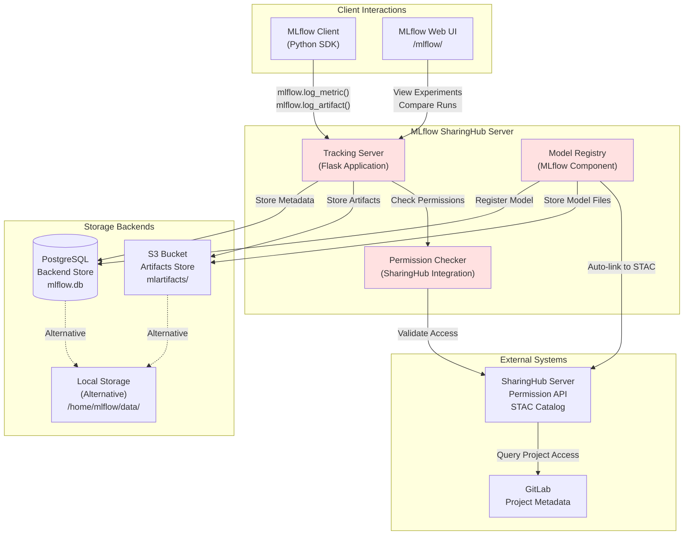
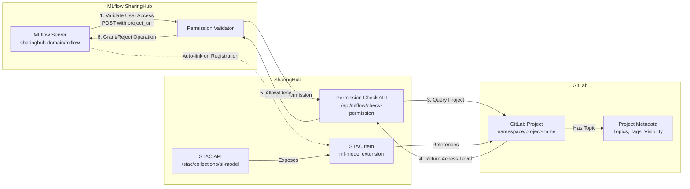
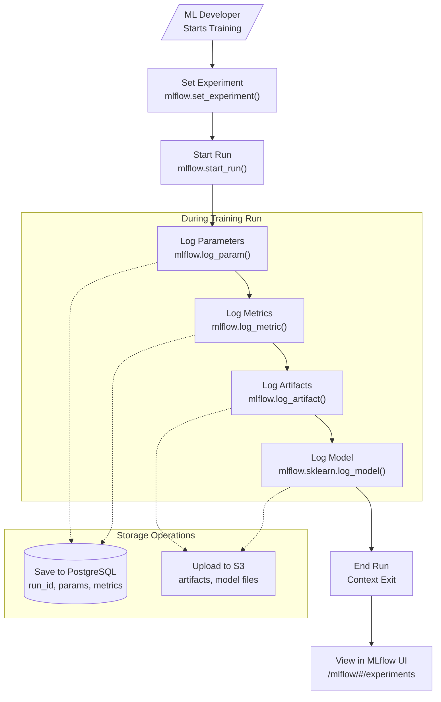
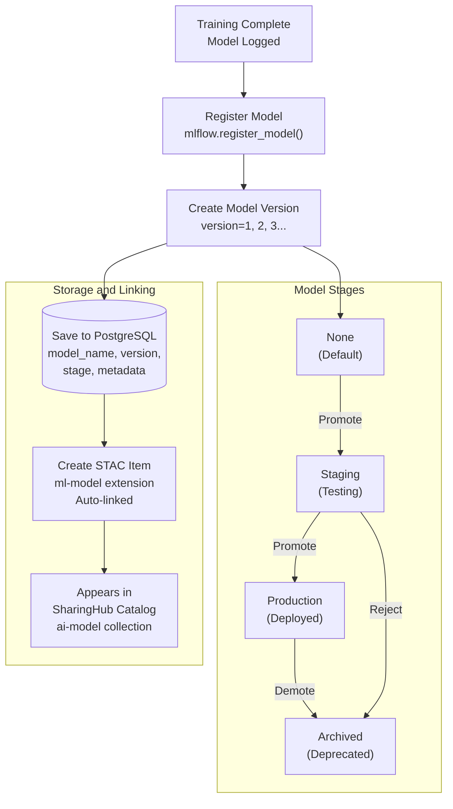
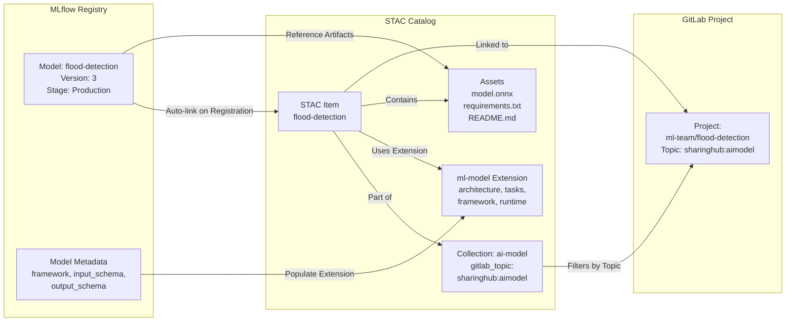
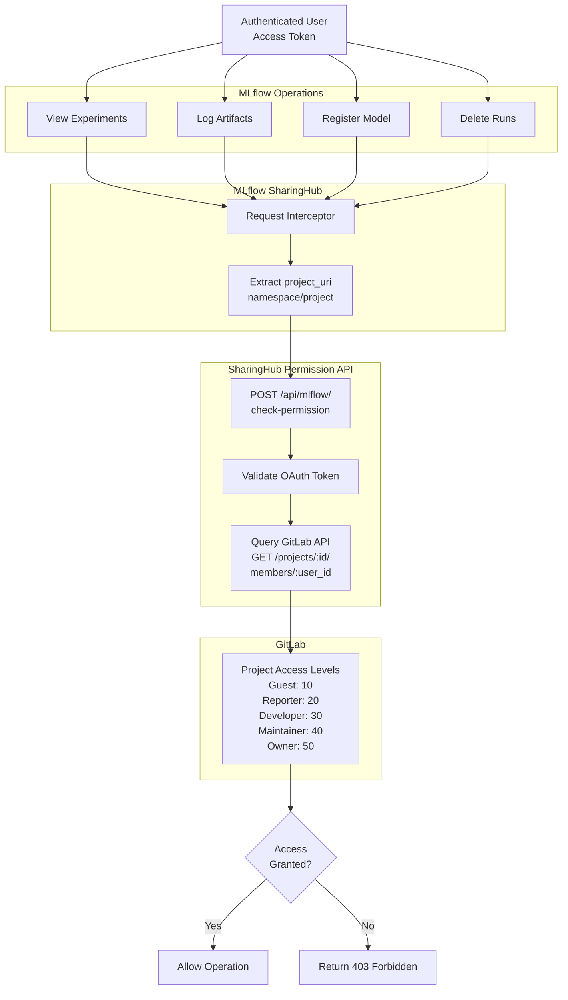
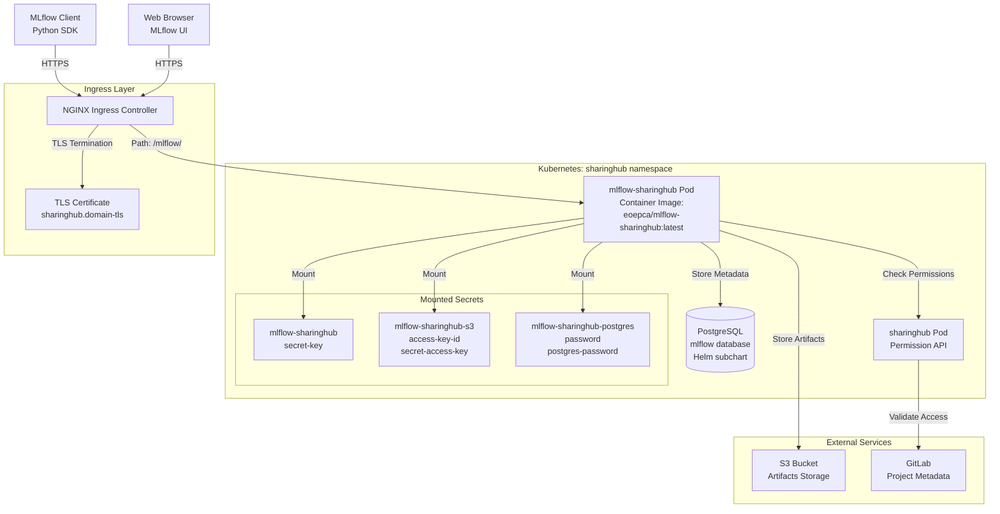

# MLflow SharingHub

<details>
<summary>Relevant source files</summary>

The following files were used as context for generating this wiki page:

- [docs/admin/configuration.md](docs/admin/configuration.md)
- [docs/admin/deployment-guide/components/mlflow-sharinghub.md](docs/admin/deployment-guide/components/mlflow-sharinghub.md)
- [docs/index.md](docs/index.md)

</details>


## Purpose and Scope

MLflow SharingHub is a customized MLflow server that provides experiment tracking and model registry capabilities for the EOEPCA MLOps Building Block. This page describes its architecture, integration with SharingHub for permission management, storage backends, and its role in the model development lifecycle.

For deployment instructions, see [MLflow SharingHub Deployment](#5.4). For configuration details, see [MLflow SharingHub Configuration](#6.2).

## Overview

MLflow SharingHub extends the standard MLflow tracking server with GitLab project-based access control and automatic integration with the SharingHub STAC catalog. It serves as the central experiment tracking system where ML developers log training runs, metrics, parameters, and artifacts. When models are registered in the MLflow model registry, they are automatically linked to corresponding STAC items in SharingHub, enabling seamless discovery and consumption.

**Key Capabilities:**

- **Experiment Tracking:** Log metrics, parameters, artifacts, and model files from training runs
- **Model Registry:** Version and manage production-ready models with lifecycle stages
- **Permission Integration:** Delegate access control to SharingHub based on GitLab project permissions
- **STAC Auto-linking:** Automatically associate registered models with STAC items for discovery
- **Multi-project Support:** Project-specific tracking URIs mapped from GitLab project paths

Sources: [docs/index.md:16-28](), [docs/admin/configuration.md:282-297]()

## Architecture

### Component Structure

MLflow SharingHub consists of several integrated components working together to provide experiment tracking and model registry functionality:



**MLflow SharingHub Server Components:**

- **Tracking Server:** Core Flask application that implements the MLflow Tracking API, handling experiment logging and artifact storage
- **Model Registry:** MLflow component managing model versions, stages (Staging, Production, Archived), and metadata
- **Permission Checker:** Custom integration layer that validates user access against SharingHub's permission API before allowing operations

Sources: [docs/admin/deployment-guide/components/mlflow-sharinghub.md:1-111](), [docs/admin/configuration.md:281-358]()

### Storage Backends

MLflow SharingHub uses a dual-storage architecture separating metadata from artifacts:

| Storage Type | Purpose | Default | Production Recommendation |
|--------------|---------|---------|---------------------------|
| **Backend Store** | Experiment metadata, run parameters, metrics, tags | SQLite at `/home/mlflow/data/mlflow.db` | PostgreSQL with dedicated instance |
| **Artifacts Store** | Model files, datasets, plots, logs, arbitrary files | Local directory at `/home/mlflow/data/mlartifacts` | S3-compatible object storage |

#### Backend Store Configuration

**SQLite (Default):**
```yaml
# No configuration needed - uses local file
# Location: /home/mlflow/data/mlflow.db
```

**PostgreSQL (Recommended):**

Create secret with database credentials:
```bash
kubectl create secret generic mlflow-sharinghub-postgres \
  --from-literal password="<mlflow-user-password>" \
  --from-literal postgres-password="<root-user-password>" \
  --namespace sharinghub
```

Configure deployment values [docs/admin/deployment-guide/components/mlflow-sharinghub.md:87-90]():
```yaml
postgresql:
  enabled: true
  auth:
    existingSecret: mlflow-sharinghub-postgres
```

For external PostgreSQL instance [docs/admin/configuration.md:325-333]():
```yaml
mlflowSharinghub:
  backendStoreUriSecret: true
  # Secret must contain key: backend-store-uri
  # Format: postgresql://<user>:<password>@<host>:5432/<database>
```

#### Artifacts Store Configuration

**Local Storage (Default):**
```yaml
# No configuration needed - uses local directory
# Location: /home/mlflow/data/mlartifacts
```

**S3 (Recommended):**

Create S3 credentials secret [docs/admin/deployment-guide/components/mlflow-sharinghub.md:22-25]():
```bash
kubectl create secret generic mlflow-sharinghub-s3 \
  --from-literal access-key-id="<access-key>" \
  --from-literal secret-access-key="<secret-key>" \
  --namespace sharinghub
```

Configure deployment values [docs/admin/deployment-guide/components/mlflow-sharinghub.md:52-60]():
```yaml
mlflowSharinghub:
  artifactsDestination: s3://<bucket>

s3:
  enabled: true
  endpointUrl: https://<s3-endpoint>
```

Sources: [docs/admin/configuration.md:299-358](), [docs/admin/deployment-guide/components/mlflow-sharinghub.md:19-25]()

### Integration Points



**Integration Flow:**

1. **Permission Validation:** Before any MLflow operation (logging experiments, viewing runs, registering models), MLflow SharingHub sends a permission check request to SharingHub
2. **Project Access Query:** SharingHub validates the user's access level to the corresponding GitLab project based on the `project_uri`
3. **GitLab Authorization:** SharingHub queries GitLab to determine if the authenticated user has sufficient permissions for the requested operation
4. **Operation Authorization:** Based on GitLab's response, the operation is either allowed or denied
5. **STAC Auto-linking:** When a model is registered, MLflow SharingHub notifies SharingHub to create or update the corresponding STAC item with model metadata

Sources: [docs/admin/configuration.md:283-297](), [docs/admin/deployment-guide/components/mlflow-sharinghub.md:52-56]()

## Experiment Tracking

### Project-based Tracking URIs

MLflow SharingHub implements project-specific tracking URIs that map directly to GitLab project paths. This ensures experiments are organized by project and access control is enforced at the project level.

**Tracking URI Format:**
```
https://sharinghub.<domain>/mlflow/<namespace>/<project-name>
```

**Example:**
```python
import mlflow

# Set tracking URI for specific project
mlflow.set_tracking_uri("https://sharinghub.example.com/mlflow/ml-team/flood-detection")

# Create or set experiment
mlflow.set_experiment("flood-model-training")

# Log training run
with mlflow.start_run():
    mlflow.log_param("learning_rate", 0.001)
    mlflow.log_metric("accuracy", 0.95)
    mlflow.log_artifact("model.onnx")
```

The `<namespace>/<project-name>` segment must correspond to an existing GitLab project with the topic `sharinghub:aimodel` to be eligible for MLflow tracking.

### Experiment Lifecycle



**Key Functions:**

- `mlflow.set_experiment(name)`: Creates or retrieves an experiment within the project
- `mlflow.start_run()`: Begins a new training run with unique `run_id`
- `mlflow.log_param(key, value)`: Records hyperparameters (immutable)
- `mlflow.log_metric(key, value, step)`: Records performance metrics (can be updated)
- `mlflow.log_artifact(path)`: Uploads files (plots, datasets, etc.)
- `mlflow.<framework>.log_model()`: Logs model with framework-specific metadata

Sources: [docs/admin/configuration.md:295-297]()

## Model Registry

### Registration and Versioning

The MLflow Model Registry provides centralized model versioning and lifecycle management:



**Registration Example:**
```python
# Option 1: Register from run
mlflow.register_model(
    model_uri="runs:/<run_id>/model",
    name="flood-detection-model"
)

# Option 2: Register from artifact path
mlflow.register_model(
    model_uri="s3://bucket/path/to/model",
    name="flood-detection-model"
)
```

**Model Versioning:**

Each registration creates a new version (1, 2, 3...) under the model name. Versions are immutable but can transition through lifecycle stages.

### STAC Integration and Discovery

When a model is registered in MLflow SharingHub, it automatically creates or updates a STAC item in the SharingHub catalog:



**STAC Item Structure for Registered Models:**

The STAC item includes the `ml-model` extension with metadata extracted from the MLflow model:

- **Model artifacts:** ONNX files, serialized models, prediction scripts
- **Framework metadata:** sklearn, pytorch, tensorflow version information  
- **Input/output schemas:** Expected data types and shapes
- **Model architecture:** Network structure for deep learning models
- **Task type:** Classification, regression, segmentation, etc.

This auto-linking enables models registered in MLflow to be immediately discoverable through the SharingHub STAC API and web interface.

Sources: [docs/admin/configuration.md:295-297]()

## Permission Model

### SharingHub Permission Integration

MLflow SharingHub delegates all permission checks to SharingHub, which in turn validates against GitLab project permissions. This creates a unified authorization model across the platform:



**Permission Levels:**

| GitLab Access Level | View Experiments | Log Runs | Register Models | Delete Runs |
|---------------------|------------------|----------|-----------------|-------------|
| **Guest (10)** | ✓ | ✗ | ✗ | ✗ |
| **Reporter (20)** | ✓ | ✗ | ✗ | ✗ |
| **Developer (30)** | ✓ | ✓ | ✓ | ✗ |
| **Maintainer (40)** | ✓ | ✓ | ✓ | ✓ |
| **Owner (50)** | ✓ | ✓ | ✓ | ✓ |

### Configuration

The SharingHub integration is configured via deployment values [docs/admin/deployment-guide/components/mlflow-sharinghub.md:52-56]():

```yaml
mlflowSharinghub:
  sharinghubUrl: https://sharinghub.<domain-name>
  sharinghubStacCollection: "ai-model"
  sharinghubAuthDefaultToken: false
```

**Configuration Parameters:**

- `sharinghubUrl`: Base URL of the SharingHub instance for permission API calls
- `sharinghubStacCollection`: STAC collection ID where models must be registered (restricts MLflow usage to projects in this collection)
- `sharinghubAuthDefaultToken`: Set to `false` if SharingHub has a default token configured, enabling read-only access to public projects without authentication

Sources: [docs/admin/configuration.md:283-297]()

## Deployment Architecture

MLflow SharingHub is deployed in the `sharinghub` namespace alongside SharingHub itself, sharing infrastructure and networking:



**Deployment Configuration:**

The ArgoCD Application manifest deploys MLflow SharingHub from the Helm chart repository [docs/admin/deployment-guide/components/mlflow-sharinghub.md:29-96]():

```yaml
apiVersion: argoproj.io/v1alpha1
kind: Application
metadata:
  name: mlflow-sharinghub
  namespace: argocd
spec:
  destination:
    namespace: sharinghub
    server: https://kubernetes.default.svc
  source:
    repoURL: https://github.com/csgroup-oss/mlflow-sharinghub.git
    path: deploy/helm/mlflow-sharinghub
    targetRevision: "0.2.0"
```

**Key Deployment Values:**

- **Image:** `eoepca/mlflow-sharinghub:latest` [docs/admin/deployment-guide/components/mlflow-sharinghub.md:48-50]()
- **Ingress Path:** `/mlflow/` with URL rewrite to `/` [docs/admin/deployment-guide/components/mlflow-sharinghub.md:75-82]()
- **Pod Security:** `fsGroup: 999` for PostgreSQL volume permissions [docs/admin/deployment-guide/components/mlflow-sharinghub.md:65-66]()
- **Body Size:** 10GB limit for large artifact uploads [docs/admin/deployment-guide/components/mlflow-sharinghub.md:74]()

Sources: [docs/admin/deployment-guide/components/mlflow-sharinghub.md:1-111]()

## API and Interfaces

### MLflow Tracking API

MLflow SharingHub exposes the standard MLflow Tracking API at `https://sharinghub.<domain>/mlflow/`:

**Key Endpoints:**

| Endpoint | Method | Purpose |
|----------|--------|---------|
| `/api/2.0/mlflow/experiments/create` | POST | Create new experiment |
| `/api/2.0/mlflow/runs/create` | POST | Start new training run |
| `/api/2.0/mlflow/runs/log-parameter` | POST | Log hyperparameter |
| `/api/2.0/mlflow/runs/log-metric` | POST | Log performance metric |
| `/api/2.0/mlflow/runs/log-artifact` | POST | Upload artifact file |
| `/api/2.0/mlflow/model-versions/create` | POST | Register new model version |
| `/api/2.0/mlflow/model-versions/update` | PATCH | Update model stage |

All endpoints require authentication via OAuth token and permission validation via SharingHub.

### Web Interface

The MLflow UI is accessible at `https://sharinghub.<domain>/mlflow/` and provides:

- **Experiments View:** Browse and compare training runs, visualize metrics
- **Run Details:** Inspect parameters, metrics, artifacts, and model outputs
- **Model Registry:** View registered models, versions, and lifecycle stages
- **Comparison Tools:** Compare multiple runs side-by-side with metric charts
- **Artifact Browser:** Download logged files, models, and datasets

The UI respects the same permission model as the API, showing only experiments and models the authenticated user has access to.

### Python Client Usage

```python
import mlflow

# Configure tracking URI
mlflow.set_tracking_uri("https://sharinghub.example.com/mlflow/ml-team/my-project")

# Set experiment
mlflow.set_experiment("model-training")

# Start run and log
with mlflow.start_run() as run:
    # Log parameters
    mlflow.log_param("epochs", 10)
    mlflow.log_param("batch_size", 32)
    
    # Log metrics
    for epoch in range(10):
        mlflow.log_metric("loss", loss_value, step=epoch)
        mlflow.log_metric("accuracy", acc_value, step=epoch)
    
    # Log model
    mlflow.sklearn.log_model(model, "model")
    
    # Register model
    mlflow.register_model(
        model_uri=f"runs:/{run.info.run_id}/model",
        name="my-model"
    )
```

Sources: [docs/admin/configuration.md:286-297]()

---

**Related Pages:**

- For SharingHub configuration and STAC catalog generation, see [SharingHub](#3.2)
- For GitLab project setup and topics configuration, see [GitLab](#3.1)
- For deployment instructions, see [MLflow SharingHub Deployment](#5.4)
- For complete configuration reference, see [MLflow SharingHub Configuration](#6.2)
- For model training workflow examples, see [Model Training Workflow](#4.1)