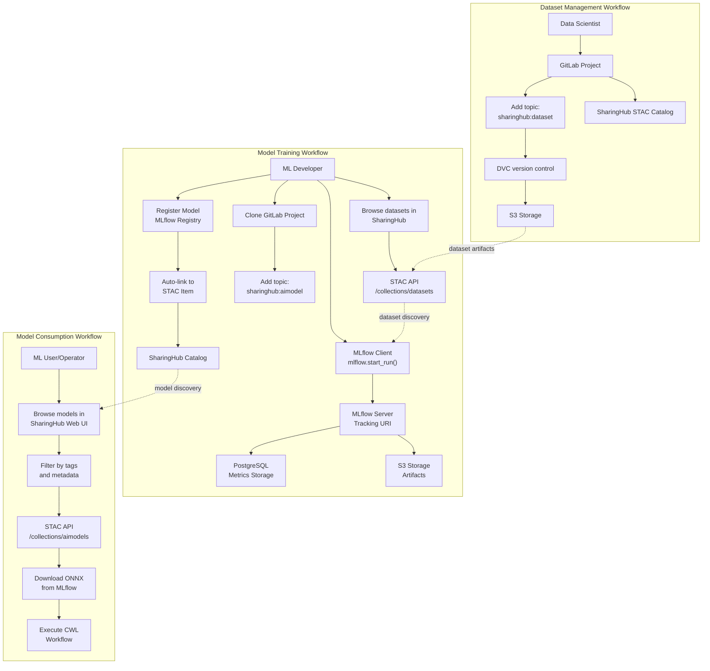
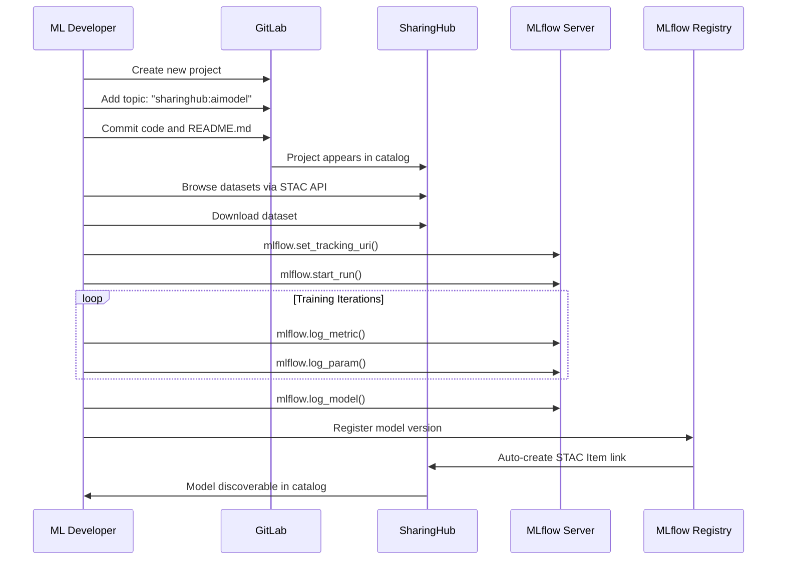
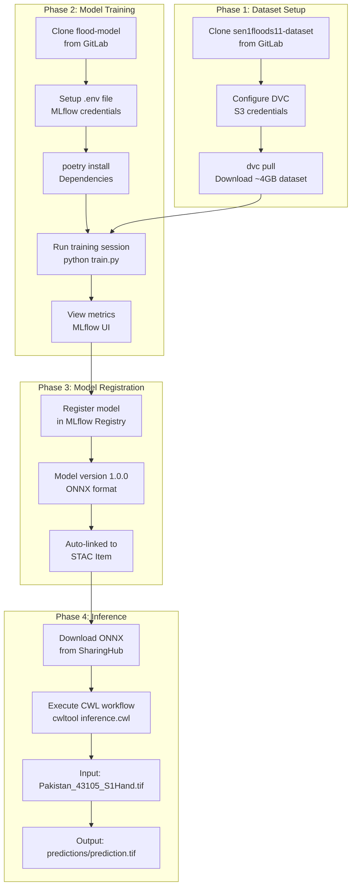
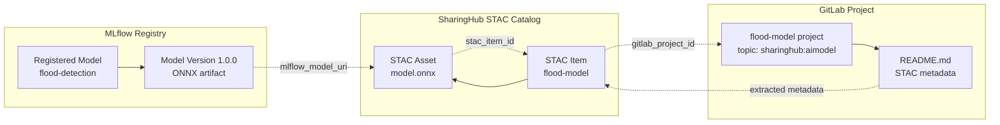
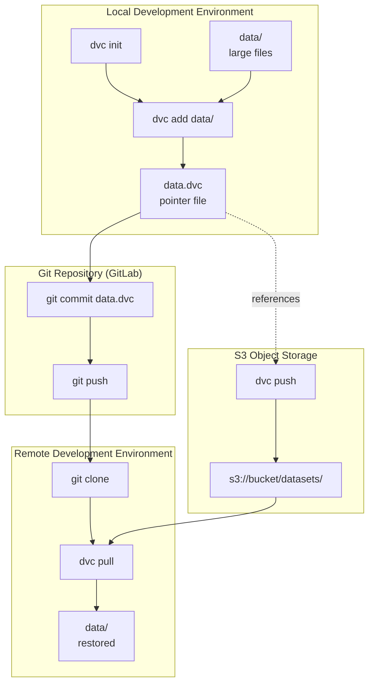

# Workflows and Scenarios

Relevant source files

The following files were used as context for generating this wiki page:

- [docs/design/diagrams/use-cases.drawio.png](docs/design/diagrams/use-cases.drawio.png)
- [docs/design/scenarios/flood-example.md](docs/design/scenarios/flood-example.md)
- [docs/design/scenarios/model-training.md](docs/design/scenarios/model-training.md)
- [docs/design/use-cases.md](docs/design/use-cases.md)
- [mkdocs.yml](mkdocs.yml)

## Purpose and Scope

This section provides an overview of the practical workflows and scenarios supported by the EOEPCA MLOps Building Block. It describes how the three core components—GitLab, SharingHub, and MLflow SharingHub—work together to support end-to-end machine learning operations, from dataset preparation through model training to model deployment and sharing.

The workflows are organized by activity type:
- **Model Training Workflow**: Complete lifecycle from project creation to model registration (detailed in [Model Training Workflow](#4.1))
- **Dataset Management**: Versioning and sharing datasets using DVC and GitLab (detailed in [Dataset Management](#4.2))
- **End-to-End Examples**: Practical implementations like flood detection (detailed in [Flood Detection Example](#4.3))

For architectural details about the individual components, see [Core Components](#3). For API-level interactions, see [API Reference](#7).

Sources: [docs/design/scenarios/model-training.md:1-53](), [docs/design/use-cases.md:1-96](), [mkdocs.yml:14-16]()

## User Personas

The MLOps Building Block supports three primary user personas, each with distinct workflows and interaction patterns:

| Persona | Primary Activities | Main Components Used | Key Objectives |
|---------|-------------------|---------------------|----------------|
| **ML Developer** | Model development, training, experimentation | GitLab, MLflow client, SharingHub STAC API | Train and register production-ready models |
| **Data Scientist** | Dataset creation, versioning, curation | GitLab, DVC, SharingHub | Publish and share versioned datasets |
| **ML User/Operator** | Model discovery, deployment, inference | SharingHub Web UI, STAC API, CWL | Find and use models for operational tasks |

Each persona interacts with the platform differently, but their workflows are interconnected through shared artifacts and metadata.

Sources: [docs/design/scenarios/model-training.md:7-8](), [docs/design/use-cases.md:16-96]()

## Workflow Overview

The following diagram illustrates the high-level interactions across all three workflow types, showing how artifacts flow through the system from creation to consumption.

This diagram shows the complete data flow from dataset creation through model training to operational deployment. Each workflow produces artifacts that feed into subsequent workflows, creating a continuous MLOps pipeline.

Sources: [docs/design/scenarios/model-training.md:1-53](), [docs/design/use-cases.md:1-96]()

## Model Training Workflow Overview

The model training workflow encompasses the complete lifecycle of developing and registering an AI model. This workflow is detailed in [Model Training Workflow](#4.1), but the key stages are:

**Key Steps:**

1. **Project Creation**: Create a GitLab project and tag it with the `sharinghub:aimodel` topic
2. **Metadata Configuration**: Add STAC-compliant metadata to `README.md` including model description, input/output schemas
3. **Dataset Discovery**: Use SharingHub's STAC API to find and retrieve training datasets
4. **Training Setup**: Configure MLflow client with tracking URI from SharingHub
5. **Experiment Tracking**: Log metrics, parameters, and artifacts using `mlflow.log_*()` functions
6. **Model Evaluation**: Review performance metrics in MLflow UI
7. **Model Registration**: Register the final model in MLflow Registry, which automatically creates STAC metadata links

For detailed step-by-step instructions, see [Model Training Workflow](#4.1).

Sources: [docs/design/scenarios/model-training.md:11-53](), [docs/design/use-cases.md:17-69]()

## Dataset Management Workflow Overview

The dataset management workflow focuses on versioning, storing, and sharing large datasets efficiently. This workflow is detailed in [Dataset Management](#4.2), but the core pattern involves:

```mermaid
graph LR
    subgraph "Dataset Creation"
        CREATE["Create GitLab Project"]
        TOPIC["Add topic:<br/>sharinghub:dataset"]
        README["Document in README.md"]
        CREATE --> TOPIC
        TOPIC --> README
    end
    
    subgraph "Version Control with DVC"
        INIT["dvc init"]
        ADD["dvc add data/"]
        REMOTE["dvc remote add -d<br/>s3://bucket"]
        PUSH["dvc push"]
        INIT --> ADD
        ADD --> REMOTE
        REMOTE --> PUSH
    end
    
    subgraph "Git Tracking"
        COMMIT["git add .dvc files"]
        GITPUSH["git push"]
        COMMIT --> GITPUSH
    end
    
    subgraph "Discovery"
        CATALOG["SharingHub extracts metadata"]
        STACITEM["STAC Item created"]
        API["Available via STAC API<br/>/collections/datasets"]
        CATALOG --> STACITEM
        STACITEM --> API
    end
    
    README --> INIT
    PUSH --> COMMIT
    GITPUSH --> CATALOG
```

**Key Concepts:**

| Component | Purpose | Commands/Files |
|-----------|---------|----------------|
| **DVC** | Data version control | `dvc init`, `dvc add`, `dvc push`, `dvc pull` |
| **GitLab** | Metadata and pointer file storage | `.dvc` files, `dvc.yaml`, `dvc.lock` |
| **S3** | Large data file storage | Configured via `dvc remote` |
| **SharingHub** | Dataset discovery | Automatically indexes `sharinghub:dataset` projects |

The workflow ensures that large datasets (several GB) are stored efficiently in S3 while maintaining version history and metadata in GitLab. DVC tracks dataset versions through `.dvc` pointer files committed to Git, enabling reproducible model training.

For implementation details, see [Dataset Management](#4.2).

Sources: [docs/design/use-cases.md:70-96](), [docs/design/scenarios/flood-example.md:34-39]()

## End-to-End Example: Flood Detection

The flood detection example demonstrates all workflows in a complete, real-world scenario. This example is fully detailed in [Flood Detection Example](#4.3), but here's the high-level flow:

**Example Repositories:**

The flood detection example uses two GitLab projects:

- **flood-model**: `https://gitlab.develop.eoepca.org/sharinghub-test/flood-model` (mirrored at `https://github.com/EOEPCA/flood-model`)
- **sen1floods11-dataset**: `https://gitlab.develop.eoepca.org/sharinghub-test/sen1floods11-dataset` (mirrored at `https://github.com/EOEPCA/Sen1Floods11-Dataset`)

Both projects are tagged with appropriate SharingHub topics (`sharinghub:aimodel` and `sharinghub:dataset`) and appear automatically in the SharingHub catalog at `https://sharinghub.develop.eoepca.org`.

For complete step-by-step instructions, see [Flood Detection Example](#4.3).

Sources: [docs/design/scenarios/flood-example.md:1-72]()

## Component Integration Patterns

The workflows rely on specific integration patterns between components. Understanding these patterns is essential for using the platform effectively.

### GitLab Topic-Based Discovery

SharingHub automatically discovers GitLab projects based on topic tags:

| GitLab Topic | STAC Collection | Purpose |
|--------------|----------------|---------|
| `sharinghub:aimodel` | `/collections/aimodels` | ML models and training code |
| `sharinghub:dataset` | `/collections/datasets` | Training and validation datasets |
| `sharinghub:processor` | `/collections/processors` | Processing workflows and scripts |

When a project is tagged with one of these topics, it appears in the corresponding STAC collection within minutes.

### MLflow-SharingHub Linking

The MLflow SharingHub component maintains bidirectional links between MLflow models and SharingHub STAC items:

This linking happens automatically when a model is registered in MLflow Registry. The MLflow SharingHub plugin checks if the associated GitLab project exists in SharingHub and creates the appropriate STAC asset links.

### DVC Remote Storage Configuration

DVC manages large datasets by storing them in S3 while tracking metadata in Git:

The `.dvc` files contain hashes and metadata that reference the actual data in S3, enabling efficient collaboration without storing large files in Git.

Sources: [docs/design/scenarios/model-training.md:17-53](), [docs/design/scenarios/flood-example.md:34-39]()

## Workflow Prerequisites

Before executing any of the workflows, users must have:

1. **Access Credentials**:
   - GitLab account with project creation permissions
   - MLflow tracking URI and credentials (obtained from SharingHub admin)
   - S3 bucket credentials for DVC (for dataset management)

2. **Development Environment**:
   - Python 3.8+ with `mlflow` client library installed
   - DVC installed (`pip install dvc[s3]`) for dataset workflows
   - Git configured for GitLab authentication

3. **Project Configuration**:
   - `.env` file with MLflow tracking URI and credentials
   - `dvc.yaml` configuration for dataset projects
   - README.md with STAC-compliant metadata fields

4. **Network Access**:
   - Connectivity to GitLab instance (e.g., `https://gitlab.develop.eoepca.org`)
   - Access to SharingHub STAC API (e.g., `https://sharinghub.develop.eoepca.org`)
   - S3 endpoint accessibility for artifact storage

For deployment-specific prerequisites, see [Deployment Guide](#5).

Sources: [docs/design/scenarios/model-training.md:23-39](), [docs/design/scenarios/flood-example.md:31-39]()

## Workflow Outputs and Artifacts

Each workflow produces specific artifacts that are consumed by other workflows or external systems:

| Workflow | Primary Outputs | Storage Location | Access Method |
|----------|----------------|------------------|---------------|
| **Dataset Management** | Versioned datasets, `.dvc` files | S3 (data), GitLab (metadata) | `dvc pull`, STAC API |
| **Model Training** | Trained models, metrics, parameters | S3 (artifacts), PostgreSQL (metadata) | MLflow API, STAC API |
| **Model Consumption** | Inference results, predictions | Local or application-specific | Direct file access |

### STAC Metadata Structure

All outputs are described using STAC metadata, which includes:

- **Item ID**: Unique identifier (typically GitLab project ID)
- **Properties**: Model/dataset metadata, dates, versions
- **Assets**: Downloadable files (ONNX models, datasets, documentation)
- **Extensions**: STAC extensions like `ml-model` for ML-specific metadata
- **Links**: Relationships to other items (model-to-dataset, model-to-experiments)

For detailed STAC API usage, see [STAC API Specification](#7.1) and [Using the STAC API](#7.2).

Sources: [docs/design/scenarios/model-training.md:47-53](), [docs/design/use-cases.md:52-69]()