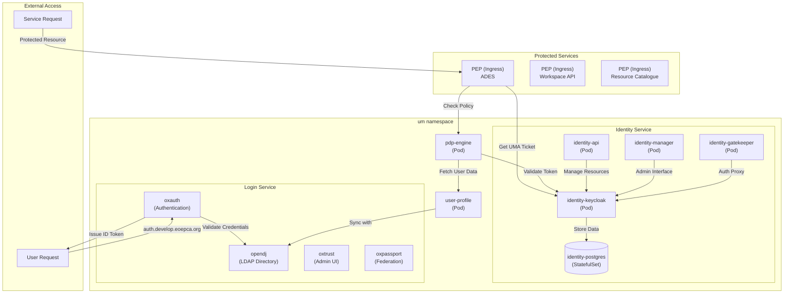
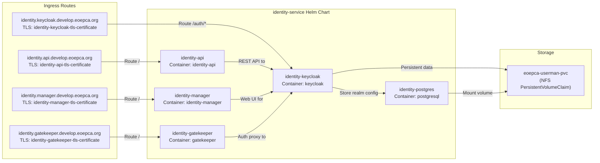
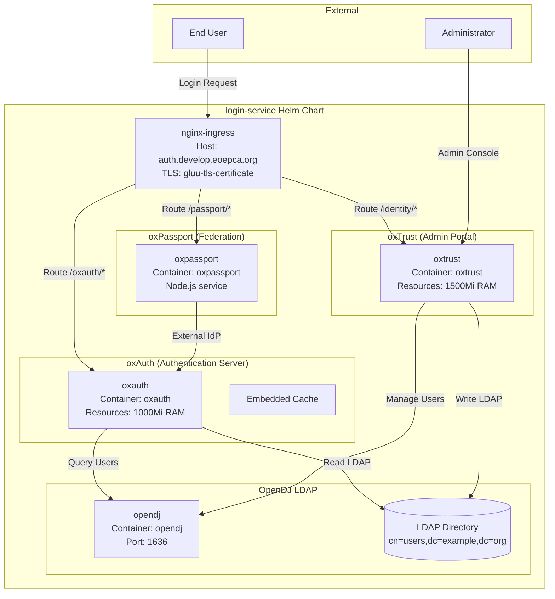
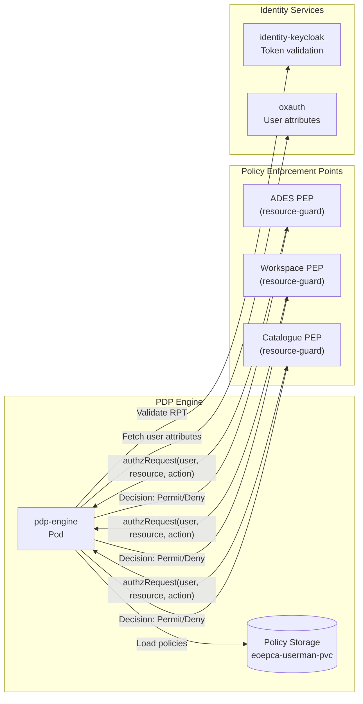
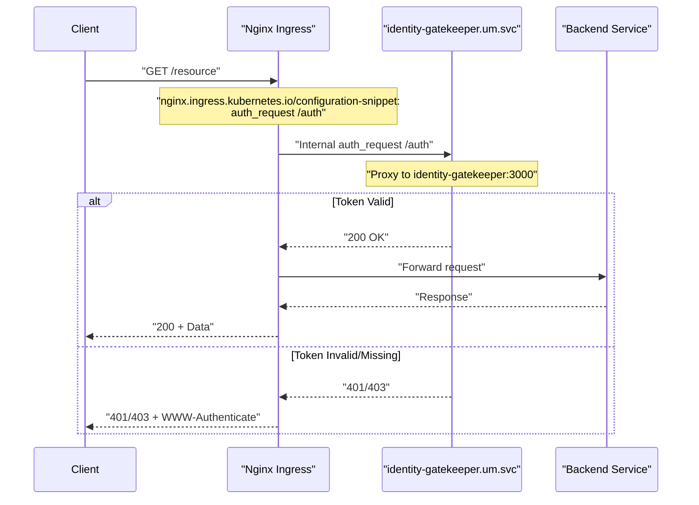
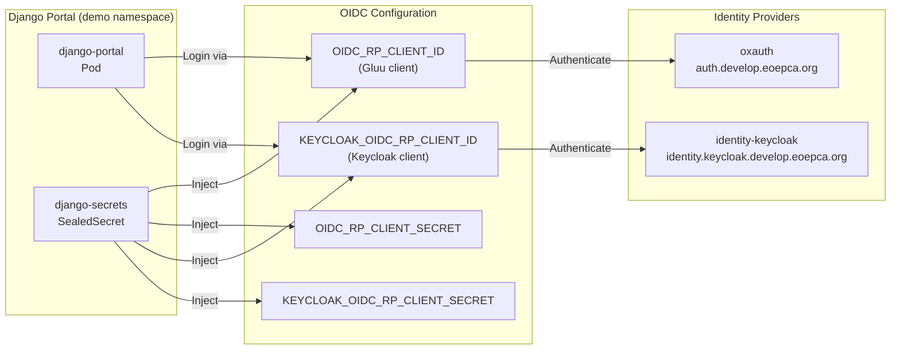
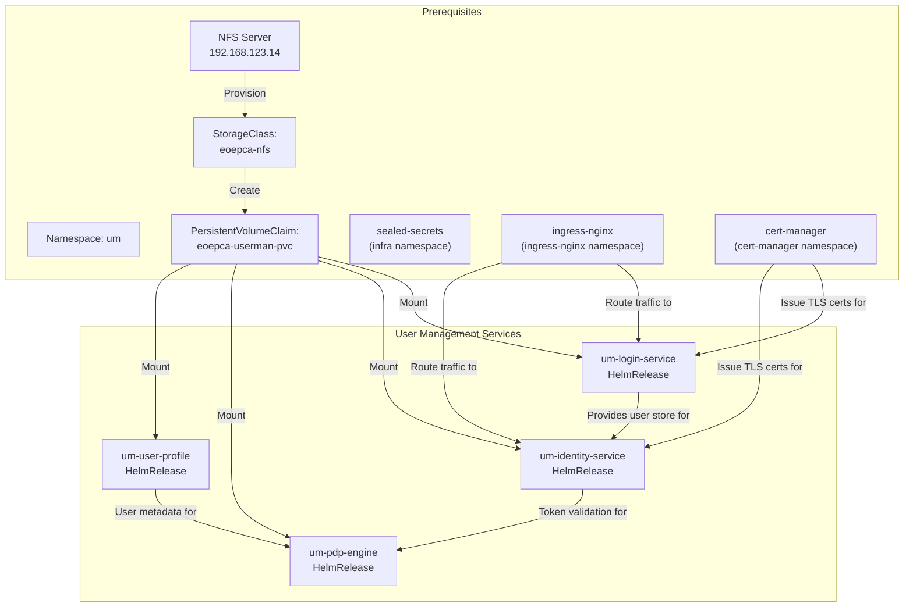

# User Management and Identity

<details>
<summary>Relevant source files</summary>

The following files were used as context for generating this wiki page:

- [system/clusters/creodias/system/demo/hr-django-portal.yaml](system/clusters/creodias/system/demo/hr-django-portal.yaml)
- [system/clusters/creodias/system/demo/hr-eoepca-portal.yaml](system/clusters/creodias/system/demo/hr-eoepca-portal.yaml)
- [system/clusters/creodias/system/demo/ss-django-secrets-create.sh](system/clusters/creodias/system/demo/ss-django-secrets-create.sh)
- [system/clusters/creodias/system/demo/ss-django-secrets.yaml](system/clusters/creodias/system/demo/ss-django-secrets.yaml)
- [system/clusters/creodias/system/storage/hr-storage.yaml](system/clusters/creodias/system/storage/hr-storage.yaml)
- [system/clusters/creodias/system/test/hr-cheese.yaml](system/clusters/creodias/system/test/hr-cheese.yaml)
- [system/clusters/creodias/system/test/identity-dummy-service-ingress.yaml](system/clusters/creodias/system/test/identity-dummy-service-ingress.yaml)
- [system/clusters/creodias/user-management/um-identity-service.yaml](system/clusters/creodias/user-management/um-identity-service.yaml)
- [system/clusters/creodias/user-management/um-login-service.yaml](system/clusters/creodias/user-management/um-login-service.yaml)
- [system/clusters/creodias/user-management/um-pdp-engine.yaml](system/clusters/creodias/user-management/um-pdp-engine.yaml)
- [system/clusters/creodias/user-management/um-user-profile.yaml](system/clusters/creodias/user-management/um-user-profile.yaml)

</details>


## Purpose and Scope

This document describes the User Management and Identity building block of the EOEPCA platform, which provides authentication and authorization capabilities for all platform services. The system implements User-Managed Access (UMA) 2.0 flows using OpenID Connect (OIDC) and enables fine-grained policy-based access control.

For detailed information on specific components, see:
- Identity Service (Keycloak) implementation: [Identity Service (Keycloak)](#4.1)
- Login Service (Gluu) implementation: [Login Service (Gluu)](#4.2)
- Policy enforcement architecture: [Policy Enforcement (PEP/PDP)](#4.3)
- Authentication flow details: [UMA Authentication Flow](#4.4)

## Architecture Overview

The User Management building block consists of four primary subsystems deployed in the `um` namespace:

| Component | Helm Chart | Primary Function |
|-----------|------------|------------------|
| Identity Service | `identity-service` | Keycloak-based identity provider, token management, UMA resource server |
| Login Service | `login-service` | Gluu-based authentication frontend with LDAP user directory |
| PDP Engine | `pdp-engine` | Policy Decision Point for authorization decisions |
| User Profile | `user-profile` | User metadata and profile management |



**Sources:** [system/clusters/creodias/user-management/um-identity-service.yaml:1-78](), [system/clusters/creodias/user-management/um-login-service.yaml:1-68](), [system/clusters/creodias/user-management/um-pdp-engine.yaml:1-28](), [system/clusters/creodias/user-management/um-user-profile.yaml:1-24]()

## Identity Service Components

The Identity Service is deployed via the `um-identity-service` HelmRelease and consists of multiple sub-components:

### Keycloak Identity Provider

The core identity provider is accessible at `identity.keycloak.develop.eoepca.org` and provides:
- UMA 2.0 resource server capabilities
- Token issuance and validation (ID tokens, access tokens, RPTs)
- Client registration and management
- Realm and user federation



**Configuration Details:**

| Component | Hostname | Purpose |
|-----------|----------|---------|
| `identity-keycloak` | `identity.keycloak.develop.eoepca.org` | Main Keycloak server, UMA endpoints at `/auth/realms/{realm}/authz/*` |
| `identity-api` | `identity.api.develop.eoepca.org` | REST API for resource registration and policy management |
| `identity-manager` | `identity.manager.develop.eoepca.org` | Administrative web interface |
| `identity-gatekeeper` | `identity.gatekeeper.develop.eoepca.org` | OAuth2 proxy for protected admin access |

**Sources:** [system/clusters/creodias/user-management/um-identity-service.yaml:22-76]()

### Persistent Storage

All Identity Service components share the `eoepca-userman-pvc` PersistentVolumeClaim, which is backed by NFS storage. This PVC is pre-created and referenced by the HelmRelease:

```yaml
volumeClaim:
  name: eoepca-userman-pvc
  create: false
```

**Sources:** [system/clusters/creodias/user-management/um-identity-service.yaml:19-21](), [system/clusters/creodias/system/storage/hr-storage.yaml:27-28]()

## Login Service Components

The Login Service is deployed via the `um-login-service` HelmRelease and provides the authentication frontend using Gluu Server 4.x components:



**Component Resource Allocations:**

| Component | CPU Request | Memory Request | Purpose |
|-----------|-------------|----------------|---------|
| `opendj` | 100m | 300Mi | LDAP directory for user credentials and attributes |
| `oxauth` | 100m | 1000Mi | OAuth2/OIDC authentication server |
| `oxtrust` | 100m | 1500Mi | Administrative web interface for user/client management |
| `oxpassport` | 100m | 100Mi | External identity provider federation (optional) |

**Sources:** [system/clusters/creodias/user-management/um-login-service.yaml:23-56]()

### Domain Configuration

The Login Service is configured with the domain `auth.develop.eoepca.org` and requires the `nginxIp` parameter for proper routing:

```yaml
global:
  domain: auth.develop.eoepca.org
  nginxIp: 185.52.192.231
  namespace: um
```

This configuration ensures all Gluu components are accessible under a unified domain with proper ingress routing.

**Sources:** [system/clusters/creodias/user-management/um-login-service.yaml:19-56]()

## Policy Decision Point

The `pdp-engine` provides the Policy Decision Point (PDP) that makes authorization decisions based on XACML policies. It is deployed in the `um` namespace and integrates with both the Identity Service and Login Service:



**Configuration:**

The PDP Engine shares the same persistent volume and domain configuration as other user management components:

```yaml
global:
  nginxIp: 185.52.192.231
  domain: auth.develop.eoepca.org
volumeClaim:
  name: eoepca-userman-pvc
  create: false
```

**Sources:** [system/clusters/creodias/user-management/um-pdp-engine.yaml:1-28]()

## User Profile Service

The `user-profile` service manages user metadata and profile information, acting as a bridge between the Identity Service and the Login Service:

```yaml
global:
  domain: auth.develop.eoepca.org
  nginxIp: 185.52.192.231
volumeClaim:
  name: eoepca-userman-pvc
  create: false
```

This service synchronizes user profile data from the LDAP directory (OpenDJ) and makes it available to other EOEPCA components that require user context.

**Sources:** [system/clusters/creodias/user-management/um-user-profile.yaml:1-24]()

## Policy Enforcement Integration

Policy Enforcement Points (PEPs) are integrated into EOEPCA services via Nginx Ingress annotations. The following example shows how a test service is protected:



**Nginx Configuration Snippet:**

The ingress configuration includes an internal authentication request to the `identity-gatekeeper` service:

```yaml
nginx.ingress.kubernetes.io/configuration-snippet: |
  auth_request /auth;
  # Preflighted requests
  if ($request_method = OPTIONS ) {
    return 200;
  }
  add_header Access-Control-Allow-Origin $http_origin always;
  add_header Access-Control-Allow-Methods "*";
  add_header Access-Control-Allow-Headers "Authorization, Origin, Content-Type";

nginx.ingress.kubernetes.io/server-snippet: |
  location ^~ /auth {
    internal;
    proxy_pass http://identity-gatekeeper.um.svc.cluster.local:3000/$request_uri;
    proxy_pass_request_body off;
    proxy_set_header Content-Length "";
    proxy_set_header X-Forwarded-Proto $scheme;
    proxy_set_header X-Forwarded-Host $host;
    proxy_set_header X-Forwarded-Method $request_method;
    proxy_set_header X-Forwarded-URI $request_uri;
    proxy_busy_buffers_size 64k;
    proxy_buffers 8 32k;
    proxy_buffer_size 32k;
  }
```

This pattern enables transparent authentication enforcement at the ingress layer without modifying backend services.

**Sources:** [system/clusters/creodias/system/test/identity-dummy-service-ingress.yaml:9-31]()

## OIDC Client Integration

External services and portals integrate with the Identity Service using OIDC client credentials. The Django Portal example demonstrates this integration:



**Sealed Secret Structure:**

OIDC client credentials are stored as Kubernetes SealedSecrets for secure GitOps deployment. The secret includes:

| Key | Purpose |
|-----|---------|
| `OIDC_RP_CLIENT_ID` | Gluu/oxAuth client identifier |
| `OIDC_RP_CLIENT_SECRET` | Gluu/oxAuth client secret |
| `KEYCLOAK_OIDC_RP_CLIENT_ID` | Keycloak client identifier (alternative IdP) |
| `KEYCLOAK_OIDC_RP_CLIENT_SECRET` | Keycloak client secret |
| `DJANGO_SECRET` | Django application secret key |

**Secret Creation Script:**

The `ss-django-secrets-create.sh` script automates SealedSecret generation:

```bash
kubectl -n "${NAMESPACE}" create secret generic "${SECRET_NAME}" \
  --from-literal=OIDC_RP_CLIENT_ID="${client_id}" \
  --from-literal=OIDC_RP_CLIENT_SECRET="${client_secret}" \
  --from-literal=DJANGO_SECRET="${django_secret}" \
  --from-literal=KEYCLOAK_OIDC_RP_CLIENT_ID="${keycloak_client_id}" \
  --from-literal=KEYCLOAK_OIDC_RP_CLIENT_SECRET="${keycloak_client_secret}" \
  --dry-run=client -o yaml | \
kubeseal -o yaml --controller-name eoepca-sealed-secrets \
  --controller-namespace infra > ss-${SECRET_NAME}.yaml
```

**Sources:** [system/clusters/creodias/system/demo/ss-django-secrets.yaml:1-17](), [system/clusters/creodias/system/demo/ss-django-secrets-create.sh:22-33]()

## Portal Integration

Two demonstration portals are deployed to showcase authentication integration:

### EOEPCA Portal

A static portal providing an overview and access to EOEPCA services:

```yaml
configmap:
  configuration: develop
ingress:
  hosts:
    - host: eoepca-portal.develop.eoepca.org
      paths:
        - path: /
          pathType: Prefix
```

**Sources:** [system/clusters/creodias/system/demo/hr-eoepca-portal.yaml:20-31]()

### Django Portal

A dynamic Django-based portal with full OIDC authentication:

```yaml
domain: develop.eoepca.org
authHost: auth
configmap:
  user_prefix: develop-user
```

The Django Portal uses the `authHost: auth` configuration to connect to `auth.develop.eoepca.org` for authentication and retrieves OIDC client credentials from the `django-secrets` SealedSecret.

**Sources:** [system/clusters/creodias/system/demo/hr-django-portal.yaml:17-20]()

## Deployment Dependencies

The User Management building block has the following deployment dependencies:



**Storage Configuration:**

The NFS-backed storage is configured via the `storage` HelmRelease:

```yaml
nfs:
  server:
    address: "192.168.123.14"
domain:
  userman:
    storageClass: eoepca-nfs
```

This creates the `eoepca-nfs` StorageClass, which provisions PersistentVolumes from the NFS server for the `eoepca-userman-pvc` PersistentVolumeClaim.

**Sources:** [system/clusters/creodias/system/storage/hr-storage.yaml:18-28]()

## Helm Chart Versions

The User Management subsystem uses the following Helm chart versions (as of the latest deployment):

| HelmRelease | Chart Name | Version | Repository |
|-------------|------------|---------|------------|
| `um-identity-service` | `identity-service` | 1.0.75 | eoepca |
| `um-login-service` | `login-service` | 1.2.8 | eoepca |
| `um-pdp-engine` | `pdp-engine` | 1.1.12 | eoepca |
| `um-user-profile` | `user-profile` | 1.1.12 | eoepca |

All charts reference the `eoepca` HelmRepository in the `common` namespace, which is managed by Flux CD.

**Sources:** [system/clusters/creodias/user-management/um-identity-service.yaml:10-17](), [system/clusters/creodias/user-management/um-login-service.yaml:7-14](), [system/clusters/creodias/user-management/um-pdp-engine.yaml:7-14](), [system/clusters/creodias/user-management/um-user-profile.yaml:7-14]()

## Timeout Configuration

User Management services have extended timeout configurations to accommodate initialization and startup:

| Service | Timeout | Reason |
|---------|---------|--------|
| `um-identity-service` | 5m | Keycloak and PostgreSQL initialization |
| `um-login-service` | 25m | Gluu components require extended startup (OpenDJ, oxAuth, oxTrust) |
| `um-pdp-engine` | 25m | Policy loading and identity service synchronization |
| `um-user-profile` | 25m | LDAP synchronization and profile initialization |

These timeouts are configured in the HelmRelease specifications:

```yaml
timeout: 25m0s
interval: 1m0s
```

**Sources:** [system/clusters/creodias/user-management/um-login-service.yaml:67-68](), [system/clusters/creodias/user-management/um-pdp-engine.yaml:26-27](), [system/clusters/creodias/user-management/um-user-profile.yaml:22-23]()

## Summary

The User Management and Identity building block provides a comprehensive authentication and authorization infrastructure for the EOEPCA platform. Key characteristics include:

- **Dual Identity Providers**: Gluu (Login Service) for user authentication and Keycloak (Identity Service) for UMA resource management
- **Centralized Policy Enforcement**: PDP Engine makes authorization decisions based on XACML policies
- **Flexible Integration**: PEPs can be deployed via Ingress annotations or as dedicated resource-guard instances
- **Shared Storage**: All components use the `eoepca-userman-pvc` for persistent state
- **GitOps Deployment**: Flux CD manages continuous deployment with HelmRelease specifications
- **Sealed Secrets**: OIDC client credentials are encrypted for secure storage in Git

For implementation details of specific subsystems, refer to the child pages: [Identity Service (Keycloak)](#4.1), [Login Service (Gluu)](#4.2), [Policy Enforcement (PEP/PDP)](#4.3), and [UMA Authentication Flow](#4.4).