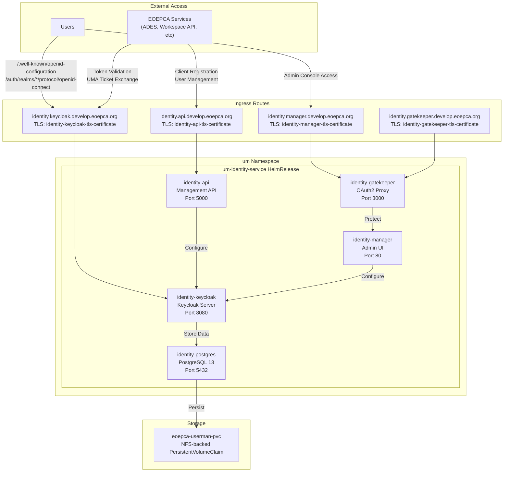
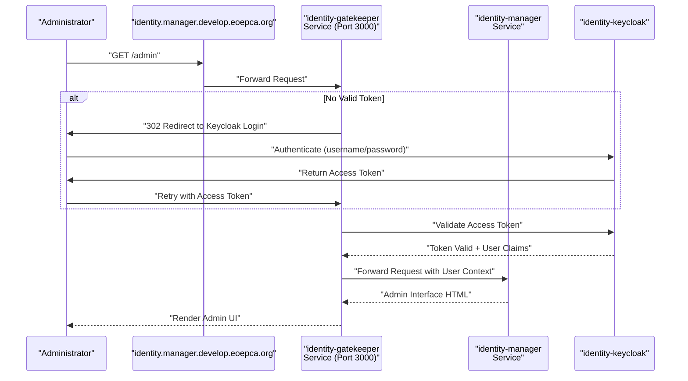
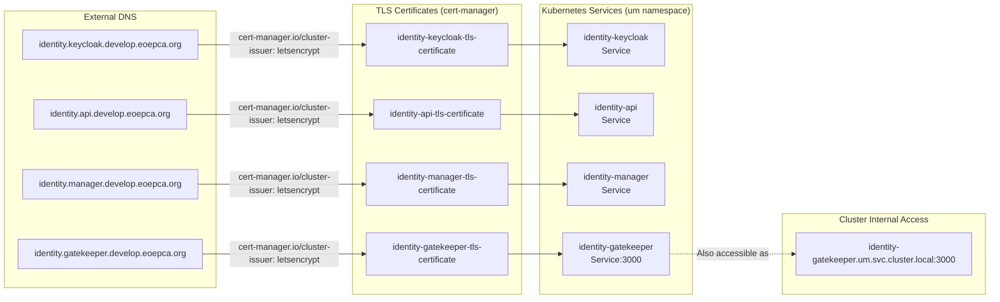

# Identity Service (Keycloak)

<details>
<summary>Relevant source files</summary>

The following files were used as context for generating this wiki page:

- [system/clusters/creodias/system/demo/hr-eoepca-portal.yaml](system/clusters/creodias/system/demo/hr-eoepca-portal.yaml)
- [system/clusters/creodias/system/demo/ss-django-secrets-create.sh](system/clusters/creodias/system/demo/ss-django-secrets-create.sh)
- [system/clusters/creodias/system/demo/ss-django-secrets.yaml](system/clusters/creodias/system/demo/ss-django-secrets.yaml)
- [system/clusters/creodias/system/test/identity-dummy-service-ingress.yaml](system/clusters/creodias/system/test/identity-dummy-service-ingress.yaml)
- [system/clusters/creodias/user-management/um-identity-service.yaml](system/clusters/creodias/user-management/um-identity-service.yaml)

</details>


## Purpose and Scope

This document describes the Identity Service deployment within the EOEPCA platform, which provides centralized identity and access management based on Keycloak. The Identity Service handles user authentication, token issuance, and User-Managed Access (UMA) protocol flows. 

For information about the login flows and user interface components, see [Login Service (Gluu)](#4.2). For details on how the Identity Service integrates with policy enforcement, see [Policy Enforcement (PEP/PDP)](#4.3). For a detailed explanation of the UMA authentication flow, see [UMA Authentication Flow](#4.4).

## Overview

The Identity Service (`um-identity-service`) is deployed in the `um` namespace and serves as the core identity provider for all EOEPCA services. It implements OpenID Connect (OIDC) and OAuth2 protocols, with special support for UMA 2.0 ticket-based authorization flows. The service issues ID tokens, access tokens, and Requesting Party Tokens (RPTs) that are validated by Policy Enforcement Points throughout the platform.

The Identity Service consists of five primary components deployed together as a single Helm chart:
- **identity-keycloak**: The main Keycloak server providing OIDC/OAuth2/UMA endpoints
- **identity-postgres**: PostgreSQL database storing user accounts, clients, and configuration
- **identity-api**: REST API for programmatic management of users and clients
- **identity-manager**: Administrative web interface for configuration
- **identity-gatekeeper**: OAuth2 proxy for protecting administrative endpoints

Sources: [system/clusters/creodias/user-management/um-identity-service.yaml:1-78]()

## Component Architecture



**Component Deployment Diagram**

This diagram shows the five services deployed by the `um-identity-service` HelmRelease and their ingress routing. Each component has a dedicated hostname with TLS certificate provisioned by cert-manager using the `letsencrypt` ClusterIssuer.

Sources: [system/clusters/creodias/user-management/um-identity-service.yaml:4-78]()

## Keycloak Server (identity-keycloak)

The `identity-keycloak` component is the core Keycloak server that provides identity and access management functionality. It exposes standard OIDC endpoints for authentication and token issuance, as well as UMA 2.0 endpoints for ticket-based authorization.

### Key Endpoints

The Keycloak server exposes endpoints under the base URL `https://identity.keycloak.develop.eoepca.org`:

| Endpoint Pattern | Purpose |
|-----------------|---------|
| `/.well-known/openid-configuration` | OIDC discovery document |
| `/auth/realms/{realm}/protocol/openid-connect/auth` | Authorization endpoint |
| `/auth/realms/{realm}/protocol/openid-connect/token` | Token endpoint |
| `/auth/realms/{realm}/protocol/openid-connect/userinfo` | User info endpoint |
| `/auth/realms/{realm}/authz/uma-ticket` | UMA ticket issuance |
| `/auth/realms/{realm}/authz/uma-rpt` | UMA RPT token exchange |

### Ingress Configuration

The Keycloak ingress is configured at [system/clusters/creodias/user-management/um-identity-service.yaml:23-34]() with:
- Hostname: `identity.keycloak.develop.eoepca.org`
- TLS certificate: `identity-keycloak-tls-certificate` (managed by cert-manager)
- ClusterIssuer: `letsencrypt`
- Path routing: All requests (`/`) to the Keycloak service

### Integration with Authentication Flow

When a Policy Enforcement Point (PEP) needs to validate user access:
1. PEP requests a UMA ticket from `/auth/realms/{realm}/authz/uma-ticket`
2. User authenticates via `/auth/realms/{realm}/protocol/openid-connect/auth`
3. User exchanges ticket + ID token for RPT at `/auth/realms/{realm}/authz/uma-rpt`
4. PEP validates RPT with Keycloak before granting access

Sources: [system/clusters/creodias/user-management/um-identity-service.yaml:22-34]()

## PostgreSQL Database (identity-postgres)

The `identity-postgres` component provides persistent storage for Keycloak configuration and runtime data. It stores user accounts, client registrations, sessions, realms, and authorization policies.

### Storage Configuration

The PostgreSQL instance uses the shared NFS-backed PersistentVolumeClaim `eoepca-userman-pvc` for data persistence. This is configured at [system/clusters/creodias/user-management/um-identity-service.yaml:35-37]():

```yaml
identity-postgres:
  volumeClaim:
    name: eoepca-userman-pvc
```

The `eoepca-userman-pvc` claim is pre-provisioned (note `create: false` at [system/clusters/creodias/user-management/um-identity-service.yaml:19-21]()) and shared across user management components to enable data persistence across pod restarts and upgrades.

### Database Schema

PostgreSQL stores Keycloak tables including:
- `user_entity`: User accounts and credentials
- `client`: OAuth2/OIDC client registrations
- `realm`: Realm configurations
- `resource_server`: UMA resource server definitions
- `resource_server_resource`: Protected resources for UMA
- `resource_server_policy`: Authorization policies

Sources: [system/clusters/creodias/user-management/um-identity-service.yaml:35-37](), [system/clusters/creodias/user-management/um-identity-service.yaml:19-21]()

## Management API (identity-api)

The `identity-api` component exposes a REST API for programmatic management of users, clients, and Keycloak configuration. This API is used by automation scripts and other EOEPCA services that need to register new clients or manage users dynamically.

### API Endpoints

The API is accessible at `https://identity.api.develop.eoepca.org` and provides endpoints for:
- User creation and management
- OIDC client registration
- Realm configuration
- Role and group assignment

### Ingress Configuration

The API ingress is defined at [system/clusters/creodias/user-management/um-identity-service.yaml:38-50]():

| Configuration | Value |
|--------------|-------|
| Hostname | `identity.api.develop.eoepca.org` |
| TLS Secret | `identity-api-tls-certificate` |
| Path | `/` (all requests) |
| Path Type | `Prefix` |
| ClusterIssuer | `letsencrypt` |

### Usage Example

Other EOEPCA components use this API to dynamically register OIDC clients. For example, when a new workspace is created, the Workspace API can register a new client for that workspace via the identity-api.

Sources: [system/clusters/creodias/user-management/um-identity-service.yaml:38-50]()

## Management Interface (identity-manager)

The `identity-manager` component provides a web-based administrative interface for Keycloak configuration. This interface is protected by the `identity-gatekeeper` OAuth2 proxy to ensure only authorized administrators can access it.

### Access Control

The manager UI is accessible at `https://identity.manager.develop.eoepca.org` but requires authentication through the gatekeeper proxy. This two-tier architecture ensures:
1. All requests pass through the gatekeeper for OAuth2 token validation
2. Only users with valid tokens from Keycloak can access the manager
3. Administrative operations are logged and auditable

### Ingress Configuration

The manager ingress is configured at [system/clusters/creodias/user-management/um-identity-service.yaml:51-63]():

```yaml
identity-manager:
  ingress:
    annotations:
      cert-manager.io/cluster-issuer: letsencrypt
    hosts:
      - host: identity.manager.develop.eoepca.org
        paths:
          - path: /
            pathType: Prefix
    tls:
      - secretName: identity-manager-tls-certificate
        hosts:
          - identity.manager.develop.eoepca.org
```

Sources: [system/clusters/creodias/user-management/um-identity-service.yaml:51-63]()

## OAuth2 Proxy (identity-gatekeeper)

The `identity-gatekeeper` component is an OAuth2 proxy that sits in front of the management interface to enforce authentication. It validates OAuth2 access tokens before forwarding requests to the manager.

### Gatekeeper Flow



**Gatekeeper Authentication Flow**

This diagram illustrates how the gatekeeper proxy enforces authentication before granting access to the management interface. The gatekeeper is deployed as a separate service to provide a reusable authentication layer.

Sources: [system/clusters/creodias/user-management/um-identity-service.yaml:64-76]()

### Ingress Configuration

The gatekeeper has its own ingress at [system/clusters/creodias/user-management/um-identity-service.yaml:64-76]():

| Configuration | Value |
|--------------|-------|
| Hostname | `identity.gatekeeper.develop.eoepca.org` |
| TLS Secret | `identity-gatekeeper-tls-certificate` |
| Port | 3000 |

The gatekeeper can also be referenced by other services for authentication. For example, the test dummy service uses it at [system/clusters/creodias/system/test/identity-dummy-service-ingress.yaml:19-31]() with an nginx auth_request configuration.

Sources: [system/clusters/creodias/user-management/um-identity-service.yaml:64-76](), [system/clusters/creodias/system/test/identity-dummy-service-ingress.yaml:19-31]()

## Deployment Specifications

### HelmRelease Configuration

The Identity Service is deployed via a Flux CD HelmRelease resource named `um-identity-service` in the `um` namespace. The HelmRelease specification at [system/clusters/creodias/user-management/um-identity-service.yaml:1-78]() defines:

| Parameter | Value |
|-----------|-------|
| Chart Name | `identity-service` |
| Chart Version | `1.0.75` |
| Source Repository | `eoepca` HelmRepository in `common` namespace |
| Reconciliation Interval | `1m0s` |
| Timeout | `5m0s` |

### Shared Storage

The Identity Service uses a pre-existing PersistentVolumeClaim for data persistence. The claim configuration at [system/clusters/creodias/user-management/um-identity-service.yaml:19-21]():

```yaml
volumeClaim:
  name: eoepca-userman-pvc
  create: false
```

The `create: false` setting indicates the PVC is provisioned separately and shared across user management components. This enables:
- Persistent storage of PostgreSQL data across pod restarts
- Shared configuration between Keycloak and other user management services
- NFS-backed storage for multi-pod access

Sources: [system/clusters/creodias/user-management/um-identity-service.yaml:1-78]()

## Integration with EOEPCA Services

### OIDC Client Registration

EOEPCA services register as OIDC clients in Keycloak to participate in authentication flows. For example, the EOEPCA portal registers a client with credentials stored in a SealedSecret. The secret creation script at [system/clusters/creodias/system/demo/ss-django-secrets-create.sh:23-29]() shows how services store client credentials:

```bash
kubectl -n "${NAMESPACE}" create secret generic "${SECRET_NAME}" \
  --from-literal=OIDC_RP_CLIENT_ID="${client_id}" \
  --from-literal=OIDC_RP_CLIENT_SECRET="${client_secret}" \
  --from-literal=DJANGO_SECRET="${django_secret}" \
  --from-literal=KEYCLOAK_OIDC_RP_CLIENT_ID="${keycloak_client_id}" \
  --from-literal=KEYCLOAK_OIDC_RP_CLIENT_SECRET="${keycloak_client_secret}"
```

The resulting SealedSecret at [system/clusters/creodias/system/demo/ss-django-secrets.yaml:8-11]() contains encrypted client credentials that reference the Identity Service.

Sources: [system/clusters/creodias/system/demo/ss-django-secrets-create.sh:23-29](), [system/clusters/creodias/system/demo/ss-django-secrets.yaml:8-11]()

### Policy Enforcement Integration

Policy Enforcement Points throughout the platform reference the gatekeeper service for authentication. The test dummy service demonstrates this integration at [system/clusters/creodias/system/test/identity-dummy-service-ingress.yaml:9-31]() using nginx auth_request:

```yaml
nginx.ingress.kubernetes.io/configuration-snippet: |
  auth_request /auth;
nginx.ingress.kubernetes.io/server-snippet: |
  location ^~ /auth {
    internal;
    proxy_pass http://identity-gatekeeper.um.svc.cluster.local:3000/$request_uri;
    proxy_pass_request_body off;
    proxy_set_header Content-Length "";
    proxy_set_header X-Forwarded-Proto $scheme;
    proxy_set_header X-Forwarded-Host $host;
    proxy_set_header X-Forwarded-Method $request_method;
    proxy_set_header X-Forwarded-URI $request_uri;
  }
```

This pattern enables any service to leverage the Identity Service for authentication by:
1. Configuring nginx to send auth_request to the gatekeeper
2. Using the cluster-internal service name `identity-gatekeeper.um.svc.cluster.local:3000`
3. Forwarding original request metadata via proxy headers

Sources: [system/clusters/creodias/system/test/identity-dummy-service-ingress.yaml:9-31]()

## Service Endpoint Summary



**Service Endpoint and TLS Configuration**

This diagram shows the complete endpoint configuration for all Identity Service components, including DNS names, TLS certificates, and internal cluster service names. All certificates are automatically provisioned by cert-manager using the `letsencrypt` ClusterIssuer.

Sources: [system/clusters/creodias/user-management/um-identity-service.yaml:23-76](), [system/clusters/creodias/system/test/identity-dummy-service-ingress.yaml:21]()

## Certificate Management

All Identity Service endpoints use TLS certificates managed by cert-manager. The `cert-manager.io/cluster-issuer: letsencrypt` annotation at multiple locations ([system/clusters/creodias/user-management/um-identity-service.yaml:25](), [system/clusters/creodias/user-management/um-identity-service.yaml:41](), [system/clusters/creodias/user-management/um-identity-service.yaml:53](), [system/clusters/creodias/user-management/um-identity-service.yaml:67]()) triggers automatic certificate provisioning:

1. cert-manager detects the ingress with the annotation
2. Creates a Certificate resource
3. Initiates ACME challenge with Let's Encrypt
4. Stores resulting certificate in the specified secret
5. Automatically renews certificates before expiration

This ensures all Identity Service endpoints are accessible over HTTPS with valid, automatically-renewed certificates.

Sources: [system/clusters/creodias/user-management/um-identity-service.yaml:25](), [system/clusters/creodias/user-management/um-identity-service.yaml:41](), [system/clusters/creodias/user-management/um-identity-service.yaml:53](), [system/clusters/creodias/user-management/um-identity-service.yaml:67]()