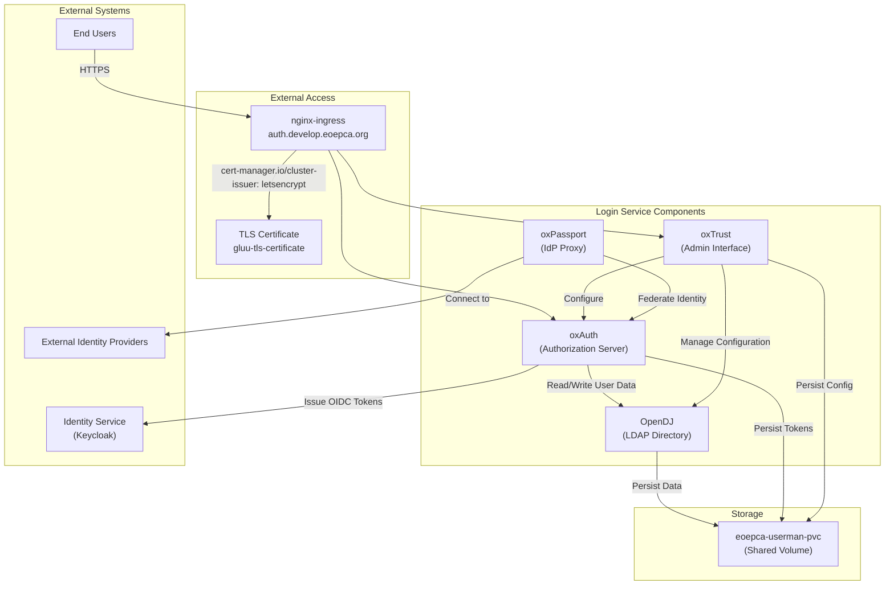
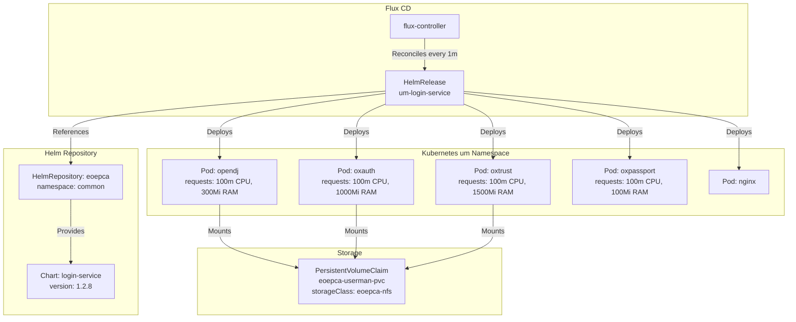
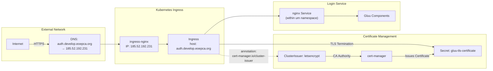
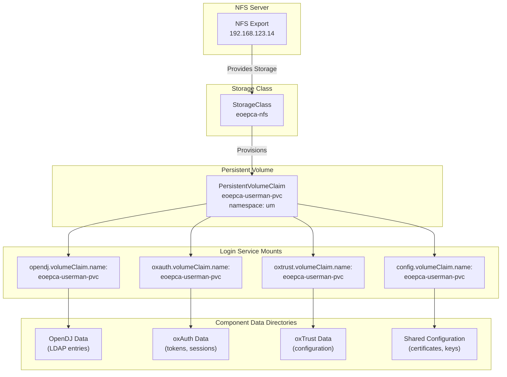
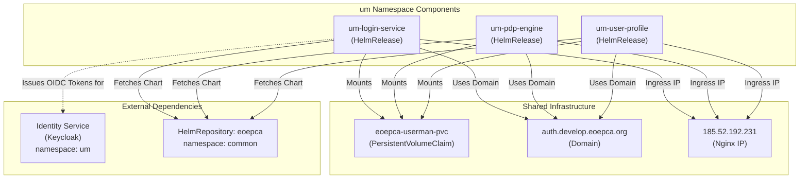

# Login Service (Gluu)

<details>
<summary>Relevant source files</summary>

The following files were used as context for generating this wiki page:

- [system/clusters/creodias/system/demo/hr-django-portal.yaml](system/clusters/creodias/system/demo/hr-django-portal.yaml)
- [system/clusters/creodias/system/storage/hr-storage.yaml](system/clusters/creodias/system/storage/hr-storage.yaml)
- [system/clusters/creodias/system/test/hr-cheese.yaml](system/clusters/creodias/system/test/hr-cheese.yaml)
- [system/clusters/creodias/user-management/um-login-service.yaml](system/clusters/creodias/user-management/um-login-service.yaml)
- [system/clusters/creodias/user-management/um-pdp-engine.yaml](system/clusters/creodias/user-management/um-pdp-engine.yaml)
- [system/clusters/creodias/user-management/um-user-profile.yaml](system/clusters/creodias/user-management/um-user-profile.yaml)

</details>


## Purpose and Scope

The Login Service provides OpenID Connect (OIDC) and OAuth2 authentication capabilities for the EOEPCA platform using the Gluu Server. It handles user authentication, identity federation, and token issuance. The service is deployed as a collection of interdependent components including an LDAP directory (OpenDJ), authorization server (oxAuth), administration interface (oxTrust), and identity provider proxy (oxPassport).

For identity management and user attribute storage, see [Identity Service (Keycloak)](#4.1). For authorization policy enforcement, see [Policy Enforcement (PEP/PDP)](#4.3). For details on the token exchange and UMA flow, see [UMA Authentication Flow](#4.4).

## Component Architecture

The Login Service consists of four primary components that work together to provide authentication services:



**Sources:** [system/clusters/creodias/user-management/um-login-service.yaml:1-68]()

### OpenDJ (LDAP Directory)

OpenDJ serves as the backend LDAP directory for storing user credentials, configuration data, and identity attributes. It provides the persistent data layer for the Gluu authentication system.

**Configuration:**
- Volume claim: `eoepca-userman-pvc`
- CPU request: 100m
- Memory request: 300Mi
- Persistence can be disabled to workaround immutable field errors in the `um-login-service-persistence-init-ss` job

**Sources:** [system/clusters/creodias/user-management/um-login-service.yaml:23-33]()

### oxAuth (Authorization Server)

oxAuth is the core authorization server implementing OpenID Connect and OAuth2 protocols. It handles authentication requests, issues tokens (ID tokens, access tokens, refresh tokens), and manages client registrations.

**Configuration:**
- Volume claim: `eoepca-userman-pvc`
- CPU request: 100m
- Memory request: 1000Mi

**Sources:** [system/clusters/creodias/user-management/um-login-service.yaml:34-40]()

### oxTrust (Administration Interface)

oxTrust provides a web-based administrative interface for managing the Gluu Server configuration, users, groups, and OIDC clients. Administrators use this interface to configure authentication policies and integration parameters.

**Configuration:**
- Volume claim: `eoepca-userman-pvc`
- CPU request: 100m
- Memory request: 1500Mi

**Sources:** [system/clusters/creodias/user-management/um-login-service.yaml:41-47]()

### oxPassport (Identity Provider Proxy)

oxPassport enables identity federation by proxying authentication requests to external identity providers. It supports integration with social login providers and enterprise identity systems.

**Configuration:**
- CPU request: 100m
- Memory request: 100Mi

**Sources:** [system/clusters/creodias/user-management/um-login-service.yaml:48-52]()

## Deployment Configuration

The Login Service is deployed via a Flux CD HelmRelease in the `um` namespace:



**Deployment Parameters:**

| Parameter | Value | Purpose |
|-----------|-------|---------|
| `metadata.name` | `um-login-service` | HelmRelease identifier |
| `metadata.namespace` | `um` | Deployment namespace |
| `spec.chart.spec.chart` | `login-service` | Helm chart name |
| `spec.chart.spec.version` | `1.2.8` | Chart version |
| `spec.timeout` | `25m0s` | Maximum deployment time |
| `spec.interval` | `1m0s` | Reconciliation frequency |

**Sources:** [system/clusters/creodias/user-management/um-login-service.yaml:1-15](), [system/clusters/creodias/user-management/um-login-service.yaml:67-68]()

## Domain and Network Configuration

The Login Service is accessible via a dedicated authentication domain with TLS encryption:



**Global Configuration:**

| Parameter | Value |
|-----------|-------|
| `global.domain` | `auth.develop.eoepca.org` |
| `global.nginxIp` | `185.52.192.231` |
| `global.namespace` | `um` |

**Ingress Configuration:**

| Parameter | Value |
|-----------|-------|
| `nginx.ingress.hosts[0]` | `auth.develop.eoepca.org` |
| `nginx.ingress.tls[0].hosts[0]` | `auth.develop.eoepca.org` |
| `nginx.ingress.tls[0].secretName` | `gluu-tls-certificate` |
| `nginx.ingress.annotations` | `cert-manager.io/cluster-issuer: letsencrypt` |

**Sources:** [system/clusters/creodias/user-management/um-login-service.yaml:19-20](), [system/clusters/creodias/user-management/um-login-service.yaml:53-66]()

## Storage Architecture

All Login Service components share a common NFS-backed persistent volume for data persistence:



**Volume Claim Configuration:**

The HelmRelease specifies `volumeClaim.create: false`, indicating that the PVC `eoepca-userman-pvc` must be created by the storage subsystem before deploying the Login Service. This shared volume approach allows all user management components (Login Service, PDP Engine, User Profile) to access common data.

**Sources:** [system/clusters/creodias/user-management/um-login-service.yaml:16-22](), [system/clusters/creodias/user-management/um-login-service.yaml:28-29](), [system/clusters/creodias/user-management/um-login-service.yaml:35-36](), [system/clusters/creodias/user-management/um-login-service.yaml:42-43](), [system/clusters/creodias/system/storage/hr-storage.yaml:27-28]()

## Resource Requirements

The following table summarizes the resource requests for each component:

| Component | CPU Request | Memory Request | Purpose |
|-----------|-------------|----------------|---------|
| `opendj` | 100m | 300Mi | LDAP directory operations |
| `oxauth` | 100m | 1000Mi | Token issuance and validation |
| `oxtrust` | 100m | 1500Mi | Admin UI and configuration management |
| `oxpassport` | 100m | 100Mi | Identity provider proxying |

**Total Requests:** 400m CPU, 2900Mi (approximately 2.9 GB) memory

These are minimum resource requests that Kubernetes uses for scheduling. Actual resource usage may be higher depending on authentication load and concurrent user sessions.

**Sources:** [system/clusters/creodias/user-management/um-login-service.yaml:30-52]()

## Integration with User Management Ecosystem

The Login Service integrates with other user management components deployed in the `um` namespace:



**Shared Configuration Parameters:**

All user management HelmReleases share common configuration:
- `global.domain`: `auth.develop.eoepca.org`
- `global.nginxIp`: `185.52.192.231`
- `volumeClaim.name`: `eoepca-userman-pvc`
- `volumeClaim.create`: `false`

This standardization ensures consistent deployment and simplifies maintenance.

**Sources:** [system/clusters/creodias/user-management/um-login-service.yaml:53-56](), [system/clusters/creodias/user-management/um-pdp-engine.yaml:19-24](), [system/clusters/creodias/user-management/um-user-profile.yaml:16-21]()

## Operational Considerations

### Deployment Timeout

The HelmRelease specifies a timeout of `25m0s` to accommodate the initialization time required for Gluu components, particularly the LDAP schema import and certificate generation performed by OpenDJ.

**Sources:** [system/clusters/creodias/user-management/um-login-service.yaml:67]()

### Persistence Initialization

The deployment includes a StatefulSet job named `um-login-service-persistence-init-ss` that initializes the OpenDJ LDAP directory. If encountering "failed to upgrade" errors due to immutable field constraints, OpenDJ persistence can be temporarily disabled by setting `opendj.persistence.enabled: false`.

**Sources:** [system/clusters/creodias/user-management/um-login-service.yaml:23-27]()

### Flux CD Reconciliation

The Login Service is continuously monitored by Flux CD with a reconciliation interval of `1m0s`. Any drift between the desired state (defined in Git) and the actual cluster state triggers automatic remediation.

**Sources:** [system/clusters/creodias/user-management/um-login-service.yaml:68]()

## Authentication Flow Overview

The following diagram illustrates how the Login Service integrates into the EOEPCA authentication flow:

```mermaid
sequenceDiagram
    participant User
    participant Service["Protected Service<br/>(ADES/Workspace/etc)"]
    participant PEP["Resource Guard<br/>(PEP)"]
    participant Keycloak["Identity Service<br/>(Keycloak)"]
    participant Gluu["Login Service<br/>(Gluu oxAuth)"]
    
    User->>Service: "Request Resource"
    Service->>PEP: "Forward Request"
    PEP->>Keycloak: "Get UMA Ticket"
    Keycloak-->>PEP: "Return Ticket"
    PEP-->>User: "401 + WWW-Authenticate"
    
    User->>Gluu: "Authenticate<br/>(username/password)"
    Gluu->>Gluu: "Validate credentials<br/>against OpenDJ"
    Gluu-->>User: "Return ID Token"
    
    User->>Keycloak: "Exchange Ticket + ID Token"
    Keycloak->>Gluu: "Validate ID Token<br/>(OIDC UserInfo endpoint)"
    Gluu-->>Keycloak: "Token Valid + User Claims"
    Keycloak-->>User: "Return RPT"
    
    User->>PEP: "Retry with RPT"
    PEP->>Service: "Forward Request"
    Service-->>User: "200 OK"
```

**Key Points:**
- Gluu oxAuth issues OIDC-compliant ID tokens
- Keycloak validates these tokens via OIDC federation
- User credentials are stored in OpenDJ LDAP directory
- oxPassport enables login via external identity providers

**Sources:** [system/clusters/creodias/user-management/um-login-service.yaml:34-40]()

## Maintenance and Troubleshooting

### Checking Component Status

```bash
# Check HelmRelease status
kubectl get helmrelease um-login-service -n um

# View all Login Service pods
kubectl get pods -n um -l app.kubernetes.io/instance=um-login-service

# Check individual component logs
kubectl logs -n um -l app.kubernetes.io/component=opendj
kubectl logs -n um -l app.kubernetes.io/component=oxauth
kubectl logs -n um -l app.kubernetes.io/component=oxtrust
```

### Volume Mount Verification

```bash
# Verify PVC exists and is bound
kubectl get pvc eoepca-userman-pvc -n um

# Check volume mounts in pods
kubectl describe pod <pod-name> -n um | grep -A5 "Mounts:"
```

### TLS Certificate Status

```bash
# Check certificate status
kubectl get certificate gluu-tls-certificate -n um

# View certificate details
kubectl describe certificate gluu-tls-certificate -n um
```

**Sources:** [system/clusters/creodias/user-management/um-login-service.yaml:58-66]()