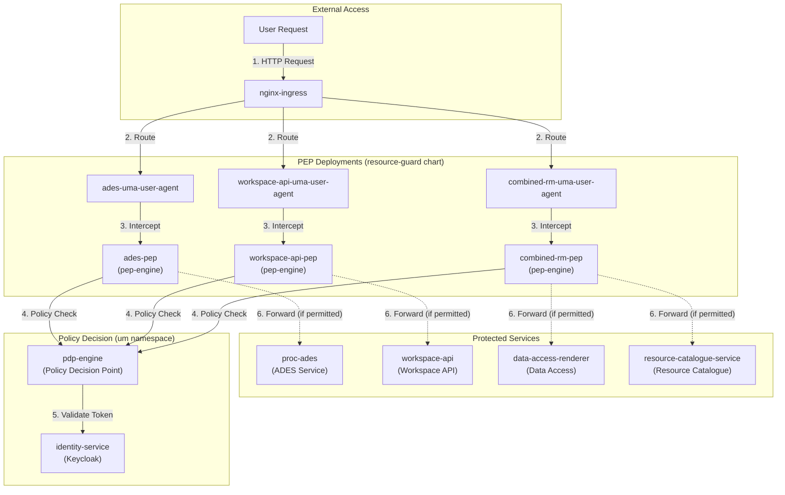
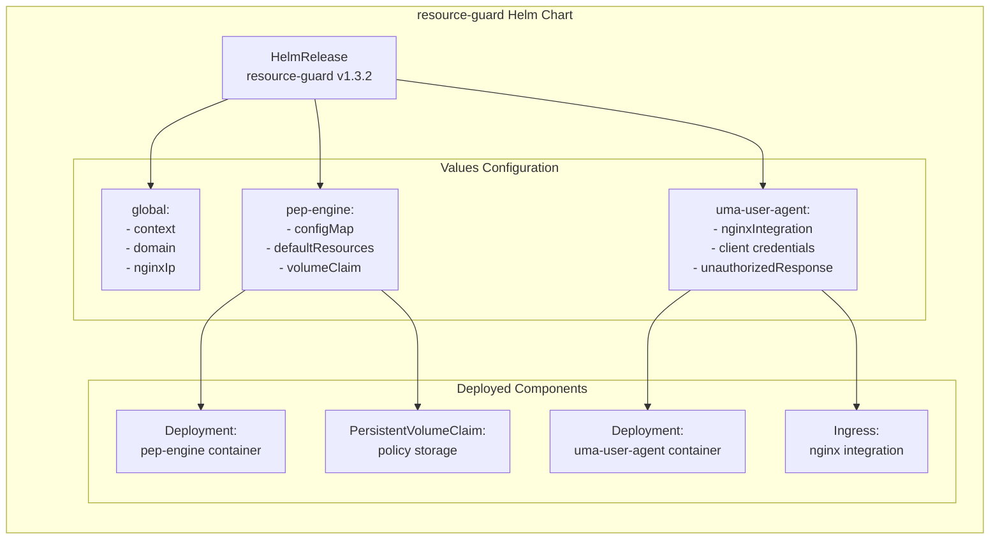
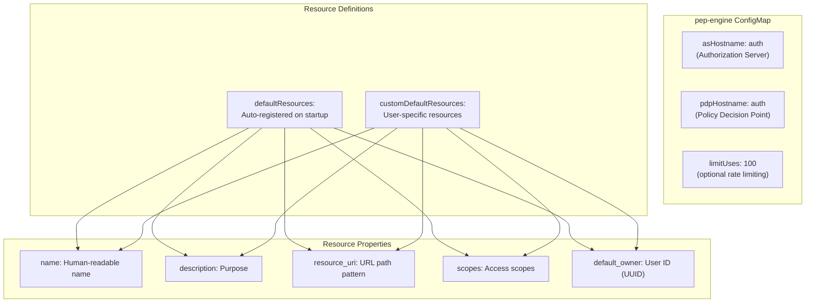
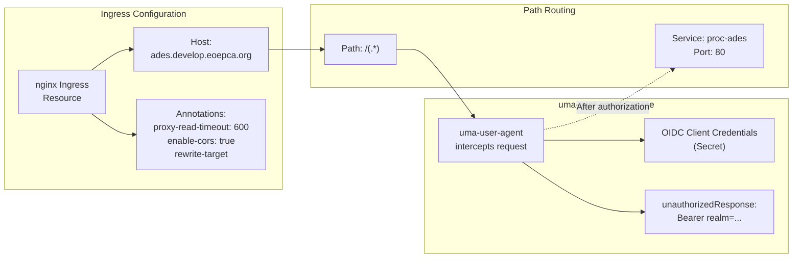
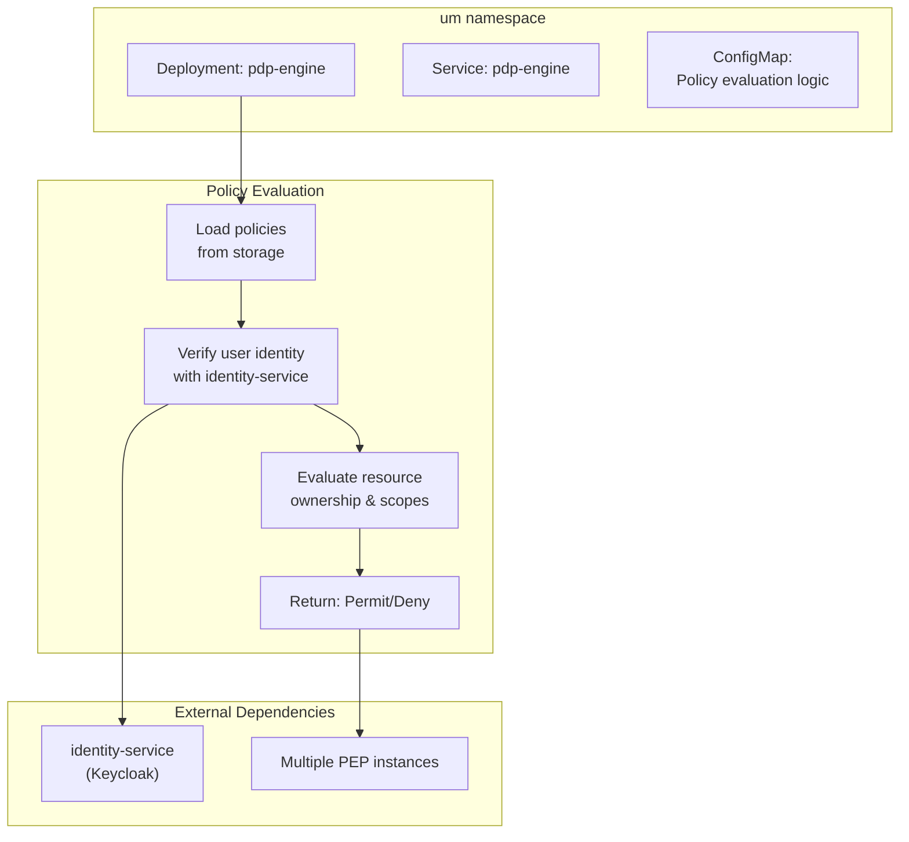
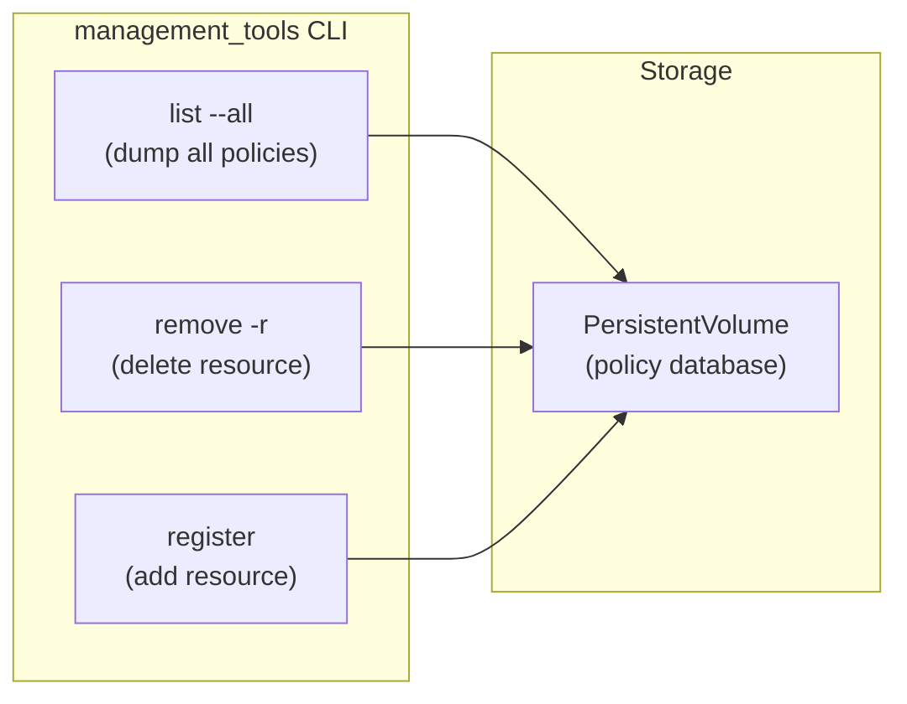
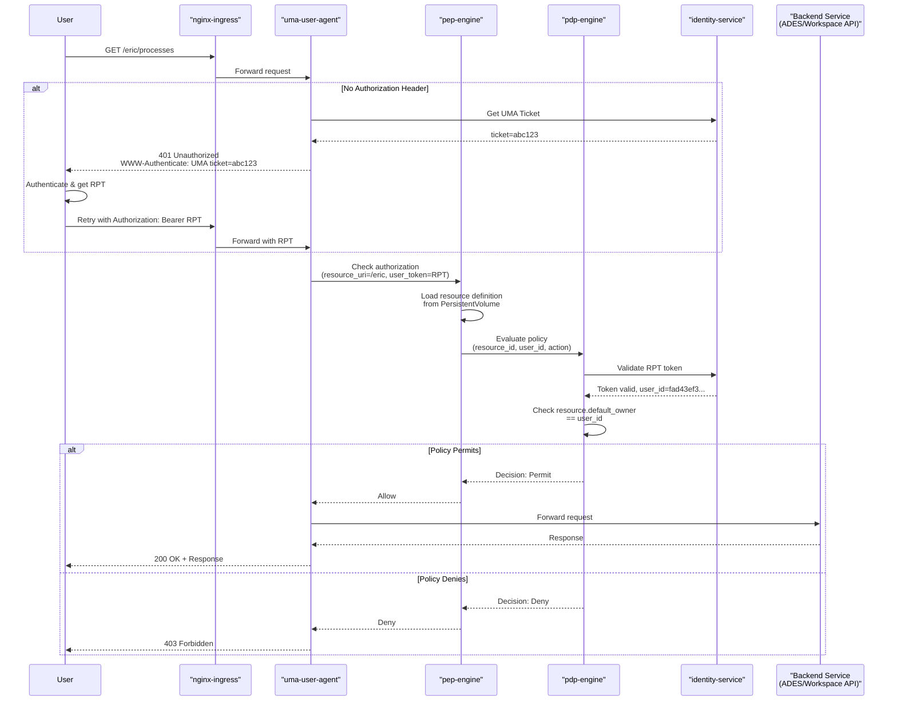

# Policy Enforcement (PEP/PDP)

<details>
<summary>Relevant source files</summary>

The following files were used as context for generating this wiki page:

- [.gitattributes](.gitattributes)
- [bin/dump-policy.sh](bin/dump-policy.sh)
- [bin/list-container-images.sh](bin/list-container-images.sh)
- [bin/unregister-resource.sh](bin/unregister-resource.sh)
- [system/clusters/creodias/processing-and-chaining/proc-ades-guard.yaml](system/clusters/creodias/processing-and-chaining/proc-ades-guard.yaml)
- [system/clusters/creodias/processing-and-chaining/proc-ades.yaml](system/clusters/creodias/processing-and-chaining/proc-ades.yaml)
- [system/clusters/creodias/resource-management/hr-combined-rm-guard.yaml](system/clusters/creodias/resource-management/hr-combined-rm-guard.yaml)
- [system/clusters/creodias/resource-management/hr-workspace-api-guard.yaml](system/clusters/creodias/resource-management/hr-workspace-api-guard.yaml)
- [system/clusters/creodias/resource-management/rm-workspace-charts/template-hr-resource-guard.yaml](system/clusters/creodias/resource-management/rm-workspace-charts/template-hr-resource-guard.yaml)
- [system/clusters/creodias/resource-management/ss-harbor.yaml](system/clusters/creodias/resource-management/ss-harbor.yaml)
- [system/clusters/creodias/system/test/hr-dummy-service-guard.yaml](system/clusters/creodias/system/test/hr-dummy-service-guard.yaml)
- [system/clusters/creodias/user-management/kustomization.yaml](system/clusters/creodias/user-management/kustomization.yaml)
- [system/clusters/data/register-S2-L1C-data.sh](system/clusters/data/register-S2-L1C-data.sh)
- [system/clusters/data/register-S2-L2A-data.sh](system/clusters/data/register-S2-L2A-data.sh)
- [test/acceptance/02__Processing/01__ADES/data/app-deploy-body-atom.json](test/acceptance/02__Processing/01__ADES/data/app-deploy-body-atom.json)
- [test/acceptance/02__Processing/01__ADES/data/app-deploy-body-cwl.json](test/acceptance/02__Processing/01__ADES/data/app-deploy-body-cwl.json)
- [test/acceptance/02__Processing/01__ADES/data/application-package-atom.xml](test/acceptance/02__Processing/01__ADES/data/application-package-atom.xml)
- [test/acceptance/02__Processing/01__ADES/data/application-package-cwl.cwl](test/acceptance/02__Processing/01__ADES/data/application-package-cwl.cwl)
- [test/acceptance/03__ResourceCatalogue/CatalogueServiceWeb.py](test/acceptance/03__ResourceCatalogue/CatalogueServiceWeb.py)
- [test/acceptance/03__ResourceCatalogue/Resource_catalogue.robot](test/acceptance/03__ResourceCatalogue/Resource_catalogue.robot)

</details>


## Purpose and Scope

This document describes the Policy Enforcement Point (PEP) and Policy Decision Point (PDP) components that provide authorization and access control for EOEPCA services. The PEP intercepts requests to protected services, while the PDP evaluates policies to determine whether access should be granted. Together, they implement User-Managed Access (UMA) 2.0 based authorization.

For authentication mechanisms and identity management, see [Identity Service (Keycloak)](#4.1). For the complete UMA authentication flow including ticket-based authorization, see [UMA Authentication Flow](#4.4).

This document covers:
- PEP and PDP component architecture
- Resource registration and policy configuration
- The resource-guard deployment pattern
- Policy evaluation mechanisms
- Management tools for policy administration

---

## System Architecture

The EOEPCA platform deploys multiple PEP instances to protect different services (ADES, Workspace API, Resource Catalogue, Data Access), with a centralized PDP engine for policy evaluation. Each protected service is fronted by a `resource-guard` Helm chart deployment that includes both a `pep-engine` and a `uma-user-agent` component.



**Sources:** [system/clusters/creodias/processing-and-chaining/proc-ades-guard.yaml:1-90](), [system/clusters/creodias/resource-management/hr-workspace-api-guard.yaml:1-92](), [system/clusters/creodias/resource-management/hr-combined-rm-guard.yaml:1-101](), [system/clusters/creodias/user-management/kustomization.yaml:12-12]()

---

## Resource Guard Deployment Pattern

The `resource-guard` Helm chart is the standard deployment pattern for protecting services. It packages two main components: `pep-engine` for policy enforcement and `uma-user-agent` for UMA authentication integration.

### Chart Structure



**Sources:** [system/clusters/creodias/processing-and-chaining/proc-ades-guard.yaml:1-14](), [system/clusters/creodias/resource-management/hr-workspace-api-guard.yaml:7-14]()

### Global Configuration

Each resource-guard deployment requires global configuration to identify the service being protected:

| Parameter | Description | Example |
|-----------|-------------|---------|
| `global.context` | Service identifier used in hostname | `ades`, `workspace-api`, `combined-rm` |
| `global.domain` | Base domain for the platform | `develop.eoepca.org` |
| `global.nginxIp` | Ingress controller IP address | `185.52.192.231` |
| `global.certManager.clusterIssuer` | TLS certificate issuer | `letsencrypt` |

**Sources:** [system/clusters/creodias/processing-and-chaining/proc-ades-guard.yaml:19-24](), [system/clusters/creodias/resource-management/hr-workspace-api-guard.yaml:19-24]()

---

## Policy Enforcement Point (pep-engine)

The `pep-engine` component is responsible for intercepting requests, managing resource registrations, and consulting the PDP for authorization decisions.

### Configuration Structure



**Sources:** [system/clusters/creodias/resource-management/hr-workspace-api-guard.yaml:28-53](), [system/clusters/creodias/processing-and-chaining/proc-ades-guard.yaml:28-49]()

### Resource Registration Examples

#### ADES Service Protection

The ADES service uses per-user resource paths to isolate user workspaces:

[system/clusters/creodias/processing-and-chaining/proc-ades-guard.yaml:34-49]()

```yaml
customDefaultResources:
- name: "ADES Service for user 'eric'"
  description: "Protected Access for eric to his space in the ADES"
  resource_uri: "/eric"
  scopes: []
  default_owner: "fad43ef3-23ef-48b0-86f0-1cf29d97908e"
- name: "ADES Service for user 'bob'"
  description: "Protected Access for bob to his space in the ADES"
  resource_uri: "/bob"
  scopes: []
  default_owner: "f0a19e32-5651-404e-8acd-128c2c284300"
```

Each user gets a dedicated resource path (`/eric`, `/bob`) with their UUID as the `default_owner`, ensuring they can only access their own processing space.

**Sources:** [system/clusters/creodias/processing-and-chaining/proc-ades-guard.yaml:34-49]()

#### Workspace API Protection

The Workspace API uses a combination of operator-only and public resources:

[system/clusters/creodias/resource-management/hr-workspace-api-guard.yaml:35-53]()

```yaml
defaultResources:
  - name: "Workspace API Base Path"
    description: "Protected root path for operators only"
    resource_uri: "/"
    scopes: []
    default_owner: "0000000000000"
customDefaultResources:
  - name: "Workspace API Swagger Docs"
    description: "Public access to workspace API swagger docs"
    resource_uri: "/docs"
    scopes:
      - "public_access"
    default_owner: "0000000000000"
```

The root path is restricted to operators (owner ID `0000000000000`), while documentation endpoints have a `public_access` scope allowing unauthenticated access.

**Sources:** [system/clusters/creodias/resource-management/hr-workspace-api-guard.yaml:35-53]()

#### Template-Based Workspace Resources

For dynamically created workspaces, templates with placeholders are used:

[system/clusters/creodias/resource-management/rm-workspace-charts/template-hr-resource-guard.yaml:40-45]()

```yaml
defaultResources:
  - name: "Workspace {{ workspace_name }} Root"
    description: "Root URL of a users workspace"
    resource_uri: "/"
    scopes: []
    default_owner: {{ default_owner }}
```

The Workspace API replaces `{{ workspace_name }}` and `{{ default_owner }}` when provisioning user-specific workspaces, creating isolated protected resources for each user.

**Sources:** [system/clusters/creodias/resource-management/rm-workspace-charts/template-hr-resource-guard.yaml:1-99]()

### Volume Persistence

The `pep-engine` uses persistent storage to maintain resource registrations across restarts:

| Deployment | Volume Claim | Creation |
|------------|--------------|----------|
| `ades-pep` | `eoepca-proc-pvc` | Pre-existing (shared) |
| `workspace-api-pep` | `eoepca-resman-pvc` | Pre-existing (shared) |
| `combined-rm-pep` | `eoepca-resman-pvc` | Pre-existing (shared) |
| `dummy-service-pep` | `dummy-service-pep-pvc` | Not created (ephemeral) |
| Workspace guards | `{{ workspace_name }}-pep-pvc` | Created per workspace |

**Sources:** [system/clusters/creodias/processing-and-chaining/proc-ades-guard.yaml:55-57](), [system/clusters/creodias/resource-management/hr-workspace-api-guard.yaml:57-59](), [system/clusters/creodias/resource-management/rm-workspace-charts/template-hr-resource-guard.yaml:37-39]()

---

## UMA User Agent (uma-user-agent)

The `uma-user-agent` component handles the UMA authentication flow and integrates with nginx ingress to intercept requests before they reach the backend service.

### Nginx Integration



**Sources:** [system/clusters/creodias/processing-and-chaining/proc-ades-guard.yaml:65-77](), [system/clusters/creodias/resource-management/hr-workspace-api-guard.yaml:67-80]()

### Configuration Parameters

| Parameter | Purpose | Example |
|-----------|---------|---------|
| `nginxIntegration.enabled` | Enable nginx auth proxy | `true` |
| `nginxIntegration.hosts[].host` | Service hostname | `ades`, `workspace-api` |
| `nginxIntegration.hosts[].paths[].path` | URL pattern to protect | `/(.*)`  |
| `nginxIntegration.hosts[].paths[].service.name` | Backend service name | `proc-ades` |
| `client.credentialsSecretName` | OIDC client secret name | `proc-uma-user-agent` |
| `logging.level` | Log verbosity | `info`, `debug` |
| `unauthorizedResponse` | 401 response header | `Bearer realm="https://..."` |
| `openAccess` | Disable authentication | `false` |

**Sources:** [system/clusters/creodias/processing-and-chaining/proc-ades-guard.yaml:61-83](), [system/clusters/creodias/resource-management/hr-combined-rm-guard.yaml:46-94]()

### Open Access Mode

For services that should be publicly accessible without authentication, `openAccess: true` can be set:

[system/clusters/creodias/resource-management/hr-combined-rm-guard.yaml:94-94]()

This is used for the `combined-rm-guard` which protects public data access and catalogue services.

**Sources:** [system/clusters/creodias/resource-management/hr-combined-rm-guard.yaml:94-94]()

---

## Policy Decision Point (pdp-engine)

The `pdp-engine` is a centralized component deployed in the `um` namespace that evaluates authorization policies for all PEP instances across the platform.

### Deployment Structure



**Sources:** [system/clusters/creodias/user-management/kustomization.yaml:12-12](), [bin/dump-policy.sh:27-27]()

### Policy Evaluation Logic

When a PEP sends a policy check request, the PDP performs these evaluations:

1. **Token Validation**: Verifies the RPT (Requesting Party Token) with the Identity Service
2. **Resource Lookup**: Finds the registered resource matching the requested URI
3. **Ownership Check**: Compares the user's UUID from the token with the resource's `default_owner`
4. **Scope Evaluation**: Checks if the request matches any allowed scopes (e.g., `public_access`)
5. **Decision**: Returns `Permit` if ownership or scopes match, otherwise `Deny`

**Sources:** [system/clusters/creodias/processing-and-chaining/proc-ades-guard.yaml:28-34](), [system/clusters/creodias/resource-management/hr-workspace-api-guard.yaml:28-34]()

---

## Policy Management Tools

The EOEPCA platform provides command-line tools for managing policies across all PEP and PDP deployments.

### Management Tools Interface

Each `pep-engine` and `pdp-engine` container includes a `management_tools` CLI for policy administration:



**Sources:** [bin/dump-policy.sh:37-37](), [bin/unregister-resource.sh:23-23]()

### Dumping Policies (dump-policy.sh)

The `dump-policy.sh` script extracts policy data from all PEP and PDP deployments:

[bin/dump-policy.sh:20-28]()

```bash
dumpAll() {
  dumpDeployment proc ades-pep
  dumpDeployment rm combined-rm-pep
  dumpDeployment rm workspace-api-pep
  dumpDeployment test dummy-service-pep
  dumpDeployment um pdp-engine nojson
}
```

The script executes `management_tools list --all` inside each container and saves the output as JSON:

[bin/dump-policy.sh:30-40]()

```bash
dumpDeployment() {
  namespace="${1}"
  deployment="${2}"
  print_json="$( [ "${3}" = "nojson" ] && echo "" || echo "| jq" )"
  dumpfile="${ORIG_DIR}/${deployment}.json"

  echo -n "Dumping policy for ${namespace}/${deployment} to ${dumpfile}"
  cmd="kubectl -n "${namespace}" exec -it deploy/"${deployment}" -c "${deployment}" -- management_tools list --all ${print_json}"
  eval "${cmd}" > "${dumpfile}"
  echo " done"
}
```

**Usage:**
```bash
# Dump all policies
./bin/dump-policy.sh

# Dump specific deployment
./bin/dump-policy.sh rm workspace-api-pep
```

**Output:** Creates JSON files like `ades-pep.json`, `workspace-api-pep.json`, `pdp-engine.json` in the current directory.

**Sources:** [bin/dump-policy.sh:1-43]()

### Unregistering Resources (unregister-resource.sh)

The `unregister-resource.sh` script removes a resource from all PEP and PDP instances:

[bin/unregister-resource.sh:19-24]()

```bash
resourceId="$1"

# combined-rm-pep
echo -n "Delete resource ${resourceId} from combined-rm-pep..."
kubectl -n rm exec -it svc/combined-rm-pep -c combined-rm-pep -- management_tools remove -r ${resourceId}
echo " done"
```

The script iterates through all known PEP deployments and the PDP:

[bin/unregister-resource.sh:36-54]()

```bash
# ades-pep
kubectl -n proc exec -it svc/ades-pep -c ades-pep -- management_tools remove -r ${resourceId}

# workspace-api-pep
kubectl -n rm exec -it svc/workspace-api-pep -c workspace-api-pep -- management_tools remove -r ${resourceId}

# dummy-service-pep
kubectl -n test exec -it svc/dummy-service-pep -c dummy-service-pep -- management_tools remove -r ${resourceId}

# pdp
kubectl -n um exec -it svc/pdp-engine -c pdp-engine -- management_tools remove -r ${resourceId}
```

**Usage:**
```bash
./bin/unregister-resource.sh <resource-id>
```

This is useful for cleaning up stale resource registrations or removing test resources.

**Sources:** [bin/unregister-resource.sh:1-55]()

---

## Policy Evaluation Flow

This sequence diagram shows the complete flow when a user requests a protected resource:



**Sources:** [system/clusters/creodias/processing-and-chaining/proc-ades-guard.yaml:1-90](), [system/clusters/creodias/resource-management/hr-workspace-api-guard.yaml:1-92]()

---

## Multi-Service Protection Patterns

### Protecting Multiple Endpoints (Combined Guard)

The `combined-rm-guard` demonstrates protecting multiple backend services through a single PEP instance:

[system/clusters/creodias/resource-management/hr-combined-rm-guard.yaml:52-84]()

```yaml
nginxIntegration:
  enabled: true
  hosts:
    - host: resource-catalogue
      paths:
        - path: /(.*)
          service:
            name: resource-catalogue-service
            port: 80
    - host: data-access
      paths:
        - path: /(ows.*)
          service:
            name: data-access-renderer
            port: 80
        - path: /(opensearch.*)
          service:
            name: data-access-renderer
            port: 80
        - path: /cache/(.*)
          service:
            name: data-access-cache
            port: 80
```

This configuration protects both Resource Catalogue and Data Access services through regex path matching, routing different URL patterns to different backend services.

**Sources:** [system/clusters/creodias/resource-management/hr-combined-rm-guard.yaml:50-88]()

### Per-Workspace Protection

Dynamically provisioned workspaces use the template pattern to create isolated resource guards:

[system/clusters/creodias/resource-management/rm-workspace-charts/template-hr-resource-guard.yaml:50-84]()

```yaml
uma-user-agent:
  nginxIntegration:
    enabled: true
    hosts:
      - host: "resource-catalogue.{{ workspace_name }}"
        paths:
          - path: "/(.*)"
            service:
              name: "resource-catalogue-service"
              port: 80
      - host: "data-access.{{ workspace_name }}"
        paths:
          - path: "/(ows.*)"
            service:
              name: "vs-renderer"
              port: 80
```

Each workspace gets its own subdomain (`resource-catalogue.eric-workspace.develop.eoepca.org`) with a dedicated PEP that enforces the workspace owner's access rights.

**Sources:** [system/clusters/creodias/resource-management/rm-workspace-charts/template-hr-resource-guard.yaml:49-98]()

---

## Testing PEP/PDP

### Test Service Deployment

The platform includes a test service guard for validation:

[system/clusters/creodias/system/test/hr-dummy-service-guard.yaml:1-81]()

This deployment protects a dummy service with two user-specific resources for testing authorization logic:

```yaml
customDefaultResources:
- name: "Eric's space"
  description: "Protected Access for eric to his space in the dummy service"
  resource_uri: "/ericspace"
  scopes: []
  default_owner: "fad43ef3-23ef-48b0-86f0-1cf29d97908e"
- name: "Bob's space"
  description: "Protected Access for bob to his space in the dummy service"
  resource_uri: "/bobspace"
  scopes: []
  default_owner: "f0a19e32-5651-404e-8acd-128c2c284300"
```

**Sources:** [system/clusters/creodias/system/test/hr-dummy-service-guard.yaml:34-44]()

### Acceptance Tests

The Robot Framework tests validate PEP/PDP behavior through the Resource Catalogue:

[test/acceptance/03__ResourceCatalogue/Resource_catalogue.robot:1-96]()

Tests include:
- CSW operations with authenticated access
- OpenSearch queries through protected endpoints
- Workspace-specific catalogue access validation

**Sources:** [test/acceptance/03__ResourceCatalogue/Resource_catalogue.robot:1-96](), [test/acceptance/03__ResourceCatalogue/CatalogueServiceWeb.py:1-156]()

---

## Summary Table: PEP Deployments

| Deployment | Namespace | Context | Protected Service(s) | Resource Pattern |
|------------|-----------|---------|---------------------|------------------|
| `ades-pep` | `proc` | `ades` | ADES processing service | Per-user paths: `/eric`, `/bob`, `/alice` |
| `workspace-api-pep` | `rm` | `workspace-api` | Workspace provisioning API | Root path + public docs |
| `combined-rm-pep` | `rm` | `combined-rm` | Resource Catalogue + Data Access | Multiple hosts and paths |
| `dummy-service-pep` | `test` | `dummy-service` | Test service | User-specific paths: `/ericspace`, `/bobspace` |
| `resource-guard` (template) | `{workspace}-namespace` | `{workspace_name}` | Workspace Resource Catalogue + Data Access | Workspace root path |

**Sources:** [bin/dump-policy.sh:20-27](), [bin/unregister-resource.sh:21-48]()