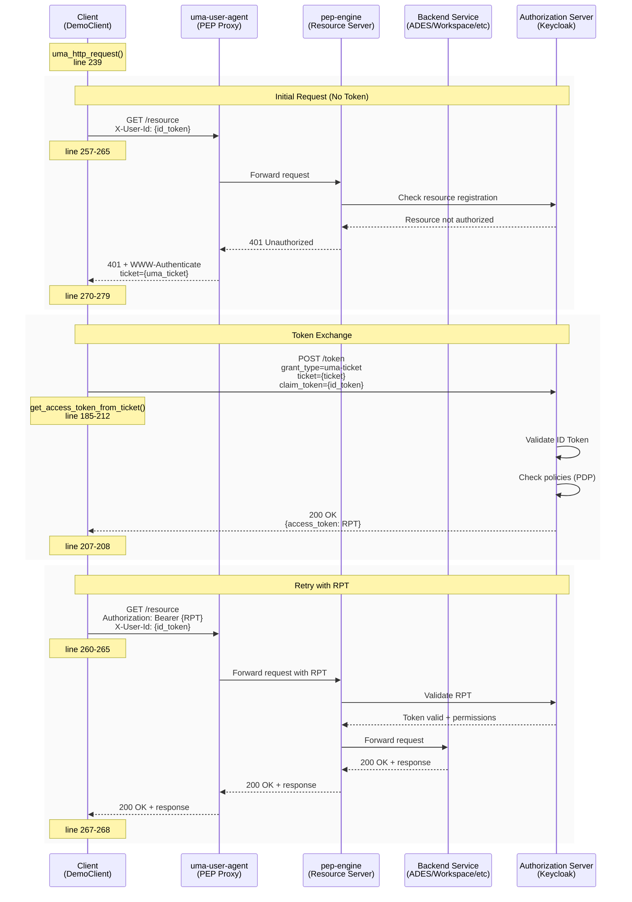
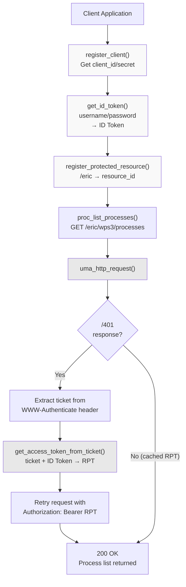

# UMA Authentication Flow

<details>
<summary>Relevant source files</summary>

The following files were used as context for generating this wiki page:

- [system/clusters/creodias/processing-and-chaining/proc-ades-guard.yaml](system/clusters/creodias/processing-and-chaining/proc-ades-guard.yaml)
- [system/clusters/creodias/processing-and-chaining/proc-ades.yaml](system/clusters/creodias/processing-and-chaining/proc-ades.yaml)
- [system/clusters/creodias/resource-management/hr-combined-rm-guard.yaml](system/clusters/creodias/resource-management/hr-combined-rm-guard.yaml)
- [system/clusters/creodias/resource-management/hr-workspace-api-guard.yaml](system/clusters/creodias/resource-management/hr-workspace-api-guard.yaml)
- [system/clusters/creodias/resource-management/rm-workspace-charts/template-hr-resource-guard.yaml](system/clusters/creodias/resource-management/rm-workspace-charts/template-hr-resource-guard.yaml)
- [system/clusters/creodias/resource-management/ss-harbor.yaml](system/clusters/creodias/resource-management/ss-harbor.yaml)
- [system/clusters/creodias/system/demo/hr-eoepca-portal.yaml](system/clusters/creodias/system/demo/hr-eoepca-portal.yaml)
- [system/clusters/creodias/system/demo/ss-django-secrets-create.sh](system/clusters/creodias/system/demo/ss-django-secrets-create.sh)
- [system/clusters/creodias/system/demo/ss-django-secrets.yaml](system/clusters/creodias/system/demo/ss-django-secrets.yaml)
- [system/clusters/creodias/system/test/hr-dummy-service-guard.yaml](system/clusters/creodias/system/test/hr-dummy-service-guard.yaml)
- [system/clusters/creodias/system/test/identity-dummy-service-ingress.yaml](system/clusters/creodias/system/test/identity-dummy-service-ingress.yaml)
- [system/clusters/creodias/user-management/um-identity-service.yaml](system/clusters/creodias/user-management/um-identity-service.yaml)
- [test/acceptance/02__Processing/01__ADES/01__API_PROC.robot](test/acceptance/02__Processing/01__ADES/01__API_PROC.robot)
- [test/acceptance/02__Processing/01__ADES/02__WPS.robot](test/acceptance/02__Processing/01__ADES/02__WPS.robot)
- [test/acceptance/__init__.robot](test/acceptance/__init__.robot)
- [test/client/.gitignore](test/client/.gitignore)
- [test/client/DemoClient.py](test/client/DemoClient.py)
- [test/client/debug/jwt-output-by-pep.json](test/client/debug/jwt-output-by-pep.json)
- [test/client/main.py](test/client/main.py)
- [test/client/requirements.txt](test/client/requirements.txt)
- [test/client/setup.sh](test/client/setup.sh)

</details>


## Purpose and Scope

This document provides a detailed technical explanation of the User-Managed Access (UMA) 2.0 authentication and authorization flow implemented throughout the EOEPCA platform. UMA is the protocol used to secure access to protected resources across all EOEPCA services, including ADES, Workspace API, Data Access, and Resource Catalogue services.

The document focuses specifically on the ticket-based authorization mechanism, token exchange processes, and the interaction between clients, Policy Enforcement Points (PEPs), and the Identity Service. For information about the PEP/PDP architecture and resource registration, see [Policy Enforcement (PEP/PDP)](#4.3). For details about the Identity Service deployment, see [Identity Service (Keycloak)](#4.1).

**Sources:** [test/client/DemoClient.py:239-291](), [system/clusters/creodias/processing-and-chaining/proc-ades-guard.yaml:61-82]()

## UMA Overview

User-Managed Access (UMA) is an OAuth2-based protocol that enables resource owners to control access to their protected resources. In EOEPCA, UMA provides fine-grained, policy-based access control where users can own and control access to their workspaces, processing jobs, and data resources.

### Key Components

| Component | Role | Implementation |
|-----------|------|----------------|
| **Authorization Server (AS)** | Issues tokens and tickets | Identity Service (Keycloak) at `auth.develop.eoepca.org` |
| **Resource Server (RS)** | Hosts protected resources | ADES, Workspace API, Data Access, etc. |
| **Policy Enforcement Point (PEP)** | Intercepts requests and enforces policies | `pep-engine` deployed with each protected service |
| **UMA User Agent** | Handles UMA flow and token exchange | `uma-user-agent` component |
| **Policy Decision Point (PDP)** | Evaluates access policies | PDP Engine at `auth.develop.eoepca.org` |
| **Client** | Requests access to resources | User applications, DemoClient, Robot tests |

**Sources:** [system/clusters/creodias/processing-and-chaining/proc-ades-guard.yaml:28-82](), [system/clusters/creodias/resource-management/hr-workspace-api-guard.yaml:28-85]()

## Token Types

The UMA flow involves several token types, each serving a specific purpose:

### ID Token

A JWT issued by the Identity Service after user authentication via username/password. The ID Token contains user identity claims and is used to prove the user's identity during the UMA flow.

**Obtained via:** Password grant to token endpoint with client credentials

```
POST /oxauth/restv1/token
grant_type=password
username={username}
password={password}
client_id={client_id}
client_secret={client_secret}
scope=openid user_name profile is_operator
```

**Sources:** [test/client/DemoClient.py:124-139]()

### UMA Ticket

A short-lived token issued by the PEP when an unauthorized request is made. The ticket represents a pending authorization request and must be exchanged for an RPT.

**Received via:** `WWW-Authenticate` header in 401 response from PEP

```
WWW-Authenticate: Bearer realm="...", ticket={uma_ticket}
```

**Sources:** [test/client/DemoClient.py:274-279]()

### RPT (Requesting Party Token)

The Requesting Party Token is the access token used to actually access protected resources. It is obtained by exchanging a UMA ticket + ID Token at the Authorization Server's token endpoint.

**Obtained via:** UMA ticket grant

```
POST /oxauth/restv1/token
grant_type=urn:ietf:params:oauth:grant-type:uma-ticket
ticket={uma_ticket}
claim_token={id_token}
claim_token_format=http://openid.net/specs/openid-connect-core-1_0.html#IDToken
client_id={client_id}
client_secret={client_secret}
```

**Sources:** [test/client/DemoClient.py:185-212]()

### Access Token (Cached RPT)

Once obtained, the RPT is reused for subsequent requests to the same resource until it expires. The client caches this token to avoid repeating the UMA flow unnecessarily.

**Sources:** [test/client/DemoClient.py:259-261]()

## Complete UMA Authentication Flow

The following diagram shows the complete UMA authentication flow with actual code references from the DemoClient implementation:



**Sources:** [test/client/DemoClient.py:239-291](), [system/clusters/creodias/processing-and-chaining/proc-ades-guard.yaml:61-82]()

## Detailed Flow Steps

### Step 1: Initial Request Without Token

When a client first attempts to access a protected resource, it may not have an access token. The request is sent with only the ID Token in the `X-User-Id` header:

```
GET https://ades.develop.eoepca.org/eric/wps3/processes
X-User-Id: {id_token}
```

The `uma-user-agent` component intercepts this request and forwards it to the `pep-engine`. Since no valid RPT is present, the PEP queries the Authorization Server to check if the resource is registered and if the user has access.

**Sources:** [test/client/DemoClient.py:256-264]()

### Step 2: 401 Response with UMA Ticket

The PEP responds with a `401 Unauthorized` status and includes a `WWW-Authenticate` header containing a UMA ticket:

```
HTTP/1.1 401 Unauthorized
WWW-Authenticate: Bearer realm="https://portal.develop.eoepca.org/oidc/authenticate/",ticket={uma_ticket}
```

The client parses this response to extract the ticket from the header.

**Implementation in DemoClient:**

```python
# line 270-279
elif r.status_code == 401:
    self.trace(log_prefix, "Received a 401 (Unauthorized) response to access attempt")
    if id_token is not None:
        location_header = r.headers["WWW-Authenticate"]
        for item in location_header.split(","):
            if item.split("=")[0] == "ticket":
                ticket = item.split("=")[1]
                break
```

**Sources:** [test/client/DemoClient.py:270-279](), [system/clusters/creodias/resource-management/hr-workspace-api-guard.yaml:84]()

### Step 3: Token Exchange (Ticket + ID Token → RPT)

The client exchanges the UMA ticket and ID Token for an RPT by making a request to the Authorization Server's token endpoint:

**Token Endpoint Discovery:**

The token endpoint URL is obtained from the UMA2 configuration at `/.well-known/uma2-configuration`:

```python
# line 74-85
def get_token_endpoint(self):
    if self.token_endpoint == None:
        headers = { 'content-type': "application/json" }
        r = self.http_request("GET", self.base_url + "/.well-known/uma2-configuration", headers=headers)
        self.token_endpoint = r.json()["token_endpoint"]
    return self.token_endpoint
```

**Token Exchange Request:**

```python
# line 185-212
def get_access_token_from_ticket(self, ticket, id_token):
    client_id, client_secret = self.get_client_credentials()
    headers = { 'content-type': "application/x-www-form-urlencoded", "cache-control": "no-cache" }
    data = {
        "claim_token_format": "http://openid.net/specs/openid-connect-core-1_0.html#IDToken",
        "claim_token": id_token,
        "ticket": ticket,
        "grant_type": "urn:ietf:params:oauth:grant-type:uma-ticket",
        "client_id": client_id,
        "client_secret": client_secret,
        "scope": "openid"
    }
    token_endpoint = self.get_token_endpoint()
    r = self.http_request("POST", token_endpoint, headers=headers, data=data)
    access_token = r.json()["access_token"]
    return access_token
```

The Authorization Server validates the ID Token, evaluates policies through the PDP, and issues an RPT if the user is authorized.

**Sources:** [test/client/DemoClient.py:185-212](), [test/client/DemoClient.py:74-85]()

### Step 4: Retry with RPT

The client retries the original request, this time including the RPT in the `Authorization` header:

```
GET https://ades.develop.eoepca.org/eric/wps3/processes
Authorization: Bearer {RPT}
X-User-Id: {id_token}
```

The `uma-user-agent` forwards the request to `pep-engine`, which validates the RPT with the Authorization Server. If valid, the PEP forwards the request to the backend service.

**Loop Control in Implementation:**

```python
# line 246-291
while repeat and count < 2:
    count += 1
    repeat = False
    # Set ID Token in header
    headers["X-User-Id"] = id_token
    # use access token if we have one
    if access_token is not None:
        headers["Authorization"] = f"Bearer {access_token}"
    # attempt access
    r = self.http_request(method, url, headers=headers, json=json, data=data)
    # if response is OK then nothing else to do
    if r.ok:
        self.trace(log_prefix, "Successfully accessed resource")
    # if we got a 401 then initiate the UMA flow
    elif r.status_code == 401:
        # ... ticket exchange ...
        access_token = self.get_access_token_from_ticket(ticket, id_token)
        repeat = True  # Retry with new RPT
```

**Sources:** [test/client/DemoClient.py:246-291]()

## RPT Token Structure

The RPT returned by the Authorization Server is a JWT containing permissions and claims. Example structure:

```json
{
  "header": {
    "alg": "RS256",
    "kid": "RSA1"
  },
  "payload": {
    "active": true,
    "exp": 1604406738,
    "iat": 1604403138,
    "permissions": [
      {
        "resource_id": "c90141d2-223a-4e51-ab00-99e31898e77b",
        "resource_scopes": ["Authenticated", "user_name", "openid"],
        "exp": 1604406738
      }
    ],
    "client_id": "cbc4f5c1-f444-4b0c-8ed2-6949f0f88476",
    "pct_claims": {
      "sub": ["24243808-b7a1-4c28-9b47-c0e5c84e7882"],
      "user_name": ["demo"],
      "iss": ["https://test.192.168.49.2.nip.io"]
    }
  }
}
```

The `permissions` array contains the resources the token grants access to, including the `resource_id` and allowed scopes. The `pct_claims` section contains user identity information from the ID Token.

**Sources:** [test/client/debug/jwt-output-by-pep.json:1-52]()

## Client Registration

Before performing the UMA flow, clients must register with the Authorization Server to obtain client credentials (`client_id` and `client_secret`):

```python
# line 87-111
def register_client(self, redirect_uris = [""]):
    if not "client_id" in self.state:
        if self.scim_client == None:
            self.scim_client = EOEPCA_Scim(self.base_url + "/")
        self.client = self.scim_client.registerClient(
            "Demo Client",
            grantTypes = ["client_credentials", "password", "urn:ietf:params:oauth:grant-type:uma-ticket"],
            redirectURIs = redirect_uris,
            logoutURI = "",
            responseTypes = ["code","token","id_token"],
            scopes = ['openid',  'email', 'user_name ','uma_protection', 'permission', 'is_operator', 'profile'],
            subject_type = "public",
            token_endpoint_auth_method = ENDPOINT_AUTH_CLIENT_POST)
        self.state["client_id"] = self.client["client_id"]
        self.state["client_secret"] = self.client["client_secret"]
```

The client must be registered with the `urn:ietf:params:oauth:grant-type:uma-ticket` grant type to support UMA flows.

**Sources:** [test/client/DemoClient.py:87-111]()

## Resource Registration

Before a resource can be protected, it must be registered with the PEP. This associates a resource URI with metadata and ownership:

```python
# line 141-183
def register_protected_resource(self, resource_api_url, uri, id_token, name, scopes, ownershipId=None):
    headers = { 'content-type': "application/json", "Authorization": f"Bearer {id_token}" }
    data = { "resource_scopes":scopes, "icon_uri":uri, "name":name}
    if ownershipId != None:
        data["uuid"] = ownershipId
    r = self.http_request("POST", f"{resource_api_url}/resources", headers=headers, json=data)
    resource_id= response_json['id']
```

**Example: Registering User Workspace**

```python
# From main.py lines 64-65
demo.register_protected_resource(wsapi_resource_api_url, wsapi_user_prefix, user_id_token, 
    f"Workspace for user {USER_NAME}", [])
```

This registers the workspace path `/workspaces/develop-user-eric` with the user as the default owner.

**Sources:** [test/client/DemoClient.py:141-183](), [test/client/main.py:54-75]()

## UMA Flow Configuration in Deployments

### UMA User Agent Configuration

The `uma-user-agent` component is configured in each resource-guard deployment:

```yaml
uma-user-agent:
  nginxIntegration:
    enabled: true
    hosts:
      - host: ades
        paths:
          - path: /(.*)
            service:
              name: proc-ades
              port: 80
  client:
    credentialsSecretName: "proc-uma-user-agent"
  logging:
    level: "info"
  unauthorizedResponse: 'Bearer realm="https://auth.develop.eoepca.org/oxauth/auth/passport/passportlogin.htm"'
  openAccess: false
```

Key configuration parameters:

| Parameter | Purpose |
|-----------|---------|
| `nginxIntegration.enabled` | Enables nginx ingress integration for request interception |
| `client.credentialsSecretName` | Secret containing OAuth2 client credentials for the UMA agent |
| `unauthorizedResponse` | The `WWW-Authenticate` header value returned on 401 responses |
| `openAccess` | If `true`, allows unauthenticated access; if `false`, enforces UMA |

**Sources:** [system/clusters/creodias/processing-and-chaining/proc-ades-guard.yaml:61-83]()

### PEP Engine Configuration

The `pep-engine` component registers default resources on deployment:

```yaml
pep-engine:
  configMap:
    asHostname: auth
    pdpHostname: auth
  customDefaultResources:
  - name: "ADES Service for user 'eric'"
    description: "Protected Access for eric to his space in the ADES"
    resource_uri: "/eric"
    scopes: []
    default_owner: "fad43ef3-23ef-48b0-86f0-1cf29d97908e"
```

The `default_owner` field contains the user's UUID (the `sub` claim from their ID Token), establishing initial ownership of the resource.

**Sources:** [system/clusters/creodias/processing-and-chaining/proc-ades-guard.yaml:28-49]()

## Practical Example: ADES Access

The following diagram shows a complete practical example of accessing the ADES service:



**Implementation Flow:**

1. **Client Registration:** [test/client/main.py:46-47]()
2. **Get ID Token:** [test/client/main.py:50-52]()
3. **Register Resource:** [test/client/main.py:54-56]()
4. **Call Protected Endpoint:** [test/client/main.py:158-160]()
5. **UMA Flow Handling:** [test/client/DemoClient.py:239-291]()

**Sources:** [test/client/main.py:38-160](), [test/client/DemoClient.py:383-395]()

## Token Caching and Reuse

The DemoClient implementation caches the RPT to avoid repeating the UMA flow on every request:

```python
# line 239-291
def uma_http_request(self, method, url, headers=None, id_token=None, access_token=None, json=None, data=None):
    # ... loop control ...
    while repeat and count < 2:
        # use access token if we have one
        if access_token is not None:
            self.trace(log_prefix, "Attempting to use existing access token")
            headers["Authorization"] = f"Bearer {access_token}"
        else:
            self.trace(log_prefix, "No existing access token - making a naive attempt"
        # ... perform request ...
        if r.ok:
            # Success - return with potentially reusable access_token
            return r, access_token
        elif r.status_code == 401:
            # Get new token and retry
            access_token = self.get_access_token_from_ticket(ticket, id_token)
            repeat = True
    return r, access_token
```

Callers should preserve the returned `access_token` for subsequent requests:

```python
# From Robot test line 63-66
${resp}  ${access_token}  @{processes} =  Proc List Processes  ${API_PROC_SERVICE_URL}  ${ID_TOKEN}  ${ACCESS_TOKEN}
Should Be True  $access_token is not None
Set Suite Variable  ${ACCESS_TOKEN}  ${access_token}
```

**Sources:** [test/client/DemoClient.py:239-291](), [test/acceptance/02__Processing/01__ADES/01__API_PROC.robot:63-66]()

## Non-UMA Alternative

For testing or specific use cases, the DemoClient also provides a non-UMA flow that uses ID Token directly:

```python
# line 231-237
def notuma_http_request(self, method, url, headers=None, id_token=None, access_token=None, json=None, data=None):
    if headers is None:
        headers = {}
    if id_token is not None:
        headers["Authorization"] = f"Bearer {id_token}"
    r = self.http_request(method, url, headers=headers, json=json, data=data)
    return r, None
```

This is used for endpoints like the Workspace API creation endpoint that don't go through the UMA flow:

```python
# line 310-327
def wsapi_create(self, service_base_url, name, owner=None, id_token=None, access_token=None):
    # ...
    r, access_token = self.notuma_http_request("POST", service_base_url + "/workspaces", 
        headers=headers, id_token=id_token, access_token=access_token, json=body_data)
```

**Sources:** [test/client/DemoClient.py:231-237](), [test/client/DemoClient.py:310-327]()

## Summary

The UMA authentication flow in EOEPCA provides fine-grained, policy-based access control through a ticket-based authorization mechanism:

1. **Client Registration:** Obtain OAuth2 client credentials
2. **User Authentication:** Get ID Token via password grant
3. **Resource Access Attempt:** Request protected resource with ID Token
4. **Ticket Issuance:** Receive 401 with UMA ticket
5. **Token Exchange:** Exchange ticket + ID Token for RPT
6. **Authorized Access:** Retry with RPT to access resource
7. **Token Reuse:** Cache RPT for subsequent requests

This flow is transparently handled by the `uma_http_request()` helper function, which manages the ticket exchange and retry logic automatically. All protected services in EOEPCA (ADES, Workspace API, Data Access, etc.) use this same UMA pattern through their deployed `resource-guard` instances.

**Sources:** [test/client/DemoClient.py:239-291](), [system/clusters/creodias/processing-and-chaining/proc-ades-guard.yaml:1-89](), [system/clusters/creodias/resource-management/hr-workspace-api-guard.yaml:1-91]()