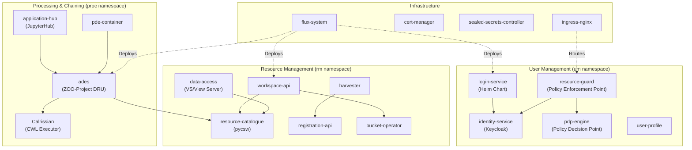
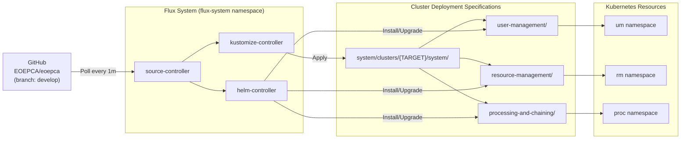

# Overview

Relevant source files

The following files were used as context for generating this wiki page:

- [README.md](README.md)
- [minikube/README.md](minikube/README.md)
- [release-notes/release-0.3.md](release-notes/release-0.3.md)
- [system/clusters/README.md](system/clusters/README.md)

## Purpose and Scope

This document provides a high-level introduction to the EOEPCA repository, which contains the reference implementation of the Earth Observation Exploitation Platform Common Architecture. It describes the repository's purpose, structure, major building blocks, and deployment model. For detailed deployment instructions, see [Getting Started](#2). For architectural details of individual subsystems, see [System Architecture](#3).

## About EOEPCA

The EOEPCA project establishes a consensus of best practices for Earth Observation (EO) Exploitation Platforms based on open standards. The goal is to enable interoperability between distributed EO platforms, creating an open network of resources where users can efficiently access and collaborate on geospatial analysis tasks.

This repository at `https://github.com/EOEPCA/eoepca` represents the **system integration** of building blocks that comprise the Common Architecture reference implementation. It is designed for deployment to cloud infrastructure orchestrated by Kubernetes and includes automation for provisioning, deploying, and testing the complete EOEPCA system.

**Sources:** [README.md:58-70]()

## Repository Structure

The repository is organized into several key directories that separate concerns for infrastructure provisioning, deployment specifications, and testing:

| Directory | Purpose |
|-----------|---------|
| `system/` | GitOps deployment specifications using Flux CD, organized by building block |
| `system/clusters/` | Cluster-specific deployment configurations (e.g., `develop`, `creodias`, `minikube`) |
| `creodias/` | Infrastructure provisioning for CREODIAS OpenStack using Terraform |
| `kubernetes/` | Kubernetes cluster setup using Rancher Kubernetes Engine (RKE) |
| `minikube/` | Local Kubernetes cluster setup for development using Minikube or k3s |
| `test/acceptance/` | Robot Framework acceptance test suite |
| `release-notes/` | Historical release documentation |

The `system/` directory contains subdirectories for each building block domain: `user-management/`, `resource-management/`, and `processing-and-chaining/`. Each contains HelmRelease resources and Kustomization manifests that define the deployment.

**Sources:** [README.md:88-96](), [system/clusters/README.md:1-95](), [minikube/README.md:1-53]()

## Major Building Blocks

EOEPCA consists of three major building block domains, each containing multiple services deployed as Kubernetes resources:

### User Management Building Blocks

The user management domain provides authentication and authorization services:

- **`identity-service`**: Keycloak-based identity provider with PostgreSQL backend, providing OAuth2/OIDC authentication
- **`login-service`**: Gluu-based login service (deprecated, replaced by Keycloak solution)
- **`pdp-engine`**: Policy Decision Point for evaluating access control policies
- **`resource-guard`**: Policy Enforcement Point that intercepts requests and enforces UMA-based authorization
- **`user-profile`**: SCIM-compliant user profile management

For detailed information, see [User Management and Identity](#4).

### Resource Management Building Blocks

The resource management domain handles data cataloging, access, and workspace provisioning:

- **`resource-catalogue`**: OGC CSW/OpenSearch interface built on `pycsw`, storing ISO 19115 metadata in PostgreSQL
- **`data-access`**: OGC WMS/WCS/WMTS services using EOX View Server with rendering and caching capabilities
- **`workspace-api`**: Multi-tenant workspace provisioning, creating per-user namespaces with isolated resources
- **`registration-api`**: API for registering datasets into the catalogue
- **`harvester`**: OpenSearch-based harvester for ingesting external data sources
- **`bucket-operator`**: MinIO bucket lifecycle management

For detailed information, see [Resource Management](#5).

### Processing & Chaining Building Blocks

The processing domain provides application deployment and execution capabilities:

- **`ades`**: Application Deployment and Execution Service based on ZOO-Project DRU, implementing OGC API Processes
- **`application-hub`**: JupyterHub deployment for interactive development environments
- **Calrissian**: CWL workflow executor that creates Kubernetes pods for processing tasks
- **`pde-container`**: Processor Development Environment with integrated tools

For detailed information, see [Processing and Chaining](#6).

**Sources:** [README.md:128-160](), [release-notes/release-0.3.md:1-319]()

## GitOps Deployment Model

EOEPCA uses Flux CD to implement a GitOps continuous delivery model. The deployment process reconciles the cluster state with declarative specifications stored in this Git repository:

The deployment is bootstrapped using the `deployCluster.sh` script, which executes `flux bootstrap github` to install Flux controllers and configure synchronization with the Git repository. Flux monitors HelmRelease and Kustomization resources in `system/clusters/${TARGET}/` and automatically reconciles the cluster state.

**Key Flux Resources:**

- **`GitRepository`**: Defines the Git source at `https://github.com/EOEPCA/eoepca` with polling interval
- **`Kustomization`**: References directories like `./user-management` to apply manifests
- **`HelmRelease`**: Defines Helm chart deployments with values overrides

The `TARGET` variable determines which cluster configuration to deploy (e.g., `develop`, `creodias`, `minikube`). Each target has cluster-specific values including:
- Public IP address for ingress (e.g., `185.52.193.87` for develop cluster)
- DNS domain using `nip.io` pattern (e.g., `185-52-193-87.nip.io`)
- TLS certificate configuration
- Resource limits and replicas

For more details, see [GitOps and Flux CD](#3.2).

**Sources:** [system/clusters/README.md:1-95](), [README.md:79-112]()

## Multi-Tenant Architecture

EOEPCA implements multi-tenancy through dynamic workspace provisioning. When a user requests a workspace via the `workspace-api`, the system:

1. Creates a dedicated Kubernetes namespace (e.g., `eric-workspace`)
2. Provisions an S3 bucket via `bucket-operator` and MinIO API
3. Instantiates template HelmReleases for user-specific services:
   - `template-hr-resource-catalogue`: Private catalogue instance
   - `template-hr-data-access`: Private data access service
   - `template-hr-resource-guard`: Private PEP for access control
4. Configures ownership policies based on user identity token

This architecture ensures isolation while enabling federated search across workspaces through the global `resource-catalogue` service.

For more details, see [Multi-Tenant Workspaces](#5.5).

**Sources:** [README.md:58-70]()

## Infrastructure and Technology Stack

### Kubernetes Platforms

EOEPCA supports multiple Kubernetes distributions:

- **Production**: Rancher Kubernetes Engine (RKE) on CREODIAS OpenStack
- **Development**: Minikube with Docker or native drivers
- **Lightweight**: k3s as an alternative to Minikube

**Sources:** [README.md:88-96](), [minikube/README.md:1-53]()

### Storage Architecture

Multiple storage tiers serve different purposes:

| Storage Type | Implementation | Purpose |
|--------------|----------------|---------|
| Object Storage (Input) | CloudFerro `eodata` S3 | Source EO datasets (read-only) |
| Object Storage (Output) | MinIO | Per-workspace output buckets |
| Persistent Volumes | NFS with `managed-nfs` StorageClass | Service state and metadata |
| Databases | PostgreSQL | Resource Catalogue metadata, Identity Service |
| Caching | Redis | Data Access caching, Harvester queues |

For more details, see [Storage and Persistence](#7).

### Implemented OGC Standards

EOEPCA implements the following OGC standards:

- **OGC API**: Processes, Coverages, Maps, Records, Features, Tiles
- **OGC Web Services**: WPS 2.0, WMS 1.1-1.3, WMTS 1.0, WCS 2.0, CSW 2.0.2/3.0.0
- **OpenSearch**: Geo, Time, and EO Extensions
- **Authentication**: OAuth2/OIDC, User-Managed Access (UMA) 2.0

**Sources:** [README.md:162-170](), [release-notes/release-0.3.md:49-81]()

## Naming and DNS Conventions

To simplify development and testing without requiring public DNS configuration, EOEPCA uses the `nip.io` dynamic DNS service. Service hostnames embed the cluster's public IP address:

**Format:** `<service-name>.<public-ip-with-dashes>.nip.io`

**Examples:**
- Minikube: `workspace.192-168-49-2.nip.io`
- CREODIAS develop: `workspace.185-52-193-87.nip.io`

Kubernetes Ingress resources use name-based routing with these hostnames. The public IP is baked into deployment configurations and must be updated when reusing configurations for different environments.

**Sources:** [README.md:100-112]()

## Next Steps

To deploy EOEPCA:
1. **Cloud Deployment**: Provision infrastructure with Terraform on OpenStack (see [Infrastructure Provisioning](#2.2)), then set up RKE Kubernetes cluster (see [Kubernetes Cluster Setup](#8.1))
2. **Local Development**: Set up Minikube or k3s (see [Local Development with Minikube](#9.3))
3. **Deploy System**: Use Flux CD for GitOps deployment (see [Deployment Guide](#2.1))
4. **Validate**: Run acceptance tests (see [Testing and Validation](#2.3))

For a detailed walkthrough, consult the [EOEPCA Deployment Guide](https://deployment-guide.docs.eoepca.org/).

**Sources:** [README.md:72-99]()