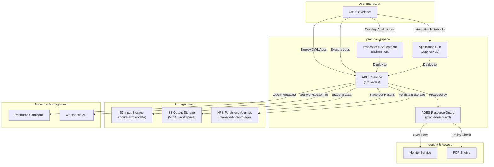
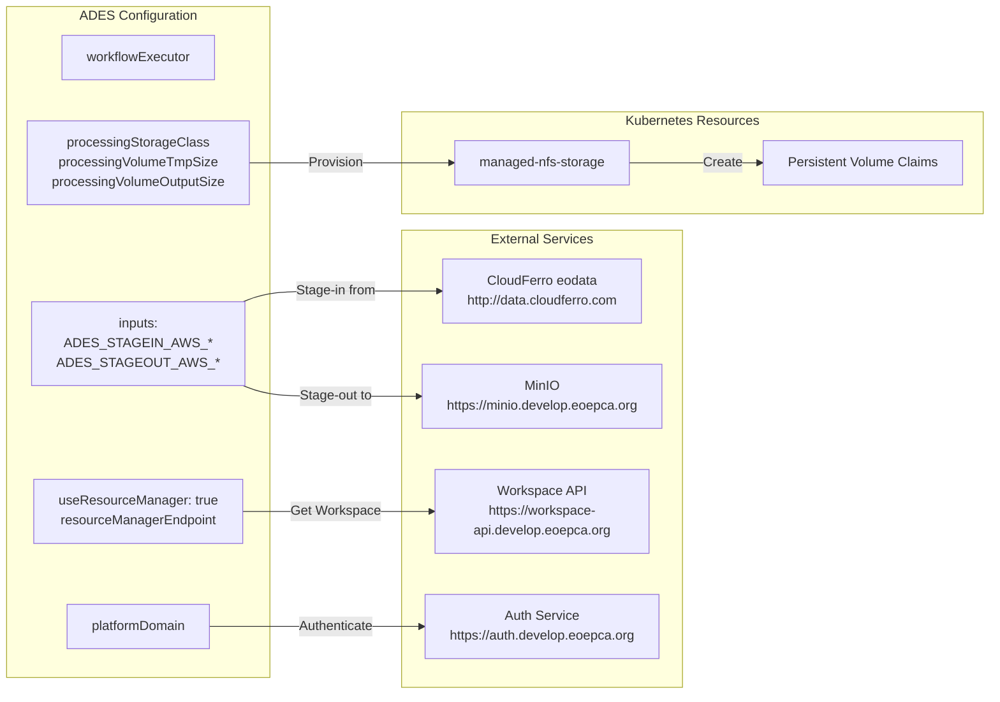
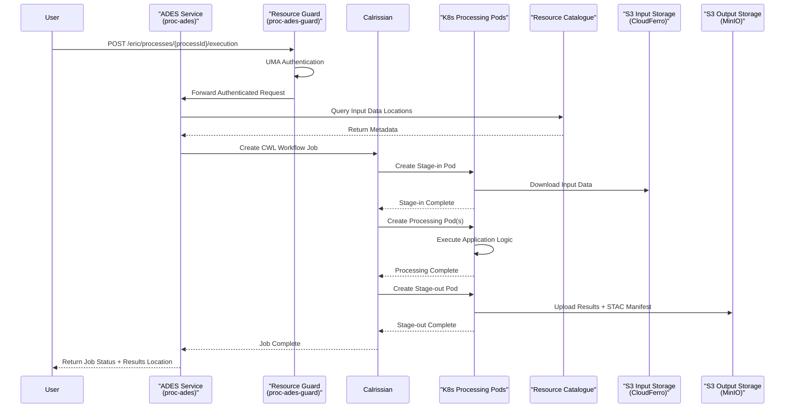
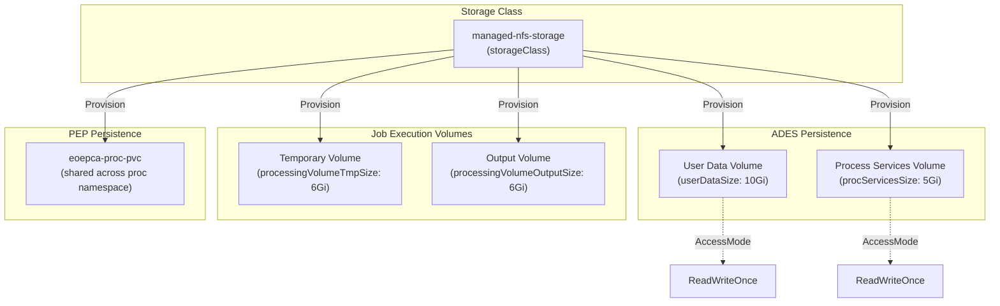
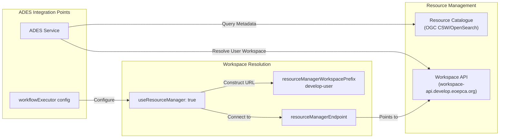

# Processing and Chaining

<details>
<summary>Relevant source files</summary>

The following files were used as context for generating this wiki page:

- [release-notes/release-0.3.md](release-notes/release-0.3.md)
- [system/clusters/creodias/processing-and-chaining/proc-ades-guard.yaml](system/clusters/creodias/processing-and-chaining/proc-ades-guard.yaml)
- [system/clusters/creodias/processing-and-chaining/proc-ades.yaml](system/clusters/creodias/processing-and-chaining/proc-ades.yaml)
- [system/clusters/creodias/resource-management/hr-combined-rm-guard.yaml](system/clusters/creodias/resource-management/hr-combined-rm-guard.yaml)
- [system/clusters/creodias/resource-management/hr-workspace-api-guard.yaml](system/clusters/creodias/resource-management/hr-workspace-api-guard.yaml)
- [system/clusters/creodias/resource-management/rm-workspace-charts/template-hr-resource-guard.yaml](system/clusters/creodias/resource-management/rm-workspace-charts/template-hr-resource-guard.yaml)
- [system/clusters/creodias/resource-management/ss-harbor.yaml](system/clusters/creodias/resource-management/ss-harbor.yaml)
- [system/clusters/creodias/system/test/hr-dummy-service-guard.yaml](system/clusters/creodias/system/test/hr-dummy-service-guard.yaml)

</details>


## Purpose and Scope

This document provides an overview of the Processing and Chaining subsystem within EOEPCA, which enables users to deploy, execute, and develop Earth Observation processing applications. The subsystem encompasses three primary components: the Application Deployment and Execution Service (ADES), Application Hub, and Processor Development Environment (PDE).

This page covers the high-level architecture and integration patterns. For detailed information on specific components, see:
- ADES implementation and OGC API Processes interface: [ADES](#6.1)
- Application Hub and JupyterHub deployment: [Application Hub](#6.2)
- PDE setup and development workflows: [Processor Development Environment](#6.3)
- PEP/PDP integration for processing services: [Resource Guards and Access Control](#6.4)
- CWL application package development: [CWL Application Packages](#6.5)

For data access and cataloging capabilities that support processing, see [Resource Management](#5).

## Overview

The Processing and Chaining subsystem provides the execution infrastructure for running user-defined processing workflows on Earth Observation data. It implements OGC standards (WPS 2.0, OGC API - Processes) and uses the Common Workflow Language (CWL) as the application description format. Processing jobs execute as Kubernetes pods orchestrated by the Calrissian workflow engine, enabling scalable, cloud-native execution patterns.

The subsystem supports the complete application lifecycle:
1. **Development** - Users develop and test applications in the PDE or Application Hub
2. **Deployment** - Applications packaged as CWL + Docker are deployed to ADES
3. **Execution** - ADES orchestrates data stage-in, processing, and stage-out
4. **Results** - Outputs are written to user workspaces with STAC metadata

## Component Architecture

The Processing and Chaining subsystem consists of three major components deployed in the `proc` namespace:



**Sources:** [system/clusters/creodias/processing-and-chaining/proc-ades.yaml:1-143](), [system/clusters/creodias/processing-and-chaining/proc-ades-guard.yaml:1-90]()

### ADES (Application Deployment and Execution Service)

The ADES is the core processing engine, deployed via HelmRelease `proc-ades` in the `proc` namespace. It provides OGC-compliant interfaces for deploying and executing CWL-based application packages.

| Configuration Aspect | Value | Description |
|---------------------|-------|-------------|
| Namespace | `proc` | Kubernetes namespace for processing services |
| Chart | `eoepca/ades:2.0.24` | Helm chart and version |
| Storage Class | `managed-nfs-storage` | NFS-based persistent storage |
| Workflow Executor | Calrissian | CWL engine with native Kubernetes integration |
| Max RAM per Job | `8Gi` | Resource limit for processing pods |
| Max CPU Cores | `4` | CPU limit for concurrent processing |

**Sources:** [system/clusters/creodias/processing-and-chaining/proc-ades.yaml:1-143]()

### Application Hub (JupyterHub)

The Application Hub provides interactive notebook environments for data exploration and algorithm prototyping. Users access JupyterLab instances with pre-configured access to EOEPCA services.

### Processor Development Environment (PDE)

The PDE is a complete development environment including JupyterLab, Theia IDE, local S3 storage (MinIO), and CI/CD tools (Jenkins) for building and testing application packages before deployment to ADES.

**Sources:** [release-notes/release-0.3.md:251-255]()

## ADES Configuration and Integration

The ADES integrates with multiple EOEPCA subsystems through its `workflowExecutor` configuration:



**Sources:** [system/clusters/creodias/processing-and-chaining/proc-ades.yaml:82-122]()

### Key Configuration Parameters

The ADES `workflowExecutor` section defines environment variables injected into all workflow stages:

| Parameter | Value | Purpose |
|-----------|-------|---------|
| `APP` | `ades` | Application identifier prefix `ADES_APP` |
| `STAGEIN_AWS_SERVICEURL` | `http://data.cloudferro.com` | Source S3 endpoint for input data |
| `STAGEIN_AWS_ACCESS_KEY_ID` | `test` | Credentials for stage-in |
| `STAGEIN_AWS_REGION` | `RegionOne` | AWS region for CloudFerro |
| `STAGEOUT_AWS_SERVICEURL` | `https://minio.develop.eoepca.org` | Destination S3 endpoint for outputs |
| `useResourceManager` | `"true"` | Enable Workspace API integration |
| `resourceManagerWorkspacePrefix` | `develop-user` | Workspace naming convention |
| `resourceManagerEndpoint` | `https://workspace-api.develop.eoepca.org` | Workspace API URL |
| `platformDomain` | `https://auth.develop.eoepca.org` | Identity service URL |

**Sources:** [system/clusters/creodias/processing-and-chaining/proc-ades.yaml:88-101]()

### Processing Resource Limits

The ADES enforces resource limits for each job execution:

| Resource | Configuration Parameter | Value |
|----------|------------------------|-------|
| Temporary Volume | `processingVolumeTmpSize` | `6Gi` |
| Output Volume | `processingVolumeOutputSize` | `6Gi` |
| Maximum RAM | `processingMaxRam` | `8Gi` |
| Maximum CPU Cores | `processingMaxCores` | `4` |
| Workspace Retention | `processingKeepWorkspace` | `false` (cleaned after success) |
| Failed Workspace Retention | `processingKeepWorkspaceIfFailed` | `True` |

**Sources:** [system/clusters/creodias/processing-and-chaining/proc-ades.yaml:109-120]()

## Workflow Execution Model

ADES executes CWL workflows using Calrissian, which translates CWL steps into Kubernetes pods. The execution follows a stage-in, process, stage-out pattern:



**Sources:** [system/clusters/creodias/processing-and-chaining/proc-ades.yaml:82-122](), [release-notes/release-0.3.md:30-40]()

### Workflow Stages

Each CWL workflow execution involves three stages:

1. **Stage-in**: Downloads input data from S3-compatible storage using parameters from `STAGEIN_AWS_*` environment variables. Input specifications use STAC manifests to describe data locations.

2. **Processing**: Executes user-defined Docker containers with mounted volumes (`processingVolumeTmpSize` for temporary data, `processingVolumeOutputSize` for results). Pods are subject to resource limits (`processingMaxRam`, `processingMaxCores`).

3. **Stage-out**: Uploads results to user workspace S3 bucket (`STAGEOUT_AWS_SERVICEURL`) and generates STAC manifest describing outputs.

**Sources:** [release-notes/release-0.3.md:66-76](), [system/clusters/creodias/processing-and-chaining/proc-ades.yaml:108-120]()

## Multi-Tenancy and Access Control

The Processing subsystem implements multi-tenancy through per-user resource protection. The `proc-ades-guard` HelmRelease deploys a resource-guard chart that creates PEP and UMA User Agent components.

```mermaid
graph TB
    subgraph "User Spaces in ADES"
        EricSpace["/eric<br/>owner: fad43ef3-...-1cf29d97908e"]
        BobSpace["/bob<br/>owner: f0a19e32-...-128c2c284300"]
        AliceSpace["/alice<br/>owner: 5fa1b608-...-46c79ec75b78"]
    end
    
    subgraph "Resource Guard Components"
        PEP["pep-engine<br/>(customDefaultResources)"]
        UMA["uma-user-agent<br/>(nginxIntegration)"]
    end
    
    subgraph "Backend Service"
        ADESService["proc-ades service<br/>(port 80)"]
    end
    
    subgraph "External Traffic"
        Ingress["Ingress<br/>ades.develop.eoepca.org"]
    end
    
    Ingress -->|"/(.*)| UMA
    UMA -->|Policy Enforcement| PEP
    PEP -->|Owns| EricSpace
    PEP -->|Owns| BobSpace
    PEP -->|Owns| AliceSpace
    UMA -->|"Proxy to /$1"| ADESService
```

**Sources:** [system/clusters/creodias/processing-and-chaining/proc-ades-guard.yaml:1-90]()

### Per-User Resource Registration

The ADES guard pre-registers protected resources for specific users:

| User | Resource URI | Owner ID | Description |
|------|-------------|----------|-------------|
| eric | `/eric` | `fad43ef3-23ef-48b0-86f0-1cf29d97908e` | Eric's ADES workspace |
| bob | `/bob` | `f0a19e32-5651-404e-8acd-128c2c284300` | Bob's ADES workspace |
| alice | `/alice` | `5fa1b608-2b28-4686-b571-46c79ec75b78` | Alice's ADES workspace |

**Sources:** [system/clusters/creodias/processing-and-chaining/proc-ades-guard.yaml:35-49]()

### Resource Guard Configuration

The `proc-ades-guard` HelmRelease configures two sub-charts:

1. **pep-engine**: Policy Enforcement Point that registers resources with the PDP
   - `configMap.asHostname`: `auth` - Authorization Server hostname
   - `configMap.pdpHostname`: `auth` - Policy Decision Point hostname
   - `customDefaultResources`: Array of user-specific protected resources
   - `volumeClaim.name`: `eoepca-proc-pvc` - Shared persistent storage

2. **uma-user-agent**: Nginx-integrated UMA proxy
   - `nginxIntegration.enabled`: `true` - Deploy as Ingress controller
   - `nginxIntegration.hosts[0].host`: `ades` - Hostname for routing
   - `nginxIntegration.hosts[0].paths[0].path`: `/(.*)` - Capture all paths
   - `nginxIntegration.hosts[0].paths[0].service.name`: `proc-ades` - Backend service
   - `client.credentialsSecretName`: `proc-uma-user-agent` - OIDC credentials
   - `unauthorizedResponse`: Bearer realm with authentication URL

**Sources:** [system/clusters/creodias/processing-and-chaining/proc-ades-guard.yaml:28-83]()

## Persistence and Storage

The Processing subsystem uses multiple storage mechanisms for different purposes:



**Sources:** [system/clusters/creodias/processing-and-chaining/proc-ades.yaml:131-139](), [system/clusters/creodias/processing-and-chaining/proc-ades-guard.yaml:56-57]()

### Storage Configuration Details

The ADES HelmRelease defines persistent storage through the `persistence` section:

| Volume Purpose | Configuration Key | Size | Access Mode | Storage Class |
|----------------|------------------|------|-------------|---------------|
| User Data | `userDataSize` | `10Gi` | `ReadWriteOnce` | `managed-nfs-storage` |
| Process Services | `procServicesSize` | `5Gi` | `ReadWriteOnce` | `managed-nfs-storage` |
| Job Temporary | `processingVolumeTmpSize` | `6Gi` | Dynamic (per job) | `managed-nfs-storage` |
| Job Output | `processingVolumeOutputSize` | `6Gi` | Dynamic (per job) | `managed-nfs-storage` |

The `clusterAdminRoleName: cluster-admin` configuration grants ADES the necessary permissions to create and manage pods dynamically through the Kubernetes API.

**Sources:** [system/clusters/creodias/processing-and-chaining/proc-ades.yaml:76-139]()

## Integration with Resource Management

The ADES integrates with the Resource Management subsystem to discover input data and provision user workspaces:



**Sources:** [system/clusters/creodias/processing-and-chaining/proc-ades.yaml:98-101]()

### Workspace API Integration

When `useResourceManager` is enabled, the ADES:
1. Extracts the username from the JWT token using `usernameJwtJsonPath: "user_name"`
2. Constructs the workspace name as `{resourceManagerWorkspacePrefix}-{username}`
3. Queries the Workspace API at `resourceManagerEndpoint` for workspace details
4. Uses the workspace-specific S3 bucket for stage-out operations

**Sources:** [system/clusters/creodias/processing-and-chaining/proc-ades.yaml:98-106]()

## Deployment Structure

The Processing and Chaining subsystem is deployed through Flux CD HelmRelease resources:

| Resource Name | Type | Chart | Version | Purpose |
|---------------|------|-------|---------|---------|
| `proc-ades` | HelmRelease | `eoepca/ades` | `2.0.24` | Core ADES service |
| `proc-ades-guard` | HelmRelease | `eoepca/resource-guard` | `1.3.2` | PEP/UMA protection for ADES |

Both resources are located in [system/clusters/creodias/processing-and-chaining/]() and reconciled by Flux CD with `interval: 1m0s`.

**Sources:** [system/clusters/creodias/processing-and-chaining/proc-ades.yaml:1-143](), [system/clusters/creodias/processing-and-chaining/proc-ades-guard.yaml:1-90]()

## Release History

Processing and Chaining capabilities were first introduced in Release 0.3, which included:

- OGC WPS 2.0 and OGC API Processes interfaces
- CWL application package deployment with Docker containers
- Calrissian workflow engine integration for native Kubernetes execution
- Data stage-in via OpenSearch catalogue references
- Data stage-out to S3 buckets with STAC manifests
- Dedicated user contexts within ADES
- Rule-based policies for resource protection
- Dynamic registration of per-user ADES resources
- Integration with Resource Catalogue for input data discovery
- Processor Development Environment with JupyterLab, Theia IDE, MinIO, and Jenkins

**Sources:** [release-notes/release-0.3.md:1-97](), [release-notes/release-0.3.md:220-249]()