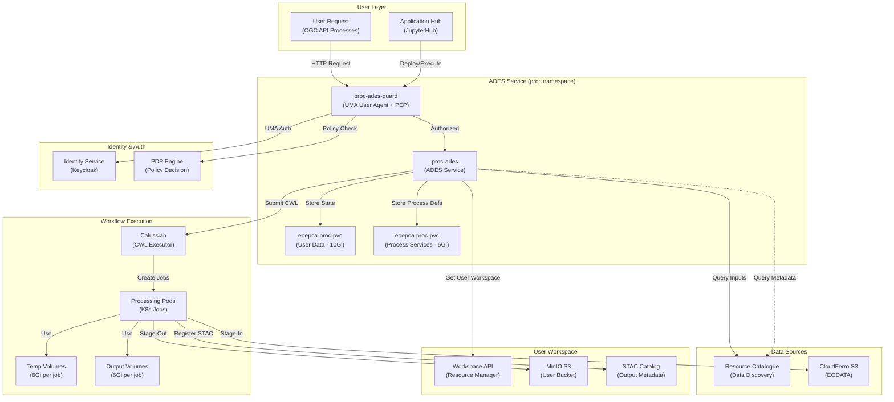
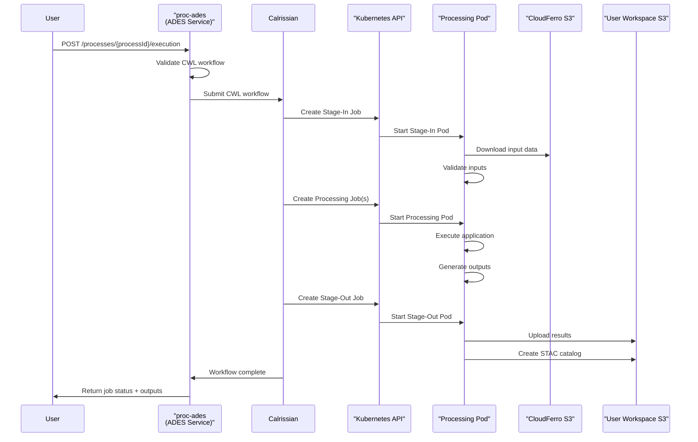
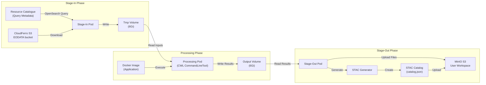
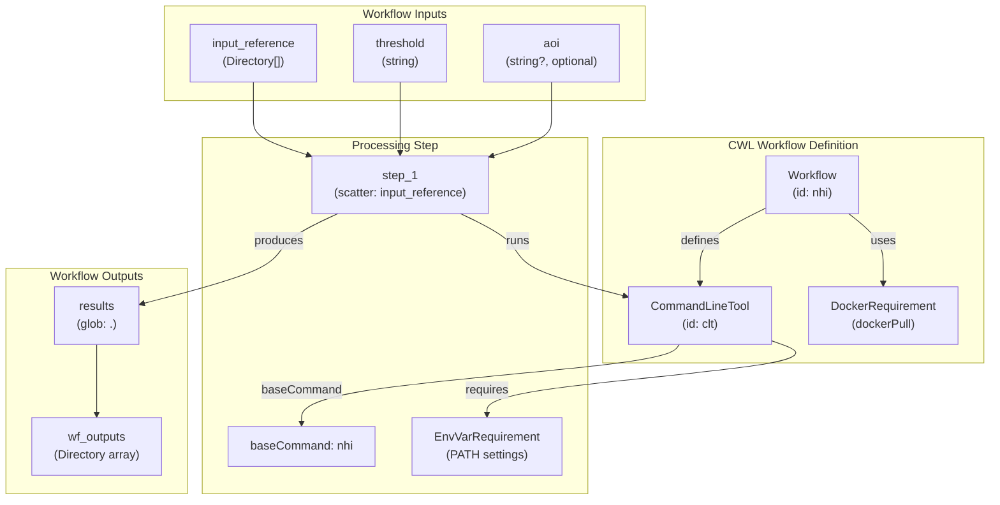

# ADES (Application Deployment and Execution Service)

<details>
<summary>Relevant source files</summary>

The following files were used as context for generating this wiki page:

- [.gitattributes](.gitattributes)
- [bin/dump-policy.sh](bin/dump-policy.sh)
- [bin/list-container-images.sh](bin/list-container-images.sh)
- [bin/unregister-resource.sh](bin/unregister-resource.sh)
- [system/clusters/creodias/processing-and-chaining/proc-ades-guard.yaml](system/clusters/creodias/processing-and-chaining/proc-ades-guard.yaml)
- [system/clusters/creodias/processing-and-chaining/proc-ades.yaml](system/clusters/creodias/processing-and-chaining/proc-ades.yaml)
- [system/clusters/creodias/resource-management/hr-combined-rm-guard.yaml](system/clusters/creodias/resource-management/hr-combined-rm-guard.yaml)
- [system/clusters/creodias/resource-management/hr-workspace-api-guard.yaml](system/clusters/creodias/resource-management/hr-workspace-api-guard.yaml)
- [system/clusters/creodias/resource-management/rm-workspace-charts/template-hr-resource-guard.yaml](system/clusters/creodias/resource-management/rm-workspace-charts/template-hr-resource-guard.yaml)
- [system/clusters/creodias/resource-management/ss-harbor.yaml](system/clusters/creodias/resource-management/ss-harbor.yaml)
- [system/clusters/creodias/system/test/hr-dummy-service-guard.yaml](system/clusters/creodias/system/test/hr-dummy-service-guard.yaml)
- [system/clusters/creodias/user-management/kustomization.yaml](system/clusters/creodias/user-management/kustomization.yaml)
- [system/clusters/data/register-S2-L1C-data.sh](system/clusters/data/register-S2-L1C-data.sh)
- [system/clusters/data/register-S2-L2A-data.sh](system/clusters/data/register-S2-L2A-data.sh)
- [test/acceptance/02__Processing/01__ADES/data/app-deploy-body-atom.json](test/acceptance/02__Processing/01__ADES/data/app-deploy-body-atom.json)
- [test/acceptance/02__Processing/01__ADES/data/app-deploy-body-cwl.json](test/acceptance/02__Processing/01__ADES/data/app-deploy-body-cwl.json)
- [test/acceptance/02__Processing/01__ADES/data/application-package-atom.xml](test/acceptance/02__Processing/01__ADES/data/application-package-atom.xml)
- [test/acceptance/02__Processing/01__ADES/data/application-package-cwl.cwl](test/acceptance/02__Processing/01__ADES/data/application-package-cwl.cwl)
- [test/acceptance/03__ResourceCatalogue/CatalogueServiceWeb.py](test/acceptance/03__ResourceCatalogue/CatalogueServiceWeb.py)
- [test/acceptance/03__ResourceCatalogue/Resource_catalogue.robot](test/acceptance/03__ResourceCatalogue/Resource_catalogue.robot)

</details>


## Purpose and Scope

The ADES (Application Deployment and Execution Service) is the core processing engine of the EOEPCA platform, responsible for deploying and executing user-defined Earth Observation processing applications. It implements the OGC API Processes standard (formerly WPS - Web Processing Service) and orchestrates Common Workflow Language (CWL) workflows using Calrissian as the execution engine within Kubernetes.

This document covers the ADES service architecture, deployment configuration, workflow execution, data stage-in/stage-out mechanisms, and integration with platform services. For information about developing applications for ADES, see [CWL Application Packages](#6.5). For the development environment used to create processors, see [Processor Development Environment (PDE)](#6.3). For security and access control patterns, see [Resource Guards and Access Control](#6.4).

**Sources:** [system/clusters/creodias/processing-and-chaining/proc-ades.yaml:1-143]()

## Architecture Overview

The ADES service acts as the orchestrator for processing workflows, bridging user requests with Kubernetes-based execution infrastructure. It manages the complete lifecycle of processing jobs including application deployment, input data stage-in, workflow execution, and output data stage-out.



**Diagram: ADES Architecture and Integration Points**

The ADES deployment consists of:
- **proc-ades**: Main service exposing OGC API Processes endpoints
- **proc-ades-guard**: Resource Guard providing UMA-based authentication and authorization
- **Calrissian**: CWL workflow executor that creates Kubernetes pods for processing
- **Persistent Volumes**: Storage for user data (10Gi) and process service definitions (5Gi)

**Sources:** [system/clusters/creodias/processing-and-chaining/proc-ades.yaml:1-143](), [system/clusters/creodias/processing-and-chaining/proc-ades-guard.yaml:1-90]()

## Deployment Configuration

The ADES service is deployed as a HelmRelease in the `proc` namespace using the `eoepca/ades` Helm chart.

### Service Configuration

| Parameter | Value | Purpose |
|-----------|-------|---------|
| Chart Version | 2.0.24 | ADES Helm chart version |
| Replica Count | 1 | Single instance deployment |
| Service Type | ClusterIP | Internal cluster access |
| Service Port | 80 | HTTP service port |
| Storage Class | managed-nfs-storage | NFS-backed persistent storage |
| Ingress Host | ades-open.develop.eoepca.org | Public access endpoint |

**Sources:** [system/clusters/creodias/processing-and-chaining/proc-ades.yaml:1-46]()

### Resource Limits

The ADES service itself (not the processing pods) has the following resource configuration:

```yaml
resources:
  limits:
    cpu: 2
    memory: 4Gi
  requests:
    cpu: 500m
    memory: 2Gi
```

**Sources:** [system/clusters/creodias/processing-and-chaining/proc-ades.yaml:59-69]()

### Persistent Storage

Two persistent volume claims are configured:

1. **User Data Volume**: 10Gi storage for user-specific data and job state
2. **Process Services Volume**: 5Gi storage for deployed application definitions

```yaml
persistence:
  enabled: true
  storageClass: "managed-nfs-storage"
  userDataAccessMode: ReadWriteOnce
  userDataSize: 10Gi
  procServicesAccessMode: ReadWriteOnce
  procServicesSize: 5Gi
```

**Sources:** [system/clusters/creodias/processing-and-chaining/proc-ades.yaml:131-139]()

## Workflow Execution with Calrissian

The ADES uses Calrissian as its workflow executor, which translates CWL (Common Workflow Language) workflows into Kubernetes jobs and pods.



**Diagram: ADES Workflow Execution Sequence**

### Workflow Executor Configuration

The workflow executor is configured with environment variables that are passed to all workflow stages:

| Parameter | Value | Purpose |
|-----------|-------|---------|
| `useKubeProxy` | True | Use Kubernetes proxy for API access |
| `clusterAdminRoleName` | cluster-admin | Role for Calrissian to create pods |
| `processingStorageClass` | managed-nfs-storage | Storage class for job volumes |
| `processingVolumeTmpSize` | 6Gi | Temporary storage per job |
| `processingVolumeOutputSize` | 6Gi | Output storage per job |
| `processingMaxRam` | 8Gi | Maximum RAM per job |
| `processingMaxCores` | 4 | Maximum CPU cores per job |
| `processingKeepWorkspace` | false | Clean workspace on success |
| `processingKeepWorkspaceIfFailed` | True | Keep workspace on failure for debugging |

**Sources:** [system/clusters/creodias/processing-and-chaining/proc-ades.yaml:76-122]()

### Workflow Input Environment Variables

All workflows receive the following prefixed environment variables (prefixed with `ADES_`):

```yaml
workflowExecutor:
  inputs:
    APP: ades
    STAGEIN_AWS_SERVICEURL: http://data.cloudferro.com
    STAGEIN_AWS_ACCESS_KEY_ID: test
    STAGEIN_AWS_SECRET_ACCESS_KEY: test
    STAGEIN_AWS_REGION: RegionOne
    STAGEOUT_AWS_SERVICEURL: https://minio.develop.eoepca.org
```

These become `ADES_APP`, `ADES_STAGEIN_AWS_SERVICEURL`, etc. in the workflow execution environment.

**Sources:** [system/clusters/creodias/processing-and-chaining/proc-ades.yaml:88-97]()

## Data Stage-In and Stage-Out

The ADES implements a three-stage workflow execution pattern: stage-in, processing, and stage-out.



**Diagram: ADES Data Stage-In/Stage-Out Pipeline**

### Stage-In Configuration

Stage-in retrieves input data from CloudFerro's EODATA S3 bucket:

- **Service URL**: `http://data.cloudferro.com`
- **Authentication**: Uses static credentials (`test`/`test`)
- **Region**: `RegionOne`
- **Access Pattern**: Read-only access to public EODATA bucket

Input references from the Resource Catalogue are resolved to S3 paths, and data is downloaded to temporary volumes attached to processing pods.

**Sources:** [system/clusters/creodias/processing-and-chaining/proc-ades.yaml:91-94]()

### Stage-Out Configuration

Stage-out uploads results to user-specific MinIO buckets managed by the Workspace API:

- **Service URL**: `https://minio.develop.eoepca.org`
- **Authentication**: Uses workspace-specific credentials from Resource Manager
- **Output Format**: STAC catalog with asset references
- **Destination**: User workspace bucket (e.g., `develop-user-eric-workspace`)

The stage-out process creates a STAC catalog describing all output products, including metadata, spatial/temporal extents, and asset links.

**Sources:** [system/clusters/creodias/processing-and-chaining/proc-ades.yaml:96-96]()

## Integration with Platform Services

The ADES integrates with multiple EOEPCA platform services to provide end-to-end processing capabilities.

### Resource Manager Integration

The ADES uses the Workspace API (Resource Manager) to determine user workspace locations and credentials:

```yaml
workflowExecutor:
  useResourceManager: "true"
  resourceManagerWorkspacePrefix: "develop-user"
  resourceManagerEndpoint: "https://workspace-api.develop.eoepca.org"
  platformDomain: "https://auth.develop.eoepca.org"
  usernameJwtJsonPath: "user_name"
```

The Resource Manager provides:
- User workspace bucket names
- S3 credentials for stage-out
- Namespace information for isolated execution

**Sources:** [system/clusters/creodias/processing-and-chaining/proc-ades.yaml:98-106]()

### Resource Catalogue Integration

The ADES queries the Resource Catalogue to:
- Resolve input data references from OpenSearch queries
- Discover available datasets by spatial/temporal constraints
- Retrieve metadata for input products

Input references in execution requests can be:
- Direct URLs to data products
- OpenSearch queries that return catalog entries
- STAC catalog references

**Example Input Reference from Test Data:**

```json
{
  "id": "input_reference",
  "input": {
    "format": {
      "mimeType": "application/json"
    },
    "href": "https://resource-catalogue.develop.eoepca.org/?mode=opensearch&service=CSW&version=3.0.0&request=GetRecords&elementsetname=full&resulttype=results&typenames=csw:Record&recordids=S2B_MSIL1C_20210402T095029_N0300_R079_T33SVB_20210402T121737.SAFE"
  }
}
```

**Sources:** [test/acceptance/02__Processing/01__ADES/data/app-deploy-body-atom.json:3-11]()

### Identity Service Integration

All ADES requests are authenticated via the UMA (User-Managed Access) pattern:
- User obtains ID token from Identity Service (Keycloak)
- ID token is exchanged for RPT (Requesting Party Token) via UMA ticket
- RPT contains user identity used to determine workspace location

The `usernameJwtJsonPath` configuration (`user_name`) specifies the JWT claim used to extract the username for workspace resolution.

**Sources:** [system/clusters/creodias/processing-and-chaining/proc-ades.yaml:106-106]()

## Access Control and Security

The ADES is protected by a Resource Guard deployment that enforces user-based access control.

### PEP Configuration

The `proc-ades-guard` HelmRelease deploys a Policy Enforcement Point (PEP) with user-specific resource protection:

```yaml
pep-engine:
  customDefaultResources:
  - name: "ADES Service for user 'eric'"
    description: "Protected Access for eric to his space in the ADES"
    resource_uri: "/eric"
    scopes: []
    default_owner: "fad43ef3-23ef-48b0-86f0-1cf29d97908e"
  - name: "ADES Service for user 'bob'"
    description: "Protected Access for bob to his space in the ADES"
    resource_uri: "/bob"
    scopes: []
    default_owner: "f0a19e32-5651-404e-8acd-128c2c284300"
  - name: "ADES Service for user 'alice'"
    description: "Protected Access for alice to her space in the ADES"
    resource_uri: "/alice"
    scopes: []
    default_owner: "5fa1b608-2b28-4686-b571-46c79ec75b78"
```

Each user has a protected path (e.g., `/eric`) that only they can access. The `default_owner` is the user's Keycloak UUID.

**Sources:** [system/clusters/creodias/processing-and-chaining/proc-ades-guard.yaml:34-49]()

### UMA User Agent Configuration

The UMA User Agent acts as an authentication proxy:

```yaml
uma-user-agent:
  nginxIntegration:
    enabled: true
    hosts:
      - host: ades
        paths:
          - path: /(.*)
            service:
              name: proc-ades
              port: 80
    annotations:
      nginx.ingress.kubernetes.io/proxy-read-timeout: "600"
      nginx.ingress.kubernetes.io/enable-cors: "true"
      nginx.ingress.kubernetes.io/rewrite-target: /$1
  client:
    credentialsSecretName: "proc-uma-user-agent"
  logging:
    level: "info"
  unauthorizedResponse: 'Bearer realm="https://auth.develop.eoepca.org/oxauth/auth/passport/passportlogin.htm"'
  openAccess: false
```

The proxy:
- Intercepts all requests to `https://ades.develop.eoepca.org`
- Validates UMA tokens with the Identity Service
- Enforces timeout of 600 seconds for long-running requests
- Enables CORS for browser-based clients

**Sources:** [system/clusters/creodias/processing-and-chaining/proc-ades-guard.yaml:61-83]()

### Resource Management Operations

Administrators can manage ADES resources using the `management_tools` CLI available in the PEP container:

**Dump all registered resources:**
```bash
kubectl -n proc exec -it deploy/ades-pep -c ades-pep -- management_tools list --all | jq
```

**Unregister a specific resource:**
```bash
kubectl -n proc exec -it svc/ades-pep -c ades-pep -- management_tools remove -r <resource-id>
```

**Sources:** [bin/dump-policy.sh:21-21](), [bin/unregister-resource.sh:36-39]()

## Application Package Format

The ADES supports two application package formats: CWL (Common Workflow Language) and OGC Application Packages embedded in ATOM feeds.

### CWL Application Package

CWL packages define workflows with typed inputs, Docker container references, and output specifications.

**Example CWL Workflow Structure:**



**Diagram: CWL Workflow Structure**

**Key CWL Elements:**

| Element | Purpose | Example Value |
|---------|---------|---------------|
| `$graph` | Defines workflow and tool definitions | Array of Workflow and CommandLineTool |
| `class: Workflow` | Top-level workflow definition | `id: nhi` |
| `class: CommandLineTool` | Executable tool definition | `id: clt` |
| `DockerRequirement` | Container image specification | `dockerPull: registry.hub.docker.com/eoepcaci/nhi:dev0.0.3` |
| `EnvVarRequirement` | Environment variables | `PATH: /usr/local/sbin:...:/srv/conda/envs/env_app_snuggs/bin` |
| `ResourceRequirement` | Resource constraints | Empty (uses ADES defaults) |
| `ScatterFeatureRequirement` | Parallel processing support | Enables scatter over inputs |

**Sources:** [test/acceptance/02__Processing/01__ADES/data/application-package-cwl.cwl:1-79]()

### Application Deployment Request

Applications are deployed by submitting a CWL package to the ADES:

```json
{
  "inputs": [
    {
      "id": "applicationPackage",
      "input": {
        "format": {
          "mimeType": "application/cwl"
        },
        "value": {
          "href": "https://raw.githubusercontent.com/EOEPCA/app-snuggs/main/app-package.cwl"
        }
      }
    }
  ],
  "outputs": [
    {
      "format": {
        "mimeType": "string",
        "schema": "string",
        "encoding": "string"
      },
      "id": "deployResult",
      "transmissionMode": "value"
    }
  ],
  "mode": "auto",
  "response": "raw"
}
```

The ADES retrieves the CWL from the provided `href`, validates it, and registers it as a process available for execution.

**Sources:** [test/acceptance/02__Processing/01__ADES/data/app-deploy-body-cwl.json:1-28]()

### ATOM Feed Application Package

ATOM feeds embed CWL workflows within XML:

```xml
<entry>
  <id>https://catalog.terradue.com:443/eoepca-services/search?format=atom&amp;uid=app-s-expression</id>
  <title type="text">s expressions</title>
  <summary type="html">Applies s expressions to EO acquisitions</summary>
  <owc:offering code="http://www.opengis.net/eoc/applicationContext/cwl"
    xmlns:owc="http://www.opengis.net/owc/1.0">
    <owc:content type="application/cwl">
      $graph:
      - baseCommand: s-expression
        class: CommandLineTool
        hints:
          DockerRequirement:
            dockerPull: eoepca/s-expression:dev0.0.2
        <!-- CWL content continues -->
    </owc:content>
  </owc:offering>
</entry>
```

This format allows application catalogs to be discovered via OpenSearch and deployed directly from catalog entries.

**Sources:** [test/acceptance/02__Processing/01__ADES/data/application-package-atom.xml:8-92]()

## Processing Resources and Constraints

The ADES enforces resource limits on processing jobs to ensure fair resource usage and prevent cluster exhaustion.

### Per-Job Resource Limits

| Resource | Limit | Configuration Parameter |
|----------|-------|------------------------|
| Temporary Storage | 6Gi | `processingVolumeTmpSize` |
| Output Storage | 6Gi | `processingVolumeOutputSize` |
| Maximum RAM | 8Gi | `processingMaxRam` |
| Maximum CPU Cores | 4 | `processingMaxCores` |
| Storage Class | managed-nfs-storage | `processingStorageClass` |

### Workspace Cleanup Policy

The ADES implements a cleanup policy for processing workspaces:

- **On Success** (`processingKeepWorkspace: false`): Workspace is deleted to free resources
- **On Failure** (`processingKeepWorkspaceIfFailed: True`): Workspace is retained for debugging

This allows users to inspect failed job data while ensuring successful jobs don't accumulate storage.

**Sources:** [system/clusters/creodias/processing-and-chaining/proc-ades.yaml:109-120]()

### Image Pull Secrets

The ADES can be configured with image pull secrets to access private container registries:

```yaml
workflowExecutor:
  imagePullSecrets: []
```

In production deployments, this would reference a Kubernetes secret containing credentials for Harbor or other private registries.

**Sources:** [system/clusters/creodias/processing-and-chaining/proc-ades.yaml:122-122]()

## Operational Procedures

### Monitoring Workflow Execution

View running processing pods:
```bash
kubectl -n proc get pods -l app=proc-ades
```

Check Calrissian job status:
```bash
kubectl -n proc get jobs
```

View workflow logs:
```bash
kubectl -n proc logs -l job-name=<job-name> --tail=100 -f
```

### Troubleshooting Failed Jobs

When `processingKeepWorkspaceIfFailed` is enabled, failed job data is retained in persistent volumes. Access the data:

```bash
# Find the PVC for a failed job
kubectl -n proc get pvc

# Mount and inspect
kubectl -n proc exec -it deploy/proc-ades -- ls -la /home/ades/workspaces
```

### Policy Management

The ADES PEP can be managed using the policy management scripts:

**Dump current ADES policies:**
```bash
./bin/dump-policy.sh proc ades-pep
```

**Unregister a resource from ADES:**
```bash
./bin/unregister-resource.sh <resource-id>
```

**Sources:** [bin/dump-policy.sh:21-21](), [bin/unregister-resource.sh:36-39]()

### Accessing ADES Endpoints

**Protected endpoint (requires authentication):**
- `https://ades.develop.eoepca.org/<username>/` - User-specific ADES instance

**Open endpoint (for testing):**
- `https://ades-open.develop.eoepca.org/` - Unprotected ADES instance

**API Documentation:**
- `/processes` - List available processes
- `/processes/{processId}` - Process description
- `/processes/{processId}/execution` - Execute process
- `/jobs/{jobId}` - Job status and results

**Sources:** [system/clusters/creodias/processing-and-chaining/proc-ades.yaml:51-54]()

## Related Documentation

- For developing CWL applications, see [CWL Application Packages](#6.5)
- For interactive development environments, see [Processor Development Environment (PDE)](#6.3)
- For deploying applications via JupyterHub, see [Application Hub (JupyterHub)](#6.2)
- For understanding the PEP/UMA authentication flow, see [UMA Authentication Flow](#4.4)
- For workspace provisioning and S3 bucket management, see [Workspace API](#5.3)
- For querying available datasets, see [Resource Catalogue](#5.2)
- For S3 storage architecture details, see [S3 Storage Architecture](#7.1)