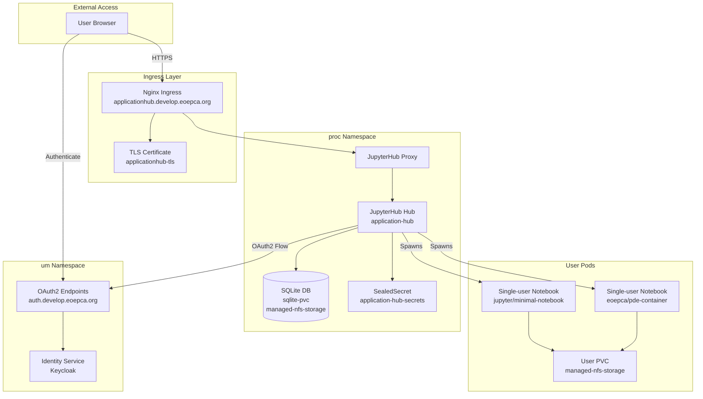
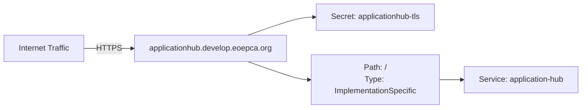
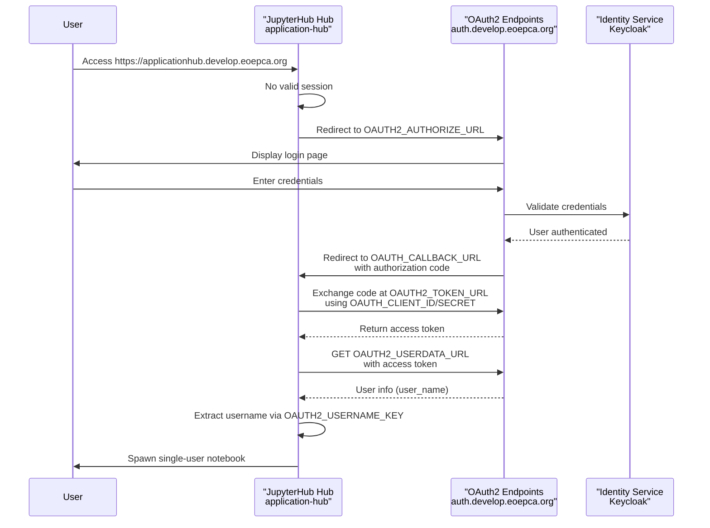
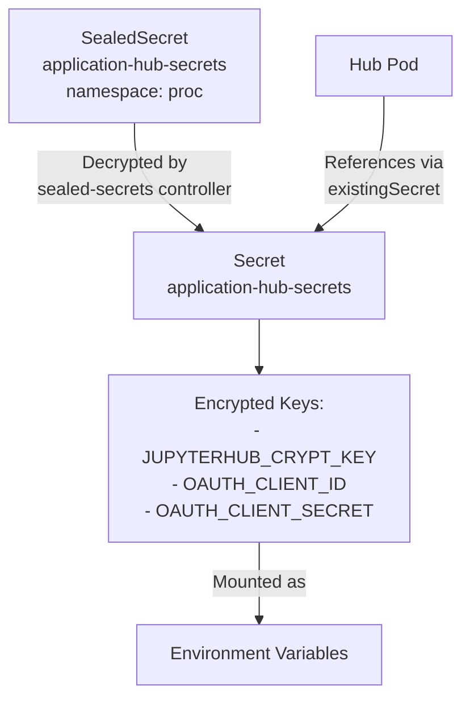
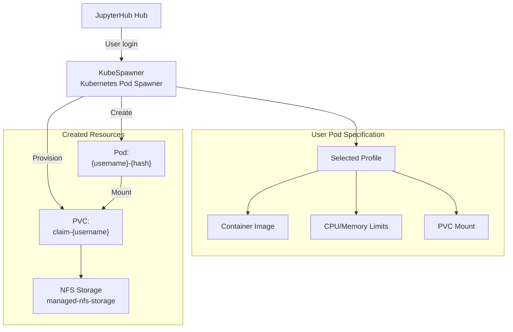
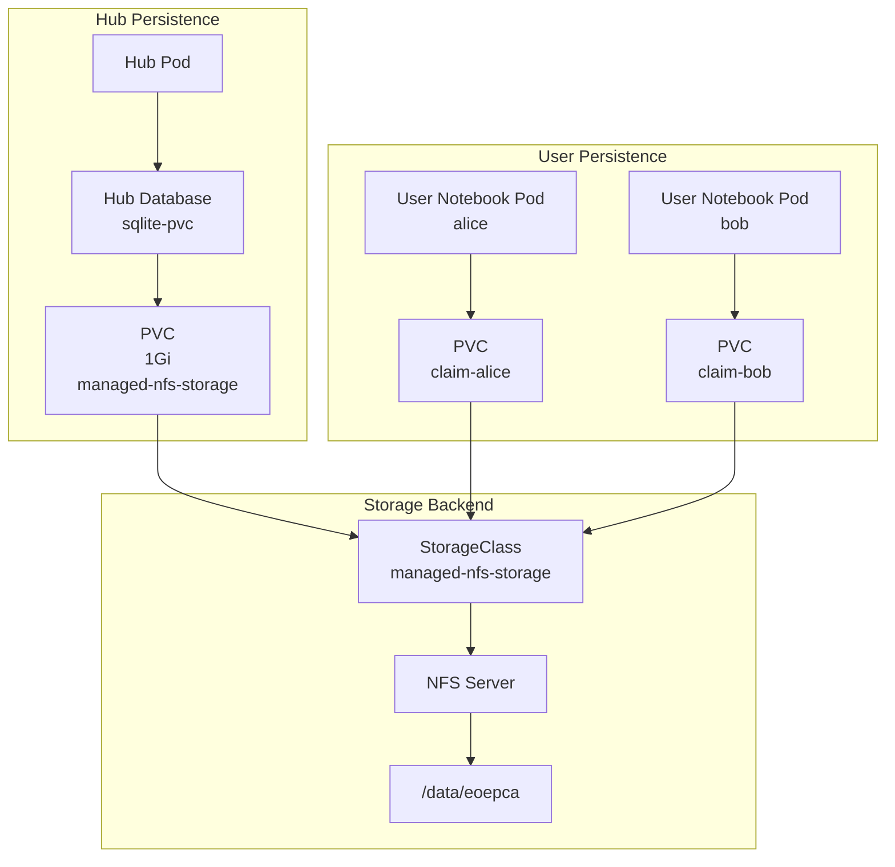
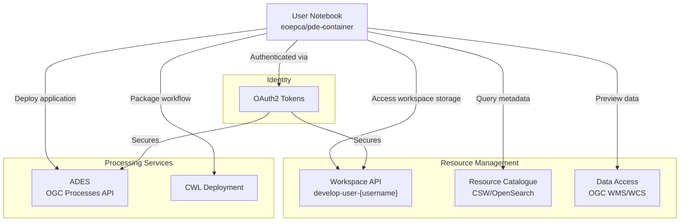
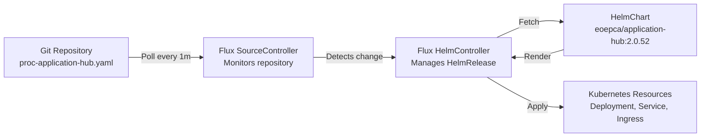

# Application Hub (JupyterHub)

<details>
<summary>Relevant source files</summary>

The following files were used as context for generating this wiki page:

- [system/clusters/creodias/processing-and-chaining/application-hub-sealed-secrets-create.sh](system/clusters/creodias/processing-and-chaining/application-hub-sealed-secrets-create.sh)
- [system/clusters/creodias/processing-and-chaining/application-hub-sealed-secrets.yaml](system/clusters/creodias/processing-and-chaining/application-hub-sealed-secrets.yaml)
- [system/clusters/creodias/processing-and-chaining/proc-application-hub.yaml](system/clusters/creodias/processing-and-chaining/proc-application-hub.yaml)

</details>


## Purpose and Scope

The Application Hub provides a multi-user JupyterHub environment for interactive development, testing, and execution of Earth Observation processing applications. It enables users to develop Common Workflow Language (CWL) application packages in Jupyter notebooks before deploying them to the ADES for production execution. The hub integrates with EOEPCA's identity management system via OAuth2, provisions isolated user environments with configurable resource profiles, and provides access to workspace storage for data persistence.

For information about deploying applications to production, see [ADES (Application Deployment and Execution Service)](#6.1). For details on the development environment setup, see [Processor Development Environment (PDE)](#6.3).

---

## System Overview

The Application Hub is deployed as a Kubernetes-native JupyterHub instance in the `proc` namespace. It serves as the primary development interface for users to interact with EOEPCA services, providing authenticated notebook environments with pre-configured access to the platform's resource management and processing capabilities.

**Deployment Architecture**



**Sources:** [system/clusters/creodias/processing-and-chaining/proc-application-hub.yaml:1-99]()

---

## HelmRelease Configuration

The Application Hub is deployed via a Flux CD HelmRelease that references the `eoepca/application-hub` Helm chart. The deployment is configured through the `proc-application-hub.yaml` manifest.

| Configuration Aspect | Value | Description |
|---------------------|-------|-------------|
| HelmRelease Name | `application-hub` | Flux resource identifier |
| Namespace | `proc` | Kubernetes namespace for processing services |
| Chart Version | `2.0.52` | EOEPCA application-hub chart version |
| Helm Repository | `eoepca` (common namespace) | Chart source reference |
| Reconciliation Interval | `1m0s` | Flux checks for updates every minute |

**Sources:** [system/clusters/creodias/processing-and-chaining/proc-application-hub.yaml:1-15](), [system/clusters/creodias/processing-and-chaining/proc-application-hub.yaml:99]()

### Ingress Configuration

The hub is exposed via an ingress resource with TLS termination:



**Sources:** [system/clusters/creodias/processing-and-chaining/proc-application-hub.yaml:16-27]()

---

## OAuth2 Authentication Integration

The Application Hub implements OAuth2 authentication against EOEPCA's Identity Service, enabling single sign-on and centralized user management. The authentication flow uses the authorization code grant with PKCE.

**OAuth2 Configuration Flow**



**Sources:** [system/clusters/creodias/processing-and-chaining/proc-application-hub.yaml:38-43]()

### OAuth2 Environment Variables

The hub's OAuth2 integration is configured via environment variables in the hub pod:

| Environment Variable | Value | Purpose |
|---------------------|-------|---------|
| `OAUTH_CALLBACK_URL` | `https://applicationhub.develop.eoepca.org/hub/oauth_callback` | Redirect URI after authentication |
| `OAUTH2_AUTHORIZE_URL` | `https://auth.develop.eoepca.org/oxauth/restv1/authorize` | OAuth2 authorization endpoint |
| `OAUTH2_TOKEN_URL` | `https://auth.develop.eoepca.org/oxauth/restv1/token` | Token exchange endpoint |
| `OAUTH2_USERDATA_URL` | `https://auth.develop.eoepca.org/oxauth/restv1/userinfo` | User profile endpoint |
| `OAUTH2_USERNAME_KEY` | `user_name` | JSON key for extracting username from userinfo response |
| `OAUTH_LOGOUT_REDIRECT_URL` | `https://applicationhub.develop.eoepca.org` | Post-logout redirect target |

**Sources:** [system/clusters/creodias/processing-and-chaining/proc-application-hub.yaml:38-43]()

### Secret Management

OAuth2 credentials and cryptographic keys are stored in a SealedSecret:



The sealed secrets are created using the `application-hub-sealed-secrets-create.sh` script, which generates a Kubernetes Secret and pipes it through `kubeseal` for encryption. The sealed secret is then committed to Git and decrypted at runtime by the sealed-secrets controller.

**Sources:** [system/clusters/creodias/processing-and-chaining/proc-application-hub.yaml:34](), [system/clusters/creodias/processing-and-chaining/proc-application-hub.yaml:47-63](), [system/clusters/creodias/processing-and-chaining/application-hub-sealed-secrets.yaml:1-17](), [system/clusters/creodias/processing-and-chaining/application-hub-sealed-secrets-create.sh:1-36]()

---

## Single-User Notebook Environments

When a user authenticates, JupyterHub spawns a dedicated single-user notebook server pod. The environment configuration is controlled by the `singleuser` and `profileList` sections of the HelmRelease.

**User Environment Spawning**



**Sources:** [system/clusters/creodias/processing-and-chaining/proc-application-hub.yaml:85-98]()

### Default Container Image

The default single-user image is `jupyter/minimal-notebook:2343e33dec46`, providing a baseline Python environment. The image can be overridden via environment variable or profile selection:

```
JUPYTERHUB_SINGLE_USER_IMAGE: "eoepca/pde-container:1.0.3"
```

**Sources:** [system/clusters/creodias/processing-and-chaining/proc-application-hub.yaml:37](), [system/clusters/creodias/processing-and-chaining/proc-application-hub.yaml:86-88]()

### Profile List Configuration

Users can select from multiple environment profiles at spawn time. The profile list defines different resource allocations and container images:

| Profile Display Name | Description | Default | Resource Overrides |
|---------------------|-------------|---------|-------------------|
| `Minimal environment` | Baseline Python environment | `True` | None (uses singleuser defaults) |
| `EOEPCA profile` | Enhanced environment for EO processing | `False` | `cpu_limit: 4`, `mem_limit: 8G` |

The profile configuration uses `kubespawner_override` to customize pod specifications. Note that profile definitions support arbitrary KubeSpawner configuration keys.

**Sources:** [system/clusters/creodias/processing-and-chaining/proc-application-hub.yaml:89-98]()

---

## Storage and Persistence

The Application Hub provisions persistent storage at multiple levels to ensure data durability across pod restarts.

**Storage Architecture**



**Sources:** [system/clusters/creodias/processing-and-chaining/proc-application-hub.yaml:44](), [system/clusters/creodias/processing-and-chaining/proc-application-hub.yaml:73-83]()

### Hub Database Configuration

The JupyterHub hub maintains its state in a SQLite database stored on a PersistentVolume:

| Configuration Key | Value | Description |
|------------------|-------|-------------|
| `jupyterhub.hub.db.type` | `sqlite-pvc` | Use SQLite with PVC backing |
| `jupyterhub.hub.db.pvc.storage` | `1Gi` | Database volume size |
| `jupyterhub.hub.db.pvc.storageClassName` | `managed-nfs-storage` | NFS-backed storage class |
| `jupyterhub.hub.db.pvc.accessModes` | `[ReadWriteOnce]` | Single-writer access mode |

**Sources:** [system/clusters/creodias/processing-and-chaining/proc-application-hub.yaml:73-83]()

### User Notebook Storage

Each user's notebook environment receives a dedicated PersistentVolumeClaim provisioned by the `managed-nfs-storage` StorageClass. The storage class is configured via the `STORAGE_CLASS` environment variable. User home directories persist across pod restarts, maintaining notebooks, data, and configuration files.

**Sources:** [system/clusters/creodias/processing-and-chaining/proc-application-hub.yaml:44]()

---

## Integration with EOEPCA Services

The Application Hub environment is pre-configured to interact with other EOEPCA building blocks, enabling users to develop applications that leverage platform capabilities.

**Service Integration Points**



**Sources:** [system/clusters/creodias/processing-and-chaining/proc-application-hub.yaml:37](), [system/clusters/creodias/processing-and-chaining/proc-application-hub.yaml:45]()

### Workspace Integration

The `RESOURCE_MANAGER_WORKSPACE_PREFIX` environment variable configures the naming convention for user workspaces. With the value `develop-user`, user workspaces are accessed at `develop-user-{username}`. This allows notebooks to programmatically construct workspace URLs and access user-specific resource catalogues and data access services.

**Sources:** [system/clusters/creodias/processing-and-chaining/proc-application-hub.yaml:45]()

### PDE Container Image

The `JUPYTERHUB_SINGLE_USER_IMAGE` can be set to `eoepca/pde-container:1.0.3`, which provides a Processor Development Environment with pre-installed tools for CWL development, STAC manipulation, and EOEPCA service interaction. This image includes libraries for interacting with the ADES and workspace services.

**Sources:** [system/clusters/creodias/processing-and-chaining/proc-application-hub.yaml:37]()

---

## Environment Configuration Summary

The following table summarizes all environment variables configured in the hub pod:

| Environment Variable | Source | Value/Description |
|---------------------|--------|-------------------|
| `JUPYTERHUB_ENV` | Static | `dev` - Development environment identifier |
| `JUPYTERHUB_SINGLE_USER_IMAGE` | Static | `eoepca/pde-container:1.0.3` - Default user container |
| `OAUTH_CALLBACK_URL` | Static | `https://applicationhub.develop.eoepca.org/hub/oauth_callback` |
| `OAUTH2_USERDATA_URL` | Static | `https://auth.develop.eoepca.org/oxauth/restv1/userinfo` |
| `OAUTH2_TOKEN_URL` | Static | `https://auth.develop.eoepca.org/oxauth/restv1/token` |
| `OAUTH2_AUTHORIZE_URL` | Static | `https://auth.develop.eoepca.org/oxauth/restv1/authorize` |
| `OAUTH_LOGOUT_REDIRECT_URL` | Static | `https://applicationhub.develop.eoepca.org` |
| `OAUTH2_USERNAME_KEY` | Static | `user_name` - Key in userinfo response |
| `STORAGE_CLASS` | Static | `managed-nfs-storage` - PVC storage class |
| `RESOURCE_MANAGER_WORKSPACE_PREFIX` | Static | `develop-user` - Workspace naming prefix |
| `JUPYTERHUB_CRYPT_KEY` | Secret | Reference to `application-hub-secrets` |
| `OAUTH_CLIENT_ID` | Secret | Reference to `application-hub-secrets` |
| `OAUTH_CLIENT_SECRET` | Secret | Reference to `application-hub-secrets` |

**Sources:** [system/clusters/creodias/processing-and-chaining/proc-application-hub.yaml:35-63]()

---

## Deployment and Lifecycle Management

The Application Hub follows EOEPCA's GitOps deployment model. Configuration changes are committed to the repository, and Flux CD automatically reconciles the cluster state.

**Deployment Workflow**



The reconciliation interval is set to `1m0s`, meaning Flux checks for configuration changes and chart updates every minute and automatically applies them to the cluster.

**Sources:** [system/clusters/creodias/processing-and-chaining/proc-application-hub.yaml:99]()