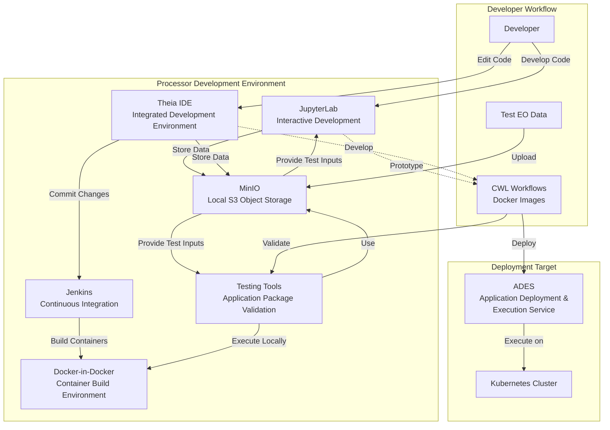
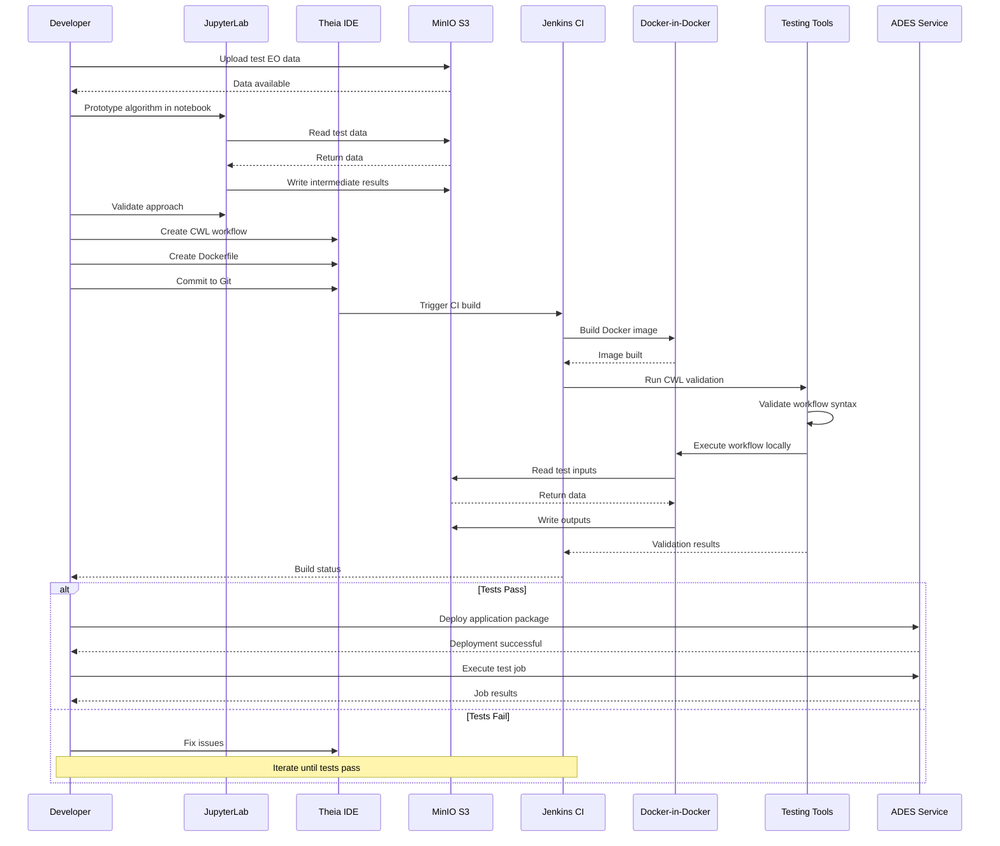

# Processor Development Environment (PDE)

Relevant source files

The following files were used as context for generating this wiki page:

- [release-notes/release-0.3.md](release-notes/release-0.3.md)
- [system/clusters/creodias/processing-and-chaining/namespace.yaml](system/clusters/creodias/processing-and-chaining/namespace.yaml)

## Purpose and Scope

The Processor Development Environment (PDE) provides an integrated development platform for creating, testing, and debugging CWL-based application packages that execute on the ADES. The PDE bundles multiple development tools into a cohesive environment, including interactive notebooks, IDEs, local object storage, continuous integration, and containerization capabilities.

For information about deploying applications to ADES, see [ADES](#6.1). For creating CWL application packages, see [CWL Application Packages](#6.5). For the end-user application development experience via JupyterHub, see [Application Hub](#6.2).

**Sources:** [release-notes/release-0.3.md:1-13](), [release-notes/release-0.3.md:42-48]()

---

## Overview

The PDE is a comprehensive development environment that supports the full lifecycle of Earth Observation processor development, from initial experimentation to production-ready CWL workflows. Unlike the Application Hub which provides user-facing JupyterHub access, the PDE is specifically focused on processor development with additional tooling for CI/CD, containerization, and local testing.

The PDE version 0.3 is documented in the proc-pde repository and provides a self-contained environment for developers working on application packages.

**Sources:** [release-notes/release-0.3.md:251-255]()

---

## PDE Architecture

The following diagram illustrates the components of the Processor Development Environment and their relationships:

**Diagram: PDE Component Architecture and Development Workflow**

This architecture shows how the PDE components work together to support the development lifecycle. Developers interact with JupyterLab for experimentation and Theia IDE for structured development. Code changes trigger Jenkins builds that use Docker-in-Docker for containerization. Testing tools validate application packages using MinIO as a local data store before deployment to the production ADES environment.

**Sources:** [release-notes/release-0.3.md:42-48]()

---

## Core Components

### JupyterLab Interface

JupyterLab provides an interactive notebook environment for rapid prototyping and experimentation with Earth Observation data and algorithms. Developers can:

- Interact with code and data through notebook interfaces
- Prototype processing algorithms using Python, R, or other kernels
- Visualize intermediate results and test outputs
- Access MinIO storage for reading test data and writing outputs

The JupyterLab component enables iterative development with immediate feedback, making it ideal for the initial stages of processor development.

**Sources:** [release-notes/release-0.3.md:43]()

### Theia IDE

Theia provides a full-featured integrated development environment similar to Visual Studio Code. The IDE supports:

- Syntax highlighting and code completion for CWL and other languages
- Integrated file explorer and terminal access
- Git integration for version control
- Debugging capabilities for application code
- Extension support for additional language and tool support

Developers use Theia for structured development of CWL application packages, Dockerfiles, and supporting scripts after initial prototyping in JupyterLab.

**Sources:** [release-notes/release-0.3.md:44]()

### MinIO S3 Object Storage

MinIO provides a local S3-compatible object storage system within the PDE, enabling:

- Storage of test EO data products
- Collection of processing results during development
- Simulation of S3-based stage-in/stage-out patterns used by ADES
- Testing of S3 API integration without external dependencies

The MinIO instance allows developers to test their application packages with realistic storage patterns before deployment to production ADES environments that use CloudFerro eodata or workspace-specific S3 buckets.

**Sources:** [release-notes/release-0.3.md:45]()

### Jenkins Continuous Integration

Jenkins provides automated build and test capabilities within the PDE:

- Automated container image builds triggered by code commits
- Continuous integration pipelines for application packages
- Test execution and validation reporting
- Integration with Docker-in-Docker for image building

The Jenkins instance enables developers to establish CI/CD practices early in the development process, ensuring code quality and facilitating collaboration among team members.

**Sources:** [release-notes/release-0.3.md:46]()

### Docker-in-Docker

The Docker-in-Docker component provides containerization capabilities with an Ubuntu host:

- Building Docker images for application packages
- Testing containerized workflows locally before ADES deployment
- Simulating Kubernetes pod execution patterns
- Debugging container runtime issues

This capability is essential for developing CWL application packages that rely on Docker containers for processor execution, as it allows developers to test container builds and runtime behavior in an environment similar to the production ADES/Calrissian execution environment.

**Sources:** [release-notes/release-0.3.md:47]()

### Application Package Testing Tools

The PDE includes specialized tools for validating CWL application packages:

- CWL workflow validation and linting
- Local execution of CWL workflows using cwltool or similar engines
- STAC manifest generation and validation
- Input/output parameter testing

These tools enable developers to verify their application packages meet ADES requirements before deployment, reducing deployment failures and iteration cycles.

**Sources:** [release-notes/release-0.3.md:48]()

---

## Development Workflow

The following sequence diagram illustrates a typical development workflow using the PDE:

**Diagram: PDE Development and Testing Workflow**

This workflow demonstrates the iterative development process:
1. Upload test data to MinIO
2. Prototype algorithms in JupyterLab
3. Formalize as CWL workflows in Theia IDE
4. Commit changes to trigger Jenkins CI
5. Build containers with Docker-in-Docker
6. Validate with testing tools
7. Deploy to ADES when tests pass

**Sources:** [release-notes/release-0.3.md:42-48]()

---

## Integration with ADES

The PDE is designed to produce application packages compatible with the ADES execution environment. Key integration points include:

| PDE Component | ADES Integration |
|--------------|------------------|
| CWL Workflows | Must conform to ADES/Calrissian CWL execution patterns |
| Docker Images | Tagged and pushed to registries accessible by ADES |
| STAC Manifests | Generated during testing to match ADES stage-in/stage-out formats |
| S3 Storage | MinIO simulates CloudFerro eodata and workspace bucket patterns |
| Testing Tools | Validate compliance with OGC API Processes requirements |

Developers use the PDE to ensure their application packages will execute correctly on ADES with Calrissian as the CWL engine. The local testing environment in the PDE mirrors the production ADES environment, including:

- CWL execution patterns with container isolation
- S3-based data access for inputs and outputs
- STAC-based input/output catalogs
- Kubernetes resource constraints

**Sources:** [release-notes/release-0.3.md:30-41](), [release-notes/release-0.3.md:222-249]()

---

## Deployment Context

The PDE operates within the `proc` namespace of the Kubernetes cluster, alongside other processing and chaining components like ADES and the Application Hub. While the Application Hub provides end-user access to Jupyter notebooks for interactive analysis, the PDE is a more comprehensive development environment specifically designed for building production-ready application packages.

The PDE version 0.3 includes all necessary tools and dependencies to develop, build, test, and deploy CWL-based processors without requiring additional external tools or services.

**Sources:** [system/clusters/creodias/processing-and-chaining/namespace.yaml:1-5](), [release-notes/release-0.3.md:251-255]()

---

## Component Versions (Release 0.3)

| Component | Version | Notes |
|-----------|---------|-------|
| PDE | 0.3 | Complete development environment |
| JupyterLab | Bundled | Interactive notebook interface |
| Theia IDE | Bundled | Full IDE capabilities |
| MinIO | Bundled | Local S3-compatible storage |
| Jenkins | Bundled | CI/CD automation |
| Docker-in-Docker | Ubuntu host | Container build environment |

The PDE is distributed as a cohesive package with all components pre-configured for processor development workflows.

**Sources:** [release-notes/release-0.3.md:251-255]()

---

## Summary

The Processor Development Environment provides a comprehensive, self-contained platform for developing CWL-based Earth Observation processors. By bundling JupyterLab, Theia IDE, MinIO storage, Jenkins CI, Docker-in-Docker, and specialized testing tools, the PDE enables developers to prototype, build, test, and deploy application packages efficiently. The environment simulates production ADES execution patterns, reducing deployment failures and accelerating the development cycle for Earth Observation processing applications.

**Sources:** [release-notes/release-0.3.md:42-48](), [release-notes/release-0.3.md:251-255]()