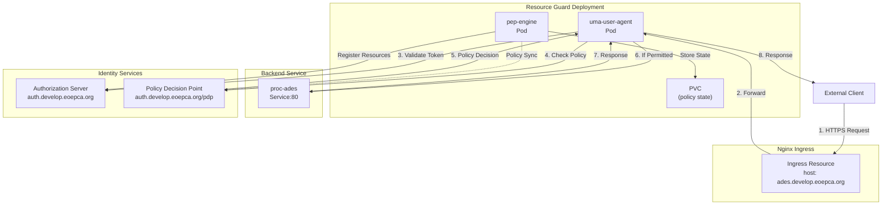
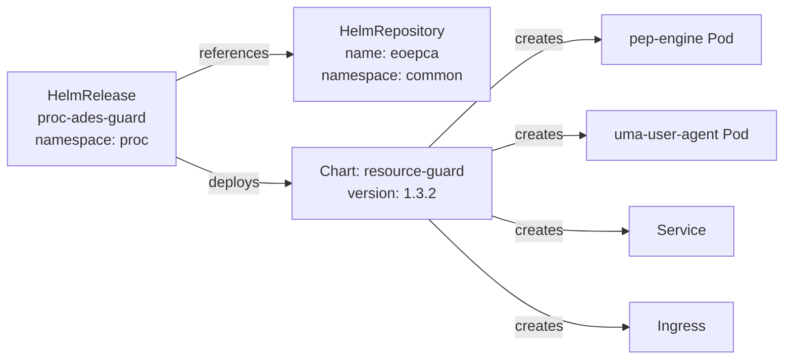
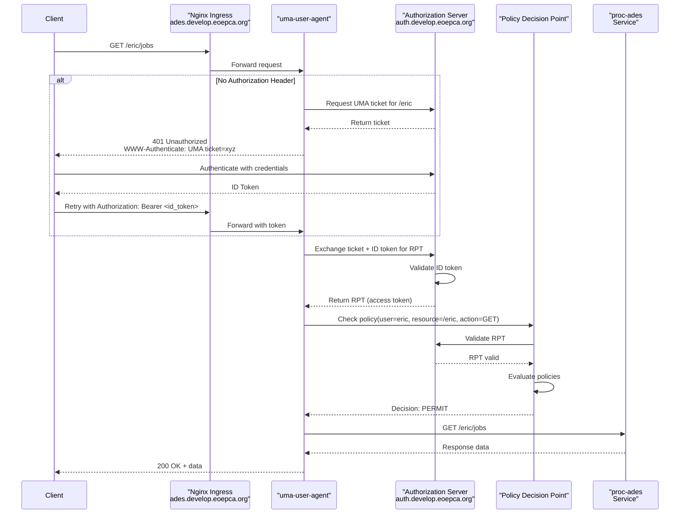
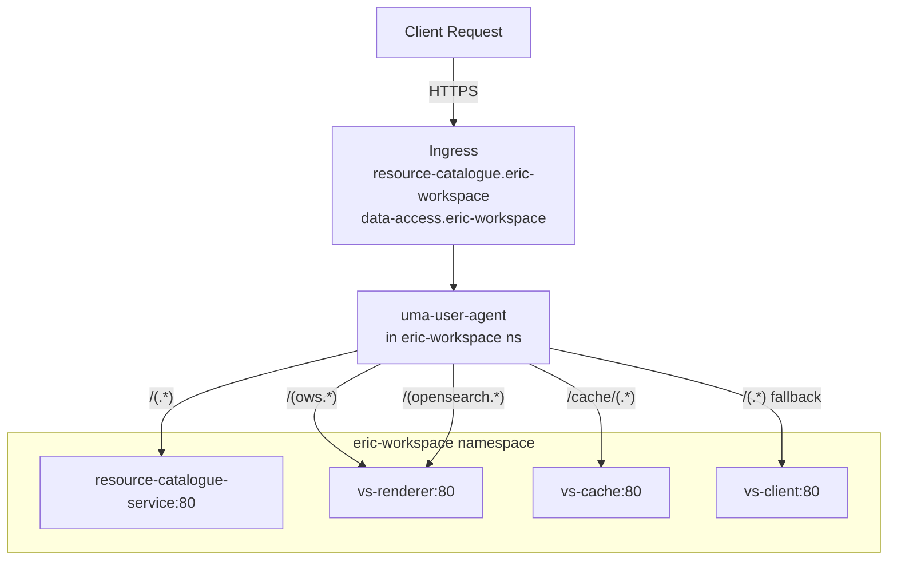

# Resource Guards and Access Control

<details>
<summary>Relevant source files</summary>

The following files were used as context for generating this wiki page:

- [system/clusters/creodias/processing-and-chaining/proc-ades-guard.yaml](system/clusters/creodias/processing-and-chaining/proc-ades-guard.yaml)
- [system/clusters/creodias/processing-and-chaining/proc-ades.yaml](system/clusters/creodias/processing-and-chaining/proc-ades.yaml)
- [system/clusters/creodias/resource-management/hr-combined-rm-guard.yaml](system/clusters/creodias/resource-management/hr-combined-rm-guard.yaml)
- [system/clusters/creodias/resource-management/hr-workspace-api-guard.yaml](system/clusters/creodias/resource-management/hr-workspace-api-guard.yaml)
- [system/clusters/creodias/resource-management/rm-workspace-charts/template-hr-resource-guard.yaml](system/clusters/creodias/resource-management/rm-workspace-charts/template-hr-resource-guard.yaml)
- [system/clusters/creodias/resource-management/ss-harbor.yaml](system/clusters/creodias/resource-management/ss-harbor.yaml)
- [system/clusters/creodias/system/test/hr-dummy-service-guard.yaml](system/clusters/creodias/system/test/hr-dummy-service-guard.yaml)

</details>


## Purpose and Scope

This document describes the resource guard deployment pattern used to protect services in the EOEPCA platform with policy-based access control. Resource guards act as Policy Enforcement Points (PEPs) that intercept requests to backend services, validate user authentication via UMA (User-Managed Access), and enforce authorization policies through the Policy Decision Point (PDP). This page focuses on how resource guards are configured, deployed, and integrated with protected services.

For information about the overall authentication and authorization flow, see [UMA Authentication Flow](#4.4). For details on policy management and the PDP engine, see [Policy Enforcement (PEP/PDP)](#4.3).

---

## Overview

A **resource guard** is a composite Kubernetes deployment that sits in front of a protected backend service and enforces access control policies. Each resource guard consists of two main components deployed together via the `resource-guard` Helm chart:

| Component | Function |
|-----------|----------|
| `pep-engine` | Registers protected resources with the Authorization Server (AS), maintains policy state, and communicates with the PDP for policy decisions |
| `uma-user-agent` | Handles UMA authentication flow, validates tokens, and integrates with nginx ingress to route authenticated requests to backend services |

Resource guards are deployed throughout the platform to protect:
- ADES service for processing workflows
- Workspace API for workspace management
- Resource Catalogue and Data Access services (both global and per-workspace)
- Custom application services requiring access control

**Sources:** [system/clusters/creodias/processing-and-chaining/proc-ades-guard.yaml:1-90](), [system/clusters/creodias/resource-management/hr-workspace-api-guard.yaml:1-92]()

---

## Resource Guard Architecture



**Diagram: Resource Guard Component Architecture**

The `pep-engine` runs as a separate pod that registers protected resources during startup and maintains policy state in a PersistentVolumeClaim. The `uma-user-agent` handles incoming requests, performs UMA authentication, validates policies, and proxies permitted requests to the backend service.

**Sources:** [system/clusters/creodias/processing-and-chaining/proc-ades-guard.yaml:28-83](), [system/clusters/creodias/resource-management/hr-workspace-api-guard.yaml:28-86]()

---

## Deployment Pattern

Resource guards are deployed as HelmRelease resources that install the `resource-guard` chart from the EOEPCA Helm repository. A typical deployment structure:



**Diagram: Resource Guard Deployment Resources**

The HelmRelease specifies:
- `global.context`: The service context name (used in hostnames and resource URIs)
- `global.domain`: The base domain for ingress
- `pep-engine` configuration: AS/PDP endpoints, default resources, volume claims
- `uma-user-agent` configuration: Nginx integration, backend routing, OIDC credentials

**Sources:** [system/clusters/creodias/processing-and-chaining/proc-ades-guard.yaml:1-14](), [system/clusters/creodias/processing-and-chaining/proc-ades-guard.yaml:15-24]()

---

## PEP Engine Configuration

The `pep-engine` component is configured to register protected resources and communicate with identity services:

### Basic Configuration

```yaml
pep-engine:
  configMap:
    asHostname: auth
    pdpHostname: auth
  volumeClaim:
    name: eoepca-proc-pvc
    create: false
  nginxIntegration:
    enabled: false
```

**Configuration Details:**

| Parameter | Purpose |
|-----------|---------|
| `asHostname` | Hostname of the Authorization Server (Keycloak) for UMA resource registration |
| `pdpHostname` | Hostname of the Policy Decision Point for policy evaluation |
| `volumeClaim.name` | PVC name for persisting registered resource state |
| `nginxIntegration.enabled` | Whether to deploy nginx integration (typically `false` when using separate `uma-user-agent`) |

**Sources:** [system/clusters/creodias/processing-and-chaining/proc-ades-guard.yaml:28-57]()

### Resource Registration

Protected resources are pre-registered during PEP engine startup. Two types of resource definitions exist:

1. **defaultResources**: Standard protected paths
2. **customDefaultResources**: User-specific or custom-scoped resources

Example from ADES guard:

```yaml
customDefaultResources:
  - name: "ADES Service for user 'eric'"
    description: "Protected Access for eric to his space in the ADES"
    resource_uri: "/eric"
    scopes: []
    default_owner: "fad43ef3-23ef-48b0-86f0-1cf29d97908e"
  - name: "ADES Service for user 'bob'"
    description: "Protected Access for bob to his space in the ADES"
    resource_uri: "/bob"
    scopes: []
    default_owner: "f0a19e32-5651-404e-8acd-128c2c284300"
```

Each resource definition specifies:
- `name`: Human-readable resource identifier
- `description`: Resource purpose
- `resource_uri`: Path pattern to protect (e.g., `/eric`, `/bob`)
- `scopes`: Optional scopes for fine-grained permissions (empty means default permissions)
- `default_owner`: User ID (from Identity Service) who owns this resource

**Sources:** [system/clusters/creodias/processing-and-chaining/proc-ades-guard.yaml:34-49](), [system/clusters/creodias/resource-management/hr-workspace-api-guard.yaml:35-53]()

---

## UMA User Agent Configuration

The `uma-user-agent` component handles the UMA authentication flow and routes requests to backend services:

### Nginx Integration

```yaml
uma-user-agent:
  nginxIntegration:
    enabled: true
    hosts:
      - host: ades
        paths:
          - path: /(.*)
            service:
              name: proc-ades
              port: 80
    annotations:
      nginx.ingress.kubernetes.io/proxy-read-timeout: "600"
      nginx.ingress.kubernetes.io/enable-cors: "true"
      nginx.ingress.kubernetes.io/rewrite-target: /$1
```

**Routing Configuration:**

| Field | Purpose |
|-------|---------|
| `hosts[].host` | Ingress hostname (combined with `global.domain` to form FQDN) |
| `paths[].path` | Request path pattern with capture group for rewriting |
| `paths[].service.name` | Backend Kubernetes service name |
| `paths[].service.port` | Backend service port |
| `annotations` | Nginx ingress annotations for timeout, CORS, path rewriting |

**Sources:** [system/clusters/creodias/processing-and-chaining/proc-ades-guard.yaml:61-77]()

### Authentication Settings

```yaml
uma-user-agent:
  client:
    credentialsSecretName: "proc-uma-user-agent"
  logging:
    level: "info"
  unauthorizedResponse: 'Bearer realm="https://auth.develop.eoepca.org/oxauth/auth/passport/passportlogin.htm"'
  openAccess: false
```

**Authentication Parameters:**

| Parameter | Purpose |
|-----------|---------|
| `credentialsSecretName` | Kubernetes Secret containing OIDC client ID and secret for token validation |
| `unauthorizedResponse` | WWW-Authenticate header returned on 401 (directs user to login) |
| `openAccess` | If `true`, allows unauthenticated access (used for public services) |

**Sources:** [system/clusters/creodias/processing-and-chaining/proc-ades-guard.yaml:78-83](), [system/clusters/creodias/resource-management/hr-combined-rm-guard.yaml:89-94]()

---

## Request Flow Through Resource Guard



**Diagram: UMA Authentication and Authorization Flow**

1. Client attempts to access protected resource without token
2. `uma-user-agent` requests UMA ticket from Authorization Server
3. Client receives 401 with WWW-Authenticate header containing ticket
4. Client authenticates with Authorization Server, receives ID token
5. Client retries request with ID token
6. `uma-user-agent` exchanges ticket + ID token for RPT (Requesting Party Token)
7. `uma-user-agent` validates RPT with PDP, checking if user can access resource
8. If policy permits, request is forwarded to backend service
9. Response is returned to client

**Sources:** [system/clusters/creodias/processing-and-chaining/proc-ades-guard.yaml:61-83]()

---

## Multi-Backend Routing

Some resource guards protect multiple backend services with different routing rules. The combined resource management guard demonstrates this pattern:

```yaml
uma-user-agent:
  nginxIntegration:
    enabled: true
    hosts:
      - host: resource-catalogue
        paths:
          - path: /(.*)
            service:
              name: resource-catalogue-service
              port: 80
      - host: data-access
        paths:
          - path: /(ows.*)
            service:
              name: data-access-renderer
              port: 80
          - path: /(opensearch.*)
            service:
              name: data-access-renderer
              port: 80
          - path: /cache/(.*)
            service:
              name: data-access-cache
              port: 80
          - path: /(.*)
            service:
              name: data-access-client
              port: 80
```

**Routing Logic:**

- Multiple hosts can be defined, each with its own subdomain
- Paths are evaluated in order, with more specific patterns first
- Capture groups `(.*)` are used with `rewrite-target: /$1` to strip prefix
- Different paths can route to different backend services

**Sources:** [system/clusters/creodias/resource-management/hr-combined-rm-guard.yaml:50-88]()

---

## Workspace-Specific Resource Guards

For multi-tenant workspaces, resource guards are dynamically instantiated from templates. The Workspace API creates per-user namespaces with dedicated resource guards.

### Template Structure

```yaml
apiVersion: helm.toolkit.fluxcd.io/v2beta1
kind: HelmRelease
metadata:
  name: resource-guard
spec:
  values:
    global:
      context: "{{ workspace_name }}"
      domain: develop.eoepca.org
      default_owner: {{ default_owner }}
    pep-engine:
      volumeClaim:
        name: "{{ workspace_name }}-pep-pvc"
        create: "true"
      defaultResources:
        - name: "Workspace {{ workspace_name }} Root"
          description: "Root URL of a users workspace"
          resource_uri: "/"
          scopes: []
          default_owner: {{ default_owner }}
```

**Template Variables:**

| Variable | Substituted By | Example Value |
|----------|----------------|---------------|
| `{{ workspace_name }}` | Workspace API | `eric-workspace` |
| `{{ default_owner }}` | Workspace API | `fad43ef3-23ef-48b0-86f0-1cf29d97908e` |

When a user requests a workspace, the Workspace API:
1. Creates a dedicated Kubernetes namespace (e.g., `eric-workspace`)
2. Substitutes template variables with user-specific values
3. Creates a HelmRelease from the template in the user's namespace
4. The resource guard protects all services in that workspace

**Sources:** [system/clusters/creodias/resource-management/rm-workspace-charts/template-hr-resource-guard.yaml:1-98]()

### Workspace Guard Routing

Workspace resource guards route to multiple services within the workspace namespace:



**Diagram: Workspace Resource Guard Routing**

The workspace guard creates two ingress hosts:
- `resource-catalogue.{{ workspace_name }}.develop.eoepca.org`
- `data-access.{{ workspace_name }}.develop.eoepca.org`

Each host routes to different services based on path patterns, with all requests protected by the same PEP/UMA authentication.

**Sources:** [system/clusters/creodias/resource-management/rm-workspace-charts/template-hr-resource-guard.yaml:49-98]()

---

## ADES Integration with Resource Guards

The ADES service can optionally use a resource guard for access control. The integration is configured in the ADES HelmRelease:

```yaml
wps:
  pepBaseUrl: "http://ades-pep:5576"
  usePep: "false"
```

When `usePep` is set to `"true"`, the ADES communicates with the PEP engine to enforce access control on workflow submissions and job management operations. However, in the current deployment, ADES uses an external resource guard via nginx ingress rather than direct PEP integration.

The ADES guard pre-registers user-specific paths:

| User | Resource URI | Owner ID |
|------|--------------|----------|
| eric | `/eric` | `fad43ef3-23ef-48b0-86f0-1cf29d97908e` |
| bob | `/bob` | `f0a19e32-5651-404e-8acd-128c2c284300` |
| alice | `/alice` | `5fa1b608-2b28-4686-b571-46c79ec75b78` |

Requests to `https://ades.develop.eoepca.org/eric/...` are only permitted for user `eric`, enforced by the resource guard checking the user's identity against the resource owner.

**Sources:** [system/clusters/creodias/processing-and-chaining/proc-ades.yaml:127-129](), [system/clusters/creodias/processing-and-chaining/proc-ades-guard.yaml:34-49]()

---

## Public vs. Protected Access

Resource guards support both protected and public access modes:

### Protected Access (Default)

```yaml
uma-user-agent:
  openAccess: false
  unauthorizedResponse: 'Bearer realm="https://portal.develop.eoepca.org/oidc/authenticate/"'
```

- All requests require valid authentication
- Unauthenticated requests receive 401 with WWW-Authenticate header
- User must complete UMA flow to obtain access token

### Public Access

```yaml
uma-user-agent:
  openAccess: true
```

- Requests are allowed without authentication
- Still supports authenticated requests for user-specific functionality
- Used for public services like global Resource Catalogue read access

Additionally, individual resources can be marked as public using scopes:

```yaml
customDefaultResources:
  - name: "Workspace API Swagger Docs"
    description: "Public access to workspace API swagger docs"
    resource_uri: "/docs"
    scopes:
      - "public_access"
    default_owner: "0000000000000"
```

Resources with the `public_access` scope bypass authentication checks.

**Sources:** [system/clusters/creodias/resource-management/hr-combined-rm-guard.yaml:93-94](), [system/clusters/creodias/resource-management/hr-workspace-api-guard.yaml:42-53]()

---

## Resource Guard Deployment Examples

### Example 1: ADES Service Protection

Full deployment protecting the ADES service with user-specific paths:

**HelmRelease:** [system/clusters/creodias/processing-and-chaining/proc-ades-guard.yaml:1-90]()

Key characteristics:
- Context: `ades`
- Namespace: `proc`
- Pre-registered paths: `/eric`, `/bob`, `/alice`
- Backend service: `proc-ades:80`
- OIDC secret: `proc-uma-user-agent`

### Example 2: Workspace API Protection

Protecting the Workspace API with base path restricted and public documentation:

**HelmRelease:** [system/clusters/creodias/resource-management/hr-workspace-api-guard.yaml:1-92]()

Key characteristics:
- Context: `workspace-api`
- Namespace: `rm`
- Root path `/` restricted to operators only
- Public paths: `/docs`, `/openapi.json`
- Backend service: `workspace-api:8080`
- Annotations: Extended proxy timeout (600s) for long-running operations

### Example 3: Combined Resource Management

Single guard protecting multiple resource management services:

**HelmRelease:** [system/clusters/creodias/resource-management/hr-combined-rm-guard.yaml:1-101]()

Key characteristics:
- Context: `combined-rm`
- Multiple hosts: `resource-catalogue`, `data-access`
- Open access mode enabled for public read operations
- Complex path routing to different backend services

### Example 4: Workspace-Specific Template

Template instantiated by Workspace API for each user workspace:

**Template:** [system/clusters/creodias/resource-management/rm-workspace-charts/template-hr-resource-guard.yaml:1-99]()

Key characteristics:
- Parameterized with `{{ workspace_name }}` and `{{ default_owner }}`
- Creates dedicated PVC for policy state
- Routes to workspace-local services
- Enforces ownership based on workspace creator

**Sources:** All files referenced above

---

## Configuration Summary

### Essential Global Parameters

| Parameter | Purpose | Example |
|-----------|---------|---------|
| `global.context` | Service identifier used in hostnames | `ades`, `workspace-api` |
| `global.domain` | Base domain for ingress | `develop.eoepca.org` |
| `global.nginxIp` | IP address for DNS/LB | `185.52.192.231` |
| `global.certManager.clusterIssuer` | TLS certificate issuer | `letsencrypt` |

### Essential PEP Engine Parameters

| Parameter | Purpose | Example |
|-----------|---------|---------|
| `pep-engine.configMap.asHostname` | Authorization Server hostname | `auth` |
| `pep-engine.configMap.pdpHostname` | Policy Decision Point hostname | `auth` |
| `pep-engine.volumeClaim.name` | PVC for policy persistence | `eoepca-proc-pvc` |
| `pep-engine.defaultResources` | Protected resource definitions | List of resource specs |

### Essential UMA User Agent Parameters

| Parameter | Purpose | Example |
|-----------|---------|---------|
| `uma-user-agent.nginxIntegration.enabled` | Enable nginx ingress | `true` |
| `uma-user-agent.nginxIntegration.hosts` | Backend routing configuration | Host/path/service mappings |
| `uma-user-agent.client.credentialsSecretName` | OIDC client credentials | `proc-uma-user-agent` |
| `uma-user-agent.unauthorizedResponse` | 401 WWW-Authenticate header | Bearer realm URL |
| `uma-user-agent.openAccess` | Allow unauthenticated access | `false` |

**Sources:** [system/clusters/creodias/processing-and-chaining/proc-ades-guard.yaml:15-86](), [system/clusters/creodias/resource-management/hr-workspace-api-guard.yaml:15-88]()