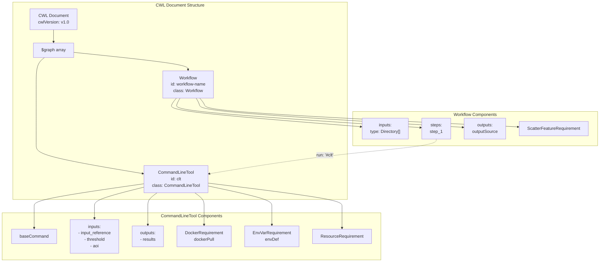
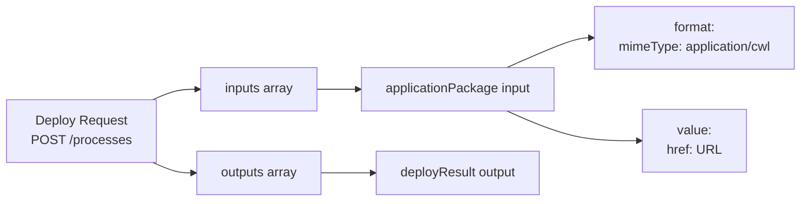
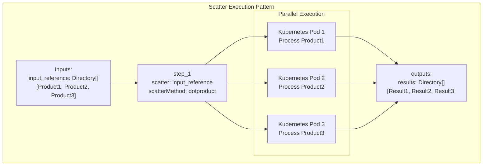
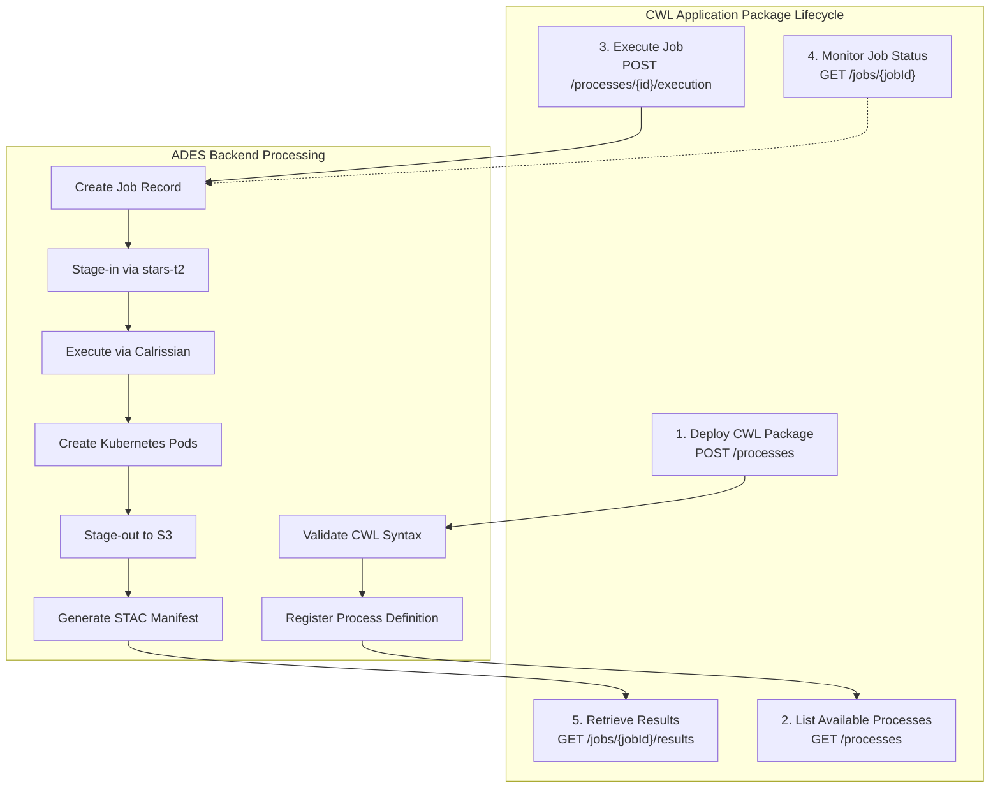

# CWL Application Packages

<details>
<summary>Relevant source files</summary>

The following files were used as context for generating this wiki page:

- [.gitattributes](.gitattributes)
- [bin/dump-policy.sh](bin/dump-policy.sh)
- [bin/list-container-images.sh](bin/list-container-images.sh)
- [bin/unregister-resource.sh](bin/unregister-resource.sh)
- [release-notes/release-0.3.md](release-notes/release-0.3.md)
- [system/clusters/creodias/user-management/kustomization.yaml](system/clusters/creodias/user-management/kustomization.yaml)
- [system/clusters/data/register-S2-L1C-data.sh](system/clusters/data/register-S2-L1C-data.sh)
- [system/clusters/data/register-S2-L2A-data.sh](system/clusters/data/register-S2-L2A-data.sh)
- [test/acceptance/02__Processing/01__ADES/data/app-deploy-body-atom.json](test/acceptance/02__Processing/01__ADES/data/app-deploy-body-atom.json)
- [test/acceptance/02__Processing/01__ADES/data/app-deploy-body-cwl.json](test/acceptance/02__Processing/01__ADES/data/app-deploy-body-cwl.json)
- [test/acceptance/02__Processing/01__ADES/data/application-package-atom.xml](test/acceptance/02__Processing/01__ADES/data/application-package-atom.xml)
- [test/acceptance/02__Processing/01__ADES/data/application-package-cwl.cwl](test/acceptance/02__Processing/01__ADES/data/application-package-cwl.cwl)
- [test/acceptance/03__ResourceCatalogue/CatalogueServiceWeb.py](test/acceptance/03__ResourceCatalogue/CatalogueServiceWeb.py)
- [test/acceptance/03__ResourceCatalogue/Resource_catalogue.robot](test/acceptance/03__ResourceCatalogue/Resource_catalogue.robot)

</details>


## Purpose and Scope

This page describes the Common Workflow Language (CWL) application packages used in the EOEPCA Processing and Chaining building block. CWL application packages define containerized Earth Observation processing workflows that can be deployed and executed on the ADES (Application Deployment and Execution Service). For information about the ADES service itself, including its OGC API Processes interfaces and job execution capabilities, see [ADES](#6.1). For development environment setup, see [Processor Development Environment](#6.3).

A CWL application package consists of:
- A CWL workflow definition (`.cwl` file) describing the processing steps
- Docker container references for execution environments
- Input/output specifications compatible with EO data formats
- Resource requirements and execution patterns

Sources: [release-notes/release-0.3.md:1-95]()

## CWL Document Structure

CWL application packages in EOEPCA use the `$graph` notation to define both CommandLineTools and Workflows within a single document. The CWL version `v1.0` is used throughout the platform.

### Graph-Based Document Format



Sources: [test/acceptance/02__Processing/01__ADES/data/application-package-cwl.cwl:1-79]()

### CommandLineTool Definition

The CommandLineTool specifies the executable container and how inputs are bound to command-line arguments:

| Component | Purpose | Example Value |
|-----------|---------|---------------|
| `class` | CWL class type | `CommandLineTool` |
| `id` | Tool identifier | `clt` |
| `baseCommand` | Executable name | `nhi` |
| `inputs` | Input parameters | `input_reference`, `threshold`, `aoi` |
| `outputs` | Output specifications | `results` (type: Directory) |

**Input Binding Example:**

[test/acceptance/02__Processing/01__ADES/data/application-package-cwl.cwl:8-23]()

Inputs are bound to command-line positions and prefixes:
- `input_reference` → `--input_reference` at position 1 (type: Directory)
- `threshold` → `--threshold` at position 2 (type: string)
- `aoi` → `--aoi` at position 3 (type: string?, optional)

**Output Binding:**

[test/acceptance/02__Processing/01__ADES/data/application-package-cwl.cwl:24-28]()

The `glob` pattern `.` captures the entire working directory as a Directory output.

Sources: [test/acceptance/02__Processing/01__ADES/data/application-package-cwl.cwl:2-35](), [test/acceptance/02__Processing/01__ADES/data/application-package-atom.xml:18-53]()

### Workflow Definition

The Workflow class orchestrates one or more CommandLineTools and defines the overall processing pipeline:

[test/acceptance/02__Processing/01__ADES/data/application-package-cwl.cwl:36-72]()

**Key workflow components:**

- **inputs**: Accept arrays of Directories for batch processing (`Directory[]`)
- **steps**: Define execution steps with input/output mappings
- **outputs**: Specify what data is returned from the workflow
- **requirements**: Declare required CWL features (e.g., `ScatterFeatureRequirement`)

Sources: [test/acceptance/02__Processing/01__ADES/data/application-package-cwl.cwl:36-72]()

## Docker Container Integration

### DockerRequirement Hint

CWL application packages specify Docker containers using the `DockerRequirement` hint in the CommandLineTool:

[test/acceptance/02__Processing/01__ADES/data/application-package-cwl.cwl:4-6]()

The `dockerPull` field references the container image that will be executed by the Calrissian CWL engine within Kubernetes.

**Container Image Naming Pattern:**

```
registry.hub.docker.com/[organization]/[application]:[tag]
```

Example: `registry.hub.docker.com/eoepcaci/nhi:dev0.0.3`

### Environment Configuration

The `EnvVarRequirement` sets environment variables in the container execution context:

[test/acceptance/02__Processing/01__ADES/data/application-package-cwl.cwl:30-32]()

This ensures the conda environment and other executables are available in the container's PATH.

### Resource Requirements

[test/acceptance/02__Processing/01__ADES/data/application-package-cwl.cwl:33]()

The `ResourceRequirement` can specify CPU, memory, and storage constraints for the container execution (currently empty in this example but can be populated with specific values).

Sources: [test/acceptance/02__Processing/01__ADES/data/application-package-cwl.cwl:4-33](), [test/acceptance/02__Processing/01__ADES/data/application-package-atom.xml:21-50]()

## Deployment Methods

### Direct CWL Deployment

Applications can be deployed by providing the CWL document directly via URL reference:

[test/acceptance/02__Processing/01__ADES/data/app-deploy-body-cwl.json:1-28]()

**Deployment Request Structure:**



The `applicationPackage` input references a raw CWL file hosted externally (e.g., on GitHub).

Sources: [test/acceptance/02__Processing/01__ADES/data/app-deploy-body-cwl.json:1-28]()

### ATOM-Wrapped Deployment

Applications can also be deployed using ATOM XML format where the CWL is embedded within an `owc:offering` element:

[test/acceptance/02__Processing/01__ADES/data/application-package-atom.xml:16-92]()

**ATOM Deployment Request:**

[test/acceptance/02__Processing/01__ADES/data/app-deploy-body-atom.json:1-36]()

The `input_reference` in this case points to an OpenSearch query URL that returns the ATOM-wrapped CWL:

```
https://resource-catalogue.develop.eoepca.org/?mode=opensearch&service=CSW&version=3.0.0&request=GetRecords&elementsetname=full&resulttype=results&typenames=csw:Record&recordids=S2B_MSIL1C_20210402T095029_N0300_R079_T33SVB_20210402T121737.SAFE
```

**ATOM Structure:**

| Element | Purpose |
|---------|---------|
| `<feed>` | ATOM feed container |
| `<entry>` | Application entry |
| `<owc:offering code="http://www.opengis.net/eoc/applicationContext/cwl">` | CWL offering |
| `<owc:content type="application/cwl">` | Embedded CWL document |

Sources: [test/acceptance/02__Processing/01__ADES/data/app-deploy-body-atom.json:1-36](), [test/acceptance/02__Processing/01__ADES/data/application-package-atom.xml:1-111]()

## Input and Output Specifications

### Input Types for EO Processing

CWL application packages typically use the following input types:

| Type | Purpose | Example |
|------|---------|---------|
| `Directory` | Single EO product (e.g., Sentinel-2 SAFE) | `input_reference: Directory` |
| `Directory[]` | Multiple EO products for batch processing | `input_reference: Directory[]` |
| `string` | Processing parameters | `threshold: string` |
| `string?` | Optional parameters | `aoi: string?` |

**Directory Inputs:**

[test/acceptance/02__Processing/01__ADES/data/application-package-cwl.cwl:40-43]()

The ADES stage-in process resolves OpenSearch catalogue references to actual S3 paths and mounts them as Directory inputs.

### Output Specifications

[test/acceptance/02__Processing/01__ADES/data/application-package-cwl.cwl:53-59]()

Outputs use the `outputSource` to link to the results from processing steps. The output type `{ items: Directory, type: array }` indicates multiple result directories.

Sources: [test/acceptance/02__Processing/01__ADES/data/application-package-cwl.cwl:40-59]()

## Execution Patterns

### Scatter Processing

The `ScatterFeatureRequirement` enables parallel processing of multiple inputs:

[test/acceptance/02__Processing/01__ADES/data/application-package-cwl.cwl:60-61]()

**Scatter Configuration:**

[test/acceptance/02__Processing/01__ADES/data/application-package-cwl.cwl:63-72]()



**Scatter Methods:**

- `dotproduct`: Pairs elements from multiple scattered inputs
- `nested_crossproduct`: Creates all combinations of scattered inputs
- `flat_crossproduct`: Similar to nested but flattens the result

The Calrissian executor creates separate Kubernetes pods for each scattered item, enabling true parallel processing.

Sources: [test/acceptance/02__Processing/01__ADES/data/application-package-cwl.cwl:60-72]()

## Stage-in and Stage-out with STAC

### Stage-in Process

When a job is executed, the ADES performs stage-in to resolve input references:

```mermaid
sequenceDiagram
    participant User
    participant ADES
    participant ResourceCatalogue["Resource Catalogue"]
    participant S3["S3 Storage<br/>(eodata)"]
    participant Calrissian
    
    User->>ADES: Execute Job with OpenSearch URL
    ADES->>ResourceCatalogue: Query Product Metadata
    ResourceCatalogue-->>ADES: Return Product Location
    ADES->>ADES: Create STAC Manifest
    ADES->>S3: Stage-in Data
    ADES->>Calrissian: Execute CWL with Directory Inputs
    Calrissian->>S3: Read Input Data
    Calrissian->>S3: Write Output Data
    Calrissian-->>ADES: Job Complete
    ADES->>ADES: Create Output STAC Manifest
    ADES-->>User: Job Results with STAC
```

**Stage-in Components:**

- **Input**: OpenSearch catalogue reference URL
- **Process**: ADES queries Resource Catalogue for product locations
- **STAC Manifest**: Generated to describe input data locations and metadata
- **Mount**: S3 paths mounted as CWL Directory inputs

### Stage-out Process

Processing results are staged-out to user workspace S3 buckets:

**Stage-out Flow:**

1. CWL outputs written to ephemeral pod storage
2. ADES copies outputs to S3 workspace bucket
3. STAC manifest generated describing output products
4. Output STAC includes geospatial metadata, temporal coverage, and asset links

**STAC Output Structure:**

- **type**: FeatureCollection
- **features**: Array of STAC items for each output product
- **assets**: Links to S3 objects containing results
- **properties**: Metadata including datetime, spatial extent, and custom properties

Sources: [release-notes/release-0.3.md:36-89]()

## Integration with ADES Execution

### Job Execution Flow



**Container Images Used:**

| Component | Image | Purpose |
|-----------|-------|---------|
| ADES Core | `eoepca/proc-ades:dev0.3.1` | OGC API Processes implementation |
| Stage-in | `terradue/stars-t2:0.6.17.0` | Data staging from catalogue/S3 |
| Stage-out | `terradue/stars-t2:0.6.17.0` | Result staging to S3 with STAC |
| CWL Executor | Calrissian (embedded) | Kubernetes-native CWL runner |

Sources: [release-notes/release-0.3.md:222-249]()

## Example Application Packages

### Normalized Hotspot Indices (NHI)

The NHI application demonstrates a complete CWL package structure:

**Application Metadata:**

[test/acceptance/02__Processing/01__ADES/data/application-package-cwl.cwl:73-78]()

- **cwlVersion**: v1.0
- **s:softwareVersion**: 0.0.3 (using schema.org namespace)
- **schemas**: References schema.org for semantic metadata

**Processing Logic:**

[test/acceptance/02__Processing/01__ADES/data/application-package-cwl.cwl:2-7]()

The `baseCommand: nhi` executes the main processing script within the container, with inputs bound as command-line arguments.

### S-Expression Application

The s-expression application shows an alternative processing pattern:

[test/acceptance/02__Processing/01__ADES/data/application-package-atom.xml:8-95]()

**Differences from NHI:**

- **Input Type**: Single `Directory` instead of `Directory[]` (no scatter)
- **Expression Parameter**: `s_expression` for custom band math expressions
- **Band Selection**: `cbn` (common band name) parameter for specific band processing

Sources: [test/acceptance/02__Processing/01__ADES/data/application-package-cwl.cwl:1-79](), [test/acceptance/02__Processing/01__ADES/data/application-package-atom.xml:1-111]()

## Best Practices

### CWL Document Guidelines

1. **Use $graph notation** for combining CommandLineTool and Workflow definitions
2. **Specify explicit types** for all inputs and outputs (avoid generic `Any` types)
3. **Include documentation** in `doc` and `label` fields for user-facing process descriptions
4. **Set cwlVersion** to `v1.0` for compatibility with Calrissian
5. **Use semantic versioning** in `s:softwareVersion` annotations

### Docker Container Guidelines

1. **Pin specific tags** instead of using `latest` (e.g., `dev0.0.3` not `latest`)
2. **Include conda environments** in PATH via `EnvVarRequirement`
3. **Minimize container size** for faster pod startup
4. **Use registry.hub.docker.com** or Harbor registry for EOEPCA deployments
5. **Test containers locally** before deploying to ADES

### Input/Output Guidelines

1. **Use Directory type** for EO products (not File)
2. **Use Directory[]** with scatter for batch processing
3. **Make optional parameters explicit** with `?` suffix (e.g., `string?`)
4. **Output complete directories** rather than individual files
5. **Use glob patterns** to capture all output artifacts

### Execution Pattern Guidelines

1. **Enable ScatterFeatureRequirement** for parallel processing of multiple products
2. **Use dotproduct scatterMethod** for independent processing of array inputs
3. **Set appropriate ResourceRequirement** values for CPU/memory intensive processing
4. **Configure stdout/stderr** redirection for debugging

Sources: [test/acceptance/02__Processing/01__ADES/data/application-package-cwl.cwl:1-79](), [release-notes/release-0.3.md:1-95]()