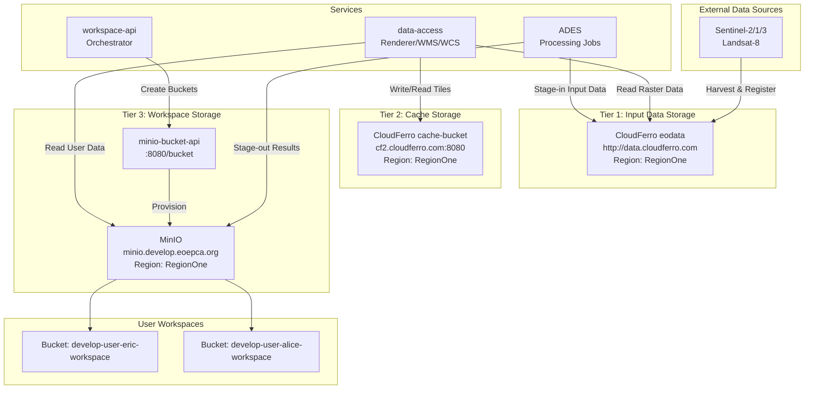
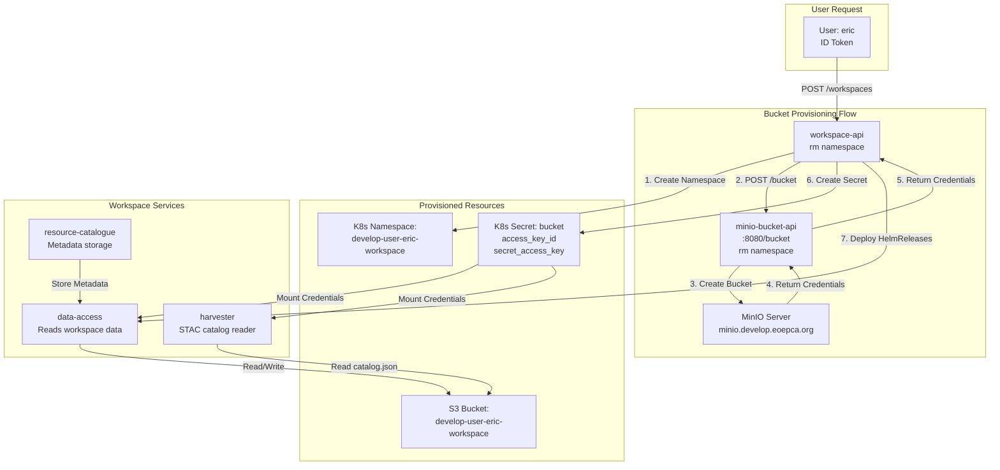
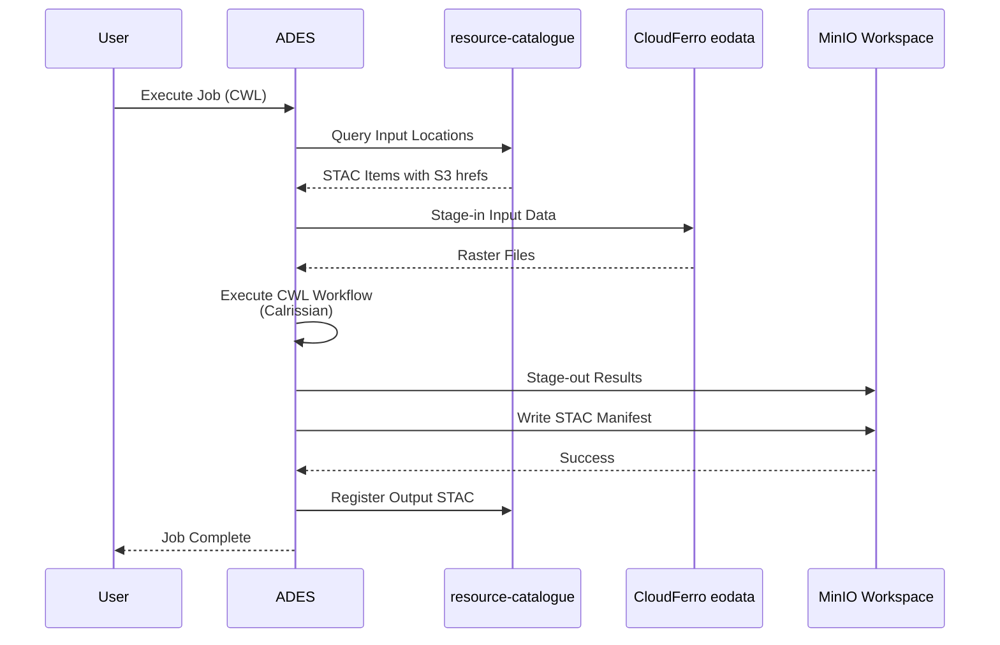
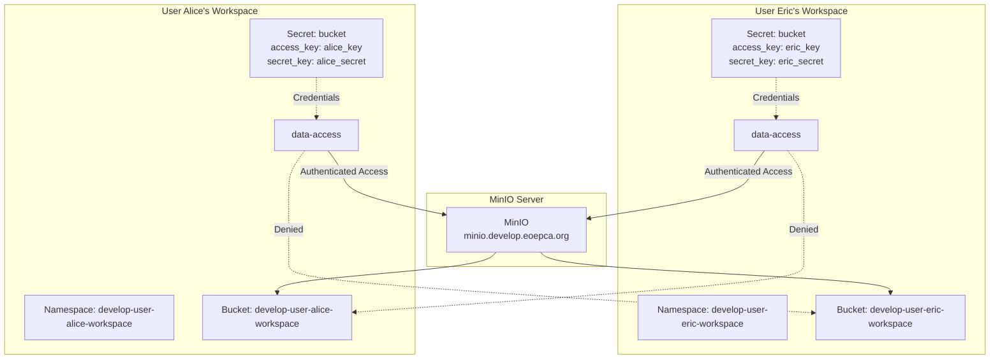
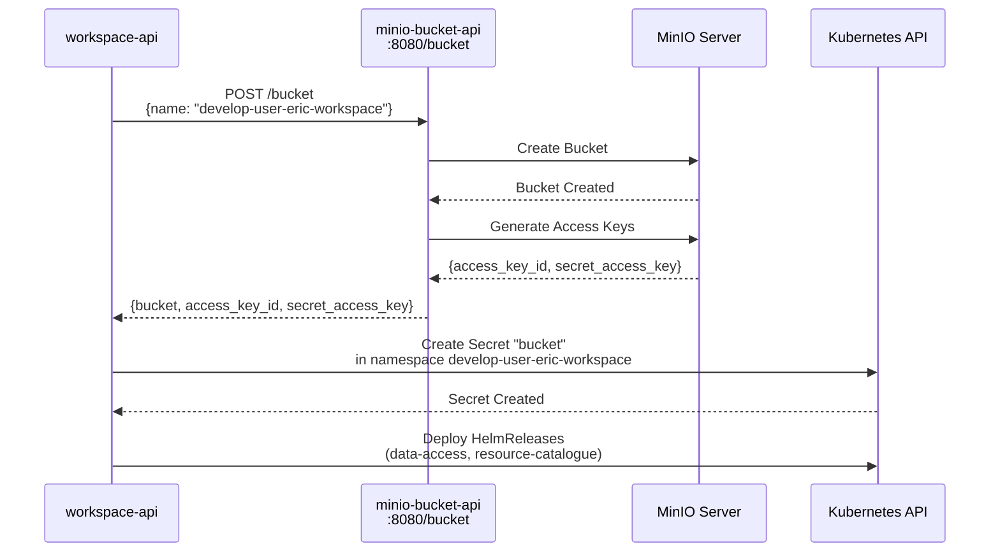

# S3 Storage Architecture

<details>
<summary>Relevant source files</summary>

The following files were used as context for generating this wiki page:

- [system/clusters/creodias/resource-management/hr-data-access.yaml](system/clusters/creodias/resource-management/hr-data-access.yaml)
- [system/clusters/creodias/resource-management/hr-registration-api.yaml](system/clusters/creodias/resource-management/hr-registration-api.yaml)
- [system/clusters/creodias/resource-management/hr-resource-catalogue.yaml](system/clusters/creodias/resource-management/hr-resource-catalogue.yaml)
- [system/clusters/creodias/resource-management/hr-workspace-api.yaml](system/clusters/creodias/resource-management/hr-workspace-api.yaml)
- [system/clusters/creodias/resource-management/rm-workspace-charts/template-hr-data-access.yaml](system/clusters/creodias/resource-management/rm-workspace-charts/template-hr-data-access.yaml)
- [system/clusters/creodias/resource-management/rm-workspace-charts/template-hr-resource-catalogue.yaml](system/clusters/creodias/resource-management/rm-workspace-charts/template-hr-resource-catalogue.yaml)

</details>


## Purpose and Scope

This document describes the S3-compatible object storage architecture used throughout the EOEPCA platform. It covers the three-tier storage model, bucket provisioning mechanisms, and how different services interact with S3 endpoints for data access, caching, and workspace storage.

For information about NFS persistent volumes used by services, see [NFS and Persistent Volumes](#7.3). For database storage architecture, see [Database Systems](#7.2). For workspace provisioning logic, see [Workspace API](#5.3).

---

## Storage Tier Overview

The EOEPCA platform employs a three-tier S3 storage architecture to separate concerns between input data, performance optimization, and user outputs:



**Sources:** [system/clusters/creodias/resource-management/hr-data-access.yaml:49-64](), [system/clusters/creodias/resource-management/hr-workspace-api.yaml:38-40]()

---

## Tier 1: CloudFerro Input Data Storage

### Purpose and Configuration

The CloudFerro `eodata` bucket serves as the primary read-only source for Earth Observation data harvested from external providers. This tier provides access to registered Sentinel and Landsat datasets stored on the CREODIAS infrastructure.

| Parameter | Value |
|-----------|-------|
| **Endpoint** | `http://data.cloudferro.com` |
| **Region** | `RegionOne` |
| **Access Type** | Read-only |
| **Credentials** | `access_key_id: access`<br/>`secret_access_key: access` |
| **Bucket Name Validation** | Disabled |

**Configuration Location:** [system/clusters/creodias/resource-management/hr-data-access.yaml:49-57]()

### Data Access Integration

The Data Access service configures this storage tier for its `renderer` component to read raster data:

```yaml
storage:
  data:
    data:
      type: S3
      endpoint_url: http://data.cloudferro.com
      access_key_id: access
      secret_access_key: access
      region_name: RegionOne
      validate_bucket_name: false
```

The `CPL_VSIL_CURL_ALLOWED_EXTENSIONS` environment variable restricts which file types can be accessed via VSIL (Virtual File System) to ensure security:

**Allowed Extensions:** `.TIF`, `.TIFF`, `.tif`, `.tiff`, `.xml`, `.jp2`, `.jpg`, `.jpeg`, `.png`, `.nc`

**Sources:** [system/clusters/creodias/resource-management/hr-data-access.yaml:29](), [system/clusters/creodias/resource-management/hr-data-access.yaml:49-57]()

---

## Tier 2: CloudFerro Cache Storage

### Purpose and Configuration

The CloudFerro `cache-bucket` provides S3 storage for caching rendered tiles, improving performance for repeated WMS/WMTS requests by avoiding redundant raster processing.

| Parameter | Value |
|-----------|-------|
| **Endpoint** | `https://cf2.cloudferro.com:8080/cache-bucket` |
| **Host** | `cf2.cloudferro.com:8080` |
| **Region** | `RegionOne` |
| **Bucket** | `cache-bucket` |
| **Access Type** | Read/Write |

**Configuration Location:** [system/clusters/creodias/resource-management/hr-data-access.yaml:58-64]()

### Cache Service Integration

The cache is integrated with the Data Access service's `seeder` and `cache` components. The seeder pre-generates tiles at configured zoom levels, while the cache component serves and stores tiles on-demand:

```yaml
storage:
  cache:
    type: S3
    endpoint_url: "https://cf2.cloudferro.com:8080/cache-bucket"
    host: "cf2.cloudferro.com:8080"
    region_name: RegionOne
    region: RegionOne
    bucket: cache-bucket
```

The seeder is configured with zoom level constraints to manage storage usage:

```yaml
seeder:
  config:
    minzoom: 0
    maxzoom: 6  # restrict to only 6 for testing
```

**Note:** The cache and seeder components are disabled in workspace-specific deployments (replica count set to 0) to conserve resources in multi-tenant environments.

**Sources:** [system/clusters/creodias/resource-management/hr-data-access.yaml:58-64](), [system/clusters/creodias/resource-management/rm-workspace-charts/template-hr-data-access.yaml:259-269]()

---

## Tier 3: MinIO Workspace Storage

### Architecture Overview

MinIO provides the workspace storage tier, offering isolated S3-compatible buckets for each user workspace. This tier handles:

- Processing job outputs from ADES
- User-uploaded data
- STAC catalogs describing workspace contents
- Application packages and results



**Sources:** [system/clusters/creodias/resource-management/hr-workspace-api.yaml:38-48]()

### MinIO Configuration

The Workspace API manages MinIO integration through the following configuration parameters:

| Parameter | Configuration Value | Purpose |
|-----------|---------------------|---------|
| `s3Endpoint` | `https://minio.develop.eoepca.org` | MinIO API endpoint |
| `s3Region` | `RegionOne` | AWS region identifier |
| `bucketEndpointUrl` | `http://minio-bucket-api:8080/bucket` | Internal bucket provisioning API |
| `workspaceSecretName` | `bucket` | K8s secret name for S3 credentials |
| `namespaceForBucketResource` | `rm` | Namespace hosting bucket operator |

**Configuration Location:** [system/clusters/creodias/resource-management/hr-workspace-api.yaml:36-47]()

### Bucket Naming Convention

Buckets follow a deterministic naming pattern based on the workspace name:

```
Bucket Name = {{ prefixForName }}-{{ username }}-workspace
Example: develop-user-eric-workspace
```

The `prefixForName` is configurable per deployment environment (e.g., `develop-user`, `production-user`).

**Sources:** [system/clusters/creodias/resource-management/hr-workspace-api.yaml:35]()

---

## Per-Workspace Storage Configuration

### Data Access Service Storage Binding

Each workspace receives a dedicated Data Access service instance configured to access its specific S3 bucket. The template system injects bucket credentials and configuration at deployment time:

```yaml
storage:
  data:
    data:
      type: "S3"
      endpoint_url: https://minio.develop.eoepca.org
      access_key_id: {{ access_key_id }}
      secret_access_key: {{ secret_access_key }}
      bucket: {{ bucket }}
      region_name: RegionOne
      validate_bucket_name: false
```

These placeholders are substituted during workspace provisioning:

- `{{ access_key_id }}` - Unique access key for the workspace bucket
- `{{ secret_access_key }}` - Secret access key for authentication
- `{{ bucket }}` - The workspace-specific bucket name

**Sources:** [system/clusters/creodias/resource-management/rm-workspace-charts/template-hr-data-access.yaml:33-44]()

### Harvester S3 Filesystem Configuration

The workspace harvester component is configured to read STAC catalogs stored in the workspace bucket. It uses an S3 filesystem definition with the injected credentials:

```yaml
harvester:
  config:
    harvesters:
      harvest-bucket-catalog:
        queue: "register_queue"
        resource:
          type: "STACCatalog"
          staccatalog:
            filesystem: s3bucket
            root_path: "/home/catalog.json"
    filesystems:
      s3bucket:
        type: s3
        s3:
          access_key_id: {{ access_key_id }}
          secret_access_key: {{ secret_access_key }}
          endpoint_url: https://minio.develop.eoepca.org
          region: RegionOne
          public: False
```

This allows the harvester to automatically discover and register STAC items stored in `catalog.json` at the bucket root.

**Sources:** [system/clusters/creodias/resource-management/rm-workspace-charts/template-hr-data-access.yaml:166-195]()

---

## Service-to-Storage Mapping

### Global Data Access Service

The global Data Access service (in the `rm` namespace) can read from all three storage tiers:

| Storage Tier | Purpose | Access Pattern |
|--------------|---------|----------------|
| CloudFerro eodata | Source raster data | Read-only via GDAL VSIL |
| CloudFerro cache | Rendered tile cache | Read/Write for tile seeding |
| MinIO (all buckets) | User workspace data | Read-only for visualization |

The global service's renderer component scales to 4 replicas to handle concurrent tile rendering requests:

```yaml
vs:
  renderer:
    replicaCount: 4
    resources:
      limits:
        cpu: 1.5
        memory: 3Gi
      requests:
        cpu: 0.5
        memory: 1Gi
```

**Sources:** [system/clusters/creodias/resource-management/hr-data-access.yaml:865-876]()

### Workspace Data Access Service

Per-workspace Data Access services have constrained storage access:

| Storage Tier | Purpose | Access Pattern |
|--------------|---------|----------------|
| MinIO (workspace bucket only) | User's private data | Read/Write via registrar |

Resource allocation is reduced for workspace instances to support multi-tenancy:

```yaml
vs:
  renderer:
    replicaCount: 1
    resources:
      requests:
        cpu: 100m
        memory: 300Mi
      limits:
        memory: 3Gi
```

**Sources:** [system/clusters/creodias/resource-management/rm-workspace-charts/template-hr-data-access.yaml:70-82]()

### ADES Processing Service

The ADES service orchestrates data movement across storage tiers during job execution:



**Sources:** Referenced from broader system architecture; ADES details in [ADES (Application Deployment and Execution Service)](#6.1)

---

## S3 Endpoint Configuration Summary

### Environment Variables

Multiple services reference the MinIO endpoint through environment variables:

**Data Access Services:**
```yaml
env:
  AWS_ENDPOINT_URL_S3: https://minio.develop.eoepca.org
  AWS_HTTPS: "FALSE"
```

**Purpose:** These variables configure GDAL's VSI subsystem to use the MinIO endpoint for S3 access, with HTTP used for internal cluster communication despite the HTTPS external endpoint.

**Sources:** [system/clusters/creodias/resource-management/hr-data-access.yaml:30-31](), [system/clusters/creodias/resource-management/rm-workspace-charts/template-hr-data-access.yaml:20]()

### Public URL Configuration

The registrar component constructs public URLs for STAC assets using the configured public S3 URL:

```yaml
registrar:
  config:
    routes:
      items:
        backends:
          - path: "registrar_pycsw.backend.ItemBackend"
            kwargs:
              public_s3_url: "https://minio.develop.eoepca.org/{{ bucket }}"
```

This ensures that STAC `href` fields in the Resource Catalogue point to publicly accessible S3 URLs.

**Sources:** [system/clusters/creodias/resource-management/rm-workspace-charts/template-hr-data-access.yaml:108-112]()

---

## Storage Isolation and Security

### Multi-Tenancy Isolation Mechanisms

Each workspace receives isolated storage through:

1. **Unique S3 Buckets** - One bucket per workspace with non-overlapping names
2. **Unique Credentials** - Separate access key pairs stored in namespace-scoped K8s secrets
3. **Namespace Isolation** - Services deployed in separate K8s namespaces per user
4. **PEP Protection** - Resource Guards enforce ownership policies (see [Resource Guards and Access Control](#6.4))



**Sources:** [system/clusters/creodias/resource-management/hr-workspace-api.yaml:36-49](), [system/clusters/creodias/resource-management/rm-workspace-charts/template-hr-data-access.yaml:33-44]()

### Credential Management

S3 credentials are stored as Kubernetes Secrets and mounted into pods:

**Secret Structure (`bucket` secret):**
```yaml
apiVersion: v1
kind: Secret
metadata:
  name: bucket
  namespace: {{ workspace_name }}
type: Opaque
data:
  access_key_id: <base64-encoded>
  secret_access_key: <base64-encoded>
  bucket: <base64-encoded>
```

The `workspaceSecretName` parameter defines which secret name to use (default: `bucket`).

**Sources:** [system/clusters/creodias/resource-management/hr-workspace-api.yaml:36]()

---

## Bucket Operator and Provisioning API

### API Endpoint

The `minio-bucket-api` service provides a REST API for programmatic bucket creation:

**Endpoint:** `http://minio-bucket-api:8080/bucket` (internal cluster DNS)

**Purpose:** Abstracts MinIO bucket creation and credential generation, allowing the Workspace API to provision buckets without direct MinIO admin credentials.

### Provisioning Flow



**Sources:** [system/clusters/creodias/resource-management/hr-workspace-api.yaml:47]()

### Workspace API Integration

The Workspace API orchestrates bucket provisioning as part of workspace creation:

**Configuration Parameters:**
- `namespaceForBucketResource: "rm"` - Namespace where bucket operator runs
- `bucketEndpointUrl: "http://minio-bucket-api:8080/bucket"` - Internal API endpoint
- `s3Endpoint: "https://minio.develop.eoepca.org"` - Public MinIO endpoint
- `s3Region: "RegionOne"` - AWS region identifier

**Sources:** [system/clusters/creodias/resource-management/hr-workspace-api.yaml:37-40]()

---

## Persistent Volume Claims for S3 Metadata

### Database Storage

While S3 provides object storage, metadata services require persistent volumes:

**Resource Catalogue PostgreSQL:**
```yaml
database:
  persistence:
    enabled: true
    existingClaim: ""  # Auto-generated PVC
    storageClass: managed-nfs-storage
    size: "100Gi"
```

The Resource Catalogue stores ISO 19115 metadata records in PostgreSQL, which requires persistent storage separate from S3.

**Sources:** [system/clusters/creodias/resource-management/rm-workspace-charts/template-hr-data-access.yaml:219-228]()

### Redis Queue Storage

Redis queues for the registrar and harvester also use persistent volumes:

```yaml
redis:
  usePassword: false
  persistence:
    existingClaim: ""  # Auto-generated PVC
  master:
    persistence:
      existingClaim: ""  # Auto-generated PVC
      storageClass: managed-nfs-storage
      size: "1Gi"
```

This ensures queue durability across pod restarts. For more on NFS storage architecture, see [NFS and Persistent Volumes](#7.3).

**Sources:** [system/clusters/creodias/resource-management/rm-workspace-charts/template-hr-data-access.yaml:230-240]()

---

## Summary Table: Storage Tiers by Use Case

| Use Case | Storage Tier | Endpoint | Access Type | Services |
|----------|--------------|----------|-------------|----------|
| EO Data Ingestion | CloudFerro eodata | `data.cloudferro.com` | Read-only | Data Access (Global), ADES |
| Tile Caching | CloudFerro cache | `cf2.cloudferro.com:8080` | Read/Write | Data Access (Global) |
| User Workspaces | MinIO | `minio.develop.eoepca.org` | Read/Write | Data Access (Workspace), ADES, Harvester |
| Processing Outputs | MinIO | `minio.develop.eoepca.org` | Write | ADES Stage-out |
| STAC Catalogs | MinIO | `minio.develop.eoepca.org` | Read/Write | Harvester, Registrar |
| Metadata | PostgreSQL PVC | N/A (NFS-backed) | Read/Write | Resource Catalogue |
| Queue Persistence | Redis PVC | N/A (NFS-backed) | Read/Write | Registrar, Harvester |

**Sources:** [system/clusters/creodias/resource-management/hr-data-access.yaml:49-64](), [system/clusters/creodias/resource-management/hr-workspace-api.yaml:38-40](), [system/clusters/creodias/resource-management/rm-workspace-charts/template-hr-data-access.yaml:33-44]()