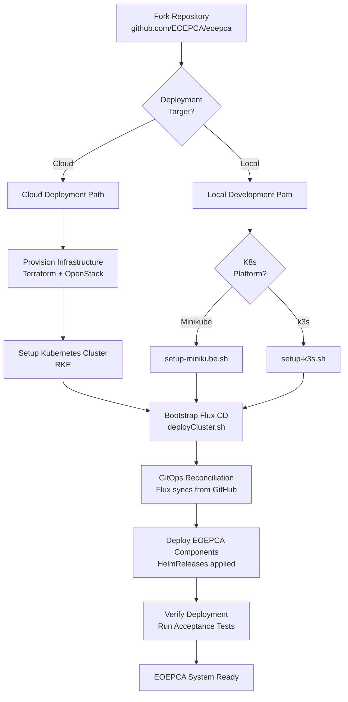
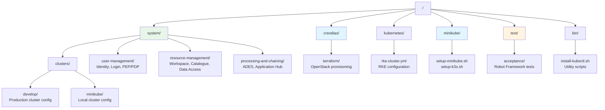

# Getting Started

<details>
<summary>Relevant source files</summary>

The following files were used as context for generating this wiki page:

- [README.md](README.md)
- [minikube/README.md](minikube/README.md)
- [system/clusters/README.md](system/clusters/README.md)

</details>


This page provides an overview of the steps required to deploy an EOEPCA system. It covers the essential prerequisites, deployment paths, and initial setup procedures to get a working EOEPCA platform running in either a cloud or local development environment.

For detailed deployment instructions, see [Deployment Guide](#2.1). For infrastructure provisioning specifics, see [Infrastructure Provisioning](#2.2). For testing procedures after deployment, see [Testing and Validation](#2.3).

## Overview

The EOEPCA system is designed for deployment to Kubernetes clusters using a GitOps approach with Flux CD. The platform supports two primary deployment scenarios:

- **Cloud Deployment**: Full production-scale deployment on cloud infrastructure (OpenStack/CREODIAS)
- **Local Development**: Lightweight deployment on local Kubernetes (Minikube or k3s)

Both deployment paths follow a similar workflow but differ in infrastructure provisioning and resource requirements.

## Deployment Architecture

The following diagram illustrates the high-level deployment workflow:



Sources: [README.md:73-96](), [system/clusters/README.md:1-78](), [minikube/README.md:1-52]()

## Prerequisites

### Required Tools

The following tools must be installed on your local system:

| Tool | Purpose | Installation |
|------|---------|--------------|
| `git` | Repository cloning and version control | System package manager |
| `kubectl` | Kubernetes cluster administration | [bin/install-kubectl.sh]() or [kubectl docs](https://kubernetes.io/docs/tasks/tools/) |
| `flux` | GitOps continuous delivery | `curl -s https://toolkit.fluxcd.io/install.sh \| sudo bash` |
| `helm` | Kubernetes package management (optional) | [helm.sh](https://helm.sh/docs/intro/install/) |

For cloud deployment, additional tools are required:
- `terraform` - Infrastructure provisioning
- `rke` - Rancher Kubernetes Engine setup

### GitHub Configuration

EOEPCA uses a GitOps deployment model where Flux CD continuously synchronizes cluster state with a Git repository. You must configure GitHub credentials:

1. **Fork the repository**: Navigate to `https://github.com/EOEPCA/eoepca` and fork it to your GitHub account
2. **Create Personal Access Token**: Generate a token at `https://github.com/settings/tokens` with all `repo` scopes selected
3. **Set environment variables**:

```bash
export GITHUB_USER=<your-username>
export GITHUB_TOKEN=<your-token>
```

**Important**: Forking (rather than cloning) is required because Flux CD needs write access to commit deployment state back to the repository.

Sources: [README.md:79-86](), [system/clusters/README.md:31-43]()

### Resource Requirements

Minimum system requirements vary by deployment type:

| Deployment Type | CPU | Memory | Storage | Notes |
|----------------|-----|--------|---------|-------|
| **Cloud (Multi-node)** | 16+ cores | 64+ GB | 500+ GB | Distributed across multiple VMs |
| **Local (Single-node)** | 8 cores | 32 GB | 100 GB | Single minikube/k3s instance |
| **Minimal Development** | 4 cores | 16 GB | 50 GB | Subset of components only |

**Note**: As of release v1.4, deploying the full EOEPCA system to a single minikube node is challenging due to expanded component count. The full system is better suited to multi-node cloud deployments.

Sources: [README.md:96]()

## Repository Structure

Understanding the repository layout is essential for configuration and deployment:



**Key Directories:**
- `system/clusters/{target}/` - Flux CD deployment configurations per cluster
- `system/user-management/` - Identity and access management components
- `system/resource-management/` - Data cataloging and workspace services
- `system/processing-and-chaining/` - Application execution services
- `creodias/` - Cloud infrastructure provisioning (Terraform)
- `kubernetes/` - RKE cluster setup
- `minikube/` - Local Kubernetes setup scripts
- `test/acceptance/` - Acceptance test suite

Sources: [README.md:88-94](), [system/clusters/README.md:47-49]()

## Quick Start: Local Development

For developers who want to quickly spin up a local EOEPCA environment:

### Step 1: Clone the Repository

```bash
git clone git@github.com:<your-fork>/eoepca.git
cd eoepca
git checkout v1.4  # or 'develop' for latest
```

### Step 2: Setup Local Kubernetes

Choose either Minikube or k3s:

**Option A - Minikube (recommended for most users)**:
```bash
minikube/setup-minikube.sh
```

**Option B - k3s (faster, more lightweight)**:
```bash
minikube/setup-k3s.sh
```

The [setup-minikube.sh:1-30]() script downloads and configures minikube with the Docker driver by default. For VM deployments with limited resources, you can use the `native` driver: `minikube/setup-minikube.sh native`.

The [setup-k3s.sh:1-48]() script installs k3s with Docker runtime (required for the ADES Argo component).

### Step 3: Install Flux CD

```bash
curl -s https://toolkit.fluxcd.io/install.sh | sudo bash
flux check --pre
```

### Step 4: Configure Deployment Target

The default minikube configuration is in `system/clusters/minikube/`. You must update hostnames to match your minikube IP:

```bash
MINIKUBE_IP=$(minikube ip)
# Update all occurrences of hostnames in system/clusters/minikube/
# Pattern: <service>.<ip>.nip.io
```

For example, if `minikube ip` returns `192.168.49.2`, services will be accessible at:
- `workspace.192-168-49-2.nip.io`
- `resource-catalogue.192-168-49-2.nip.io`
- `ades.192-168-49-2.nip.io`

### Step 5: Deploy EOEPCA System

```bash
export GITHUB_USER=<your-username>
export GITHUB_TOKEN=<your-token>
export TARGET=minikube
export BRANCH=v1.4

./system/clusters/deployCluster.sh
```

The [system/clusters/deployCluster.sh:1-58]() script performs the following:
1. Runs `flux bootstrap github` to install Flux controllers
2. Configures Flux to watch your GitHub repository
3. Applies Kustomizations for system components
4. Flux begins reconciling HelmReleases

### Step 6: Monitor Deployment

```bash
# Watch Flux reconciliation
flux get kustomizations --watch

# Check HelmRelease status
flux get helmreleases -A

# Verify pods are running
kubectl get pods -A
```

Flux polls the GitHub repository every 1 minute and applies changes automatically.

Sources: [README.md:81-86](), [minikube/README.md:1-52](), [system/clusters/README.md:9-78]()

## Quick Start: Cloud Deployment

For production or development deployments on cloud infrastructure:

### Step 1: Provision Infrastructure

Navigate to the CREODIAS directory and provision VMs using Terraform:

```bash
cd creodias/
terraform init
terraform plan
terraform apply
```

This creates:
- Multiple VMs on OpenStack
- Network configuration and security groups
- Load balancer for ingress
- NFS storage server

For detailed infrastructure provisioning, see [Infrastructure Provisioning](#2.2).

### Step 2: Setup Kubernetes Cluster

Use RKE to bootstrap the Kubernetes cluster on provisioned VMs:

```bash
cd ../kubernetes/
# Edit rke-cluster.yml with VM IP addresses
rke up --config rke-cluster.yml
```

This generates a `kubeconfig` file at `kube_config_rke-cluster.yml`.

### Step 3: Configure Deployment

Create a cluster-specific configuration directory (or use `system/clusters/develop/` as template):

```bash
cp -r system/clusters/develop system/clusters/my-cluster
cd system/clusters/my-cluster
# Update all IP addresses and hostnames for your environment
```

**Critical**: Search and replace the load balancer IP throughout the configuration. For example, if your load balancer IP is `203.0.113.45`, update all instances of service hostnames to use `<service>.203-0-113-45.nip.io`.

### Step 4: Bootstrap Flux

```bash
export KUBECONFIG=kubernetes/kube_config_rke-cluster.yml
export GITHUB_USER=<your-username>
export GITHUB_TOKEN=<your-token>
export TARGET=my-cluster
export BRANCH=develop

./system/clusters/deployCluster.sh
```

### Step 5: Verify Deployment

```bash
export KUBECONFIG=kubernetes/kube_config_rke-cluster.yml
flux get kustomizations -A
kubectl get pods -A
```

Sources: [README.md:88-94](), [system/clusters/README.md:45-78]()

## Hostname Configuration and DNS

EOEPCA uses dynamic DNS via [nip.io](https://nip.io/) to avoid requiring public DNS configuration during development and testing. This service embeds the IP address directly in the hostname.

### Hostname Pattern

All services follow this pattern:
```
<service-name>.<ip-with-dashes>.nip.io
```

Examples:
- `workspace-api.192-168-49-2.nip.io` (minikube with IP 192.168.49.2)
- `ades.185-52-193-87.nip.io` (cloud with IP 185.52.193.87)

**Important**: Use dashes (not dots) to delimit the IP address, as this works better with LetsEncrypt rate limits.

### Determining Your Public IP

| Deployment | Command | Example Result |
|------------|---------|----------------|
| Minikube | `minikube ip` | `192.168.49.2` |
| k3s | `kubectl get nodes -o wide` | Check EXTERNAL-IP column |
| Cloud | Check load balancer IP | Terraform output or OpenStack console |

### Updating Configuration

The public IP is embedded throughout the deployment configuration, particularly in Kubernetes Ingress resources. When setting up your deployment:

1. Identify your public IP
2. Search all files under `system/clusters/{target}/` for IP addresses
3. Replace with your IP (using dashes)
4. Commit changes to your fork

Example search/replace patterns to look for:
- `185.52.193.87` → `<your-ip>`
- `185-52-193-87.nip.io` → `<your-ip-with-dashes>.nip.io`

Sources: [README.md:100-111]()

## Deployment Approaches

EOEPCA offers two approaches for system deployment:

### 1. GitOps with Flux CD (Recommended for Production)

Flux CD continuously monitors your Git repository and automatically reconciles cluster state:

**Advantages:**
- Declarative infrastructure as code
- Automatic synchronization (every 1 minute)
- Version-controlled deployment history
- Easy rollback and disaster recovery
- Multi-cluster management

**Key Concepts:**
- `GitRepository` resources define the source Git repos
- `Kustomization` resources apply Kubernetes manifests
- `HelmRelease` resources manage Helm chart deployments
- Flux controllers run in `flux-system` namespace

**Workflow:**
1. Edit configuration in `system/clusters/{target}/`
2. Commit and push to GitHub
3. Flux detects changes within 1 minute
4. Flux applies changes to cluster
5. Verify via `flux get kustomizations`

### 2. Manual Deployment with Helm (Recommended for Learning)

The [Deployment Guide](https://deployment-guide.docs.eoepca.org/) provides scripts that deploy components directly using `helm`:

**Advantages:**
- More transparent for learning
- Step-by-step component deployment
- Easier to understand dependencies
- Suitable for development/testing

**Workflow:**
1. Follow Deployment Guide instructions
2. Run provided shell scripts
3. Scripts execute `helm install` commands
4. Components deployed in sequence

**Note**: The Deployment Guide approach uses Minikube out-of-the-box and provides detailed explanations of each component's configuration.

Sources: [README.md:93-98](), [system/clusters/README.md:1-6](), [system/clusters/README.md:79-86]()

## Deployment Flow Detail

The following diagram shows the technical flow when using GitOps deployment:

```mermaid
sequenceDiagram
    participant User
    participant GitHub["GitHub Repository<br/>EOEPCA/eoepca"]
    participant Flux["Flux Controllers<br/>flux-system namespace"]
    participant K8s["Kubernetes API"]
    participant Helm["Helm Controller"]
    participant Services["EOEPCA Services"]
    
    User->>User: "git clone<br/>Edit system/clusters/{target}/"
    User->>GitHub: "git push<br/>Commit configuration changes"
    
    Note over Flux: "Polling interval: 1 minute"
    
    Flux->>GitHub: "Poll for changes<br/>source-controller"
    GitHub-->>Flux: "Return updated manifests"
    
    Flux->>Flux: "Detect HelmRelease updates<br/>kustomize-controller"
    
    Flux->>Helm: "Apply HelmRelease<br/>user-management/identity-service"
    Helm->>K8s: "Create/Update resources<br/>Deployment, Service, Ingress"
    K8s->>Services: "Schedule pods"
    Services-->>Flux: "Reconciliation status"
    
    Flux->>Helm: "Apply HelmRelease<br/>resource-management/workspace-api"
    Helm->>K8s: "Create/Update resources"
    K8s->>Services: "Schedule pods"
    
    Flux->>Helm: "Apply HelmRelease<br/>processing-and-chaining/ades"
    Helm->>K8s: "Create/Update resources"
    K8s->>Services: "Schedule pods"
    
    Flux->>GitHub: "Commit reconciliation state"
    GitHub-->>Flux: "State persisted"
    
    User->>K8s: "kubectl get pods -A<br/>Verify deployment"
    K8s-->>User: "Pod status"
    
    User->>Flux: "flux get helmreleases"
    Flux-->>User: "HelmRelease status"
```

**Key Flux Components:**
- `source-controller` - Fetches artifacts from Git/Helm repositories
- `kustomize-controller` - Applies Kustomization resources
- `helm-controller` - Manages HelmRelease lifecycles
- `notification-controller` - Sends deployment notifications

**Configuration Layers:**
1. **System Infrastructure** (`system/clusters/{target}/system/`) - Flux itself, ingress-nginx, cert-manager
2. **User Management** (`user-management/`) - identity-service, login-service, pdp-engine
3. **Resource Management** (`resource-management/`) - workspace-api, resource-catalogue, data-access
4. **Processing** (`processing-and-chaining/`) - ades, application-hub

Sources: [system/clusters/README.md:79-95]()

## Version Selection

EOEPCA releases are tagged in Git. When deploying, choose the appropriate version:

| Branch/Tag | Description | Recommended For |
|------------|-------------|-----------------|
| `v1.4` | Latest stable release (Feb 2024) | Production, learning |
| `develop` | Latest development | Testing new features |
| `v1.3` | Previous stable (Sep 2023) | Compatibility requirements |

To deploy a specific version:

```bash
git checkout v1.4  # or other tag/branch
export BRANCH=v1.4
./system/clusters/deployCluster.sh
```

**Important**: Ensure your `BRANCH` environment variable matches your Git checkout when running `deployCluster.sh`.

Sources: [README.md:77-86](), [README.md:173-189]()

## Post-Deployment Verification

After deployment, verify the system is operational:

### 1. Check Flux Status

```bash
# All Kustomizations should show "Applied revision"
flux get kustomizations -A

# All HelmReleases should show "Release reconciliation succeeded"
flux get helmreleases -A
```

### 2. Verify Pods

```bash
# Check all namespaces
kubectl get pods -A

# Should see pods in:
# - flux-system (Flux controllers)
# - um (User Management)
# - rm (Resource Management)  
# - proc (Processing & Chaining)
```

### 3. Test Service Access

Access services via browser using nip.io hostnames:
- Identity Service: `https://identity-service.<ip>.nip.io`
- Workspace API: `https://workspace-api.<ip>.nip.io`
- ADES: `https://ades.<ip>.nip.io`

### 4. Run Acceptance Tests

Execute the automated test suite:

```bash
cd test/acceptance
# See Testing and Validation page for details
```

For detailed testing procedures, see [Testing and Validation](#2.3).

Sources: [README.md:94]()

## Common Issues and Troubleshooting

### Issue: Flux fails to connect to GitHub

**Symptom**: `flux check --pre` reports authentication errors

**Solution**:
1. Verify `GITHUB_TOKEN` has correct permissions (all `repo` scopes)
2. Check token hasn't expired
3. Ensure repository is forked (not cloned directly)

### Issue: Ingress not accessible

**Symptom**: Services return connection timeout or DNS errors

**Solution**:
1. Verify IP address in hostnames matches actual cluster IP
2. For minikube: Run `minikube tunnel` in separate terminal
3. Check ingress-nginx pods are running: `kubectl get pods -n ingress-nginx`
4. Verify nip.io resolves correctly: `nslookup workspace.<ip>.nip.io`

### Issue: HelmRelease stuck in "Installing" state

**Symptom**: `flux get helmreleases` shows releases not progressing

**Solution**:
1. Check pod logs: `kubectl logs -n <namespace> <pod>`
2. Verify Helm chart version incremented (for GitRepository sources)
3. Check resource quotas and node capacity
4. Suspend and resume release: `flux suspend hr <name> -n <namespace>` then `flux resume hr <name> -n <namespace>`

### Issue: Insufficient resources

**Symptom**: Pods stuck in "Pending" state

**Solution**:
1. Check node resources: `kubectl describe nodes`
2. For minikube: Increase resources with `minikube config set cpus 8` and `minikube config set memory 32768`
3. Consider deploying subset of components for testing
4. Scale down replica counts in HelmRelease values

Sources: [system/clusters/README.md:17-21](), [minikube/README.md:25-35]()

## Next Steps

After completing the initial deployment:

1. **Configure Identity Management** - Set up users, OIDC clients, and access policies. See [User Management and Identity](#4)
2. **Provision Workspaces** - Create user-specific workspaces with isolated storage. See [Workspace API](#5.3)
3. **Deploy Applications** - Package and deploy CWL applications to ADES. See [ADES](#6.1)
4. **Ingest Data** - Configure data harvesting and registration. See [Data Registration and Harvesting](#5.4)

For detailed deployment procedures including component-by-component configuration, see [Deployment Guide](#2.1).

For infrastructure provisioning details including Terraform modules and OpenStack setup, see [Infrastructure Provisioning](#2.2).

Sources: [README.md:43-54](), [README.md:128-160]()