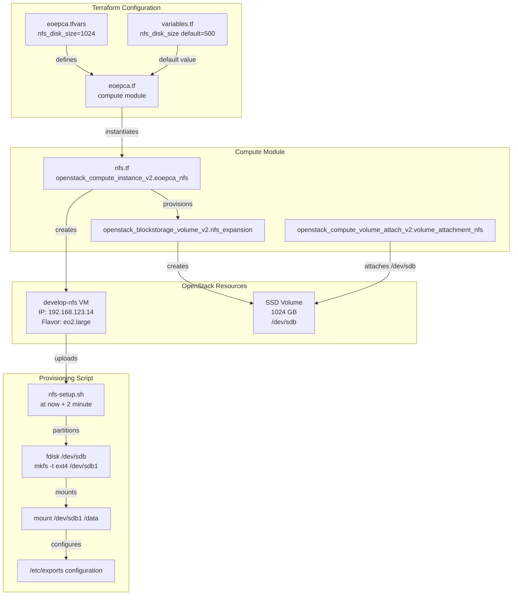
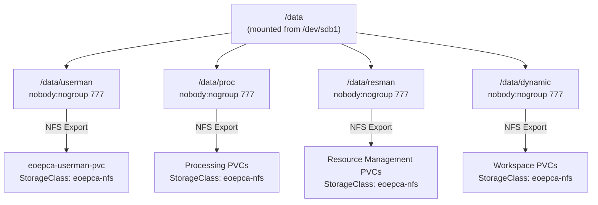
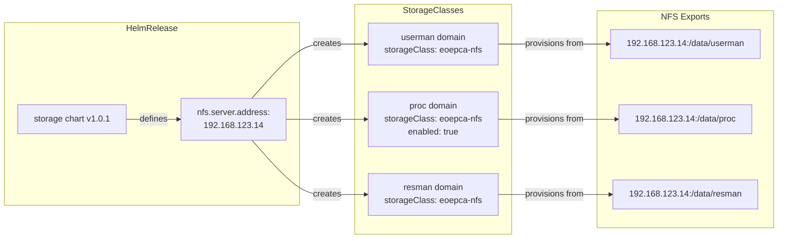
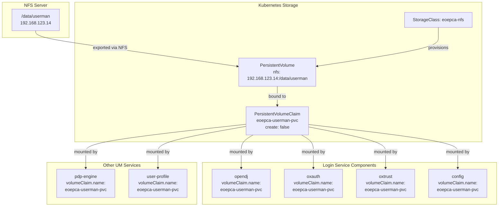

# NFS and Persistent Volumes

<details>
<summary>Relevant source files</summary>

The following files were used as context for generating this wiki page:

- [bin/install-kubeseal.sh](bin/install-kubeseal.sh)
- [bin/install-rke.sh](bin/install-rke.sh)
- [creodias/.gitignore](creodias/.gitignore)
- [creodias/.terraform/modules/modules.json](creodias/.terraform/modules/modules.json)
- [creodias/README.md](creodias/README.md)
- [creodias/deployCREODIAS.sh](creodias/deployCREODIAS.sh)
- [creodias/eoepca.tf](creodias/eoepca.tf)
- [creodias/eoepca.tfvars](creodias/eoepca.tfvars)
- [creodias/modules/compute/main.tf](creodias/modules/compute/main.tf)
- [creodias/modules/compute/nfs-setup.sh](creodias/modules/compute/nfs-setup.sh)
- [creodias/modules/compute/nfs.tf](creodias/modules/compute/nfs.tf)
- [creodias/modules/compute/outputs.tf](creodias/modules/compute/outputs.tf)
- [creodias/modules/compute/variables.tf](creodias/modules/compute/variables.tf)
- [creodias/modules/loadbalancer/main.tf](creodias/modules/loadbalancer/main.tf)
- [creodias/terraform.tfstate](creodias/terraform.tfstate)
- [creodias/terraform.tfstate.backup](creodias/terraform.tfstate.backup)
- [creodias/variables.tf](creodias/variables.tf)
- [kubernetes/cluster.7z](kubernetes/cluster.7z)
- [kubernetes/create-cluster-config.sh](kubernetes/create-cluster-config.sh)
- [system/clusters/creodias/system/demo/hr-django-portal.yaml](system/clusters/creodias/system/demo/hr-django-portal.yaml)
- [system/clusters/creodias/system/storage/hr-storage.yaml](system/clusters/creodias/system/storage/hr-storage.yaml)
- [system/clusters/creodias/system/test/hr-cheese.yaml](system/clusters/creodias/system/test/hr-cheese.yaml)
- [system/clusters/creodias/user-management/um-login-service.yaml](system/clusters/creodias/user-management/um-login-service.yaml)
- [system/clusters/creodias/user-management/um-pdp-engine.yaml](system/clusters/creodias/user-management/um-pdp-engine.yaml)
- [system/clusters/creodias/user-management/um-user-profile.yaml](system/clusters/creodias/user-management/um-user-profile.yaml)

</details>


## Purpose and Scope

This document describes the Network File System (NFS) server infrastructure and PersistentVolume (PV) architecture used in the EOEPCA platform. It covers the provisioning of the NFS server via Terraform, the configuration of Kubernetes storage classes, and the usage patterns of PersistentVolumeClaims (PVCs) across platform services.

For information about S3-based object storage used for data access and workspace buckets, see [S3 Storage Architecture](#7.1). For database persistence mechanisms, see [Database Systems](#7.2).

## NFS Server Overview

The EOEPCA platform deploys a dedicated NFS server as a centralized shared storage solution for services requiring ReadWriteMany access patterns. The NFS server is provisioned as a separate VM in the OpenStack infrastructure and provides persistent storage for user management, resource management, and processing services.

The NFS server is distinct from other storage backends in the platform:
- **NFS**: Shared filesystem for configuration and metadata requiring multi-pod access
- **S3/MinIO**: Object storage for large-scale EO data and workspace outputs
- **PostgreSQL**: Structured metadata storage for catalogues and identity services

Sources: [system/clusters/creodias/system/storage/hr-storage.yaml:1-30](), [creodias/modules/compute/nfs.tf:1-70]()

## Infrastructure Provisioning

### NFS VM Deployment

The NFS server is provisioned through Terraform as part of the infrastructure deployment. The configuration creates an OpenStack compute instance with an attached block storage volume.



The NFS instance is created with metadata indicating its role and dependencies:
- `kubespray_groups`: "nfs,no-floating"
- `ssh_user`: "eouser"
- `depends_on`: references the block volume ID

Sources: [creodias/modules/compute/nfs.tf:1-70](), [creodias/eoepca.tfvars:56-56](), [creodias/variables.tf:231-233]()

### Volume Configuration

The NFS server uses a two-tier storage approach:

| Storage Tier | Purpose | Size | Type | Device |
|--------------|---------|------|------|--------|
| Root Volume | OS and system files | Flavor default | Image-based | /dev/sda |
| Expansion Volume | NFS export data | 1024 GB (configurable) | SSD | /dev/sdb |

The expansion volume is defined in [creodias/modules/compute/nfs.tf:52-62]() as:

```
resource "openstack_blockstorage_volume_v2" "nfs_expansion"
  name: "${var.cluster_name}-nfs-expansion"
  size: "${var.nfs_disk_size}"
  volume_type: "SSD"
```

Sources: [creodias/modules/compute/nfs.tf:52-70](), [creodias/terraform.tfstate:220-259]()

### NFS Server Setup Script

The NFS server is configured automatically via the `nfs-setup.sh` script, which is uploaded and executed via Terraform provisioners. The script runs as a delayed job (`at now + 2 minute`) to ensure the volume attachment is complete.

**NFS Export Directory Structure:**



Each directory is exported with NFS options: `rw,no_root_squash,no_subtree_check`

The setup script performs the following operations:
1. Installs `nfs-kernel-server` package
2. Creates partition on `/dev/sdb` using `fdisk`
3. Formats partition as ext4 filesystem
4. Mounts `/dev/sdb1` to `/data`
5. Adds mount to `/etc/fstab` for persistence
6. Creates export subdirectories: userman, proc, resman, dynamic
7. Configures `/etc/exports` with appropriate NFS export rules
8. Restarts `nfs-kernel-server` service

Sources: [creodias/modules/compute/nfs-setup.sh:1-44](), [creodias/modules/compute/nfs.tf:34-44]()

## Kubernetes Storage Configuration

### Storage HelmRelease

The NFS integration with Kubernetes is configured through the storage HelmRelease, which deploys the necessary StorageClasses and NFS provisioners.

**Storage Configuration Structure:**



The storage configuration is defined in [system/clusters/creodias/system/storage/hr-storage.yaml:15-29]():

```yaml
values:
  host:
    enabled: false
  nfs:
    server:
      address: "192.168.123.14"
  domain:
    resman:
      storageClass: eoepca-nfs
    proc:
      enabled: true
      storageClass: eoepca-nfs
    userman:
      storageClass: eoepca-nfs
```

The NFS server address matches the IP output from Terraform: [creodias/terraform.tfstate:79-82]()

Sources: [system/clusters/creodias/system/storage/hr-storage.yaml:1-30](), [creodias/eoepca.tf:143-145]()

### StorageClass Provisioning

The `eoepca-nfs` StorageClass is created for each domain (userman, proc, resman) and enables dynamic provisioning of PersistentVolumes. When a PersistentVolumeClaim is created with this StorageClass, the NFS provisioner automatically creates a subdirectory on the NFS export and binds it to the claim.

**StorageClass Characteristics:**
- **Provisioner**: NFS CSI driver or external provisioner
- **Access Modes**: ReadWriteMany (RWX) - multiple pods can mount concurrently
- **Reclaim Policy**: Typically Retain or Delete based on configuration
- **Volume Binding Mode**: Immediate or WaitForFirstConsumer

Sources: [system/clusters/creodias/system/storage/hr-storage.yaml:15-29]()

## PersistentVolumeClaim Usage Patterns

### User Management Services

The User Management building block uses a shared PVC named `eoepca-userman-pvc` across multiple components. This PVC is provisioned from the `eoepca-nfs` StorageClass and mounted by all Gluu-based services.

**User Management PVC Topology:**



The PVC configuration shows `create: false` in the HelmRelease values, indicating the PVC is pre-created rather than managed by individual service Helm charts. This ensures all User Management services share the same underlying storage.

Example from [system/clusters/creodias/user-management/um-login-service.yaml:16-29]():

```yaml
volumeClaim:
  name: eoepca-userman-pvc
  create: false
config:
  volumeClaim:
    name: eoepca-userman-pvc
opendj:
  volumeClaim:
    name: eoepca-userman-pvc
oxauth:
  volumeClaim:
    name: eoepca-userman-pvc
oxtrust:
  volumeClaim:
    name: eoepca-userman-pvc
```

Sources: [system/clusters/creodias/user-management/um-login-service.yaml:16-47](), [system/clusters/creodias/user-management/um-pdp-engine.yaml:22-24](), [system/clusters/creodias/user-management/um-user-profile.yaml:19-21]()

### Resource Management Services

Resource Management services use the `eoepca-nfs` StorageClass backed by the `/data/resman` NFS export. This storage is used for:
- Resource catalogue metadata persistence
- Data access service cache
- Workspace API configuration
- Template storage for workspace provisioning

### Processing Services

The Processing domain (`proc`) uses NFS storage for:
- ADES workflow state and job metadata
- Application Hub user notebooks and environment state
- PDE shared development resources

The processing storage is explicitly enabled in the storage configuration: [system/clusters/creodias/system/storage/hr-storage.yaml:24-26]()

Sources: [system/clusters/creodias/system/storage/hr-storage.yaml:15-29]()

## Access and Connectivity

### Network Access Requirements

The NFS server must be accessible from all Kubernetes worker nodes within the internal network. The NFS instance is configured with:
- **Internal IP**: 192.168.123.14 (no floating IP)
- **Security Group**: `develop-k8s` allowing internal cluster communication
- **NFS Ports**: TCP/UDP 2049, 111 (rpcbind), 20048 (mountd)

The NFS VM metadata includes `no-floating` to indicate it should not be assigned a public IP address:
[creodias/modules/compute/nfs.tf:21-21]()

### Bastion Access for Administration

Direct SSH access to the NFS server requires connection through the bastion host. The Terraform provisioner demonstrates this pattern:

```
connection {
  type         = "ssh"
  user         = "${var.ssh_user}"
  host         = "${self.access_ip_v4}"
  bastion_host = var.bastion_fips[0]
}
```

For operational procedures related to bastion access, see [Monitoring and Troubleshooting](#11.2).

Sources: [creodias/modules/compute/nfs.tf:26-32](), [creodias/terraform.tfstate:450-515]()

## Storage Capacity and Scaling

### Initial Capacity

The default NFS expansion volume size is configurable through the `nfs_disk_size` Terraform variable:
- **Default**: 500 GB ([creodias/variables.tf:231-233]())
- **Current Deployment**: 1024 GB ([creodias/eoepca.tfvars:56-56]())

### Volume Expansion

To increase NFS storage capacity:

1. Use OpenStack block storage volume expansion API
2. Extend the filesystem using SSH access through bastion
3. Update Terraform state to reflect new size

The volume is attached as `/dev/sdb` and can be expanded without VM restart if the OpenStack environment supports online volume expansion.

Sources: [creodias/modules/compute/nfs.tf:52-62](), [creodias/eoepca.tfvars:56-56](), [creodias/variables.tf:231-233]()

## Disaster Recovery Considerations

### Backup Strategy

The NFS exports contain critical platform state including:
- User identity and authorization data (`/data/userman`)
- Resource catalogue metadata (`/data/resman`)
- Processing workflow state (`/data/proc`)

Backup procedures should:
1. Use OpenStack volume snapshots for point-in-time recovery
2. Implement regular rsync or NFS-level replication
3. Maintain metadata exports separately from large data objects (which use S3)

### PVC Reclaim Policy

The PVC reclaim policy determines what happens to PersistentVolumes when their claims are deleted. Common configurations:
- **Retain**: PV is not deleted, requires manual cleanup (safer for production)
- **Delete**: PV and underlying storage are automatically deleted (used for dynamic workspaces)

Sources: [creodias/modules/compute/nfs-setup.sh:1-44]()

## Terraform Output Reference

The NFS server IP address is exposed as a Terraform output for consumption by downstream configuration:

[creodias/eoepca.tf:143-145]()
```hcl
output "nfs_ip_address" {
  value = "${module.compute.nfs_ip_address}"
}
```

This output is referenced in the storage HelmRelease configuration and can be queried via:
```bash
terraform output -state=creodias/terraform.tfstate nfs_ip_address
```

Sources: [creodias/eoepca.tf:143-145](), [creodias/terraform.tfstate:79-82]()