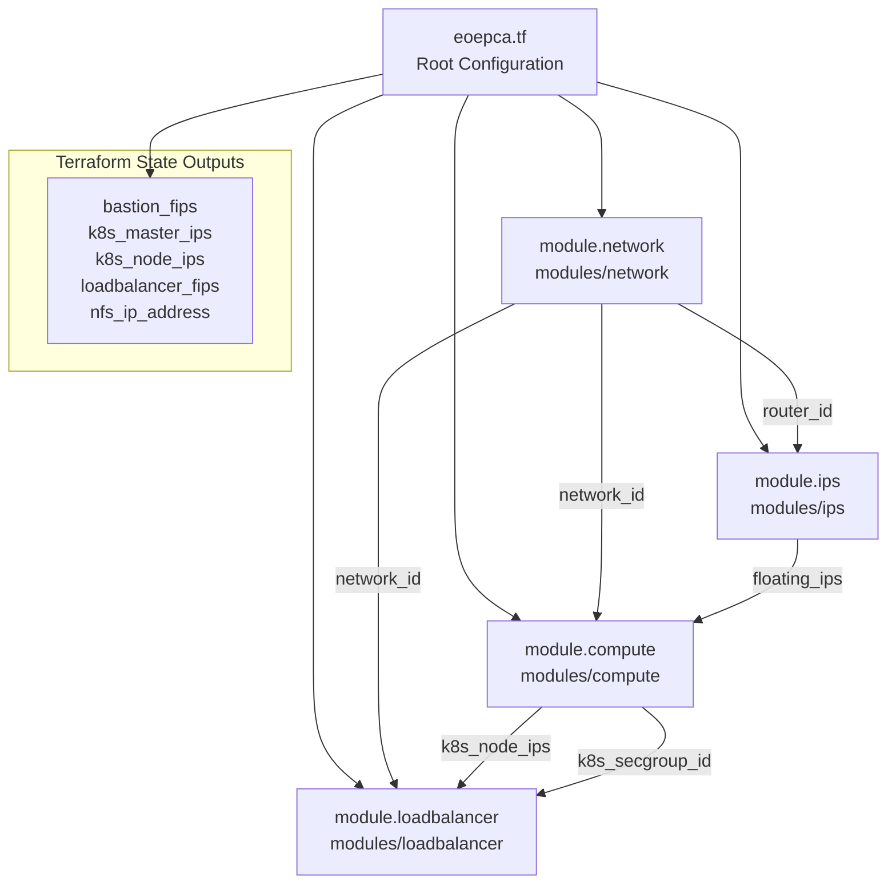
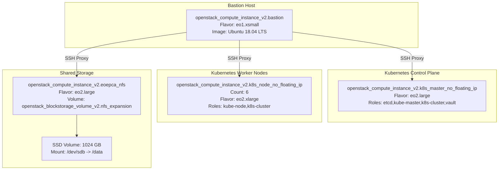
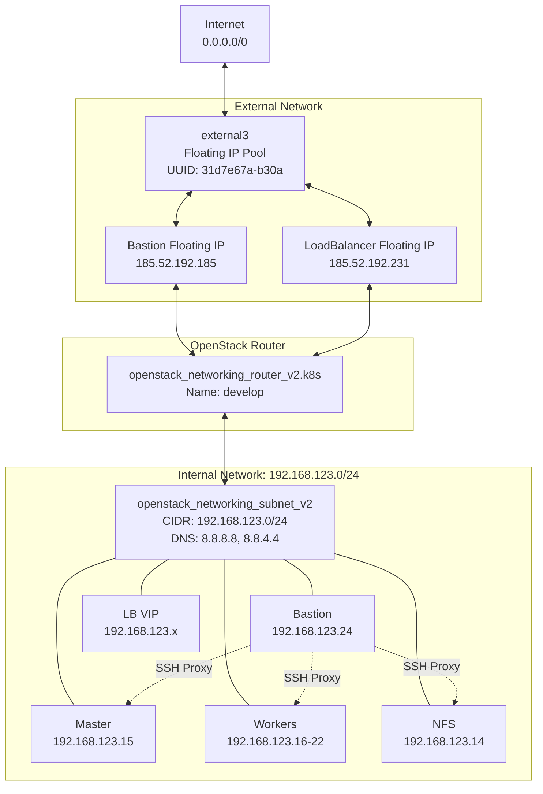
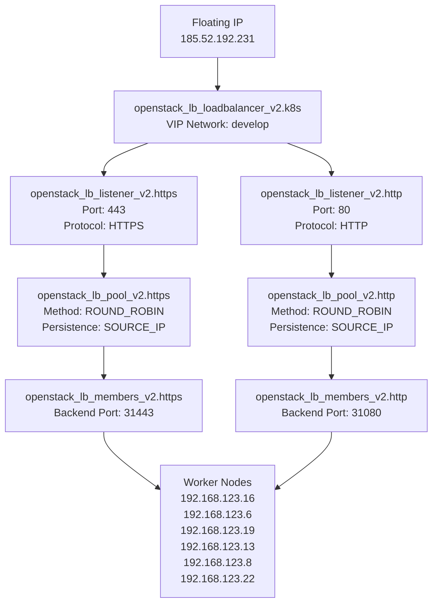
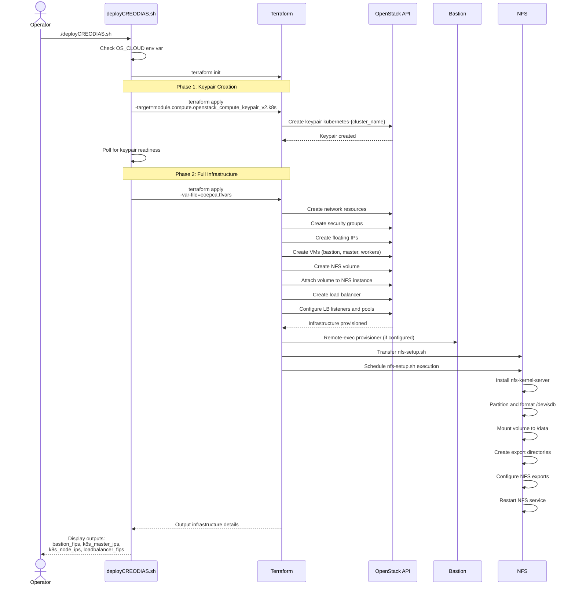

# Infrastructure

<details>
<summary>Relevant source files</summary>

The following files were used as context for generating this wiki page:

- [README.md](README.md)
- [bin/install-kubeseal.sh](bin/install-kubeseal.sh)
- [bin/install-rke.sh](bin/install-rke.sh)
- [creodias/.gitignore](creodias/.gitignore)
- [creodias/.terraform/modules/modules.json](creodias/.terraform/modules/modules.json)
- [creodias/README.md](creodias/README.md)
- [creodias/deployCREODIAS.sh](creodias/deployCREODIAS.sh)
- [creodias/eoepca.tf](creodias/eoepca.tf)
- [creodias/eoepca.tfvars](creodias/eoepca.tfvars)
- [creodias/modules/compute/main.tf](creodias/modules/compute/main.tf)
- [creodias/modules/compute/nfs-setup.sh](creodias/modules/compute/nfs-setup.sh)
- [creodias/modules/compute/nfs.tf](creodias/modules/compute/nfs.tf)
- [creodias/modules/compute/outputs.tf](creodias/modules/compute/outputs.tf)
- [creodias/modules/compute/variables.tf](creodias/modules/compute/variables.tf)
- [creodias/modules/loadbalancer/main.tf](creodias/modules/loadbalancer/main.tf)
- [creodias/terraform.tfstate](creodias/terraform.tfstate)
- [creodias/terraform.tfstate.backup](creodias/terraform.tfstate.backup)
- [creodias/variables.tf](creodias/variables.tf)
- [kubernetes/cluster.7z](kubernetes/cluster.7z)
- [kubernetes/create-cluster-config.sh](kubernetes/create-cluster-config.sh)
- [minikube/README.md](minikube/README.md)
- [system/clusters/README.md](system/clusters/README.md)

</details>


## Purpose and Scope

This page documents the underlying infrastructure layer that supports the EOEPCA platform deployment. It covers the physical and virtual resources, networking topology, and orchestration mechanisms required to run the Kubernetes cluster and associated services.

The infrastructure can be provisioned in two primary deployment models: cloud-based deployment on OpenStack CREODIAS infrastructure (for production and development environments), or local deployment using Minikube/k3s (for testing and development). Both approaches leverage Infrastructure-as-Code principles to ensure reproducible, version-controlled deployments.

For detailed procedures on provisioning Kubernetes clusters, see [Kubernetes Cluster Setup](#8.1). For Terraform module documentation, see [Terraform Infrastructure as Code](#8.2). For network topology details, see [Network Architecture](#8.3).

---

## Infrastructure Deployment Models

EOEPCA supports two infrastructure deployment patterns:

| Deployment Model | Use Case | Orchestration | Platform |
|-----------------|----------|---------------|----------|
| **Cloud (Production)** | Production, development clusters | Terraform + RKE | OpenStack CREODIAS |
| **Local (Development)** | Testing, local development | Setup scripts | Minikube or k3s |

The cloud deployment creates a full multi-node cluster with dedicated networking, load balancing, and persistent storage. The local deployment provides a single-node or minimal cluster for rapid iteration and testing.

**Sources:** [README.md:73-96](), [minikube/README.md:1-52](), [creodias/README.md:1-129]()

---

## Infrastructure-as-Code Architecture

### Terraform Module Structure

The EOEPCA infrastructure is defined using Terraform with a modular architecture. The root configuration orchestrates five specialized modules:



**Terraform Module Structure**

The root module at [creodias/eoepca.tf:1-146]() coordinates infrastructure provisioning by declaring module dependencies and passing outputs between modules. Configuration values are defined in [creodias/eoepca.tfvars:1-57]() and [creodias/variables.tf:1-233]().

**Sources:** [creodias/eoepca.tf:6-93](), [creodias/.terraform/modules/modules.json:1]()

### OpenStack Provider Configuration

Terraform uses the OpenStack provider configured through `clouds.yaml` file. The provider is initialized in [creodias/eoepca.tf:1-4]() with Octavia load balancing support enabled. The deployment script [creodias/deployCREODIAS.sh:1-52]() requires the `OS_CLOUD` environment variable to specify which cloud configuration from `clouds.yaml` to use.

**Sources:** [creodias/eoepca.tf:1-4](), [creodias/deployCREODIAS.sh:14-52](), [creodias/README.md:29-53]()

---

## Core Infrastructure Components

### Compute Resources

The compute module provisions multiple VM types with specific roles:



**Virtual Machine Deployment**

The compute module defines VM resources in [creodias/modules/compute/main.tf:1-967]():

- **Bastion host** (`bastion`): Single point of SSH access with floating IP, configured at [creodias/modules/compute/main.tf:116-141]()
- **Master nodes** (`k8s_master_no_floating_ip`): Control plane nodes without floating IPs, defined at [creodias/modules/compute/main.tf:384-428]()
- **Worker nodes** (`k8s_node_no_floating_ip`): Compute nodes for workload execution, defined at [creodias/modules/compute/main.tf:687-731]()
- **NFS server** (`eoepca_nfs`): Dedicated storage server with attached block volume, configured at [creodias/modules/compute/nfs.tf:1-70]()

Instance counts and flavors are configured via variables in [creodias/eoepca.tfvars:18-48]():
- `number_of_bastions = 1`
- `number_of_k8s_masters_no_floating_ip = 1`
- `number_of_k8s_nodes_no_floating_ip = 6`
- `nfs_disk_size = 1024`

**Sources:** [creodias/modules/compute/main.tf:116-141](), [creodias/modules/compute/main.tf:384-428](), [creodias/modules/compute/main.tf:687-731](), [creodias/modules/compute/nfs.tf:1-70](), [creodias/eoepca.tfvars:18-57]()

### NFS Storage Provisioning

The NFS server is automatically configured through a provisioning script that:

1. Installs `nfs-kernel-server` package
2. Creates partition on attached `/dev/sdb` volume
3. Formats and mounts the partition at `/data`
4. Exports subdirectories: `userman`, `proc`, `resman`, `dynamic`

The provisioning logic is implemented in [creodias/modules/compute/nfs-setup.sh:1-44]() and executed via remote-exec provisioner in [creodias/modules/compute/nfs.tf:26-44](). The NFS instance definition includes a connection block at [creodias/modules/compute/nfs.tf:26-32]() that uses the bastion host as a jump server.

**Sources:** [creodias/modules/compute/nfs.tf:1-70](), [creodias/modules/compute/nfs-setup.sh:1-44]()

---

## Network Architecture

### Network Topology



**Network Infrastructure**

The network module creates:
- **Internal network** (`develop`): Private network with CIDR `192.168.123.0/24` [creodias/eoepca.tfvars:8-11]()
- **Router**: Connects internal network to external network, provides NAT gateway
- **Floating IP Pool** (`external3`): Source of public IPs for bastion and load balancer

**Sources:** [creodias/eoepca.tfvars:3-11](), [creodias/terraform.tfstate:91-94]()

### Security Groups

The compute module defines security groups to control traffic:

| Security Group | Resource | Rules |
|----------------|----------|-------|
| `${cluster_name}-k8s-master` | `openstack_networking_secgroup_v2.k8s_master` | Port 6443 (Kubernetes API) from allowed IPs |
| `${cluster_name}-bastion` | `openstack_networking_secgroup_v2.bastion` | Port 22 (SSH) from `0.0.0.0/0` |
| `${cluster_name}-k8s` | `openstack_networking_secgroup_v2.k8s` | Intra-cluster traffic, SSH from allowed IPs |
| `${cluster_name}-k8s-worker` | `openstack_networking_secgroup_v2.worker` | Ports 30000-32767 (NodePort range) |
| `${cluster_name}-lb` | `openstack_networking_secgroup_v2.lb` | Ports 80, 443 (HTTP/HTTPS) |

Security group definitions are in [creodias/modules/compute/main.tf:14-96]() and [creodias/modules/loadbalancer/main.tf:2-36]().

**Sources:** [creodias/modules/compute/main.tf:14-96](), [creodias/modules/loadbalancer/main.tf:2-36]()

### Load Balancer Configuration

The load balancer module creates an Octavia load balancer with the following resources:



**Load Balancer Resources**

The load balancer forwards public traffic to Kubernetes ingress NodePorts:
- **HTTPS (443)** → Worker nodes port **31443** [creodias/modules/loadbalancer/main.tf:71-82]()
- **HTTP (80)** → Worker nodes port **31080** [creodias/modules/loadbalancer/main.tf:83-93]()

Members are dynamically generated from worker node IPs using `for_each` loops [creodias/modules/loadbalancer/main.tf:95-122]() and [creodias/modules/loadbalancer/main.tf:124-151]().

**Sources:** [creodias/modules/loadbalancer/main.tf:38-184](), [creodias/README.md:76-97]()

---

## Infrastructure Provisioning Workflow

### Deployment Process



**Provisioning Phases**

The [creodias/deployCREODIAS.sh:1-52]() script orchestrates a two-phase deployment:

1. **Keypair Phase** [creodias/deployCREODIAS.sh:30-45](): Creates SSH keypair first to ensure it's available before VM provisioning. Uses targeted apply: `terraform apply -target=module.compute.openstack_compute_keypair_v2.k8s`

2. **Full Infrastructure Phase** [creodias/deployCREODIAS.sh:47-51](): Provisions all remaining resources with `terraform apply -var-file=eoepca.tfvars`

The script uses `TF_LOG_PATH` environment variable to separate debug logs for each phase [creodias/deployCREODIAS.sh:30-49]().

**Sources:** [creodias/deployCREODIAS.sh:1-52](), [creodias/README.md:58-68]()

### Terraform State Management

Terraform maintains infrastructure state in `terraform.tfstate` [creodias/terraform.tfstate:1-100](). The state captures:
- Resource IDs and metadata
- IP address allocations
- Resource dependencies
- Module outputs

State outputs are consumed by subsequent deployment steps, particularly Kubernetes cluster configuration via [kubernetes/create-cluster-config.sh:1-117](). This script queries Terraform outputs to generate RKE cluster configuration:

```bash
master_nodes=$(terraform output -state=../creodias/terraform.tfstate -json | jq -r '.k8s_master_ips.value[]')
worker_nodes=$(terraform output -state=../creodias/terraform.tfstate -json | jq -r '.k8s_node_ips.value[]')
bastion=$(terraform output -state=../creodias/terraform.tfstate -json | jq -r '.bastion_fips.value[]')
```

**Sources:** [creodias/terraform.tfstate:1-95](), [kubernetes/create-cluster-config.sh:20-80]()

---

## Accessing the Infrastructure

### Bastion Host Access Pattern

All administrative access to cluster VMs is routed through the bastion host, which serves as the sole entry point with a public floating IP. The bastion provides two access methods:

**Direct SSH Jump**
```bash
ssh -J eouser@<bastion-fip> eouser@<node-internal-ip>
```

**VPN Tunnel via sshuttle**

The helper script [bin/bastion-vpn.sh]() establishes a VPN tunnel using `sshuttle`, routing local traffic to the internal network CIDR. This enables direct interaction with cluster services using `kubectl` without repeated SSH jumps.

The script extracts bastion IP and subnet CIDR from Terraform outputs:
```bash
sshuttle -r eouser@$(terraform output bastion_fips) $(terraform output subnet_cidr)
```

**Sources:** [creodias/README.md:98-120](), [README.md:100-119]()

---

## Local Development Infrastructure

### Minikube Deployment

For local development and testing, [minikube/setup-minikube.sh]() provides a streamlined Kubernetes cluster setup. Minikube supports two driver modes:

| Driver | Deployment | Command |
|--------|------------|---------|
| `docker` (default) | Containerized cluster | `./setup-minikube.sh` |
| `none` (native) | Direct on host VM | `./setup-minikube.sh native` |

The `docker` driver is preferred but may have performance constraints in nested virtualization scenarios. The `none` driver runs Kubernetes components directly on the host for better performance in VMs.

**Sources:** [minikube/README.md:1-52](), [README.md:89-96]()

### k3s Alternative

As a lightweight alternative to Minikube, [minikube/setup-k3s.sh]() installs Rancher's k3s distribution. k3s provides faster startup and lower resource consumption, making it suitable for constrained environments. The setup script configures k3s with the Docker container runtime (instead of default containerd) to support ADES Argo requirements.

**Sources:** [minikube/README.md:38-49]()

---

## Infrastructure Configuration Reference

### Key Configuration Variables

The following table summarizes the primary infrastructure configuration parameters defined in [creodias/eoepca.tfvars:1-57]():

| Variable | Value | Purpose |
|----------|-------|---------|
| `cluster_name` | `develop` | Cluster identifier, prefixes all resources |
| `subnet_cidr` | `192.168.123.0/24` | Internal network address range |
| `number_of_k8s_masters_no_floating_ip` | `1` | Control plane nodes without public IPs |
| `number_of_k8s_nodes_no_floating_ip` | `6` | Worker nodes without public IPs |
| `flavor_k8s_master` | `20` (eo2.large) | Master node flavor (4 vCPU, 8 GB RAM) |
| `flavor_k8s_node` | `21` (eo2.xlarge) | Worker node flavor (8 vCPU, 16 GB RAM) |
| `nfs_disk_size` | `1024` | NFS volume size in GB |
| `image` | `Ubuntu 18.04 LTS` | Base OS image |
| `dns_nameservers` | `["8.8.8.8", "8.8.4.4"]` | DNS servers for internal network |

**Sources:** [creodias/eoepca.tfvars:1-57](), [creodias/variables.tf:1-233]()

### Required Tools

Infrastructure provisioning requires the following tools:

- **Terraform** (v0.12+): Install via [bin/install-terraform.sh]() [README.md:13-16]()
- **OpenStack CLI**: `pip install openstackclient` [creodias/README.md:20-26]()
- **kubectl**: Install via [bin/install-kubectl.sh]() [minikube/README.md:7-14]()
- **RKE**: Install via [bin/install-rke.sh]() [bin/install-rke.sh:1-14]()
- **kubeseal** (for secrets): Install via [bin/install-kubeseal.sh]() [bin/install-kubeseal.sh:1-23]()
- **jq** (for helper scripts): Command-line JSON processor [creodias/README.md:5-7]()

**Sources:** [creodias/README.md:9-25](), [README.md:73-94](), [bin/install-rke.sh:1-14](), [bin/install-kubeseal.sh:1-23]()