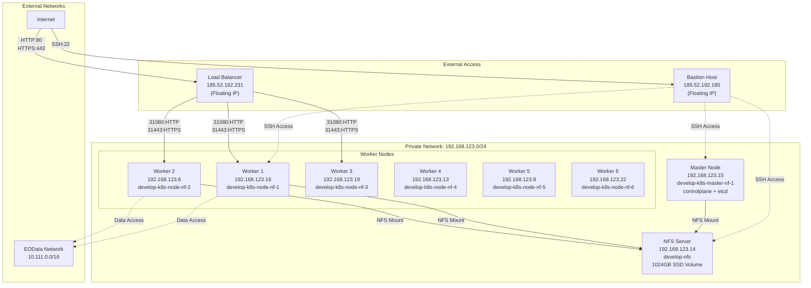
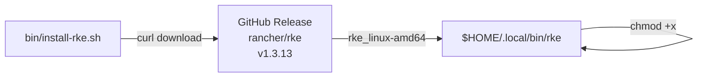
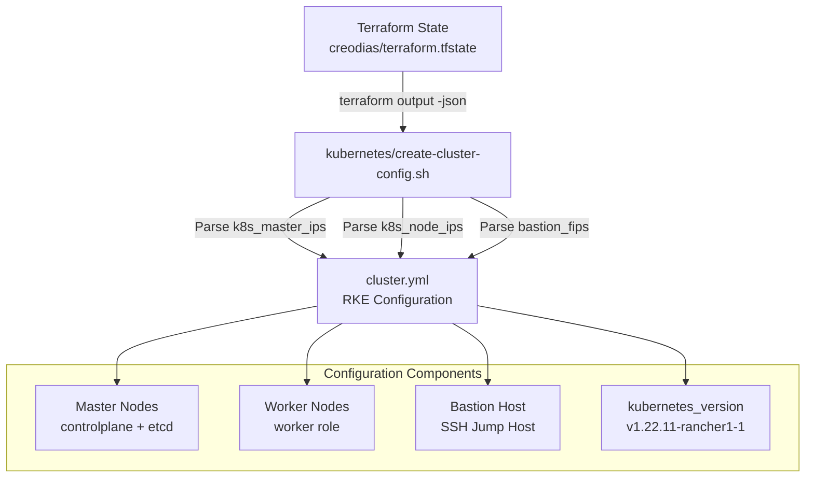
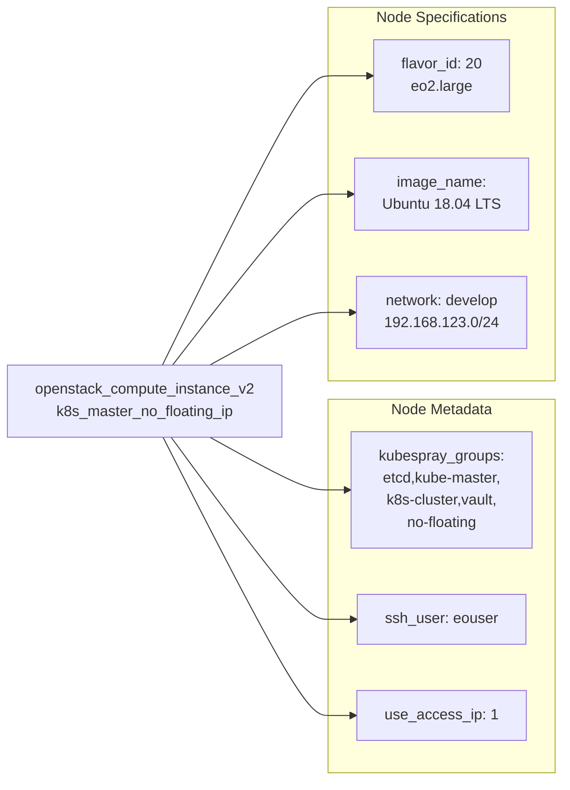
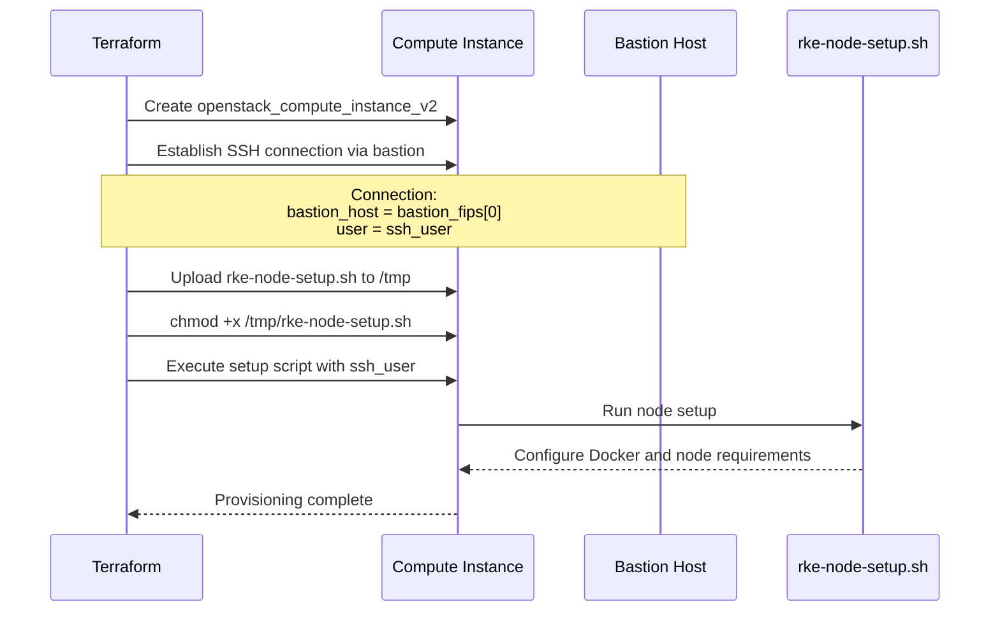
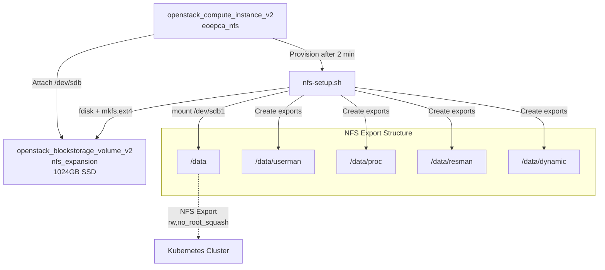
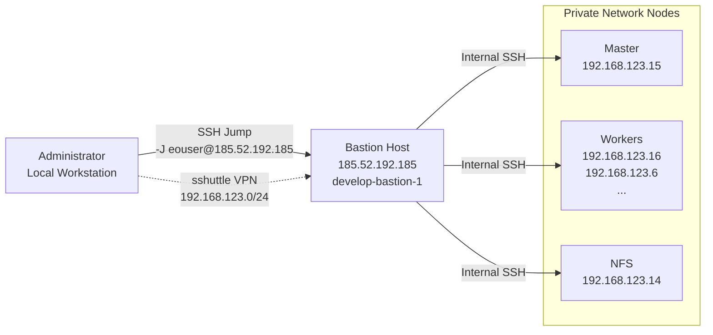
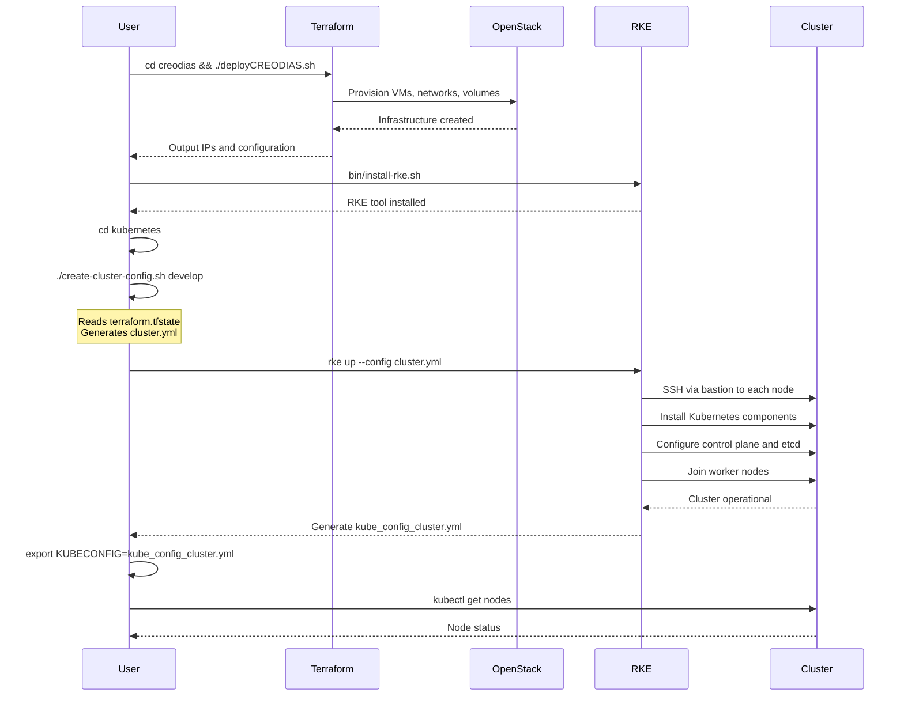
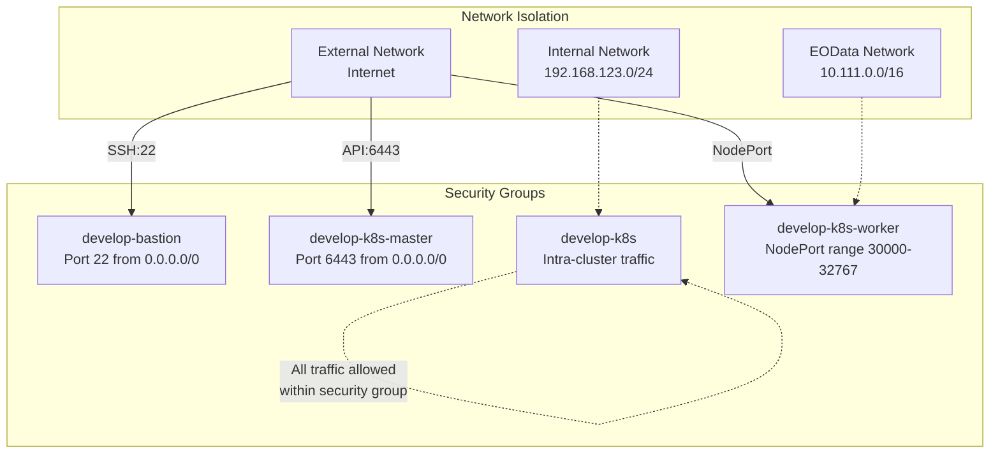

# Kubernetes Cluster Setup

<details>
<summary>Relevant source files</summary>

The following files were used as context for generating this wiki page:

- [bin/install-kubeseal.sh](bin/install-kubeseal.sh)
- [bin/install-rke.sh](bin/install-rke.sh)
- [creodias/.gitignore](creodias/.gitignore)
- [creodias/.terraform/modules/modules.json](creodias/.terraform/modules/modules.json)
- [creodias/README.md](creodias/README.md)
- [creodias/deployCREODIAS.sh](creodias/deployCREODIAS.sh)
- [creodias/eoepca.tf](creodias/eoepca.tf)
- [creodias/eoepca.tfvars](creodias/eoepca.tfvars)
- [creodias/modules/compute/main.tf](creodias/modules/compute/main.tf)
- [creodias/modules/compute/nfs-setup.sh](creodias/modules/compute/nfs-setup.sh)
- [creodias/modules/compute/nfs.tf](creodias/modules/compute/nfs.tf)
- [creodias/modules/compute/outputs.tf](creodias/modules/compute/outputs.tf)
- [creodias/modules/compute/variables.tf](creodias/modules/compute/variables.tf)
- [creodias/modules/loadbalancer/main.tf](creodias/modules/loadbalancer/main.tf)
- [creodias/terraform.tfstate](creodias/terraform.tfstate)
- [creodias/terraform.tfstate.backup](creodias/terraform.tfstate.backup)
- [creodias/variables.tf](creodias/variables.tf)
- [kubernetes/cluster.7z](kubernetes/cluster.7z)
- [kubernetes/create-cluster-config.sh](kubernetes/create-cluster-config.sh)

</details>


## Purpose and Scope

This document describes the process of provisioning a Kubernetes cluster using RKE (Rancher Kubernetes Engine) on the infrastructure created by Terraform on OpenStack CREODIAS. This page assumes that the underlying infrastructure (VMs, networks, security groups) has already been provisioned using Terraform. For information about the Terraform infrastructure provisioning, see [Infrastructure Provisioning](#2.2) and [Terraform Infrastructure as Code](#8.2). For network topology details, see [Network Architecture](#8.3).

The cluster setup involves:
- Installing the RKE command-line tool
- Generating a cluster configuration file from Terraform outputs
- Deploying Kubernetes using RKE
- Configuring node access via bastion host

---

## Infrastructure Overview

The Kubernetes cluster is deployed on infrastructure provisioned by Terraform, consisting of the following components:



**Infrastructure Components from Terraform State**

Sources: [creodias/terraform.tfstate:1-150](), [creodias/eoepca.tfvars:1-57]()

---

## RKE Installation

RKE is the tool used to provision the Kubernetes cluster. The installation script downloads the RKE binary and places it in the user's local bin directory.



**Installation Command:**
```bash
$ bin/install-rke.sh
```

The script downloads RKE version 1.3.13 from the official GitHub releases.

Sources: [bin/install-rke.sh:1-14]()

---

## Cluster Configuration Generation

The `create-cluster-config.sh` script generates the RKE cluster configuration file by reading Terraform state outputs to obtain node IP addresses.



**Script Execution:**
```bash
$ cd kubernetes
$ ./create-cluster-config.sh develop cluster.yml
```

The script performs the following operations:

| Function | Purpose | Terraform Output Used |
|----------|---------|----------------------|
| `master_nodes()` | Generate master node configuration | `k8s_master_ips.value[]` |
| `worker_nodes()` | Generate worker node configuration | `k8s_node_ips.value[]` |
| `bastion_host()` | Configure SSH bastion access | `bastion_fips.value[]` |
| `docker_registry()` | Configure private registry credentials | `$DOCKER_USER`, `$DOCKER_PASSWORD` |

**Generated cluster.yml Structure:**

```yaml
cluster_name: develop
kubernetes_version: "v1.22.11-rancher1-1"
nodes:
  - address: 192.168.123.15
    user: eouser
    role:
      - controlplane
      - etcd
  - address: 192.168.123.16
    user: eouser
    role:
      - worker
  # ... additional worker nodes

ingress:
  provider: none

bastion_host:
  address: 185.52.192.185
  user: eouser
```

Sources: [kubernetes/create-cluster-config.sh:1-117](), [creodias/terraform.tfstate:22-67]()

---

## Node Configuration and Roles

The Kubernetes nodes are configured with specific roles and metadata during Terraform provisioning.

### Master Node Configuration

Master nodes run the Kubernetes control plane and etcd:



Sources: [creodias/modules/compute/main.tf:384-437](), [creodias/terraform.tfstate:594-669]()

### Worker Node Configuration

Worker nodes execute application workloads and are connected to both the internal network and the EOData network for accessing Earth Observation data:

| Configuration | Value | Purpose |
|--------------|-------|---------|
| Flavor | `eo2.xlarge` (flavor_id: 21) | Larger resources for workload execution |
| Primary Network | `develop` (192.168.123.0/24) | Cluster communication |
| Secondary Network | `eodata` (10.111.0.0/16) | Direct access to satellite data |
| Security Groups | `develop-k8s`, `develop-k8s-worker` | Network access control |
| Kubespray Groups | `kube-node,k8s-cluster,no-floating` | Node role assignment |

Sources: [creodias/modules/compute/main.tf:720-804](), [creodias/eoepca.tfvars:30-33](), [creodias/eoepca.tfvars:47]()

---

## Node Provisioning Process

Each node is automatically provisioned with the necessary software when created by Terraform.



**Master Node Provisioning:**
- Connection established through bastion host SSH jump
- Private key authentication using the key pair's private key
- Setup script executed with `eouser` parameter
- Script installs Docker and configures the node for RKE

Sources: [creodias/modules/compute/main.tf:418-436](), [creodias/modules/compute/main.tf:598-668]()

---

## NFS Server Setup

The cluster includes a dedicated NFS server for shared persistent storage across all nodes.



**NFS Server Configuration:**

| Component | Configuration | Details |
|-----------|--------------|---------|
| Instance Name | `develop-nfs` | Single NFS server instance |
| Flavor | `eo2.large` (flavor_id: 20) | 8 vCPU, 32GB RAM |
| Boot Volume | Standard OS disk | Ubuntu 18.04 LTS |
| Data Volume | 1024GB SSD (`/dev/sdb`) | Attached block storage |
| Mount Point | `/data` | Formatted as ext4 |
| Exports | `/data/{userman,proc,resman,dynamic}` | NFS shares for different subsystems |
| Export Options | `rw,no_root_squash,no_subtree_check` | Full read-write access |

**NFS Setup Process:**

The `nfs-setup.sh` script performs the following:
1. Installs `nfs-kernel-server` package
2. Partitions and formats the attached SSD volume (`/dev/sdb1`)
3. Mounts the volume to `/data`
4. Adds the mount to `/etc/fstab` for persistence
5. Creates export subdirectories for different EOEPCA subsystems
6. Configures `/etc/exports` with NFS share definitions
7. Restarts the NFS service

The script is scheduled to run 2 minutes after instance creation using the `at` command to allow the volume attachment to complete.

Sources: [creodias/modules/compute/nfs.tf:1-70](), [creodias/modules/compute/nfs-setup.sh:1-44](), [creodias/eoepca.tfvars:56]()

---

## Cluster Access via Bastion

All administrative access to the Kubernetes cluster is routed through the bastion host for security.



**SSH Access Methods:**

1. **Direct SSH Jump:**
```bash
ssh -J eouser@185.52.192.185 eouser@192.168.123.15
```

2. **VPN via sshuttle:**
```bash
sshuttle -r eouser@185.52.192.185 192.168.123.0/24
```

The sshuttle VPN approach is preferred as it enables direct access to the Kubernetes API and facilitates `kubectl` commands from the local workstation.

**Bastion Host Configuration:**

| Property | Value | Purpose |
|----------|-------|---------|
| Flavor | `eo1.xsmall` (flavor_id: 14) | Minimal resources for SSH gateway |
| Floating IP | `185.52.192.185` | Public internet access |
| Private IP | `192.168.123.24` | Internal network connectivity |
| Security Groups | `develop-bastion`, `develop-k8s` | SSH access (port 22) from internet |
| SSH User | `eouser` | Administrative user account |

Sources: [creodias/README.md:98-120](), [creodias/terraform.tfstate:356-429](), [creodias/modules/compute/main.tf:116-141]()

---

## Deployment Workflow

The complete cluster deployment follows this sequence:



**Deployment Steps:**

1. **Infrastructure Provisioning** (see [Infrastructure Provisioning](#2.2))
   ```bash
   cd creodias
   export OS_CLOUD=eoepca
   ./deployCREODIAS.sh
   ```

2. **Install RKE Tool**
   ```bash
   bin/install-rke.sh
   ```

3. **Generate Cluster Configuration**
   ```bash
   cd kubernetes
   ./create-cluster-config.sh develop cluster.yml
   ```

4. **Deploy Kubernetes Cluster**
   ```bash
   rke up --config cluster.yml
   ```

5. **Configure kubectl Access**
   ```bash
   export KUBECONFIG=$PWD/kube_config_cluster.yml
   kubectl get nodes
   ```

Sources: [creodias/deployCREODIAS.sh:1-52](), [kubernetes/create-cluster-config.sh:9-116](), [bin/install-rke.sh:1-14]()

---

## Cluster Configuration Details

The generated `cluster.yml` file contains the complete RKE cluster specification.

**Key Configuration Parameters:**

| Parameter | Value | Description |
|-----------|-------|-------------|
| `cluster_name` | `develop` | Cluster identifier |
| `kubernetes_version` | `v1.22.11-rancher1-1` | Specific Kubernetes release |
| `ingress.provider` | `none` | Ingress disabled (managed separately) |
| `nodes[].user` | `eouser` | SSH user for node access |
| `nodes[].role` | `[controlplane, etcd]` or `[worker]` | Node role assignment |
| `bastion_host.address` | Bastion floating IP | SSH jump host |

**Node Role Definitions:**

- **controlplane**: Runs kube-apiserver, kube-controller-manager, kube-scheduler
- **etcd**: Runs etcd distributed key-value store
- **worker**: Runs kubelet and kube-proxy for workload execution

The cluster uses a single combined control plane and etcd node for the default deployment, with multiple worker nodes for workload distribution.

Sources: [kubernetes/create-cluster-config.sh:92-109](), [kubernetes/create-cluster-config.sh:11]()

---

## Security Configuration

The cluster security is enforced through OpenStack security groups and network isolation.



**Security Group Rules:**

1. **Bastion Security Group** (`develop-bastion`)
   - Ingress: TCP port 22 from configurable CIDR blocks
   - Default: Allows SSH from anywhere (0.0.0.0/0)

2. **Master Security Group** (`develop-k8s-master`)
   - Ingress: TCP port 6443 (Kubernetes API)
   - Allows API access from specified IP ranges

3. **K8s Security Group** (`develop-k8s`)
   - Ingress: All traffic from members of the same security group
   - Allows internal cluster communication
   - SSH access from specified IP ranges

4. **Worker Security Group** (`develop-k8s-worker`)
   - Ingress: TCP ports 30000-32767 (NodePort range)
   - Allows external access to exposed services

Sources: [creodias/modules/compute/main.tf:14-96](), [creodias/eoepca.tfvars:53](), [creodias/variables.tf:210-221]()

---

## Post-Deployment Verification

After RKE completes the cluster deployment, verify the cluster state:

```bash
# Set kubeconfig
export KUBECONFIG=$PWD/kube_config_cluster.yml

# Verify node status
kubectl get nodes

# Expected output:
# NAME              STATUS   ROLES               AGE   VERSION
# 192.168.123.15    Ready    controlplane,etcd   5m    v1.22.11
# 192.168.123.16    Ready    worker              5m    v1.22.11
# 192.168.123.6     Ready    worker              5m    v1.22.11
# ...

# Verify system pods
kubectl get pods -n kube-system

# Check cluster info
kubectl cluster-info
```

RKE generates the `kube_config_cluster.yml` file containing the necessary credentials and configuration to access the cluster via kubectl. This kubeconfig includes the cluster CA certificate, client certificate, and API server endpoint configured to work through the bastion host.

Sources: [kubernetes/create-cluster-config.sh:1-117]()

---

## Next Steps

With the Kubernetes cluster operational, the next phase is to deploy the EOEPCA platform using GitOps with Flux CD. See [Deployment Guide](#2.1) for instructions on bootstrapping Flux and deploying the complete platform stack.

The cluster is now ready for:
- Flux CD installation and GitOps configuration
- Ingress controller deployment (nginx-ingress)
- Certificate management (cert-manager)
- EOEPCA building block deployments (User Management, Resource Management, Processing & Chaining)

Sources: [creodias/README.md:126-129]()