# Terraform Infrastructure as Code

<details>
<summary>Relevant source files</summary>

The following files were used as context for generating this wiki page:

- [bin/install-kubeseal.sh](bin/install-kubeseal.sh)
- [bin/install-rke.sh](bin/install-rke.sh)
- [creodias/.gitignore](creodias/.gitignore)
- [creodias/.terraform/modules/modules.json](creodias/.terraform/modules/modules.json)
- [creodias/README.md](creodias/README.md)
- [creodias/deployCREODIAS.sh](creodias/deployCREODIAS.sh)
- [creodias/eoepca.tf](creodias/eoepca.tf)
- [creodias/eoepca.tfvars](creodias/eoepca.tfvars)
- [creodias/modules/compute/main.tf](creodias/modules/compute/main.tf)
- [creodias/modules/compute/nfs-setup.sh](creodias/modules/compute/nfs-setup.sh)
- [creodias/modules/compute/nfs.tf](creodias/modules/compute/nfs.tf)
- [creodias/modules/compute/outputs.tf](creodias/modules/compute/outputs.tf)
- [creodias/modules/compute/variables.tf](creodias/modules/compute/variables.tf)
- [creodias/modules/loadbalancer/main.tf](creodias/modules/loadbalancer/main.tf)
- [creodias/terraform.tfstate](creodias/terraform.tfstate)
- [creodias/terraform.tfstate.backup](creodias/terraform.tfstate.backup)
- [creodias/variables.tf](creodias/variables.tf)
- [kubernetes/cluster.7z](kubernetes/cluster.7z)
- [kubernetes/create-cluster-config.sh](kubernetes/create-cluster-config.sh)

</details>


## Overview

This document describes the Terraform modules and configurations used to provision the EOEPCA infrastructure on OpenStack (CREODIAS/Cloudferro platform). The Terraform code creates all virtual machines, networking, security groups, storage volumes, and load balancers required for a Kubernetes cluster deployment.

For information about setting up the Kubernetes cluster after infrastructure provisioning, see [Kubernetes Cluster Setup](#8.1). For details about the network architecture and security groups, see [Network Architecture](#8.3).

## Terraform Module Structure

The Terraform configuration is organized into modular components under [creodias/]():

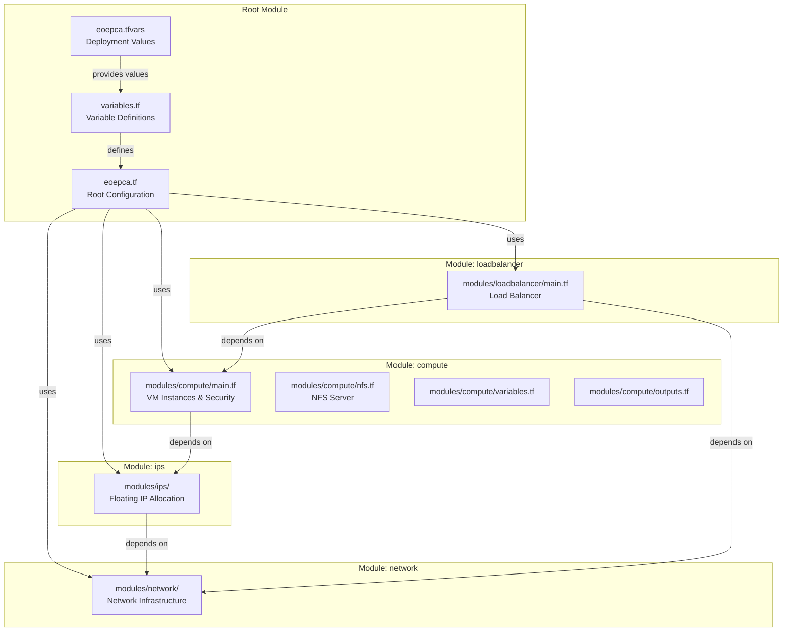

**Sources:** [creodias/eoepca.tf:1-146](), [creodias/.terraform/modules/modules.json:1]()

## Infrastructure Components

### Virtual Machine Types

The Terraform configuration provisions multiple categories of VMs with specific roles:

| VM Type | Resource Name | Count Variable | Purpose |
|---------|---------------|----------------|---------|
| Bastion | `openstack_compute_instance_v2.bastion` | `number_of_bastions` | SSH gateway to cluster |
| K8s Master | `openstack_compute_instance_v2.k8s_master_no_floating_ip` | `number_of_k8s_masters_no_floating_ip` | Control plane nodes |
| K8s Workers | `openstack_compute_instance_v2.k8s_node_no_floating_ip` | `number_of_k8s_nodes_no_floating_ip` | Worker nodes |
| ETCD | `openstack_compute_instance_v2.etcd` | `number_of_etcd` | Dedicated etcd nodes |
| NFS Server | `openstack_compute_instance_v2.eoepca_nfs` | 1 | Shared storage |
| GlusterFS | `openstack_compute_instance_v2.glusterfs_node_no_floating_ip` | `number_of_gfs_nodes_no_floating_ip` | Distributed storage (optional) |

**Sources:** [creodias/modules/compute/main.tf:116-437](), [creodias/modules/compute/nfs.tf:1-70]()

### Deployment Topology Diagram

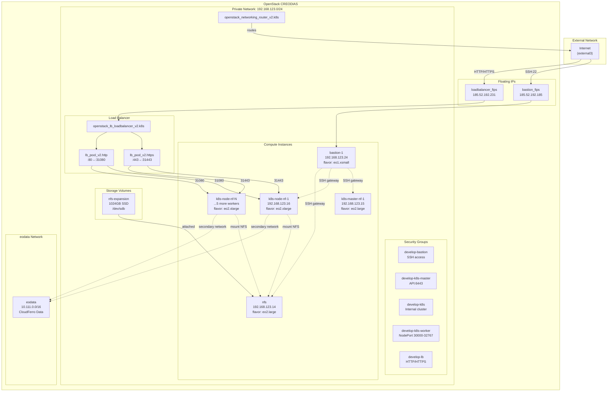

**Sources:** [creodias/terraform.tfstate:96-1100](), [creodias/eoepca.tfvars:1-57](), [creodias/README.md:76-97]()

## Module: Network

The network module creates the private network infrastructure for the cluster:

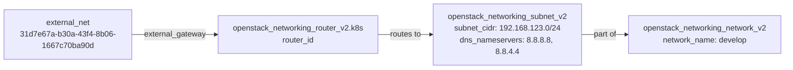

**Configuration:**
- Network name is set via `cluster_name` variable
- Subnet CIDR configurable in [eoepca.tfvars:10]()
- DNS nameservers configurable in [eoepca.tfvars:11]()
- Router provides NAT to external network

**Sources:** [creodias/eoepca.tf:6-16](), [creodias/eoepca.tfvars:6-11]()

## Module: IPs

The IPs module allocates floating IPs from the external pool for public-facing resources:

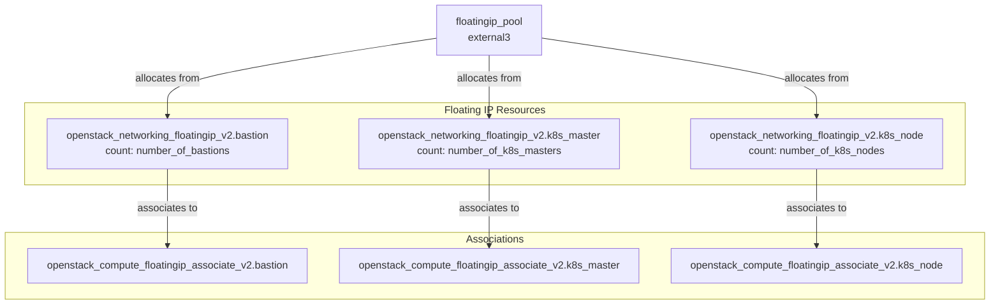

**Typical Deployment:**
- Bastion: 1 floating IP (`number_of_bastions = 1`)
- Masters: 0 floating IPs (uses `number_of_k8s_masters_no_floating_ip` instead)
- Workers: 0 floating IPs (uses `number_of_k8s_nodes_no_floating_ip` instead)
- Load Balancer: 1 floating IP (created in loadbalancer module)

**Sources:** [creodias/eoepca.tf:18-29](), [creodias/eoepca.tfvars:18-33]()

## Module: Compute

The compute module creates all VM instances and security infrastructure.

### Security Groups

Security groups control network access to VMs:

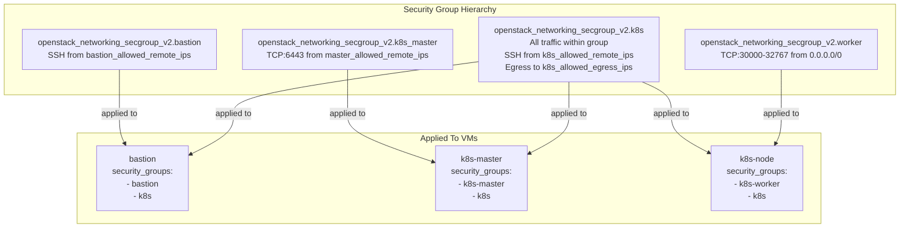

**Security Group Resources:**
- `openstack_networking_secgroup_v2.bastion` - [creodias/modules/compute/main.tf:31-36]()
- `openstack_networking_secgroup_v2.k8s_master` - [creodias/modules/compute/main.tf:14-18]()
- `openstack_networking_secgroup_v2.k8s` - [creodias/modules/compute/main.tf:49-53]()
- `openstack_networking_secgroup_v2.worker` - [creodias/modules/compute/main.tf:81-85]()

**Sources:** [creodias/modules/compute/main.tf:14-96]()

### Compute Instance Creation

VM instances are created with metadata for Kubespray configuration:

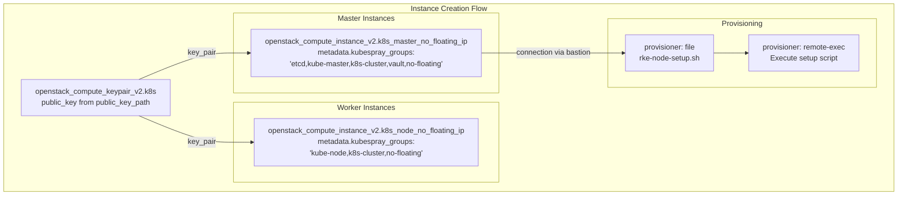

**Key Instance Attributes:**
- `image_name` - OS image (default: "Ubuntu 18.04 LTS")
- `flavor_id` - VM size (e.g., "eo2.large" for masters, "eo2.xlarge" for workers)
- `key_pair` - SSH key for access
- `network.name` - Attached to private network
- `security_groups` - List of security groups
- `metadata.kubespray_groups` - Used by RKE for node role assignment

**Sources:** [creodias/modules/compute/main.tf:384-437](), [creodias/eoepca.tfvars:39-47]()

### NFS Server Provisioning

The NFS server provides shared persistent storage for the cluster:

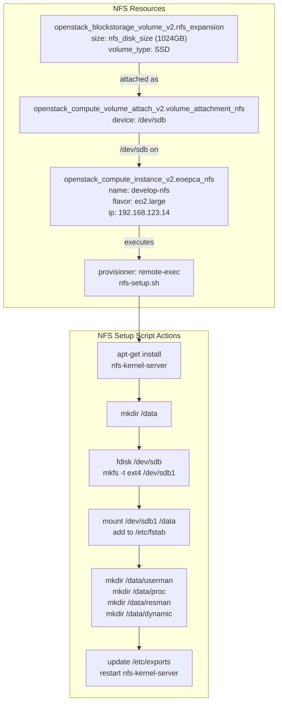

**NFS Export Directories:**
- `/data/userman` - User management data
- `/data/proc` - Processing data
- `/data/resman` - Resource management data
- `/data/dynamic` - Dynamic workspace data

**Export Configuration:**
- All exports use `*(rw,no_root_squash,no_subtree_check)`
- Accessible from all cluster nodes

**Sources:** [creodias/modules/compute/nfs.tf:1-70](), [creodias/modules/compute/nfs-setup.sh:1-44](), [creodias/eoepca.tfvars:56]()

## Module: Load Balancer

The load balancer module creates an OpenStack Octavia load balancer to route external traffic:

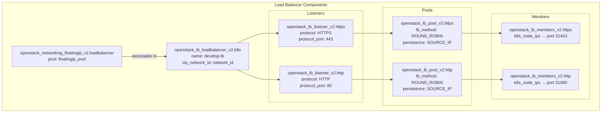

**Load Balancer Forwarding:**
- External HTTPS (443) → NodePort 31443 on all worker nodes
- External HTTP (80) → NodePort 31080 on all worker nodes
- Connects to `k8s_node_ips`, `k8s_node_hm_ips`, and `k8s_node_ws_ips`

**Security:**
- Load balancer uses security groups `develop-lb` and `develop-k8s`
- Allows ingress on ports 80 and 443
- Egress to all destinations (IPv4 and IPv6)

**Sources:** [creodias/modules/loadbalancer/main.tf:1-184](), [creodias/eoepca.tf:83-93]()

## Deployment Configuration

### Variable Configuration File

The [eoepca.tfvars]() file contains deployment-specific values:

| Variable | Purpose | Default Value |
|----------|---------|---------------|
| `cluster_name` | Deployment identifier | `"develop"` |
| `external_net` | OpenStack external network UUID | `"31d7e67a-b30a-43f4-8b06-1667c70ba90d"` |
| `subnet_cidr` | Internal network CIDR | `"192.168.123.0/24"` |
| `number_of_bastions` | Bastion host count | `1` |
| `number_of_k8s_masters_no_floating_ip` | Master count | `1` |
| `number_of_k8s_nodes_no_floating_ip` | Worker count | `6` |
| `flavor_bastion` | Bastion VM flavor | `"14"` (eo1.xsmall) |
| `flavor_k8s_master` | Master VM flavor | `"20"` (eo2.large) |
| `flavor_k8s_node` | Worker VM flavor | `"21"` (eo2.xlarge) |
| `image` | OS image name | `"Ubuntu 18.04 LTS"` |
| `nfs_disk_size` | NFS volume size in GB | `1024` |

**Sources:** [creodias/eoepca.tfvars:1-57](), [creodias/variables.tf:1-233]()

### OpenStack Authentication

Terraform uses the OpenStack client for authentication. Configuration is loaded from `clouds.yaml`:

**Example clouds.yaml:**
```yaml
clouds:
  eoepca:
    auth:
      auth_url: https://cf2.cloudferro.com:5000/v3
      username: "user@example.com"
      project_name: "eoepca"
      project_id: d86660d4a1a443579c71096771a8104c
      user_domain_name: "cloud_xxxxx"
      password: "password"
    region_name: "RegionOne"
    interface: "public"
    identity_api_version: 3
```

**Location:** Must be placed in one of:
- `./clouds.yaml` (current directory)
- `$HOME/.config/openstack/clouds.yaml`
- `/etc/openstack/clouds.yaml`

**Sources:** [creodias/README.md:29-53]()

## Deployment Process

### Deployment Script Flow

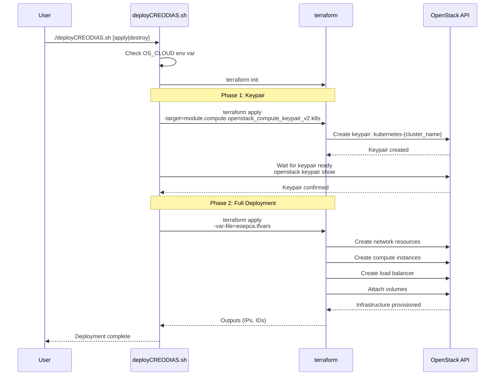

**Deployment Steps:**
1. Set `OS_CLOUD` environment variable to match `clouds.yaml` project
2. Run [deployCREODIAS.sh]():
   ```bash
   cd creodias
   export OS_CLOUD=eoepca
   ./deployCREODIAS.sh apply
   ```
3. Terraform creates keypair first, then remaining resources
4. Script waits for keypair availability before proceeding
5. Full deployment completes with all VMs, network, and storage

**Sources:** [creodias/deployCREODIAS.sh:1-52](), [creodias/README.md:58-68]()

## Terraform Outputs

The Terraform configuration produces outputs used by subsequent deployment steps:

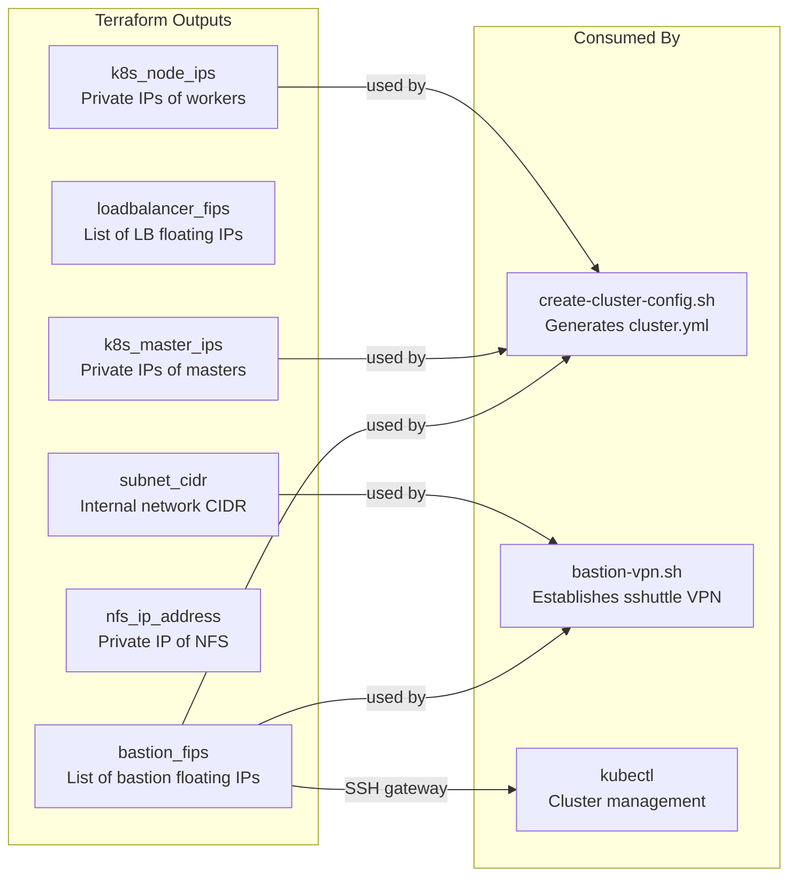

**Output Commands:**
```bash
# View all outputs as JSON
terraform output -json

# View specific output
terraform output bastion_fips
```

**Output Usage Examples:**

From [create-cluster-config.sh:21-45]():
```bash
# Extract master nodes from terraform state
master_nodes=$(terraform output -state=../creodias/terraform.tfstate -json | \
  jq -r '.k8s_master_ips.value[]')

# Extract worker nodes from terraform state  
worker_nodes=$(terraform output -state=../creodias/terraform.tfstate -json | \
  jq -r '.k8s_node_ips.value[]')

# Extract bastion IP from terraform state
bastion=$(terraform output -state=../creodias/terraform.tfstate -json | \
  jq -r '.bastion_fips.value[]')
```

**Sources:** [creodias/eoepca.tf:95-146](), [creodias/modules/compute/outputs.tf:1-20](), [kubernetes/create-cluster-config.sh:20-80]()

## Provider Configuration

The Terraform configuration uses the OpenStack provider with Octavia support:

```hcl
provider "openstack" {
  version     = "~> 1.17"
  use_octavia = true
}
```

**Provider Features:**
- Version constraint: `~> 1.17` (1.17.x)
- `use_octavia = true` - Uses Octavia for load balancer resources
- Authentication via OpenStack client (`clouds.yaml`)

**Sources:** [creodias/eoepca.tf:1-4]()

## Instance Provisioning with Remote Execution

Master and worker nodes execute provisioning scripts via SSH through the bastion host:

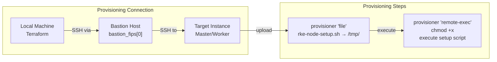

**Connection Configuration:**
```hcl
connection {
  type         = "ssh"
  user         = "${var.ssh_user}"
  private_key  = "${chomp(file(trimsuffix(var.public_key_path, ".pub")))}"
  host         = "${self.access_ip_v4}"
  bastion_host = var.bastion_fips[0]
}
```

**Provisioning Actions:**
- Uploads `rke-node-setup.sh` to `/tmp/`
- Makes script executable
- Executes script to configure Docker and user permissions for RKE

**Sources:** [creodias/modules/compute/main.tf:418-436]()

## State Management

Terraform state is stored in local state files:

| File | Purpose |
|------|---------|
| `terraform.tfstate` | Current infrastructure state |
| `terraform.tfstate.backup` | Previous state backup |

**State Contents:**
- All resource IDs and attributes
- Resource dependencies
- Output values
- Provider configurations

**State Format:** JSON with versioning (format version 4, Terraform 0.12.29)

**Important:** State files contain sensitive data and should not be committed to version control.

**Sources:** [creodias/terraform.tfstate:1-10](), [creodias/terraform.tfstate.backup:1-10]()

## Next Steps

After Terraform provisioning completes:

1. **Create Kubernetes Cluster Configuration:**
   ```bash
   cd kubernetes
   ./create-cluster-config.sh develop cluster.yml
   ```
   This generates `cluster.yml` for RKE using Terraform outputs.

2. **Establish Bastion VPN:**
   ```bash
   ../bin/bastion-vpn.sh
   ```
   Creates sshuttle VPN for cluster access.

3. **Deploy Kubernetes:** See [Kubernetes Cluster Setup](#8.1) for RKE deployment steps.

**Sources:** [creodias/README.md:126-128](), [kubernetes/create-cluster-config.sh:1-117]()