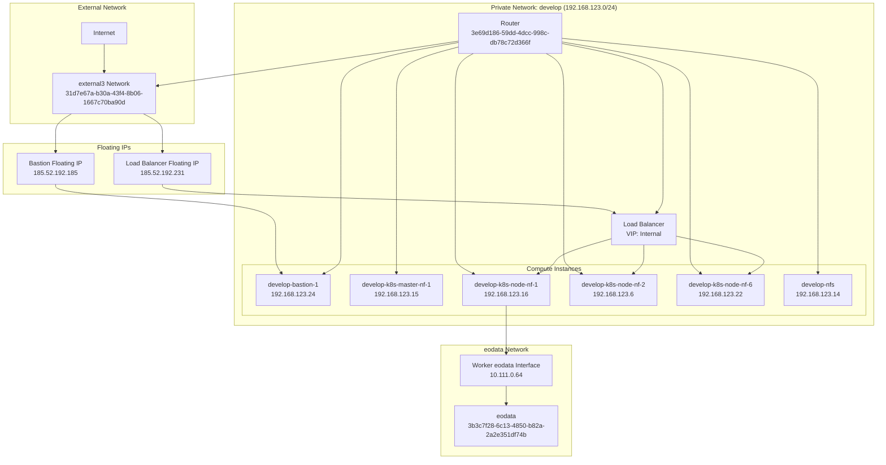
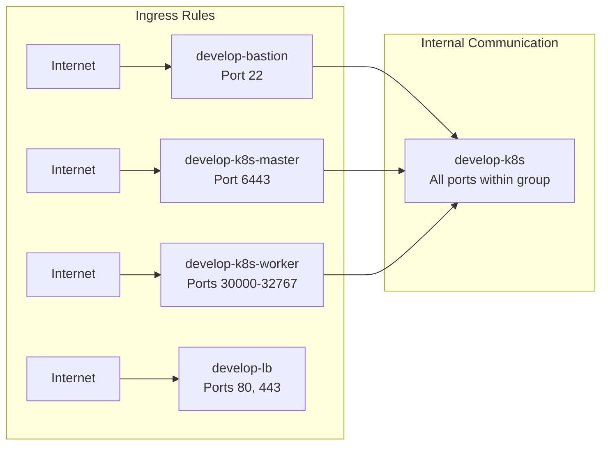
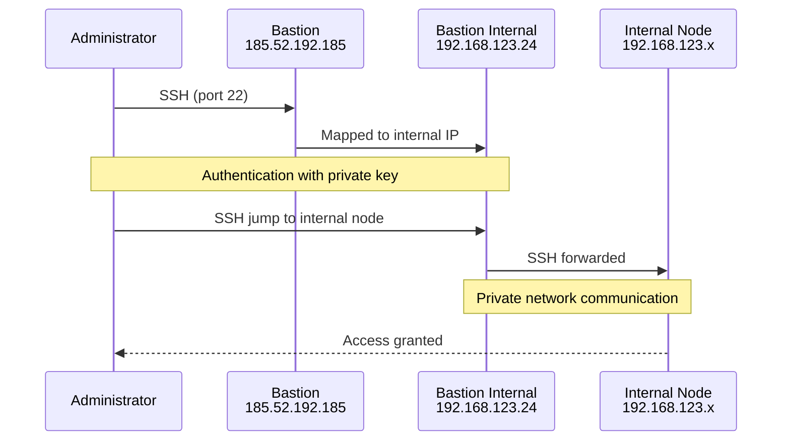
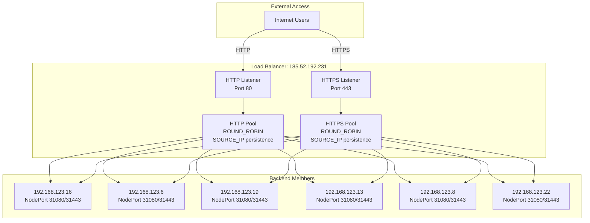
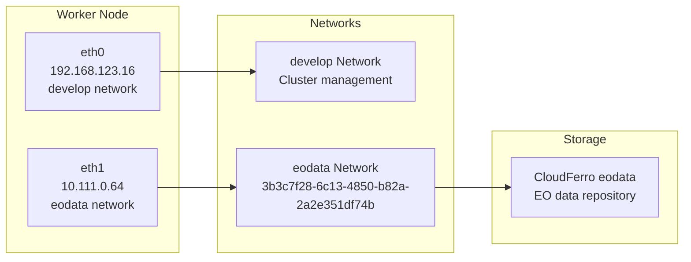
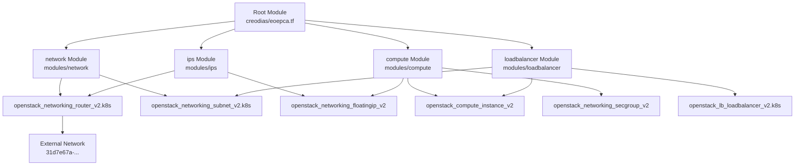

# Network Architecture

<details>
<summary>Relevant source files</summary>

The following files were used as context for generating this wiki page:

- [bin/install-kubeseal.sh](bin/install-kubeseal.sh)
- [bin/install-rke.sh](bin/install-rke.sh)
- [creodias/.gitignore](creodias/.gitignore)
- [creodias/.terraform/modules/modules.json](creodias/.terraform/modules/modules.json)
- [creodias/README.md](creodias/README.md)
- [creodias/deployCREODIAS.sh](creodias/deployCREODIAS.sh)
- [creodias/eoepca.tf](creodias/eoepca.tf)
- [creodias/eoepca.tfvars](creodias/eoepca.tfvars)
- [creodias/modules/compute/main.tf](creodias/modules/compute/main.tf)
- [creodias/modules/compute/nfs-setup.sh](creodias/modules/compute/nfs-setup.sh)
- [creodias/modules/compute/nfs.tf](creodias/modules/compute/nfs.tf)
- [creodias/modules/compute/outputs.tf](creodias/modules/compute/outputs.tf)
- [creodias/modules/compute/variables.tf](creodias/modules/compute/variables.tf)
- [creodias/modules/loadbalancer/main.tf](creodias/modules/loadbalancer/main.tf)
- [creodias/terraform.tfstate](creodias/terraform.tfstate)
- [creodias/terraform.tfstate.backup](creodias/terraform.tfstate.backup)
- [creodias/variables.tf](creodias/variables.tf)
- [kubernetes/cluster.7z](kubernetes/cluster.7z)
- [kubernetes/create-cluster-config.sh](kubernetes/create-cluster-config.sh)

</details>


## Purpose and Scope

This document describes the network topology, security groups, and access patterns for the EOEPCA deployment on OpenStack (CREODIAS). It covers the private network design, bastion host configuration, load balancer setup, and security group rules that control traffic flow within the Kubernetes cluster infrastructure.

For information about provisioning this network infrastructure using Terraform, see [Terraform Infrastructure as Code](#8.2). For details on setting up the Kubernetes cluster that runs within this network, see [Kubernetes Cluster Setup](#8.1).

## Network Topology Overview

The EOEPCA deployment creates an isolated private network with controlled external access through a bastion host and load balancer. The following diagram illustrates the high-level network architecture:



**Network Topology Diagram**

The deployment consists of:
- **Private Network**: An isolated internal network (`192.168.123.0/24`) for cluster communication
- **Router**: Connects the private network to the external network with NAT
- **Bastion Host**: Single SSH entry point with a floating IP for administrative access
- **Load Balancer**: Provides public HTTP/HTTPS access with a floating IP
- **eodata Network**: Separate network providing access to Earth Observation data storage

**Sources:** [creodias/terraform.tfstate:1-95](), [creodias/eoepca.tfvars:1-57](), [creodias/modules/network/main.tf]()

## Security Groups

The network security is enforced through OpenStack security groups that control ingress and egress traffic. The following table describes each security group and its purpose:

| Security Group | Purpose | Key Rules |
|----------------|---------|-----------|
| `develop-bastion` | Protects bastion host | SSH (port 22) from allowed remote IPs |
| `develop-k8s-master` | Protects Kubernetes control plane | API server (port 6443) from allowed remote IPs |
| `develop-k8s` | General cluster communication | All traffic between instances in the same group |
| `develop-k8s-worker` | Protects worker nodes | NodePort range (30000-32767) from internet |
| `develop-lb` | Protects load balancer | HTTP (80) and HTTPS (443) from internet |

### Security Group Details



**Security Group Rules Diagram**

The `develop-k8s` security group allows unrestricted communication between all cluster members, facilitating Kubernetes networking requirements. Each instance is assigned multiple security groups to create layered security.

**Sources:** [creodias/modules/compute/main.tf:14-96](), [creodias/terraform.tfstate:410-413](), [creodias/modules/loadbalancer/main.tf:2-36]()

## IP Address Allocation

The following table documents the IP address assignments within the deployment:

| Resource Type | Hostname | Internal IP | Floating IP | Network Interface |
|---------------|----------|-------------|-------------|-------------------|
| Bastion | `develop-bastion-1` | 192.168.123.24 | 185.52.192.185 | develop |
| Master | `develop-k8s-master-nf-1` | 192.168.123.15 | - | develop |
| Worker Node 1 | `develop-k8s-node-nf-1` | 192.168.123.16 | - | develop + eodata |
| Worker Node 2 | `develop-k8s-node-nf-2` | 192.168.123.6 | - | develop + eodata |
| Worker Node 3 | `develop-k8s-node-nf-3` | 192.168.123.19 | - | develop + eodata |
| Worker Node 4 | `develop-k8s-node-nf-4` | 192.168.123.13 | - | develop + eodata |
| Worker Node 5 | `develop-k8s-node-nf-5` | 192.168.123.8 | - | develop + eodata |
| Worker Node 6 | `develop-k8s-node-nf-6` | 192.168.123.22 | - | develop + eodata |
| NFS Server | `develop-nfs` | 192.168.123.14 | - | develop |
| Load Balancer | `develop-lb` | VIP (internal) | 185.52.192.231 | develop |

### Subnet Configuration

The private subnet `192.168.123.0/24` provides 254 usable IP addresses for cluster resources. DNS resolution is provided by Google public DNS servers (`8.8.8.8`, `8.8.4.4`).

**Sources:** [creodias/terraform.tfstate:6-94](), [creodias/eoepca.tfvars:6-11]()

## Bastion Host Access Pattern

The bastion host serves as the sole SSH entry point to the cluster, implementing a security best practice that limits attack surface. Administrative access to internal nodes must route through the bastion.



**Bastion SSH Access Flow**

### Direct SSH Access

Access to internal nodes using SSH jump host syntax:

```bash
ssh -J eouser@185.52.192.185 eouser@192.168.123.15
```

The `-J` flag establishes a jump connection through the bastion to reach the internal node.

### VPN Access via sshuttle

For persistent administrative access, a VPN tunnel can be established using `sshuttle`:

```bash
sshuttle -r eouser@185.52.192.185 192.168.123.0/24
```

This command creates a transparent VPN that routes all traffic for the `192.168.123.0/24` subnet through the bastion host, enabling direct access to cluster services via their internal IPs.

The helper script `bastion-vpn.sh` automates this process by extracting connection parameters from Terraform state.

**Sources:** [creodias/README.md:98-120](), [bin/bastion-vpn.sh](), [creodias/terraform.tfstate:7-10]()

## Load Balancer Configuration

The load balancer provides external HTTP and HTTPS access to services running in the Kubernetes cluster. It is implemented using OpenStack Octavia (LBaaS v2).



**Load Balancer Architecture Diagram**

### Load Balancer Resources

The load balancer is created by the Terraform module at [creodias/modules/loadbalancer/main.tf:38-45]() and consists of:

- **LoadBalancer**: `openstack_lb_loadbalancer_v2.k8s` attached to the internal network
- **HTTP Listener**: `openstack_lb_listener_v2.http` on port 80
- **HTTPS Listener**: `openstack_lb_listener_v2.https` on port 443
- **Backend Pools**: `openstack_lb_pool_v2.http` and `openstack_lb_pool_v2.https` with `ROUND_ROBIN` algorithm
- **Session Persistence**: `SOURCE_IP` based to maintain client sessions
- **Backend Members**: All worker nodes added via `openstack_lb_members_v2` resources

### Port Mapping

The load balancer forwards traffic to Kubernetes Ingress Controller NodePorts:

| External Port | Internal NodePort | Protocol |
|---------------|-------------------|----------|
| 80 | 31080 | HTTP |
| 443 | 31443 | HTTPS |

This mapping is defined in [creodias/modules/loadbalancer/main.tf:95-151]() where each worker node is configured as a backend member.

**Sources:** [creodias/modules/loadbalancer/main.tf:38-183](), [creodias/README.md:89-92](), [creodias/terraform.tfstate:68-77]()

## Data Access Networks

### eodata Network

Worker nodes are connected to a secondary network called `eodata` which provides access to CloudFerro's Earth Observation data repository. This network is separate from the cluster management network.



**Worker Node Network Interfaces**

Worker nodes are configured with dual network interfaces:
- Primary interface on the `develop` network for cluster communication
- Secondary interface on the `eodata` network for data access

This configuration is specified in the Terraform variables at [creodias/eoepca.tfvars:9]() and implemented in the compute module.

**Sources:** [creodias/terraform.tfstate:768-777](), [creodias/eoepca.tfvars:9](), [creodias/modules/compute/main.tf:777-786]()

### NFS Network Setup

The NFS server provides shared persistent storage for the Kubernetes cluster. It is attached to an additional block storage volume and exports NFS shares over the private network.

The NFS instance is created by [creodias/modules/compute/nfs.tf:1-45]() and includes:
- **Instance**: `openstack_compute_instance_v2.eoepca_nfs` with flavor `eo2.large`
- **Block Volume**: `openstack_blockstorage_volume_v2.nfs_expansion` providing additional SSD storage
- **Volume Attachment**: Mounted at `/dev/sdb` and formatted as ext4
- **Export Path**: `/data` with subdirectories for different services

The NFS setup script at [creodias/modules/compute/nfs-setup.sh:1-44]() configures:
- NFS kernel server installation
- Partition creation and formatting on the attached volume
- Export directories: `userman`, `proc`, `resman`, `dynamic`
- NFS exports with `rw,no_root_squash,no_subtree_check` options

All cluster nodes can mount NFS shares from `192.168.123.14:/data/<subdirectory>` over the private network.

**Sources:** [creodias/modules/compute/nfs.tf:1-70](), [creodias/modules/compute/nfs-setup.sh:1-44](), [creodias/eoepca.tfvars:56](), [creodias/terraform.tfstate:222-258]()

## Network Provisioning Workflow

The network infrastructure is provisioned using Terraform modules with the following component relationships:



**Terraform Module Dependencies**

The provisioning sequence follows these dependencies:
1. Network module creates the router and subnet
2. IPs module allocates floating IPs with dependency on router
3. Compute module creates instances and security groups
4. LoadBalancer module creates the load balancer with backend members

The deployment is initiated by [creodias/deployCREODIAS.sh:1-52]() which first provisions the SSH keypair, then deploys all other resources.

**Sources:** [creodias/eoepca.tf:1-146](), [creodias/deployCREODIAS.sh:1-52](), [creodias/modules/modules.json:1]()

## Network Configuration Files

The network architecture is defined through several key configuration files:

| File | Purpose | Key Configuration |
|------|---------|-------------------|
| `creodias/eoepca.tfvars` | Deployment parameters | Subnet CIDR, network names, instance counts |
| `creodias/eoepca.tf` | Root Terraform module | Module composition and outputs |
| `creodias/variables.tf` | Variable definitions | Network configuration variables |
| `modules/network/main.tf` | Network resources | Router, subnet, port creation |
| `modules/ips/main.tf` | Floating IP allocation | Bastion and worker floating IPs |
| `modules/compute/main.tf` | Security groups | Security group rules definition |
| `modules/loadbalancer/main.tf` | Load balancer | Listener, pool, member configuration |

The Terraform state is persisted in [creodias/terraform.tfstate]() which records all provisioned resource IDs and IP addresses for subsequent operations.

**Sources:** [creodias/eoepca.tfvars:1-57](), [creodias/eoepca.tf:1-146](), [creodias/variables.tf:1-233]()