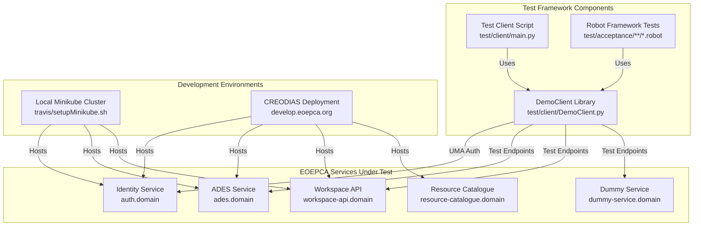
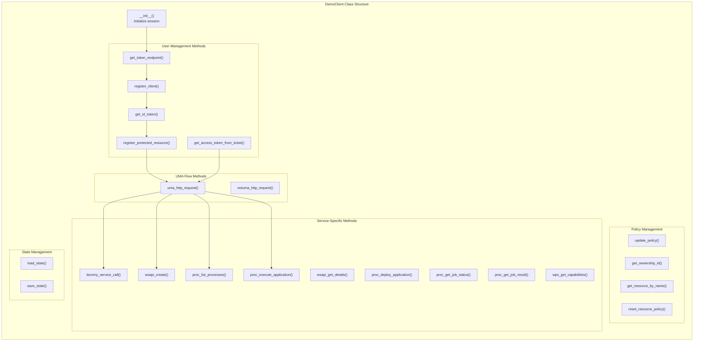
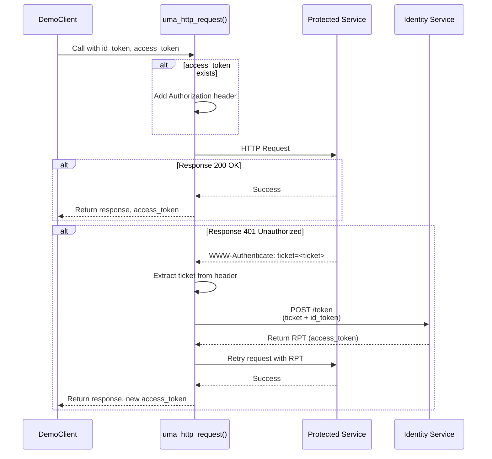
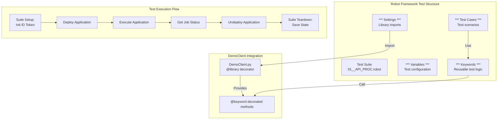

# Development and Testing

<details>
<summary>Relevant source files</summary>

The following files were used as context for generating this wiki page:

- [test/acceptance/02__Processing/01__ADES/01__API_PROC.robot](test/acceptance/02__Processing/01__ADES/01__API_PROC.robot)
- [test/acceptance/02__Processing/01__ADES/02__WPS.robot](test/acceptance/02__Processing/01__ADES/02__WPS.robot)
- [test/acceptance/__init__.robot](test/acceptance/__init__.robot)
- [test/client/.gitignore](test/client/.gitignore)
- [test/client/DemoClient.py](test/client/DemoClient.py)
- [test/client/debug/jwt-output-by-pep.json](test/client/debug/jwt-output-by-pep.json)
- [test/client/main.py](test/client/main.py)
- [test/client/requirements.txt](test/client/requirements.txt)
- [test/client/setup.sh](test/client/setup.sh)
- [travis/acceptanceTest.sh](travis/acceptanceTest.sh)
- [travis/setupMinikube.sh](travis/setupMinikube.sh)
- [travis/setupRobot.sh](travis/setupRobot.sh)

</details>


## Purpose and Scope

This document covers the development tools, test frameworks, and local development environments available for testing EOEPCA services. It provides technical guidance for developers who need to:

- Interact with EOEPCA services programmatically using the DemoClient library
- Run automated acceptance tests using Robot Framework
- Set up local development environments using Minikube
- Validate deployments and debug service interactions

For detailed information on specific testing subsystems, see:
- DemoClient library implementation: [DemoClient Library](#9.1)
- Robot Framework acceptance tests: [Acceptance Testing Framework](#9.2)
- Local development setup: [Local Development with Minikube](#9.3)

For deployment validation procedures, see [Testing and Validation](#2.3).

**Sources:** [test/client/main.py:1-225](), [test/client/DemoClient.py:1-683](), [test/acceptance/__init__.robot:1-22]()

---

## Testing Architecture Overview

The EOEPCA testing framework consists of three primary components:

| Component | Technology | Purpose |
|-----------|-----------|---------|
| **DemoClient** | Python library | Programmatic client for UMA authentication and service interaction |
| **Robot Framework Tests** | Robot Framework + Python | Automated acceptance tests for all EOEPCA services |
| **Local Dev Environment** | Minikube/k3s | Kubernetes environment for local testing and development |



**Testing Components Diagram**

**Sources:** [test/client/DemoClient.py:14-33](), [test/client/main.py:7-33](), [test/acceptance/__init__.robot:1-22]()

---

## DemoClient Library Overview

The `DemoClient` class provides a comprehensive Python library for interacting with EOEPCA services, handling UMA authentication flows, and managing client state.

### Core Capabilities



**DemoClient Method Architecture**

**Sources:** [test/client/DemoClient.py:14-683]()

### Key Class Attributes

| Attribute | Type | Purpose |
|-----------|------|---------|
| `base_url` | str | Base URL for identity service (e.g., `https://auth.domain`) |
| `session` | requests.Session | HTTP session with SSL verification disabled |
| `token_endpoint` | str | OAuth2/UMA token endpoint URL |
| `scim_client` | EOEPCA_Scim | SCIM client for OIDC registration |
| `state` | dict | Persisted state (client_id, client_secret, resource_ids) |
| `trace_flow` | bool | Enable UMA flow debugging output |
| `trace_requests` | bool | Enable HTTP request logging |

**Sources:** [test/client/DemoClient.py:21-33]()

### UMA Authentication Flow Implementation

The `uma_http_request` method implements the complete UMA flow:



**UMA Flow Implementation in DemoClient**

**Sources:** [test/client/DemoClient.py:239-291]()

### Service Interaction Methods

The DemoClient provides keyword-decorated methods for Robot Framework integration:

| Method | Decorator | Service | Purpose |
|--------|-----------|---------|---------|
| `get_id_token()` | `@keyword` | Identity Service | Obtain user ID token via password grant |
| `register_protected_resource()` | `@keyword` | PEP Resource API | Register resource path with ownership |
| `wsapi_create()` | `@keyword` | Workspace API | Create user workspace |
| `wsapi_get_details()` | `@keyword` | Workspace API | Get workspace details |
| `proc_list_processes()` | `@keyword` | ADES | List deployed applications |
| `proc_deploy_application()` | `@keyword` | ADES | Deploy CWL application |
| `proc_execute_application()` | `@keyword` | ADES | Execute application job |
| `proc_poll_job_completion()` | `@keyword` | ADES | Poll job status until completion |
| `proc_get_job_result()` | `@keyword` | ADES | Get STAC catalog result |
| `wps_get_capabilities()` | `@keyword` | ADES WPS | Get WPS capabilities document |

**Sources:** [test/client/DemoClient.py:113-536]()

---

## Robot Framework Integration

The DemoClient is decorated with Robot Framework keywords, enabling declarative test syntax:



**Robot Framework and DemoClient Integration**

**Sources:** [test/acceptance/02__Processing/01__ADES/01__API_PROC.robot:1-124](), [test/client/DemoClient.py:12-14]()

### Example Robot Test Structure

The ADES API test suite demonstrates the Robot Framework pattern:

```
*** Settings ***
Documentation  Tests for the ADES OGC API Processes endpoint
Library  ../../../client/DemoClient.py  ${UM_BASE_URL}

*** Variables ***
${USERNAME}=  ${USER_A_NAME}
${ADES_WORKSPACE}=  ${USERNAME}
${API_PROC_SERVICE_URL}=  ${ADES_BASE_URL}${API_PROC_PATH_PREFIX}

*** Test Cases ***
Deploy Application
  Deploy Application  ${CURDIR}${/}data/app-deploy-body-cwl.json
  Sleep  5  Waiting for process deploy process to complete
  Process Is Deployed  ${PROCESS_NAME}

Execute Application
  Execute Application Success  ${PROCESS_NAME}  ${CURDIR}${/}data/app-execute-body.json

*** Keywords ***
Deploy Application
  [Arguments]  ${app_filename}
  ${resp}  ${access_token} =  Proc Deploy App  ${API_PROC_SERVICE_URL}  ${app_filename}  ${ID_TOKEN}  ${ACCESS_TOKEN}
  Should Be Equal As Integers  201  ${resp.status_code}
```

**Sources:** [test/acceptance/02__Processing/01__ADES/01__API_PROC.robot:1-124]()

---

## Test Client Execution Pattern

The `main.py` script demonstrates the complete testing workflow:

```mermaid
graph TB
    Start["Start Test Client<br/>main.py:main()"]
    
    subgraph "1. Initialize Client"
        InitClient["Create DemoClient instance<br/>base_url = https://auth.domain"]
        LoadState["Load state.json<br/>(reuse client credentials)"]
    end
    
    subgraph "2. User Management Setup"
        GetToken["Get token endpoint<br/>/.well-known/uma2-configuration"]
        RegisterClient["Register OAuth2 client<br/>(via SCIM)"]
        GetIDToken["Get user ID token<br/>(password grant)"]
        RegisterResources["Register protected resources<br/>(ADES, Workspace paths)"]
    end
    
    subgraph "3. Workspace Operations"
        CreateWorkspace["Create workspace<br/>POST /workspaces"]
        GetWorkspaceDetails["Get workspace details<br/>GET /workspaces/{user}"]
        TestAccessControl["Test access as different user<br/>(should fail)"]
    end
    
    subgraph "4. Processing Operations"
        ListProcesses["List processes<br/>GET /wps3/processes"]
        DeployApp["Deploy application<br/>POST /wps3/processes"]
        GetAppDetails["Get app details<br/>GET /wps3/processes/{app}"]
        ExecuteApp["Execute application<br/>POST /wps3/processes/{app}/execution"]
        PollStatus["Poll job status<br/>GET /wps3/jobs/{job}"]
        GetResult["Get job result<br/>GET /wps3/jobs/{job}/results"]
        UndeployApp["Undeploy application<br/>DELETE /wps3/processes/{app}"]
    end
    
    subgraph "5. WPS Operations"
        WPSCaps["Get WPS capabilities<br/>GET /zoo?request=GetCapabilities"]
    end
    
    SaveState["Save state.json<br/>(persist tokens, resources)"]
    
    Start --> InitClient
    InitClient --> LoadState
    LoadState --> GetToken
    GetToken --> RegisterClient
    RegisterClient --> GetIDToken
    GetIDToken --> RegisterResources
    
    RegisterResources --> CreateWorkspace
    CreateWorkspace --> GetWorkspaceDetails
    GetWorkspaceDetails --> TestAccessControl
    
    TestAccessControl --> ListProcesses
    ListProcesses --> DeployApp
    DeployApp --> GetAppDetails
    GetAppDetails --> ExecuteApp
    ExecuteApp --> PollStatus
    PollStatus --> GetResult
    GetResult --> UndeployApp
    
    UndeployApp --> WPSCaps
    WPSCaps --> SaveState
```



**Test Client Execution Flow**

**Sources:** [test/client/main.py:7-224]()

### Test Client Configuration

The test client is configured at the top of `main.py`:

| Configuration | Default Value | Purpose |
|--------------|---------------|---------|
| `USER_NAME` | `"eric"` | Test user for authentication |
| `USER_PASSWORD` | `"defaultPWD"` | Test user password |
| `domain` | `"develop.eoepca.org"` | Target deployment domain |
| `base_url` | `"https://auth.{domain}"` | Identity service base URL |
| `ades_url` | `"https://ades.{domain}"` | ADES service URL |
| `wsapi_url` | `"https://workspace-api.{domain}"` | Workspace API URL |

**Sources:** [test/client/main.py:9-28]()

---

## State Persistence

The DemoClient maintains persistent state in `state.json` to avoid repeated client registration:

```json
{
  "client_id": "963e4c2a-9924-4c4d-b999-bebe79c96a5e",
  "client_secret": "<secret>",
  "resources": {
    "http://ades-pepapi.domain": {
      "/eric": "6c58a5e5-95b7-44ca-ab49-b1192e0db198"
    },
    "http://workspace-api-pepapi.domain": {
      "/workspaces/develop-user-eric": "b7cade5c-372f-4c87-be82-a795649e8729"
    }
  }
}
```

The state management methods:
- `load_state()` - Called in `__init__`, loads from `state.json` if it exists
- `save_state()` - Persists current state to `state.json`

**Sources:** [test/client/DemoClient.py:35-55](), [test/client/.gitignore:4]()

---

## Local Development Environment Setup

### Minikube Installation and Configuration

The `setupMinikube.sh` script provisions a local Kubernetes cluster:

```mermaid
graph TB
    Start["Start Setup<br/>setupMinikube.sh"]
    
    subgraph "1. Install Components"
        InstallKubectl["Install kubectl v1.13.0"]
        InstallMinikube["Install minikube v1.12.1"]
        InstallHelm["Install Helm 3"]
    end
    
    subgraph "2. Cluster Setup"
        MountRoot["Mount root as rshared<br/>(fix kube-dns)"]
        DeleteCluster["Delete existing cluster<br/>minikube delete --purge"]
        StartCluster["Start minikube<br/>--vm-driver=none<br/>--kubernetes-version=v1.13.0"]
        EnableIngress["Enable ingress addon<br/>minikube addons enable ingress"]
        UpdateContext["Update kubectl context"]
    end
    
    subgraph "3. Wait for Ready"
        WaitNodes["Wait for nodes Ready=True"]
        ShowInfo["kubectl cluster-info"]
    end
    
    subgraph "4. Configure Access"
        FixPerms["Fix permissions<br/>chmod ~/.kube, ~/.minikube"]
        ChownFiles["chown to user"]
    end
    
    subgraph "5. Install Tools"
        InstallJQ["apt-get install jq"]
        InstallConntrack["apt-get install conntrack"]
        InstallSocat["apt-get install socat"]
        InstallPython["apt-get install python3-venv"]
    end
    
    subgraph "6. Create Paths"
        CreateDataPath["mkdir -p /data/config/db"]
    end
    
    Start --> InstallKubectl
    InstallKubectl --> InstallMinikube
    InstallMinikube --> InstallHelm
    
    InstallHelm --> MountRoot
    MountRoot --> DeleteCluster
    DeleteCluster --> StartCluster
    StartCluster --> EnableIngress
    EnableIngress --> UpdateContext
    
    UpdateContext --> WaitNodes
    WaitNodes --> ShowInfo
    
    ShowInfo --> FixPerms
    FixPerms --> ChownFiles
    
    ChownFiles --> InstallJQ
    InstallJQ --> InstallConntrack
    InstallConntrack --> InstallSocat
    InstallSocat --> InstallPython
    
    InstallPython --> CreateDataPath
```



**Minikube Setup Workflow**

**Sources:** [travis/setupMinikube.sh:1-51]()

### Key Setup Parameters

| Parameter | Value | Purpose |
|-----------|-------|---------|
| `K8S_VER` | `v1.13.0` | Kubernetes version |
| `MINIKUBE_VER` | `v1.12.1` | Minikube version |
| `--vm-driver` | `none` | Run directly on host (no VM) |
| `--bootstrapper` | `kubeadm` | Use kubeadm for cluster init |
| `--extra-config` | `apiserver.authorization-mode=RBAC` | Enable RBAC |

**Sources:** [travis/setupMinikube.sh:2-21]()

---

## Acceptance Test Execution

### Test Runner Script

The `acceptanceTest.sh` script executes Robot Framework tests:

```bash
# Get Kubernetes cluster IP
kubeIP=$(kubectl cluster-info | grep 'master' | grep -oE '[0-9]{1,3}\.[0-9]{1,3}\.[0-9]{1,3}\.[0-9]{1,3}')

# Run Robot Framework tests
~/.local/bin/robot test/acceptance
```

**Sources:** [travis/acceptanceTest.sh:20-31]()

### Global Test Variables

The `__init__.robot` file sets up global variables for all tests:

| Variable | Value | Purpose |
|----------|-------|---------|
| `${UM_BASE_URL}` | `https://auth.${PUBLIC_HOSTNAME}` | Identity service endpoint |
| `${ADES_BASE_URL}` | `http://ades.${PUBLIC_HOSTNAME}` | ADES service endpoint |
| `${ADES_RESOURCES_API_URL}` | `http://ades-pepapi.${PUBLIC_HOSTNAME}` | ADES PEP resource API |
| `${CATALOGUE_BASE_URL}` | `https://resource-catalogue.${PUBLIC_HOSTNAME}` | Catalogue endpoint |
| `${USER_A_NAME}` | `eric` | Primary test user |
| `${USER_A_PASSWORD}` | `defaultPWD` | Test user password |
| `${USER_PREFIX}` | `develop-user` | Workspace prefix for user resources |

**Sources:** [test/acceptance/__init__.robot:6-21]()

---

## Test Dependencies

### Python Requirements

The test client requires the following Python packages:

| Package | Version | Purpose |
|---------|---------|---------|
| `eoepca-scim` | 2.8.1 | SCIM client for OIDC registration |
| `PyJWT` | 2.6.0 | JWT token parsing and validation |
| `requests` | 2.26.0 | HTTP client for service calls |
| `robotframework` | 4.1 | Test framework and keywords |
| `pyjwkest` | 1.4.2 | JWT key management |
| `WellKnownHandler` | 0.2.0 | OpenID Connect discovery |

**Sources:** [test/client/requirements.txt:1-7]()

### Robot Framework Dependencies

The Robot Framework installation includes:

```bash
pip install -U \
  robotframework \
  robotframework-requests \
  robotframework-seleniumlibrary \
  robotframework-sshlibrary
```

**Sources:** [travis/setupRobot.sh:2-8]()

---

## Test Client Setup

### Installation Steps

```bash
# Navigate to test client directory
cd test/client

# Run setup script
./setup.sh
```

The setup script:
1. Creates Python virtual environment: `python3 -m venv venv`
2. Activates virtual environment: `source venv/bin/activate`
3. Upgrades pip: `python -m pip install -U pip`
4. Installs dependencies: `pip install -U -r requirements.txt`

**Sources:** [test/client/setup.sh:1-14]()

### Running the Test Client

```bash
# Activate virtual environment
source venv/bin/activate

# Run test client
python main.py
```

**Sources:** [test/client/main.py:1-3]()

---

## JWT Token Structure

During testing, the PEP injects JWT tokens with the following structure:

```json
{
  "header": {
    "alg": "RS256",
    "kid": "RSA1"
  },
  "payload": {
    "active": true,
    "permissions": [
      {
        "resource_id": "c90141d2-223a-4e51-ab00-99e31898e77b",
        "resource_scopes": ["Authenticated", "user_name", "openid"],
        "exp": 1604406738
      }
    ],
    "client_id": "cbc4f5c1-f444-4b0c-8ed2-6949f0f88476",
    "pct_claims": {
      "sub": ["24243808-b7a1-4c28-9b47-c0e5c84e7882"],
      "user_name": ["demo"],
      "iss": ["https://test.192.168.49.2.nip.io"]
    }
  }
}
```

The `pct_claims` section contains user identity information extracted from the original ID token.

**Sources:** [test/client/debug/jwt-output-by-pep.json:1-52]()

---

## Testing Best Practices

### State Management

- Always call `save_state()` at test completion to persist client credentials
- Check for existing `state.json` before re-registering clients
- Delete `state.json` when testing against a fresh deployment

### UMA Flow Testing

- Enable `trace_flow = True` to debug authentication issues
- Reuse `access_token` across requests to the same service
- Handle 401 responses gracefully with automatic ticket exchange

### Resource Registration

- Register base paths (e.g., `/eric`) before accessing sub-resources
- Use meaningful resource names for debugging
- Include appropriate scopes (`protected_access`, `public_access`)

### Job Status Polling

- Use `proc_poll_job_completion()` with appropriate intervals (30-60 seconds)
- Implement error count limits to prevent infinite loops
- Disable request tracing during polling to reduce log noise

**Sources:** [test/client/DemoClient.py:473-500](), [test/client/main.py:54-65](), [test/client/main.py:187-195]()