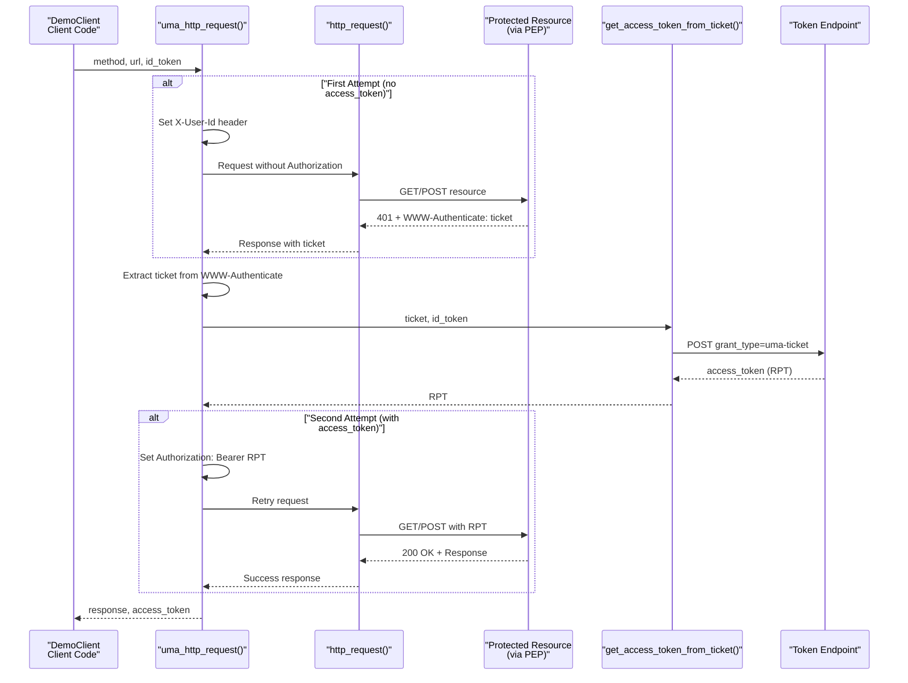
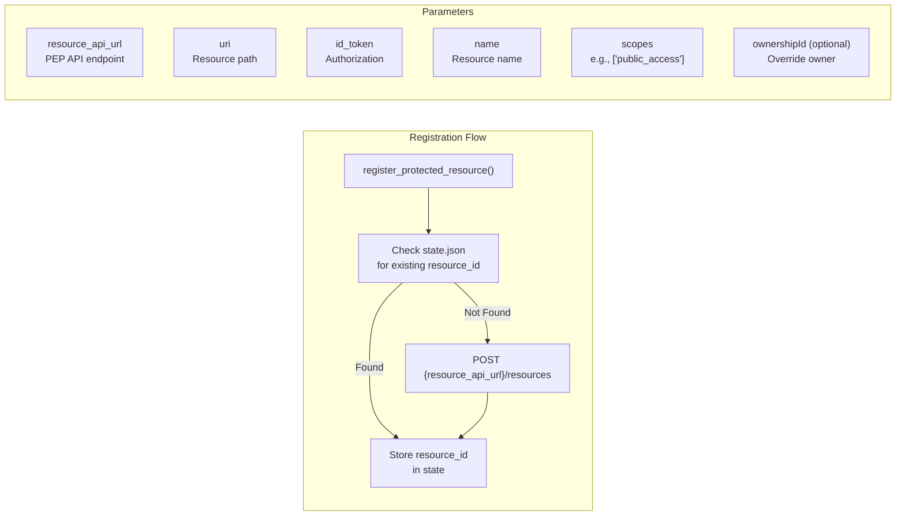
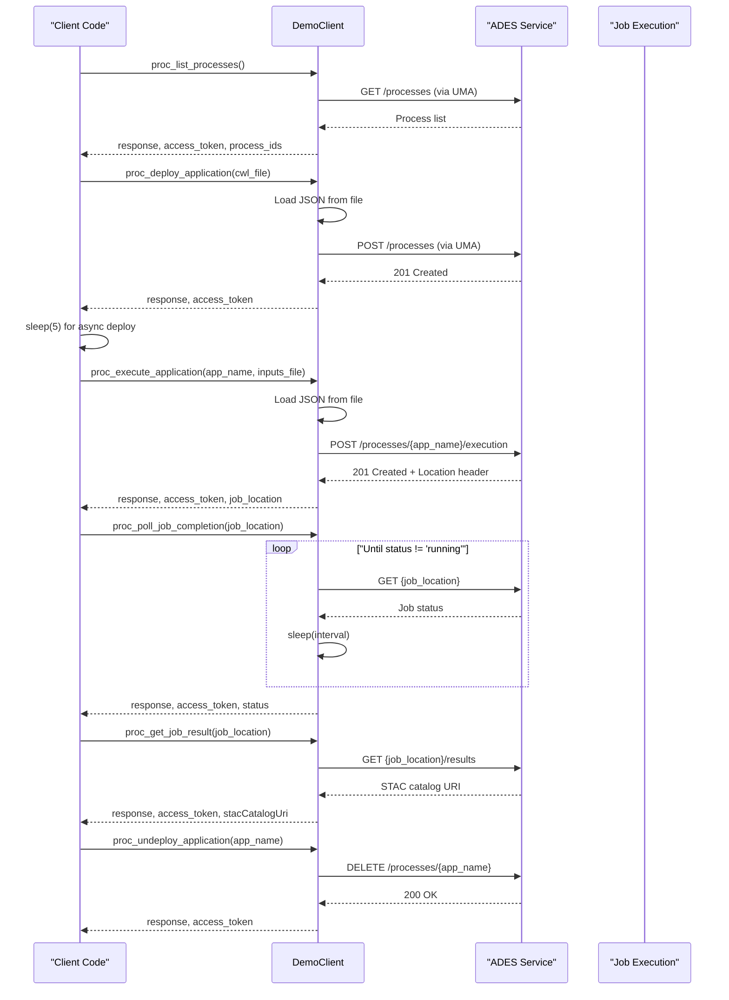
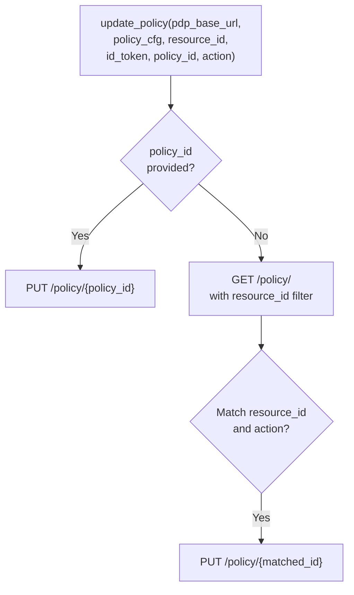
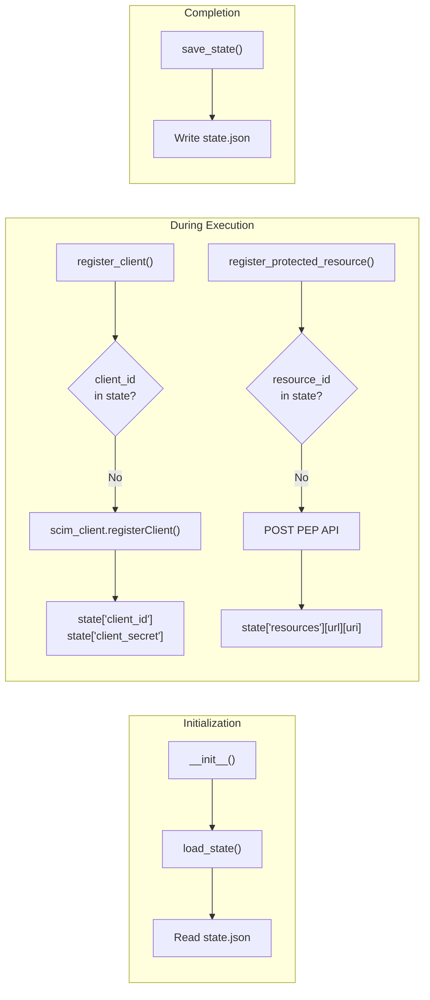
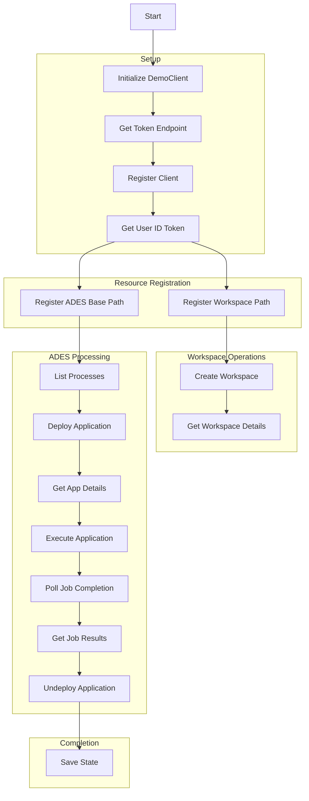

# DemoClient Library

<details>
<summary>Relevant source files</summary>

The following files were used as context for generating this wiki page:

- [test/acceptance/02__Processing/01__ADES/01__API_PROC.robot](test/acceptance/02__Processing/01__ADES/01__API_PROC.robot)
- [test/acceptance/02__Processing/01__ADES/02__WPS.robot](test/acceptance/02__Processing/01__ADES/02__WPS.robot)
- [test/acceptance/__init__.robot](test/acceptance/__init__.robot)
- [test/client/.gitignore](test/client/.gitignore)
- [test/client/DemoClient.py](test/client/DemoClient.py)
- [test/client/debug/jwt-output-by-pep.json](test/client/debug/jwt-output-by-pep.json)
- [test/client/main.py](test/client/main.py)
- [test/client/requirements.txt](test/client/requirements.txt)
- [test/client/setup.sh](test/client/setup.sh)

</details>


## Purpose and Scope

The DemoClient library is a Python client for interacting with EOEPCA platform services through User-Managed Access (UMA) authentication flows. This library provides programmatic access to protected resources including ADES (Application Deployment and Execution Service), Workspace API, and other EOEPCA services with built-in UMA ticket-based authorization handling.

For information about the UMA authentication flow from a system architecture perspective, see [UMA Authentication Flow](#4.4). For details on the acceptance testing framework that uses this client, see [Acceptance Testing Framework](#9.2). For local development scenarios, see [Local Development with Minikube](#9.3).

**Sources:** [test/client/DemoClient.py:1-20]()

## Library Overview

The `DemoClient` class, implemented in [test/client/DemoClient.py](), serves as a comprehensive client library with the following capabilities:

| Capability | Description |
|------------|-------------|
| **Client Registration** | Dynamic registration with the Identity Service using OIDC |
| **User Authentication** | Password-based authentication to obtain ID tokens |
| **Resource Registration** | Registration of protected resources with PEP APIs |
| **UMA Flow Handling** | Automatic ticket-to-RPT exchange for accessing protected resources |
| **State Persistence** | JSON-based state management for client credentials and resource IDs |
| **Robot Framework Integration** | Keyword decorators for test automation |
| **Multi-Service Support** | ADES, Workspace API, WPS, and custom services |

The library is initialized with a base URL and maintains a persistent session with disabled SSL verification for development environments.

**Sources:** [test/client/DemoClient.py:14-33](), [test/client/main.py:1-40]()

## Architecture and Key Components

### DemoClient Class Structure

```mermaid
graph TB
    DemoClient["DemoClient<br/>class"]
    
    subgraph "Session Management"
        session["requests.Session<br/>self.session"]
        base_url["base_url<br/>str"]
        state["state<br/>dict"]
    end
    
    subgraph "Authentication Components"
        scim_client["EOEPCA_Scim<br/>self.scim_client"]
        token_endpoint["token_endpoint<br/>str"]
        client_creds["client_id/secret<br/>in state"]
    end
    
    subgraph "Configuration"
        trace_flow["trace_flow<br/>bool"]
        trace_requests["trace_requests<br/>bool"]
    end
    
    subgraph "Core Methods"
        register_client["register_client()"]
        get_id_token["get_id_token()"]
        register_protected_resource["register_protected_resource()"]
        uma_http_request["uma_http_request()"]
    end
    
    subgraph "Service Methods"
        ades_methods["proc_list_processes()<br/>proc_deploy_application()<br/>proc_execute_application()<br/>proc_get_job_status()<br/>proc_poll_job_completion()"]
        ws_methods["wsapi_create()<br/>wsapi_get_details()"]
        wps_methods["wps_get_capabilities()"]
    end
    
    subgraph "Policy Methods"
        policy_methods["update_policy()<br/>get_ownership_id()<br/>get_resource_by_name()"]
    end
    
    DemoClient --> session
    DemoClient --> base_url
    DemoClient --> state
    DemoClient --> scim_client
    DemoClient --> token_endpoint
    DemoClient --> client_creds
    DemoClient --> trace_flow
    DemoClient --> trace_requests
    
    DemoClient --> register_client
    DemoClient --> get_id_token
    DemoClient --> register_protected_resource
    DemoClient --> uma_http_request
    
    DemoClient --> ades_methods
    DemoClient --> ws_methods
    DemoClient --> wps_methods
    DemoClient --> policy_methods
```



**Sources:** [test/client/DemoClient.py:14-56]()

### UMA Flow Implementation

The library implements the complete UMA authentication flow through the `uma_http_request()` method:



**Sources:** [test/client/DemoClient.py:239-291](), [test/client/DemoClient.py:185-212]()

## Authentication and Authorization Methods

### Client Registration and Token Management

The library provides methods for managing OIDC client registration and obtaining authentication tokens:

| Method | Purpose | Returns |
|--------|---------|---------|
| `get_token_endpoint()` | Discovers the token endpoint from UMA2 configuration | Token endpoint URL |
| `register_client()` | Registers a new OIDC client with the Identity Service | Stores `client_id` and `client_secret` in state |
| `get_client_credentials()` | Returns existing or newly registered client credentials | `(client_id, client_secret)` tuple |
| `get_id_token(username, password)` | Obtains an ID token using password grant | ID token string |
| `get_access_token_from_ticket(ticket, id_token)` | Exchanges UMA ticket + ID token for RPT | Access token (RPT) |
| `get_access_token_from_password(username, password)` | Obtains access token via password grant | Access token |

The client registration process uses the `EOEPCA_Scim` library and supports multiple grant types including `client_credentials`, `password`, and `urn:ietf:params:oauth:grant-type:uma-ticket`.

**Sources:** [test/client/DemoClient.py:74-140](), [test/client/DemoClient.py:185-229]()

### Resource Registration and Protection

Protected resources are registered with the PEP through the `register_protected_resource()` method:



The method constructs a registration request with the following payload structure:

```json
{
  "resource_scopes": ["scope1", "scope2"],
  "icon_uri": "/resource/path",
  "name": "Resource Display Name",
  "uuid": "optional-ownership-id"
}
```

**Sources:** [test/client/DemoClient.py:141-183](), [test/client/main.py:54-65]()

## ADES Processing Methods

The library provides comprehensive methods for interacting with the ADES service through both OGC API Processes and WPS interfaces:

### API Processes Methods

| Method | Endpoint Pattern | Purpose |
|--------|------------------|---------|
| `proc_list_processes()` | `GET {base_url}/processes` | List deployed applications |
| `proc_deploy_application()` | `POST {base_url}/processes` | Deploy CWL application from file |
| `proc_get_app_details()` | `GET {base_url}/processes/{app_name}` | Get application details |
| `proc_execute_application()` | `POST {base_url}/processes/{app_name}/execution` | Execute application with inputs |
| `proc_get_job_status()` | `GET {base_url}{job_location}` | Check job execution status |
| `proc_poll_job_completion()` | Polling loop | Poll until job completes |
| `proc_get_job_result()` | `GET {base_url}{job_location}/results` | Retrieve STAC result URI |
| `proc_list_jobs()` | `GET {base_url}/jobs` | List all jobs |
| `proc_undeploy_application()` | `DELETE {base_url}/processes/{app_name}` | Remove deployed application |

**Sources:** [test/client/DemoClient.py:383-536]()

### WPS Methods

The `wps_get_capabilities()` method provides access to the OGC WPS GetCapabilities endpoint:

```
GET {service_base_url}/?service=WPS&version=1.0.0&request=GetCapabilities
```

**Sources:** [test/client/DemoClient.py:370-377]()

### ADES Usage Pattern



**Sources:** [test/client/main.py:147-207](), [test/client/DemoClient.py:383-536]()

## Workspace API Methods

The library provides methods for interacting with the Workspace API:

| Method | Endpoint | Purpose |
|--------|----------|---------|
| `wsapi_create()` | `POST {base_url}/workspaces` | Create a new workspace for a user |
| `wsapi_get_details()` | `GET {base_url}` | Retrieve workspace details |
| `workspace_get_details()` | `GET {base_url}/workspaces/{name}` | Get details for a named workspace |
| `workspace_register_application()` | `POST {base_url}/workspaces/{name}/register` | Register an application in a workspace |

The `wsapi_create()` method constructs the request body with the following structure:

```json
{
  "preferred_name": "username",
  "default_owner": "user-sub-claim-from-id-token"
}
```

If no explicit `owner` parameter is provided, the method extracts the `sub` claim from the ID token to set the `default_owner`.

**Sources:** [test/client/DemoClient.py:310-365](), [test/client/main.py:103-128]()

## Policy Management Methods

The library includes methods for managing authorization policies through the PDP:

### Policy Update

The `update_policy()` method supports two modes:

1. **Policy ID mode**: Update a specific policy by ID (with ownership validation)
2. **Resource ID mode**: Find and update policies matching a resource ID and action



### Resource Lookup Methods

| Method | Purpose |
|--------|---------|
| `get_ownership_id(id_token)` | Extracts the `sub` claim from an ID token to determine ownership |
| `get_resource_by_name(pep_base_url, name, id_token)` | Finds a resource ID by matching the `_name` field |
| `get_resource_by_uri(pep_base_url, relative_url, id_token)` | Finds a resource ID by matching the `_reverse_match_url` field |
| `reset_resource_policy()` | Resets a resource's policy to allow only the owner |

**Sources:** [test/client/DemoClient.py:538-683]()

## State Management

The DemoClient library maintains persistent state in a JSON file to avoid re-registering clients and resources across multiple executions.

### State Structure

```json
{
  "client_id": "registered-oidc-client-id",
  "client_secret": "registered-oidc-client-secret",
  "resources": {
    "http://ades-pepapi.example.org": {
      "/eric": "resource-id-1",
      "/test424": "resource-id-2"
    },
    "http://workspace-api-pepapi.example.org": {
      "/workspaces/develop-user-eric": "resource-id-3"
    }
  }
}
```

### State Lifecycle



The state file is excluded from version control through [test/client/.gitignore:4]().

**Sources:** [test/client/DemoClient.py:35-56](), [test/client/DemoClient.py:87-112](), [test/client/DemoClient.py:141-183]()

## Robot Framework Integration

The DemoClient library is designed as a Robot Framework test library with the `@library` and `@keyword` decorators:

### Library Declaration

```python
@library
class DemoClient:
    ROBOT_LIBRARY_SCOPE = 'GLOBAL'
    ROBOT_LIBRARY_VERSION = '0.1'
```

This makes the entire class available as a Robot Framework library with global scope, meaning a single instance is shared across all test cases.

### Keyword Methods

Methods decorated with `@keyword` are exposed as Robot Framework keywords:

| Keyword Name | Method | Purpose |
|--------------|--------|---------|
| `Get Client Credentials` | `get_client_credentials()` | Returns client credentials |
| `Get ID Token` | `get_id_token()` | Obtains user ID token |
| `Register Protected Resource` | `register_protected_resource()` | Registers a resource with PEP |
| `Dummy Service Call` | `dummy_service_call()` | Test endpoint call |
| `Workspace API Create` | `wsapi_create()` | Create workspace |
| `Workspace API Get Details` | `wsapi_get_details()` | Get workspace details |
| `WPS Get Capabilities` | `wps_get_capabilities()` | WPS GetCapabilities |
| `Proc List Processes` | `proc_list_processes()` | List ADES processes |
| `Proc Deploy App` | `proc_deploy_application()` | Deploy ADES application |
| `Proc App Details` | `proc_get_app_details()` | Get app details |
| `Proc Execute App` | `proc_execute_application()` | Execute ADES application |
| `Proc Job Status` | `proc_get_job_status()` | Get job status |
| `Proc Poll Job Completion` | `proc_poll_job_completion()` | Poll until job completes |
| `Proc Job Result` | `proc_get_job_result()` | Get job results |
| `Proc Undeploy App` | `proc_undeploy_application()` | Undeploy application |
| `Update Policy` | `update_policy()` | Update PDP policy |
| `Get Ownership Id` | `get_ownership_id()` | Extract ownership from token |
| `Client Save State` | `save_state()` | Save state to file |

### Usage in Robot Tests

```robot
*** Settings ***
Library  ../../../client/DemoClient.py  ${UM_BASE_URL}

*** Test Cases ***
Deploy Application
  ${resp}  ${access_token} =  Proc Deploy App  ${API_PROC_SERVICE_URL}  ${app_filename}  ${ID_TOKEN}  ${ACCESS_TOKEN}
  Should Be Equal As Integers  201  ${resp.status_code}
```

**Sources:** [test/client/DemoClient.py:12-19](), [test/acceptance/02__Processing/01__ADES/01__API_PROC.robot:1-10](), [test/acceptance/02__Processing/01__ADES/01__API_PROC.robot:76-81]()

## Example Usage

### Complete Workflow Example

The [test/client/main.py]() script demonstrates a complete workflow:



### Key Configuration Points

The example script configures:

1. **Domain**: Target EOEPCA deployment (e.g., `develop.eoepca.org`)
2. **User credentials**: Username and password for authentication
3. **Service endpoints**:
   - Base URL: `https://auth.{domain}`
   - ADES: `https://ades.{domain}` with resource API at `http://ades-pepapi.{domain}`
   - Workspace API: `https://workspace-api.{domain}` with resource API at `http://workspace-api-pepapi.{domain}`

### Trace Flow Debugging

The library supports trace logging for debugging UMA flows:

```python
demo.trace_flow = True
response, access_token = demo.wsapi_create(wsapi_url, wsapi_user, 
                                           id_token=user_id_token, 
                                           access_token=wsapi_access_token)
demo.trace_flow = False
```

This outputs detailed logs prefixed with `[UMA]` showing:
- Ticket acquisition
- Token exchange
- Authorization attempts
- Access token reuse

**Sources:** [test/client/main.py:7-221](), [test/client/DemoClient.py:57-68]()

## Dependencies

The library requires the following Python packages:

| Package | Version | Purpose |
|---------|---------|---------|
| `eoepca-scim` | 2.8.1 | SCIM client for OIDC registration |
| `pycrypto` | 2.6.1 | Cryptographic operations |
| `pyjwkest` | 1.4.2 | JWT key management |
| `PyJWT` | 2.6.0 | JWT token handling |
| `requests` | 2.26.0 | HTTP client library |
| `robotframework` | 4.1 | Robot Framework test library support |
| `WellKnownHandler` | 0.2.0 | OIDC well-known endpoint handling |

Installation is automated through [test/client/setup.sh](), which creates a Python virtual environment and installs all dependencies.

**Sources:** [test/client/requirements.txt:1-8](), [test/client/setup.sh:1-14]()