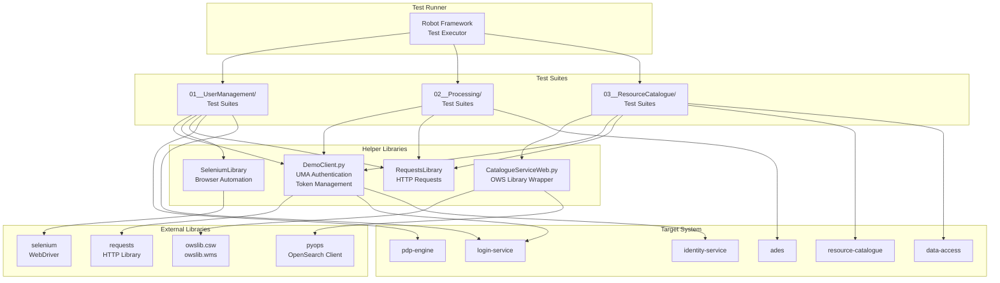
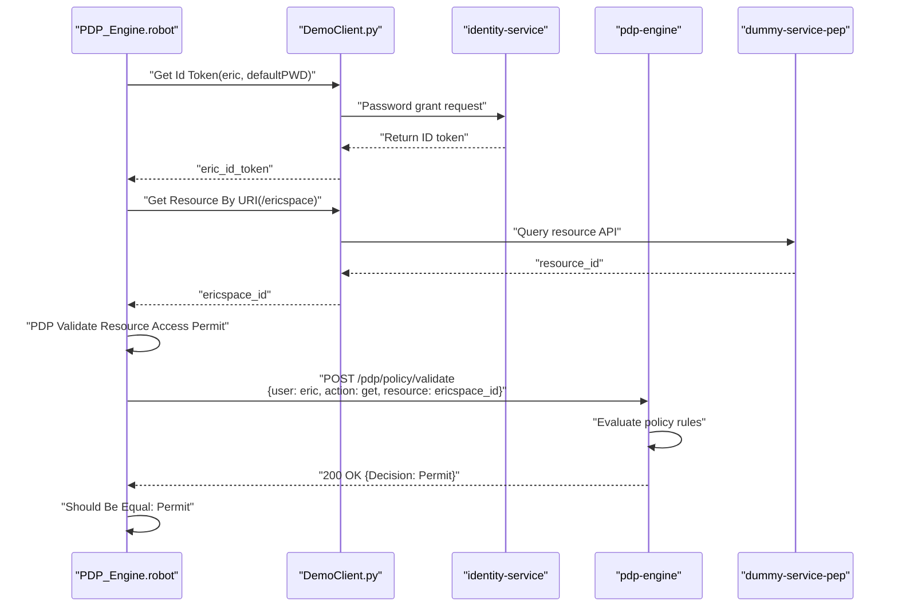
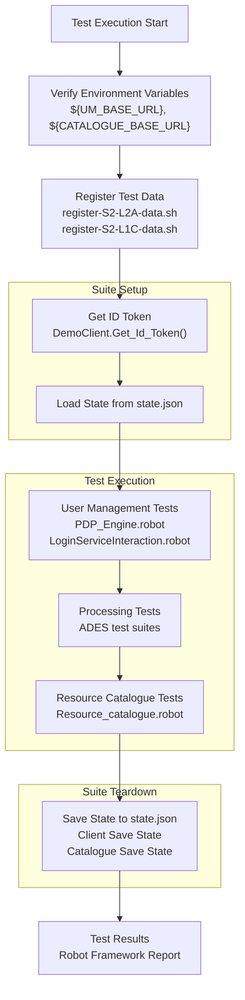

# Acceptance Testing Framework

<details>
<summary>Relevant source files</summary>

The following files were used as context for generating this wiki page:

- [.gitattributes](.gitattributes)
- [bin/dump-policy.sh](bin/dump-policy.sh)
- [bin/list-container-images.sh](bin/list-container-images.sh)
- [bin/unregister-resource.sh](bin/unregister-resource.sh)
- [system/clusters/creodias/user-management/kustomization.yaml](system/clusters/creodias/user-management/kustomization.yaml)
- [system/clusters/data/register-S2-L1C-data.sh](system/clusters/data/register-S2-L1C-data.sh)
- [system/clusters/data/register-S2-L2A-data.sh](system/clusters/data/register-S2-L2A-data.sh)
- [test/acceptance/01__UserManagement/02__UserProfile/LoginServiceInteraction.robot](test/acceptance/01__UserManagement/02__UserProfile/LoginServiceInteraction.robot)
- [test/acceptance/01__UserManagement/03__PDP_Engine/PDP_Engine.robot](test/acceptance/01__UserManagement/03__PDP_Engine/PDP_Engine.robot)
- [test/acceptance/01__UserManagement/03__PDP_Engine/getOwnership.py](test/acceptance/01__UserManagement/03__PDP_Engine/getOwnership.py)
- [test/acceptance/01__UserManagement/03__PDP_Engine/tkn.sh](test/acceptance/01__UserManagement/03__PDP_Engine/tkn.sh)
- [test/acceptance/02__Processing/01__ADES/data/app-deploy-body-atom.json](test/acceptance/02__Processing/01__ADES/data/app-deploy-body-atom.json)
- [test/acceptance/02__Processing/01__ADES/data/app-deploy-body-cwl.json](test/acceptance/02__Processing/01__ADES/data/app-deploy-body-cwl.json)
- [test/acceptance/02__Processing/01__ADES/data/application-package-atom.xml](test/acceptance/02__Processing/01__ADES/data/application-package-atom.xml)
- [test/acceptance/02__Processing/01__ADES/data/application-package-cwl.cwl](test/acceptance/02__Processing/01__ADES/data/application-package-cwl.cwl)
- [test/acceptance/03__ResourceCatalogue/CatalogueServiceWeb.py](test/acceptance/03__ResourceCatalogue/CatalogueServiceWeb.py)
- [test/acceptance/03__ResourceCatalogue/Resource_catalogue.robot](test/acceptance/03__ResourceCatalogue/Resource_catalogue.robot)

</details>


## Purpose and Scope

The Acceptance Testing Framework validates the functionality and integration of all EOEPCA building blocks through automated end-to-end tests. This framework uses Robot Framework to execute test scenarios that verify authentication flows, policy enforcement, data access, catalogue operations, and processing capabilities across the deployed system.

For information about the underlying Python client library used by these tests, see [DemoClient Library](#9.1). For setting up a local test environment, see [Local Development with Minikube](#9.3).

## Test Framework Architecture

The acceptance testing framework is built on Robot Framework and organized into test suites that correspond to the major EOEPCA building blocks. The framework executes tests against a deployed EOEPCA instance, validating both individual services and cross-service workflows.

**Test Framework Architecture**



**Sources:** [test/acceptance/01__UserManagement/03__PDP_Engine/PDP_Engine.robot:1-5](), [test/acceptance/01__UserManagement/02__UserProfile/LoginServiceInteraction.robot:1-6](), [test/acceptance/03__ResourceCatalogue/Resource_catalogue.robot:1-6](), [test/acceptance/03__ResourceCatalogue/CatalogueServiceWeb.py:1-17]()

## Test Suite Organization

Test suites are organized hierarchically by building block, with each major component having its own directory structure. The test files use the `.robot` extension and follow a naming convention that indicates test scope and purpose.

**Test Suite File Structure**

| Directory | Test Suite | Purpose |
|-----------|-----------|---------|
| `01__UserManagement/02__UserProfile/` | `LoginServiceInteraction.robot` | Browser-based login flow validation |
| `01__UserManagement/03__PDP_Engine/` | `PDP_Engine.robot` | Policy decision point validation |
| `02__Processing/01__ADES/` | ADES test suites | Application deployment and execution |
| `03__ResourceCatalogue/` | `Resource_catalogue.robot` | CSW, OpenSearch, and WMS operations |

**Sources:** [test/acceptance/01__UserManagement/03__PDP_Engine/PDP_Engine.robot:1](), [test/acceptance/01__UserManagement/02__UserProfile/LoginServiceInteraction.robot:1](), [test/acceptance/03__ResourceCatalogue/Resource_catalogue.robot:1]()

## User Management Test Suite

The User Management test suite validates authentication, authorization, and policy enforcement across the identity subsystem. Tests verify UMA flows, PDP policy decisions, and browser-based login interactions.

### PDP Policy Validation Tests

The PDP test suite validates policy enforcement by testing access control decisions for different users, resources, and actions. Tests exercise both positive (permit) and negative (deny) scenarios.

**PDP Validation Test Flow**



**Sources:** [test/acceptance/01__UserManagement/03__PDP_Engine/PDP_Engine.robot:13-31]()

### PDP Test Cases

The PDP test suite includes comprehensive validation of access control policies:

**Access Permission Tests** - Validate that users can access their own resources and are denied access to other users' resources:
- `PDP Access Permitted eric -> /ericspace` - [test/acceptance/01__UserManagement/03__PDP_Engine/PDP_Engine.robot:13-16]()
- `PDP Access Denied bob -> /ericspace` - [test/acceptance/01__UserManagement/03__PDP_Engine/PDP_Engine.robot:18-21]()
- `PDP Access Permitted bob -> /bobspace` - [test/acceptance/01__UserManagement/03__PDP_Engine/PDP_Engine.robot:23-26]()

**HTTP Method Tests** - Verify policy enforcement for different HTTP actions:
- `PDP Access Permitted GET/POST/PUT/DELETE/HEAD` - [test/acceptance/01__UserManagement/03__PDP_Engine/PDP_Engine.robot:28-51]()

**Policy Validation Edge Cases**:
- `PDP Policy Validate Bad Action` - [test/acceptance/01__UserManagement/03__PDP_Engine/PDP_Engine.robot:53-56]()
- `PDP Policy Validate Bad Resource` - [test/acceptance/01__UserManagement/03__PDP_Engine/PDP_Engine.robot:58-61]()

**Policy Management Tests** - Validate authorization for policy modifications:
- `User bob Unauthorized Policy Change` - Verifies non-owners cannot modify policies [test/acceptance/01__UserManagement/03__PDP_Engine/PDP_Engine.robot:63-71]()
- `User eric Authorized Policy Change` - Verifies owners can update policies [test/acceptance/01__UserManagement/03__PDP_Engine/PDP_Engine.robot:73-82]()

**Sources:** [test/acceptance/01__UserManagement/03__PDP_Engine/PDP_Engine.robot:11-99]()

### PDP Test Keywords

The test suite defines reusable Robot Framework keywords for policy validation:

**`PDP Validate Resource Access`** - Core keyword that sends policy validation requests to the PDP endpoint:
```
[Arguments]  ${user_name}  ${action}  ${resource_id}  ${expected_status}
```
Constructs XACML-style request with `AccessSubject`, `Action`, and `Resource` attributes, sends to `/pdp/policy/validate`, and returns the decision. [test/acceptance/01__UserManagement/03__PDP_Engine/PDP_Engine.robot:102-112]()

**`PDP Validate Resource Access Permit`** - Wrapper that expects `200` status and `Permit` decision [test/acceptance/01__UserManagement/03__PDP_Engine/PDP_Engine.robot:114-117]()

**`PDP Validate Resource Access Denied`** - Wrapper that expects `401` status and `Deny` decision [test/acceptance/01__UserManagement/03__PDP_Engine/PDP_Engine.robot:119-122]()

**Sources:** [test/acceptance/01__UserManagement/03__PDP_Engine/PDP_Engine.robot:100-123]()

### Login Service Browser Tests

The Login Service test suite uses Selenium WebDriver to validate browser-based authentication flows through the Gluu-based login service.

**Test Cases**:
- `Log in to the User Profile through the Login Service` - Validates OAuth2 authorization code flow with browser redirection [test/acceptance/01__UserManagement/02__UserProfile/LoginServiceInteraction.robot:20-37]()
- `Add Two Users to Gluu` - Automated user creation through Gluu admin interface [test/acceptance/01__UserManagement/02__UserProfile/LoginServiceInteraction.robot:39-59]()

**Browser Configuration** - Tests use headless Chrome with security options:
```robot
${chrome_options} =  Evaluate  sys.modules['selenium.webdriver'].ChromeOptions()
Call Method  ${chrome_options}  add_argument  headless
Call Method  ${chrome_options}  add_argument  ignore-certificate-errors
```
[test/acceptance/01__UserManagement/02__UserProfile/LoginServiceInteraction.robot:21-28]()

**Sources:** [test/acceptance/01__UserManagement/02__UserProfile/LoginServiceInteraction.robot:18-127]()

## Processing Test Suite

The Processing test suite validates ADES (Application Deployment and Execution Service) functionality, including CWL application deployment and execution workflows.

### ADES Test Data

The test suite includes structured test data for different application deployment scenarios:

**CWL Application Package Deployment** - JSON request body for deploying CWL-based applications via the ADES `/processes/deployment` endpoint:
```json
{
  "inputs": [{
    "id": "applicationPackage",
    "input": {
      "format": {"mimeType": "application/cwl"},
      "value": {"href": "https://raw.githubusercontent.com/EOEPCA/app-snuggs/main/app-package.cwl"}
    }
  }]
}
```
[test/acceptance/02__Processing/01__ADES/data/app-deploy-body-cwl.json:1-28]()

**ATOM Feed Application Deployment** - Alternative deployment format using OGC OWS Context ATOM encoding [test/acceptance/02__Processing/01__ADES/data/app-deploy-body-atom.json:1-35]()

**CWL Application Package Definition** - Complete CWL workflow specification with:
- `CommandLineTool` definition with Docker container reference [test/acceptance/02__Processing/01__ADES/data/application-package-cwl.cwl:2-35]()
- `Workflow` definition with scatter-gather pattern [test/acceptance/02__Processing/01__ADES/data/application-package-cwl.cwl:36-72]()

**Sources:** [test/acceptance/02__Processing/01__ADES/data/app-deploy-body-cwl.json:1-28](), [test/acceptance/02__Processing/01__ADES/data/application-package-cwl.cwl:1-79](), [test/acceptance/02__Processing/01__ADES/data/app-deploy-body-atom.json:1-35]()

## Resource Catalogue Test Suite

The Resource Catalogue test suite validates metadata cataloguing, search, and data access services through OGC CSW, OpenSearch, and WMS interfaces.

### CatalogueServiceWeb Helper Library

The `CatalogueServiceWeb.py` library wraps `owslib` and `pyops` to provide Robot Framework keywords for catalogue interaction.

**Library Initialization**:
```python
def __init__(self, base_url):
    self.system_catalogue_endpoint = base_url
    self.csw = CSW(self.system_catalogue_endpoint, timeout=30)
```
[test/acceptance/03__ResourceCatalogue/CatalogueServiceWeb.py:17-22]()

**Key Components**:
- `owslib.csw.CatalogueServiceWeb` - OGC CSW client [test/acceptance/03__ResourceCatalogue/CatalogueServiceWeb.py:3]()
- `owslib.wms.WebMapService` - OGC WMS client [test/acceptance/03__ResourceCatalogue/CatalogueServiceWeb.py:5]()
- `pyops.Client` - OpenSearch client [test/acceptance/03__ResourceCatalogue/CatalogueServiceWeb.py:6]()

**Sources:** [test/acceptance/03__ResourceCatalogue/CatalogueServiceWeb.py:10-156]()

### Catalogue Test Keywords

The library provides Robot Framework keywords for catalogue operations:

**CSW Operations**:
- `Get Operations` - Returns available CSW operations [test/acceptance/03__ResourceCatalogue/CatalogueServiceWeb.py:45-49]()
- `Get Constraints` - Returns operation constraints [test/acceptance/03__ResourceCatalogue/CatalogueServiceWeb.py:51-55]()
- `Get Results` - Retrieves records with optional limit [test/acceptance/03__ResourceCatalogue/CatalogueServiceWeb.py:58-64]()
- `Get Records Filtered` - Queries with spatial/temporal/property filters [test/acceptance/03__ResourceCatalogue/CatalogueServiceWeb.py:74-98]()

**Filter Construction** - Uses `owslib.fes` for OGC Filter Encoding:
```python
bbox_query = BBox([37, 13.9, 37.9, 15.1])
begin = PropertyIsGreaterThanOrEqualTo(propertyname='apiso:TempExtent_begin', literal='2021-04-02 00:00')
end = PropertyIsLessThanOrEqualTo(propertyname='apiso:TempExtent_end', literal='2021-04-03 00:00')
cloud = PropertyIsLessThanOrEqualTo(propertyname='apiso:CloudCover', literal='20')
filter_list = [And([bbox_query, begin, end, cloud])]
```
[test/acceptance/03__ResourceCatalogue/CatalogueServiceWeb.py:81-93]()

**WMS Integration**:
- `Get Record Link` - Extracts WMS endpoint from catalogue record [test/acceptance/03__ResourceCatalogue/CatalogueServiceWeb.py:100-111]()
- `Get Map` - Initializes WMS client and retrieves layer contents [test/acceptance/03__ResourceCatalogue/CatalogueServiceWeb.py:113-116]()

**OpenSearch Support**:
- `Load Opensearch` - Initializes pyops client from description document [test/acceptance/03__ResourceCatalogue/CatalogueServiceWeb.py:139-142]()
- `Open Search` - Executes OpenSearch query with parameters [test/acceptance/03__ResourceCatalogue/CatalogueServiceWeb.py:144-147]()

**Sources:** [test/acceptance/03__ResourceCatalogue/CatalogueServiceWeb.py:45-156]()

### Catalogue Test Cases

**CSW Operation Validation** - Verifies catalogue service capabilities:
```robot
Get Operations Information
  Get Csw Operations
```
Validates that the catalogue exposes 6 operations and `GetRecords` has 3 constraints [test/acceptance/03__ResourceCatalogue/Resource_catalogue.robot:21-22]()

**Record Query and Filtering** - Tests spatial/temporal queries:
```robot
Get Records Information
  Get Csw Records Filtered
```
Queries for Sentinel-2 records within bounding box and date range, verifies WMS endpoint availability [test/acceptance/03__ResourceCatalogue/Resource_catalogue.robot:24-25]()

**OpenSearch Queries** - Validates OpenSearch interface:
```robot
Opensearch
  Load Opensearch  ${CATALOGUE_BASE_URL}/opensearch
  Search Opensearch
  Search Requests
```
Tests both pyops client and direct HTTP requests to OpenSearch endpoint [test/acceptance/03__ResourceCatalogue/Resource_catalogue.robot:32-35]()

**Test Variables**:
- `${CATALOGUE_BASE_URL}` - Global resource catalogue endpoint
- `${WORKSPACE_CATALOGUE}` - User-specific workspace catalogue URL pattern: `https://resource-catalogue.${USER_PREFIX}-${USERNAME}.${PUBLIC_HOSTNAME}` [test/acceptance/03__ResourceCatalogue/Resource_catalogue.robot:18]()

**Sources:** [test/acceptance/03__ResourceCatalogue/Resource_catalogue.robot:20-96]()

## Test Execution Environment

### Environment Variables

Tests expect the following environment variables to be set:

| Variable | Purpose | Example |
|----------|---------|---------|
| `${UM_BASE_URL}` | User Management base URL | `https://auth.develop.eoepca.org` |
| `${CATALOGUE_BASE_URL}` | Resource Catalogue endpoint | `https://resource-catalogue.develop.eoepca.org` |
| `${PUBLIC_HOSTNAME}` | Public domain name | `develop.eoepca.org` |
| `${USER_PREFIX}` | Workspace prefix | `ws` |
| `${USER_A_NAME}` | Test user A username | `eric` |
| `${USER_A_PASSWORD}` | Test user A password | `defaultPWD` |
| `${USER_B_NAME}` | Test user B username | `bob` |
| `${USER_B_PASSWORD}` | Test user B password | `defaultPWD` |
| `${DUMMY_SERVICE_RESOURCES_API_URL}` | Test service endpoint | Used for PDP tests |

**Sources:** [test/acceptance/01__UserManagement/03__PDP_Engine/PDP_Engine.robot:7-9](), [test/acceptance/03__ResourceCatalogue/Resource_catalogue.robot:12-18]()

### Test Data Registration

The acceptance tests require baseline data to be registered in the catalogue. Shell scripts automate data registration by pushing product paths to the Redis registration queue:

**Sentinel-2 L2A Data Registration**:
```bash
kubectl -n rm exec --stdin --tty data-access-redis-master-0 -- \
  redis-cli lpush register_queue \
  EODATA/Sentinel-2/MSI/L2A/2020/09/02/S2B_MSIL2A_20200902T090559_N0214_R050_T34SFH_20200902T113910.SAFE/ \
  EODATA/Sentinel-2/MSI/L2A/2020/09/02/S2B_MSIL2A_20200902T090559_N0214_R050_T35SLB_20200902T113910.SAFE/ \
  ...
```
[system/clusters/data/register-S2-L2A-data.sh:9]()

**Sentinel-2 L1C Data Registration**:
```bash
kubectl -n rm exec --stdin --tty data-access-redis-master-0 -- \
  redis-cli lpush register_queue \
  EODATA/Sentinel-2/MSI/L1C/2020/09/30/S2A_MSIL1C_20200930T092031_N0209_R093_T34SDF_20200930T105731.SAFE \
  ...
```
[system/clusters/data/register-S2-L1C-data.sh:9]()

These scripts directly enqueue product paths into the `register_queue`, which the registrar service consumes to create catalogue metadata entries.

**Sources:** [system/clusters/data/register-S2-L2A-data.sh:1-10](), [system/clusters/data/register-S2-L1C-data.sh:1-10]()

## Policy Management Utilities

The testing framework includes utility scripts for managing and debugging PEP/PDP policy configurations.

### Policy Dumping Script

The `dump-policy.sh` script extracts policy configurations from all PEP and PDP deployments for inspection:

**Script Operation**:
```bash
#!/usr/bin/env bash
dumpDeployment() {
  namespace="${1}"
  deployment="${2}"
  kubectl -n "${namespace}" exec -it deploy/"${deployment}" -c "${deployment}" -- \
    management_tools list --all | jq > "${deployment}.json"
}
```
[bin/dump-policy.sh:30-40]()

**Deployments Monitored**:
- `proc/ades-pep` - ADES Policy Enforcement Point
- `rm/combined-rm-pep` - Combined Resource Management PEP
- `rm/workspace-api-pep` - Workspace API PEP
- `test/dummy-service-pep` - Test service PEP
- `um/pdp-engine` - Policy Decision Point (no JSON formatting)

[bin/dump-policy.sh:21-27]()

**Sources:** [bin/dump-policy.sh:1-43]()

### Resource Unregistration Script

The `unregister-resource.sh` script removes resources from all PEP/PDP policy stores:

**Usage**:
```bash
./unregister-resource.sh <resource-id>
```

**Execution Flow**:
```bash
kubectl -n rm exec -it svc/combined-rm-pep -c combined-rm-pep -- \
  management_tools remove -r ${resourceId}

kubectl -n proc exec -it svc/ades-pep -c ades-pep -- \
  management_tools remove -r ${resourceId}

kubectl -n rm exec -it svc/workspace-api-pep -c workspace-api-pep -- \
  management_tools remove -r ${resourceId}

kubectl -n test exec -it svc/dummy-service-pep -c dummy-service-pep -- \
  management_tools remove -r ${resourceId}

kubectl -n um exec -it svc/pdp-engine -c pdp-engine -- \
  management_tools remove -r ${resourceId}
```
[bin/unregister-resource.sh:22-54]()

This ensures resources are cleanly removed from all policy enforcement points and the central PDP.

**Sources:** [bin/unregister-resource.sh:1-55]()

## Test Execution Workflow

**Test Execution Process**



**Sources:** [test/acceptance/03__ResourceCatalogue/Resource_catalogue.robot:8-9](), [test/acceptance/03__ResourceCatalogue/Resource_catalogue.robot:38-43](), [test/acceptance/03__ResourceCatalogue/CatalogueServiceWeb.py:23-34]()

## Token Management and Authentication

### Token Acquisition Script

The `tkn.sh` script provides command-line token acquisition for manual testing and debugging:

**Usage**:
```bash
tkn.sh -t <token_endpoint> -i <client_id> -s <client_secret> \
       -u <user_name> -p <user_password> -f <output-file>
```

**Token Request**:
```bash
curl -k -v -XPOST "$TOKEN_ENDPOINT" -H 'cache-control: no-cache' \
  -d "grant_type=password&client_id=$CLIENT_ID&client_secret=$CLIENT_SECRET&username=${USER_NAME}&password=${USER_PASSWORD}&scope=openid" \
  > "${OUTPUT_FILE}"
```
[test/acceptance/01__UserManagement/03__PDP_Engine/tkn.sh:33]()

This script performs OAuth2 Resource Owner Password Credentials grant to obtain ID tokens for testing.

**Sources:** [test/acceptance/01__UserManagement/03__PDP_Engine/tkn.sh:1-34]()

### Ownership ID Extraction

The `getOwnership.py` script extracts the ownership ID (subject claim) from JWT tokens:

**Script Operation**:
```python
payload = str(sys.argv[1]).split(".")[1]
paddedPayload = payload + '=' * (4 - len(payload) % 4)
decoded = base64.b64decode(paddedPayload)
jwt_decoded = json.loads(decoded)
f.write(jwt_decoded["sub"])
```
[test/acceptance/01__UserManagement/03__PDP_Engine/getOwnership.py:8-14]()

This extracts the `sub` claim from JWT tokens, which is used as the ownership identifier in policy rules.

**Sources:** [test/acceptance/01__UserManagement/03__PDP_Engine/getOwnership.py:1-15]()

## Test Configuration and Dependencies

### Python Library Dependencies

The test framework requires the following Python packages:

| Library | Purpose | Import Location |
|---------|---------|-----------------|
| `robotframework` | Test execution framework | Implicit |
| `robotframework-seleniumlibrary` | Browser automation | [test/acceptance/01__UserManagement/02__UserProfile/LoginServiceInteraction.robot:3]() |
| `robotframework-requests` | HTTP testing | [test/acceptance/03__ResourceCatalogue/Resource_catalogue.robot:3]() |
| `owslib` | OGC service clients | [test/acceptance/03__ResourceCatalogue/CatalogueServiceWeb.py:3-5]() |
| `pyops` | OpenSearch client | [test/acceptance/03__ResourceCatalogue/CatalogueServiceWeb.py:6]() |
| `requests` | HTTP library | [test/acceptance/03__ResourceCatalogue/CatalogueServiceWeb.py:7]() |
| `beautifulsoup4` | XML/HTML parsing | [test/acceptance/03__ResourceCatalogue/CatalogueServiceWeb.py:8]() |

**Sources:** [test/acceptance/03__ResourceCatalogue/CatalogueServiceWeb.py:1-8](), [test/acceptance/01__UserManagement/02__UserProfile/LoginServiceInteraction.robot:3-6]()

### State Persistence

The `CatalogueServiceWeb` library maintains test state across executions using a JSON state file:

**State Loading**:
```python
def load_state(self):
    self.state = {}
    try:
        with open("state.json") as state_file:
            self.state = json.loads(state_file.read())
    except FileNotFoundError:
        pass
```
[test/acceptance/03__ResourceCatalogue/CatalogueServiceWeb.py:23-32]()

**State Saving**:
```python
@keyword(name='Catalogue Save State')
def save_state(self):
    with open("state.json", "w") as state_file:
        state_file.write(json.dumps(self.state, sort_keys=True, indent=2))
```
[test/acceptance/03__ResourceCatalogue/CatalogueServiceWeb.py:36-43]()

This allows tests to maintain context between runs, such as created resource IDs or authentication tokens.

**Sources:** [test/acceptance/03__ResourceCatalogue/CatalogueServiceWeb.py:23-43]()