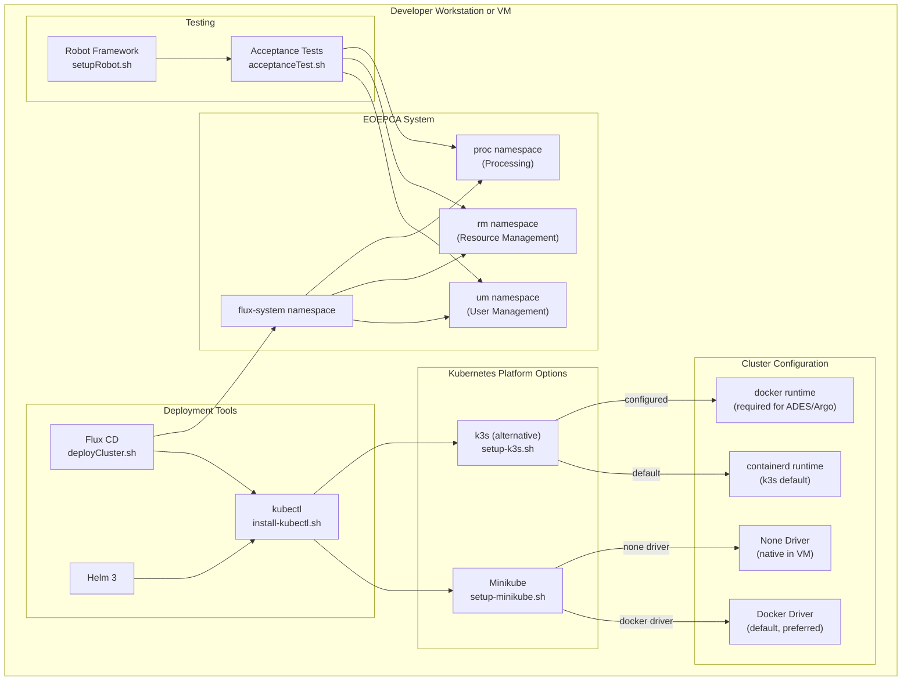
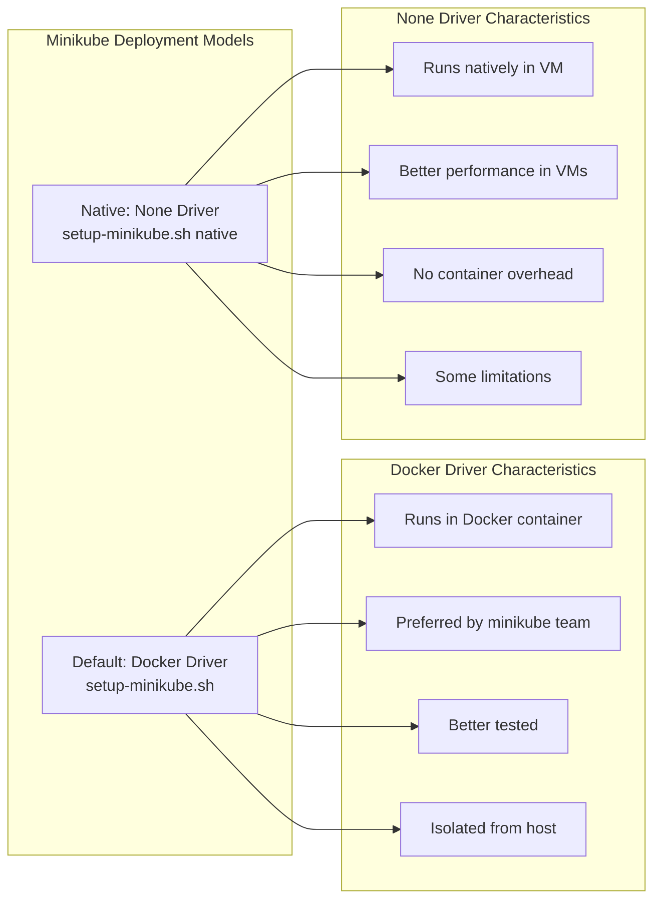
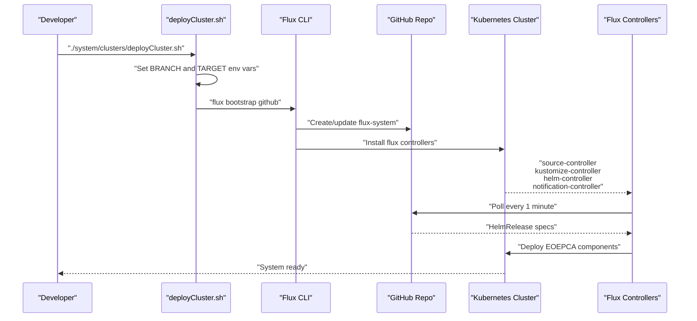
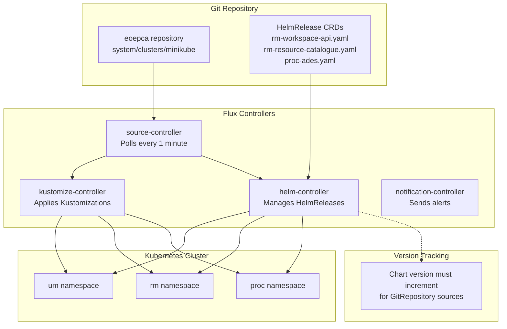

# Local Development with Minikube

<details>
<summary>Relevant source files</summary>

The following files were used as context for generating this wiki page:

- [README.md](README.md)
- [minikube/README.md](minikube/README.md)
- [system/clusters/README.md](system/clusters/README.md)
- [travis/acceptanceTest.sh](travis/acceptanceTest.sh)
- [travis/setupMinikube.sh](travis/setupMinikube.sh)
- [travis/setupRobot.sh](travis/setupRobot.sh)

</details>


## Purpose and Scope

This document provides instructions for setting up a local Kubernetes development environment using Minikube or k3s. This local environment enables developers to test EOEPCA system components and building blocks on a single-node cluster without requiring cloud infrastructure. For full system deployment to cloud infrastructure, see [Infrastructure Provisioning](#2.2). For GitOps-based deployment of the EOEPCA system after the cluster is ready, see [GitOps and Flux CD](#3.2). For running tests against a deployed system, see [Testing and Validation](#2.3).

## Overview

The EOEPCA system can be deployed locally for development and testing purposes using either Minikube or k3s as the Kubernetes platform. While cloud deployments use RKE on OpenStack, local development environments provide a lightweight alternative that runs on a developer's workstation or VM. As noted in [README.md:96](), with release v1.4 the system has expanded in size, making full deployments more challenging in resource-constrained environments, but single-node deployments remain feasible with sufficient resources (8 CPU, 32GB RAM).

### Deployment Comparison

| Aspect | Cloud (OpenStack) | Local Developer |
|--------|-------------------|-----------------|
| Infrastructure | [CREODIAS](./creodias/README.md) | Local workstation/VM |
| Kubernetes Cluster | [RKE](./kubernetes/README.md) | Minikube or k3s |
| System Deployment | [EOEPCA GitOps](./system/clusters/README.md) | [EOEPCA GitOps](./system/clusters/README.md) |
| Deployment Guide | [Deployment Guide](https://deployment-guide.docs.eoepca.org/) | [Deployment Guide](https://deployment-guide.docs.eoepca.org/) |
| Acceptance Tests | [Run Test Suite](./test/acceptance/README.md) | [Run Test Suite](./test/acceptance/README.md) |

**Sources:** [README.md:88-94]()

## Local Development Architecture



**Diagram: Local Development Environment Architecture**

This diagram illustrates the layered architecture of local EOEPCA development. The Kubernetes platform (Minikube or k3s) provides the foundation, with different driver/runtime options. Deployment tools (kubectl, Flux, Helm) orchestrate the installation, and the EOEPCA system deploys across multiple namespaces. Robot Framework provides the testing layer.

**Sources:** [minikube/README.md:1-52](), [README.md:88-98]()

## Prerequisites

### kubectl Installation

The `kubectl` command-line tool is required for Kubernetes cluster administration. Install kubectl by following the [official Kubernetes documentation](https://kubernetes.io/docs/tasks/tools/install-kubectl/) or use the provided helper script:

```bash
$ bin/install-kubectl.sh
```

This script downloads and installs the appropriate kubectl binary for your platform.

**Sources:** [minikube/README.md:7-14]()

### System Requirements

For EOEPCA v1.4 full system deployment:
- **CPU:** 8 cores minimum
- **Memory:** 32GB RAM minimum
- **Disk:** Sufficient space for container images and persistent volumes
- **OS:** Linux, macOS, or Windows with WSL2

**Sources:** [README.md:96-98]()

## Minikube Setup

### Basic Installation

Minikube creates a single-node Kubernetes cluster running in a container or VM. Install using the official instructions or the provided setup script:

```bash
$ minikube/setup-minikube.sh
```

The `setup-minikube.sh` script performs the following operations:
1. Downloads the latest stable Minikube release
2. Installs the Minikube binary to system path
3. Configures the default Docker driver
4. Starts the cluster
5. Enables required addons (ingress controller)

**Sources:** [minikube/README.md:16-23]()

### Minikube Driver Options



**Diagram: Minikube Driver Selection**

The script supports two deployment modes:

1. **Docker Driver (Default)**: `setup-minikube.sh`
   - Runs Minikube as a Docker container
   - Recommended by the Minikube project
   - Better tested and more portable
   - Provides better isolation from host system

2. **None Driver (Native)**: `setup-minikube.sh native`
   - Runs Kubernetes components directly in the VM
   - Better performance in resource-constrained VMs
   - Avoids nested virtualization overhead
   - Has some limitations noted by Minikube team

**Sources:** [minikube/README.md:25-34]()

### Travis CI Minikube Configuration

The Travis CI setup provides a reference implementation for automated testing environments:

```bash
# Key configuration from setupMinikube.sh
K8S_VER=v1.13.0
MINIKUBE_VER=v1.12.1

# Start Minikube with specific configuration
export CHANGE_MINIKUBE_NONE_USER=true
minikube start \
  --vm-driver=none \
  --bootstrapper=kubeadm \
  --kubernetes-version=${K8S_VER} \
  --extra-config=apiserver.authorization-mode=RBAC
```

Key steps in [travis/setupMinikube.sh:1-51]():
1. Configure shared root mount for kube-dns [line 7]()
2. Install kubectl with specific version [lines 10-12]()
3. Install Minikube binary [lines 14-16]()
4. Delete any existing cluster [line 20]()
5. Start fresh cluster with RBAC enabled [line 21]()
6. Enable ingress addon [line 23]()
7. Wait for cluster readiness [line 30]()
8. Install Helm 3 [lines 38-41]()
9. Install supporting tools: jq, conntrack, socat, python3-venv [lines 44-48]()

**Sources:** [travis/setupMinikube.sh:1-51]()

## k3s as an Alternative

### k3s Advantages

[k3s](https://k3s.io/) provides a lightweight Kubernetes distribution from Rancher that offers several advantages for local development:

- **Faster Installation**: Starts more quickly than Minikube
- **Lightweight**: Lower resource overhead, suitable for constrained VMs
- **Production Alignment**: Same vendor (Rancher) as RKE used in cloud deployments
- **Simplified Architecture**: Single binary, minimal dependencies

### k3s Installation

```bash
$ minikube/setup-k3s.sh
```

The `setup-k3s.sh` script configures k3s with the Docker container runtime instead of the default containerd. This is a critical requirement because the ADES building block uses Argo workflows, which require Docker runtime for container execution.

**Configuration Detail:**
```bash
# k3s installation with docker runtime
curl -sfL https://get.k3s.io | sh -s - \
  --docker \
  --write-kubeconfig-mode 644
```

**Sources:** [minikube/README.md:38-48]()

### Minikube vs k3s Comparison

| Feature | Minikube | k3s |
|---------|----------|-----|
| **Installation Speed** | Slower | Faster |
| **Resource Usage** | Higher | Lower |
| **VM Compatibility** | Can struggle in VMs | Better VM performance |
| **Maturity** | More mature for development | Newer, production-focused |
| **Container Runtime** | Docker (default) | containerd (default), Docker (configured) |
| **Vendor** | Kubernetes project | Rancher |
| **Cloud Alignment** | Generic | Aligned with RKE |

**Sources:** [minikube/README.md:38-48]()

## DNS and Hostname Configuration

### nip.io Dynamic DNS

EOEPCA deployments use `nip.io` for dynamic DNS resolution, embedding IP addresses directly in hostnames to avoid DNS server configuration:

```
Service hostname format: <service-name>.<ip-with-dashes>.nip.io
Example: workspace.192-168-49-2.nip.io
```

For Minikube, obtain the cluster IP using:
```bash
$ minikube ip
192.168.49.2

# Services would be accessed as:
# workspace.192-168-49-2.nip.io
# resource-catalogue.192-168-49-2.nip.io
# ades.192-168-49-2.nip.io
```

The nip.io service supports both dots and dashes for IP delimiters, but dashes are preferred for better compatibility with LetsEncrypt rate limits.

**Sources:** [README.md:100-111]()

### Ingress Configuration

Kubernetes Ingress resources route traffic based on hostnames. The deployment configuration must be updated with the correct public IP address:

1. Get Minikube IP: `minikube ip`
2. Search and replace in deployment files:
   - Find references to example IPs like `185.52.193.87`
   - Replace with your Minikube IP in nip.io format
3. Update Ingress resources in `system/clusters/minikube/`

**Sources:** [README.md:100-111](), [system/clusters/README.md:45-49]()

## GitOps Deployment with Flux

### Flux Installation and Configuration



**Diagram: GitOps Deployment Flow with Flux**

### Flux Prerequisites

Before deploying EOEPCA with Flux, install the Flux CLI:

```bash
$ curl -s https://toolkit.fluxcd.io/install.sh | sudo bash
```

This installs Flux to `/usr/local/bin/flux`.

Verify prerequisites:
```bash
$ flux check --pre
```

**Sources:** [system/clusters/README.md:9-29]()

### GitHub Authentication

Configure GitHub credentials for Flux:

```bash
export GITHUB_USER=<your-username>
export GITHUB_TOKEN=<your-token>
```

The `GITHUB_TOKEN` must be a Personal Access Token with all 'repo' scopes enabled. Create tokens at: https://docs.github.com/en/authentication/keeping-your-account-and-data-secure/creating-a-personal-access-token

**Sources:** [system/clusters/README.md:31-43]()

### Deployment Target Configuration

The `system/clusters/minikube/` directory contains the deployment configuration for local Minikube environments. Before deployment:

1. **Copy reference configuration** (optional):
   ```bash
   $ cp -r system/clusters/develop system/clusters/my-minikube
   ```

2. **Update IP addresses** throughout the configuration:
   - Search for `185.52.193.87` (example IP)
   - Replace with your Minikube IP
   - Update all `*.nip.io` hostname references

3. **Adjust resource limits** for constrained environments:
   - Reduce replica counts
   - Lower memory/CPU requests
   - Disable non-essential components

**Sources:** [system/clusters/README.md:45-49]()

### Bootstrap EOEPCA Deployment

Execute the deployment script:

```bash
$ ./system/clusters/deployCluster.sh
```

**Environment Variables:**

| Variable | Description | Default |
|----------|-------------|---------|
| `BRANCH` | Git branch to deploy from | Current working branch |
| `TARGET` | Deployment target directory | `minikube` |

The script performs `flux bootstrap` configured for the EOEPCA GitHub organization. For personal repositories, modify the bootstrap command:

```bash
flux bootstrap github \
  --owner=$GITHUB_USER \
  --repository=eoepca \
  --branch="${BRANCH}" \
  --path="system/clusters/${TARGET}/system" \
  --personal
```

**Sources:** [system/clusters/README.md:51-77]()

### Flux Reconciliation



**Diagram: Flux Continuous Reconciliation**

Flux continuously monitors the Git repository and reconciles cluster state:

1. **source-controller** fetches manifests from GitHub every minute
2. **kustomize-controller** applies Kustomization overlays
3. **helm-controller** manages HelmRelease resources
4. **notification-controller** sends alerts on failures

**Important Note:** When using `GitRepository` as a Helm source, the chart version must be incremented for Flux to detect updates. This is documented in [system/clusters/README.md:85]().

**Sources:** [system/clusters/README.md:79-86]()

## Acceptance Testing

### Robot Framework Setup

Install Robot Framework and its dependencies:

```bash
$ pip install -U \
    robotframework \
    robotframework-requests \
    docutils \
    robotframework-seleniumlibrary \
    robotframework-sshlibrary \
    webdrivermanager
```

Or use the provided script:
```bash
$ travis/setupRobot.sh
```

**Sources:** [travis/setupRobot.sh:1-8]()

### Running Acceptance Tests

The acceptance test suite validates the deployed EOEPCA system:

```bash
$ ~/.local/bin/robot test/acceptance
```

Test execution steps from [travis/acceptanceTest.sh:1-37]():

1. **Obtain cluster IP**:
   ```bash
   kubeIP=$(kubectl cluster-info | grep 'master' | \
     grep -oE '[0-9]{1,3}\.[0-9]{1,3}\.[0-9]{1,3}\.[0-9]{1,3}')
   ```

2. **Verify connectivity** to Kubernetes services

3. **Execute Robot test suite**:
   ```bash
   ~/.local/bin/robot test/acceptance
   ```

The test suite validates:
- PDP policy enforcement
- ADES workflow execution
- Resource catalogue queries
- Data access services
- Workspace provisioning
- Authentication/authorization flows

**Sources:** [travis/acceptanceTest.sh:1-37](), [README.md:94]()

### Debug Commands

For troubleshooting, the acceptance test script provides debug commands (disabled by default in [travis/acceptanceTest.sh:6]()):

```bash
# View cluster configuration
kubectl config view

# List all resources
kubectl get nodes
kubectl get namespaces
kubectl get pods --all-namespaces
kubectl get deployments --all
kubectl get services --all

# Detailed resource information
kubectl describe deployments --all
kubectl describe services --all
```

**Sources:** [travis/acceptanceTest.sh:3-17]()

## Undeploy and Cleanup

### Remove Flux

To uninstall Flux from the cluster:

```bash
$ ./system/clusters/undeployCluster.sh
```

**Important:** This script only removes Flux controllers. It does **not** uninstall EOEPCA components that were deployed by Flux. To fully clean the environment, manually delete EOEPCA namespaces and resources.

**Sources:** [system/clusters/README.md:88-94]()

### Delete Minikube Cluster

To completely remove the Minikube cluster:

```bash
$ minikube delete --purge --all
```

This command:
- Stops the cluster
- Deletes all cluster resources
- Removes cluster configuration
- Purges cached images and data

**Sources:** [travis/setupMinikube.sh:20]()

### Delete k3s Installation

To uninstall k3s:

```bash
$ /usr/local/bin/k3s-uninstall.sh
```

This script is created during k3s installation and removes all k3s components and data.

## Common Issues and Troubleshooting

### Resource Constraints

**Problem:** System components fail to start due to insufficient resources.

**Solutions:**
1. Increase Minikube resources:
   ```bash
   minikube start --cpus=8 --memory=32768
   ```

2. Deploy a subset of components by modifying Flux Kustomizations

3. Use k3s instead of Minikube for lower overhead

**Sources:** [README.md:96]()

### KUBECONFIG Path Issues

**Problem:** Flux commands fail with kubeconfig errors.

**Solution:** Flux requires a single file path, not a colon-separated list:
```bash
# Instead of:
export KUBECONFIG=/path/one:/path/two

# Use:
export KUBECONFIG=/path/to/config
```

The EOEPCA deploy/undeploy scripts handle this automatically.

**Sources:** [system/clusters/README.md:17-21]()

### Hostname Resolution

**Problem:** Services cannot be accessed via nip.io hostnames.

**Solutions:**
1. Verify Minikube IP: `minikube ip`
2. Check ingress controller: `kubectl get pods -n ingress-nginx`
3. Verify DNS resolution: `nslookup <service>.192-168-49-2.nip.io`
4. Check ingress resources: `kubectl get ingress --all-namespaces`

**Sources:** [README.md:100-107]()

### Argo/Calrissian Issues

**Problem:** ADES workflows fail to execute.

**Solution:** Ensure Docker container runtime is configured:
- For Minikube: Docker driver is default
- For k3s: Must explicitly configure `--docker` flag

The ADES building block requires Docker runtime for Calrissian/Argo workflow execution.

**Sources:** [minikube/README.md:48]()

## Next Steps

Once the Kubernetes cluster is provisioned and validated:

1. **Deploy EOEPCA System**: Follow [EOEPCA GitOps](#3.2) deployment guide
2. **Alternative Deployment**: Use [Deployment Guide](https://deployment-guide.docs.eoepca.org/) for component-by-component deployment with Helm
3. **Run Acceptance Tests**: Execute [test suite](#2.3) to validate deployment
4. **Explore Building Blocks**: Deploy individual components for development:
   - [ADES](#6.1) for workflow execution
   - [Workspace API](#5.3) for multi-tenant storage
   - [Resource Catalogue](#5.2) for metadata management
   - [Data Access](#5.1) for OGC services

**Sources:** [minikube/README.md:50-52](), [README.md:88-98]()