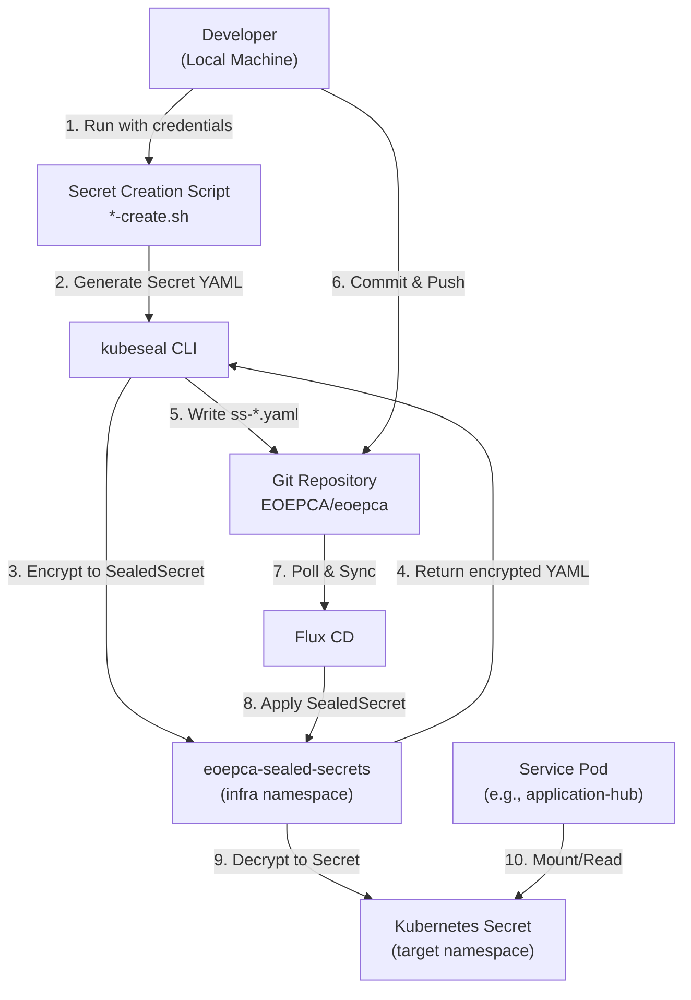
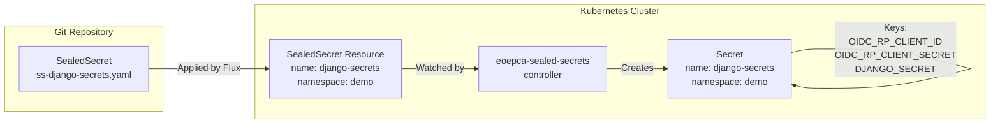
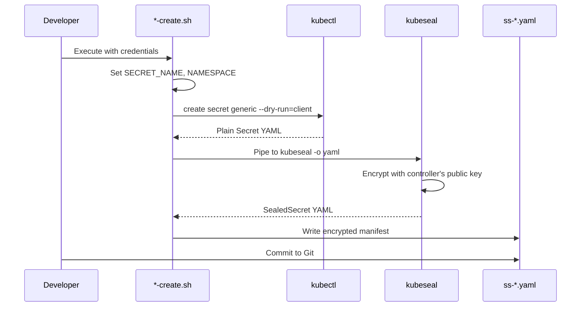
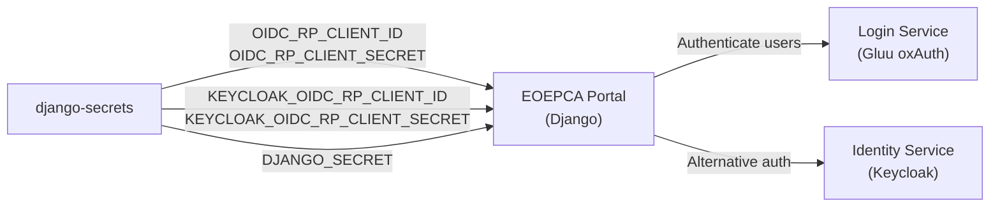
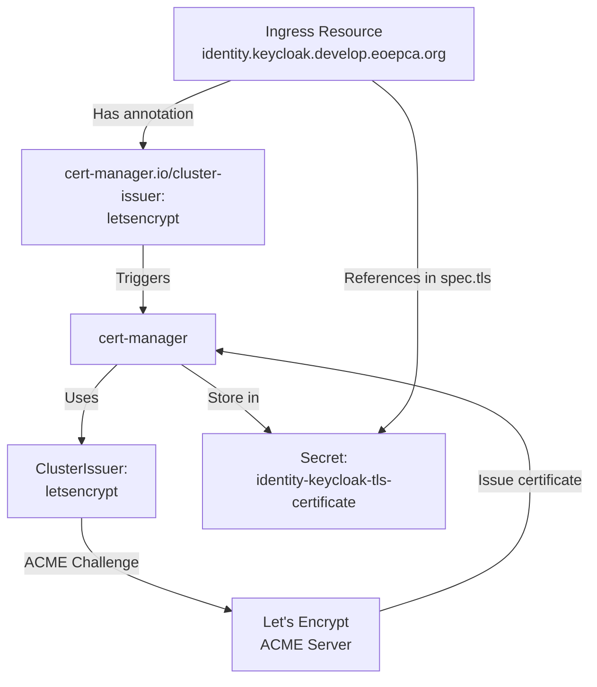
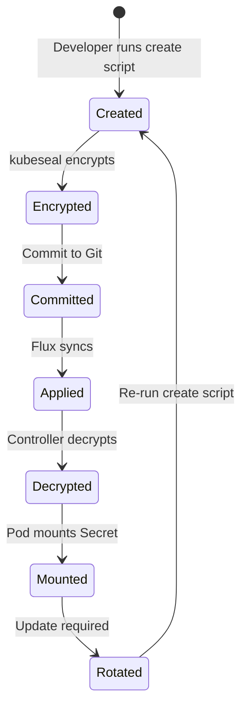

# Configuration and Secrets Management

<details>
<summary>Relevant source files</summary>

The following files were used as context for generating this wiki page:

- [system/clusters/creodias/processing-and-chaining/application-hub-sealed-secrets-create.sh](system/clusters/creodias/processing-and-chaining/application-hub-sealed-secrets-create.sh)
- [system/clusters/creodias/processing-and-chaining/application-hub-sealed-secrets.yaml](system/clusters/creodias/processing-and-chaining/application-hub-sealed-secrets.yaml)
- [system/clusters/creodias/processing-and-chaining/proc-application-hub.yaml](system/clusters/creodias/processing-and-chaining/proc-application-hub.yaml)
- [system/clusters/creodias/system/demo/hr-eoepca-portal.yaml](system/clusters/creodias/system/demo/hr-eoepca-portal.yaml)
- [system/clusters/creodias/system/demo/ss-django-secrets-create.sh](system/clusters/creodias/system/demo/ss-django-secrets-create.sh)
- [system/clusters/creodias/system/demo/ss-django-secrets.yaml](system/clusters/creodias/system/demo/ss-django-secrets.yaml)
- [system/clusters/creodias/system/test/identity-dummy-service-ingress.yaml](system/clusters/creodias/system/test/identity-dummy-service-ingress.yaml)
- [system/clusters/creodias/user-management/um-identity-service.yaml](system/clusters/creodias/user-management/um-identity-service.yaml)

</details>


This page documents the configuration and secrets management patterns used throughout the EOEPCA platform. It covers the SealedSecrets system for storing encrypted credentials in Git, OIDC client configuration, TLS certificate management via cert-manager, and the workflows for creating and referencing secrets in service deployments.

For information about OIDC client registration and OAuth2 flows, see [OIDC Client Configuration](#10.2). For policy management and resource protection configuration, see [Policy Enforcement (PEP/PDP)](#4.3).

## Purpose and Scope

EOEPCA uses a GitOps deployment model where all configuration is stored in Git repositories. This creates a challenge for managing sensitive data like OIDC client secrets, database passwords, and API keys. The platform addresses this using the Bitnami SealedSecrets controller, which enables storing encrypted secrets in Git that can only be decrypted by the Kubernetes cluster. This page covers:

- The SealedSecrets encryption/decryption workflow
- OIDC client credential management for OAuth2 authentication
- TLS certificate provisioning via cert-manager and Let's Encrypt
- Patterns for referencing secrets in HelmRelease configurations
- Scripts and procedures for creating and updating secrets

## Secrets Management Architecture

The EOEPCA platform uses a layered approach to secrets management, with encryption at rest in Git and decryption only within the Kubernetes cluster.



**Sources:** [system/clusters/creodias/processing-and-chaining/application-hub-sealed-secrets-create.sh:1-36](), [system/clusters/creodias/system/demo/ss-django-secrets-create.sh:1-33]()

## SealedSecrets System

### Controller Configuration

The SealedSecrets controller is deployed in the `infra` namespace with the name `eoepca-sealed-secrets`. This controller holds the private key used to decrypt SealedSecret resources into standard Kubernetes Secrets.

| Component | Value |
|-----------|-------|
| Controller Name | `eoepca-sealed-secrets` |
| Controller Namespace | `infra` |
| API Version | `bitnami.com/v1alpha1` |
| Kind | `SealedSecret` |

### SealedSecret Structure

SealedSecrets are custom Kubernetes resources that contain encrypted data. The controller watches for these resources and automatically creates corresponding Secrets in the target namespace.



The SealedSecret manifest structure follows this pattern:

[system/clusters/creodias/system/demo/ss-django-secrets.yaml:1-17]()

Key elements:
- `metadata.name`: Name of the Secret to be created
- `metadata.namespace`: Target namespace for the Secret
- `spec.encryptedData`: Map of key-value pairs with encrypted values
- `spec.template.metadata`: Template for the created Secret

**Sources:** [system/clusters/creodias/system/demo/ss-django-secrets.yaml:1-17](), [system/clusters/creodias/processing-and-chaining/application-hub-sealed-secrets.yaml:1-17]()

## Secret Creation Workflow

### Creation Script Pattern

Each SealedSecret has an associated creation script that follows a standard pattern. These scripts are typically named `ss-<secret-name>-create.sh` and use `kubectl` and `kubeseal` to generate encrypted manifests.



### Application Hub Secret Creation

The Application Hub requires three secrets for OAuth2 authentication with the Login Service:

[system/clusters/creodias/processing-and-chaining/application-hub-sealed-secrets-create.sh:1-36]()

Key steps in the script:
1. Define secret values (lines 3-5): `JUPYTERHUB_CRYPT_KEY`, `OAUTH_CLIENT_ID`, `OAUTH_CLIENT_SECRET`
2. Create a temporary Secret manifest using `kubectl create secret generic --dry-run=client` (lines 26-31)
3. Pipe to `kubeseal` with controller specification (line 35)
4. Output encrypted SealedSecret to `application-hub-sealed-secrets.yaml`

The `kubeseal` command parameters:
- `--controller-name eoepca-sealed-secrets`: Specifies the controller instance
- `--controller-namespace infra`: Namespace where the controller is deployed
- `-o yaml`: Output format

**Sources:** [system/clusters/creodias/processing-and-chaining/application-hub-sealed-secrets-create.sh:1-36]()

### Django Portal Secret Creation

The EOEPCA Portal (Django-based) requires OIDC credentials for both the Login Service (Gluu) and Identity Service (Keycloak):

[system/clusters/creodias/system/demo/ss-django-secrets-create.sh:1-33]()

This script accepts five parameters:
1. `client_id`: OIDC client ID for Gluu
2. `client_secret`: OIDC client secret for Gluu
3. `django_secret`: Django SECRET_KEY for session management
4. `keycloak_client_id`: OIDC client ID for Keycloak
5. `keycloak_client_secret`: OIDC client secret for Keycloak

The `secretYaml()` function (lines 22-30) creates a Secret with all five literal values, then pipes to `kubeseal` for encryption.

**Sources:** [system/clusters/creodias/system/demo/ss-django-secrets-create.sh:1-33]()

## Secret Reference Patterns

### ExistingSecret Pattern

Services reference SealedSecrets (after they're decrypted to Secrets) using the `existingSecret` Helm value pattern:

[system/clusters/creodias/processing-and-chaining/proc-application-hub.yaml:34]()

This tells the JupyterHub chart to use the `application-hub-secrets` Secret instead of generating one. The hub component then references individual keys within that Secret.

### ValueFrom SecretKeyRef Pattern

For environment variables, secrets are injected using the `valueFrom.secretKeyRef` pattern:

[system/clusters/creodias/processing-and-chaining/proc-application-hub.yaml:47-63]()

This pattern specifies:
- `name`: The Secret name (e.g., `application-hub-secrets`)
- `key`: The specific key within the Secret (e.g., `JUPYTERHUB_CRYPT_KEY`)

The Kubernetes kubelet retrieves the value from the Secret and injects it into the pod's environment.

**Sources:** [system/clusters/creodias/processing-and-chaining/proc-application-hub.yaml:34-63]()

## OIDC Client Secrets

### Application Hub OAuth2 Configuration

The Application Hub uses OAuth2 to authenticate users via the Login Service. The OAuth2 flow requires three pieces of configuration:

| Secret Key | Purpose | Usage |
|------------|---------|-------|
| `JUPYTERHUB_CRYPT_KEY` | Encrypts JupyterHub cookies and tokens | Generated via `openssl rand -hex 32` |
| `OAUTH_CLIENT_ID` | OIDC client identifier | Registered in Login Service |
| `OAUTH_CLIENT_SECRET` | OIDC client secret | Obtained from Login Service |

These values are referenced in the HelmRelease configuration:

[system/clusters/creodias/processing-and-chaining/proc-application-hub.yaml:38-41]()

The OAuth2 URLs point to the Login Service endpoints:
- Authorization: `https://auth.develop.eoepca.org/oxauth/restv1/authorize`
- Token: `https://auth.develop.eoepca.org/oxauth/restv1/token`
- UserInfo: `https://auth.develop.eoepca.org/oxauth/restv1/userinfo`

**Sources:** [system/clusters/creodias/processing-and-chaining/proc-application-hub.yaml:38-63](), [system/clusters/creodias/processing-and-chaining/application-hub-sealed-secrets.yaml:8-11]()

### Django Portal Multi-Provider Configuration

The EOEPCA Portal supports authentication against both the Login Service (Gluu) and Identity Service (Keycloak), requiring separate OIDC credentials for each:



The SealedSecret contains five keys:
- `OIDC_RP_CLIENT_ID` / `OIDC_RP_CLIENT_SECRET`: Gluu credentials
- `KEYCLOAK_OIDC_RP_CLIENT_ID` / `KEYCLOAK_OIDC_RP_CLIENT_SECRET`: Keycloak credentials
- `DJANGO_SECRET`: Django application secret key

**Sources:** [system/clusters/creodias/system/demo/ss-django-secrets.yaml:8-11](), [system/clusters/creodias/system/demo/ss-django-secrets-create.sh:23-28]()

## TLS Certificate Management

### Cert-Manager and Let's Encrypt

EOEPCA uses cert-manager to automatically provision and renew TLS certificates from Let's Encrypt. Services declare certificate requirements via Ingress annotations.



### Identity Service TLS Configuration

The Identity Service components each have dedicated TLS certificates:

[system/clusters/creodias/user-management/um-identity-service.yaml:23-34]()

Pattern for each component:
1. **Annotation**: `cert-manager.io/cluster-issuer: letsencrypt` triggers certificate issuance
2. **Hosts**: Define the FQDN(s) for the certificate
3. **TLS Section**: References the Secret name where the certificate will be stored

The same pattern is repeated for:
- `identity.api.develop.eoepca.org` → `identity-api-tls-certificate`
- `identity.manager.develop.eoepca.org` → `identity-manager-tls-certificate`
- `identity.gatekeeper.develop.eoepca.org` → `identity-gatekeeper-tls-certificate`

**Sources:** [system/clusters/creodias/user-management/um-identity-service.yaml:23-76]()

### Application Hub TLS Configuration

The Application Hub uses a similar pattern:

[system/clusters/creodias/processing-and-chaining/proc-application-hub.yaml:24-27]()

The TLS secret `applicationhub-tls` is automatically created and managed by cert-manager for the host `applicationhub.develop.eoepca.org`.

**Sources:** [system/clusters/creodias/processing-and-chaining/proc-application-hub.yaml:16-27]()

### Portal TLS Configuration

The EOEPCA Portal demonstrates the full annotation and TLS specification pattern:

[system/clusters/creodias/system/demo/hr-eoepca-portal.yaml:22-35]()

Key elements:
- `kubernetes.io/ingress.class: nginx`: Specifies the ingress controller
- `cert-manager.io/cluster-issuer: letsencrypt`: Requests automatic certificate provisioning
- `spec.tls.secretName`: Destination for the certificate Secret
- `spec.tls.hosts`: Must match the hosts in `spec.rules`

**Sources:** [system/clusters/creodias/system/demo/hr-eoepca-portal.yaml:22-35]()

## Nginx Authentication Integration

### Identity Service Integration

Some services use Nginx ingress configuration to integrate with the Identity Service's gatekeeper component for authentication:

[system/clusters/creodias/system/test/identity-dummy-service-ingress.yaml:9-31]()

This configuration demonstrates two key patterns:

1. **Authentication Snippet** (lines 9-17): Configures `auth_request /auth` to delegate authentication to the Identity Service gatekeeper, with CORS headers for browser access.

2. **Server Snippet** (lines 18-31): Defines the internal `/auth` location that proxies to `identity-gatekeeper.um.svc.cluster.local:3000`, forwarding request metadata for validation.

The gatekeeper validates the request and returns HTTP 200 (authorized) or 401/403 (unauthorized), controlling access to the backend service.

**Sources:** [system/clusters/creodias/system/test/identity-dummy-service-ingress.yaml:9-31]()

## Configuration Management Best Practices

### Secret Lifecycle



### Secret Rotation Procedure

To rotate a secret:

1. Generate new credentials from the identity provider
2. Update values in the `*-create.sh` script
3. Re-run the script to generate a new encrypted SealedSecret
4. Commit the updated `ss-*.yaml` file to Git
5. Flux will detect the change and apply it
6. The SealedSecrets controller will update the Secret
7. Restart affected pods to pick up the new values

### Separation of Concerns

| Secret Type | Scope | Examples |
|-------------|-------|----------|
| OIDC Credentials | Service-specific | `OAUTH_CLIENT_ID`, `OAUTH_CLIENT_SECRET` |
| Application Keys | Service-specific | `JUPYTERHUB_CRYPT_KEY`, `DJANGO_SECRET` |
| TLS Certificates | Ingress/Domain | `*-tls-certificate` secrets |
| Database Credentials | Shared infrastructure | PostgreSQL passwords |

OIDC credentials are unique per service and registered separately in the identity provider. Application-specific secrets like `JUPYTERHUB_CRYPT_KEY` are generated randomly and used only by that service. TLS certificates are scoped to domain names and automatically managed by cert-manager.

**Sources:** [system/clusters/creodias/processing-and-chaining/application-hub-sealed-secrets-create.sh:1-36](), [system/clusters/creodias/system/demo/ss-django-secrets-create.sh:1-33]()

## Troubleshooting

### Common Issues

| Issue | Symptom | Solution |
|-------|---------|----------|
| Secret not decrypted | SealedSecret exists but Secret doesn't | Check controller logs in `infra` namespace |
| Wrong controller specified | Secret not created | Verify `--controller-name` and `--controller-namespace` in kubeseal command |
| Pod can't read secret | Permission denied | Check RBAC permissions for service account |
| Certificate not issued | Ingress has no TLS | Check cert-manager logs, verify ACME challenge |

### Verification Commands

Check if a SealedSecret was decrypted:
```bash
kubectl get secret <secret-name> -n <namespace>
```

View certificate status:
```bash
kubectl get certificate -n <namespace>
kubectl describe certificate <cert-name> -n <namespace>
```

Check SealedSecrets controller logs:
```bash
kubectl logs -n infra deployment/eoepca-sealed-secrets
```

**Sources:** [system/clusters/creodias/processing-and-chaining/application-hub-sealed-secrets.yaml:1-17](), [system/clusters/creodias/user-management/um-identity-service.yaml:23-76]()