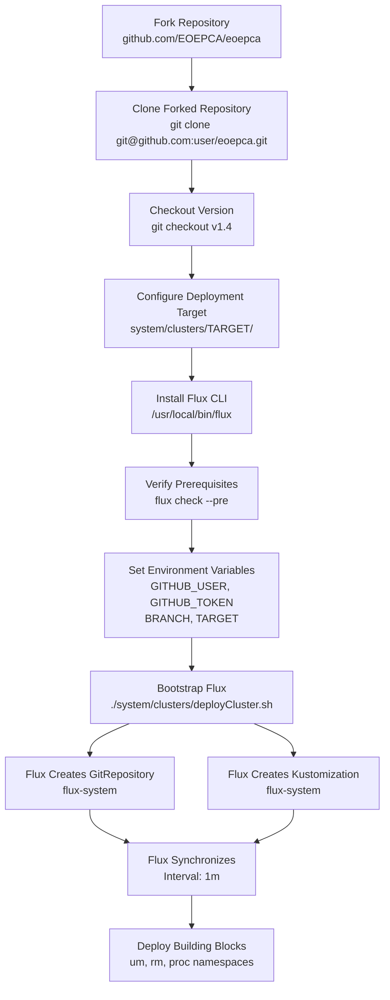
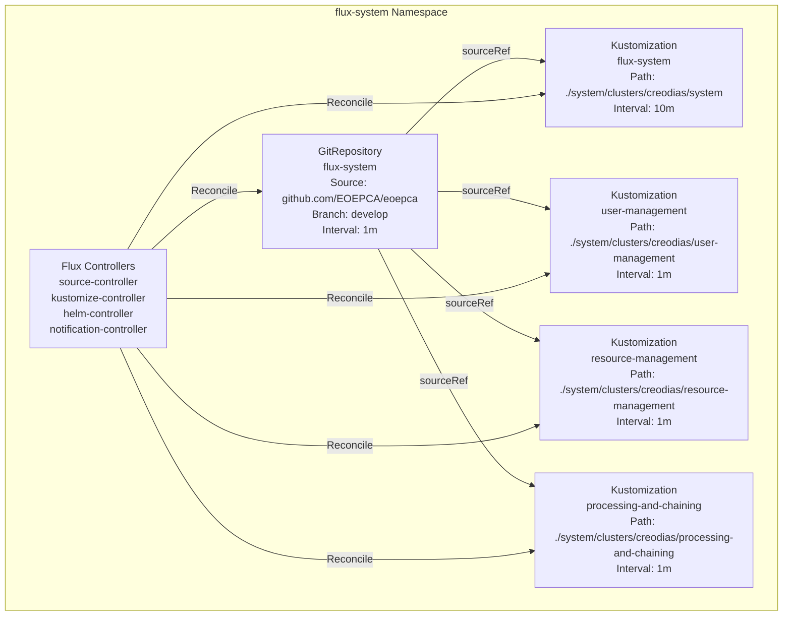
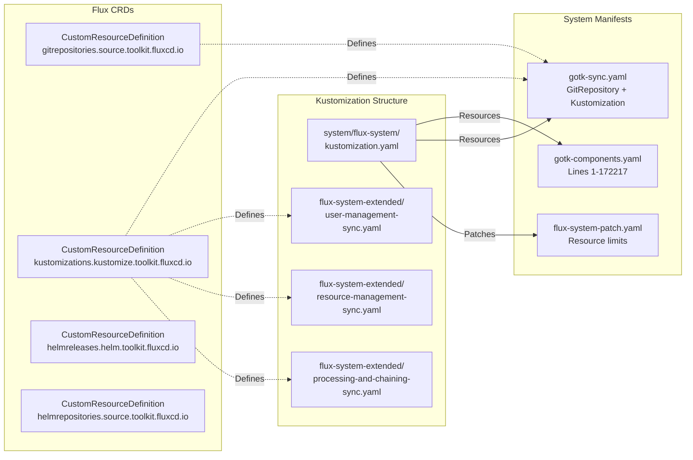
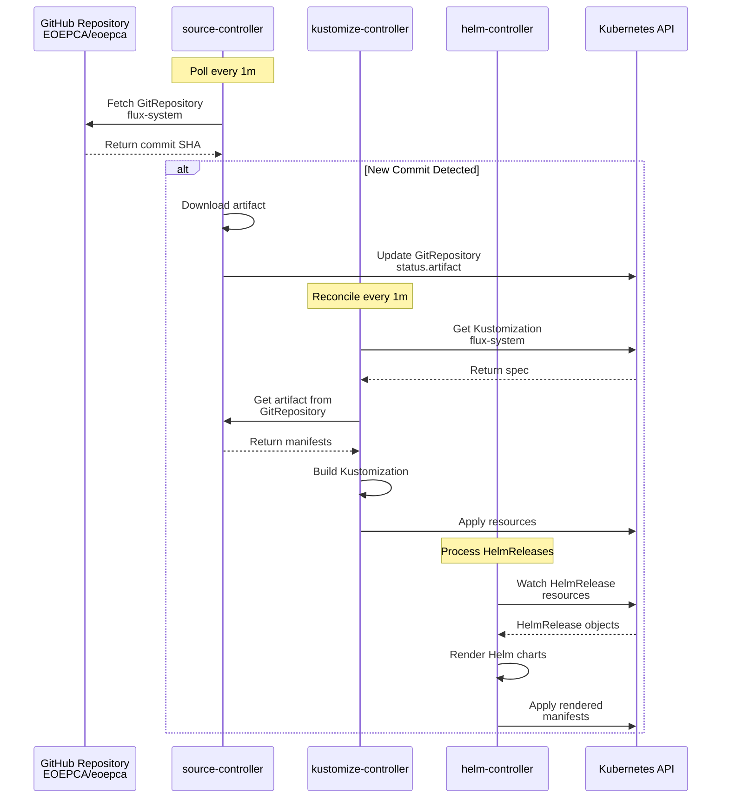

# Deployment Guide

<details>
<summary>Relevant source files</summary>

The following files were used as context for generating this wiki page:

- [README.md](README.md)
- [minikube/README.md](minikube/README.md)
- [system/clusters/README.md](system/clusters/README.md)
- [system/clusters/creodias/system/flux-system-extended/processing-and-chaining-sync.yaml](system/clusters/creodias/system/flux-system-extended/processing-and-chaining-sync.yaml)
- [system/clusters/creodias/system/flux-system-extended/resource-management-sync.yaml](system/clusters/creodias/system/flux-system-extended/resource-management-sync.yaml)
- [system/clusters/creodias/system/flux-system-extended/user-management-sync.yaml](system/clusters/creodias/system/flux-system-extended/user-management-sync.yaml)
- [system/clusters/creodias/system/flux-system/flux-system-patch.yaml](system/clusters/creodias/system/flux-system/flux-system-patch.yaml)
- [system/clusters/creodias/system/flux-system/gotk-components.yaml](system/clusters/creodias/system/flux-system/gotk-components.yaml)
- [system/clusters/creodias/system/flux-system/gotk-sync.yaml](system/clusters/creodias/system/flux-system/gotk-sync.yaml)
- [system/clusters/creodias/system/flux-system/kustomization.yaml](system/clusters/creodias/system/flux-system/kustomization.yaml)

</details>


## Purpose and Scope

This guide provides detailed instructions for deploying the EOEPCA system using a GitOps approach with Flux CD. It covers the deployment process, prerequisites, configuration steps, and synchronization mechanisms. This document focuses specifically on the deployment mechanics and Flux CD setup.

For infrastructure provisioning (OpenStack, Terraform, Kubernetes cluster setup), see [Infrastructure Provisioning](#2.2). For post-deployment validation, see [Testing and Validation](#2.3). For architectural details about the GitOps model, see [GitOps and Flux CD](#3.2).

**Sources:** [README.md:72-98](), [system/clusters/README.md:1-95]()

---

## Prerequisites

Before deploying the EOEPCA system, ensure the following prerequisites are met:

### Required Tools

| Tool | Purpose | Installation |
|------|---------|--------------|
| `kubectl` | Kubernetes cluster administration | See [Kubernetes docs](https://kubernetes.io/docs/tasks/tools/install-kubectl/) or use `bin/install-kubectl.sh` |
| `flux` | GitOps continuous delivery | Installed via `curl -s https://toolkit.fluxcd.io/install.sh \| sudo bash` |
| `git` | Version control and repository management | Standard package manager installation |

### Kubernetes Cluster

A running Kubernetes cluster is required. Supported options include:

- **Cloud Deployment**: Rancher Kubernetes Engine (RKE) on OpenStack - see [Infrastructure Provisioning](#2.2)
- **Local Development**: Minikube or k3s - see [minikube/README.md:1-53]()

### GitHub Credentials

Flux requires GitHub access with a Personal Access Token:

```bash
export GITHUB_USER=<your-username>
export GITHUB_TOKEN=<your-token>
```

The token must include all `repo` scopes. Create tokens at: https://github.com/settings/tokens

**Sources:** [system/clusters/README.md:10-44](), [minikube/README.md:1-53]()

---

## Deployment Workflow

The following diagram illustrates the complete deployment workflow from repository fork to synchronized cluster:



**Deployment Workflow Phases**

1. **Repository Preparation**: Fork and clone the EOEPCA repository to enable GitOps write access
2. **Configuration**: Customize deployment target configuration files for your environment
3. **Flux Setup**: Install Flux CLI and verify cluster compatibility
4. **Bootstrap**: Initialize Flux in the cluster, creating `GitRepository` and `Kustomization` resources
5. **Synchronization**: Flux continuously reconciles cluster state with Git repository
6. **Deployment**: Building blocks are deployed to respective namespaces

**Sources:** [README.md:79-93](), [system/clusters/README.md:51-78]()

---

## Step 1: Fork and Clone Repository

Fork the EOEPCA repository to your GitHub account to support GitOps write access. Flux requires write permissions to commit deployment state.

```bash
# Clone your forked repository
git clone git@github.com:<your-username>/eoepca.git
cd eoepca

# Checkout specific release version
git checkout v1.4
```

The `develop` branch can be used for the latest development version instead of a tagged release.

**Sources:** [README.md:79-86]()

---

## Step 2: Install Flux CD

Install the Flux CLI to `/usr/local/bin/flux`:

```bash
curl -s https://toolkit.fluxcd.io/install.sh | sudo bash
```

Verify installation and prerequisites:

```bash
flux check --pre
```

This validates that the Kubernetes cluster meets Flux requirements (Kubernetes version, RBAC enabled, etc.).

**Important**: The `flux` CLI relies on the `KUBECONFIG` environment variable (defaults to `~/.kube/config`). Unlike `kubectl`, Flux does not support `KUBECONFIG` as a colon-delimited path list. Set it to a single file path.

**Sources:** [system/clusters/README.md:9-29]()

---

## Step 3: Configure Deployment Target

The repository contains multiple deployment target configurations under `system/clusters/`:

| Target | Purpose | Path |
|--------|---------|------|
| `creodias` | Production deployment to CREODIAS OpenStack | `system/clusters/creodias/` |
| `develop` | Development deployment | `system/clusters/develop/` |
| `minikube` | Local development deployment | `system/clusters/minikube/` |

### Customize for Your Environment

Each deployment target contains environment-specific configuration, particularly:

1. **Public IP Address**: Replace references to the default public IP throughout configuration files
2. **DNS Names**: Update `nip.io` hostname patterns with your cluster's public IP
3. **Ingress Hostnames**: Update Kubernetes Ingress resources with your domain

For example, the CREODIAS deployment uses IP `185.52.193.87`. Search and replace:
- `185.52.193.87` → your public IP (with dots)
- `185-52-193-87` → your public IP (with dashes for nip.io)

### Dynamic DNS with nip.io

EOEPCA uses [nip.io](https://nip.io/) for dynamic DNS, embedding IP addresses in hostnames:

```
<service-name>.<public-ip-with-dashes>.nip.io
```

Example: `workspace-api.192-168-49-2.nip.io` resolves to `192.168.49.2`

This approach avoids the need for DNS server configuration during development/testing.

**Sources:** [README.md:100-112](), [system/clusters/README.md:45-50]()

---

## Step 4: Bootstrap Flux in Cluster

The following diagram shows the Flux resource structure created during bootstrap:



### Execute Bootstrap Script

Run the deployment script with appropriate environment variables:

```bash
export GITHUB_USER=<your-username>
export GITHUB_TOKEN=<your-token>
export BRANCH=v1.4              # or develop
export TARGET=minikube          # or creodias, develop

./system/clusters/deployCluster.sh
```

### Script Environment Variables

The `deployCluster.sh` script accepts:

- **BRANCH**: Git branch to synchronize (defaults to current working branch)
- **TARGET**: Deployment target directory name under `system/clusters/` (defaults to `minikube`)

### Bootstrap Process

The script executes `flux bootstrap` which:

1. Installs Flux controllers in the `flux-system` namespace
2. Creates a `GitRepository` resource pointing to your repository
3. Creates a root `Kustomization` resource for the system path
4. Configures write access via SSH deploy key
5. Commits Flux manifests back to your repository

For personal GitHub accounts, modify the bootstrap command:

```bash
flux bootstrap github \
  --owner=$GITHUB_USER \
  --repository=eoepca \
  --branch="${BRANCH}" \
  --path="system/clusters/${TARGET}/system" \
  --personal
```

**Sources:** [system/clusters/README.md:51-78](), [system/clusters/creodias/system/flux-system/gotk-sync.yaml:1-28]()

---

## Flux Resource Structure

The following diagram maps Flux CustomResourceDefinitions to their manifest files:



### Core Flux Components

The `gotk-components.yaml` manifest defines all Flux CRDs and controllers:

- **source-controller**: Fetches artifacts from Git/Helm/S3 sources
- **kustomize-controller**: Applies Kustomize overlays
- **helm-controller**: Manages HelmRelease resources
- **notification-controller**: Sends alerts and handles webhooks

**Sources:** [system/clusters/creodias/system/flux-system/gotk-components.yaml:1-100](), [system/clusters/creodias/system/flux-system/kustomization.yaml:1-8]()

---

## GitRepository Configuration

The `GitRepository` resource defines the source of truth:

```yaml
# From: system/clusters/creodias/system/flux-system/gotk-sync.yaml
apiVersion: source.toolkit.fluxcd.io/v1beta2
kind: GitRepository
metadata:
  name: flux-system
  namespace: flux-system
spec:
  interval: 1m0s
  ref:
    branch: develop
  secretRef:
    name: flux-system
  url: ssh://git@github.com/EOEPCA/eoepca
```

**Key Fields:**
- `interval`: How often to poll the Git repository (1 minute)
- `ref.branch`: Branch to track (`develop` or `v1.4`)
- `secretRef`: SSH credentials for repository access
- `url`: Repository SSH URL

**Sources:** [system/clusters/creodias/system/flux-system/gotk-sync.yaml:3-14]()

---

## Kustomization Resources

The root `Kustomization` resource triggers deployment:

```yaml
# From: system/clusters/creodias/system/flux-system/gotk-sync.yaml
apiVersion: kustomize.toolkit.fluxcd.io/v1beta2
kind: Kustomization
metadata:
  name: flux-system
  namespace: flux-system
spec:
  interval: 10m0s
  path: ./system/clusters/creodias/system
  prune: true
  sourceRef:
    kind: GitRepository
    name: flux-system
```

**Key Fields:**
- `interval`: Reconciliation frequency (10 minutes, overridden to 1m by patch)
- `path`: Directory path within repository to apply
- `prune`: Delete resources removed from Git
- `sourceRef`: References the `flux-system` GitRepository

### Building Block Kustomizations

Additional `Kustomization` resources deploy each building block domain:

| Kustomization | Path | Namespace | File |
|---------------|------|-----------|------|
| `user-management` | `./system/clusters/creodias/user-management` | `flux-system` | [user-management-sync.yaml:1-13]() |
| `resource-management` | `./system/clusters/creodias/resource-management` | `flux-system` | [resource-management-sync.yaml:1-13]() |
| `processing-and-chaining` | `./system/clusters/creodias/processing-and-chaining` | `flux-system` | [processing-and-chaining-sync.yaml:1-13]() |

**Sources:** [system/clusters/creodias/system/flux-system/gotk-sync.yaml:16-28](), [system/clusters/creodias/system/flux-system-extended/user-management-sync.yaml:1-13](), [system/clusters/creodias/system/flux-system-extended/resource-management-sync.yaml:1-13](), [system/clusters/creodias/system/flux-system-extended/processing-and-chaining-sync.yaml:1-13]()

---

## Resource Patches

The `flux-system-patch.yaml` file customizes Flux controller resources:

### Memory Limits

Increases memory allocation for source and kustomize controllers:

```yaml
# From: system/clusters/creodias/system/flux-system/flux-system-patch.yaml
apiVersion: apps/v1
kind: Deployment
metadata:
  name: source-controller
  namespace: flux-system
spec:
  template:
    spec:
      containers:
        - name: manager
          resources:
            limits:
              memory: 2Gi
            requests:
              memory: 500Mi
```

Similar patches apply to `kustomize-controller`. These increased limits accommodate the large EOEPCA deployment manifests.

### Reconciliation Interval

Reduces the root `Kustomization` interval to 1 minute for faster synchronization:

```yaml
# From: system/clusters/creodias/system/flux-system/flux-system-patch.yaml
apiVersion: kustomize.toolkit.fluxcd.io/v1beta2
kind: Kustomization
metadata:
  name: flux-system
  namespace: flux-system
spec:
  interval: 1m0s
```

**Sources:** [system/clusters/creodias/system/flux-system/flux-system-patch.yaml:1-40]()

---

## Deployment Targets Comparison

The following table compares configuration differences across deployment targets:

| Aspect | minikube | creodias | develop |
|--------|----------|----------|---------|
| Infrastructure | Local VM | OpenStack VMs | OpenStack VMs |
| Public IP | `minikube ip` output | Fixed floating IP | Fixed floating IP |
| DNS Pattern | `<service>.192-168-49-2.nip.io` | `<service>.185-52-193-87.nip.io` | `<service>.develop.eoepca.org` |
| Storage Backend | MinIO (local) | CloudFerro S3 + MinIO | CloudFerro S3 + MinIO |
| TLS Certificates | Self-signed or LetsEncrypt | LetsEncrypt | LetsEncrypt |
| Resource Limits | Reduced for single-node | Full production specs | Full production specs |
| Building Blocks | Selective deployment | Full system | Full system |

### Minikube Deployment Considerations

The v1.4 release expanded system components to a level where full deployment in Minikube requires significant resources (8 CPU, 32GB RAM). Consider:

- Deploying selective building blocks
- Using the [Deployment Guide](https://deployment-guide.docs.eoepca.org/) Helm scripts for component-by-component deployment
- Upgrading to k3s for more lightweight execution

**Sources:** [README.md:88-98](), [minikube/README.md:26-49]()

---

## GitOps Synchronization

Flux continuously synchronizes the cluster state with the Git repository:



### Synchronization Intervals

| Controller | Default Interval | Configurable Via |
|------------|------------------|------------------|
| `source-controller` | 1m | `GitRepository.spec.interval` |
| `kustomize-controller` | 1m (patched) | `Kustomization.spec.interval` |
| `helm-controller` | Varies per HelmRelease | `HelmRelease.spec.interval` |

### Triggering Manual Reconciliation

Force immediate reconciliation without waiting for the interval:

```bash
# Reconcile specific Kustomization
flux reconcile kustomization flux-system

# Reconcile GitRepository source
flux reconcile source git flux-system

# Reconcile HelmRelease
flux reconcile helmrelease <release-name> -n <namespace>
```

**Sources:** [system/clusters/README.md:79-86]()

---

## Chart Version Requirements

When using a `GitRepository` as a Helm chart source, chart version numbers must be incremented for Flux to detect updates. Flux tracks the `Chart.yaml` version field to determine if reconciliation is needed.

This is enforced for charts stored in Git rather than Helm repositories. If modifying chart values without changing logic, increment the patch version (e.g., `1.0.0` → `1.0.1`).

**Sources:** [system/clusters/README.md:84-86]()

---

## Undeploying Flux

To remove Flux from the cluster:

```bash
./system/clusters/undeployCluster.sh
```

**Important**: This removes Flux controllers but **does not** uninstall EOEPCA building blocks deployed by Flux. Those must be manually deleted or the cluster destroyed.

To fully clean up:

```bash
# Delete building block namespaces
kubectl delete namespace um rm proc

# Delete Flux namespace
kubectl delete namespace flux-system
```

**Sources:** [system/clusters/README.md:88-95]()

---

## Verification Steps

After bootstrap completes, verify the deployment:

### Check Flux Controllers

```bash
# Verify all Flux controllers are running
kubectl get pods -n flux-system

# Expected output:
# NAME                                       READY   STATUS
# helm-controller-...                        1/1     Running
# kustomize-controller-...                   1/1     Running
# notification-controller-...                1/1     Running
# source-controller-...                      1/1     Running
```

### Check GitRepository Status

```bash
flux get sources git

# Expected output shows artifact fetched successfully
# NAME         READY  MESSAGE
# flux-system  True   Fetched revision: develop/abc123...
```

### Check Kustomization Status

```bash
flux get kustomizations

# Expected output shows all Kustomizations applied
# NAME                      READY  MESSAGE
# flux-system               True   Applied revision: develop/abc123
# user-management           True   Applied revision: develop/abc123
# resource-management       True   Applied revision: develop/abc123
# processing-and-chaining   True   Applied revision: develop/abc123
```

### Check Deployed Resources

```bash
# List HelmReleases across all namespaces
flux get helmreleases --all-namespaces

# Check building block namespaces
kubectl get pods -n um    # User Management
kubectl get pods -n rm    # Resource Management
kubectl get pods -n proc  # Processing & Chaining
```

For comprehensive testing and validation, see [Testing and Validation](#2.3).

**Sources:** [system/clusters/README.md:25-29]()

---

## Troubleshooting Common Issues

### Flux Not Reconciling

**Symptoms**: `GitRepository` or `Kustomization` stuck in failed state

**Resolution**:
```bash
# Check Flux controller logs
kubectl logs -n flux-system deploy/source-controller
kubectl logs -n flux-system deploy/kustomize-controller

# Suspend and resume to reset
flux suspend kustomization flux-system
flux resume kustomization flux-system
```

### KUBECONFIG Path Issues

**Symptoms**: Flux commands fail with "unable to read kubeconfig"

**Resolution**: Set `KUBECONFIG` to a single file path, not a colon-delimited list:
```bash
export KUBECONFIG=~/.kube/config
# NOT: export KUBECONFIG=~/.kube/config:~/.kube/other-config
```

### Authentication Failures

**Symptoms**: `GitRepository` fails with "authentication required"

**Resolution**: Verify GitHub credentials and regenerate deploy key:
```bash
flux create source git flux-system \
  --url=ssh://git@github.com/$GITHUB_USER/eoepca \
  --branch=develop \
  --secret-ref=flux-system
```

### Resource Exhaustion

**Symptoms**: Pods stuck in `Pending` or `OOMKilled` state

**Resolution**: Increase controller resource limits in `flux-system-patch.yaml` or upgrade cluster resources.

**Sources:** [system/clusters/README.md:17-21]()

---

## Alternative Deployment Approach

The [Deployment Guide](https://deployment-guide.docs.eoepca.org/) provides an alternative approach using direct Helm commands instead of Flux GitOps. This approach:

- Provides more detailed component-level documentation
- Uses shell scripts for step-by-step deployment
- Assumes Minikube by default
- Better suited for learning and development

Use the Flux GitOps approach (documented here) for:
- Production deployments
- Continuous delivery requirements
- Multiple cluster management
- Automated reconciliation

Use the Deployment Guide approach for:
- Initial learning and exploration
- Development and testing
- Single-component deployment
- Troubleshooting individual services

**Sources:** [README.md:93-99](), [system/clusters/README.md:3-6]()